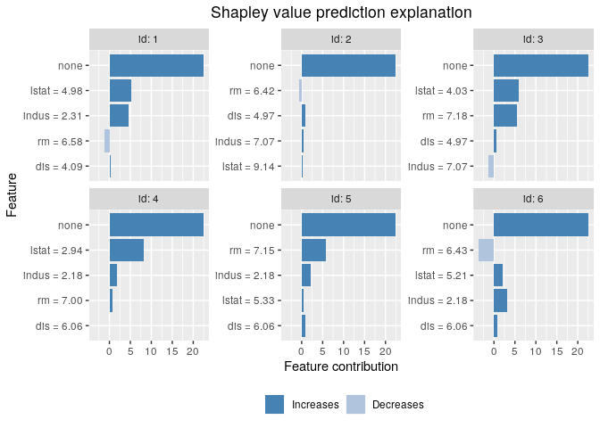

<!-- README.md is generated from README.Rmd. Please edit that file -->

# shapr 

<!-- badges: start -->

[](https://cran.r-project.org/package=shapr)
[](https://cran.r-project.org/package=shapr)
[](https://github.com/NorskRegnesentral/shapr/actions?query=workflow%3AR-CMD-check)
[](https://lifecycle.r-lib.org/articles/stages.html)
[](https://opensource.org/license/mit)
[-10.21105/joss.02027-brightgreen.svg)](https://doi.org/10.21105/joss.02027)
[-2504.01842-b31b1b.svg)](https://arxiv.org/abs/2504.01842)
<!-- badges: end -->

See the pkgdown site at
[norskregnesentral.github.io/shapr/](https://norskregnesentral.github.io/shapr/)
for a complete introduction with examples and documentation of the
package.

For an overview of the methodology and capabilities of the package (per
`shapr` v1.0.4), see the software paper Jullum et al.
([2025](#ref-jullum2025shapr)), available as a preprint
[here](https://arxiv.org/abs/2504.01842).

## NEWS

With `shapr` version 1.0.0 (GitHub only, Nov 2024) and version 1.0.1
(CRAN, Jan 2025), the package underwent a major update, providing a full
restructuring of the code base, and a full suite of new functionality,
including:

- A long list of approaches for estimating the contribution/value
  function $v(S)$, including Variational Autoencoders and
  regression-based methods
- Iterative Shapley value estimation with convergence detection
- Parallelized computations with progress updates
- Reweighted Kernel SHAP for faster convergence
- New function `explain_forecast()` for explaining forecasts
- Asymmetric and causal Shapley values
- Several other methodological, computational and user-experience
  improvements
- Python wrapper `shaprpy` making the core functionality of `shapr`
  available in Python

See the
[NEWS](https://norskregnesentral.github.io/shapr/news/index.html) for a
complete list.

### Coming from shapr \< 1.0.0?

`shapr` version \>= 1.0.0 comes with a number of breaking changes. Most
notably, we moved from using two functions (`shapr()` and `explain()`)
to one function (`explain()`). In addition, custom models are now
explained by passing the prediction function directly to `explain()`.
Several input arguments were renamed, and a few functions for edge cases
were removed to simplify the code base.

Click
[here](https://github.com/NorskRegnesentral/shapr/blob/cranversion_0.2.2/README.md)
to view a version of this README with the old syntax (v0.2.2).

### Python wrapper

We provide a Python wrapper (`shaprpy`) which allows explaining Python
models with the methodology implemented in `shapr`, directly from
Python. The wrapper calls R internally and therefore requires an
installation of R. See
[here](https://norskregnesentral.github.io/shapr/shaprpy.html) for
installation instructions and examples.

## The package

The `shapr` R package implements an enhanced version of the Kernel SHAP
method for approximating Shapley values, with a strong focus on
conditional Shapley values. The core idea is to remain completely
model-agnostic while offering a variety of methods for estimating
contribution functions, enabling accurate computation of conditional
Shapley values across different feature types, dependencies, and
distributions. The package also includes evaluation metrics to compare
various approaches. With features like parallelized computations,
convergence detection, progress updates, and extensive plotting options,
shapr is a highly efficient and user-friendly tool, delivering precise
estimates of conditional Shapley values, which are critical for
understanding how features truly contribute to predictions.

A basic example is provided below. Otherwise, we refer to the [pkgdown
website](https://norskregnesentral.github.io/shapr/) and the vignettes
there for details and further examples.

## Installation

`shapr` is available on [CRAN](https://cran.r-project.org/package=shapr)
and can be installed in R as:

``` r
install.packages("shapr")
```

To install the development version of `shapr`, available on GitHub, use

``` r
remotes::install_github("NorskRegnesentral/shapr")
```

To also install all dependencies, use

``` r
remotes::install_github("NorskRegnesentral/shapr", dependencies = TRUE)
```

## Example

`shapr` supports computation of Shapley values with any predictive model
that takes a set of numeric features and produces a numeric outcome.

The following example shows how a simple `xgboost` model is trained
using the *airquality* dataset, and how `shapr` explains the individual
predictions.

We first enable parallel computation and progress updates with the
following code chunk. These are optional, but recommended for improved
performance and user-friendliness, particularly for problems with many
features.

``` r
# Enable parallel computation
# Requires the future and future_lapply packages
future::plan("multisession", workers = 2) # Increase the number of workers for increased performance with many features

# Enable progress updates of the v(S) computations
# Requires the progressr package
progressr::handlers(global = TRUE)
progressr::handlers("cli") # Using the cli package as backend (recommended for the estimates of the remaining time)
```

Here is the actual example:

``` r
library(xgboost)
library(shapr)

data("airquality")
data <- data.table::as.data.table(airquality)
data <- data[complete.cases(data), ]

x_var <- c("Solar.R", "Wind", "Temp", "Month")
y_var <- "Ozone"

ind_x_explain <- 1:6
x_train <- data[-ind_x_explain, ..x_var]
y_train <- data[-ind_x_explain, get(y_var)]
x_explain <- data[ind_x_explain, ..x_var]

# Look at the dependence between the features
cor(x_train)
#>            Solar.R       Wind       Temp      Month
#> Solar.R  1.0000000 -0.1243826  0.3333554 -0.0710397
#> Wind    -0.1243826  1.0000000 -0.5152133 -0.2013740
#> Temp     0.3333554 -0.5152133  1.0000000  0.3400084
#> Month   -0.0710397 -0.2013740  0.3400084  1.0000000

# Fit a basic xgboost model to the training data
model <- xgboost(
  x = x_train,
  y = y_train,
  nround = 20,
  verbosity = 0
)

# Specify phi_0, i.e., the expected prediction without any features
p0 <- mean(y_train)

# Compute Shapley values with Kernel SHAP, accounting for feature dependence using
# the empirical (conditional) distribution approach with bandwidth parameter sigma = 0.1 (default)
explanation <- explain(
  model = model,
  x_explain = x_explain,
  x_train = x_train,
  approach = "empirical",
  phi0 = p0,
  seed = 1
)
#> 
#> ── Starting `shapr::explain()` at 2025-12-19 20:36:39 ──────────────────────────
#> ℹ `max_n_coalitions` is `NULL` or larger than `2^n_features = 16`, and is
#>   therefore set to `2^n_features = 16`.
#> 
#> 
#> ── Explanation overview ──
#> 
#> 
#> 
#> • Model class: <xgboost>
#> 
#> • v(S) estimation class: Monte Carlo integration
#> 
#> • Approach: empirical
#> 
#> • Procedure: Non-iterative
#> 
#> • Number of Monte Carlo integration samples: 1000
#> 
#> • Number of feature-wise Shapley values: 4
#> 
#> • Number of observations to explain: 6
#> 
#> • Computations (temporary) saved at:
#> 'C:\Users\jullum\AppData\Local\Temp\Rtmp4Wl2F1\shapr_obj_c8e47af5392e.rds'
#> 
#> 
#> 
#> ── Main computation started ──
#> 
#> 
#> 
#> ℹ Using 16 of 16 coalitions.

# Print the Shapley values for the observations to explain.
print(explanation)
#>    explain_id  none Solar.R   Wind   Temp  Month
#>         <int> <num>   <num>  <num>  <num>  <num>
#> 1:          1  43.1  12.315   2.78 -27.98  -2.07
#> 2:          2  43.1  -8.514   4.69 -13.96  -7.85
#> 3:          3  43.1  -2.767 -10.27  -9.95  -3.87
#> 4:          4  43.1  -0.945  -4.18 -14.06  -6.80
#> 5:          5  43.1   4.058  -2.07 -11.94 -12.02
#> 6:          6  43.1  -0.290  -7.28 -13.46  -6.50

# Provide a formatted summary of the shapr object
summary(explanation)
#> 
#> ── Summary of Shapley value explanation ────────────────────────────────────────
#> • Computed with `shapr::explain()` in 3.3 seconds, started 2025-12-19 20:36:39
#> • Model class: <xgboost>
#> • v(S) estimation class: Monte Carlo integration
#> • Approach: empirical
#> • Procedure: Non-iterative
#> • Number of Monte Carlo integration samples: 1000
#> • Number of feature-wise Shapley values: 4
#> • Number of observations to explain: 6
#> • Number of coalitions used: 16 (of total 16)
#> • Computations (temporary) saved at:
#> 'C:\Users\jullum\AppData\Local\Temp\Rtmp4Wl2F1\shapr_obj_c8e47af5392e.rds'
#> 
#> ── Estimated Shapley values 
#>    explain_id   none Solar.R   Wind   Temp  Month
#>         <int> <char>  <char> <char> <char> <char>
#> 1:          1  43.09   12.31   2.78 -27.98  -2.07
#> 2:          2  43.09   -8.51   4.69 -13.96  -7.85
#> 3:          3  43.09   -2.77 -10.27  -9.95  -3.87
#> 4:          4  43.09   -0.95  -4.18 -14.06  -6.80
#> 5:          5  43.09    4.06  -2.07 -11.94 -12.02
#> 6:          6  43.09   -0.29  -7.28 -13.46  -6.50
#> ── Estimated MSEv 
#> Estimated MSE of v(S) = 208 (with sd = 116)

# Finally, we plot the resulting explanations
plot(explanation)
```



See Jullum et al. ([2025](#ref-jullum2025shapr)) (preprint available
[here](https://arxiv.org/abs/2504.01842)) for a software paper with an
overview of the methodology and capabilities of the package (as of
v1.0.4). See the [general usage
vignette](https://norskregnesentral.github.io/shapr/articles/general_usage.html)
for further basic usage examples and brief introductions to the
methodology. For more thorough information about the underlying
methodology, see methodological papers Aas, Jullum, and Løland
([2021](#ref-aas2019explaining)), Redelmeier, Jullum, and Aas
([2020](#ref-redelmeier2020explaining)), Jullum, Redelmeier, and Aas
([2021](#ref-jullum2021efficient)), Olsen et al.
([2022](#ref-olsen2022using)), Olsen et al.
([2024](#ref-olsen2024comparative)). See also Sellereite and Jullum
([2019](#ref-sellereite2019shapr)) for a very brief paper about a
previous version (v0.1.1) of the package (with a different structure,
syntax, and significantly less functionality).

## Contribution

All feedback and suggestions are very welcome. Details on how to
contribute can be found
[here](https://norskregnesentral.github.io/shapr/CONTRIBUTING.html). If
you have any questions or comments, feel free to open an issue
[here](https://github.com/NorskRegnesentral/shapr/issues).

Please note that the `shapr` project is released with a [Contributor
Code of
Conduct](https://norskregnesentral.github.io/shapr/CODE_OF_CONDUCT.html).
By contributing to this project, you agree to abide by its terms.

## References

<div id="refs" class="references csl-bib-body hanging-indent"
entry-spacing="0">

<div id="ref-aas2019explaining" class="csl-entry">

Aas, Kjersti, Martin Jullum, and Anders Løland. 2021. “Explaining
Individual Predictions When Features Are Dependent: More Accurate
Approximations to Shapley Values.” *Artificial Intelligence* 298.
<https://doi.org/10.1016/j.artint.2021.103502>.

</div>

<div id="ref-jullum2025shapr" class="csl-entry">

Jullum, Martin, Lars Henry Berge Olsen, Jon Lachmann, and Annabelle
Redelmeier. 2025. “Shapr: Explaining Machine Learning Models with
Conditional Shapley Values in R and Python.” *arXiv Preprint
arXiv:2504.01842*. <https://arxiv.org/abs/2504.01842>.

</div>

<div id="ref-jullum2021efficient" class="csl-entry">

Jullum, Martin, Annabelle Redelmeier, and Kjersti Aas. 2021. “Efficient
and Simple Prediction Explanations with groupShapley: A Practical
Perspective.” In *Proceedings of the 2nd Italian Workshop on Explainable
Artificial Intelligence*, 28–43. CEUR Workshop Proceedings.

</div>

<div id="ref-olsen2022using" class="csl-entry">

Olsen, Lars Henry Berge, Ingrid Kristine Glad, Martin Jullum, and
Kjersti Aas. 2022. “Using Shapley Values and Variational Autoencoders to
Explain Predictive Models with Dependent Mixed Features.” *Journal of
Machine Learning Research* 23 (213): 1–51.

</div>

<div id="ref-olsen2024comparative" class="csl-entry">

———. 2024. “A Comparative Study of Methods for Estimating Model-Agnostic
Shapley Value Explanations.” *Data Mining and Knowledge Discovery*,
1–48.

</div>

<div id="ref-redelmeier2020explaining" class="csl-entry">

Redelmeier, Annabelle, Martin Jullum, and Kjersti Aas. 2020. “Explaining
Predictive Models with Mixed Features Using Shapley Values and
Conditional Inference Trees.” In *International Cross-Domain Conference
for Machine Learning and Knowledge Extraction*, 117–37. Springer.

</div>

<div id="ref-sellereite2019shapr" class="csl-entry">

Sellereite, N., and M. Jullum. 2019. “Shapr: An r-Package for Explaining
Machine Learning Models with Dependence-Aware Shapley Values.” *Journal
of Open Source Software* 5 (46): 2027.
<https://doi.org/10.21105/joss.02027>.

</div>

</div>
