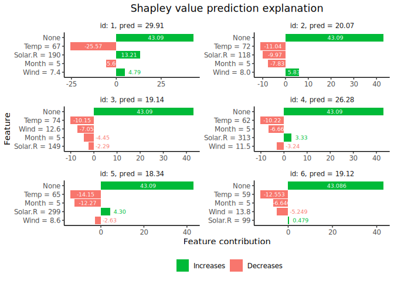

<!-- README.md is generated from README.Rmd. Please edit that file -->

# shapr 

<!-- badges: start -->

[](https://circleci.com/gh/NorskRegnesentral/shapr)
[](https://github.com/NorskRegnesentral/shapr/actions?query=workflow%3AR-CMD-check)
[](https://www.tidyverse.org/lifecycle/#experimental)
[](https://opensource.org/licenses/MIT)
[](https://doi.org/10.21105/joss.02027)
<!-- badges: end -->

The most common task of machine learning is to train a model which is
able to predict an unknown outcome (response variable) based on a set of
known input variables/features. When using such models for real life
applications, it is often crucial to understand why a certain set of
features lead to exactly that prediction. However, explaining
predictions from complex, or seemingly simple, machine learning models
is a practical and ethical question, as well as a legal issue. Can I
trust the model? Is it biased? Can I explain it to others? We want to
explain individual predictions from a complex machine learning model by
learning simple, interpretable explanations.

Shapley values is the only prediction explanation framework with a solid
theoretical foundation (Lundberg and Lee (2017)). Unless the true
distribution of the features are known, and there are less than say
10-15 features, these Shapley values needs to be estimated/approximated.
Popular methods like Shapley Sampling Values (Štrumbelj and Kononenko
(2014)), SHAP/Kernel SHAP (Lundberg and Lee (2017)), and to some extent
TreeSHAP (Lundberg, Erion, and Lee (2018)), assume that the features are
independent when approximating the Shapley values for prediction
explanation. This may lead to very inaccurate Shapley values, and
consequently wrong interpretations of the predictions. Aas, Jullum, and
Løland (2019) extends and improves the Kernel SHAP method of Lundberg
and Lee (2017) to account for the dependence between the features,
resulting in significantly more accurate approximations to the Shapley
values. [See the paper for details](https://arxiv.org/abs/1903.10464).

This package implements the methodology of Aas, Jullum, and Løland
(2019).

The following methodology/features are currently implemented:

  - Native support of explanation of predictions from models fitted with
    the following functions `stats::glm`, `stats::lm`,`ranger::ranger`,
    `xgboost::xgboost`/`xgboost::xgb.train` and `mgcv::gam`.
  - Accounting for feature dependence assuming the features are Gaussian
    (Aas, Jullum, and Løland (2019)).
  - Accounting for feature dependence with a Gaussian copula (Gaussian
    dependence structure, any marginal) (Aas, Jullum, and Løland
    (2019)).
  - Accounting for feature dependence using the Mahalanobis distance
    based empirical (conditional) distribution approach of Aas, Jullum,
    and Løland (2019).
  - Combine any of the three methods.
  - Optional use of the AICc criterion of Hurvich, Simonoff, and Tsai
    (1998) when optimizing the bandwidth parameter in the empirical
    (conditional) approach of Aas, Jullum, and Løland (2019).
  - Functionality for visualizing the explanations.
  - Support for models not supported natively.

<!--
Current methodological restrictions:

- The features must follow a continuous distribution
- Discrete features typically work just fine in practice although the theory breaks down
- Ordered/unordered categorical features are not supported
-->

Future releases will include:

  - Support for parallelization over explanations, Monte Carlo sampling
    and features subsets for non-parallelizable prediction functions.
  - Computational improvement of the AICc optimization approach
  - Adaptive selection of method to account for the feature dependence

Note that both the features and the prediction must be numeric. The
approach is constructed for continuous features. Discrete features may
also work just fine with the empirical (conditional) distribution
approach. Unlike SHAP and TreeSHAP, we decompose probability predictions
directly to ease the interpretability, i.e. not via log odds
transformations. The application programming interface (API) of `shapr`
is inspired by Pedersen and Benesty (2019).

## Installation

To install the current development version, use

``` r
devtools::install_github("NorskRegnesentral/shapr")
```

If you would like to install all packages of the models we currently
support, use

``` r
devtools::install_github("NorskRegnesentral/shapr", dependencies = TRUE)
```

If you would also like to build and view the vignette locally, use

``` r
devtools::install_github("NorskRegnesentral/shapr", dependencies = TRUE, build_vignettes = TRUE)
vignette("understanding_shapr", "shapr")
```

You can always check out the latest version of the vignette
[here](https://norskregnesentral.github.io/shapr/articles/understanding_shapr.html).

## Example

`shapr` supports computation of Shapley values with any predictive model
which takes a set of numeric features and produces a numeric outcome.

The following example shows how a simple `xgboost` model is trained
using the *Boston Housing Data*, and how `shapr` explains the individual
predictions.

``` r
library(xgboost)
library(shapr)

data("Boston", package = "MASS")

x_var <- c("lstat", "rm", "dis", "indus")
y_var <- "medv"

ind_x_test <- 1:6
x_train <- as.matrix(Boston[-ind_x_test, x_var])
y_train <- Boston[-ind_x_test, y_var]
x_test <- as.matrix(Boston[ind_x_test, x_var])

# Looking at the dependence between the features
cor(x_train)
#>            lstat         rm        dis      indus
#> lstat  1.0000000 -0.6108040 -0.4928126  0.5986263
#> rm    -0.6108040  1.0000000  0.1999130 -0.3870571
#> dis   -0.4928126  0.1999130  1.0000000 -0.7060903
#> indus  0.5986263 -0.3870571 -0.7060903  1.0000000

# Fitting a basic xgboost model to the training data
model <- xgboost(
  data = x_train,
  label = y_train,
  nround = 20,
  verbose = FALSE
)

# Prepare the data for explanation
explainer <- shapr(x_train, model)

# Specifying the phi_0, i.e. the expected prediction without any features
p <- mean(y_train)

# Computing the actual Shapley values with kernelSHAP accounting for feature dependence using
# the empirical (conditional) distribution approach with bandwidth parameter sigma = 0.1 (default)
explanation <- explain(
  x_test,
  approach = "empirical",
  explainer = explainer,
  prediction_zero = p
)

# Printing the Shapley values for the test data.
# For more information about the interpretation of the values in the table, see ?shapr::explain.
print(explanation$dt)
#>      none     lstat         rm       dis      indus
#> 1: 22.446 5.2632030 -1.2526613 0.2920444  4.5528644
#> 2: 22.446 0.1671903 -0.7088405 0.9689007  0.3786871
#> 3: 22.446 5.9888016  5.5450861 0.5660136 -1.4304350
#> 4: 22.446 8.2142203  0.7507569 0.1893368  1.8298305
#> 5: 22.446 0.5059890  5.6875106 0.8432240  2.2471152
#> 6: 22.446 1.9929674 -3.6001959 0.8601984  3.1510531

# Finally we plot the resulting explanations
plot(explanation)
```



## Contribution

All feedback and suggestions are very welcome. Details on how to
contribute can be found [here](./.github/CONTRIBUTING.md). If you have
any questions or comments, feel free to open an issue
[here](https://github.com/NorskRegnesentral/shapr/issues).

Please note that the ‘shapr’ project is released with a [Contributor
Code of Conduct](CODE_OF_CONDUCT.md). By contributing to this project,
you agree to abide by its terms.

## References

<div id="refs" class="references hanging-indent">

<div id="ref-aas2019explaining">

Aas, Kjersti, Martin Jullum, and Anders Løland. 2019. “Explaining
Individual Predictions When Features Are Dependent: More Accurate
Approximations to Shapley Values.” *arXiv Preprint arXiv:1903.10464*.

</div>

<div id="ref-hurvich1998smoothing">

Hurvich, Clifford M, Jeffrey S Simonoff, and Chih-Ling Tsai. 1998.
“Smoothing Parameter Selection in Nonparametric Regression Using an
Improved Akaike Information Criterion.” *Journal of the Royal
Statistical Society: Series B (Statistical Methodology)* 60 (2): 271–93.

</div>

<div id="ref-lundberg2018consistent">

Lundberg, Scott M, Gabriel G Erion, and Su-In Lee. 2018. “Consistent
Individualized Feature Attribution for Tree Ensembles.” *arXiv Preprint
arXiv:1802.03888*.

</div>

<div id="ref-lundberg2017unified">

Lundberg, Scott M, and Su-In Lee. 2017. “A Unified Approach to
Interpreting Model Predictions.” In *Advances in Neural Information
Processing Systems*, 4765–74.

</div>

<div id="ref-lime_api">

Pedersen, Thomas Lin, and Michaël Benesty. 2019. *Lime: Local
Interpretable Model-Agnostic Explanations*.
<https://CRAN.R-project.org/package=lime>.

</div>

<div id="ref-vstrumbelj2014explaining">

Štrumbelj, Erik, and Igor Kononenko. 2014. “Explaining Prediction Models
and Individual Predictions with Feature Contributions.” *Knowledge and
Information Systems* 41 (3): 647–65.

</div>

</div>
