# \`shapr\`: Explaining individual machine learning predictions with Shapley values

## Introduction

The `shapr` package implements an extended version of the Kernel SHAP
method for approximating Shapley values (Lundberg and Lee (2017)), in
which dependence between the features is taken into account (Aas,
Jullum, and Løland (2021)).

Estimation of Shapley values is of interest when attempting to explain
complex machine learning models. Of existing work on interpreting
individual predictions, Shapley values is regarded to be the only
model-agnostic explanation method with a solid theoretical foundation
(Lundberg and Lee (2017)). Kernel SHAP is a computationally efficient
approximation to Shapley values in higher dimensions, but it assumes
independent features. Aas, Jullum, and Løland (2021) extends the Kernel
SHAP method to handle dependent features, resulting in more accurate
approximations to the true Shapley values. See the
[paper](https://martinjullum.com/publication/aas-2021-explaining/aas-2021-explaining.pdf)
(Aas, Jullum, and Løland (2021)) for further details.

## Overview of Package

### Functionality

Here is an overview of the main functions. You can read their
documentation and see examples with `?function_name`.

| Function Name                | Description                                                                                 |
|:-----------------------------|:--------------------------------------------------------------------------------------------|
| `explain`                    | Computes Shapley values for a model and a set of observations to explain.                   |
| `explain_forecast`           | Analogous to `explain`, but for explaining forecasts from time series models.               |
| `plot.shapr`                 | Plots the individual prediction explanations. Uses the `ggplot` and `ggbeeswarm` package.   |
| `plot_SV_several_approaches` | Compare the individual prediction explanations obtained from different approaches.          |
| `plot_MSEv_eval_crit`        | Plots the $\operatorname{MSE}_{v}$ criterion to evaluate the performance of the approach.   |
| `print.shapr`                | Prints the Shapley values (default), their standard deviation or estimates of the MSE.      |
| `get_results`                | Extracts and returns a summary of the Shapley value computation.                            |
| `summary.shapr`              | Returns a `summary.shapr` object, and prints a formatted summary when called interactively. |

Main functions in the `shapr` package.

The `shapr` package implements Kernel SHAP estimation of
dependence-aware Shapley values with eight different Monte Carlo-based
approaches for estimating the conditional distributions of the data,
namely `"empirical"`, `"gaussian"`, `"copula"`, `"ctree"`, `"vaeac"`,
`"categorical"`, `"timeseries"`, and `"independence"`. `shapr` has also
implemented two regression-based approaches `"regression_separate"` and
`"regression_surrogate"`. See [Estimation approaches and plotting
functionality](#ex) below for examples. It is also possible to combine
the different approaches, see the [combined approach](#combined).

The package allows for parallelized computation through the `future`
package, see [Parallelization](#para) for details.

The level of detail in the output can be controlled through the
`verbose` argument. In addition, progress updates on the process of
estimating the `v(S)`’s (and training the `"vaeac"` model) is available
through the `progressr` package, supporting progress updates also for
parallelized computation. See [Verbosity and progress updates](#verbose)
for details.

Moreover, the default behavior is to estimate the Shapley values
iteratively, with an increasing number of feature coalitions being
added, and to stop estimation as the estimated Shapley values have
achieved a certain level of stability. More information about this is
provided in [Iterative estimation](#iterative) The above, combined with
batch computation of the `v(S)` values, enables fast and accurate
estimation of the Shapley values in a memory-friendly manner.

The package provides functionality for printing and summarizing the
Shapley value computation, as well as extracting objects created during
computation, see [Summary, Printing, and Result Extraction](#summary).

The package also provides functionality for computing Shapley values for
groups of features, and custom function explanation, see [Advanced
usage](#advanced). Finally, explanation of multiple output time series
forecasting models are discussed in [Explaining forecasting
models](#forecasting).

### Default behavior of `explain`

Below we provide brief descriptions of the most important parts of the
default behavior of the `explain` function.

By default `explain` always computes feature-wise Shapley values. Groups
of features can be explained by providing the feature groups through the
`group` argument.

When there are five or fewer features (or feature groups), iterative
estimation is by default disabled. The reason for this is that it is
usually faster to estimate the Shapley values for all possible
coalitions (`v(S)`), than to estimate the uncertainty of the Shapley
values, and potentially stop estimation earlier. While iterative
estimation is the default starting from six features, it is mainly when
there are more than ten features, that it is most beneficial, and can
save a lot of computation time. The reason for this is that the number
of possible coalitions grows exponentially. These defaults can be
overridden by setting the `iterative` argument to `TRUE` or `FALSE`.
When using the `iterative` argument, the estimation for an observation
is stopped when all Shapley value standard deviations are below `t`
times the range of the Shapley values. The `t` value controls the
convergence tolerance, defaults to 0.02, and can be set through the
`iterative_args$convergence_tol` argument, see [iterative
estimation](#iterative) for more details.

As opposed to Kernel SHAP estimation as originally proposed in (Lundberg
and Lee (2017)), `shapr`, by reweights the samples according to the
“Paired c-kernel” strategy described in Olsen and Jullum (2025) to
reduce the estimation variance and thereby improve the convergence
speed.

Since the iterativeness default changes based on the number of features
(or feature groups), the default is also to have no upper bound on the
number of coalitions considered. This can be controlled through the
`max_n_coalitions` argument.

## Kernel SHAP and dependence-aware estimators

### The Kernel SHAP Method

Assume a predictive model $f(\mathbf{x})$ for a response value $y$ with
features $\mathbf{x} \in {\mathbb{R}}^{M}$, trained on a training set,
and that we want to explain the predictions for new sets of data. This
may be done using ideas from cooperative game theory, letting a single
prediction take the place of the game being played and the features the
place of the players. Letting $N$ denote the set of all $M$ players, and
$S \subseteq N$ be a subset of $|S|$ players, the “contribution”
function $v(S)$ describes the total expected sum of payoffs the members
of $S$ can obtain by cooperation. The Shapley value (Shapley (1953)) is
one way to distribute the total gains to the players, assuming that they
all collaborate. The amount that player $i$ gets is then

$$\phi_{i}(v) = \phi_{i} = \sum\limits_{S \subseteq N\backslash\{ i\}}\frac{|S|!\left( M - |S| - 1 \right)!}{M!}\left( v\left( S \cup \{ i\} \right) - v(S) \right),$$

that is, a weighted mean over all subsets $S$ of players not containing
player $i$. Lundberg and Lee (2017) define the contribution function for
a certain subset $S$ of these features $\mathbf{x}_{S}$ as
$v(S) = \text{E}\left\lbrack f(\mathbf{x})|\mathbf{x}_{S} \right\rbrack$,
the expected output of the predictive model conditional on the feature
values of the subset. Lundberg and Lee (2017) names this type of Shapley
values SHAP (SHapley Additive exPlanation) values. Since the conditional
expectations can be written as

$$E\left\lbrack f(\mathbf{x})|\mathbf{x}_{s} = \mathbf{x}_{S}^{*} \right\rbrack = E\left\lbrack f\left( \mathbf{x}_{\bar{S}},\mathbf{x}_{S} \right)|\mathbf{x}_{S} = \mathbf{x}_{S}^{*} \right\rbrack = \int f\left( \mathbf{x}_{\bar{S}},\mathbf{x}_{S}^{*} \right)\, p\left( \mathbf{x}_{\bar{S}}|\mathbf{x}_{S} = \mathbf{x}_{S}^{*} \right)d\mathbf{x}_{\bar{S}},$$

the conditional distributions
$p\left( \mathbf{x}_{\bar{S}}|\mathbf{x}_{S} = \mathbf{x}_{S}^{*} \right)$
are needed to compute the contributions. The Kernel SHAP method of
Lundberg and Lee (2017) assumes feature independence, so that
$p\left( \mathbf{x}_{\bar{S}}|\mathbf{x}_{S} = \mathbf{x}_{S}^{*} \right) = p\left( \mathbf{x}_{\bar{S}} \right)$.
If samples $\mathbf{x}_{\bar{S}}^{k},k = 1,\ldots,K$, from
$p\left( \mathbf{x}_{\bar{S}}|\mathbf{x}_{S} = \mathbf{x}_{S}^{*} \right)$
are available, the conditional expectation above can be approximated by

$$v_{\text{KerSHAP}}(S) = \frac{1}{K}\sum\limits_{k = 1}^{K}f\left( \mathbf{x}_{\bar{S}}^{k},\mathbf{x}_{S}^{*} \right).$$

In Kernel SHAP, $\mathbf{x}_{\bar{S}}^{k},k = 1,\ldots,K$ are sampled
from the $\bar{S}$-part of the training data, *independently* of
$\mathbf{x}_{S}$. This is motivated by using the training set as the
empirical distribution of $\mathbf{x}_{\bar{S}}$, and assuming that
$\mathbf{x}_{\bar{S}}$ is independent of
$\mathbf{x}_{S} = \mathbf{x}_{S}^{*}$. Due to the independence
assumption, if the features in a given model are highly dependent, the
Kernel SHAP method may give a completely wrong answer. This can be
avoided by estimating the conditional distribution
$p\left( \mathbf{x}_{\bar{S}}|\mathbf{x}_{S} = \mathbf{x}_{S}^{*} \right)$
directly and generating samples from this distribution. With this small
change, the contributions and Shapley values may then be approximated as
in the ordinary Kernel SHAP framework. Aas, Jullum, and Løland (2021)
propose three different approaches for estimating the conditional
probabilities which are implemented: `empirical`, `gaussian` and
`copula`. The package also implements the `ctree` method from
Redelmeier, Jullum, and Aas (2020), the `vaeac` method from Olsen et al.
(2022) and a `categorical` for categorical data. The original
`independence` approach of Lundberg and Lee (2017) is also available.
The methods may also be combined, such that e.g. one method is used when
conditioning on a small number of features, while another method is used
otherwise. The `shapr` package also supports directly estimating the
contribution function using regression. We briefly introduce the
regression-based methods below, but we refer to the separate regression
vignette (Shapley value explanations using the regression paradigm) and
Olsen et al. (2024) for an in-depth explanation of the regression
paradigm.

### Multivariate Gaussian Distribution Approach

The first approach arises from the assumption that the feature vector
$\mathbf{x}$ stems from a multivariate Gaussian distribution with some
mean vector $\mathbf{μ}$ and covariance matrix $\mathbf{\Sigma}$. Under
this assumption, the conditional distribution
$p\left( \mathbf{x}_{\bar{\mathcal{S}}}|\mathbf{x}_{\mathcal{S}} = \mathbf{x}_{\mathcal{S}}^{*} \right)$
is also multivariate Gaussian  
$\text{N}_{|\bar{\mathcal{S}}|}\left( {\mathbf{μ}}_{\bar{\mathcal{S}}|\mathcal{S}},\mathbf{\Sigma}_{\bar{\mathcal{S}}|\mathcal{S}} \right)$,
with analytical expressions for the conditional mean vector
${\mathbf{μ}}_{\bar{\mathcal{S}}|\mathcal{S}}$ and covariance matrix
$\mathbf{\Sigma}_{\bar{\mathcal{S}}|\mathcal{S}}$, see Aas, Jullum, and
Løland (2021) for details. Hence, instead of sampling from the marginal
empirical distribution of $\mathbf{x}_{\bar{\mathcal{S}}}$ approximated
by the training data, we can sample from the Gaussian conditional
distribution, which is fitted using the training data. Using the
resulting samples $\mathbf{x}_{\bar{\mathcal{S}}}^{k},k = 1,\ldots,K$,
the conditional expectations be approximated as in the Kernel SHAP.

### Gaussian Copula Approach

If the features are far from multivariate Gaussian, an alternative
approach is to instead represent the marginals by their empirical
distributions, and model the dependence structure by a Gaussian copula.
Assuming a Gaussian copula, we may convert the marginals of the training
data to Gaussian features using their empirical distributions, and then
fit a multivariate Gaussian distribution to these.

To produce samples from the conditional distribution
$p\left( \mathbf{x}_{\bar{\mathcal{S}}}|\mathbf{x}_{\mathcal{S}} = \mathbf{x}_{\mathcal{S}}^{*} \right)$,
we convert the marginals of $\mathbf{x}_{\mathcal{S}}$ to Gaussians,
sample from the conditional Gaussian distribution as above, and convert
the marginals of the samples back to the original distribution. Those
samples are then used to approximate the sample from the resulting
multivariate Gaussian conditional distribution. While other copulas may
be used, the Gaussian copula has the benefit that we may use the
analytical expressions for the conditionals
${\mathbf{μ}}_{\bar{\mathcal{S}}|\mathcal{S}}$ and
$\mathbf{\Sigma}_{\bar{\mathcal{S}}|\mathcal{S}}$. Finally, we may
convert the marginals back to their original distribution, and use the
resulting samples to approximate the conditional expectations as in
Kernel SHAP.

### Empirical Conditional Distribution Approach

If both the dependence structure and the marginal distributions of
$\mathbf{x}$ are very far from the Gaussian, neither of the two
aforementioned methods will work very well. Few methods exist for the
non-parametric estimation of conditional densities, and the classic
kernel estimator (Rosenblatt (1956)) for non-parametric density
estimation suffers greatly from the curse of dimensionality and does not
provide a way to generate samples from the estimated distribution. For
such situations, Aas, Jullum, and Løland (2021) propose an empirical
conditional approach to sample approximately from
$p\left( \mathbf{x}_{\bar{\mathcal{S}}}|\mathbf{x}_{\mathcal{S}}^{*} \right)$.
The idea is to compute weights
$w_{\mathcal{S}}\left( \mathbf{x}^{*},\mathbf{x}^{i} \right),\ i = 1,...,n_{\text{train}}$
for all training instances based on their Mahalanobis distances (in the
$S$ subset only) to the instance $\mathbf{x}^{*}$ to be explained.
Instead of sampling from this weighted (conditional) empirical
distribution, Aas, Jullum, and Løland (2021) suggests a more efficient
variant, using only the $K$ instances with the largest weights:

$$v_{\text{condKerSHAP}}(\mathcal{S}) = \frac{\sum\limits_{k = 1}^{K}w_{\mathcal{S}}\left( \mathbf{x}^{*},\mathbf{x}^{\lbrack k\rbrack} \right)f\left( \mathbf{x}_{\bar{\mathcal{S}}}^{\lbrack k\rbrack},\mathbf{x}_{\mathcal{S}}^{*} \right)}{\sum\limits_{k = 1}^{K}w_{\mathcal{S}}\left( \mathbf{x}^{*},\mathbf{x}^{\lbrack k\rbrack} \right)},$$

The number of samples $K$ to be used in the approximate prediction can
for instance be chosen such that the $K$ largest weights accounts for a
fraction $\eta$, for example $0.9$, of the total weight. If $K$ exceeds
a certain limit, for instance $5,000$, it might be set to that limit. A
bandwidth parameter $\sigma$ used to scale the weights, must also be
specified. This choice may be viewed as a bias-variance trade-off. A
small $\sigma$ puts most of the weight to a few of the closest training
observations and thereby gives low bias, but high variance. When
$\left. \sigma\rightarrow\infty \right.$, this method converges to the
original Kernel SHAP assuming feature independence. Typically, when the
features are highly dependent, a small $\sigma$ is typically needed such
that the bias does not dominate. Aas, Jullum, and Løland (2021) show
that a proper criterion for selecting $\sigma$ is a small-sample-size
corrected version of the AIC known as AICc. As calculation of it is
computationally intensive, an approximate version of the selection
criterion is also suggested. Details on this are found in Aas, Jullum,
and Løland (2021).

### Conditional Inference Tree Approach

The previous three methods can only handle numerical data. This means
that if the data contains categorical/discrete/ordinal features, the
features first have to be one-hot encoded. When the number of
levels/features is large, this is not feasible. An approach that handles
mixed (i.e., numerical, categorical, discrete, ordinal) features and
both univariate and multivariate responses is conditional inference
trees (Hothorn, Hornik, and Zeileis (2006)).

Conditional inference trees are a special tree-fitting procedure that
relies on hypothesis tests to choose both the splitting feature and the
splitting point. The tree fitting procedure is sequential: first a
splitting feature is chosen (the feature that is least independent of
the response), and then a splitting point is chosen for this feature.
This decreases the chance of being biased towards features with many
splits (Hothorn, Hornik, and Zeileis (2006)).

We use conditional inference trees (*ctree*) to model the conditional
distribution,
$p\left( \mathbf{x}_{\bar{\mathcal{S}}}|\mathbf{x}_{\mathcal{S}}^{*} \right)$,
found in the Shapley methodology. First, we fit a different conditional
inference tree to each conditional distribution. Once a tree is fit for
given dependent features, the end node of $\mathbf{x}_{\mathcal{S}}^{*}$
is found. Then, we sample from this end node and use the resulting
samples, $\mathbf{x}_{\bar{\mathcal{S}}}^{k},k = 1,\ldots,K$, when
approximating the conditional expectations as in Kernel SHAP. See
Redelmeier, Jullum, and Aas (2020) for more details.

The conditional inference trees are fit using the *party* or *partykit*
packages (Hothorn and Zeileis (2015)).

### Variational AutoEncoder with Arbitrary Conditioning (vaeac) Approach

Another approach that supports mixed features is the Variational
AutoEncoder with Arbitrary Conditioning (Olsen et al. (2022)),
abbreviated to `vaeac`. The `vaeac` is an extension of the regular
variational autoencoder (Kingma and Welling (2014)), but instead of
giving a probabilistic representation of the distribution
$p(\mathbf{x})$ it gives a probabilistic representation of the
conditional distribution
$p\left( \mathbf{x}_{\bar{\mathcal{S}}} \mid \mathbf{x}_{\mathcal{S}} \right)$,
for all possible feature subsets $\mathcal{S} \subseteq \mathcal{M}$
simultaneously, where $\mathcal{M}$ is the set of all features. That is,
only a single `vaeac` model is needed to model all conditional
distributions.

The `vaeac` consists of three neural networks: a *full encoder*, a
*masked encoder*, and a *decoder*. The encoders map the full and
masked/conditional input representations, i.e., $\mathbf{x}$ and
$\mathbf{x}_{\mathcal{S}}$, respectively, to latent probabilistic
representations. Sampled instances from this latent probabilistic
representations are sent to the decoder, which maps them back to the
feature space and provides a samplable probabilistic representation for
the unconditioned features $\mathbf{x}_{\bar{\mathcal{S}}}$. The full
encoder is only used during the training phase of the `vaeac` model to
guide the training process of the masked encoder, as the former relies
on the full input sample $\mathbf{x}$, which is not accessible in the
deployment phase (when we generate the Monte Carlo samples), as we only
have access to $\mathbf{x}_{\mathcal{S}}$. The networks are trained by
minimizing a variational lower bound. See Section 3 in Olsen et al.
(2022) for an in-depth introduction to the `vaeac` methodology. We use
the `vaeac` model at the epoch which obtains the lowest validation IWAE
score to generate the Monte Carlo samples used in the Shapley value
computations.

We fit the `vaeac` model using the R package *torch* (Falbel and
Luraschi (2023)). The main parameters are the number of layers in the
networks (`vaeac.depth`), the width of the layers (`vaeac.width`), the
number of dimensions in the latent space (`vaeac.latent_dim`), the
activation function between the layers in the networks
(`vaeac.activation_function`), the learning rate in the ADAM optimizer
(`vaeac.lr`), the number of `vaeac` models to initiate to remedy poorly
initiated model parameter values (`vaeac.n_vaeacs_initialize`), and the
number of learning epochs (`vaeac.epochs`). See
[`?shapr::setup_approach.vaeac`](https://norskregnesentral.github.io/shapr/reference/setup_approach.md)
for a more detailed description of the parameters.

There are additional extra parameters which can be set by including a
named list in the call to the
[`explain()`](https://norskregnesentral.github.io/shapr/reference/explain.md)
function. For example, we can change the batch size to 32 by including
`vaeac.extra_parameters = list(vaeac.batch_size = 32)` as an argument in
the
[`explain()`](https://norskregnesentral.github.io/shapr/reference/explain.md)
function. See
[`?shapr::vaeac_get_extra_para_default`](https://norskregnesentral.github.io/shapr/reference/vaeac_get_extra_para_default.md)
for a description of the possible extra parameters to the `vaeac`
approach. Note that the main parameters are entered as arguments
directly in
[`explain()`](https://norskregnesentral.github.io/shapr/reference/explain.md)
function, while the extra parameters are specified through a named list
called `vaeac.extra_parameters`.

### Categorical Approach

When the features are all categorical, we can estimate the conditional
expectations using basic statistical formulas. For example, if we have
three features, $x_{1},x_{2},x_{3}$ with three levels each (indicated as
1, 2, 3), and we are provided with a table of counts indicating how many
times each combination of feature values occurs, we can estimate the
marginal and conditional probabilities as follows. Marginal
probabilities are estimated by dividing the number of times a given
feature (or features) takes on a certain value in the data set with the
total number of observations in the data set. Conditional probabilities
(for example, $P\left( X_{1} = 1|X_{2} = 1 \right)$) are estimated by
first subsetting the data set to reflect the conditioning (i.e.,
extracting all rows where $X_{2} = 1$), and then dividing the number of
times the feature on the left hand side of $|$ takes the given value in
this subset by the total number of observations in this subset. Once the
marginal and conditional probabilities are estimated for all
combinations of feature values, each conditional expectation can be
calculated. For example, the expected value of $X_{1}$ given $X_{2} = 1$
and $X_{3} = 2$ is
$$E\left( X_{1}|X_{2},X_{3} \right) = \sum\limits_{x}xP\left( X_{1} = x|X_{2} = 1,X_{3} = 2 \right) = \sum\limits_{x}x\frac{P\left( X_{1} = x,X_{2} = 1,X_{3} = 2 \right)}{P\left( X_{2} = 1,X_{3} = 2 \right)}.$$

### Separate and Surrogate Regression Approaches

Another paradigm for estimating the contribution function is the
regression paradigm. In contrast to the methods above, which belong to
the Monte Carlo paradigm, the regression-based methods use regression
models to estimate the contribution function
$v(S) = E\left\lbrack f(\mathbf{x})|\mathbf{x}_{S} = \mathbf{x}_{S}^{*} \right\rbrack$
directly. The separate regression method class fits a separate
regression model for each coalition $S$, while the surrogate regression
method class fits a single regression model to simultaneously predict
the contribution function for all coalitions. We refer to Olsen et al.
(2024) for when one should use the different paradigms, method classes,
and methods.

In a separate vignette (Shapley value explanations using the regression
paradigm), we elaborate and demonstrate the regression paradigm. We
describe how to specify the regression model, enable automatic
cross-validation of the model’s hyperparameters, and apply
pre-processing steps to the data before fitting the regression models.
Olsen et al. (2024) divides the regression paradigm into the separate
and surrogate regression method classes. In the separate vignette, we
briefly introduce the two method classes. For an in-depth explanation,
we refer the reader to Sections 3.5 and 3.6 in Olsen et al. (2024).

## Estimation approaches and plotting functionality

The following example shows how a simple `xgboost` model is trained
using the `airquality` dataset, and how `shapr` can be used to explain
the individual predictions. Since which approach should be used to
estimate the contribution functions will depend on the type of data one
is working with, the user must specify the approach to be used through
the `approach` argument. Allowed values are `"gaussian"`, `"copula"`,
`"empirical"`, `"ctree"`, `"vaeac"`, `"categorical"`, `"timeseries"`,
`"independence"`, `"regression_separate"`, and `"regression_surrogate"`.

First we load the shapr package

``` r
library(shapr)
```

``` r
library(xgboost)
library(data.table)
#> data.table 1.18.0 using 11 threads (see ?getDTthreads).  Latest news: r-datatable.com

data("airquality")
data <- data.table::as.data.table(airquality)
data <- data[complete.cases(data), ]

x_var <- c("Solar.R", "Wind", "Temp", "Month")
y_var <- "Ozone"

ind_x_explain <- 1:6
x_train <- data[-ind_x_explain, ..x_var]
y_train <- data[-ind_x_explain, get(y_var)]
x_explain <- data[ind_x_explain, ..x_var]

# Set seed for reproducibility
set.seed(123)

# Fitting a basic xgboost model to the training data
model <- xgboost::xgboost(
  x = x_train,
  y = y_train,
  nround = 20,
  verbosity = 0
)

# Specifying the phi_0, i.e. the expected prediction without any features
p0 <- mean(y_train)

# Computing the actual Shapley values with Kernel SHAP accounting for feature dependence using
# the empirical (conditional) distribution approach with bandwidth parameter sigma = 0.1 (default)
explanation <- explain(
  model = model,
  x_explain = x_explain,
  x_train = x_train,
  approach = "empirical",
  phi0 = p0,
  seed = 1
)
#>
#> ── Starting `shapr::explain()` at 2026-01-16 12:36:48
#> ℹ `max_n_coalitions` is `NULL` or larger than
#>   `2^n_features = 16`, and is therefore set to
#>   `2^n_features = 16`.
#> ── Explanation overview ──
#>
#> • Model class: <xgboost>
#> • v(S) estimation class: Monte Carlo integration
#> • Approach: empirical
#> • Procedure: Non-iterative
#> • Number of Monte Carlo integration samples: 1000
#> • Number of feature-wise Shapley values: 4
#> • Number of observations to explain: 6
#> • Computations (temporary) saved at:
#> '/tmp/Rtmpravdkd/shapr_obj_164856ce9500.rds'
#>
#> ── Main computation started ──
#>
#> ℹ Using 16 of 16 coalitions.

# Printing the Shapley values for the test data.
# For more information about the interpretation of the values in the table, see ?shapr::explain.
print(explanation)
#>    explain_id  none Solar.R   Wind   Temp  Month
#>         <int> <num>   <num>  <num>  <num>  <num>
#> 1:          1  43.1  12.315   2.78 -27.98  -2.07
#> 2:          2  43.1  -8.514   4.69 -13.96  -7.85
#> 3:          3  43.1  -2.767 -10.27  -9.95  -3.87
#> 4:          4  43.1  -0.945  -4.18 -14.06  -6.80
#> 5:          5  43.1   4.058  -2.07 -11.94 -12.02
#> 6:          6  43.1  -0.290  -7.28 -13.46  -6.50

# Plot the resulting explanations for observations 1 and 6
plot(explanation, bar_plot_phi0 = FALSE, index_x_explain = c(1, 6))
```

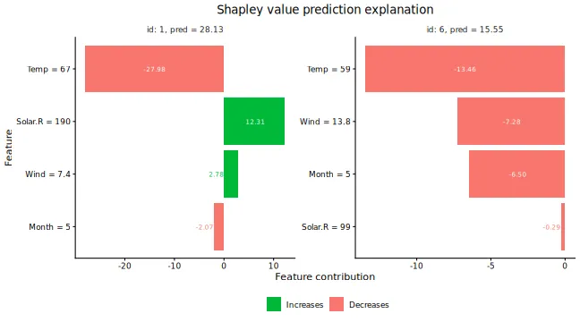

There are multiple plot options specified by the `plot_type` argument in
`plot`. The `waterfall` option shows the changes in the prediction score
due to each feature’s contribution (their Shapley values):

There are multiple plot options specified by the `plot_type` argument in
`plot`. The `waterfall` option shows the changes in the prediction score
due to each feature’s contribution (their Shapley values):

``` r
plot(explanation, plot_type = "waterfall", index_x_explain = c(1, 6))
```

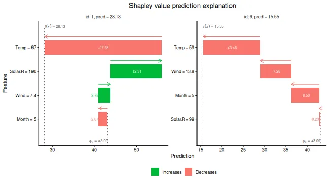

The other two plot options, `"beeswarm"` and `"scatter"`, can be useful
when you have many observations that you want to explain. For the
purpose of illustration, we explain the whole `airquality` dataset
(including the training data) for these plot types. The
`plot_type = "beeswarm"` summarizes the distribution of the Shapley
values along the x-axis across all features. Each point gives the
Shapley value of a given instance, where the points are colored by the
feature value of that instance:

``` r
x_explain_many <- data[, ..x_var]
explanation_plot <- explain(
  model = model,
  x_explain = x_explain_many,
  x_train = x_train,
  approach = "empirical",
  phi0 = p0,
  seed = 1
)
#>
#> ── Starting `shapr::explain()` at 2026-01-16 12:36:53
#> ℹ `max_n_coalitions` is `NULL` or larger than
#>   `2^n_features = 16`, and is therefore set to
#>   `2^n_features = 16`.
#>
#>
#> ── Explanation overview ──
#>
#>
#>
#> • Model class: <xgboost>
#>
#> • v(S) estimation class: Monte Carlo integration
#>
#> • Approach: empirical
#>
#> • Procedure: Non-iterative
#>
#> • Number of Monte Carlo integration samples: 1000
#>
#> • Number of feature-wise Shapley values: 4
#>
#> • Number of observations to explain: 111
#>
#> • Computations (temporary) saved at:
#> '/tmp/Rtmpravdkd/shapr_obj_16481bb4fea1.rds'
#>
#>
#>
#> ── Main computation started ──
#>
#>
#>
#> ℹ Using 16 of 16 coalitions.
plot(explanation_plot, plot_type = "beeswarm")
```

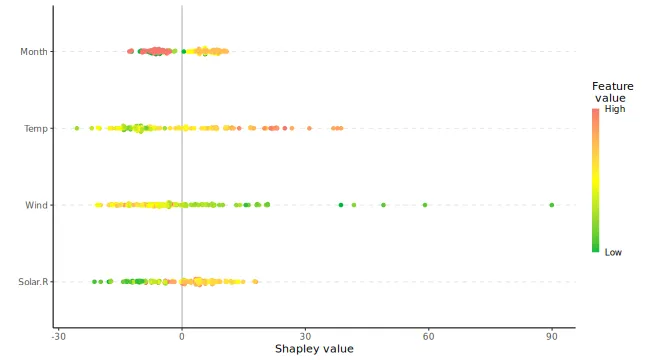

The `plot_type = "scatter"` plots the feature values on the x-axis and
Shapley values on the y-axis, as well as (optionally) a background
scatter_hist showing the distribution of the feature data:

``` r
plot(explanation_plot, plot_type = "scatter", scatter_hist = TRUE)
```

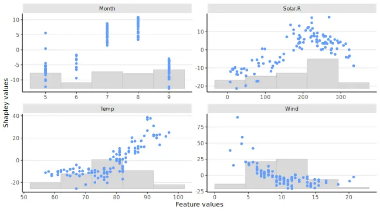

We can use mixed (i.e., continuous, categorical, ordinal) data with
`ctree` or `vaeac`. Use `ctree` with mixed data in the following manner:

``` r
# convert the month variable to a factor
data[, Month_factor := as.factor(Month)]

data_train_cat <- data[-ind_x_explain, ]
data_explain_cat <- data[ind_x_explain, ]

x_var_cat <- c("Solar.R", "Wind", "Temp", "Month_factor")

x_train_cat <- data_train_cat[, ..x_var_cat]
x_explain_cat <- data_explain_cat[, ..x_var_cat]

# Fitting an lm model here as xgboost does not handle categorical features directly
# (workaround in example below)
lm_formula <- as.formula(paste0(y_var, " ~ ", paste0(x_var_cat, collapse = " + ")))

model_lm_cat <- lm(lm_formula, data_train_cat)

p0 <- mean(y_train)
explanation_lm_cat <- explain(
  model = model_lm_cat,
  x_explain = x_explain_cat,
  x_train = x_train_cat,
  approach = "ctree",
  phi0 = p0,
  seed = 1
)
#>
#> ── Starting `shapr::explain()` at 2026-01-16 12:37:02
#> ℹ `max_n_coalitions` is `NULL` or larger than
#>   `2^n_features = 16`, and is therefore set to
#>   `2^n_features = 16`.
#>
#>
#> ── Explanation overview ──
#>
#>
#>
#> • Model class: <lm>
#>
#> • v(S) estimation class: Monte Carlo integration
#>
#> • Approach: ctree
#>
#> • Procedure: Non-iterative
#>
#> • Number of Monte Carlo integration samples: 1000
#>
#> • Number of feature-wise Shapley values: 4
#>
#> • Number of observations to explain: 6
#>
#> • Computations (temporary) saved at:
#> '/tmp/Rtmpravdkd/shapr_obj_164875508e39.rds'
#>
#>
#>
#> ── Main computation started ──
#>
#>
#>
#> ℹ Using 16 of 16 coalitions.

# Plot the resulting explanations for observations 1 and 6, excluding
# the no-covariate effect
plot(explanation_lm_cat, bar_plot_phi0 = FALSE, index_x_explain = c(1, 6))
```

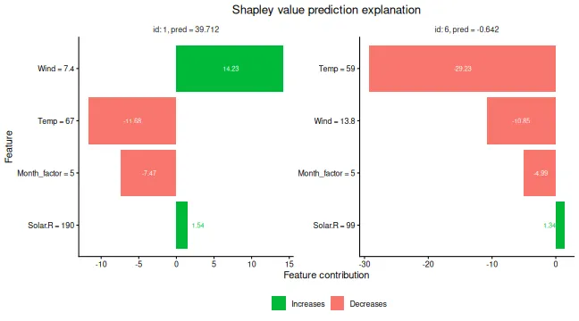

We can specify parameters used to build the conditional inference trees
in the following manner. The default values are based on Hothorn,
Hornik, and Zeileis (2006).

``` r
# Use the conditional inference tree approach
# We can specify parameters used to build trees by specifying mincriterion,
# minsplit, minbucket
explanation_ctree <- explain(
  model = model_lm_cat,
  x_explain = x_explain_cat,
  x_train = x_train_cat,
  approach = "ctree",
  phi0 = p0,
  seed = 1,
  ctree.mincriterion = 0.80,
  ctree.minsplit = 20,
  ctree.minbucket = 20
)
#>
#> ── Starting `shapr::explain()` at 2026-01-16 12:37:04
#> ℹ `max_n_coalitions` is `NULL` or larger than
#>   `2^n_features = 16`, and is therefore set to
#>   `2^n_features = 16`.
#>
#>
#> ── Explanation overview ──
#>
#>
#>
#> • Model class: <lm>
#>
#> • v(S) estimation class: Monte Carlo integration
#>
#> • Approach: ctree
#>
#> • Procedure: Non-iterative
#>
#> • Number of Monte Carlo integration samples: 1000
#>
#> • Number of feature-wise Shapley values: 4
#>
#> • Number of observations to explain: 6
#>
#> • Computations (temporary) saved at:
#> '/tmp/Rtmpravdkd/shapr_obj_1648774d65a4.rds'
#>
#>
#>
#> ── Main computation started ──
#>
#>
#>
#> ℹ Using 16 of 16 coalitions.
# Default parameters (based on (Hothorn, 2006)) are:
# mincriterion = 0.95
# minsplit = 20
# minbucket = 7
```

If **all** features are categorical, one may use the categorical
approach as follows:

``` r
# For the sake of illustration, convert ALL features to factors
data[, Solar.R_factor := as.factor(cut(Solar.R, 10))]
data[, Wind_factor := as.factor(cut(Wind, 3))]
data[, Temp_factor := as.factor(cut(Temp, 2))]
data[, Month_factor := as.factor(Month)]

data_train_all_cat <- data[-ind_x_explain, ]
data_explain_all_cat <- data[ind_x_explain, ]


x_var_all_cat <- c("Solar.R_factor", "Wind_factor", "Temp_factor", "Month_factor")

x_train_all_cat <- data_train_all_cat[, ..x_var_all_cat]
x_explain_all_cat <- data_explain_all_cat[, ..x_var_all_cat]

# Fit an lm model here
lm_formula_all_cat <- as.formula(paste0(y_var, " ~ ", paste0(x_var_all_cat, collapse = " + ")))

model_lm_all_cat <- lm(lm_formula_all_cat, data_train_all_cat)

explanation_cat_method <- explain(
  model = model_lm_all_cat,
  x_explain = x_explain_all_cat,
  x_train = x_train_all_cat,
  approach = "categorical",
  phi0 = p0,
  seed = 1
)
#>
#> ── Starting `shapr::explain()` at 2026-01-16 12:37:05
#> ℹ `max_n_coalitions` is `NULL` or larger than
#>   `2^n_features = 16`, and is therefore set to
#>   `2^n_features = 16`.
#>
#>
#> ── Explanation overview ──
#>
#>
#>
#> • Model class: <lm>
#>
#> • v(S) estimation class: Monte Carlo integration
#>
#> • Approach: categorical
#>
#> • Procedure: Non-iterative
#>
#> • Number of Monte Carlo integration samples: 1000
#>
#> • Number of feature-wise Shapley values: 4
#>
#> • Number of observations to explain: 6
#>
#> • Computations (temporary) saved at:
#> '/tmp/Rtmpravdkd/shapr_obj_16484bf4972f.rds'
#>
#>
#>
#> ── Main computation started ──
#>
#>
#>
#> ℹ Using 16 of 16 coalitions.
```

Shapley values can be used to explain any predictive model. For
predictive models taking time series as input, `approach="timeseries"`
can be used. In such models, joint behavior of consecutive time points
is often more important for the outcome than the single time points.
Therefore, it makes sense to derive Shapley value segments of the time
series instead of for each single time point. In `shapr` this can be
achieved through the `group` attribute. Other optional parameters of
`approach="timeseries"` are `timeseries.fixed_sigma` and
`timeseries.bounds` (a vector indicating upper and lower bounds of the
time series if necessary).

``` r
# Simulate time series data with AR(1)-structure
set.seed(1)
data_ts <- data.frame(matrix(NA, ncol = 41, nrow = 4))
for (n in 1:100) {
  set.seed(n)
  e <- rnorm(42, mean = 0, sd = 1)

  m_1 <- 0
  for (i in 2:length(e)) {
    m_1[i] <- 1 + 0.8 * m_1[i - 1] + e[i]
  }
  data_ts[n, ] <- m_1[-1]
}
data_ts <- data.table::as.data.table(data_ts)

x_var_ts <- paste0("X", 1:40)
y_var_ts <- "X41"

ind_x_explain <- 1:6
data_ts_train <- data_ts[-ind_x_explain]

# Creating a predictive model (for illustration just predicting the next point in the time series with a linear model)
lm_ts_formula <- as.formula(X41 ~ .)
model_lm_ts <- lm(lm_ts_formula, data_ts_train)

x_explain_ts <- data_ts[ind_x_explain, ..x_var_ts]
x_train_ts <- data_ts[-ind_x_explain, ..x_var_ts]

# Splitting the time series into 4 segments
group_ts <- list(
  S1 = paste0("X", 1:10),
  S2 = paste0("X", 11:20),
  S3 = paste0("X", 21:30),
  S4 = paste0("X", 31:40)
)


p0_ts <- mean(unlist(data_ts_train[, ..y_var_ts]))

explanation_timeseries <- explain(
  model = model_lm_ts,
  x_explain = x_explain_ts,
  x_train = x_train_ts,
  approach = "timeseries",
  phi0 = p0_ts,
  seed = 1,
  group = group_ts
)
#>
#> ── Starting `shapr::explain()` at 2026-01-16 12:37:05
#> ℹ `max_n_coalitions` is `NULL` or larger than
#>   `2^n_groups = 16`, and is therefore set to
#>   `2^n_groups = 16`.
#>
#>
#> ── Explanation overview ──
#>
#>
#>
#> • Model class: <lm>
#>
#> • v(S) estimation class: Monte Carlo integration
#>
#> • Approach: timeseries
#>
#> • Procedure: Non-iterative
#>
#> • Number of Monte Carlo integration samples: 1000
#>
#> • Number of group-wise Shapley values: 4
#>
#> • Feature groups: S1: {"X1", "X2", "X3", "X4", "X5",
#> "X6", "X7", "X8", "X9", "X10"}; S2: {"X11", "X12",
#> "X13", "X14", "X15", "X16", "X17", "X18", "X19",
#> "X20"}; S3: {"X21", "X22", "X23", "X24", "X25",
#> "X26", "X27", "X28", "X29", "X30"}; S4: {"X31",
#> "X32", "X33", "X34", "X35", "X36", "X37", "X38",
#> "X39", "X40"}
#>
#> • Number of observations to explain: 6
#>
#> • Computations (temporary) saved at:
#> '/tmp/Rtmpravdkd/shapr_obj_1648803cb6c.rds'
#>
#>
#>
#> ── Main computation started ──
#>
#>
#>
#> ℹ Using 16 of 16 coalitions.
```

### MSEv evaluation criterion

We can use the $\operatorname{MSE}_{v}$ criterion proposed by Frye et
al. (2021), and later used by, e.g., Olsen et al. (2022) and Olsen et
al. (2024), to evaluate and rank the approaches/methods. The
$\operatorname{MSE}_{v}$ is given by

$$\begin{array}{r}
{\operatorname{MSE}_{v} = \operatorname{MSE}_{v}\left( {\text{method}\mspace{6mu}}\texttt{𝚚} \right) = \frac{1}{N_{\mathcal{S}}}\sum\limits_{\mathcal{S} \in \mathcal{P}^{*}{(\mathcal{M})}}\frac{1}{N_{\text{explain}}}\sum\limits_{i = 1}^{N_{\text{explain}}}\left( f\left( \mathbf{x}^{\lbrack i\rbrack} \right) - {\widehat{v}}_{\texttt{𝚚}}\left( \mathcal{S},\mathbf{x}^{\lbrack i\rbrack} \right) \right)^{2}\!,}
\end{array}$$

where ${\widehat{v}}_{\texttt{𝚚}}$ is the estimated contribution
function using method $\texttt{𝚚}$ and
$N_{\mathcal{S}} = \left| \mathcal{P}^{*}(\mathcal{M}) \right| = 2^{M} - 2$,
i.e., we have removed the empty ($\mathcal{S} = \varnothing$) and the
grand combinations ($\mathcal{S} = \mathcal{M}$) as they are method
independent. Meaning that these two combinations do not influence the
ranking of the methods as the methods are not used to compute the
contribution function for them.

The motivation behind the $\operatorname{MSE}_{v}$ criterion is that
${\mathbb{E}}_{\mathcal{S}}{\mathbb{E}}_{\mathbf{x}}\left( v_{\texttt{𝚝𝚛𝚞𝚎}}(\mathcal{S},\mathbf{x}) - {\widehat{v}}_{\texttt{𝚚}}(\mathcal{S},\mathbf{x}) \right)^{2}$
can be decomposed as

$$\begin{array}{r}
\begin{aligned}
{{\mathbb{E}}_{\mathcal{S}}{\mathbb{E}}_{\mathbf{x}}\left( v_{\texttt{𝚝𝚛𝚞𝚎}}(\mathcal{S},\mathbf{x}) - {\widehat{v}}_{\texttt{𝚚}}(\mathcal{S},\mathbf{x}) \right)^{2}} & {= {\mathbb{E}}_{\mathcal{S}}{\mathbb{E}}_{\mathbf{x}}\left( f(\mathbf{x}) - {\widehat{v}}_{\texttt{𝚚}}(\mathcal{S},\mathbf{x}) \right)^{2}} \\
 & {\phantom{\,\,\,\,\,\,\,} - {\mathbb{E}}_{\mathcal{S}}{\mathbb{E}}_{\mathbf{x}}\left( f(\mathbf{x}) - v_{\texttt{𝚝𝚛𝚞𝚎}}(\mathcal{S},\mathbf{x}) \right)^{2},}
\end{aligned}
\end{array}$$

see Appendix A in Covert, Lundberg, and Lee (2020). The first term on
the right-hand side of the equation above can be estimated by
$\operatorname{MSE}_{v}$, while the second term is a fixed (unknown)
constant not influenced by the approach . Thus, a low value of
$\operatorname{MSE}_{v}$ indicates that the estimated contribution
function ${\widehat{v}}_{\texttt{𝚚}}$ is closer to the true counterpart
$v_{\texttt{𝚝𝚛𝚞𝚎}}$ than a high value.

In `shapr`, we allow for weighting the combinations in the
$\operatorname{MSE}_{v}$ evaluation criterion either uniformly or by
using the corresponding Shapley kernel weights (or the sampling
frequencies when sampling of coalitions is used). The default is to use
uniform weighting, but this can be changed by passing
`list(MSEv_uniform_comb_weights = FALSE)` to the `output_args` argument
of the
[`explain()`](https://norskregnesentral.github.io/shapr/reference/explain.md)
function.

#### Advantage:

An advantage of the $\operatorname{MSE}_{v}$ criterion is that
$v_{\texttt{𝚝𝚛𝚞𝚎}}$ is not involved. Thus, we can apply it as an
evaluation criterion to real-world data sets where the true Shapley
values are unknown.

#### Disadvantages:

First, we can only use the $\operatorname{MSE}_{v}$ criterion to rank
the methods and not assess their closeness to the optimum since the
minimum value of the $\operatorname{MSE}_{v}$ criterion is unknown.
Second, the criterion evaluates the contribution functions and not the
Shapley values.

Olsen et al. (2024) observed a relatively linear relationship between
the $\operatorname{MSE}_{v}$ criterion and the mean absolute error
$\left( \operatorname{MAE} \right)$ between the true and estimated
Shapley values in extensive simulation studies where the true Shapley
values were known. That is, a method that achieves a low
$\operatorname{MSE}_{v}$ score also tends to obtain a low
$\operatorname{MAE}$ score, and vice versa.

#### Confidence intervals

The $\operatorname{MSE}_{v}$ criterion can be written as
$\operatorname{MSE}_{v} = \frac{1}{N_{\text{explain}}}\sum_{i = 1}^{N_{\text{explain}}}\operatorname{MSE}_{v,{\text{explain}\mspace{6mu}}i}$.
We can therefore use the central limit theorem to compute an approximate
confidence interval for the $\operatorname{MSE}_{v}$ criterion. We have
that
$\operatorname{MSE}_{v} \pm t_{\alpha/2}\frac{\operatorname{SD}\left( \operatorname{MSE}_{v} \right)}{\sqrt{N_{\text{explain}}}}$
is a $(1 - \alpha/2)\%$ approximate confidence interval for the
evaluation criterion, where $t_{\alpha/2}$ is the $\alpha/2$ percentile
of the $T_{N_{\text{explain}} - 1}$ distribution. Note that
$N_{\text{explain}}$ should be large (rule of thumb is at least $30$)
for the central limit theorem to be valid. The quantities
$\operatorname{MSE}_{v}$ and
$\frac{\operatorname{SD}\left( \operatorname{MSE}_{v} \right)}{\sqrt{N_{\text{explain}}}}$
are returned by the
[`explain()`](https://norskregnesentral.github.io/shapr/reference/explain.md)
function in the `MSEv` list of data tables. We can also compute similar
approximate confidence interval for $\operatorname{MSE}_{v}$ criterion
for each combination/coalition when only averaging over the
observations. However, it does not make sense in the other direction,
i.e., when only averaging over the combinations for each observation, as
each combination is a different prediction tasks.

#### MSEv examples

Start by explaining the predictions by using different methods and
combining them into lists.

``` r
# We use more explicands here for more stable confidence intervals
ind_x_explain_many <- 1:25
x_train <- data[-ind_x_explain_many, ..x_var]
y_train <- data[-ind_x_explain_many, get(y_var)]
x_explain <- data[ind_x_explain_many, ..x_var]

# Fitting a basic xgboost model to the training data
model <- xgboost::xgboost(
  x = x_train,
  y = y_train,
  nround = 20,
  verbosity = 0
)

# Specifying the phi_0, i.e. the expected prediction without any features
p0 <- mean(y_train)

# Independence approach
explanation_independence <- explain(
  model = model,
  x_explain = x_explain,
  x_train = x_train,
  approach = "independence",
  phi0 = p0,
  seed = 1,
  n_MC_samples = 1e2
)
#>
#> ── Starting `shapr::explain()` at 2026-01-16 12:37:12
#> ℹ `max_n_coalitions` is `NULL` or larger than
#>   `2^n_features = 16`, and is therefore set to
#>   `2^n_features = 16`.
#>
#>
#> ── Explanation overview ──
#>
#>
#>
#> • Model class: <xgboost>
#>
#> • v(S) estimation class: Monte Carlo integration
#>
#> • Approach: independence
#>
#> • Procedure: Non-iterative
#>
#> • Number of Monte Carlo integration samples: 100
#>
#> • Number of feature-wise Shapley values: 4
#>
#> • Number of observations to explain: 25
#>
#> • Computations (temporary) saved at:
#> '/tmp/Rtmpravdkd/shapr_obj_164869d3553c.rds'
#>
#>
#>
#> ── Main computation started ──
#>
#>
#>
#> ℹ Using 16 of 16 coalitions.

# Empirical approach
explanation_empirical <- explain(
  model = model,
  x_explain = x_explain,
  x_train = x_train,
  approach = "empirical",
  phi0 = p0,
  seed = 1,
  n_MC_samples = 1e2
)
#>
#> ── Starting `shapr::explain()` at 2026-01-16 12:37:14
#> ℹ `max_n_coalitions` is `NULL` or larger than
#>   `2^n_features = 16`, and is therefore set to
#>   `2^n_features = 16`.
#> ── Explanation overview ──
#>
#> • Model class: <xgboost>
#> • v(S) estimation class: Monte Carlo integration
#> • Approach: empirical
#> • Procedure: Non-iterative
#> • Number of Monte Carlo integration samples: 100
#> • Number of feature-wise Shapley values: 4
#> • Number of observations to explain: 25
#> • Computations (temporary) saved at:
#> '/tmp/Rtmpravdkd/shapr_obj_16481e815fdb.rds'
#>
#> ── Main computation started ──
#>
#> ℹ Using 16 of 16 coalitions.

# Gaussian 1e1 approach
explanation_gaussian_1e1 <- explain(
  model = model,
  x_explain = x_explain,
  x_train = x_train,
  approach = "gaussian",
  phi0 = p0,
  seed = 1,
  n_MC_samples = 1e1
)
#>
#> ── Starting `shapr::explain()` at 2026-01-16 12:37:19
#> ℹ `max_n_coalitions` is `NULL` or larger than
#>   `2^n_features = 16`, and is therefore set to
#>   `2^n_features = 16`.
#> ── Explanation overview ──
#>
#> • Model class: <xgboost>
#> • v(S) estimation class: Monte Carlo integration
#> • Approach: gaussian
#> • Procedure: Non-iterative
#> • Number of Monte Carlo integration samples: 10
#> • Number of feature-wise Shapley values: 4
#> • Number of observations to explain: 25
#> • Computations (temporary) saved at:
#> '/tmp/Rtmpravdkd/shapr_obj_164844b08ed7.rds'
#>
#> ── Main computation started ──
#>
#> ℹ Using 16 of 16 coalitions.

# Gaussian 1e2 approach
explanation_gaussian_1e2 <- explain(
  model = model,
  x_explain = x_explain,
  x_train = x_train,
  approach = "gaussian",
  phi0 = p0,
  seed = 1,
  n_MC_samples = 1e2
)
#>
#> ── Starting `shapr::explain()` at 2026-01-16 12:37:20
#> ℹ `max_n_coalitions` is `NULL` or larger than
#>   `2^n_features = 16`, and is therefore set to
#>   `2^n_features = 16`.
#> ── Explanation overview ──
#>
#> • Model class: <xgboost>
#> • v(S) estimation class: Monte Carlo integration
#> • Approach: gaussian
#> • Procedure: Non-iterative
#> • Number of Monte Carlo integration samples: 100
#> • Number of feature-wise Shapley values: 4
#> • Number of observations to explain: 25
#> • Computations (temporary) saved at:
#> '/tmp/Rtmpravdkd/shapr_obj_16486a5f94d0.rds'
#>
#> ── Main computation started ──
#>
#> ℹ Using 16 of 16 coalitions.

# Combined approach
explanation_combined <- explain(
  model = model,
  x_explain = x_explain,
  x_train = x_train,
  approach = c("gaussian", "empirical", "independence"),
  phi0 = p0,
  seed = 1,
  n_MC_samples = 1e2
)
#>
#> ── Starting `shapr::explain()` at 2026-01-16 12:37:20
#> ℹ `max_n_coalitions` is `NULL` or larger than
#>   `2^n_features = 16`, and is therefore set to
#>   `2^n_features = 16`.
#> ── Explanation overview ──
#>
#> • Model class: <xgboost>
#> • v(S) estimation class: Monte Carlo integration
#> • Approach: gaussian, empirical, and independence
#> • Procedure: Non-iterative
#> • Number of Monte Carlo integration samples: 100
#> • Number of feature-wise Shapley values: 4
#> • Number of observations to explain: 25
#> • Computations (temporary) saved at:
#> '/tmp/Rtmpravdkd/shapr_obj_1648ac12bcb.rds'
#>
#> ── Main computation started ──
#>
#> ℹ Using 16 of 16 coalitions.

# Create a list of explanations with names
explanation_list_named <- list(
  "Ind." = explanation_independence,
  "Emp." = explanation_empirical,
  "Gaus. 1e1" = explanation_gaussian_1e1,
  "Gaus. 1e2" = explanation_gaussian_1e2,
  "Combined" = explanation_combined
)
```

We can then compare the different approaches by creating plots of the
$\operatorname{MSE}_{v}$ evaluation criterion.

``` r
# Create the MSEv plots with approximate 95% confidence intervals
MSEv_plots <- plot_MSEv_eval_crit(explanation_list_named,
  plot_type = c("overall", "coalition", "explicand"),
  CI_level = 0.95
)
#> ℹ Showing 10 of 25 observations.

# 5 plots are made
names(MSEv_plots)
#> [1] "MSEv_explicand_bar"        "MSEv_explicand_line_point"
#> [3] "MSEv_coalition_bar"        "MSEv_coalition_line_point"
#> [5] "MSEv_bar"
```

The main plot if interest is the `MSEv_bar`, which displays the
$\operatorname{MSE}_{v}$ evaluation criterion for each method averaged
over both the combinations/coalitions and test observations/explicands.
However, we can also look at the other plots where we have only averaged
over the observations or the coalitions (both as bar and line plots).

``` r
# The main plot of the overall MSEv averaged over both the coalitions and observations
MSEv_plots$MSEv_bar
```

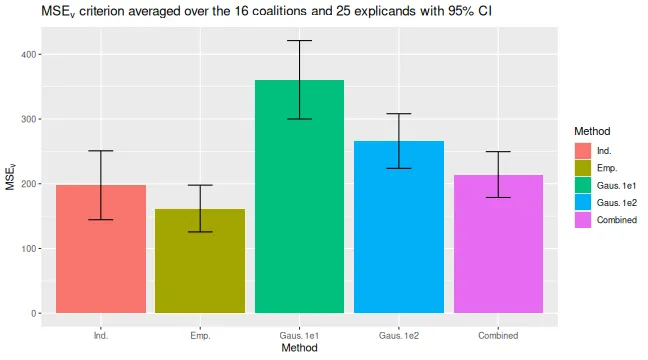

``` r

# The MSEv averaged over only the explicands for each coalition
MSEv_plots$MSEv_coalition_bar
```

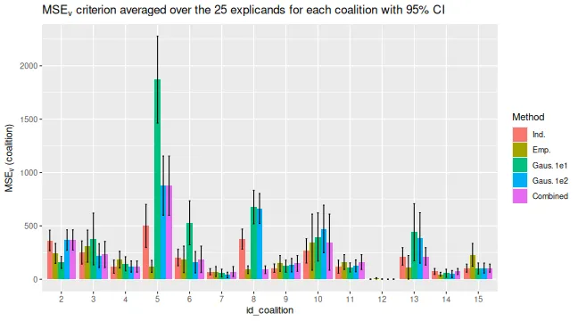

``` r

# The MSEv averaged over only the coalitions for each observation/explicand
MSEv_plots$MSEv_explicand_bar
```


``` r

# To see which coalition S each of the `id_coalition` corresponds to,
# i.e., which features that are conditions on.
explanation_list_named[[1]]$MSEv$MSEv_coalition[, c("id_coalition", "coalitions")]
#>     id_coalition coalitions
#>            <int>     <list>
#>  1:            2          1
#>  2:            3          2
#>  3:            4          3
#>  4:            5          4
#>  5:            6        1,2
#>  6:            7        1,3
#>  7:            8        1,4
#>  8:            9        2,3
#>  9:           10        2,4
#> 10:           11        3,4
#> 11:           12      1,2,3
#> 12:           13      1,2,4
#> 13:           14      1,3,4
#> 14:           15      2,3,4
```

We can specify the `index_x_explain` and `id_coalition` parameters in
[`plot_MSEv_eval_crit()`](https://norskregnesentral.github.io/shapr/reference/plot_MSEv_eval_crit.md)
to only plot certain test observations and coalitions, respectively.

``` r
# We can specify which test observations or coalitions to plot
plot_MSEv_eval_crit(explanation_list_named,
  plot_type = "explicand",
  index_x_explain = c(1, 3:4, 6),
  CI_level = 0.95
)$MSEv_explicand_bar
#> ℹ Showing 4 of 25 observations.
```

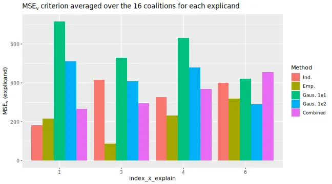

``` r
plot_MSEv_eval_crit(explanation_list_named,
  plot_type = "coalition",
  id_coalition = c(3, 4, 9, 13:15),
  CI_level = 0.95
)$MSEv_coalition_bar
#> ℹ Showing 10 of 25 observations.
```


We can also alter the plots design-wise as we do in the code below.

``` r
bar_text_n_decimals <- 1
plot_MSEv_eval_crit(explanation_list_named) +
  ggplot2::scale_x_discrete(limits = rev(levels(MSEv_plots$MSEv_bar$data$Method))) +
  ggplot2::coord_flip() +
  ggplot2::scale_fill_brewer(palette = "Paired") +
  ggplot2::theme_minimal() + # This must be set before other theme calls
  ggplot2::theme(
    plot.title = ggplot2::element_text(size = 10),
    legend.position = "bottom"
  ) +
  ggplot2::geom_text(
    ggplot2::aes(label = sprintf(
      paste("%.", sprintf("%d", bar_text_n_decimals), "f", sep = ""),
      round(MSEv, bar_text_n_decimals)
    )),
    vjust = -0.35, # This number might need altering for different plots sizes
    hjust = 1.1, # This number might need altering for different plots sizes
    color = "black",
    position = ggplot2::position_dodge(0.9),
    size = 4
  )
#> ℹ Showing 10 of 25 observations.
```

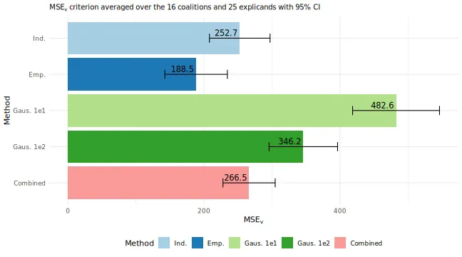

## Iterative estimation

Iterative estimation is the default when computing Shapley values with
six or more features (or feature groups), and can always be manually
overridden by setting `iterative = FALSE` in the
[`explain()`](https://norskregnesentral.github.io/shapr/reference/explain.md)
function. The idea behind iterative estimation is to estimate
sufficiently accurate Shapley value estimates faster. First, an initial
number of coalitions is sampled, then, bootsrapping is used to estimate
the variance of the Shapley values. A convergence criterion is used to
determine if the variances of the Shapley values are sufficiently small.
If the variances are too high, we estimate the number of required
samples to reach convergence, and thereby add more coalitions. The
process is repeated until the variances are below the threshold.
Specifics related to the iterative process and convergence criterion are
set through `iterative_args` argument.

The convergence criterion we use is adopted from Covert and Lee (2021),
and slightly modified to work for multiple observations

$$\operatorname{median}_{i}\left( \frac{\max\limits_{j}\widehat{\text{sd}}\left( {\widehat{\phi}}_{ij} \right)}{\max\limits_{j}{\widehat{\phi}}_{ij} - \min\limits_{j}{\widehat{\phi}}_{ij}} \right) < t$$

where ${\widehat{\phi}}_{ij}$ is the Shapley value of feature $j$ for
observation $i$, and $\text{sd}\left( \phi_{ij} \right)$ is the its
(bootstrap) estimated standard deviation. The default value of $t$ is
0.02. Below we provide some examples of how to use the iterative
estimation procedure.

``` r
library(xgboost)
library(data.table)

data("airquality")
data <- data.table::as.data.table(airquality)
data <- data[complete.cases(data), ]

x_var <- c("Solar.R", "Wind", "Temp", "Month", "Day")
y_var <- "Ozone"

ind_x_explain <- 1:6
x_train <- data[-ind_x_explain, ..x_var]
y_train <- data[-ind_x_explain, get(y_var)]
x_explain <- data[ind_x_explain, ..x_var]

# Set seed for reproducibility
set.seed(123)

# Fitting a basic xgboost model to the training data
model <- xgboost::xgboost(
  x = x_train,
  y = y_train,
  nround = 20,
  verbosity = 0
)

# Specifying the phi_0, i.e. the expected prediction without any features
p0 <- mean(y_train)

# Explanation with iterative computation
ex <- explain(
  model = model,
  x_explain = x_explain,
  x_train = x_train,
  approach = "gaussian",
  phi0 = p0,
  seed = 1,
  iterative = TRUE,
  iterative_args = list(convergence_tol = 0.1)
)
#>
#> ── Starting `shapr::explain()` at 2026-01-16 12:37:27
#> ℹ `max_n_coalitions` is `NULL` or larger than
#>   `2^n_features = 32`, and is therefore set to
#>   `2^n_features = 32`.
#>
#>
#> ── Explanation overview ──
#>
#>
#>
#> • Model class: <xgboost>
#>
#> • v(S) estimation class: Monte Carlo integration
#>
#> • Approach: gaussian
#>
#> • Procedure: Iterative
#>
#> • Number of Monte Carlo integration samples: 1000
#>
#> • Number of feature-wise Shapley values: 5
#>
#> • Number of observations to explain: 6
#>
#> • Computations (temporary) saved at:
#> '/tmp/Rtmpravdkd/shapr_obj_164841296634.rds'
#>
#>
#>
#> ── Iterative computation started ──
#>
#>
#>
#> ── Iteration 1 ───────────────────────────────────────
#>
#> ℹ Using 6 of 32 coalitions, 6 new.
#>
#>
#>
#> ── Iteration 2 ───────────────────────────────────────
#>
#> ℹ Using 8 of 32 coalitions, 2 new.
#>
#>
#>
#> ── Iteration 3 ───────────────────────────────────────
#>
#> ℹ Using 12 of 32 coalitions, 4 new.
#>
#>
#>
#> ── Iteration 4 ───────────────────────────────────────
#>
#> ℹ Using 14 of 32 coalitions, 2 new.
```

## Summary, Printing, and Result Extraction

As shown above, `print(explain_object)` displays the estimated Shapley
values from an object created using
[`explain()`](https://norskregnesentral.github.io/shapr/reference/explain.md).
This is the default behavior of the
[`print()`](https://rdrr.io/r/base/print.html) method for `shapr`
objects.

However, `print.shapr` also includes a `what` argument that controls
what is printed. This allows users to also display: - the standard
deviations arising from coalition sampling (`what = "shapley_sd"`),
and - variants of the [MSEv criterion](#MSEv) introduced above, using
`what = "MSEv"`, `"MSEv_explicand"`, or `"MSEv_coalition"`.

The `summary(explain_object)` function returns a `summary.shapr` object
containing a complete list of summary components. When called
interactively without assignment (or explicitly printed with
[`print()`](https://rdrr.io/r/base/print.html)), it displays a nicely
formatted summary to the console. When assigned to a variable, the
formatted output is suppressed, but the returned object can be used to
extract individual components later. Internally, `summary.shapr` calls
[`get_results()`](https://norskregnesentral.github.io/shapr/reference/get_results.md),
which produces this full set of components, including: the parameters
used, intermediate Shapley value estimates (and their standard
deviations), estimates of all $v(S)$, and more. See
[`?get_results`](https://norskregnesentral.github.io/shapr/reference/get_results.md)
for a full overview of the returned output.

Below, we illustrate these capabilities using the iterative explanation
object `ex` computed above.

``` r
# Uses the object ex to illustrate printing and summary functionality
print(ex) # Prints the estimated Shapley values by default
#>    explain_id  none Solar.R  Wind  Temp Month   Day
#>         <int> <num>   <num> <num> <num> <num> <num>
#> 1:          1  43.1    1.43  4.75 -20.3 -5.46 0.711
#> 2:          2  43.1   -3.52 -1.31 -16.8 -5.50 1.991
#> 3:          3  43.1   -1.17 -7.83 -11.2 -4.78 2.224
#> 4:          4  43.1    9.53 -7.07 -16.6 -4.46 0.247
#> 5:          5  43.1    8.43 -1.03 -22.1 -4.83 0.989
#> 6:          6  43.1   -2.66 -7.17 -12.4 -5.18 0.812
print(ex, what = "shapley_sd") # Prints the estimated standard deviations of the Shapley values
#>    explain_id  none Solar.R  Wind  Temp Month   Day
#>         <int> <num>   <num> <num> <num> <num> <num>
#> 1:          1     0   1.385 2.697 0.720 2.740 0.859
#> 2:          2     0   0.797 1.224 0.550 1.202 0.602
#> 3:          3     0   1.278 1.292 0.791 1.005 0.777
#> 4:          4     0   3.754 2.955 1.078 1.791 1.347
#> 5:          5     0   2.310 1.904 0.620 1.632 0.718
#> 6:          6     0   1.024 0.963 0.654 0.751 0.614
print(ex, what = "MSEv") # Prints the MSEv evaluation criterion
#>     MSEv MSEv_sd
#>    <num>   <num>
#> 1:   176    12.6

# When called without assignment, summary() prints formatted output to console
summary(ex)
#>
#> ── Summary of Shapley value explanation ──────────────
#> • Computed with `shapr::explain()` in 3.5 seconds,
#> started 2026-01-16 12:37:27
#> • Model class: <xgboost>
#> • v(S) estimation class: Monte Carlo integration
#> • Approach: gaussian
#> • Procedure: Iterative
#> • Number of Monte Carlo integration samples: 1000
#> • Number of feature-wise Shapley values: 5
#> • Number of observations to explain: 6
#> • Number of coalitions used: 14 (of total 32)
#> • Computations (temporary) saved at:
#> '/tmp/Rtmpravdkd/shapr_obj_164841296634.rds'
#>
#> ── Convergence info
#> ✔ Iterative Shapley value estimation stopped at 14 coalitions after 4 iterations, due to:
#> Standard deviation convergence threshold (0.1) reached: 0.087!
#>
#> ── Estimated Shapley values (sd in parentheses)
#>    explain_id      none      Solar.R         Wind          Temp        Month
#>         <int>    <char>       <char>       <char>        <char>       <char>
#> 1:          1 43.09 (0)  1.43 (1.39)  4.75 (2.70) -20.31 (0.72) -5.46 (2.74)
#> 2:          2 43.09 (0) -3.52 (0.80) -1.31 (1.22) -16.77 (0.55) -5.50 (1.20)
#> 3:          3 43.09 (0) -1.17 (1.28) -7.83 (1.29) -11.19 (0.79) -4.78 (1.01)
#> 4:          4 43.09 (0)  9.53 (3.75) -7.07 (2.96) -16.64 (1.08) -4.46 (1.79)
#> 5:          5 43.09 (0)  8.43 (2.31) -1.03 (1.90) -22.15 (0.62) -4.83 (1.63)
#> 6:          6 43.09 (0) -2.66 (1.02) -7.17 (0.96) -12.44 (0.65) -5.18 (0.75)
#>            Day
#>         <char>
#> 1: 0.71 (0.86)
#> 2: 1.99 (0.60)
#> 3: 2.22 (0.78)
#> 4: 0.25 (1.35)
#> 5: 0.99 (0.72)
#> 6: 0.81 (0.61)
#>
#>
#> ── Estimated MSEv
#>
#> Estimated MSE of v(S) = 176 (with sd = 13)

# When assigned, it returns a summary.shapr object with all components available for extraction
summary_ex <- summary(ex) # print(summary_ex) also provides the formatted output

summary_ex$shapley_est # The estimated Shapley values
#>    explain_id   none Solar.R    Wind    Temp   Month     Day
#>         <int>  <num>   <num>   <num>   <num>   <num>   <num>
#> 1:          1 43.086  1.4286  4.7521 -20.315 -5.4611 0.71096
#> 2:          2 43.086 -3.5184 -1.3111 -16.773 -5.5042 1.99097
#> 3:          3 43.086 -1.1714 -7.8251 -11.193 -4.7817 2.22354
#> 4:          4 43.086  9.5350 -7.0722 -16.640 -4.4607 0.24681
#> 5:          5 43.086  8.4310 -1.0295 -22.146 -4.8326 0.98870
#> 6:          6 43.086 -2.6600 -7.1738 -12.442 -5.1770 0.81207
summary_ex$shapley_sd # The estimated standard deviations of the Shapley values
#>    explain_id  none Solar.R   Wind    Temp   Month     Day
#>         <int> <num>   <num>  <num>   <num>   <num>   <num>
#> 1:          1     0 1.38523 2.6970 0.71961 2.73982 0.85914
#> 2:          2     0 0.79651 1.2244 0.54988 1.20189 0.60213
#> 3:          3     0 1.27829 1.2924 0.79077 1.00546 0.77693
#> 4:          4     0 3.75405 2.9552 1.07837 1.79060 1.34699
#> 5:          5     0 2.30995 1.9036 0.61982 1.63183 0.71767
#> 6:          6     0 1.02353 0.9635 0.65412 0.75063 0.61376
summary_ex$timing_summary$total_time_secs # Total computation time in seconds
#> [1] 3.4887
summary_ex$parameters$n_MC_samples # Number of Monte Carlo samples used
#> [1] 1000

summary_ex$parameters$gaussian.mu # Estimated mean vector (Gaussian approach)
#> [1] 184.2381   9.9181  78.4381   7.3429  16.6190
summary_ex$parameters$gaussian.cov_mat # Estimated covariance matrix (Gaussian approach)
#>           Solar.R     Wind     Temp   Month      Day
#> Solar.R 8378.0678 -41.1072 284.0966 -9.1882 -42.7738
#> Wind     -41.1072  13.0369 -17.3205 -1.0274   1.7137
#> Temp     284.0966 -17.3205  86.6908  4.4734 -16.0623
#> Month     -9.1882  -1.0274   4.4734  1.9967  -1.7143
#> Day      -42.7738   1.7137 -16.0623 -1.7143  71.3535

# Alternatively, use get_results() to get the same components without printing the summary
res_ex <- get_results(ex)

# You may also extract individual summary components directly using get_results()
get_results(ex, what = "shapley_sd")
#>    explain_id  none Solar.R   Wind    Temp   Month     Day
#>         <int> <num>   <num>  <num>   <num>   <num>   <num>
#> 1:          1     0 1.38523 2.6970 0.71961 2.73982 0.85914
#> 2:          2     0 0.79651 1.2244 0.54988 1.20189 0.60213
#> 3:          3     0 1.27829 1.2924 0.79077 1.00546 0.77693
#> 4:          4     0 3.75405 2.9552 1.07837 1.79060 1.34699
#> 5:          5     0 2.30995 1.9036 0.61982 1.63183 0.71767
#> 6:          6     0 1.02353 0.9635 0.65412 0.75063 0.61376
get_results(ex, what = "dt_vS")
#> Index: <id_coalition>
#>     id_coalition p_hat1_1 p_hat1_2 p_hat1_3 p_hat1_4 p_hat1_5 p_hat1_6
#>            <num>    <num>    <num>    <num>    <num>    <num>    <num>
#>  1:            1   43.086   43.086   43.086   43.086   43.086   43.086
#>  2:            2   20.672   23.742   25.557   18.441   20.289   18.358
#>  3:            3   49.810   48.921   48.867   48.283   47.242   47.945
#>  4:            4   46.513   38.602   41.850   57.125   56.020   34.916
#>  5:            5   40.838   36.789   24.698   23.180   34.346   19.999
#>  6:            6   36.619   36.375   36.366   36.024   35.761   35.990
#>  7:            7   20.501   24.199   25.712   17.099   19.566   16.705
#>  8:            8   20.906   24.090   26.848   23.487   25.621   19.646
#>  9:            9   27.235   18.286   18.735   26.061   24.861   18.078
#> 10:           10   41.170   29.508   23.319   31.382   43.829   16.671
#> 11:           11   40.285   30.598   23.124   30.100   44.174   15.267
#> 12:           12   27.371   18.251   19.601   26.170   24.858   18.345
#> 13:           13   22.901   19.603   21.205   16.351   19.159   14.798
#> 14:           14   24.201   17.970   20.338   24.695   24.498   16.445
```

## Parallelization

The `shapr` package supports parallelization of the Shapley value
estimation process through the `future` package. The parallelization is
conducted over batches of `v(S)`-values. We therefore start by
describing this batch computing.

### Batch computation

The computational complexity of Shapley value based explanations grows
fast in the number of features, as the number of conditional
expectations one needs to estimate in the Shapley formula grows
exponentially. As outlined [above](#KSHAP), the estimating of each of
these conditional expectations is also computationally expensive,
typically requiring estimation of a conditional probability
distribution, followed by Monte Carlo integration. These computations
are not only heavy for the CPU, they also require a lot of memory (RAM),
which typically is a limited resource. By doing the most resource-hungry
computations (the computation of v(S)) in sequential batches with
different feature subsets $S$, the memory usage can be significantly
reduced. The user can control the number of batches by setting the two
arguments `extra_computation_args$max_batch_size` (defaults to 10) and
`extra_computation_args$min_n_batches` (defaults to 10).

### Parallelized computation

In addition to reducing the memory consumption, the batch computing
allows the computations within each batch to be performed in parallel.
The parallelization in
[`shapr::explain()`](https://norskregnesentral.github.io/shapr/reference/explain.md)
is handled by the `future_apply` package which builds on the `future`
environment. These packages work on all OSes, allow the user to decide
the parallelization backend (multiple R processes or forking), work
directly with HPC clusters, and also supports progress updates for the
parallelized task via the associated `progressr` package (see [Verbosity
and progress updates](#verbose)).

Note that, since it takes some time to duplicate data into different
processes/machines when running in parallel, it is not always preferable
to run
[`shapr::explain()`](https://norskregnesentral.github.io/shapr/reference/explain.md)
in parallel, at least not with many parallel sessions/workers.
Parallelization also increases the memory consumption proportionally, so
you may want to limit the number of workers for that reason too. Below
is a basic example of a parallelization with two workers.

``` r
library(future)
future::plan(multisession, workers = 2)

explanation_par <- explain(
  model = model,
  x_explain = x_explain,
  x_train = x_train,
  approach = "empirical",
  phi0 = p0,
  seed = 1
)
#>
#> ── Starting `shapr::explain()` at 2026-01-16 12:37:32
#> ℹ `max_n_coalitions` is `NULL` or larger than
#>   `2^n_features = 32`, and is therefore set to
#>   `2^n_features = 32`.
#>
#>
#> ── Explanation overview ──
#>
#>
#>
#> • Model class: <xgboost>
#>
#> • v(S) estimation class: Monte Carlo integration
#>
#> • Approach: empirical
#>
#> • Procedure: Non-iterative
#>
#> • Number of Monte Carlo integration samples: 1000
#>
#> • Number of feature-wise Shapley values: 5
#>
#> • Number of observations to explain: 6
#>
#> • Computations (temporary) saved at:
#> '/tmp/Rtmpravdkd/shapr_obj_16485b97d4aa.rds'
#>
#>
#>
#> ── Main computation started ──
#>
#>
#>
#> ℹ Using 32 of 32 coalitions.

future::plan(sequential) # To return to non-parallel computation
```

## Verbosity and progress updates

The `verbose` argument controls the verbosity of the output while
running
[`explain()`](https://norskregnesentral.github.io/shapr/reference/explain.md),
and allows one or more of the strings `"basic"`, `"progress"`,
`"convergence"`, `"shapley"` and `"vS_details"`. `"basic"` (default)
displays basic information about the computation which is being
performed, `"progress` displays information about where in the
calculation process the function currently is, `"convergence"` displays
information on how close to convergence the Shapley value estimates are
(for iterative estimation), `"shapley"` displays (intermediate) Shapley
value estimates and standard deviations + the final estimates, while
`"vS_details"` displays information about the `v(S)` estimates for some
of the approaches. If the user wants no printout, the argument can be
set to `NULL`.

In addition, progress updates for the computation of the `v(S)` values
are (optionally) provided through the R-package `progressr`. This gives
the user full control over the visual appearance of these progress
updates. The main reason for providing this separate progress update
feature is that it integrates seamlessly with the parallelization
framework `future` used by `shapr` (see [Parallelization](#para)), and
apparently is the only framework allowing progress updates also for
parallelized tasks. These progress updates can be used in combination
with, or independently of, the `verbose` argument.

These progress updates via `progressr` can be enabled for the current
R-session by running the command `progressr::handlers(local=TRUE)`,
before calling
[`explain()`](https://norskregnesentral.github.io/shapr/reference/explain.md).
To use progress updates for only a single call to
[`explain()`](https://norskregnesentral.github.io/shapr/reference/explain.md),
one can wrap the call using
[`progressr::with_progress`](https://progressr.futureverse.org/reference/with_progress.html)
as follows: `progressr::with_progress({ shapr::explain() })` The default
appearance of the progress updates is a basic ASCII-based horizontal
progress bar. Other variants can be chosen by passing different strings
to
[`progressr::handlers()`](https://progressr.futureverse.org/reference/handlers.html),
some of which require additional packages. If you are using RStudio, the
progress can be displayed directly in the GUI with
`progressr::handlers('rstudio')` (requires the `rstudioapi` package). If
you are running Windows, you may use the pop-up GUI progress bar
`progressr::handlers('handler_winprogressbar')`. A wrapper for
progressbar of the flexible `cli` package, is also available
`progressr::handlers('cli')`.

For a full list of all progression handlers and the customization
options available with `progressr`, see the `progressr`
[vignette](https://progressr.futureverse.org/articles/progressr-01-intro.html).
A full code example of using `progressr` with `shapr` is shown below:

``` r
library(progressr)
progressr::handlers(global = TRUE)
handlers("cli")
# If no progression handler is specified, the txtprogressbar is used
# Other progression handlers:
# progressr::handlers('progress') # requires the 'progress' package
# progressr::handlers('rstudio') # requires the 'rstudioapi' package
# progressr::handlers('handler_winprogressbar') # Window only
ex_progress <- explain(
  model = model,
  x_explain = x_explain,
  x_train = x_train,
  approach = "empirical",
  phi0 = p0,
  seed = 1
)

# ■■■■■■■■■■■                       32% | Estimating v(S) ETA:  2s
```

## Advanced usage

### Combined approach

In addition to letting the user select one of the five aforementioned
approaches for estimating the conditional distribution of the data (i.e.
`approach` equals either [`"gaussian"`](#gaussian),
[`"copula"`](#copula), [`"empirical"`](#empirical), [`"ctree"`](#ctree),
[`"vaeac"`](#vaeac), [`"categorical"`](#categorical)) or `"timeseries"`,
the package allows the user to combine the given approaches. The
`'regression_surrogate'` and `'regression_separate` approaches are not
supported for the combined approach. To simplify the usage, the
flexibility is restricted such that the same approach is used when
conditioning on the same number of features. This is also in line Aas,
Jullum, and Løland (2021, sec. 3.4).

This can be done by setting `approach` equal to a character vector,
where the length of the vector is one less than the number of features
in the model. Consider a situation where you have trained a model that
consists of 10 features, and you would like to use the `"empirical"`
approach when you condition on 1-3 features, the `"copula"` approach
when you condition on 4-5 features, and the `"gaussian"` approach when
conditioning on 6 or more features. This can be applied by simply
passing
`approach = c(rep("empirical", 3), rep("copula", 2), rep("gaussian", 4))`,
i.e. `approach[i]` determines which method to use when conditioning on
`i` features. Conditioning on all features needs no approach as that is
given by the complete prediction itself, and should thus not be part of
the vector.

The code below exemplifies this approach for a case where there are four
features, using `"empirical", "copula"` and `"gaussian"` when
conditioning on respectively 1, 2 and 3 features.

``` r
library(xgboost)
library(data.table)

data("airquality")
data <- data.table::as.data.table(airquality)
data <- data[complete.cases(data), ]

x_var <- c("Solar.R", "Wind", "Temp", "Month")
y_var <- "Ozone"

ind_x_explain <- 1:6
x_train <- data[-ind_x_explain, ..x_var]
y_train <- data[-ind_x_explain, get(y_var)]
x_explain <- data[ind_x_explain, ..x_var]

# Set seed for reproducibility
set.seed(123)

# Fitting a basic xgboost model to the training data
model <- xgboost::xgboost(
  x = x_train,
  y = y_train,
  nround = 20,
  verbosity = 0
)

# Specifying the phi_0, i.e. the expected prediction without any features
p0 <- mean(y_train)


# Use the combined approach
explanation_combined <- explain(
  model = model,
  x_explain = x_explain,
  x_train = x_train,
  approach = c("empirical", "copula", "gaussian"),
  phi0 = p0,
  seed = 1
)
#>
#> ── Starting `shapr::explain()` at 2026-01-16 12:37:39
#> ℹ `max_n_coalitions` is `NULL` or larger than
#>   `2^n_features = 16`, and is therefore set to
#>   `2^n_features = 16`.
#>
#>
#> ── Explanation overview ──
#>
#>
#>
#> • Model class: <xgboost>
#>
#> • v(S) estimation class: Monte Carlo integration
#>
#> • Approach: empirical, copula, and gaussian
#>
#> • Procedure: Non-iterative
#>
#> • Number of Monte Carlo integration samples: 1000
#>
#> • Number of feature-wise Shapley values: 4
#>
#> • Number of observations to explain: 6
#>
#> • Computations (temporary) saved at:
#> '/tmp/Rtmpravdkd/shapr_obj_1648480f066b.rds'
#>
#>
#>
#> ── Main computation started ──
#>
#>
#>
#> ℹ Using 16 of 16 coalitions.
# Plot the resulting explanations for observations 1 and 6, excluding
# the no-covariate effect
plot(explanation_combined, bar_plot_phi0 = FALSE, index_x_explain = c(1, 6))
```

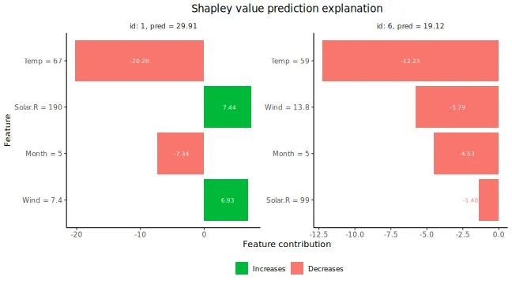

As a second example using `"ctree"` to condition on 1 and 2 features,
and `"empirical"` when conditioning on 3 features:

``` r
# Use the combined approach
explanation_combined <- explain(
  model = model,
  x_explain = x_explain,
  x_train = x_train,
  approach = c("ctree", "ctree", "empirical"),
  phi0 = p0,
  seed = 1
)
#>
#> ── Starting `shapr::explain()` at 2026-01-16 12:37:41
#> ℹ `max_n_coalitions` is `NULL` or larger than
#>   `2^n_features = 16`, and is therefore set to
#>   `2^n_features = 16`.
#>
#>
#> ── Explanation overview ──
#>
#>
#>
#> • Model class: <xgboost>
#>
#> • v(S) estimation class: Monte Carlo integration
#>
#> • Approach: ctree, ctree, and empirical
#>
#> • Procedure: Non-iterative
#>
#> • Number of Monte Carlo integration samples: 1000
#>
#> • Number of feature-wise Shapley values: 4
#>
#> • Number of observations to explain: 6
#>
#> • Computations (temporary) saved at:
#> '/tmp/Rtmpravdkd/shapr_obj_16481434ab19.rds'
#>
#>
#>
#> ── Main computation started ──
#>
#>
#>
#> ℹ Using 16 of 16 coalitions.
```

### Explain groups of features

In some cases, especially when the number of features is very large, it
may be more appropriate to explain predictions in terms of groups of
features instead of single features, see (Jullum, Redelmeier, and Aas
(2021)) for intuition and real-world examples. Explaining predictions in
terms of groups of features is very easy using `shapr`:

``` r
# Define the feature groups
group_list <- list(
  A = c("Temp", "Month"),
  B = c("Wind", "Solar.R")
)

# Use the empirical approach
explanation_group <- explain(
  model = model,
  x_explain = x_explain,
  x_train = x_train,
  approach = "empirical",
  phi0 = p0,
  seed = 1,
  group = group_list
)
#>
#> ── Starting `shapr::explain()` at 2026-01-16 12:37:44
#> ℹ `max_n_coalitions` is `NULL` or larger than
#>   `2^n_groups = 4`, and is therefore set to
#>   `2^n_groups = 4`.
#>
#>
#> ── Explanation overview ──
#>
#>
#>
#> • Model class: <xgboost>
#>
#> • v(S) estimation class: Monte Carlo integration
#>
#> • Approach: empirical
#>
#> • Procedure: Non-iterative
#>
#> • Number of Monte Carlo integration samples: 1000
#>
#> • Number of group-wise Shapley values: 2
#>
#> • Feature groups: A: {"Temp", "Month"}; B: {"Wind",
#> "Solar.R"}
#>
#> • Number of observations to explain: 6
#>
#> • Computations (temporary) saved at:
#> '/tmp/Rtmpravdkd/shapr_obj_164832b60af4.rds'
#>
#>
#>
#> ── Main computation started ──
#>
#>
#>
#> ℹ Using 4 of 4 coalitions.
# Prints the group-wise explanations
explanation_group
#>    explain_id  none     A      B
#>         <int> <num> <num>  <num>
#> 1:          1  43.1 -29.0  14.06
#> 2:          2  43.1 -17.0  -8.65
#> 3:          3  43.1 -12.5 -14.35
#> 4:          4  43.1 -21.5  -4.53
#> 5:          5  43.1 -26.4   4.39
#> 6:          6  43.1 -20.4  -7.15
# Plots the group-wise explanations
plot(explanation_group, bar_plot_phi0 = TRUE, index_x_explain = c(1, 6))
```

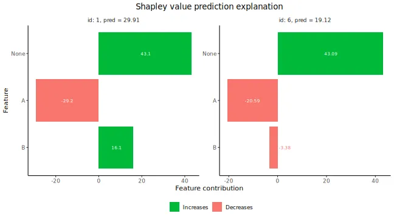

### Explain custom models

`shapr` currently natively supports explanation of predictions from
models fitted with the following functions:

- [`stats::lm`](https://rdrr.io/r/stats/lm.html)
- [`stats::glm`](https://rdrr.io/r/stats/glm.html)
- [`ranger::ranger`](http://imbs-hl.github.io/ranger/reference/ranger.md)
- [`mgcv::gam`](https://rdrr.io/pkg/mgcv/man/gam.html)
- [`xgboost::xgboost`](https://rdrr.io/pkg/xgboost/man/xgboost.html)/[`xgboost::xgb.train`](https://rdrr.io/pkg/xgboost/man/xgb.train.html)
- [`workflows::workflow`](https://workflows.tidymodels.org/reference/workflow.html)

Any continuous response regression model or binary classification model
of these model classes, can be explained with the package directly as
exemplified above, while we give an example for the
[`workflows::workflow`](https://workflows.tidymodels.org/reference/workflow.html)
in the [`tidymodels`/`workflows`](#workflow_example) section. Moreover,
essentially any feature dependent prediction model can be explained by
the package by specifying two (or one) simple additional functions for
your model.

The first function is `predict_model`, taking the model and data (as a
`matrix` or `data.frame/data.table`) as input and outputting the
corresponding prediction as a numeric vector. The second (optional, but
highly recommended) function is `get_model_specs`, taking the model as
input and outputting a list with the following elements: *labels*
(vector with the feature names to compute Shapley values for), *classes*
(a named vector with the labels as names and the class type as
elements), *factor_levels* (a named list with the labels as names and
vectors with the factor levels as elements (NULL if the feature is not a
factor)). The `get_model_specs` function is used to check that the data
passed to `explain` have the correct format in terms of the necessary
feature columns being available and having the correct class/attributes.
It is highly recommended to do such checks in order to ensure correct
usage of `explain`. If, for some reason, such checking is not desirable,
one does not have to provide the `get_model_specs` function. This will,
however, throw a warning that all feature consistency checking against
the model is disabled.

Once the above functions are created, you can explain predictions from
this model as before by passing the functions through the input
arguments `predict_model` and `get_model_specs` of
[`explain()`](https://norskregnesentral.github.io/shapr/reference/explain.md).

These functions **can** be made general enough to handle all supported
model types of that class, or they can be made minimal, possibly only
allowing explanation of the specific version of the model class at hand.
Below we give examples of both full support versions of these functions
and a minimal version which skips the `get_model_specs` function. We do
this for the `gbm` model class from the `gbm` package, fitted to the
same airquality data set as used above.

``` r
library(gbm)
#> Loaded gbm 2.2.2
#> This version of gbm is no longer under development. Consider transitioning to gbm3, https://github.com/gbm-developers/gbm3

formula_gbm <- as.formula(paste0(y_var, "~", paste0(x_var, collapse = "+")))
# Fitting a gbm model
set.seed(825)
model_gbm <- gbm::gbm(
  formula_gbm,
  data = cbind(x_train, Ozone = y_train),
  distribution = "gaussian"
)

#### Full feature versions of the three required model functions ####
MY_predict_model <- function(x, newdata) {
  if (!requireNamespace("gbm", quietly = TRUE)) {
    stop("The gbm package is required for predicting train models")
  }
  model_type <- ifelse(
    x$distribution$name %in% c("bernoulli", "adaboost"),
    "classification",
    "regression"
  )
  if (model_type == "classification") {
    predict(x, as.data.frame(newdata), type = "response", n.trees = x$n.trees)
  } else {
    predict(x, as.data.frame(newdata), n.trees = x$n.trees)
  }
}
MY_get_model_specs <- function(x) {
  feature_specs <- list()
  feature_specs$labels <- labels(x$Terms)
  m <- length(feature_specs$labels)
  feature_specs$classes <- attr(x$Terms, "dataClasses")[-1]
  feature_specs$factor_levels <- setNames(vector("list", m), feature_specs$labels)
  feature_specs$factor_levels[feature_specs$classes == "factor"] <- NA # model object doesn't contain factor levels info
  return(feature_specs)
}

# Compute the Shapley values
set.seed(123)
p0 <- mean(y_train)
explanation_custom <- explain(
  model = model_gbm,
  x_explain = x_explain,
  x_train = x_train,
  approach = "empirical",
  phi0 = p0,
  seed = 1,
  predict_model = MY_predict_model,
  get_model_specs = MY_get_model_specs
)
#>
#> ── Starting `shapr::explain()` at 2026-01-16 12:37:46
#> ℹ `max_n_coalitions` is `NULL` or larger than
#>   `2^n_features = 16`, and is therefore set to
#>   `2^n_features = 16`.
#>
#>
#> ── Explanation overview ──
#>
#>
#>
#> • Model class: <gbm>
#>
#> • v(S) estimation class: Monte Carlo integration
#>
#> • Approach: empirical
#>
#> • Procedure: Non-iterative
#>
#> • Number of Monte Carlo integration samples: 1000
#>
#> • Number of feature-wise Shapley values: 4
#>
#> • Number of observations to explain: 6
#>
#> • Computations (temporary) saved at:
#> '/tmp/Rtmpravdkd/shapr_obj_16483d7736c0.rds'
#>
#>
#>
#> ── Main computation started ──
#>
#>
#>
#> ℹ Using 16 of 16 coalitions.

# Plot results
plot(explanation_custom, index_x_explain = c(1, 6))
```

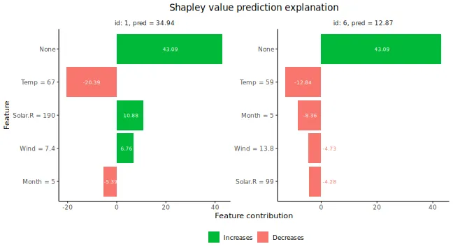

``` r


#### Minimal version of the custom model setup ####
# Note: Working only for this exact version of the model class
# Avoiding to define get_model_specs skips all feature
# consistency checking between your data and model
MY_MINIMAL_predict_model <- function(x, newdata) {
  predict(x, as.data.frame(newdata), n.trees = x$n.trees)
}

# Compute the Shapley values
set.seed(123)
explanation_custom_minimal <- explain(
  model = model_gbm,
  x_explain = x_explain,
  x_train = x_train,
  approach = "empirical",
  phi0 = p0,
  seed = 1,
  predict_model = MY_MINIMAL_predict_model
)
#>
#> ── Starting `shapr::explain()` at 2026-01-16 12:37:50
#> ℹ You passed a model to `shapr::explain()` which is
#>   not natively supported, and did not supply a
#>   `get_model_specs` function to `shapr::explain()`.
#>   Consistency checks between model and data are
#>   therefore disabled.
#> ℹ `max_n_coalitions` is `NULL` or larger than
#>   `2^n_features = 16`, and is therefore set to
#>   `2^n_features = 16`.
#> ── Explanation overview ──
#>
#> • Model class: <gbm>
#> • v(S) estimation class: Monte Carlo integration
#> • Approach: empirical
#> • Procedure: Non-iterative
#> • Number of Monte Carlo integration samples: 1000
#> • Number of feature-wise Shapley values: 4
#> • Number of observations to explain: 6
#> • Computations (temporary) saved at:
#> '/tmp/Rtmpravdkd/shapr_obj_1648a806475.rds'
#>
#> ── Main computation started ──
#>
#> ℹ Using 16 of 16 coalitions.

# Plot results
plot(explanation_custom_minimal, index_x_explain = c(1, 6))
```


### Tidymodels and workflows

In this section, we demonstrate how to use `shapr` to explain
`tidymodels` models fitted using `workflows`. In the example
[above](#examples), we directly used the `xgboost` package to fit the
`xgboost` model. However, we can also fit the `xgboost` model using the
`tidymodels` package. These fits will be identical, as `tidymodels`
calls `xgboost` internally, which we demonstrate in the example below.
Note that we can replace `xgboost` (i.e.,
[`parsnip::boost_tree`](https://parsnip.tidymodels.org/reference/boost_tree.html))
with any other fitted `tidymodels` model in the `workflows` procedure
outlined below.

``` r
# Fitting a basic xgboost model to the training data using tidymodels
set.seed(123) # Set the same seed as above
all_var <- c(y_var, x_var)
train <- data[-ind_x_explain, ..all_var]

# Fitting the `tidymodels` model using `workflows`
model_tidymodels <- parsnip::fit(
  workflows::add_recipe(
    workflows::add_model(
      workflows::workflow(),
      parsnip::boost_tree(trees = 20, engine = "xgboost", mode = "regression")
    ),
    recipes::recipe(Ozone ~ ., data = train)
  ),
  data = train
)

# # We can also specify the same model using pipes `%>%` by (if pipes are installed/loaded)
# model_tidymodels <-
#   workflows::workflow() %>%
#   workflows::add_model(parsnip::boost_tree(trees = 20, engine = "xgboost", mode = "regression")) %>%
#   workflows::add_recipe(recipes::recipe(Ozone ~ ., data = train)) %>%
#   parsnip::fit(data = train)

# See that the output of the two models are identical
all.equal(predict(model_tidymodels, x_train)$.pred, predict(model, as.matrix(x_train)))
#> [1] TRUE

# Create the Shapley values for the tidymodels version
explanation_tidymodels <- explain(
  model = model_tidymodels,
  x_explain = x_explain,
  x_train = x_train,
  approach = "empirical",
  phi0 = p0,
  seed = 1
)
#>
#> ── Starting `shapr::explain()` at 2026-01-16 12:37:55
#> ℹ `max_n_coalitions` is `NULL` or larger than
#>   `2^n_features = 16`, and is therefore set to
#>   `2^n_features = 16`.
#>
#>
#> ── Explanation overview ──
#>
#>
#>
#> • Model class: <workflow>
#>
#> • v(S) estimation class: Monte Carlo integration
#>
#> • Approach: empirical
#>
#> • Procedure: Non-iterative
#>
#> • Number of Monte Carlo integration samples: 1000
#>
#> • Number of feature-wise Shapley values: 4
#>
#> • Number of observations to explain: 6
#>
#> • Computations (temporary) saved at:
#> '/tmp/Rtmpravdkd/shapr_obj_164832b4b12f.rds'
#>
#>
#>
#> ── Main computation started ──
#>
#>
#>
#> ℹ Using 16 of 16 coalitions.

# See that the Shapley value explanations are identical too
all.equal(explanation$shapley_values_est, explanation_tidymodels$shapley_values_est)
#> [1] TRUE
```

### The parameters of the `vaeac` approach

The `vaeac` approach is a very flexible method that supports mixed data.
The main parameters are the number of layers in the networks
(`vaeac.depth`), the width of the layers (`vaeac.width`), the number of
dimensions in the latent space (`vaeac.latent_dim`), the activation
function between the layers in the networks
(`vaeac.activation_function`), the learning rate in the ADAM optimizer
(`vaeac.lr`), the number of `vaeac` models to initiate to remedy poorly
initiated model parameter values (`vaeac.n_vaeacs_initialize`), and the
number of learning epochs (`vaeac.epochs`). Call
[`?shapr::setup_approach.vaeac`](https://norskregnesentral.github.io/shapr/reference/setup_approach.md)
for a more detailed description of the parameters.

There are additional extra parameters which can be set by including a
named list in the call to the
[`explain()`](https://norskregnesentral.github.io/shapr/reference/explain.md)
function. For example, we can change the batch size to 32 by including
`vaeac.extra_parameters = list(vaeac.batch_size = 32)` as a parameter in
the call to the
[`explain()`](https://norskregnesentral.github.io/shapr/reference/explain.md)
function. See
[`?shapr::vaeac_get_extra_para_default`](https://norskregnesentral.github.io/shapr/reference/vaeac_get_extra_para_default.md)
for a description of the possible extra parameters to the `vaeac`
approach. The main parameters are directly entered to the
[`explain()`](https://norskregnesentral.github.io/shapr/reference/explain.md)
function, while the extra parameters are included in a named list called
`vaeac.extra_parameters`.

``` r
explanation_vaeac <- explain(
  model = model,
  x_explain = x_explain,
  x_train = x_train,
  approach = "vaeac",
  phi0 = p0,
  seed = 1,
  n_MC_samples = 100,
  vaeac.width = 16,
  vaeac.depth = 2,
  vaeac.epochs = 3,
  vaeac.n_vaeacs_initialize = 2
)
#>
#> ── Starting `shapr::explain()` at 2026-01-16 12:37:58
#> ℹ `max_n_coalitions` is `NULL` or larger than
#>   `2^n_features = 16`, and is therefore set to
#>   `2^n_features = 16`.
#>
#>
#> ── Explanation overview ──
#>
#>
#>
#> • Model class: <xgboost>
#>
#> • v(S) estimation class: Monte Carlo integration
#>
#> • Approach: vaeac
#>
#> • Procedure: Non-iterative
#>
#> • Number of Monte Carlo integration samples: 100
#>
#> • Number of feature-wise Shapley values: 4
#>
#> • Number of observations to explain: 6
#>
#> • Computations (temporary) saved at:
#> '/tmp/Rtmpravdkd/shapr_obj_16481433a18c.rds'
#>
#>
#>
#> ── Main computation started ──
#>
#>
#>
#> ℹ Using 16 of 16 coalitions.
```

We can look at the training and validation errors for the trained
`vaeac` model and see that `vaeac.epochs = 3` is likely too few epochs,
as it still seems like the `vaeac` model is learning.

``` r
# Look at the training and validation errors.
plot_vaeac_eval_crit(list("Vaeac 3 epochs" = explanation_vaeac), plot_type = "method")
```

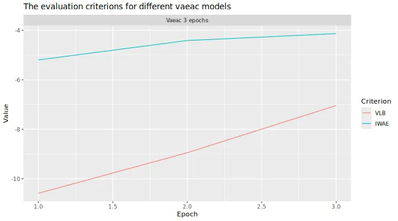

#### Early stopping

If we are uncertain about the choice of `vaeac.epochs`, we can rather
use `vaeac` with early stopping. We will then set `vaeac.epochs` to a
large number, which will act as a maximum number of allowed epochs, and
in the `vaeac.extra_parameters` list we set
`vaeac.epochs_early_stopping` to the number of epochs we allow the
`vaeac` model to not improve its validation score. That is, if
`vaeac.epochs_early_stopping = 2`, then `vaeac` will stop the training
procedure if there has been no improvement in the validation score for
`2` consecutive epochs, or if `vaeac.epochs` is reached. Note that if
using early stopping and progress updates simultaneously, then the
estimated timer remaining will obviously be incorrect if early stopping
is applied. Furthermore, a value of `2` is too low for real world
applications, but we set it so low here to make the vignette faster to
build.

``` r
explanation_vaeac_early_stop <- explain(
  model = model,
  x_explain = x_explain,
  x_train = x_train,
  approach = "vaeac",
  phi0 = p0,
  seed = 1,
  n_MC_samples = 100,
  vaeac.width = 16,
  vaeac.depth = 2,
  vaeac.epochs = 1000, # Set it to a large number
  vaeac.n_vaeacs_initialize = 2,
  vaeac.extra_parameters = list(vaeac.epochs_early_stopping = 2)
)
#>
#> ── Starting `shapr::explain()` at 2026-01-16 12:38:14
#> ℹ `max_n_coalitions` is `NULL` or larger than
#>   `2^n_features = 16`, and is therefore set to
#>   `2^n_features = 16`.
#>
#>
#> ── Explanation overview ──
#>
#>
#>
#> • Model class: <xgboost>
#>
#> • v(S) estimation class: Monte Carlo integration
#>
#> • Approach: vaeac
#>
#> • Procedure: Non-iterative
#>
#> • Number of Monte Carlo integration samples: 100
#>
#> • Number of feature-wise Shapley values: 4
#>
#> • Number of observations to explain: 6
#>
#> • Computations (temporary) saved at:
#> '/tmp/Rtmpravdkd/shapr_obj_16486390b378.rds'
#>
#>
#>
#> ── Main computation started ──
#>
#>
#>
#> ℹ Using 16 of 16 coalitions.
```

Can compare with the previous version and see that the results are more
stable now.

``` r
# Look at the training and validation errors.
plot_vaeac_eval_crit(
  list("Vaeac 3 epochs" = explanation_vaeac, "Vaeac early stopping" = explanation_vaeac_early_stop),
  plot_type = "method"
)
```

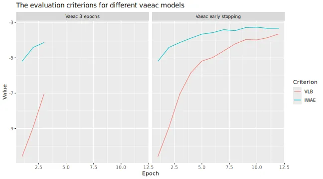

Can also compare the $MSE_{v}$ evaluation scores.

``` r
plot_MSEv_eval_crit(list("Vaeac 3 epochs" = explanation_vaeac, "Vaeac early stopping" = explanation_vaeac_early_stop))
```

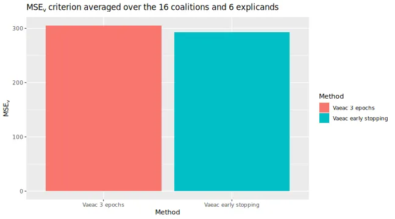

### Continued computation

In this section, we demonstrate how to continue to improve estimation
accuracy with additional coalition samples, from a previous Shapley
value computation based on
[`shapr::explain()`](https://norskregnesentral.github.io/shapr/reference/explain.md)
with the iterative estimation procedure. This can be done either by
passing an existing object of class `shapr`, or by passing a string with
the path to the intermediately saved results. The latter is found at
`SHAPR_OBJ$saving_path`, defaults to a temporary folder, and is updated
after each iteration. This can be particularly handy for long-running
computations.

``` r
# First we run the computation with the iterative estimation procedure for a limited number of coalition samples
library(xgboost)
library(data.table)

data("airquality")
data <- data.table::as.data.table(airquality)
data <- data[complete.cases(data), ]

x_var <- c("Solar.R", "Wind", "Temp", "Month", "Day")
y_var <- "Ozone"

ind_x_explain <- 1:6
x_train <- data[-ind_x_explain, ..x_var]
y_train <- data[-ind_x_explain, get(y_var)]
x_explain <- data[ind_x_explain, ..x_var]

# Set seed for reproducibility
set.seed(123)

# Fitting a basic xgboost model to the training data
model <- xgboost::xgboost(
  x = x_train,
  y = y_train,
  nround = 20,
  verbosity = 0
)

# Specifying the phi_0, i.e. the expected prediction without any features
p0 <- mean(y_train)

# Initial explanation computation
ex_init <- explain(
  model = model,
  x_explain = x_explain,
  x_train = x_train,
  approach = "gaussian",
  phi0 = p0,
  seed = 1,
  max_n_coalitions = 20,
  iterative = TRUE
)
#>
#> ── Starting `shapr::explain()` at 2026-01-16 12:38:39
#>
#> ── Explanation overview ──
#>
#> • Model class: <xgboost>
#> • v(S) estimation class: Monte Carlo integration
#> • Approach: gaussian
#> • Procedure: Iterative
#> • Number of Monte Carlo integration samples: 1000
#> • Number of feature-wise Shapley values: 5
#> • Number of observations to explain: 6
#> • Computations (temporary) saved at:
#> '/tmp/Rtmpravdkd/shapr_obj_16482bbd289e.rds'
#>
#> ── Iterative computation started ──
#>
#> ── Iteration 1 ───────────────────────────────────────
#> ℹ Using 6 of 32 coalitions, 6 new.
#>
#> ── Iteration 2 ───────────────────────────────────────
#> ℹ Using 8 of 32 coalitions, 2 new.
#>
#> ── Iteration 3 ───────────────────────────────────────
#> ℹ Using 12 of 32 coalitions, 4 new.
#>
#> ── Iteration 4 ───────────────────────────────────────
#> ℹ Using 18 of 32 coalitions, 6 new.
#>
#> ── Iteration 5 ───────────────────────────────────────
#> ℹ Using 20 of 32 coalitions, 2 new.

# Using the ex_init object to continue the computation with 4 more coalition samples
ex_further <- explain(
  model = model,
  x_explain = x_explain,
  x_train = x_train,
  approach = "gaussian",
  phi0 = p0,
  seed = 1,
  max_n_coalitions = 24,
  iterative_args = list(convergence_tol = 0.005), # Decrease the convergence threshold
  prev_shapr_object = ex_init
)
#>
#> ── Starting `shapr::explain()` at 2026-01-16 12:38:46
#>
#> ── Explanation overview ──
#>
#> • Model class: <xgboost>
#> • v(S) estimation class: Monte Carlo integration
#> • Approach: gaussian
#> • Procedure: Non-iterative
#> • Number of Monte Carlo integration samples: 1000
#> • Number of feature-wise Shapley values: 5
#> • Number of observations to explain: 6
#> • Computations (temporary) saved at:
#> '/tmp/Rtmpravdkd/shapr_obj_16482466e6e8.rds'
#>
#> ── Main computation started ──
#>
#> ℹ Using 24 of 32 coalitions.

ex_further_path <- get_results(ex_further, what = "saving_path") # Gets path to the saved intermediate estimation object

# Using the ex_init object to continue the computation for the remaining coalition samples
# but this time using the path to the saved intermediate estimation object
ex_even_further <- explain(
  model = model,
  x_explain = x_explain,
  x_train = x_train,
  approach = "gaussian",
  phi0 = p0,
  seed = 1,
  max_n_coalitions = NULL,
  prev_shapr_object = ex_further_path
)
#>
#> ── Starting `shapr::explain()` at 2026-01-16 12:38:47
#> ℹ `max_n_coalitions` is `NULL` or larger than
#>   `2^n_features = 32`, and is therefore set to
#>   `2^n_features = 32`.
#>
#>
#> ── Explanation overview ──
#>
#>
#>
#> • Model class: <xgboost>
#>
#> • v(S) estimation class: Monte Carlo integration
#>
#> • Approach: gaussian
#>
#> • Procedure: Non-iterative
#>
#> • Number of Monte Carlo integration samples: 1000
#>
#> • Number of feature-wise Shapley values: 5
#>
#> • Number of observations to explain: 6
#>
#> • Computations (temporary) saved at:
#> '/tmp/Rtmpravdkd/shapr_obj_1648664da377.rds'
#>
#>
#>
#> ── Main computation started ──
#>
#>
#>
#> ℹ Using 26 of 32 coalitions.
```

## Explaining a forecasting model using `explain_forecast`

`shapr` provides a specific function, `explain_forecast`, to explain
forecasts from time series models, at one or more steps into the future.
The main difference compared to `explain` is that the data is supplied
as (set of) time series, in addition to index arguments (`train_idx` and
`explain_idx`) specifying which time points that represents the train
and explain parts of the data. See
[`?explain_forecast`](https://norskregnesentral.github.io/shapr/reference/explain_forecast.md)
for more information.

To demonstrate how to use the function, 500 observations are generated
which follow an AR(1) structure, i.e.
$y_{t} = 0.5y_{t - 1} + \varepsilon_{t}$. To this data an arima model of
order (2, 0, 0) is fitted, and we therefore would like to explain the
forecasts in terms of the two previous lags of the time series. This is
is specified through the argument `explain_y_lags = 2`. Note that some
models may also put restrictions on the amount of data required to make
a forecast. The AR(2) model we used there, for instance, requires two
previous time point to make a forecast.

In the example, two separate forecasts, each three steps ahead, are
explained. To set the starting points of the two forecasts,
`explain_idx` is set to `499:500`. This means that one forecast of
$t = (500,501,502)$ and another of $t = (501,502,503)$, will be
explained. In other words, `explain_idx` tells `shapr` at which points
in time data was available up until, when making the forecast to
explain.

In the same way, `train_idx` denotes the points in time used to estimate
the conditional expectations used to explain the different forecasts.
Note that since we want to explain the forecasts in terms of the two
previous lags (`explain_y_lags = 2`), the smallest value of `train_idx`
must also be 2, because at time $t = 1$ there was only a single
observation available.

Since the data is stationary, the mean of the data is used as value of
`phi0` (i.e. $\phi_{0}$). This can however be chosen differently
depending on the data and application.

For a multivariate model such as a VAR (Vector AutoRegressive model), it
may be more interesting to explain the impact of each variable, rather
than each lag of each variable. This can be done by setting
`group_lags = TRUE`.

``` r
# Simulate time series data with AR(1)-structure.
set.seed(1)
data_ts <- data.frame(Y = arima.sim(list(order = c(1, 0, 0), ar = .5), n = 500))
data_ts <- data.table::as.data.table(data_ts)

# Fit an ARIMA(2, 0, 0) model.
arima_model <- arima(data_ts, order = c(2, 0, 0))

# Set prediction zero as the mean of the data for each forecast point.
p0_ar <- rep(mean(data_ts$Y), 3)

# Explain forecasts from points t = 499 and t = 500.
explain_idx <- 499:500

explanation_forecast <- explain_forecast(
  model = arima_model,
  y = data_ts,
  train_idx = 2:498,
  explain_idx = 499:500,
  explain_y_lags = 2,
  horizon = 3,
  approach = "empirical",
  phi0 = p0_ar,
  group_lags = FALSE
)
#>
#> ── Starting `shapr::explain_forecast()` at 2026-01-16
#> ℹ Feature names extracted from the model contain
#>   `NA`.
#>   Consistency checks between model and data are
#>   therefore disabled.
#> ℹ `max_n_coalitions` is `NULL` or larger than
#>   `2^n_features = 4`, and is therefore set to
#>   `2^n_features = 4`.
#> Registered S3 method overwritten by 'quantmod':
#>   method            from
#>   as.zoo.data.frame zoo
#>
#>
#>
#> ── Explanation overview ──
#>
#>
#>
#> • Model class: <Arima>
#>
#> • v(S) estimation class: Monte Carlo integration
#>
#> • Approach: empirical
#>
#> • Procedure: Non-iterative
#>
#> • Number of Monte Carlo integration samples: 1000
#>
#> • Number of feature-wise Shapley values: 2
#>
#> • Number of observations to explain: 2
#>
#> • Computations (temporary) saved at:
#> '/tmp/Rtmpravdkd/shapr_obj_16487a824e91.rds'
#>
#>
#>
#> ── Main computation started ──
#>
#>
#>
#> ℹ Using 4 of 4 coalitions.
explanation_forecast
#>    explain_idx horizon   none    Y.1     Y.2
#>          <int>   <int>  <num>  <num>   <num>
#> 1:         499       1 0.0402  0.505 -0.0766
#> 2:         500       1 0.0402 -0.362  0.0250
#> 3:         499       2 0.0402  0.505 -0.0766
#> 4:         500       2 0.0402 -0.362  0.0250
#> 5:         499       3 0.0402  0.505 -0.0766
#> 6:         500       3 0.0402 -0.362  0.0250
```

Note that for a multivariate model such as a VAR (Vector AutoRegressive
model), or for models also including several exogenous variables, it may
be more informative to explain the impact of each variable, rather than
each lag of each variable. This can be done by setting
`group_lags = TRUE`. This does not make sense for this model, however,
as that would result in decomposing the forecast into a single group.

We now give a more hands-on example of how to use the `explain_forecast`
function. Say that we have an AR(2) model which describes the change
over time of the variable `Temp` in the dataset `airquality`. It seems
reasonable to assume that the temperature today should affect the
temperature tomorrow. To a lesser extent, we may also suggest that the
temperature today should also have an impact on that of the day after
tomorrow.

We start by building our AR(2) model, naming it `model_ar_temp`. This
model is then used to make a forecast of the temperature of the day that
comes after the last day in the data, this forecast starts from index
153.

``` r
data_ts2 <- data.table::as.data.table(airquality)

model_ar_temp <- ar(data_ts2$Temp, order = 2)

predict(model_ar_temp, n.ahead = 2)$pred
#> Time Series:
#> Start = 154
#> End = 155
#> Frequency = 1
#> [1] 71.081 71.524
```

First, we pass the model and the data as `model` and `y`. Since we have
an AR(2) model, we want to explain the forecasts in terms of the two
previous lags, which we specify with `explain_y_lags = 2`. Then, we let
`shapr` know which time indices to use as training data through the
argument `train_idx`. We use `2:152`, meaning that we skip the first
index, as we want to explain the two previous lags. Letting the training
indices go up until 152 means that every point in time except the first
and last will be used as training data.

The last index, 153 is passed as the argument `explain_idx`, which means
that we want to explain a forecast made from time point 153 in the data.
The argument `horizon` is set to 2 in order to explain a forecast of
length 2.

The argument `phi0` is set to the mean of the time series, and is
repeated two times. Each value of `phi0` is the baseline for each
forecast horizon. In our example, we assume that given no effect from
the two lags, the temperature would just be the average during the
observed period. Finally, we opt to not group the lags by setting
`group_lags` to `FALSE`. This means that lag 1 and 2 will be explained
separately. Grouping lags may be more interesting to do in a model with
multiple variables, as it is then possible to explain each variable
separately.

``` r
explanation_forecast <- explain_forecast(
  model = model_ar_temp,
  y = data_ts2[, "Temp"],
  train_idx = 2:152,
  explain_idx = 153,
  explain_y_lags = 2,
  horizon = 2,
  approach = "empirical",
  phi0 = rep(mean(data$Temp), 2),
  group_lags = FALSE
)
#>
#> ── Starting `shapr::explain_forecast()` at 2026-01-16
#> ℹ Feature names extracted from the model contain
#>   `NA`.
#>   Consistency checks between model and data are
#>   therefore disabled.
#> ℹ `max_n_coalitions` is `NULL` or larger than
#>   `2^n_features = 4`, and is therefore set to
#>   `2^n_features = 4`.
#>
#>
#> ── Explanation overview ──
#>
#>
#>
#> • Model class: <ar>
#>
#> • v(S) estimation class: Monte Carlo integration
#>
#> • Approach: empirical
#>
#> • Procedure: Non-iterative
#>
#> • Number of Monte Carlo integration samples: 1000
#>
#> • Number of feature-wise Shapley values: 2
#>
#> • Number of observations to explain: 1
#>
#> • Computations (temporary) saved at:
#> '/tmp/Rtmpravdkd/shapr_obj_1648711dcc01.rds'
#>
#>
#>
#> ── Main computation started ──
#>
#>
#>
#> ℹ Using 4 of 4 coalitions.

print(explanation_forecast)
#>    explain_idx horizon  none Temp.1 Temp.2
#>          <int>   <int> <num>  <num>  <num>
#> 1:         153       1  77.8  -6.58 -0.134
#> 2:         153       2  77.8  -5.98 -0.288
```

The results are presented per value of `explain_idx` and forecast
horizon. We can see that the mean temperature was around 77.9 degrees.
At horizon 1, the first lag in the model caused it to be 6.6 degrees
lower, and the second lag had just a minor effect. At horizon 2, the
first lag has a slightly smaller negative impact, and the second lag has
a slightly larger impact.

It is also possible to explain a forecasting model which uses exogenous
regressors. The previous example is expanded to use an ARIMA(2,0,0)
model with `Wind` as an exogenous regressor. Since the exogenous
regressor must be available for the predicted time points, the model is
just fit on the 151 first observations, leaving two observations of
`Wind` to be used as exogenous values during the prediction phase.

``` r
data_ts3 <- data.table::as.data.table(airquality)

data_fit <- data_ts3[seq_len(151), ]

model_arimax_temp <- arima(data_fit$Temp, order = c(2, 0, 0), xreg = data_fit$Wind)

newxreg <- data_ts3[-seq_len(151), "Wind", drop = FALSE]

predict(model_arimax_temp, n.ahead = 2, newxreg = newxreg)$pred
#> Time Series:
#> Start = 152
#> End = 153
#> Frequency = 1
#> [1] 77.500 76.381
```

The `shapr` package can then explain not only the two autoregressive
lags, but also the single lag of the exogenous regressor. In order to do
so, the `Wind` variable is passed as the argument `xreg`, and
`explain_xreg_lags` is set to 1. Notice how only the first 151
observations are used for `y` and all 153 are used for `xreg`. This
makes it possible for `shapr` to not only explain the effect of the
first lag of the exogenous variable, but also the contemporary effect
during the forecasting period.

``` r
explanation_forecast <- explain_forecast(
  model = model_ar_temp,
  y = data_fit[, "Temp"],
  xreg = data_ts3[, "Wind"],
  train_idx = 2:150,
  explain_idx = 151,
  explain_y_lags = 2,
  explain_xreg_lags = 1,
  horizon = 2,
  approach = "empirical",
  phi0 = rep(mean(data_fit$Temp), 2),
  group_lags = FALSE
)
#>
#> ── Starting `shapr::explain_forecast()` at 2026-01-16
#> ℹ Feature names extracted from the model contain
#>   `NA`.
#>   Consistency checks between model and data are
#>   therefore disabled.
#> ℹ `max_n_coalitions` is `NULL` or larger than
#>   `2^n_features = 32`, and is therefore set to
#>   `2^n_features = 32`.
#>
#>
#> ── Explanation overview ──
#>
#>
#>
#> • Model class: <ar>
#>
#> • v(S) estimation class: Monte Carlo integration
#>
#> • Approach: empirical
#>
#> • Procedure: Non-iterative
#>
#> • Number of Monte Carlo integration samples: 1000
#>
#> • Number of feature-wise Shapley values: 5
#>
#> • Number of observations to explain: 1
#>
#> • Computations (temporary) saved at:
#> '/tmp/Rtmpravdkd/shapr_obj_164826d854d2.rds'
#>
#>
#>
#> ── Main computation started ──
#>
#>
#>
#> ℹ Using 32 of 32 coalitions.

print(explanation_forecast)
#>    explain_idx horizon  none Temp.1 Temp.2 Wind.1 Wind.F1 Wind.F2
#>          <int>   <int> <num>  <num>  <num>  <num>   <num>   <num>
#> 1:         151       1    78 -0.678 -0.673  -1.27  0.4934      NA
#> 2:         151       2    78  0.400 -0.501  -1.47  0.0659  -0.474

summary(explanation_forecast)
#>
#> ── Summary of Shapley value explanation ──────────────
#> • Computed with `shapr::explain_forecast()` in 2.9
#> seconds, started 2026-01-16 12:38:54
#> • Model class: <ar>
#> • v(S) estimation class: Monte Carlo integration
#> • Approach: empirical
#> • Procedure: Non-iterative
#> • Number of Monte Carlo integration samples: 1000
#> • Number of feature-wise Shapley values: 5
#> • Number of observations to explain: 1
#> • Number of coalitions used: 32 (of total 32)
#> • Computations (temporary) saved at:
#> '/tmp/Rtmpravdkd/shapr_obj_164826d854d2.rds'
#>
#> ── Estimated Shapley values
#>    explain_idx horizon   none Temp.1 Temp.2 Wind.1 Wind.F1 Wind.F2
#>          <int>   <int> <char> <char> <char> <char>  <char>  <char>
#> 1:         151       1  77.96  -0.68  -0.67  -1.27    0.49      NA
#> 2:         151       2  77.96   0.40  -0.50  -1.47    0.07   -0.47
```

## References

Aas, Kjersti, Martin Jullum, and Anders Løland. 2021. “Explaining
Individual Predictions When Features Are Dependent: More Accurate
Approximations to Shapley Values.” *Artificial Intelligence* 298.
<https://doi.org/10.1016/j.artint.2021.103502>.

Covert, Ian, and Su-In Lee. 2021. “Improving Kernelshap: Practical
Shapley Value Estimation Using Linear Regression.” In *International
Conference on Artificial Intelligence and Statistics*, 3457–65. PMLR.

Covert, Ian, Scott M Lundberg, and Su-In Lee. 2020. “Understanding
Global Feature Contributions with Additive Importance Measures.”
*Advances in Neural Information Processing Systems* 33: 17212–23.

Falbel, Daniel, and Javier Luraschi. 2023. *Torch: Tensors and Neural
Networks with ’GPU’ Acceleration*.
<https://CRAN.R-project.org/package=torch>.

Frye, Christopher, Damien de Mijolla, Tom Begley, Laurence Cowton, Megan
Stanley, and Ilya Feige. 2021. “Shapley Explainability on the Data
Manifold.” In *International Conference on Learning Representations*.

Hothorn, Torsten, Kurt Hornik, and Achim Zeileis. 2006. “Unbiased
Recursive Partitioning: A Conditional Inference Framework.” *Journal of
Computational and Graphical Statistics* 15 (3): 651–74.

Hothorn, Torsten, and Achim Zeileis. 2015. “partykit: A Modular Toolkit
for Recursive Partytioning in R.” *Journal of Machine Learning Research*
16: 3905–9.

Jullum, Martin, Annabelle Redelmeier, and Kjersti Aas. 2021. “Efficient
and Simple Prediction Explanations with groupShapley: A Practical
Perspective.” In *Proceedings of the 2nd Italian Workshop on Explainable
Artificial Intelligence*, 28–43. CEUR Workshop Proceedings.

Kingma, Diederik P., and Max Welling. 2014. “Auto-Encoding Variational
Bayes.” In *2nd International Conference on Learning Representations,
ICLR 2014, Banff, AB, Canada, April 14-16, 2014, Conference Track
Proceedings*.

Lundberg, Scott M, and Su-In Lee. 2017. “A Unified Approach to
Interpreting Model Predictions.” In *Advances in Neural Information
Processing Systems*, 4765–74.

Olsen, Lars Henry Berge, Ingrid Kristine Glad, Martin Jullum, and
Kjersti Aas. 2022. “Using Shapley Values and Variational Autoencoders to
Explain Predictive Models with Dependent Mixed Features.” *Journal of
Machine Learning Research* 23 (213): 1–51.

———. 2024. “A Comparative Study of Methods for Estimating Model-Agnostic
Shapley Value Explanations.” *Data Mining and Knowledge Discovery*,
1–48.

Olsen, Lars Henry Berge, and Martin Jullum. 2025. “Improving the
Weighting Strategy in KernelSHAP.” In *World Conference on Explainable
Artificial Intelligence*, 194–218. Springer.

Redelmeier, Annabelle, Martin Jullum, and Kjersti Aas. 2020. “Explaining
Predictive Models with Mixed Features Using Shapley Values and
Conditional Inference Trees.” In *International Cross-Domain Conference
for Machine Learning and Knowledge Extraction*, 117–37. Springer.

Rosenblatt, Murray. 1956. “Remarks on Some Nonparametric Estimates of a
Density Function.” *The Annals of Mathematical Statistics* 27: 832–37.

Shapley, Lloyd S. 1953. “A Value for N-Person Games.” *Contributions to
the Theory of Games* 2: 307–17.
