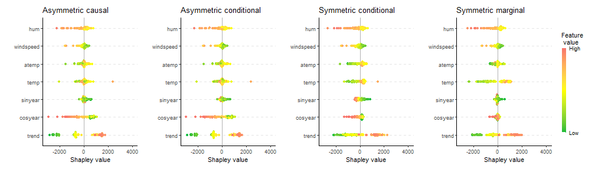

``` r
## Replication script for the R-examples used in the paper
# shapr: Explaining Machine Learning Models with Conditional Shapley Values in R and Python

# Requires the following R packages (from CRAN)
# shapr, xgboost, data.table, future, progressr, knitr, ggplot2, patchwork
```


``` r
progressr::handlers(global = TRUE)
```

``` r
#### Example code in Section 3 ####

# 40 indep
exp_40_indep <- explain(model = model,
                        x_explain = x_explain,
                        x_train = x_train,
                        max_n_coalitions = 40,
                        approach = "independence",
                        phi0 = mean(y_train),
                        verbose = NULL,
                        seed = 1)


# 40 ctree
exp_40_ctree <- explain(model = model,
                        x_explain = x_explain,
                        x_train = x_train,
                        max_n_coalitions = 40,
                        approach = "ctree",
                        phi0 = mean(y_train),
                        verbose = NULL,
                        ctree.sample = FALSE,
                        seed = 1)


print(exp_40_indep, what = "MSEv")
```

```
##       MSEv MSEv_sd
##      <num>   <num>
## 1: 1730485  113303
```

``` r
print(exp_40_ctree, what = "MSEv")
```

```
##       MSEv MSEv_sd
##      <num>   <num>
## 1: 1308239   93916
```

``` r
print(exp_40_ctree)
```

```
##      explain_id  none trend cosyear sinyear  temp atemp windspeed      hum
##           <int> <num> <num>   <num>   <num> <num> <num>     <num>    <num>
##   1:          1  4537 -2529    -617    6.03  -274  -242     159.2 -293.094
##   2:          2  4537 -1284    -457  -40.97  -511 -1008     170.6   67.519
##   3:          3  4537 -1128    -496 -163.80  -576  -945      43.5    0.485
##   4:          4  4537 -1472    -323 -126.43  -566  -947     417.5 -540.775
##   5:          5  4537 -1363    -325 -207.16  -912 -1268     439.0  128.800
##  ---                                                                      
## 142:        142  4537   619    -260  249.48  -429  -495     208.9  287.379
## 143:        143  4537   998    -456  108.38  -144  -234     443.9   85.584
## 144:        144  4537  1263    -428   62.70   370   306     458.3 -164.642
## 145:        145  4537   335    -367   90.14 -1327  -812     239.8  125.416
## 146:        146  4537 -1048    -715   97.56  -763  -958     807.2 -709.912
```

``` r
summary(exp_40_ctree)
```

```
## 
```

```
## ── Summary of Shapley value explanation ─────────────────────────────────────────────────────
```

```
## • Computed with`shapr::explain()` in 9.2 seconds, started 2025-09-12 23:10:42
```

```
## • Model class: <xgb.Booster>
```

```
## • v(S) estimation class: Monte Carlo integration
```

```
## • Approach: ctree
```

```
## • Procedure: Iterative
```

```
## • Number of Monte Carlo integration samples: 1000
```

```
## • Number of feature-wise Shapley values: 7
```

```
## • Number of observations to explain: 146
```

```
## • Number of coalitions used: 40 (of total 128)
```

```
## • Computations (temporary) saved at: '/tmp/Rtmp0vPjB1/shapr_obj_522e62d2c7033.rds'
```

```
## 
```

```
## ── Convergence info
```

```
## ✔ Iterative Shapley value estimation stopped at 40 coalitions after 3 iterations, due to:
## Maximum number of coalitions (40) reached!
```

```
## 
```

```
## ── Estimated Shapley values (sd in parentheses)
```

```
##      explain_id       none             trend           cosyear          sinyear
##           <int>     <char>            <char>            <char>           <char>
##   1:          1 4536.6 (0) -2529.41 ( 79.70)  -616.74 ( 98.93)    6.03 (106.75)
##   2:          2 4536.6 (0) -1284.26 (118.35)  -457.32 (148.46)  -40.97 (158.01)
##   3:          3 4536.6 (0) -1127.96 (137.32)  -495.85 (161.36) -163.80 (176.38)
##   4:          4 4536.6 (0) -1472.44 (101.77)  -322.88 (134.74) -126.43 (136.08)
##   5:          5 4536.6 (0) -1363.28 (105.86)  -325.38 (137.72) -207.16 (128.66)
##  ---                                                                           
## 142:        142 4536.6 (0)   618.85 ( 49.01)  -259.76 ( 55.34)  249.48 ( 54.32)
## 143:        143 4536.6 (0)   997.69 ( 59.67)  -456.20 ( 92.07)  108.38 ( 85.90)
## 144:        144 4536.6 (0)  1263.50 ( 66.91)  -428.00 ( 95.02)   62.70 (107.13)
## 145:        145 4536.6 (0)   335.20 ( 52.46)  -366.65 ( 88.32)   90.14 ( 77.38)
## 146:        146 4536.6 (0) -1047.57 (126.52)  -715.36 (112.29)   97.56 (148.37)
##                   temp             atemp         windspeed               hum
##                 <char>            <char>            <char>            <char>
##   1:  -274.38 (128.88)  -242.30 (117.60)   159.24 ( 95.45)  -293.09 ( 77.63)
##   2:  -511.18 (431.30) -1008.01 (290.03)   170.62 (272.14)    67.52 (149.47)
##   3:  -576.46 (493.87)  -945.36 (339.62)    43.53 (326.09)     0.49 (186.44)
##   4:  -566.33 (396.04)  -947.30 (246.10)   417.46 (222.04)  -540.77 (147.21)
##   5:  -911.89 (406.55) -1267.58 (263.39)   439.00 (214.80)   128.80 (147.61)
##  ---                                                                        
## 142:  -428.74 ( 59.19)  -494.87 ( 70.30)   208.94 ( 67.09)   287.38 ( 59.33)
## 143:  -144.17 (208.53)  -234.48 (132.51)   443.87 (121.71)    85.58 ( 71.95)
## 144:   369.88 (232.50)   305.90 (160.55)   458.32 (155.32)  -164.64 (111.92)
## 145: -1326.52 (111.07)  -812.39 (105.68)   239.78 ( 73.36)   125.42 ( 65.05)
## 146:  -762.61 (221.63)  -957.60 (153.70)   807.22 (223.91)  -709.91 (161.48)
## 
## 
## ── Estimated MSEv 
## 
## Estimated MSE of v(S) = 1308239 (with sd = 93916)
```

``` r
### Continued estimation
exp_iter_ctree <- explain(model = model,
                          x_explain = x_explain,
                          x_train = x_train,
                          approach = "ctree",
                          phi0 = mean(y_train),
                          prev_shapr_object = exp_40_ctree,
                          ctree.sample = FALSE,
                          verbose = c("basic", "convergence"),
                          seed = 1)
```

```
## 
## ── Starting `shapr::explain()` at 2025-09-12 23:10:51 ───────────────────────────────────────
## ℹ Feature classes extracted from the model contain `NA`.
##   Assuming feature classes from the data are correct.ℹ `max_n_coalitions` is `NULL` or larger than `2^n_features = 128`, and is therefore set to
##   `2^n_features = 128`.
## ── Explanation overview ──
## 
## • Model class: <xgb.Booster>
## • v(S) estimation class: Monte Carlo integration
## • Approach: ctree
## • Procedure: Iterative
## • Number of Monte Carlo integration samples: 1000
## • Number of feature-wise Shapley values: 7
## • Number of observations to explain: 146
## • Computations (temporary) saved at: '/tmp/Rtmp0vPjB1/shapr_obj_522e613232db7.rds'
## 
## ── Iterative computation started ──
## 
## ── Iteration 4 ──────────────────────────────────────────────────────────────────────────────
## ℹ Using 66 of 128 coalitions, 26 new. 
## 
## ── Convergence info 
## ℹ Not converged after 66 coalitions:
## Current convergence measure: 0.045 [needs 0.02]
## Estimated remaining coalitions: 62
## (Conservatively) adding about 40% of that (24 coalitions) in the next iteration.
## 
## ── Iteration 5 ──────────────────────────────────────────────────────────────────────────────
## ℹ Using 90 of 128 coalitions, 24 new. 
## 
## ── Convergence info 
## ✔ Iterative Shapley value estimation stopped at 90 coalitions after 5 iterations, due to:
## Standard deviation convergence threshold (0.02) reached: 0.019!
```

``` r
### Plotting

library(ggplot2)
```

``` r
plot(exp_iter_ctree,
     plot_type = "scatter",
     scatter_features = c("atemp", "windspeed"))
```


``` r
### Grouping
group <- list(temp = c("temp", "atemp"),
              time = c("trend", "cosyear", "sinyear"),
              weather = c("hum", "windspeed"))

exp_g_reg <- explain(model = model,
                     x_explain = x_explain,
                     x_train = x_train,
                     phi0 = mean(y_train),
                     group = group,
                     approach = "regression_separate",
                     regression.model = parsnip::boost_tree(
                       engine = "xgboost",
                       mode = "regression"
                     ),
                     verbose = NULL,
                     seed = 1)

tree_vals <- c(10, 15, 25, 50, 100, 500)
exp_g_reg_tuned <- explain(model = model,
                           x_explain = x_explain,
                           x_train = x_train,
                           phi0 = mean(y_train),
                           group = group,
                           approach = "regression_separate",
                           regression.model =
                             parsnip::boost_tree(
                               trees = hardhat::tune(),
                               engine = "xgboost",
                               mode = "regression"
                             ),
                           regression.tune_values = expand.grid(
                             trees = tree_vals
                           ),
                           regression.vfold_cv_para = list(v = 5),
                           verbose = NULL,
                           seed = 1)

print(exp_g_reg, what = "MSEv")
```

```
##       MSEv MSEv_sd
##      <num>   <num>
## 1: 1547240  142123
```

``` r
print(exp_g_reg_tuned, what = "MSEv")
```

```
##       MSEv MSEv_sd
##      <num>   <num>
## 1: 1534033  142277
```

``` r
print(exp_g_reg, what = "timing_summary")
```

```
##              init_time            end_time total_time_secs total_time_str
##                 <POSc>              <POSc>           <num>         <char>
## 1: 2025-09-12 23:10:58 2025-09-12 23:11:00            1.97      2 seconds
```

``` r
print(exp_g_reg_tuned, what = "timing_summary")
```

```
##              init_time            end_time total_time_secs total_time_str
##                 <POSc>              <POSc>           <num>         <char>
## 1: 2025-09-12 23:11:00 2025-09-12 23:11:04            4.37    4.4 seconds
```

``` r
# Waterfall plot for the best one
plot(exp_g_reg_tuned,
     index_x_explain = 6,
     plot_type = "waterfall")
```


``` r
#### Causal and asymmetric Shapley values ####

# Specify the causal ordering and confounding
causal_order0 <- list("trend",
                      c("cosyear", "sinyear"),
                      c("temp", "atemp", "windspeed", "hum"))

confounding0 <- c(FALSE, TRUE, FALSE)

# Specify the parameters of four different Shapley value variations
exp_names <- c("Asymmetric causal", "Asymmetric conditional",
               "Symmetric conditional", "Symmetric marginal")

causal_ordering_list <- list(causal_order0, causal_order0, NULL, NULL)
confounding_list <- list(confounding0, NULL, NULL, TRUE)
asymmetric_list <- list(TRUE, TRUE, FALSE, FALSE)

# Explain the four variations and create beeswarm plots
plot_list <- list()
for (i in seq_along(exp_names)) {
  exp_tmp <- explain(model = model,
                     x_train = x_train,
                     x_explain = x_explain,
                     approach = "gaussian",
                     phi0 = mean(y_train),
                     asymmetric = asymmetric_list[[i]],
                     causal_ordering = causal_ordering_list[[i]],
                     confounding = confounding_list[[i]],
                     seed = 1,
                     verbose = NULL)

  plot_list[[i]] <- plot(exp_tmp, plot_type = "beeswarm") +
    ggplot2::ggtitle(exp_names[i]) + ggplot2::ylim(-3700, 3700)
}
```

``` r
# Use the patchwork package to combine the plots
library(patchwork)
patchwork::wrap_plots(plot_list, nrow = 1) +
  patchwork::plot_layout(guides = "collect")
```




``` r
#### Example code in Section 6 ####

# Read additional data
x_full <- fread(file.path("data_and_models", "x_full.csv"))
data_fit <- x_full[seq_len(729), ]

# Fit AR(2)-model
model_ar <- ar(data_fit$temp, order = 2)

phi0_ar <- rep(mean(data_fit$temp), 3)

exp_fc_ar <- explain_forecast(model = model_ar,
                              y = x_full[, "temp"],
                              explain_idx = 730:731,
                              explain_y_lags = 2,
                              horizon = 3,
                              approach = "empirical",
                              phi0 = phi0_ar,
                              group_lags = FALSE,
                              seed = 1)
```

```
## 
```

```
## ── Starting `shapr::explain_forecast()` at 2025-09-12 23:11:32 ──────────────────────────────
```

```
## ℹ Feature names extracted from the model contain `NA`.
##   Consistency checks between model and data are therefore disabled.
## ℹ `max_n_coalitions` is `NULL` or larger than `2^n_features = 4`, and is therefore set to
##   `2^n_features = 4`.
## 
## 
## ── Explanation overview ──
## 
## 
## 
## • Model class: <ar>
## 
## • v(S) estimation class: Monte Carlo integration
## 
## • Approach: empirical
## 
## • Procedure: Non-iterative
## 
## • Number of Monte Carlo integration samples: 1000
## 
## • Number of feature-wise Shapley values: 2
## 
## • Number of observations to explain: 2
## 
## • Computations (temporary) saved at: '/tmp/Rtmp0vPjB1/shapr_obj_522e62ce07f20.rds'
## 
## 
## 
## ── Main computation started ──
## 
## 
## 
## ℹ Using 4 of 4 coalitions.
```

``` r
# Summary of Shapley value computation
print(exp_fc_ar)
```

```
##    explain_idx horizon  none temp.1 temp.2
##          <int>   <int> <num>  <num>  <num>
## 1:         730       1  15.3  -5.96  -4.68
## 2:         731       1  15.3  -7.80  -4.76
## 3:         730       2  15.3  -5.61  -4.39
## 4:         731       2  15.3  -7.34  -4.47
## 5:         730       3  15.3  -5.26  -4.12
## 6:         731       3  15.3  -6.89  -4.20
```

``` r
# Fit ARIMA(2,0,0)-model
model_arimax <- arima(data_fit$temp,
                      order = c(2, 0, 0),
                      xreg = data_fit$windspeed)
phi0_arimax <- rep(mean(data_fit$temp), 2)

exp_fc_arimax <- explain_forecast(model = model_arimax,
                                  y = x_full[, "temp"],
                                  xreg = x_full[, "windspeed"],
                                  train_idx = 2:728,
                                  explain_idx = 729,
                                  explain_y_lags = 2,
                                  explain_xreg_lags = 1,
                                  horizon = 2,
                                  approach = "empirical",
                                  phi0 = phi0_arimax,
                                  group_lags = TRUE,
                                  seed = 1)
```

```
## 
## ── Starting `shapr::explain_forecast()` at 2025-09-12 23:11:33 ──────────────────────────────
## ℹ Feature names extracted from the model contain `NA`.
##   Consistency checks between model and data are therefore disabled.ℹ `max_n_coalitions` is `NULL` or larger than `2^n_groups = 4`, and is therefore set to
##   `2^n_groups = 4`.Registered S3 method overwritten by 'quantmod':
##   method            from
##   as.zoo.data.frame zoo 
## 
## ── Explanation overview ──
## 
## • Model class: <Arima>
## • v(S) estimation class: Monte Carlo integration
## • Approach: empirical
## • Procedure: Non-iterative
## • Number of Monte Carlo integration samples: 1000
## • Number of group-wise Shapley values: 2
## • Number of observations to explain: 1
## • Computations (temporary) saved at: '/tmp/Rtmp0vPjB1/shapr_obj_522e61381a620.rds'
## 
## ── Main computation started ──
## 
## ℹ Using 4 of 4 coalitions. 
## Registered S3 method overwritten by 'quantmod':
##   method            from
##   as.zoo.data.frame zoo 
## Registered S3 method overwritten by 'quantmod':
##   method            from
##   as.zoo.data.frame zoo 
## Registered S3 method overwritten by 'quantmod':
##   method            from
##   as.zoo.data.frame zoo 
## Registered S3 method overwritten by 'quantmod':
##   method            from
##   as.zoo.data.frame zoo
```

``` r
# Print the Shapley values
print(exp_fc_arimax)
```

```
##    explain_idx horizon  none  temp windspeed
##          <int>   <int> <num> <num>     <num>
## 1:         729       1  15.3 -8.90     -1.05
## 2:         729       2  15.3 -8.59     -2.11
```

``` r
#### Wrapping up ####
```


``` r
sessionInfo()
```

```
## R version 4.3.3 (2024-02-29)
## Platform: x86_64-pc-linux-gnu (64-bit)
## Running under: Ubuntu 24.04.3 LTS
## 
## Matrix products: default
## BLAS:   /usr/lib/x86_64-linux-gnu/blas/libblas.so.3.12.0 
## LAPACK: /usr/lib/x86_64-linux-gnu/lapack/liblapack.so.3.12.0
## 
## locale:
##  [1] LC_CTYPE=C.UTF-8       LC_NUMERIC=C           LC_TIME=C.UTF-8       
##  [4] LC_COLLATE=C.UTF-8     LC_MONETARY=C.UTF-8    LC_MESSAGES=C.UTF-8   
##  [7] LC_PAPER=C.UTF-8       LC_NAME=C              LC_ADDRESS=C          
## [10] LC_TELEPHONE=C         LC_MEASUREMENT=C.UTF-8 LC_IDENTIFICATION=C   
## 
## time zone: Europe/Oslo
## tzcode source: system (glibc)
## 
## attached base packages:
## [1] stats     graphics  grDevices utils     datasets  methods   base     
## 
## other attached packages:
## [1] patchwork_1.3.1   ggplot2_3.5.2     progressr_0.15.1  future_1.67.0    
## [5] shapr_1.0.5       data.table_1.17.8 xgboost_1.7.11.1 
## 
## loaded via a namespace (and not attached):
##  [1] tidyselect_1.2.1    timeDate_4041.110   dplyr_1.1.4        
##  [4] vipor_0.4.7         farver_2.1.2        digest_0.6.37      
##  [7] rpart_4.1.23        timechange_0.3.0    lifecycle_1.0.4    
## [10] yardstick_1.3.2     survival_3.5-8      magrittr_2.0.3     
## [13] compiler_4.3.3      rlang_1.1.6         tools_4.3.3        
## [16] knitr_1.50          labeling_0.4.3      curl_6.4.0         
## [19] TTR_0.24.4          DiceDesign_1.10     RColorBrewer_1.1-3 
## [22] parsnip_1.3.2       withr_3.0.2         purrr_1.1.0        
## [25] workflows_1.2.0     nnet_7.3-19         grid_4.3.3         
## [28] tune_1.3.0          xts_0.14.1          colorspace_2.1-1   
## [31] globals_0.18.0      scales_1.4.0        iterators_1.0.14   
## [34] MASS_7.3-60.0.1     cli_3.6.5           ragg_1.4.0         
## [37] generics_0.1.4      future.apply_1.20.0 ggbeeswarm_0.7.2   
## [40] splines_4.3.3       dials_1.4.1         forecast_8.24.0    
## [43] parallel_4.3.3      urca_1.3-4          vctrs_0.6.5        
## [46] hardhat_1.4.1       Matrix_1.6-5        jsonlite_2.0.0     
## [49] tseries_0.10-58     beeswarm_0.4.0      listenv_0.9.1      
## [52] systemfonts_1.2.3   foreach_1.5.2       gower_1.0.2        
## [55] tidyr_1.3.1         recipes_1.3.1       quantmod_0.4.28    
## [58] glue_1.8.0          parallelly_1.45.1   codetools_0.2-19   
## [61] rsample_1.3.1       lubridate_1.9.4     gtable_0.3.6       
## [64] quadprog_1.5-8      lmtest_0.9-40       GPfit_1.0-9        
## [67] tibble_3.3.0        furrr_0.3.1         pillar_1.11.0      
## [70] ipred_0.9-15        lava_1.8.1          R6_2.6.1           
## [73] textshaping_1.0.1   lhs_1.2.0           evaluate_1.0.4     
## [76] lattice_0.22-5      fracdiff_1.5-3      class_7.3-22       
## [79] Rcpp_1.1.0          nlme_3.1-164        prodlim_2025.04.28 
## [82] xfun_0.52           zoo_1.8-14          pkgconfig_2.0.3
```

