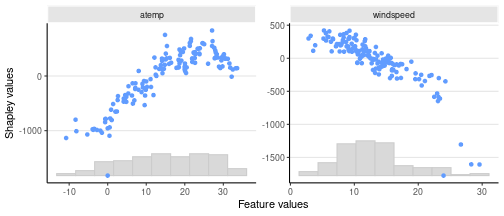
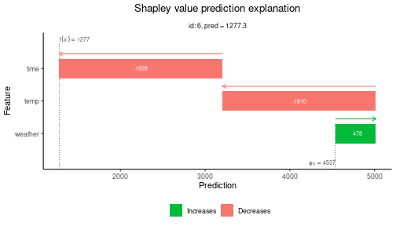
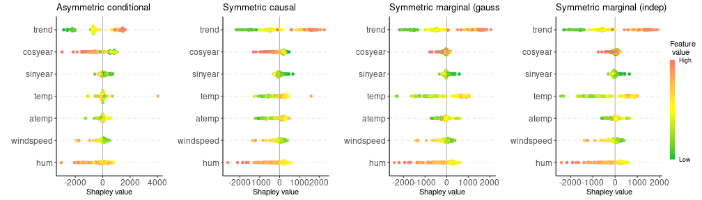

``` r
## Replication script for the R-examples used in the paper
# shapr: Explaining Machine Learning Models with Conditional Shapley Values in R and Python

# Requires the following R packages (from CRAN)
# shapr, xgboost, data.table, future, progressr, ggplot2, ggpubr


#### Loads packages, Reads data and models created by R_prep_data_and_model.R ####

library(xgboost)
library(data.table)
```

```
## data.table 1.17.0 using 16 threads (see ?getDTthreads).  Latest news: r-datatable.com
```

``` r
library(shapr)

x_explain <- fread(file.path("data_and_models", "x_explain.csv"))
x_train <- fread(file.path("data_and_models", "x_train.csv"))
y_train <- unlist(fread(file.path("data_and_models", "y_train.csv")))
model <- readRDS(file.path("data_and_models", "model.rds"))


# Load packages and sets up parallel processing
library(future)
library(progressr)
future::plan(multisession, workers = 4)
```


``` r
progressr::handlers(global = TRUE)
```

``` r
#### Example code in Section 3 ####

# 30 indep
exp_30_indep <- explain(model = model,
                        x_explain = x_explain,
                        x_train = x_train,
                        max_n_coalitions = 30,
                        approach = "independence",
                        phi0 = mean(y_train),
                        verbose = NULL,
                        seed = 1)


# 30 ctree
exp_30_ctree <- explain(model = model,
                        x_explain = x_explain,
                        x_train = x_train,
                        max_n_coalitions = 30,
                        approach = "ctree",
                        phi0 = mean(y_train),
                        verbose = NULL,
                        ctree.sample = FALSE,
                        seed = 1)


exp_30_indep$MSEv$MSEv
```

```
##       MSEv  MSEv_sd
##      <num>    <num>
## 1: 1727591 116508.8
```

``` r
exp_30_ctree$MSEv$MSEv
```

```
##       MSEv  MSEv_sd
##      <num>    <num>
## 1: 1302295 96701.77
```

``` r
print(exp_30_ctree)
```

```
##      explain_id  none   trend cosyear sinyear    temp   atemp windspeed     hum
##           <int> <num>   <num>   <num>   <num>   <num>   <num>     <num>   <num>
##   1:          1  4537 -2413.6  -705.1  -31.06  -216.2  -262.0     53.13 -215.89
##   2:          2  4537 -1334.2  -606.5  -56.38   275.5 -1305.0   -162.23  125.21
##   3:          3  4537 -1273.1  -707.0  -91.21   375.4 -1188.2   -350.78  -30.53
##   4:          4  4537 -1563.5  -462.6 -128.07   147.4 -1197.3     27.40 -382.08
##   5:          5  4537 -1518.5  -433.8 -209.22  -221.3 -1541.6     63.14  353.85
##  ---                                                                           
## 142:        142  4537   659.7  -264.0  236.34  -411.1  -519.0    102.95  376.37
## 143:        143  4537   928.2  -477.0  117.82   405.1  -437.0    149.88  113.68
## 144:        144  4537  1162.7  -511.6  122.23   937.7   186.5    217.13 -247.12
## 145:        145  4537   343.1  -399.4  124.86 -1175.2  -812.0    144.21   59.32
## 146:        146  4537  -987.7  -767.0   93.28  -100.0 -1180.6    333.68 -679.97
```

``` r
### Continued estimation
exp_iter_ctree <- explain(model = model,
                          x_explain = x_explain,
                          x_train = x_train,
                          approach = "ctree",
                          phi0 = mean(y_train),
                          prev_shapr_object = exp_30_ctree,
                          ctree.sample = FALSE,
                          verbose = c("basic","convergence"),
                          seed = 1)
```

```
## 
```

```
## ── Starting `shapr::explain()` at 2025-05-05 15:07:11 ──────────────────────────────────────────────────────────────────────────
```

```
## ℹ Feature classes extracted from the model contains `NA`.
##   Assuming feature classes from the data are correct.
## ℹ `max_n_coalitions` is `NULL` or larger than or `2^n_features = 128`, and is therefore set to `2^n_features = 128`.
## 
## 
## ── Explanation overview ──
## 
## 
## 
## • Model class: <xgb.Booster>
## 
## • Approach: ctree
## 
## • Iterative estimation: TRUE
## 
## • Number of feature-wise Shapley values: 7
## 
## • Number of observations to explain: 146
## 
## • Computations (temporary) saved at: '/tmp/RtmpOWrAFJ/shapr_obj_1213824f5ac82.rds'
## 
## 
## 
## ── iterative computation started ──
## 
## 
## 
## ── Iteration 4 ─────────────────────────────────────────────────────────────────────────────────────────────────────────────────
## 
## ℹ Using 32 of 128 coalitions, 2 new. 
## 
## 
## 
## ── Convergence info 
## 
## ℹ Not converged after 32 coalitions:
## Current convergence measure: 0.11 [needs 0.02]
## Estimated remaining coalitions: 16
## (Conservatively) adding about 40% of that (6 coalitions) in the next iteration.
## 
## 
## 
## ── Iteration 5 ─────────────────────────────────────────────────────────────────────────────────────────────────────────────────
## 
## ℹ Using 38 of 128 coalitions, 6 new. 
## 
## 
## 
## ── Convergence info 
## 
## ℹ Not converged after 38 coalitions:
## Current convergence measure: 0.12 [needs 0.02]
## Estimated remaining coalitions: 58
## (Conservatively) adding about 50% of that (28 coalitions) in the next iteration.
## 
## 
## 
## ── Iteration 6 ─────────────────────────────────────────────────────────────────────────────────────────────────────────────────
## 
## ℹ Using 66 of 128 coalitions, 28 new. 
## 
## 
## 
## ── Convergence info 
## 
## ✔ Converged after 66 coalitions:
## Convergence tolerance reached!
```

``` r
### PLotting

library(ggplot2)
```

``` r
plot(exp_iter_ctree, plot_type = "scatter", scatter_features = c("atemp", "windspeed"))
```




``` r
### Grouping

group <- list(temp = c("temp", "atemp"),
              time = c("trend", "cosyear", "sinyear"),
              weather = c("hum","windspeed"))

exp_g_reg <- explain(model = model,
                     x_explain = x_explain,
                     x_train = x_train,
                     phi0 = mean(y_train),
                     group = group,
                     approach = "regression_separate",
                     regression.model = parsnip::boost_tree(
                       engine = "xgboost",
                       mode = "regression"
                     ),
                     verbose = NULL,
                     seed = 1)

tree_vals <- c(10, 15, 25, 50, 100, 500)
exp_g_reg_tuned <- explain(model = model,
                           x_explain = x_explain,
                           x_train = x_train,
                           phi0 = mean(y_train),
                           group = group,
                           approach = "regression_separate",
                           regression.model =
                             parsnip::boost_tree(
                               trees = hardhat::tune(),
                               engine = "xgboost", mode = "regression"
                             ),
                           regression.tune_values = expand.grid(
                             trees = tree_vals
                           ),
                           regression.vfold_cv_para = list(v = 5),
                           verbose = NULL,
                           seed = 1)

exp_g_reg$MSEv$MSEv
```

```
##       MSEv  MSEv_sd
##      <num>    <num>
## 1: 1547240 142123.2
```

``` r
exp_g_reg_tuned$MSEv$MSEv
```

```
##       MSEv  MSEv_sd
##      <num>    <num>
## 1: 1534033 142277.4
```

```
##    explain_id     none      temp      time   weather
##         <int>    <num>     <num>     <num>     <num>
## 1:          1 4536.598  -371.659 -2757.175 -661.8197
## 2:          2 4536.598 -1041.262 -1609.387 -412.9517
## 3:          3 4536.598 -1118.937 -1560.695 -585.7902
## 4:          4 4536.598 -1361.832 -1781.578 -415.2823
## 5:          5 4536.598 -1887.654 -1745.006  125.1834
## 6:          6 4536.598 -1810.055 -1927.635  478.3566
```

``` r
# Waterfall plot for the best one
plot(exp_g_reg_tuned,
     index_x_explain = 6,
     plot_type="waterfall")
```




``` r
#### Figure 6 in the paper ####
```


``` r
#### Generic example code for Section 4 (not ran for paper) ####

# Specify the causal ordering and confounding
causal_ordering <- list("trend",
                        c("cosyear", "sinyear"),
                        c("temp", "atemp", "windspeed", "hum"))

confounding <- c(FALSE, TRUE, FALSE)

explanation <- explain(
  model = model,
  x_train = x_train,
  x_explain = x_explain,
  phi0 = mean(y_train),
  approach = "gaussian",
  asymmetric = TRUE,
  causal_ordering = causal_ordering,
  confounding = confounding,
  seed = 1
)
```

``` r
#### Example code in Section 6 ####

# Read additional data
x_full <- fread(file.path("data_and_models", "x_full.csv"))
data_fit <- x_full[seq_len(729), ]

# Fit AR(2)-model
model_ar <- ar(data_fit$temp, order = 2)
phi0_ar <- rep(mean(data_fit$temp), 3)

exp_fc_ar <- explain_forecast(
  model = model_ar,
  y = x_full[, "temp"],
  train_idx = 2:729,
  explain_idx = 730:731,
  explain_y_lags = 2,
  horizon = 3,
  approach = "empirical",
  phi0 = phi0_ar,
  group_lags = FALSE,
  seed = 1
)
```

```
## 
```

```
## ── Starting `shapr::explain_forecast()` at 2025-05-05 15:08:08 ─────────────────────────────────────────────────────────────────
```

```
## ℹ Feature names extracted from the model contains `NA`.
##   Consistency checks between model and data is therefore disabled.
## ℹ `max_n_coalitions` is `NULL` or larger than or `2^n_features = 4`, and is therefore set to `2^n_features = 4`.
## 
## 
## ── Explanation overview ──
## 
## 
## 
## • Model class: <ar>
## 
## • Approach: empirical
## 
## • Iterative estimation: FALSE
## 
## • Number of feature-wise Shapley values: 2
## 
## • Number of observations to explain: 2
## 
## • Computations (temporary) saved at: '/tmp/RtmpOWrAFJ/shapr_obj_121382beee87b.rds'
## 
## 
## 
## ── Main computation started ──
## 
## 
## 
## ℹ Using 4 of 4 coalitions.
```

``` r
# Print Shapley values
print(exp_fc_ar)
```

```
##    explain_idx horizon  none temp.1 temp.2
##          <int>   <int> <num>  <num>  <num>
## 1:         730       1 15.32 -5.977 -4.667
## 2:         731       1 15.32 -7.816 -4.746
## 3:         730       2 15.32 -5.620 -4.374
## 4:         731       2 15.32 -7.349 -4.457
## 5:         730       3 15.32 -5.276 -4.105
## 6:         731       3 15.32 -6.899 -4.184
```

``` r
# Fit ARIMA(2,0,0)-model
model_arimax <- arima(data_fit$temp,
                      order = c(2, 0, 0),
                      xreg = data_fit$windspeed)
phi0_arimax <- rep(mean(data_fit$temp), 2)

exp_fc_arimax <- explain_forecast(
  model = model_arimax,
  y = x_full[, "temp"],
  xreg = x_full[, "windspeed"],
  train_idx = 2:728,
  explain_idx = 729,
  explain_y_lags = 2,
  explain_xreg_lags = 1,
  horizon = 2,
  approach = "empirical",
  phi0 = phi0_arimax,
  group_lags = TRUE,
  seed = 1
)
```

```
## 
## ── Starting `shapr::explain_forecast()` at 2025-05-05 15:08:08 ─────────────────────────────────────────────────────────────────
## ℹ Feature names extracted from the model contains `NA`.
##   Consistency checks between model and data is therefore disabled.ℹ `max_n_coalitions` is `NULL` or larger than or `2^n_groups = 4`, and is therefore set to `2^n_groups = 4`.Registered S3 method overwritten by 'quantmod':
##   method            from
##   as.zoo.data.frame zoo 
## 
## ── Explanation overview ──
## 
## • Model class: <Arima>
## • Approach: empirical
## • Iterative estimation: FALSE
## • Number of group-wise Shapley values: 2
## • Number of observations to explain: 1
## • Computations (temporary) saved at: '/tmp/RtmpOWrAFJ/shapr_obj_12138165259f.rds'
## 
## ── Main computation started ──
## 
## ℹ Using 4 of 4 coalitions. 
## Registered S3 method overwritten by 'quantmod':
##   method            from
##   as.zoo.data.frame zoo 
## Registered S3 method overwritten by 'quantmod':
##   method            from
##   as.zoo.data.frame zoo 
## Registered S3 method overwritten by 'quantmod':
##   method            from
##   as.zoo.data.frame zoo 
## Registered S3 method overwritten by 'quantmod':
##   method            from
##   as.zoo.data.frame zoo
```

``` r
# Print Shapley values
print(exp_fc_arimax)
```

```
##    explain_idx horizon  none   temp windspeed
##          <num>   <num> <num>  <num>     <num>
## 1:         729       1 15.32 -8.899    -1.047
## 2:         729       2 15.32 -8.585    -2.113
```

``` r
#### Wrapping up ####
```


``` r
sessionInfo()
```

```
## R version 4.4.1 (2024-06-14)
## Platform: x86_64-pc-linux-gnu
## Running under: Ubuntu 20.04.6 LTS
## 
## Matrix products: default
## BLAS:   /usr/lib/x86_64-linux-gnu/openblas-pthread/libblas.so.3 
## LAPACK: /usr/lib/x86_64-linux-gnu/openblas-pthread/liblapack.so.3;  LAPACK version 3.9.0
## 
## locale:
##  [1] LC_CTYPE=en_US.UTF-8       LC_NUMERIC=C               LC_TIME=en_US.UTF-8        LC_COLLATE=en_US.UTF-8    
##  [5] LC_MONETARY=en_US.UTF-8    LC_MESSAGES=en_US.UTF-8    LC_PAPER=en_US.UTF-8       LC_NAME=C                 
##  [9] LC_ADDRESS=C               LC_TELEPHONE=C             LC_MEASUREMENT=en_US.UTF-8 LC_IDENTIFICATION=C       
## 
## time zone: Europe/Oslo
## tzcode source: system (glibc)
## 
## attached base packages:
## [1] stats     graphics  grDevices utils     datasets  methods   base     
## 
## other attached packages:
## [1] ggpubr_0.6.0      ggplot2_3.5.1     progressr_0.15.1  future_1.33.2     shapr_1.0.4       data.table_1.17.0
## [7] xgboost_1.7.9.1  
## 
## loaded via a namespace (and not attached):
##  [1] gridExtra_2.3       testthat_3.2.3      rlang_1.1.5         magrittr_2.0.3      furrr_0.3.1         tseries_0.10-58    
##  [7] compiler_4.4.1      systemfonts_1.1.0   vctrs_0.6.5         lhs_1.2.0           quadprog_1.5-8      tune_1.3.0         
## [13] pkgconfig_2.0.3     backports_1.5.0     labeling_0.4.3      prodlim_2024.06.25  ggbeeswarm_0.7.2    ragg_1.3.3         
## [19] purrr_1.0.4         xfun_0.51           jsonlite_1.9.1      recipes_1.2.0       broom_1.0.7         parallel_4.4.1     
## [25] R6_2.6.1            rsample_1.2.1       parallelly_1.43.0   car_3.1-3           rpart_4.1.23        brio_1.1.5         
## [31] lmtest_0.9-40       lubridate_1.9.4     Rcpp_1.0.14         dials_1.4.0         iterators_1.0.14    knitr_1.50         
## [37] future.apply_1.11.3 zoo_1.8-13          Matrix_1.7-0        splines_4.4.1       nnet_7.3-19         timechange_0.3.0   
## [43] tidyselect_1.2.1    rstudioapi_0.17.1   abind_1.4-8         timeDate_4041.110   codetools_0.2-20    curl_6.2.1         
## [49] listenv_0.9.1       lattice_0.22-6      tibble_3.2.1        quantmod_0.4.26     withr_3.0.2         urca_1.3-4         
## [55] evaluate_1.0.3      survival_3.6-4      xts_0.14.1          pillar_1.10.1       carData_3.0-5       foreach_1.5.2      
## [61] generics_0.1.3      TTR_0.24.4          forecast_8.23.0     munsell_0.5.1       scales_1.3.0        globals_0.16.3     
## [67] class_7.3-22        glue_1.8.0          tools_4.4.1         gower_1.0.2         ggsignif_0.6.4      cowplot_1.1.3      
## [73] grid_4.4.1          yardstick_1.3.2     tidyr_1.3.1         ipred_0.9-15        colorspace_2.1-1    nlme_3.1-164       
## [79] beeswarm_0.4.0      fracdiff_1.5-3      vipor_0.4.7         Formula_1.2-5       cli_3.6.4           DiceDesign_1.10    
## [85] textshaping_0.4.0   workflows_1.2.0     parsnip_1.3.1       lava_1.8.1          dplyr_1.1.4         gtable_0.3.6       
## [91] GPfit_1.0-8         rstatix_0.7.2       digest_0.6.37       farver_2.1.2        lifecycle_1.0.4     hardhat_1.4.1      
## [97] MASS_7.3-60.2
```

