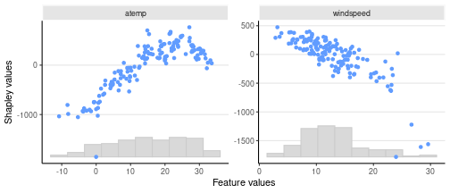
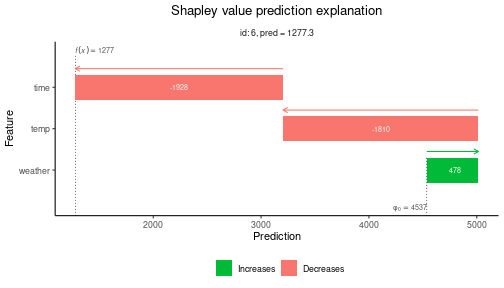
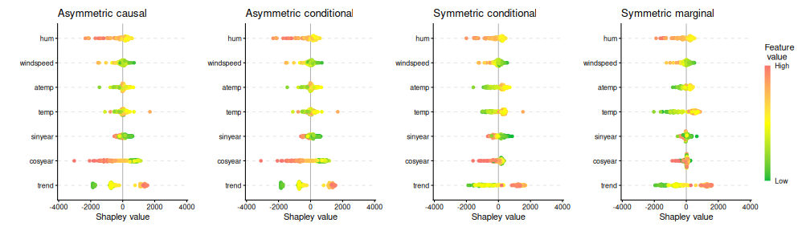

``` r
## Replication script for the R-examples used in the paper
# shapr: Explaining Machine Learning Models with Conditional Shapley Values in R and Python

# Requires the following R packages (from CRAN)
# shapr, xgboost, data.table, future, progressr, knitr, ggplot2, patchwork
```


``` r
#### Loads packages, reads data and models created by R_prep_data_and_model.R ####

library(xgboost)
library(data.table)
```

```
## 
## Attaching package: 'data.table'
```

```
## The following object is masked from 'package:base':
## 
##     %notin%
```

``` r
library(shapr)

x_explain <- fread(file.path("data_and_models", "x_explain.csv"))
x_train <- fread(file.path("data_and_models", "x_train.csv"))
y_train <- unlist(fread(file.path("data_and_models", "y_train.csv")))
model <- readRDS(file.path("data_and_models", "model.rds"))


# Load packages and sets up parallel processing
library(future)
library(progressr)
future::plan(multisession, workers = 4)
```


``` r
progressr::handlers(global = TRUE)
```

``` r
#### Example code in Section 3 ####

# 40 indep
exp_40_indep <- explain(model = model,
                        x_explain = x_explain,
                        x_train = x_train,
                        max_n_coalitions = 40,
                        approach = "independence",
                        phi0 = mean(y_train),
                        verbose = NULL,
                        seed = 1)


# 40 ctree
exp_40_ctree <- explain(model = model,
                        x_explain = x_explain,
                        x_train = x_train,
                        max_n_coalitions = 40,
                        approach = "ctree",
                        phi0 = mean(y_train),
                        verbose = NULL,
                        ctree.sample = FALSE,
                        seed = 1)


print(exp_40_indep, what = "MSEv")
```

```
##       MSEv MSEv_sd
##      <num>   <num>
## 1: 1520051  100972
```

``` r
print(exp_40_ctree, what = "MSEv")
```

```
##       MSEv MSEv_sd
##      <num>   <num>
## 1: 1169051   70910
```

``` r
print(exp_40_ctree)
```

```
##      explain_id  none trend cosyear sinyear  temp atemp windspeed     hum
##           <int> <num> <num>   <num>   <num> <num> <num>     <num>   <num>
##   1:          1  4537 -2049   -1018    86.9  -244  -226     211.2 -435.45
##   2:          2  4537 -1245    -584    16.3  -585  -996      98.2  101.29
##   3:          3  4537 -1088    -600  -119.7  -550  -995      83.8   13.38
##   4:          4  4537 -1325    -279  -177.5  -615  -969     362.4 -482.80
##   5:          5  4537 -1311    -251  -240.8  -845 -1168     473.3  254.54
##  ---                                                                     
## 142:        142  4537   621    -192   311.6  -245  -384     130.0  319.46
## 143:        143  4537   465    -520  -304.0  -264  -262     401.1    6.81
## 144:        144  4537  1241    -320    67.3   366   286     559.7 -327.90
## 145:        145  4537   611    -111    67.0 -1173  -777     262.0  257.07
## 146:        146  4537  -612    -960   165.2  -856  -995     820.6 -555.63
```

``` r
summary(exp_40_ctree)
```

```
## 
```

```
## ── Summary of Shapley value explanation ────────────────────────────────────────────────────────────────────────────────────────────────────────────────────────────────────────────────────────
```

```
## • Computed with `shapr::explain()` in 12.1 seconds, started 2026-09-03 11:44:12
```

```
## • Model class: <xgboost>
```

```
## • v(S) estimation class: Monte Carlo integration
```

```
## • Approach: ctree
```

```
## • Procedure: Iterative
```

```
## • Number of Monte Carlo integration samples: 1000
```

```
## • Number of feature-wise Shapley values: 7
```

```
## • Number of observations to explain: 146
```

```
## • Number of coalitions used: 40 (of total 128)
```

```
## • Computations (temporary) saved at: '/tmp/RtmpC1IORc/shapr_obj_32f5a33ff13dd3.rds'
```

```
## 
```

```
## ── Convergence info
```

```
## ✔ Iterative Shapley value estimation stopped at 40 coalitions after 3 iterations, due to:
## Maximum number of coalitions (40) reached!
```

```
## 
```

```
## ── Estimated Shapley values (sd in parentheses)
```

```
##      explain_id       none             trend           cosyear          sinyear
##           <int>     <char>            <char>            <char>           <char>
##   1:          1 4536.6 (0) -2049.45 ( 79.55) -1017.54 ( 82.19)   86.86 ( 92.42)
##   2:          2 4536.6 (0) -1244.63 (126.81)  -584.23 (147.67)   16.31 (167.48)
##   3:          3 4536.6 (0) -1087.50 (145.30)  -599.85 (167.09) -119.74 (184.72)
##   4:          4 4536.6 (0) -1324.95 (100.12)  -278.68 (134.50) -177.49 (131.18)
##   5:          5 4536.6 (0) -1310.88 (110.47)  -251.40 (138.11) -240.80 (126.15)
##  ---                                                                           
## 142:        142 4536.6 (0)   621.36 ( 53.08)  -191.79 ( 55.55)  311.65 ( 57.22)
## 143:        143 4536.6 (0)   464.69 ( 63.60)  -519.80 ( 94.52) -304.00 ( 91.47)
## 144:        144 4536.6 (0)  1241.35 ( 67.95)  -319.97 ( 98.28)   67.26 (106.14)
## 145:        145 4536.6 (0)   610.55 ( 56.62)  -110.85 ( 99.26)   66.98 ( 86.34)
## 146:        146 4536.6 (0)  -612.30 (111.69)  -960.30 (117.39)  165.17 (134.05)
##                   temp             atemp         windspeed               hum
##                 <char>            <char>            <char>            <char>
##   1:  -243.93 (116.70)  -226.01 (103.09)   211.21 (108.49)  -435.45 ( 78.75)
##   2:  -585.34 (419.00)  -996.33 (289.22)    98.16 (287.72)   101.29 (152.54)
##   3:  -549.86 (492.66)  -994.66 (340.46)    83.81 (338.71)    13.38 (195.19)
##   4:  -615.29 (373.68)  -968.56 (222.33)   362.45 (213.00)  -482.80 (149.23)
##   5:  -844.81 (400.90) -1167.71 (253.41)   473.28 (215.89)   254.54 (159.17)
##  ---                                                                        
## 142:  -245.32 ( 59.75)  -384.09 ( 76.18)   130.03 ( 70.67)   319.46 ( 69.40)
## 143:  -264.03 (202.57)  -261.63 (125.13)   401.12 (121.85)     6.81 ( 87.23)
## 144:   365.73 (218.15)   286.46 (153.12)   559.68 (147.93)  -327.90 (102.87)
## 145: -1173.21 (179.02)  -777.21 (127.05)   262.03 ( 97.27)   257.07 ( 67.83)
## 146:  -855.83 (244.94)  -995.38 (160.22)   820.56 (205.24)  -555.63 (142.21)
## 
## 
## ── Estimated MSEv 
## 
## Estimated MSE of v(S) = 1169051 (with sd = 70910)
```

``` r
### Continued estimation
exp_iter_ctree <- explain(model = model,
                          x_explain = x_explain,
                          x_train = x_train,
                          approach = "ctree",
                          phi0 = mean(y_train),
                          prev_shapr_object = exp_40_ctree,
                          ctree.sample = FALSE,
                          verbose = c("basic", "convergence"),
                          seed = 1)
```

```
## 
## ── Starting `shapr::explain()` at 2026-09-03 11:44:24 ──────────────────────────────────────────────────────────────────────────────────────────────────────────────────────────────────────────
## ℹ `max_n_coalitions` is `NULL` or larger than `2^n_features = 128`, and is therefore set to `2^n_features = 128`.
## ── Explanation overview ──
## 
## • Model class: <xgboost>
## • v(S) estimation class: Monte Carlo integration
## • Approach: ctree
## • Procedure: Iterative
## • Number of Monte Carlo integration samples: 1000
## • Number of feature-wise Shapley values: 7
## • Number of observations to explain: 146
## • Computations (temporary) saved at: '/tmp/RtmpC1IORc/shapr_obj_32f5a33aceddda.rds'
## 
## ── Iterative computation started ──
## 
## ── Iteration 4 ─────────────────────────────────────────────────────────────────────────────────────────────────────────────────────────────────────────────────────────────────────────────────
## ℹ Using 66 of 128 coalitions, 26 new. 
## ℹ Coalitions split into 10 batches (mean 6.6 per batch). 
## 
## ── Convergence info 
## ℹ Not converged after 66 coalitions:
## Current convergence measure: 0.043 [needs 0.02]
## Estimated remaining coalitions: 62
## (Conservatively) adding about 40% of that (24 coalitions) in the next iteration.
## 
## ── Iteration 5 ─────────────────────────────────────────────────────────────────────────────────────────────────────────────────────────────────────────────────────────────────────────────────
## ℹ Using 90 of 128 coalitions, 24 new. 
## ℹ Coalitions split into 10 batches (mean 9 per batch). 
## 
## ── Convergence info 
## ✔ Iterative Shapley value estimation stopped at 90 coalitions after 5 iterations, due to:
## Standard deviation convergence threshold (0.02) reached: 0.019!
```

``` r
### Plotting

library(ggplot2)
```

``` r
plot(exp_iter_ctree,
     plot_type = "scatter",
     scatter_features = c("atemp", "windspeed"))
```




``` r
### Grouping
group <- list(temp = c("temp", "atemp"),
              time = c("trend", "cosyear", "sinyear"),
              weather = c("hum", "windspeed"))

exp_g_reg <- explain(model = model,
                     x_explain = x_explain,
                     x_train = x_train,
                     phi0 = mean(y_train),
                     group = group,
                     approach = "regression_separate",
                     regression.model = parsnip::boost_tree(
                       engine = "xgboost",
                       mode = "regression"
                     ),
                     verbose = NULL,
                     seed = 1)

tree_vals <- c(10, 15, 25, 50, 100, 500)
exp_g_reg_tuned <- explain(model = model,
                           x_explain = x_explain,
                           x_train = x_train,
                           phi0 = mean(y_train),
                           group = group,
                           approach = "regression_separate",
                           regression.model =
                             parsnip::boost_tree(
                               trees = hardhat::tune(),
                               engine = "xgboost",
                               mode = "regression"
                             ),
                           regression.tune_values = expand.grid(
                             trees = tree_vals
                           ),
                           regression.vfold_cv_para = list(v = 5),
                           verbose = NULL,
                           seed = 1)

print(exp_g_reg, what = "MSEv")
```

```
##       MSEv MSEv_sd
##      <num>   <num>
## 1: 1392003   93288
```

``` r
print(exp_g_reg_tuned, what = "MSEv")
```

```
##       MSEv MSEv_sd
##      <num>   <num>
## 1: 1367885   92316
```

``` r
print(exp_g_reg, what = "timing_summary")
```

```
##              init_time            end_time total_time_secs total_time_str
##                 <POSc>              <POSc>           <num>         <char>
## 1: 2026-09-03 11:44:42 2026-09-03 11:44:44            2.28    2.3 seconds
```

``` r
print(exp_g_reg_tuned, what = "timing_summary")
```

```
##              init_time            end_time total_time_secs total_time_str
##                 <POSc>              <POSc>           <num>         <char>
## 1: 2026-09-03 11:44:44 2026-09-03 11:44:50            5.72    5.7 seconds
```

``` r
# Waterfall plot for the best one
plot(exp_g_reg_tuned,
     index_x_explain = 6,
     plot_type = "waterfall")
```




``` r
#### Causal and asymmetric Shapley values ####

# Specify the causal ordering and confounding
causal_order0 <- list("trend",
                      c("cosyear", "sinyear"),
                      c("temp", "atemp", "windspeed", "hum"))

confounding0 <- c(FALSE, TRUE, FALSE)

# Specify the parameters of four different Shapley value variations
exp_names <- c("Asymmetric causal", "Asymmetric conditional",
               "Symmetric conditional", "Symmetric marginal")

causal_ordering_list <- list(causal_order0, causal_order0, NULL, NULL)
confounding_list <- list(confounding0, NULL, NULL, TRUE)
asymmetric_list <- list(TRUE, TRUE, FALSE, FALSE)

# Explain the four variations and create beeswarm plots
plot_list <- list()
for (i in seq_along(exp_names)) {
  exp_tmp <- explain(model = model,
                     x_train = x_train,
                     x_explain = x_explain,
                     approach = "gaussian",
                     phi0 = mean(y_train),
                     asymmetric = asymmetric_list[[i]],
                     causal_ordering = causal_ordering_list[[i]],
                     confounding = confounding_list[[i]],
                     seed = 1,
                     verbose = NULL)

  plot_list[[i]] <- plot(exp_tmp,
                         plot_type = "beeswarm",
                         print_ggplot = FALSE) +
    ggplot2::ggtitle(exp_names[i]) + ggplot2::ylim(-3700, 3700)
}
```

``` r
# Use the patchwork package to combine the plots
library(patchwork)
patchwork::wrap_plots(plot_list, nrow = 1) +
  patchwork::plot_layout(guides = "collect")
```




``` r
#### Example code in Section 6 ####

# Read additional data
x_full <- fread(file.path("data_and_models", "x_full.csv"))
data_fit <- x_full[seq_len(729), ]

# Fit AR(2)-model
model_ar <- ar(data_fit$temp, order = 2)

phi0_ar <- rep(mean(data_fit$temp), 3)

exp_fc_ar <- explain_forecast(model = model_ar,
                              y = x_full[, "temp"],
                              train_idx = 2:729,
                              explain_idx = 730:731,
                              explain_y_lags = 2,
                              horizon = 3,
                              approach = "empirical",
                              phi0 = phi0_ar,
                              group_lags = FALSE,
                              seed = 1)
```

```
## 
```

```
## ── Starting `shapr::explain_forecast()` at 2026-09-03 11:45:22 ─────────────────────────────────────────────────────────────────────────────────────────────────────────────────────────────────
```

```
## ℹ Feature names extracted from the model contain `NA`.
##   Consistency checks between model and data are therefore disabled.
## ℹ `max_n_coalitions` is `NULL` or larger than `2^n_features = 4`, and is therefore set to `2^n_features = 4`.
## 
## 
## ── Explanation overview ──
## 
## 
## 
## • Model class: <ar>
## 
## • v(S) estimation class: Monte Carlo integration
## 
## • Approach: empirical
## 
## • Procedure: Non-iterative
## 
## • Number of Monte Carlo integration samples: 1000
## 
## • Number of feature-wise Shapley values: 2
## 
## • Number of observations to explain: 2
## 
## • Computations (temporary) saved at: '/tmp/RtmpC1IORc/shapr_obj_32f5a33943de3f.rds'
## 
## 
## 
## ── Main computation started ──
## 
## 
## 
## ℹ Using 4 of 4 coalitions. 
## 
## ℹ Coalitions split into 2 batches (mean 2 per batch).
```

``` r
# Summary of Shapley value computation
print(exp_fc_ar)
```

```
##    explain_idx horizon  none temp.1 temp.2
##          <int>   <int> <num>  <num>  <num>
## 1:         730       1  15.3  -5.98  -4.67
## 2:         731       1  15.3  -7.82  -4.75
## 3:         730       2  15.3  -5.62  -4.37
## 4:         731       2  15.3  -7.35  -4.46
## 5:         730       3  15.3  -5.28  -4.10
## 6:         731       3  15.3  -6.90  -4.18
```

``` r
# Fit ARIMA(2,0,0)-model
model_arimax <- arima(data_fit$temp,
                      order = c(2, 0, 0),
                      xreg = data_fit$windspeed)
phi0_arimax <- rep(mean(data_fit$temp), 2)

exp_fc_arimax <- explain_forecast(model = model_arimax,
                                  y = x_full[, "temp"],
                                  xreg = x_full[, "windspeed"],
                                  train_idx = 2:728,
                                  explain_idx = 729,
                                  explain_y_lags = 2,
                                  explain_xreg_lags = 1,
                                  horizon = 2,
                                  approach = "empirical",
                                  phi0 = phi0_arimax,
                                  group_lags = TRUE,
                                  seed = 1)
```

```
## 
## ── Starting `shapr::explain_forecast()` at 2026-09-03 11:45:23 ─────────────────────────────────────────────────────────────────────────────────────────────────────────────────────────────────
## ℹ Feature names extracted from the model contain `NA`.
##   Consistency checks between model and data are therefore disabled.ℹ `max_n_coalitions` is `NULL` or larger than `2^n_groups = 4`, and is therefore set to `2^n_groups = 4`.
## ── Explanation overview ──
## 
## • Model class: <Arima>
## • v(S) estimation class: Monte Carlo integration
## • Approach: empirical
## • Procedure: Non-iterative
## • Number of Monte Carlo integration samples: 1000
## • Number of group-wise Shapley values: 2
## • Number of observations to explain: 1
## • Computations (temporary) saved at: '/tmp/RtmpC1IORc/shapr_obj_32f5a3355e802.rds'
## 
## ── Main computation started ──
## 
## ℹ Using 4 of 4 coalitions. 
## ℹ Coalitions split into 4 batches (mean 1.5 per batch).
```

``` r
# Print the Shapley values
print(exp_fc_arimax)
```

```
##    explain_idx horizon  none  temp windspeed
##          <int>   <int> <num> <num>     <num>
## 1:         729       1  15.3 -8.90     -1.05
## 2:         729       2  15.3 -8.59     -2.11
```

``` r
#### Wrapping up ####
```


``` r
sessionInfo()
```

```
## R version 4.6.1 (2026-06-24)
## Platform: x86_64-pc-linux-gnu
## Running under: Ubuntu 24.04.4 LTS
## 
## Matrix products: default
## BLAS:   /usr/lib/x86_64-linux-gnu/atlas/libblas.so.3.10.3 
## LAPACK: /usr/lib/x86_64-linux-gnu/atlas/liblapack.so.3.10.3;  LAPACK version 3.11.0
## 
## locale:
##  [1] LC_CTYPE=en_US.UTF-8       LC_NUMERIC=C              
##  [3] LC_TIME=en_US.UTF-8        LC_COLLATE=en_US.UTF-8    
##  [5] LC_MONETARY=en_US.UTF-8    LC_MESSAGES=en_US.UTF-8   
##  [7] LC_PAPER=en_US.UTF-8       LC_NAME=C                 
##  [9] LC_ADDRESS=C               LC_TELEPHONE=C            
## [11] LC_MEASUREMENT=en_US.UTF-8 LC_IDENTIFICATION=C       
## 
## time zone: Europe/Oslo
## tzcode source: system (glibc)
## 
## attached base packages:
## [1] stats     graphics  grDevices utils     datasets  methods   base     
## 
## other attached packages:
## [1] patchwork_1.3.2     ggplot2_4.0.3       progressr_1.0.0    
## [4] future_1.75.0       shapr_1.0.8.9005    data.table_1.18.6.1
## [7] xgboost_3.2.1.1    
## 
## loaded via a namespace (and not attached):
##  [1] gtable_0.3.6        beeswarm_0.4.0      xfun_0.60          
##  [4] recipes_1.4.0       lattice_0.23-1      vctrs_0.7.3        
##  [7] tools_4.6.1         generics_0.1.4      parallel_4.6.1     
## [10] tibble_3.3.1        pkgconfig_2.0.3     Matrix_1.7-6       
## [13] RColorBrewer_1.1-3  S7_0.2.2            lifecycle_1.0.5    
## [16] compiler_4.6.1      farver_2.1.2        textshaping_1.0.5  
## [19] codetools_0.2-20    vipor_0.4.7         DiceDesign_1.10    
## [22] class_7.3-24        tune_2.1.0          prodlim_2026.03.11 
## [25] pillar_1.11.1       furrr_0.4.0         tidyr_1.3.2        
## [28] MASS_7.3-66         gower_1.0.2         yardstick_1.4.0    
## [31] rpart_4.1.27        nlme_3.1-171        parallelly_1.48.0  
## [34] lava_1.9.3          fracdiff_1.5-4      dials_1.4.4        
## [37] tidyselect_1.2.1    digest_0.6.39       dplyr_1.2.1        
## [40] purrr_1.2.2         listenv_1.0.0       labeling_0.4.3     
## [43] splines_4.6.1       parsnip_1.6.0       grid_4.6.1         
## [46] colorspace_2.1-3    cli_3.6.6           magrittr_2.0.5     
## [49] survival_3.8-11     future.apply_1.20.2 withr_3.0.3        
## [52] scales_1.4.0        forecast_9.0.2      lubridate_1.9.5    
## [55] ggbeeswarm_0.7.3    timechange_0.4.0    globals_0.19.1     
## [58] otel_0.2.0          nnet_7.3-21         timeDate_4052.112  
## [61] zoo_1.9-0           ragg_1.5.2          workflows_1.3.0    
## [64] urca_1.3-4          evaluate_1.0.5      knitr_1.51         
## [67] hardhat_1.4.3       rsample_1.3.2       rlang_1.3.0        
## [70] Rcpp_1.1.2          glue_1.8.1          ipred_0.9-16       
## [73] jsonlite_2.0.0      R6_2.6.1            systemfonts_1.3.2
```

