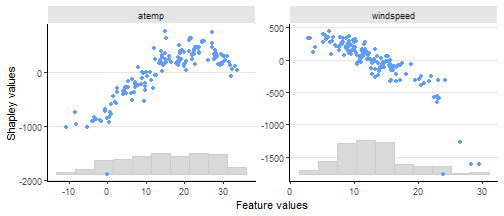

``` r
## Replication script for the R-examples used in the paper
# shapr: Explaining Machine Learning Models with Conditional Shapley Values in R and Python

# Requires the following R packages (from CRAN)
# shapr, xgboost, data.table, future, progressr, ggplot2, patchwork
```


``` r
progressr::handlers(global = TRUE)
```

``` r
#### Example code in Section 3 ####

# 30 indep
exp_30_indep <- explain(model = model,
                        x_explain = x_explain,
                        x_train = x_train,
                        max_n_coalitions = 30,
                        approach = "independence",
                        phi0 = mean(y_train),
                        verbose = NULL,
                        seed = 1)


# 30 ctree
exp_30_ctree <- explain(model = model,
                        x_explain = x_explain,
                        x_train = x_train,
                        max_n_coalitions = 30,
                        approach = "ctree",
                        phi0 = mean(y_train),
                        verbose = NULL,
                        ctree.sample = FALSE,
                        seed = 1)


exp_30_indep$MSEv$MSEv
```

```
##       MSEv  MSEv_sd
##      <num>    <num>
## 1: 1747324 118519.6
```

``` r
exp_30_ctree$MSEv$MSEv
```

```
##       MSEv  MSEv_sd
##      <num>    <num>
## 1: 1302295 96701.77
```

``` r
print(exp_30_ctree)
```

```
##      explain_id    none    trend cosyear sinyear     temp    atemp windspeed
##           <int>   <num>    <num>   <num>   <num>    <num>    <num>     <num>
##   1:          1 4536.60 -2413.56 -705.13  -31.06  -216.19  -261.96     53.13
##   2:          2 4536.60 -1334.20 -606.47  -56.38   275.48 -1305.01   -162.23
##   3:          3 4536.60 -1273.07 -707.02  -91.21   375.36 -1188.16   -350.78
##   4:          4 4536.60 -1563.51 -462.59 -128.07   147.44 -1197.28     27.40
##   5:          5 4536.60 -1518.47 -433.81 -209.22  -221.33 -1541.64     63.14
##  ---                                                                        
## 142:        142 4536.60   659.74 -264.03  236.34  -411.09  -519.00    102.95
## 143:        143 4536.60   928.20 -477.00  117.82   405.06  -436.96    149.88
## 144:        144 4536.60  1162.74 -511.61  122.23   937.72   186.55    217.13
## 145:        145 4536.60   343.15 -399.39  124.86 -1175.22  -811.96    144.21
## 146:        146 4536.60  -987.66 -767.01   93.28  -100.00 -1180.58    333.68
##          hum
##        <num>
##   1: -215.89
##   2:  125.21
##   3:  -30.53
##   4: -382.08
##   5:  353.85
##  ---        
## 142:  376.37
## 143:  113.68
## 144: -247.12
## 145:   59.32
## 146: -679.97
```

``` r
### Continued estimation
exp_iter_ctree <- explain(model = model,
                          x_explain = x_explain,
                          x_train = x_train,
                          approach = "ctree",
                          phi0 = mean(y_train),
                          prev_shapr_object = exp_30_ctree,
                          ctree.sample = FALSE,
                          verbose = c("basic","convergence"),
                          seed = 1)
```

```
## 
```

```
## ── Starting `shapr::explain()` at 2025-08-06 10:55:49 ──────────────────────────────────────────────────────────────────────────────────────────────────────────────────────────────────────────────────────────────────────────────────────────────────────────────────────────────────────────────────────────────────────────────
```

```
## ℹ Feature classes extracted from the model contains `NA`.
##   Assuming feature classes from the data are correct.
## ℹ `max_n_coalitions` is `NULL` or larger than or `2^n_features = 128`, and is therefore set to `2^n_features = 128`.
## 
## 
## ── Explanation overview ──
## 
## 
## 
## • Model class: <xgb.Booster>
## 
## • Approach: ctree
## 
## • Procedure: Iterative
## 
## • Number of feature-wise Shapley values: 7
## 
## • Number of observations to explain: 146
## 
## • Computations (temporary) saved at: 'C:\Users\jullum\AppData\Local\Temp\RtmpQZK1CU\shapr_obj_86ec985720.rds'
## 
## 
## 
## ── Iterative computation started ──
## 
## 
## 
## ── Iteration 4 ─────────────────────────────────────────────────────────────────────────────────────────────────────────────────────────────────────────────────────────────────────────────────────────────────────────────────────────────────────────────────────────────────────────────────────────────────────────────────────
## 
## ℹ Using 60 of 128 coalitions, 30 new. 
## 
## 
## 
## ── Convergence info 
## 
## ℹ Not converged after 60 coalitions:
## Current convergence measure: 0.044 [needs 0.02]
## Estimated remaining coalitions: 68
## (Conservatively) adding about 40% of that (28 coalitions) in the next iteration.
## 
## 
## 
## ── Iteration 5 ─────────────────────────────────────────────────────────────────────────────────────────────────────────────────────────────────────────────────────────────────────────────────────────────────────────────────────────────────────────────────────────────────────────────────────────────────────────────────────
## 
## ℹ Using 88 of 128 coalitions, 28 new. 
## 
## 
## 
## ── Convergence info 
## 
## ℹ Not converged after 88 coalitions:
## Current convergence measure: 0.03 [needs 0.02]
## Estimated remaining coalitions: 40
## (Conservatively) adding about 50% of that (20 coalitions) in the next iteration.
## 
## 
## 
## ── Iteration 6 ─────────────────────────────────────────────────────────────────────────────────────────────────────────────────────────────────────────────────────────────────────────────────────────────────────────────────────────────────────────────────────────────────────────────────────────────────────────────────────
## 
## ℹ Using 108 of 128 coalitions, 20 new. 
## 
## 
## 
## ── Convergence info 
## 
## ℹ Not converged after 108 coalitions:
## Current convergence measure: 0.027 [needs 0.02]
## Estimated remaining coalitions: 20
## (Conservatively) adding about 60% of that (12 coalitions) in the next iteration.
## 
## 
## 
## ── Iteration 7 ─────────────────────────────────────────────────────────────────────────────────────────────────────────────────────────────────────────────────────────────────────────────────────────────────────────────────────────────────────────────────────────────────────────────────────────────────────────────────────
## 
## ℹ Using 120 of 128 coalitions, 12 new. 
## 
## 
## 
## ── Convergence info 
## 
## ✔ Iterative Shapley value estimation stopped at 120 coalitions after 7 iterations, due to:
## Standard deviation convergence threshold (0.02) reached: 0.015!
```

``` r
### PLotting

library(ggplot2)
```

``` r
plot(exp_iter_ctree, plot_type = "scatter", scatter_features = c("atemp", "windspeed"))
```



```
## Error in `ggplot2::ggsave()`:
## ! Cannot find directory 'paper_figures'.
## ℹ Please supply an existing directory or use `create.dir = TRUE`.
```

``` r
### Grouping

group <- list(temp = c("temp", "atemp"),
              time = c("trend", "cosyear", "sinyear"),
              weather = c("hum","windspeed"))

exp_g_reg <- explain(model = model,
                     x_explain = x_explain,
                     x_train = x_train,
                     phi0 = mean(y_train),
                     group = group,
                     approach = "regression_separate",
                     regression.model = parsnip::boost_tree(
                       engine = "xgboost",
                       mode = "regression"
                     ),
                     verbose = NULL,
                     seed = 1)

tree_vals <- c(10, 15, 25, 50, 100, 500)
exp_g_reg_tuned <- explain(model = model,
                           x_explain = x_explain,
                           x_train = x_train,
                           phi0 = mean(y_train),
                           group = group,
                           approach = "regression_separate",
                           regression.model =
                             parsnip::boost_tree(
                               trees = hardhat::tune(),
                               engine = "xgboost", mode = "regression"
                             ),
                           regression.tune_values = expand.grid(
                             trees = tree_vals
                           ),
                           regression.vfold_cv_para = list(v = 5),
                           verbose = NULL,
                           seed = 1)

exp_g_reg$MSEv$MSEv
```

```
##       MSEv  MSEv_sd
##      <num>    <num>
## 1: 1547240 142123.2
```

``` r
exp_g_reg_tuned$MSEv$MSEv
```

```
##       MSEv  MSEv_sd
##      <num>    <num>
## 1: 1534033 142277.4
```

``` r
# Waterfall plot for the best one
plot(exp_g_reg_tuned,
     index_x_explain = 6,
     plot_type="waterfall")
```


``` r
#### Causal and asymmetric Shapley values ####

# Specify the causal ordering and confounding
causal_order0 <- list("trend",
                      c("cosyear", "sinyear"),
                      c("temp", "atemp", "windspeed", "hum"))

confounding0 <- c(FALSE, TRUE, FALSE)

# Specify the parameters of four different Shapley value variations
exp_names <- c("Asymmetric causal", "Asymmetric conditional",
               "Symmetric conditional", "Symmetric marginal")

causal_ordering_list <- list(causal_order0, causal_order0, NULL, NULL)
confounding_list <- list(confounding0, NULL, NULL, TRUE)
asymmetric_list <- list(TRUE, TRUE, FALSE, FALSE)

# Explain the four variations and create beeswarm plots
plot_list <- list()
for(i in seq_along(exp_names)){
  exp_tmp <- explain(
    model = model,
    x_train = x_train,
    x_explain = x_explain,
    approach = "gaussian",
    phi0 = mean(y_train),
    asymmetric = asymmetric_list[[i]],
    causal_ordering = causal_ordering_list[[i]],
    confounding = confounding_list[[i]],
    seed = 1,
    verbose = NULL
  )

  plot_list[[i]] <- plot(exp_tmp, plot_type = "beeswarm") +
    ggplot2::ggtitle(exp_names[i])+ggplot2::ylim(-3050, 4100)
}
```

``` r
# Use the patchwork package to combine the plots
library(patchwork)
patchwork::wrap_plots(plot_list, nrow = 1) +
  patchwork::plot_layout(guides = "collect")
```

```
## Warning: Removed 1 row containing missing values or values outside the scale range (`geom_point()`).
## Removed 1 row containing missing values or values outside the scale range (`geom_point()`).
```


```
## Warning: Removed 1 row containing missing values or values outside the scale range (`geom_point()`).
## Removed 1 row containing missing values or values outside the scale range (`geom_point()`).
```

``` r
#### Example code in Section 6 ####

# Read additional data
x_full <- fread(file.path("data_and_models", "x_full.csv"))
data_fit <- x_full[seq_len(729), ]

# Fit AR(2)-model
model_ar <- ar(data_fit$temp, order = 2)

phi0_ar <- rep(mean(data_fit$temp), 3)

exp_fc_ar <- explain_forecast(
  model = model_ar,
  y = x_full[, "temp"],
  explain_idx = 730:731,
  explain_y_lags = 2,
  horizon = 3,
  approach = "empirical",
  phi0 = phi0_ar,
  group_lags = FALSE,
  seed = 1
)
```

```
## 
```

```
## ── Starting `shapr::explain_forecast()` at 2025-08-06 10:57:54 ─────────────────────────────────────────────────────────────────────────────────────────────────────────────────────────────────────────────────────────────────────────────────────────────────────────────────────────────────────────────────────────────────────
```

```
## ℹ Feature names extracted from the model contains `NA`.
##   Consistency checks between model and data is therefore disabled.
## ℹ `max_n_coalitions` is `NULL` or larger than or `2^n_features = 4`, and is therefore set to `2^n_features = 4`.
## 
## 
## ── Explanation overview ──
## 
## 
## 
## • Model class: <ar>
## 
## • Approach: empirical
## 
## • Procedure: Non-iterative
## 
## • Number of feature-wise Shapley values: 2
## 
## • Number of observations to explain: 2
## 
## • Computations (temporary) saved at: 'C:\Users\jullum\AppData\Local\Temp\RtmpQZK1CU\shapr_obj_86ec6e8d1fb0.rds'
## 
## 
## 
## ── Main computation started ──
## 
## 
## 
## ℹ Using 4 of 4 coalitions.
```

``` r
# Print Shapley values
print(exp_fc_ar)
```

```
##    explain_idx horizon  none temp.1 temp.2
##          <int>   <int> <num>  <num>  <num>
## 1:         730       1 15.32 -5.961 -4.683
## 2:         731       1 15.32 -7.803 -4.759
## 3:         730       2 15.32 -5.605 -4.389
## 4:         731       2 15.32 -7.336 -4.470
## 5:         730       3 15.32 -5.262 -4.119
## 6:         731       3 15.32 -6.887 -4.196
```

``` r
# Fit ARIMA(2,0,0)-model
model_arimax <- arima(data_fit$temp,
                      order = c(2, 0, 0),
                      xreg = data_fit$windspeed)
phi0_arimax <- rep(mean(data_fit$temp), 2)

exp_fc_arimax <- explain_forecast(
  model = model_arimax,
  y = x_full[, "temp"],
  xreg = x_full[, "windspeed"],
  train_idx = 2:728,
  explain_idx = 729,
  explain_y_lags = 2,
  explain_xreg_lags = 1,
  horizon = 2,
  approach = "empirical",
  phi0 = phi0_arimax,
  group_lags = TRUE,
  seed = 1
)
```

```
## 
## ── Starting `shapr::explain_forecast()` at 2025-08-06 10:57:58 ─────────────────────────────────────────────────────────────────────────────────────────────────────────────────────────────────────────────────────────────────────────────────────────────────────────────────────────────────────────────────────────────────────
## ℹ Feature names extracted from the model contains `NA`.
##   Consistency checks between model and data is therefore disabled.ℹ `max_n_coalitions` is `NULL` or larger than or `2^n_groups = 4`, and is therefore set to `2^n_groups = 4`.Registered S3 method overwritten by 'quantmod':
##   method            from
##   as.zoo.data.frame zoo 
## 
## ── Explanation overview ──
## 
## • Model class: <Arima>
## • Approach: empirical
## • Procedure: Non-iterative
## • Number of group-wise Shapley values: 2
## • Number of observations to explain: 1
## • Computations (temporary) saved at: 'C:\Users\jullum\AppData\Local\Temp\RtmpQZK1CU\shapr_obj_86ec6d171021.rds'
## 
## ── Main computation started ──
## 
## ℹ Using 4 of 4 coalitions. 
## Registered S3 method overwritten by 'quantmod':
##   method            from
##   as.zoo.data.frame zoo 
## Registered S3 method overwritten by 'quantmod':
##   method            from
##   as.zoo.data.frame zoo 
## Registered S3 method overwritten by 'quantmod':
##   method            from
##   as.zoo.data.frame zoo 
## Registered S3 method overwritten by 'quantmod':
##   method            from
##   as.zoo.data.frame zoo
```

``` r
# Print Shapley values
print(exp_fc_arimax)
```

```
##    explain_idx horizon  none   temp windspeed
##          <int>   <int> <num>  <num>     <num>
## 1:         729       1 15.32 -8.899    -1.047
## 2:         729       2 15.32 -8.585    -2.113
```

``` r
#### Wrapping up ####
```


``` r
sessionInfo()
```

```
## R version 4.5.1 (2025-06-13 ucrt)
## Platform: x86_64-w64-mingw32/x64
## Running under: Windows 11 x64 (build 26100)
## 
## Matrix products: default
##   LAPACK version 3.12.1
## 
## locale:
## [1] LC_COLLATE=English_United States.utf8 
## [2] LC_CTYPE=English_United States.utf8   
## [3] LC_MONETARY=English_United States.utf8
## [4] LC_NUMERIC=C                          
## [5] LC_TIME=English_United States.utf8    
## 
## time zone: Europe/Oslo
## tzcode source: internal
## 
## attached base packages:
## [1] stats     graphics  grDevices utils     datasets  methods   base     
## 
## other attached packages:
## [1] patchwork_1.3.1   ggplot2_3.5.2     progressr_0.15.1  future_1.67.0    
## [5] shapr_1.0.5       data.table_1.17.8 xgboost_1.7.11.1 
## 
## loaded via a namespace (and not attached):
##  [1] tidyselect_1.2.1    timeDate_4041.110   dplyr_1.1.4        
##  [4] vipor_0.4.7         farver_2.1.2        digest_0.6.37      
##  [7] rpart_4.1.24        timechange_0.3.0    lifecycle_1.0.4    
## [10] yardstick_1.3.2     survival_3.8-3      magrittr_2.0.3     
## [13] compiler_4.5.1      rlang_1.1.6         tools_4.5.1        
## [16] knitr_1.50          labeling_0.4.3      curl_6.4.0         
## [19] TTR_0.24.4          DiceDesign_1.10     RColorBrewer_1.1-3 
## [22] parsnip_1.3.2       withr_3.0.2         purrr_1.1.0        
## [25] workflows_1.2.0     nnet_7.3-20         grid_4.5.1         
## [28] tune_1.3.0          xts_0.14.1          colorspace_2.1-1   
## [31] globals_0.18.0      scales_1.4.0        iterators_1.0.14   
## [34] MASS_7.3-65         cli_3.6.5           ragg_1.4.0         
## [37] generics_0.1.4      rstudioapi_0.17.1   future.apply_1.20.0
## [40] ggbeeswarm_0.7.2    splines_4.5.1       dials_1.4.1        
## [43] forecast_8.24.0     parallel_4.5.1      urca_1.3-4         
## [46] vctrs_0.6.5         hardhat_1.4.1       Matrix_1.7-3       
## [49] jsonlite_2.0.0      tseries_0.10-58     beeswarm_0.4.0     
## [52] listenv_0.9.1       systemfonts_1.2.3   foreach_1.5.2      
## [55] gower_1.0.2         tidyr_1.3.1         recipes_1.3.1      
## [58] quantmod_0.4.28     glue_1.8.0          parallelly_1.45.1  
## [61] codetools_0.2-20    rsample_1.3.1       lubridate_1.9.4    
## [64] gtable_0.3.6        quadprog_1.5-8      lmtest_0.9-40      
## [67] GPfit_1.0-9         tibble_3.3.0        furrr_0.3.1        
## [70] pillar_1.11.0       ipred_0.9-15        lava_1.8.1         
## [73] R6_2.6.1            textshaping_1.0.1   lhs_1.2.0          
## [76] evaluate_1.0.4      lattice_0.22-7      fracdiff_1.5-3     
## [79] class_7.3-23        Rcpp_1.1.0          nlme_3.1-168       
## [82] prodlim_2025.04.28  xfun_0.52           zoo_1.8-14         
## [85] pkgconfig_2.0.3
```

