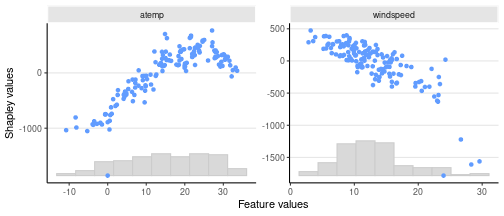

``` r
## Replication script for the R-examples used in the paper
# shapr: Explaining Machine Learning Models with Conditional Shapley Values in R and Python

# Requires the following R packages (from CRAN)
# shapr, xgboost, data.table, future, progressr, ggplot2, ggpubr


#### Loads packages, Reads data and models created by R_prep_data_and_model.R ####

library(xgboost)
library(data.table)
library(shapr)

x_explain <- fread(file.path("data_and_models", "x_explain.csv"))
x_train <- fread(file.path("data_and_models", "x_train.csv"))
y_train <- unlist(fread(file.path("data_and_models", "y_train.csv")))
model <- readRDS(file.path("data_and_models", "model.rds"))


# We compute the SHAP values for the test data.
library(future)
library(progressr)
future::plan(multisession, workers = 4)
```


``` r
progressr::handlers(global = TRUE)
```

``` r
#### Example code in Section 3 ####

# 20 indep
exp_20_indep <- explain(model = model,
                        x_explain = x_explain,
                        x_train = x_train,
                        max_n_coalitions = 20,
                        approach = "independence",
                        phi0 = mean(y_train),
                        verbose = NULL,
                        seed = 1)
```

```
## Note: Feature classes extracted from the model contains NA.
## Assuming feature classes from the data are correct.
```

``` r
# 20 ctree
exp_20_ctree <- explain(model = model,
                        x_explain = x_explain,
                        x_train = x_train,
                        max_n_coalitions = 20,
                        approach = "ctree",
                        phi0 = mean(y_train),
                        verbose = NULL,
                        ctree.sample = FALSE,
                        seed = 1)
```

```
## Note: Feature classes extracted from the model contains NA.
## Assuming feature classes from the data are correct.
```

``` r
exp_20_indep$MSEv$MSEv
```

```
##       MSEv  MSEv_sd
##      <num>    <num>
## 1: 1695928 111719.3
```

``` r
exp_20_ctree$MSEv$MSEv
```

```
##       MSEv  MSEv_sd
##      <num>    <num>
## 1: 1338159 88480.71
```

``` r
print(exp_20_ctree)
```

```
##      explain_id  none   trend cosyear sinyear
##           <int> <num>   <num>   <num>   <num>
##   1:          1  4537 -2378.2  -902.5   -54.9
##   2:          2  4537 -1267.7  -801.4  -103.7
##   3:          3  4537 -1170.2  -788.4  -204.3
##   4:          4  4537 -1543.5  -689.6  -170.7
##   5:          5  4537 -1558.3  -727.3  -197.5
##  ---                                         
## 142:        142  4537   557.3  -574.0   462.2
## 143:        143  4537   791.6  -803.2   332.2
## 144:        144  4537  1203.0  -576.7   110.8
## 145:        145  4537   258.8  -652.1   256.2
## 146:        146  4537  -994.0  -956.0   192.7
##        temp   atemp windspeed     hum
##       <num>   <num>     <num>   <num>
##   1:  236.5  -847.1    -16.86  172.33
##   2:  559.6 -1668.7   -208.54  426.87
##   3:  497.4 -1493.5   -390.98  284.54
##   4:  708.8 -1635.4   -207.19  -21.12
##   5:  590.8 -2180.7   -212.53  778.08
##  ---                                 
## 142:  436.3 -1146.0   -145.87  591.22
## 143: 1133.2  -982.3     34.75  294.41
## 144: 1352.0  -392.0     57.43  113.10
## 145: -482.5 -1470.7     30.31  345.06
## 146: -393.7 -1148.4    812.57 -801.37
```

``` r
### Continued estimation
exp_iter_ctree <- explain(model = model,
                          x_explain = x_explain,
                          x_train = x_train,
                          approach = "ctree",
                          phi0 = mean(y_train),
                          prev_shapr_object = exp_20_ctree,
                          ctree.sample = FALSE,
                          verbose = c("basic","convergence"),
                          seed = 1)
```

```
## Note: Feature classes extracted from the model contains NA.
## Assuming feature classes from the data are correct.
```

```
## Success with message:
## max_n_coalitions is NULL or larger than or 2^n_features = 128, 
## and is therefore set to 2^n_features = 128.
```

```
## 
```

```
## ── Starting `shapr::explain()` at 2025-03-31 21
```

```
## • Model class: <xgb.Booster>
```

```
## • Approach: ctree
```

```
## • Iterative estimation: TRUE
```

```
## • Number of feature-wise Shapley values: 7
```

```
## • Number of observations to explain: 146
```

```
## • Computations (temporary) saved at:
## '/tmp/RtmpEX1sCg/shapr_obj_352941249046.rds'
```

```
## 
```

```
## ── iterative computation started ──
```

```
## 
```

```
## ── Iteration 3 ────────────────────────────────
```

```
## ℹ Using 32 of 128 coalitions, 12 new.
```

```
## 
```

```
## ── Convergence info
```

```
## ℹ Not converged after 32 coalitions:
## Current convergence measure: 0.17 [needs 0.02]
## Estimated remaining coalitions: 94
## (Concervatively) adding 20% of that (20 coalitions) in the next iteration.
```

```
## 
```

```
## ── Iteration 4 ────────────────────────────────
```

```
## ℹ Using 52 of 128 coalitions, 20 new.
```

```
## 
```

```
## ── Convergence info
```

```
## ℹ Not converged after 52 coalitions:
## Current convergence measure: 0.076 [needs 0.02]
## Estimated remaining coalitions: 32
## (Concervatively) adding 30% of that (10 coalitions) in the next iteration.
```

```
## 
```

```
## ── Iteration 5 ────────────────────────────────
```

```
## ℹ Using 62 of 128 coalitions, 10 new.
```

```
## 
```

```
## ── Convergence info
```

```
## ℹ Not converged after 62 coalitions:
## Current convergence measure: 0.055 [needs 0.02]
## Estimated remaining coalitions: 6
## (Concervatively) adding 40% of that (4 coalitions) in the next iteration.
```

```
## 
```

```
## ── Iteration 6 ────────────────────────────────
```

```
## ℹ Using 66 of 128 coalitions, 4 new.
```

```
## 
```

```
## ── Convergence info
```

```
## ✔ Converged after 66 coalitions:
## Convergence tolerance reached!
```

``` r
### PLotting

library(ggplot2)
```

``` r
plot(exp_iter_ctree, plot_type = "scatter",scatter_features = c("atemp","windspeed"))
```



```
## Note: Feature classes extracted from the model contains NA.
## Assuming feature classes from the data are correct.
```

```
## Success with message:
## max_n_coalitions is NULL or larger than or 2^n_groups = 8, 
## and is therefore set to 2^n_groups = 8.
```

```
## Note: Feature classes extracted from the model contains NA.
## Assuming feature classes from the data are correct.
```

```
## Success with message:
## max_n_coalitions is NULL or larger than or 2^n_groups = 8, 
## and is therefore set to 2^n_groups = 8.
```

```
##       MSEv  MSEv_sd
##      <num>    <num>
## 1: 1547240 142123.2
```

```
##       MSEv  MSEv_sd
##      <num>    <num>
## 1: 1534033 142277.4
```

```
##    explain_id     none      temp      time
##         <int>    <num>     <num>     <num>
## 1:          1 4536.598  -371.659 -2757.175
## 2:          2 4536.598 -1041.262 -1609.387
## 3:          3 4536.598 -1118.937 -1560.695
## 4:          4 4536.598 -1361.832 -1781.578
## 5:          5 4536.598 -1887.654 -1745.006
## 6:          6 4536.598 -1810.055 -1927.635
##      weather
##        <num>
## 1: -661.8197
## 2: -412.9517
## 3: -585.7902
## 4: -415.2823
## 5:  125.1834
## 6:  478.3566
```

``` r
# Waterfall plot for the best one
plot(exp_g_reg_tuned,index_x_explain = 6,plot_type="waterfall")
```


``` r
#### Figure 6 in the paper ####
```


``` r
#### Generic example code for Section 4 (not ran for paper) ####

# Specify the causal ordering and confounding
causal_ordering <- list("trend",
                        c("cosyear", "sinyear"),
                        c("temp", "atemp", "windspeed", "hum"))

confounding <- c(FALSE, TRUE, FALSE)

exp_asym_cau <- explain(
  model = model,
  x_train = x_train,
  x_explain = x_explain,
  phi0 = mean(y_train),
  approach = "gaussian",
  asymmetric = TRUE,
  causal_ordering = causal_ordering,
  confounding = confounding,
  seed = 1
)
```

``` r
#### Example code in Section 6 ####

# Read additional data
x_full <- fread(file.path("data_and_models","x_full.csv"))
data_fit <- x_full[seq_len(729), ]

# Fit AR(2)-model
model_ar <- ar(data_fit$temp, order = 2)
phi0_ar <- rep(mean(data_fit$temp), 3)

exp_fc_ar <- explain_forecast(
  model = model_ar,
  y = x_full[, "temp"],
  train_idx = 2:729,
  explain_idx = 730:731,
  explain_y_lags = 2,
  horizon = 3,
  approach = "empirical",
  phi0 = phi0_ar,
  group_lags = FALSE
)
```

```
## Note: Feature names extracted from the model contains NA.
## Consistency checks between model and data is therefore disabled.
```

```
## Success with message:
## max_n_coalitions is NULL or larger than or 2^n_features = 4, 
## and is therefore set to 2^n_features = 4.
```

```
## 
```

```
## ── Starting `shapr::explain()` at 2025-03-31 21
```

```
## • Model class: <ar>
```

```
## • Approach: empirical
```

```
## • Iterative estimation: FALSE
```

```
## • Number of feature-wise Shapley values: 2
```

```
## • Number of observations to explain: 2
```

```
## • Computations (temporary) saved at:
## '/tmp/RtmpEX1sCg/shapr_obj_352947befbe8.rds'
```

```
## 
```

```
## ── Main computation started ──
```

```
## 
```

```
## ℹ Using 4 of 4 coalitions.
```

``` r
print(exp_fc_ar)
```

```
##    explain_idx horizon  none temp.1 temp.2
##          <int>   <int> <num>  <num>  <num>
## 1:         730       1 15.32 -5.977 -4.667
## 2:         731       1 15.32 -7.816 -4.746
## 3:         730       2 15.32 -5.620 -4.374
## 4:         731       2 15.32 -7.349 -4.457
## 5:         730       3 15.32 -5.276 -4.105
## 6:         731       3 15.32 -6.899 -4.184
```

``` r
# Fit ARIMA(2,0,0)-model
model_arimax <- arima(data_fit$temp, order = c(2, 0, 0), xreg = data_fit$windspeed)
phi0_arimax <- rep(mean(data_fit$temp), 2)

exp_fc_arimax <- explain_forecast(
  model = model_arimax,
  y = x_full[, "temp"],
  xreg = x_full[, "windspeed"],
  train_idx = 2:728,
  explain_idx = 729,
  explain_y_lags = 2,
  explain_xreg_lags = 1,
  horizon = 2,
  approach = "empirical",
  phi0 = phi0_arimax,
  group_lags = TRUE
)
```

```
## Note: Feature names extracted from the model contains NA.
## Consistency checks between model and data is therefore disabled.
```

```
## Success with message:
## max_n_coalitions is NULL or larger than or 2^n_groups = 4, 
## and is therefore set to 2^n_groups = 4.
```

```
## Registered S3 method overwritten by 'quantmod':
##   method            from
##   as.zoo.data.frame zoo
```

```
## 
```

```
## ── Starting `shapr::explain()` at 2025-03-31 21
```

```
## • Model class: <Arima>
```

```
## • Approach: empirical
```

```
## • Iterative estimation: FALSE
```

```
## • Number of group-wise Shapley values: 2
```

```
## • Number of observations to explain: 1
```

```
## • Computations (temporary) saved at:
## '/tmp/RtmpEX1sCg/shapr_obj_352943aef2515.rds'
```

```
## 
```

```
## ── Main computation started ──
```

```
## 
```

```
## ℹ Using 4 of 4 coalitions.
```

``` r
print(exp_fc_arimax)
```

```
##    explain_idx horizon  none   temp windspeed
##          <num>   <num> <num>  <num>     <num>
## 1:         729       1 15.32 -8.899    -1.047
## 2:         729       2 15.32 -8.585    -2.113
```

``` r
#### Wrapping up ####
```


``` r
sessionInfo()
```

```
## R version 4.4.1 (2024-06-14)
## Platform: x86_64-pc-linux-gnu
## Running under: Ubuntu 20.04.6 LTS
## 
## Matrix products: default
## BLAS:   /usr/lib/x86_64-linux-gnu/openblas-pthread/libblas.so.3 
## LAPACK: /usr/lib/x86_64-linux-gnu/openblas-pthread/liblapack.so.3;  LAPACK version 3.9.0
## 
## locale:
##  [1] LC_CTYPE=en_US.UTF-8      
##  [2] LC_NUMERIC=C              
##  [3] LC_TIME=en_US.UTF-8       
##  [4] LC_COLLATE=en_US.UTF-8    
##  [5] LC_MONETARY=en_US.UTF-8   
##  [6] LC_MESSAGES=en_US.UTF-8   
##  [7] LC_PAPER=en_US.UTF-8      
##  [8] LC_NAME=C                 
##  [9] LC_ADDRESS=C              
## [10] LC_TELEPHONE=C            
## [11] LC_MEASUREMENT=en_US.UTF-8
## [12] LC_IDENTIFICATION=C       
## 
## time zone: Europe/Oslo
## tzcode source: system (glibc)
## 
## attached base packages:
## [1] stats     graphics  grDevices utils    
## [5] datasets  methods   base     
## 
## other attached packages:
## [1] ggpubr_0.6.0      ggplot2_3.5.1    
## [3] progressr_0.15.1  future_1.34.0    
## [5] shapr_1.0.3.9000  data.table_1.17.0
## [7] xgboost_1.7.9.1  
## 
## loaded via a namespace (and not attached):
##  [1] gridExtra_2.3       rlang_1.1.5        
##  [3] magrittr_2.0.3      furrr_0.3.1        
##  [5] tseries_0.10-58     compiler_4.4.1     
##  [7] systemfonts_1.1.0   vctrs_0.6.5        
##  [9] lhs_1.2.0           quadprog_1.5-8     
## [11] tune_1.3.0          pkgconfig_2.0.3    
## [13] backports_1.5.0     labeling_0.4.3     
## [15] prodlim_2024.06.25  ggbeeswarm_0.7.2   
## [17] ragg_1.3.3          purrr_1.0.4        
## [19] xfun_0.51           jsonlite_1.9.1     
## [21] recipes_1.2.0       broom_1.0.7        
## [23] parallel_4.4.1      R6_2.6.1           
## [25] rsample_1.2.1       parallelly_1.43.0  
## [27] car_3.1-3           rpart_4.1.23       
## [29] lmtest_0.9-40       lubridate_1.9.4    
## [31] Rcpp_1.0.14         dials_1.4.0        
## [33] iterators_1.0.14    knitr_1.50         
## [35] future.apply_1.11.3 zoo_1.8-13         
## [37] Matrix_1.7-0        splines_4.4.1      
## [39] nnet_7.3-19         timechange_0.3.0   
## [41] tidyselect_1.2.1    rstudioapi_0.17.1  
## [43] abind_1.4-8         timeDate_4041.110  
## [45] codetools_0.2-20    curl_6.2.1         
## [47] listenv_0.9.1       lattice_0.22-6     
## [49] tibble_3.2.1        quantmod_0.4.26    
## [51] withr_3.0.2         urca_1.3-4         
## [53] evaluate_1.0.3      survival_3.6-4     
## [55] xts_0.14.1          pillar_1.10.1      
## [57] carData_3.0-5       foreach_1.5.2      
## [59] generics_0.1.3      TTR_0.24.4         
## [61] forecast_8.23.0     munsell_0.5.1      
## [63] scales_1.3.0        globals_0.16.3     
## [65] class_7.3-22        glue_1.8.0         
## [67] tools_4.4.1         gower_1.0.2        
## [69] ggsignif_0.6.4      cowplot_1.1.3      
## [71] grid_4.4.1          yardstick_1.3.2    
## [73] tidyr_1.3.1         ipred_0.9-15       
## [75] colorspace_2.1-1    nlme_3.1-164       
## [77] beeswarm_0.4.0      fracdiff_1.5-3     
## [79] vipor_0.4.7         Formula_1.2-5      
## [81] cli_3.6.4           DiceDesign_1.10    
## [83] textshaping_0.4.0   workflows_1.2.0    
## [85] parsnip_1.3.1       lava_1.8.1         
## [87] dplyr_1.1.4         gtable_0.3.6       
## [89] GPfit_1.0-8         rstatix_0.7.2      
## [91] digest_0.6.37       farver_2.1.2       
## [93] lifecycle_1.0.4     hardhat_1.4.1      
## [95] MASS_7.3-60.2
```

