# Overview {#Vignette}

This vignette elaborates and demonstrates the asymmetric and
causal Shapley value frameworks introduced by @frye2020asymmetric
and @heskes2020causal, respectively. We also consider the marginal
and conditional Shapley value frameworks, see @lundberg2017unified
and @aas2019explaining, respectively. We demonstrate the frameworks
on the [bike sharing](https://archive.ics.uci.edu/dataset/275/)
dataset from the UCI Machine Learning Repository. The setup is
based on the `CauSHAPley` package, which is the
[code supplement](https://proceedings.neurips.cc/paper/2020/hash/32e54441e6382a7fbacbbbaf3c450059-Abstract.html)
to the @heskes2020causal paper. The `CauSHAPley` package was based
on an old version of `shapr` and was restricted to the `gaussian` approach (see section 6 in @heskes2020causal for more details).

We have extended the causal Shapley value framework to work for all
Monte Carlo-based approaches (`independence` (not recommended), `empirical`, `gaussian`, `copula`, `ctree`, `vaeac` and `categorical`), while the extension of the asymmetric
Shapley value framework works for all the Monte Carlo and regression-based approaches.
Our generalization is of uttermost importance, as many real-world data sets
are far from the Gaussian distribution, and, compared to `CauSHAPley`, our implementation
can utilize all of `shapr`'s new features, such as batch computation, parallelization and
iterative computation for both feature-wise and group-wise Shapley values.

The main differences between the marginal, conditional, and casual Shapley value
frameworks is that they sample/generate the Monte Carlo samples from the
marginal distribution, (conventional) observational conditional distribution,
and interventional conditional distribution, respectively. Asymmetric means
that we do not consider all possible coalitions, but rather only the coalitions
that respects a causal ordering.


# Asymmetric conditional Shapley values {#AsymSV}

Asymmetric (conditional) Shapley values were proposed by @frye2020asymmetric as
a way to incorporate causal knowledge in the real world by computing the Shapley
value explanations using only the feature combinations/coalitions consistent with
a (partial) causal ordering. See the figure below for a schematic overview of the causal ordering we are going to use in the examples in this vignette. In the figure, we see
that our causal ordering consists of three components: $\tau_1 = \{X_1\}$, $\tau_2 = \{X_2, X_3\}$, and $\tau_3 = \{X_4, X_5, X_6, X_7\}$. See the [code section](#Code) for what the features represent.

To elaborate, instead of considering the $2^M$ possible coalitions,
where $M$ is the number of features, asymmetric Shapley values only
consider the subset of coalitions which respects the causal ordering.
For our causal ordering, this means that the asymmetric Shapley value explanation
framework skips the coalitions where $X_2$ is included but \textit{not} $X_1$,
as $X_1$ is the ancestor of $X_2$. This will skew the explanations towards
distal/root causes, see Section 3.2 in @frye2020asymmetric.

We can use all approaches in `shapr`, both Monte Carlo-based and
regression based methods, to compute the asymmetric Shapley values.
This is because the asymmetric Shapley value explanation framework does not change
how we compute the contribution functions $v(S)$, but rather which of
the coalitions $S$ that are used to compute the Shapley value explanations.
This means that the number of coalitions are no longer $O(2^M)$, but rather
$O(2^{\tau_0})$, where $\tau_0 = \operatorname{max}_i |\tau_i|$
is the number of features ($|\tau_i|$) in the largest component of the causal ordering.

Furthermore, asymmetric Shapley values supports groups of features, but
then the causal ordering must be given on the group level instead of on the
feature level. The asymmetric Shapley value framework also supports
sampling of coalitions where the sampling is done from the
set of coalitions that respects the causal ordering.

Finally, we want make a remark that asymmetric conditional Shapley values are
equivalent to asymmetric causal Shapley values (see below) when we only
use the coalitions respecting the causal ordering and assuming that all
dependencies within chain components are induced by mutual interactions.


<div class="figure" style="text-align: center">
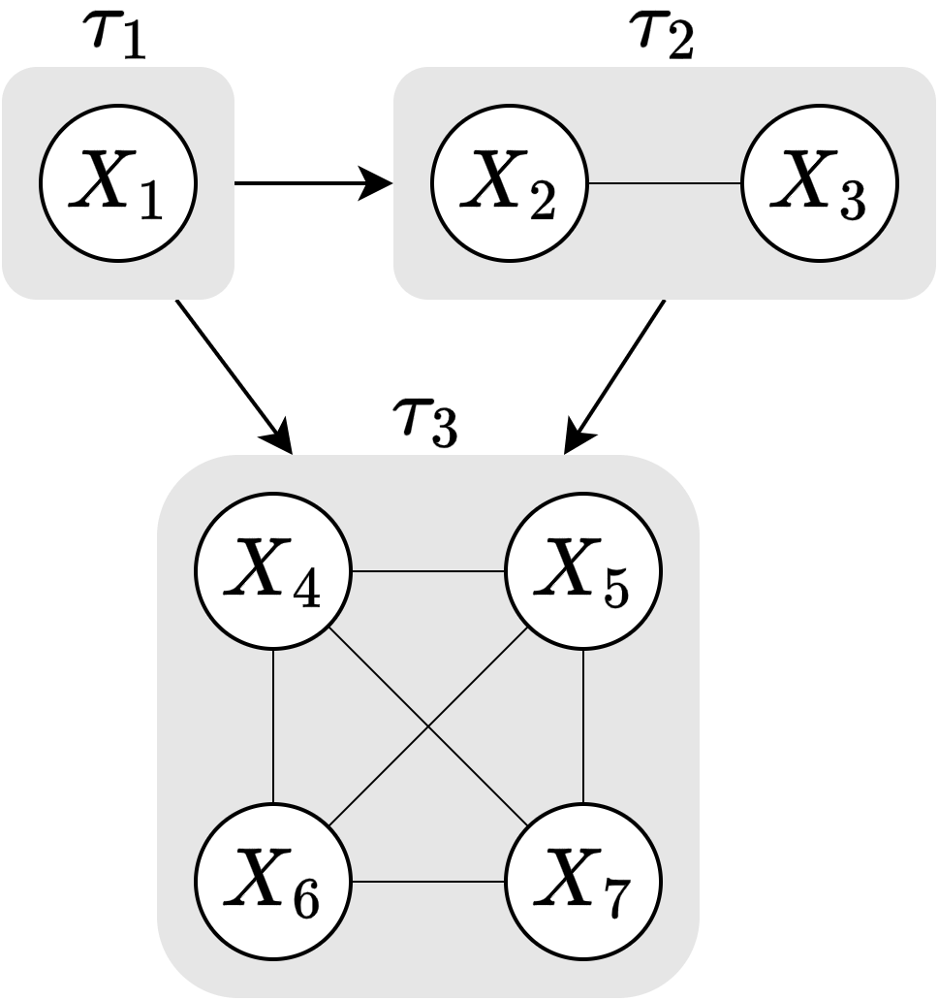
<p class="caption">Schematic overview of the causal ordering used in this vignette.</p>
</div>


# Causal Shapley values {#CausSV}

Causal Shapley values were proposed by @heskes2020causal as a way
to explain the total effect of features on the prediction by taking
into account their causal relationships and adapting the sampling
procedure in `shapr`. More precisely, they propose to employ Pearl’s
do-calculus to circumvent the independence assumption, made by
@lundberg2017unified, without sacrificing any of the desirable
properties of the Shapley value framework. The causal Shapley value
explanation framework can also separate the contribution of direct
and indirect effects, which makes them principally different from
marginal and conditional Shapley values. The framework also provides
a more direct and robust way to incorporate causal knowledge, compared
to the asymmetric Shapley value explanation framework.

To compute causal Shapley values, we have to specify a (partial) causal
ordering and make an assumption about the confounding in each component.
Together, they form a causal chain graph which contains directed and undirected
edges. All features that are treated on an equal footing are linked
together with undirected edges and become part of the same chain component.
Edges between chain components are directed and represent causal relationships.
In the figure below, we have the same causal ordering as above, but we
have in addition made the assumption that we have confounding in the
second component, but no confounding in the first and third components.
This allows us to correctly distinguishes between dependencies that are
due to confounding and mutual interactions. That is, in the figure,
the dependencies in chain component $\tau_2$ are assumed to be the result
of a common confounder, and those in $\tau_3$ of mutual interactions, while
we have no mutual interactions in $\tau_1$ as it is a singleton.

Computing the effect of an intervention depends on how we interpret the
generative process that lead to the feature dependencies within each component.
If they are the result of marginalizing out a common confounder,
then intervention on a particular feature will break the dependency
with the other features, and we denote the set of these chain components
by $\mathcal{T}_{\text{confounding}}$. For the components with mutual
feature interactions, setting the value of a feature effects the
distribution of the variables within the same component. We denote
the set of these components by $\mathcal{T}_{\,\overline{\text{confounding}}}$.

@heskes2020causal described how any expectation by intervention needed
to compute the causal Shapley values can be translated to an expectation
by observation, by using the interventional formula for causal chain graphs:
\begin{align}
\label{eq:do}
P(X_{\bar{\mathcal{S}}} \mid do(X_\mathcal{S} = x_\mathcal{S}))
= &
\prod_{\tau \in \mathcal{T}_{\,\text{confounding}}}
P(X_{\tau \cap \bar{\mathcal{S}}} \mid X_{\text{pa}(\tau) \cap \bar{\mathcal{S}}}, x_{\text{pa}(\tau) \cap \mathcal{S}}) \times \tag{1} \\
& \quad
\prod_{\tau \in \mathcal{T}_{\,\overline{\text{confounding}}}}
P(X_{\tau \cap \bar{\mathcal{S}}} \mid X_{\text{pa}(\tau) \cap \bar{\mathcal{S}}}, x_{\text{pa}(\tau) \cap \mathcal{S}}, x_{\tau \cap \mathcal{S}}).
\end{align}
Here, any of the Monte Carlo-based approaches in `shapr` can be
used to compute the conditional distributions/observational expectations. The marginals
are estimated from the training data for all approaches except
`gaussian`, for which we use the marginals of the Gaussian
distribution instead.

For specific causal chain graphs, the causal Shapley value framework
simplifies to symmetric conditional, asymmetric conditional, and marginal
Shapley values, see Corollary 1 to 3 in the supplement of @heskes2020causal.


<div class="figure">
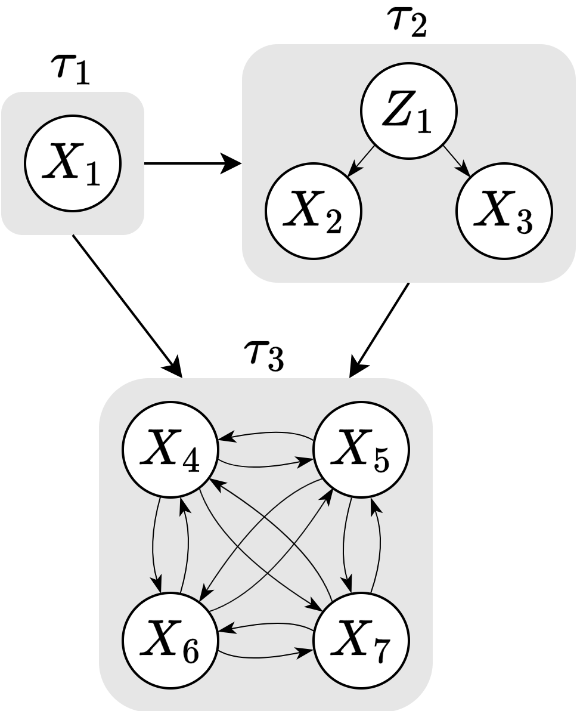
<p class="caption">Schematic overview of the causal chain graph used in this vignette.</p>
</div>


# Marginal Shapley values {#MarginaSV}
Causal Shapley values are equivalent to marginal Shapley values when all $M$
features are combined into a single component $\tau = \mathcal{M} = \{1,2,...,M\}$ and
all dependencies are induced by confounding. Then $\text{pa}(\tau) = \emptyset$, and
$P(X_{\bar{\mathcal{S}}} \mid do(X_\mathcal{S} = x_\mathcal{S}))$ in Equation (\ref{eq:do})
simplifies to $P(X_{\bar{\mathcal{S}}} \mid do(X_\mathcal{S} = x_\mathcal{S})) = P(X_{\bar{\mathcal{S}}})$,
as specified in @lundberg2017unified.

The Monte Carlo samples for the marginals are generated by sampling from the
training data, except for the `gaussian` approach where we use the marginals
of the estimated multivariate Gaussian distribution. This means that for all
other approaches, this is the same as using the `independence` approach
in the conditional Shapley value explanation framework.

# Symmetric conditional Shapley values {#ConditionalSV}
Causal Shapley values are equivalent to symmetric conditional Shapley values when all $M$
features are combined in a single component $\tau = \mathcal{M} = \{1,2,...,M\}$ and
all dependencies are induced by mutual interaction. Then $\text{pa}(\tau) = \emptyset$,
and $P(X_{\bar{\mathcal{S}}} \mid do(X_\mathcal{S} = x_\mathcal{S}))$ in Equation
(\ref{eq:do}) simplifies to
$P(X_{\bar{\mathcal{S}}} \mid do(X_\mathcal{S} = x_\mathcal{S})) = P(X_{\bar{\mathcal{S}}} \mid X_\mathcal{S} = x_\mathcal{S})$,
as specified in @aas2019explaining. Symmetric means that we consider all coalitions.


# Code example {#Code}
## Overview
We demonstrate the frameworks on the [bike sharing](https://archive.ics.uci.edu/dataset/275/)
dataset from the UCI Machine Learning Repository. We let the features be the
number of days since January 2011 (`trend`), two cyclical variables representing
the season (`cosyear`, `sinyear`), temperature (`temp`), feeling temperature
(`atemp`), wind speed (`windspeed`), and humidity (`hum`). The first three features
are considered to be a potential cause of the four weather-related features.
The bike rental is strongly seasonal and shows an upward trend, as illustrated in the figure below.
The bike data is split randomly into a training (80%) and test/explicand (20%) set.
We train an `XGBoost` model for 100 rounds with default variables to act as the model
we want to explain.

In the table below, we highlight the Shapley value explanation frameworks introduced above
and how to access them by changing the arguments `asymmetric`, `ordering`, and `confounding` in `shapr::explain()`.
Note that symmetric conditional Shapley values are the default version, i.e., by default
`asymmetric = FALSE`, `ordering = NULL`, `confounding = NULL`.

| Framework          | Sampling               | Approaches           | `asymmetric` | `ordering`  | `confounding` |
|:-------------------|:-----------------------|:---------------------|:-------------|:------------|:--------------|
| Sym. Conditional   | $P(X_{\bar{\mathcal{S}}} \mid (X_\mathcal{S} = x_\mathcal{S})$    | All                  | `FALSE`      | `NULL`      | `NULL`        |
| Asym. Conditional  | $P(X_{\bar{\mathcal{S}}} \mid (X_\mathcal{S} = x_\mathcal{S})$    | All                  | `TRUE`       | `list(...)` | `NULL`        |
| Sym. Causal        | $P(X_{\bar{\mathcal{S}}} \mid do(X_\mathcal{S} = x_\mathcal{S}))$ |  All MC-based        | `FALSE`      | `list(...)` | `c(...)`      |
| Asym. Causal       | $P(X_{\bar{\mathcal{S}}} \mid do(X_\mathcal{S} = x_\mathcal{S}))$ |  All MC-based        | `TRUE`       | `list(...)` | `c(...)`      |
| Sym. Marginal      | $P(X_{\bar{\mathcal{S}}})$                                        | `indep.`, `gaussian` | `FALSE`      | `NULL`      | `TRUE`        |


## Code setup
First, we load the needed libraries, set up the training/explicand data, plot the data, and train an `xgboost` model.


``` r
library(ggplot2)
library(xgboost)
library(data.table)
library(shapr)

# Additional packages which are only used for plotting in this vignette.
# There are not listed as dependencies is shapr
library(GGally)
library(ggpubr)
library(gridExtra)


# Ensure that shapr's functions are prioritzed, otherwise we need to use the `shapr::`
# prefix when calling explain(). The `conflicted` package is imported by `tidymodels`.
conflicted::conflicts_prefer(shapr::explain, shapr::prepare_data)
```


``` r
# Set up the data
# Can also download the data set from the source https://archive.ics.uci.edu/dataset/275/bike+sharing+dataset
# temp <- tempfile()
# download.file("https://archive.ics.uci.edu/static/public/275/bike+sharing+dataset.zip", temp)
# bike <- read.csv(unz(temp, "day.csv"))
# unlink(temp)
bike <- read.csv("../inst/extdata/day.csv")
# Difference in days, which takes DST into account
bike$trend <- as.numeric(difftime(bike$dteday, bike$dteday[1], units = "days"))
bike$cosyear <- cospi(bike$trend / 365 * 2)
bike$sinyear <- sinpi(bike$trend / 365 * 2)
# Unnormalize variables (see data set information in link above)
bike$temp <- bike$temp * (39 - (-8)) + (-8)
bike$atemp <- bike$atemp * (50 - (-16)) + (-16)
bike$windspeed <- 67 * bike$windspeed
bike$hum <- 100 * bike$hum

# Plot the data
ggplot(bike, aes(x = trend, y = cnt, color = temp)) +
  geom_point(size = 0.75) +
  scale_color_gradient(low = "blue", high = "red") +
  labs(colour = "temp") +
  xlab("Days since 1 January 2011") +
  ylab("Number of bikes rented") +
  theme_minimal() +
  theme(legend.position = "right", legend.title = element_text(size = 10))
```

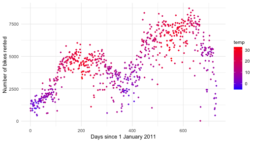


``` r
# Define the features and the response variable
x_var <- c("trend", "cosyear", "sinyear", "temp", "atemp", "windspeed", "hum")
y_var <- "cnt"

# NOTE: To avoid RNG reproducibility issues across different systems, we
# load the training-test split from a file. 80% training and 20% test
train_index <- readRDS("../inst/extdata/train_index.rds")

# Training data
x_train <- as.matrix(bike[train_index, x_var])
y_train_nc <- as.matrix(bike[train_index, y_var]) # not centered
y_train <- y_train_nc - mean(y_train_nc)

# Plot pairs plot
GGally::ggpairs(x_train)
```

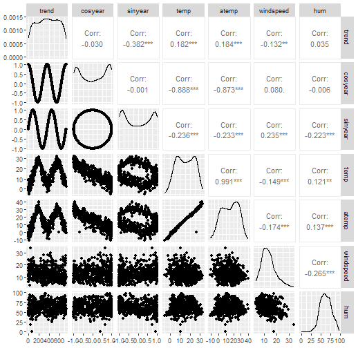


``` r
# Test/explicand data
x_explain <- as.matrix(bike[-train_index, x_var])
y_explain_nc <- as.matrix(bike[-train_index, y_var]) # not centered
y_explain <- y_explain_nc - mean(y_train_nc)

# Get 6 explicands to plot the Shapley values of with a wide spread in their predicted outcome
n_index_x_explain <- 6
index_x_explain <- order(y_explain)[seq(1, length(y_explain), length.out = n_index_x_explain)]
y_explain[index_x_explain]
#> [1] -3900.03 -1872.03  -377.03   411.97  1690.97  3889.97

# Fit an XGBoost model to the training data
model <- xgboost::xgboost(
  data = x_train,
  label = y_train,
  nround = 100,
  verbose = FALSE
)

# Save the phi0
phi0 <- mean(y_train)

# Look at the root mean squared error
sqrt(mean((predict(model, x_explain) - y_explain)^2))
#> [1] 798.71
ggplot(
  data.table("response" = y_explain[, 1], "predicted_response" = predict(model, x_explain)),
  aes(response, predicted_response)
) +
  geom_point()
```

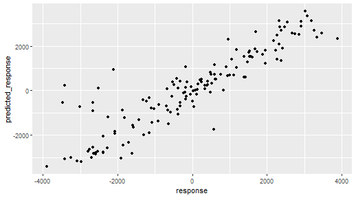


We are going to use the `causal_ordering` and `confounding` illustrated in the figures above.
For `causal_ordering`, we can either provide the index of feature or the feature names.
Thus, the following two versions of `causal_ordering` will produce equivalent results.
Furthermore, we assume that we have confounding for the second component (i.e., the season has
an effect on the weather) and no confounding for the third component (i.e., we do not
how to model the intricate relations between the weather features).


``` r
causal_ordering <- list(1, c(2, 3), c(4:7))
causal_ordering <- list("trend", c("cosyear", "sinyear"), c("temp", "atemp", "windspeed", "hum"))
confounding <- c(FALSE, TRUE, FALSE)
```


To make the rest of the vignette easier to follow, we create some helper
functions that plot and summarize the results of the explanation methods.
This code block is optional to understand and can be skipped.


``` r
# Extract the MSEv criterion scores and elapsed times
print_MSEv_scores_and_time <- function(explanation_list) {
  res <- as.data.frame(t(sapply(
    explanation_list,
    function(explanation) {
      round(c(
        explanation$MSEv$MSEv$MSEv,
        explanation$MSEv$MSEv$MSEv_sd,
        difftime(explanation$timing$end_time, explanation$timing$init_time, units = "secs")
      ), 2)
    }
  )))
  colnames(res) <- c("MSEv", "MSEv_sd", "Time (secs)")
  return(res)
}

# Print the full time information
print_time <- function(explanation_list) {
  t(sapply(explanation_list, function(explanation) explanation$timing$total_time_secs))
}

# Make beeswarm plots
plot_beeswarms <- function(explanation_list, title = "", ...) {
  # Make the beeswarm plots
  grobs <- lapply(seq(length(explanation_list)), function(explanation_idx) {
    gg <- plot(explanation_list[[explanation_idx]], plot_type = "beeswarm", ...) +
      ggplot2::ggtitle(tools::toTitleCase(gsub("_", " ", names(explanation_list)[[explanation_idx]])))

    # Flip the order such that the features comes in the right order
    gg <- gg +
      ggplot2::scale_x_discrete(limits = rev(levels(gg$data$variable)[levels(gg$data$variable) != "none"]))
  })

  # Get the limits
  ylim <- sapply(grobs, function(grob) ggplot2::ggplot_build(grob)$layout$panel_scales_y[[1]]$range$range)
  ylim <- c(min(ylim), max(ylim))

  # Update the limits
  grobs <- suppressMessages(lapply(grobs, function(grob) grob + ggplot2::coord_flip(ylim = ylim)))

  # Make the combined plot
  gridExtra::grid.arrange(
    grobs = grobs, ncol = 1,
    top = grid::textGrob(title, gp = grid::gpar(fontsize = 18, font = 8))
  )
}
```


## Symmetric conditional Shapley values (default)
We start by demonstrating how to compute symmetric conditional Shapley values.
This is the default version in `shapr` and there is no need to specify the arguments below.
However, we have specified them for the sake of clarity.
We use the `gaussian`, `ctree`, and `regression_separate`(`xgboost` with default hyperparameters)
approaches, but any other approach can also be used.


``` r
# list to store the results
explanation_sym_con <- list()

explanation_sym_con[["gaussian"]] <- explain(
  model = model,
  x_train = x_train,
  x_explain = x_explain,
  approach = "gaussian",
  phi0 = phi0,
  seed = 1,
  n_MC_samples = 1000,
  asymmetric = FALSE, # Default value (TRUE will give the same since `causal_ordering = NULL`)
  causal_ordering = NULL, # Default value
  confounding = NULL # Default value
)
#> 
#> ── Starting `shapr::explain()` at 2025-04-28 10:57:47 ──────────────────────────────────
#> ℹ Feature classes extracted from the model contains `NA`.
#>   Assuming feature classes from the data are correct.
#> ℹ `max_n_coalitions` is `NULL` or larger than or `2^n_features = 128`, and is therefore
#>   set to `2^n_features = 128`.
#> 
#> 
#> ── Explanation overview ──
#> 
#> 
#> 
#> • Model class: <xgb.Booster>
#> 
#> • Approach: gaussian
#> 
#> • Iterative estimation: TRUE
#> 
#> • Number of feature-wise Shapley values: 7
#> 
#> • Number of observations to explain: 144
#> 
#> • Computations (temporary) saved at: '/tmp/RtmplHDIbs/shapr_obj_3d3af2403846a.rds'
#> 
#> 
#> 
#> ── iterative computation started ──
#> 
#> 
#> 
#> ── Iteration 1 ─────────────────────────────────────────────────────────────────────────
#> 
#> ℹ Using 14 of 128 coalitions, 14 new. 
#> 
#> 
#> 
#> ── Iteration 2 ─────────────────────────────────────────────────────────────────────────
#> 
#> ℹ Using 26 of 128 coalitions, 12 new. 
#> 
#> 
#> 
#> ── Iteration 3 ─────────────────────────────────────────────────────────────────────────
#> 
#> ℹ Using 44 of 128 coalitions, 18 new.

explanation_sym_con[["ctree"]] <- explain(
  model = model,
  x_train = x_train,
  x_explain = x_explain,
  approach = "ctree",
  phi0 = phi0,
  seed = 1,
  n_MC_samples = 1000,
  asymmetric = FALSE, # Default value (TRUE will give the same since `causal_ordering = NULL`)
  causal_ordering = NULL, # Default value
  confounding = NULL # Default value
)
#> 
#> ── Starting `shapr::explain()` at 2025-04-28 10:57:54 ──────────────────────────────────
#> ℹ Feature classes extracted from the model contains `NA`.
#>   Assuming feature classes from the data are correct.
#> ℹ `max_n_coalitions` is `NULL` or larger than or `2^n_features = 128`, and is therefore
#>   set to `2^n_features = 128`.
#> ── Explanation overview ──
#> 
#> • Model class: <xgb.Booster>
#> • Approach: ctree
#> • Iterative estimation: TRUE
#> • Number of feature-wise Shapley values: 7
#> • Number of observations to explain: 144
#> • Computations (temporary) saved at: '/tmp/RtmplHDIbs/shapr_obj_3d3af2bcb11b7.rds'
#> 
#> ── iterative computation started ──
#> 
#> ── Iteration 1 ─────────────────────────────────────────────────────────────────────────
#> ℹ Using 14 of 128 coalitions, 14 new. 
#> 
#> ── Iteration 2 ─────────────────────────────────────────────────────────────────────────
#> ℹ Using 26 of 128 coalitions, 12 new. 
#> 
#> ── Iteration 3 ─────────────────────────────────────────────────────────────────────────
#> ℹ Using 46 of 128 coalitions, 20 new.

explanation_sym_con[["xgboost"]] <- explain(
  model = model,
  x_train = x_train,
  x_explain = x_explain,
  phi0 = phi0,
  seed = 1,
  approach = "regression_separate",
  regression.model = parsnip::boost_tree(engine = "xgboost", mode = "regression"),
  asymmetric = FALSE, # Default value (TRUE will give the same as `causal_ordering = NULL`)
  causal_ordering = NULL, # Default value
  confounding = NULL # Default value
)
#> 
#> ── Starting `shapr::explain()` at 2025-04-28 10:58:28 ──────────────────────────────────
#> ℹ Feature classes extracted from the model contains `NA`.
#>   Assuming feature classes from the data are correct.
#> ℹ `max_n_coalitions` is `NULL` or larger than or `2^n_features = 128`, and is therefore
#>   set to `2^n_features = 128`.
#> ── Explanation overview ──
#> 
#> • Model class: <xgb.Booster>
#> • Approach: regression_separate
#> • Iterative estimation: TRUE
#> • Number of feature-wise Shapley values: 7
#> • Number of observations to explain: 144
#> • Computations (temporary) saved at: '/tmp/RtmplHDIbs/shapr_obj_3d3af31f82121.rds'
#> 
#> ── iterative computation started ──
#> 
#> ── Iteration 1 ─────────────────────────────────────────────────────────────────────────
#> ℹ Using 14 of 128 coalitions, 14 new. 
#> 
#> ── Iteration 2 ─────────────────────────────────────────────────────────────────────────
#> ℹ Using 26 of 128 coalitions, 12 new. 
#> 
#> ── Iteration 3 ─────────────────────────────────────────────────────────────────────────
#> ℹ Using 46 of 128 coalitions, 20 new. 
#> 
#> ── Iteration 4 ─────────────────────────────────────────────────────────────────────────
#> ℹ Using 48 of 128 coalitions, 2 new.
```
We can then look at the $\operatorname{MSE}_v$ evaluation scores to compare the approaches.
All approaches are comparable, but `xgboost` is clearly the fastest approach.


``` r
print_MSEv_scores_and_time(explanation_sym_con)
#>             MSEv MSEv_sd Time (secs)
#> gaussian 1123200   80740        6.60
#> ctree    1087698   70158       33.84
#> xgboost  1150805   66956        7.35
```

We can then plot the Shapley values for the six explicands chosen above.


``` r
plot_SV_several_approaches(explanation_sym_con, index_x_explain) +
  theme(legend.position = "bottom")
```

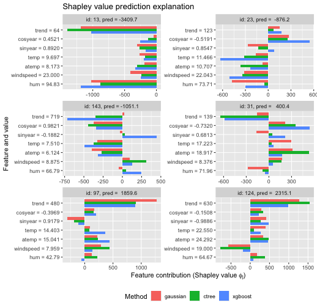


We can also make beeswarm plots of the Shapley values to look at the structure
of the Shapley values for all explicands. The figures are quite similar, but
with minor differences. E.g., the `gaussian` approach produces almost no
Shapley values around $500$ for the `trend` feature.


``` r
plot_beeswarms(explanation_sym_con, title = "Symmetric conditional Shapley values")
```

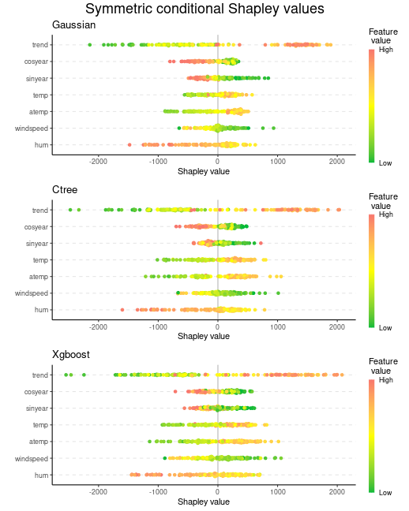


## Asymmetric conditional Shapley values
Then we look at the asymmetric conditional Shapley values. To obtain these
types of Shapley values, we have to specify that `asymmetric = TRUE` and a
`causal_ordering`. We use `causal_ordering = list(1, c(2, 3), c(4:7))`.


``` r
explanation_asym_con <- list()

explanation_asym_con[["gaussian"]] <- explain(
  model = model,
  x_train = x_train,
  x_explain = x_explain,
  phi0 = phi0,
  seed = 1,
  n_MC_samples = 1000,
  approach = "gaussian",
  asymmetric = TRUE,
  causal_ordering = causal_ordering,
  confounding = NULL # Default value
)
#> 
#> ── Starting `shapr::explain()` at 2025-04-28 10:58:37 ──────────────────────────────────
#> ℹ Feature classes extracted from the model contains `NA`.
#>   Assuming feature classes from the data are correct.
#> ℹ `max_n_coalitions` is `NULL` or larger than or number of coalitions respecting the
#>   causal ordering 20, and is therefore set to 20.
#> 
#> 
#> ── Explanation overview ──
#> 
#> 
#> 
#> • Model class: <xgb.Booster>
#> 
#> • Approach: gaussian
#> 
#> • Iterative estimation: TRUE
#> 
#> • Number of feature-wise Shapley values: 7
#> 
#> • Number of observations to explain: 144
#> 
#> • Number of asymmetric coalitions: 20
#> 
#> • Causal ordering: {trend}, {cosyear, sinyear}, {temp, atemp, windspeed, hum}
#> 
#> • Computations (temporary) saved at: '/tmp/RtmplHDIbs/shapr_obj_3d3af55c9f360.rds'
#> 
#> 
#> 
#> ── iterative computation started ──
#> 
#> 
#> 
#> ── Iteration 1 ─────────────────────────────────────────────────────────────────────────
#> 
#> ℹ Using 13 of 20 coalitions, 13 new. 
#> 
#> 
#> 
#> ── Iteration 2 ─────────────────────────────────────────────────────────────────────────
#> 
#> ℹ Using 14 of 20 coalitions, 1 new. 
#> 
#> 
#> 
#> ── Iteration 3 ─────────────────────────────────────────────────────────────────────────
#> 
#> ℹ Using 15 of 20 coalitions, 1 new. 
#> 
#> 
#> 
#> ── Iteration 4 ─────────────────────────────────────────────────────────────────────────
#> 
#> ℹ Using 16 of 20 coalitions, 1 new.

explanation_asym_con[["gaussian_non_iterative"]] <- explain(
  model = model,
  x_train = x_train,
  x_explain = x_explain,
  phi0 = phi0,
  seed = 1,
  n_MC_samples = 1000,
  approach = "gaussian",
  asymmetric = TRUE,
  causal_ordering = causal_ordering,
  confounding = NULL, # Default value
  iterative = FALSE
)
#> 
#> ── Starting `shapr::explain()` at 2025-04-28 10:58:42 ──────────────────────────────────
#> ℹ Feature classes extracted from the model contains `NA`.
#>   Assuming feature classes from the data are correct.
#> ℹ `max_n_coalitions` is `NULL` or larger than or number of coalitions respecting the
#>   causal ordering 20, and is therefore set to 20.
#> ── Explanation overview ──
#> 
#> • Model class: <xgb.Booster>
#> • Approach: gaussian
#> • Iterative estimation: FALSE
#> • Number of feature-wise Shapley values: 7
#> • Number of observations to explain: 144
#> • Number of asymmetric coalitions: 20
#> • Causal ordering: {trend}, {cosyear, sinyear}, {temp, atemp, windspeed, hum}
#> • Computations (temporary) saved at: '/tmp/RtmplHDIbs/shapr_obj_3d3af3caa1b09.rds'
#> 
#> ── Main computation started ──
#> 
#> ℹ Using 20 of 20 coalitions.

explanation_asym_con[["ctree"]] <- explain(
  model = model,
  x_train = x_train,
  x_explain = x_explain,
  phi0 = phi0,
  seed = 1,
  n_MC_samples = 1000,
  approach = "ctree",
  asymmetric = TRUE,
  causal_ordering = causal_ordering,
  confounding = NULL # Default value
)
#> 
#> ── Starting `shapr::explain()` at 2025-04-28 10:58:44 ──────────────────────────────────
#> ℹ Feature classes extracted from the model contains `NA`.
#>   Assuming feature classes from the data are correct.
#> ℹ `max_n_coalitions` is `NULL` or larger than or number of coalitions respecting the
#>   causal ordering 20, and is therefore set to 20.
#> ── Explanation overview ──
#> 
#> • Model class: <xgb.Booster>
#> • Approach: ctree
#> • Iterative estimation: TRUE
#> • Number of feature-wise Shapley values: 7
#> • Number of observations to explain: 144
#> • Number of asymmetric coalitions: 20
#> • Causal ordering: {trend}, {cosyear, sinyear}, {temp, atemp, windspeed, hum}
#> • Computations (temporary) saved at: '/tmp/RtmplHDIbs/shapr_obj_3d3af45fbb7d9.rds'
#> 
#> ── iterative computation started ──
#> 
#> ── Iteration 1 ─────────────────────────────────────────────────────────────────────────
#> ℹ Using 13 of 20 coalitions, 13 new.

explanation_asym_con[["xgboost"]] <- explain(
  model = model,
  x_train = x_train,
  x_explain = x_explain,
  phi0 = phi0,
  seed = 1,
  approach = "regression_separate",
  regression.model = parsnip::boost_tree(engine = "xgboost", mode = "regression"),
  asymmetric = TRUE,
  causal_ordering = causal_ordering,
  confounding = NULL # Default value
)
#> 
#> ── Starting `shapr::explain()` at 2025-04-28 10:58:53 ──────────────────────────────────
#> ℹ Feature classes extracted from the model contains `NA`.
#>   Assuming feature classes from the data are correct.
#> ℹ `max_n_coalitions` is `NULL` or larger than or number of coalitions respecting the
#>   causal ordering 20, and is therefore set to 20.
#> ── Explanation overview ──
#> 
#> • Model class: <xgb.Booster>
#> • Approach: regression_separate
#> • Iterative estimation: TRUE
#> • Number of feature-wise Shapley values: 7
#> • Number of observations to explain: 144
#> • Number of asymmetric coalitions: 20
#> • Causal ordering: {trend}, {cosyear, sinyear}, {temp, atemp, windspeed, hum}
#> • Computations (temporary) saved at: '/tmp/RtmplHDIbs/shapr_obj_3d3af54d749bf.rds'
#> 
#> ── iterative computation started ──
#> 
#> ── Iteration 1 ─────────────────────────────────────────────────────────────────────────
#> ℹ Using 13 of 20 coalitions, 13 new.
```

The asymmetric conditional Shapley value framework is faster as we only
consider $20$ coalitions (including empty and grand coalition)
instead of all $128$ coalitions (see code below).


``` r
print_MSEv_scores_and_time(explanation_asym_con)
#>                          MSEv MSEv_sd Time (secs)
#> gaussian               318652   36279        4.85
#> gaussian_non_iterative 306458   35412        1.87
#> ctree                  260332   29391        8.78
#> xgboost                307562   39363        1.76

# Look at the number of coalitions considered. Decreased from 128 to 20.
explanation_sym_con$gaussian$internal$parameters$max_n_coalitions
#> [1] 128
explanation_asym_con$gaussian$internal$parameters$max_n_coalitions
#> [1] 20

# Here we can see the 20 coalitions that respects the causal ordering
explanation_asym_con$gaussian$internal$objects$dt_valid_causal_coalitions[["coalitions"]]
#> [[1]]
#> integer(0)
#> 
#> [[2]]
#> [1] 1
#> 
#> [[3]]
#> [1] 1 2
#> 
#> [[4]]
#> [1] 1 3
#> 
#> [[5]]
#> [1] 1 2 3
#> 
#> [[6]]
#> [1] 1 2 3 4
#> 
#> [[7]]
#> [1] 1 2 3 5
#> 
#> [[8]]
#> [1] 1 2 3 6
#> 
#> [[9]]
#> [1] 1 2 3 7
#> 
#> [[10]]
#> [1] 1 2 3 4 5
#> 
#> [[11]]
#> [1] 1 2 3 4 6
#> 
#> [[12]]
#> [1] 1 2 3 4 7
#> 
#> [[13]]
#> [1] 1 2 3 5 6
#> 
#> [[14]]
#> [1] 1 2 3 5 7
#> 
#> [[15]]
#> [1] 1 2 3 6 7
#> 
#> [[16]]
#> [1] 1 2 3 4 5 6
#> 
#> [[17]]
#> [1] 1 2 3 4 5 7
#> 
#> [[18]]
#> [1] 1 2 3 4 6 7
#> 
#> [[19]]
#> [1] 1 2 3 5 6 7
#> 
#> [[20]]
#> [1] 1 2 3 4 5 6 7
```

We can then look at the beeswarm plots of the asymmetric conditional Shapley value.
The `ctree` and `xgboost` approaches produce similar figures, while the `gaussian`
approach both shrinks and groups the Shapley values for the `trend` feature, while
it produces more negative values for the `cosyear` feature.

When going from symmetric to asymmetric Shapley values, we see that many of the features'
Shapley values are now shrunken closer to zero, especially `temp` and `atemp`.


``` r
plot_beeswarms(explanation_asym_con, title = "Asymmetric conditional Shapley values")
```

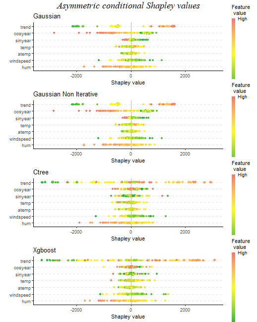


We can also compare the obtained symmetric and asymmetric conditional Shapley values
for the 6 explicands. We often see that the asymmetric version gives larger Shapley
values to the distal/root causes, i.e., `trend` and `cosyear`, than the symmetric
version. This is in line with Section 3.2 in @frye2020asymmetric.

``` r
# Order the symmetric and asymmetric conditional explanations into a joint list
explanation_sym_con_tmp <- copy(explanation_sym_con)
names(explanation_sym_con_tmp) <- paste0(names(explanation_sym_con_tmp), "_sym")
explanation_asym_con_tmp <- copy(explanation_asym_con)
names(explanation_asym_con_tmp) <- paste0(names(explanation_asym_con_tmp), "_asym")
explanation_asym_sym_con <- c(explanation_sym_con_tmp, explanation_asym_con_tmp)[c(1, 4, 2, 5, 3, 6)]
plot_SV_several_approaches(explanation_asym_sym_con, index_x_explain, brewer_palette = "Paired") +
  theme(legend.position = "bottom")
```

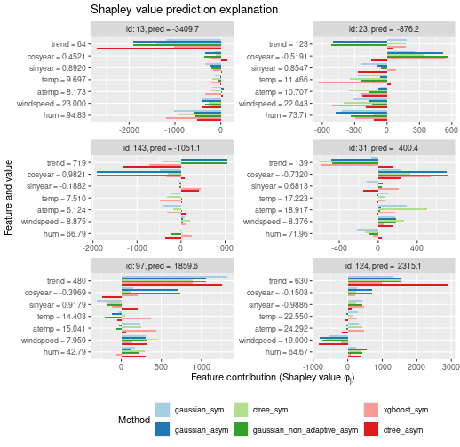


## Symmetric marginal Shapley values
For marginal Shapley values, we can only consider the symmetric version as we must set
`causal_ordering = list(1:7)` (or `NULL`) and `confounding = TRUE`. Setting `asymmetric = TRUE`
will have no effect, as the causal ordering consists of only a single component containing all features,
i.e., all coalitions respect the causal ordering. As stated above, `shapr` generates the
marginal Monte Carlos samples from the Gaussian marginals if `approach = "gaussian"`,
while for all other Monte Carlo approaches the marginals are estimated from the training data, i.e.,
assuming feature independence. Thus, it does not matter if we set `approach = "independence"`
or any other of the Monte Carlo-based approaches. We use `approach = "independence"` for clarity.
Furthermore, we also obtain marginal Shapley values by using the
conditional Shapley value framework with the `independence` approach. However, note that there will
be a minuscule difference in the produced Shapley values due to different sampling setups/orders.


``` r
explanation_sym_marg <- list()

# Here we sample from the estimated Gaussian marginals
explanation_sym_marg[["gaussian"]] <- explain(
  model = model,
  x_train = x_train,
  x_explain = x_explain,
  phi0 = phi0,
  seed = 1,
  n_MC_samples = 1000,
  approach = "gaussian",
  asymmetric = FALSE,
  causal_ordering = list(1:7),
  confounding = TRUE
)
#> 
#> ── Starting `shapr::explain()` at 2025-04-28 10:58:57 ──────────────────────────────────
#> ℹ Feature classes extracted from the model contains `NA`.
#>   Assuming feature classes from the data are correct.
#> ℹ `max_n_coalitions` is `NULL` or larger than or `2^n_features = 128`, and is therefore
#>   set to `2^n_features = 128`.
#> 
#> 
#> ── Explanation overview ──
#> 
#> 
#> 
#> • Model class: <xgb.Booster>
#> 
#> • Approach: gaussian
#> 
#> • Iterative estimation: TRUE
#> 
#> • Number of feature-wise Shapley values: 7
#> 
#> • Number of observations to explain: 144
#> 
#> • Causal ordering: {trend, cosyear, sinyear, temp, atemp, windspeed, hum}
#> 
#> • Components with confounding: {trend, cosyear, sinyear, temp, atemp, windspeed, hum}
#> 
#> • Computations (temporary) saved at: '/tmp/RtmplHDIbs/shapr_obj_3d3af7129073.rds'
#> 
#> 
#> 
#> ── iterative computation started ──
#> 
#> 
#> 
#> ── Iteration 1 ─────────────────────────────────────────────────────────────────────────
#> 
#> ℹ Using 14 of 128 coalitions, 14 new. 
#> 
#> 
#> 
#> ── Iteration 2 ─────────────────────────────────────────────────────────────────────────
#> 
#> ℹ Using 26 of 128 coalitions, 12 new.

# Here we sample from the marginals of the training data
explanation_sym_marg[["independence_marg"]] <- explain(
  model = model,
  x_train = x_train,
  x_explain = x_explain,
  phi0 = phi0,
  seed = 1,
  n_MC_samples = 1000,
  approach = "independence",
  asymmetric = FALSE,
  causal_ordering = list(1:7),
  confounding = TRUE
)
#> 
#> ── Starting `shapr::explain()` at 2025-04-28 10:59:03 ──────────────────────────────────
#> ℹ Feature classes extracted from the model contains `NA`.
#>   Assuming feature classes from the data are correct.
#> ℹ `max_n_coalitions` is `NULL` or larger than or `2^n_features = 128`, and is therefore
#>   set to `2^n_features = 128`.
#> ── Explanation overview ──
#> 
#> • Model class: <xgb.Booster>
#> • Approach: independence
#> • Iterative estimation: TRUE
#> • Number of feature-wise Shapley values: 7
#> • Number of observations to explain: 144
#> • Causal ordering: {trend, cosyear, sinyear, temp, atemp, windspeed, hum}
#> • Components with confounding: {trend, cosyear, sinyear, temp, atemp, windspeed, hum}
#> • Computations (temporary) saved at: '/tmp/RtmplHDIbs/shapr_obj_3d3af331e45fd.rds'
#> 
#> ── iterative computation started ──
#> 
#> ── Iteration 1 ─────────────────────────────────────────────────────────────────────────
#> ℹ Using 14 of 128 coalitions, 14 new. 
#> 
#> ── Iteration 2 ─────────────────────────────────────────────────────────────────────────
#> ℹ Using 26 of 128 coalitions, 12 new.

# Here we use the conditional Shapley value framework with the `independence` approach
explanation_sym_marg[["independence_con"]] <- explain(
  model = model,
  x_train = x_train,
  x_explain = x_explain,
  phi0 = phi0,
  seed = 1,
  n_MC_samples = 1000,
  approach = "independence"
)
#> 
#> ── Starting `shapr::explain()` at 2025-04-28 10:59:18 ──────────────────────────────────
#> ℹ Feature classes extracted from the model contains `NA`.
#>   Assuming feature classes from the data are correct.
#> ℹ `max_n_coalitions` is `NULL` or larger than or `2^n_features = 128`, and is therefore
#>   set to `2^n_features = 128`.
#> ── Explanation overview ──
#> 
#> • Model class: <xgb.Booster>
#> • Approach: independence
#> • Iterative estimation: TRUE
#> • Number of feature-wise Shapley values: 7
#> • Number of observations to explain: 144
#> • Computations (temporary) saved at: '/tmp/RtmplHDIbs/shapr_obj_3d3af5db6df97.rds'
#> 
#> ── iterative computation started ──
#> 
#> ── Iteration 1 ─────────────────────────────────────────────────────────────────────────
#> ℹ Using 14 of 128 coalitions, 14 new. 
#> 
#> ── Iteration 2 ─────────────────────────────────────────────────────────────────────────
#> ℹ Using 26 of 128 coalitions, 12 new.
```


We can look the beeswarm plots


``` r
print_MSEv_scores_and_time(explanation_sym_marg)
#>                      MSEv MSEv_sd Time (secs)
#> gaussian          1380661  111239        6.42
#> independence_marg 1379855  110801       14.85
#> independence_con  1379646  110728        7.59

plot_beeswarms(explanation_sym_marg, title = "Symmetric marginal Shapley values")
```

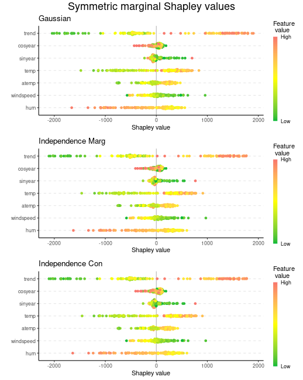


## Causal Shapley values
To compute (symmetric/asymmetric) causal Shapley values, we have to provide
the `causal_ordering` and `confounding` objects. We set them to be
`causal_ordering = list(1, 2:3, 4:7)` and `confounding = c(FALSE, TRUE, FALSE)`,
as explained above.

The causal framework takes longer than the other frameworks, as generating the
the Monte Carlo samples often consists of a chain of sampling steps. For example,
for $\mathcal{S} = {2}$, we must generate $X_1,X_3,X_4,X_5,X_6,X_7 \mid X_2$.
However, we cannot do this directly due to the `causal_ordering` and `confounding`
specified above. To generate the Monte Carlo samples, we have to follow a chain of
sampling steps. More precisely, we first need to generate $X_1$ from the marginal,
then $X_3 \mid X_1$, and finally $X_4,X_5,X_6,X_7 \mid X_1,X_2,X_3$. The latter two
steps are done by using the provided `approach` to model the conditional distributions.
The `internal$objects$S_causal_steps_strings` object contains the sampling steps
needed for the different feature combinations/coalitions $\mathcal{S}$.

For causal Shapley values, only the Monte Carlo-based approaches are applicable.

### Symmetric

``` r
explanation_sym_cau <- list()

explanation_sym_cau[["gaussian"]] <- explain(
  model = model,
  x_train = x_train,
  x_explain = x_explain,
  phi0 = phi0,
  seed = 1,
  n_MC_samples = 1000,
  approach = "gaussian",
  asymmetric = FALSE,
  causal_ordering = list(1, 2:3, 4:7),
  confounding = c(FALSE, TRUE, FALSE),
  iterative = FALSE, # Set to FALSE to get a single iteration to illustrate sampling steps below
  exact = TRUE
)
#> 
#> ── Starting `shapr::explain()` at 2025-04-28 10:59:27 ──────────────────────────────────
#> ℹ Feature classes extracted from the model contains `NA`.
#>   Assuming feature classes from the data are correct.
#> ℹ `max_n_coalitions` is `NULL` or larger than or `2^n_features = 128`, and is therefore
#>   set to `2^n_features = 128`.
#> 
#> 
#> ── Explanation overview ──
#> 
#> 
#> 
#> • Model class: <xgb.Booster>
#> 
#> • Approach: gaussian
#> 
#> • Iterative estimation: FALSE
#> 
#> • Number of feature-wise Shapley values: 7
#> 
#> • Number of observations to explain: 144
#> 
#> • Causal ordering: {trend}, {cosyear, sinyear}, {temp, atemp, windspeed, hum}
#> 
#> • Components with confounding: {cosyear, sinyear}
#> 
#> • Computations (temporary) saved at: '/tmp/RtmplHDIbs/shapr_obj_3d3af2dcf2d1f.rds'
#> 
#> 
#> 
#> ── Main computation started ──
#> 
#> 
#> 
#> ℹ Using 128 of 128 coalitions.

# Look at the sampling steps for the third coalition (S = {2})
explanation_sym_cau$gaussian$internal$iter_list[[1]]$S_causal_steps_strings$id_coalition_3
#> [1] "1|"            "3|1"           "4,5,6,7|1,2,3"

# Use the copula approach
explanation_sym_cau[["copula"]] <- explain(
  model = model,
  x_train = x_train,
  x_explain = x_explain,
  phi0 = phi0,
  seed = 1,
  n_MC_samples = 1000,
  approach = "copula",
  asymmetric = FALSE,
  causal_ordering = list(1, 2:3, 4:7),
  confounding = c(FALSE, TRUE, FALSE)
)
#> 
#> ── Starting `shapr::explain()` at 2025-04-28 11:00:00 ──────────────────────────────────
#> ℹ Feature classes extracted from the model contains `NA`.
#>   Assuming feature classes from the data are correct.
#> ℹ `max_n_coalitions` is `NULL` or larger than or `2^n_features = 128`, and is therefore
#>   set to `2^n_features = 128`.
#> ── Explanation overview ──
#> 
#> • Model class: <xgb.Booster>
#> • Approach: copula
#> • Iterative estimation: TRUE
#> • Number of feature-wise Shapley values: 7
#> • Number of observations to explain: 144
#> • Causal ordering: {trend}, {cosyear, sinyear}, {temp, atemp, windspeed, hum}
#> • Components with confounding: {cosyear, sinyear}
#> • Computations (temporary) saved at: '/tmp/RtmplHDIbs/shapr_obj_3d3af17b7f619.rds'
#> 
#> ── iterative computation started ──
#> 
#> ── Iteration 1 ─────────────────────────────────────────────────────────────────────────
#> ℹ Using 14 of 128 coalitions, 14 new. 
#> 
#> ── Iteration 2 ─────────────────────────────────────────────────────────────────────────
#> ℹ Using 26 of 128 coalitions, 12 new. 
#> 
#> ── Iteration 3 ─────────────────────────────────────────────────────────────────────────
#> ℹ Using 30 of 128 coalitions, 4 new.
```


``` r
print_MSEv_scores_and_time(explanation_sym_cau)
#>             MSEv MSEv_sd Time (secs)
#> gaussian 1112304   85462       32.68
#> copula   1162757   90975       16.99
plot_beeswarms(explanation_sym_cau, title = "Symmetric causal Shapley values")
```

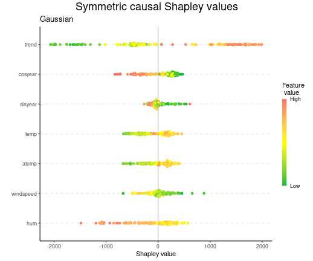


### Asymmetric
We now turn to asymmetric causal Shapley values. That is, we only use the coalitions
that respects the causal ordering. Thus, the computations are faster as the number of
coalitions are reduced.


``` r
explanation_asym_cau <- list()

explanation_asym_cau[["gaussian"]] <- explain(
  model = model,
  x_train = x_train,
  x_explain = x_explain,
  phi0 = phi0,
  seed = 1,
  n_MC_samples = 1000,
  approach = "gaussian",
  asymmetric = TRUE,
  causal_ordering = list(1, 2:3, 4:7),
  confounding = c(FALSE, TRUE, FALSE)
)
#> 
#> ── Starting `shapr::explain()` at 2025-04-28 11:00:17 ──────────────────────────────────
#> ℹ Feature classes extracted from the model contains `NA`.
#>   Assuming feature classes from the data are correct.
#> ℹ `max_n_coalitions` is `NULL` or larger than or number of coalitions respecting the
#>   causal ordering 20, and is therefore set to 20.
#> 
#> 
#> ── Explanation overview ──
#> 
#> 
#> 
#> • Model class: <xgb.Booster>
#> 
#> • Approach: gaussian
#> 
#> • Iterative estimation: TRUE
#> 
#> • Number of feature-wise Shapley values: 7
#> 
#> • Number of observations to explain: 144
#> 
#> • Number of asymmetric coalitions: 20
#> 
#> • Causal ordering: {trend}, {cosyear, sinyear}, {temp, atemp, windspeed, hum}
#> 
#> • Components with confounding: {cosyear, sinyear}
#> 
#> • Computations (temporary) saved at: '/tmp/RtmplHDIbs/shapr_obj_3d3af4b8b1e88.rds'
#> 
#> 
#> 
#> ── iterative computation started ──
#> 
#> 
#> 
#> ── Iteration 1 ─────────────────────────────────────────────────────────────────────────
#> 
#> ℹ Using 13 of 20 coalitions, 13 new. 
#> 
#> 
#> 
#> ── Iteration 2 ─────────────────────────────────────────────────────────────────────────
#> 
#> ℹ Using 14 of 20 coalitions, 1 new. 
#> 
#> 
#> 
#> ── Iteration 3 ─────────────────────────────────────────────────────────────────────────
#> 
#> ℹ Using 16 of 20 coalitions, 2 new.

# Use the copula approach
explanation_asym_cau[["copula"]] <- explain(
  model = model,
  x_train = x_train,
  x_explain = x_explain,
  phi0 = phi0,
  seed = 1,
  n_MC_samples = 1000,
  approach = "copula",
  asymmetric = TRUE,
  causal_ordering = list(1, 2:3, 4:7),
  confounding = c(FALSE, TRUE, FALSE)
)
#> 
#> ── Starting `shapr::explain()` at 2025-04-28 11:00:22 ──────────────────────────────────
#> ℹ Feature classes extracted from the model contains `NA`.
#>   Assuming feature classes from the data are correct.
#> ℹ `max_n_coalitions` is `NULL` or larger than or number of coalitions respecting the
#>   causal ordering 20, and is therefore set to 20.
#> ── Explanation overview ──
#> 
#> • Model class: <xgb.Booster>
#> • Approach: copula
#> • Iterative estimation: TRUE
#> • Number of feature-wise Shapley values: 7
#> • Number of observations to explain: 144
#> • Number of asymmetric coalitions: 20
#> • Causal ordering: {trend}, {cosyear, sinyear}, {temp, atemp, windspeed, hum}
#> • Components with confounding: {cosyear, sinyear}
#> • Computations (temporary) saved at: '/tmp/RtmplHDIbs/shapr_obj_3d3af38c0cfe3.rds'
#> 
#> ── iterative computation started ──
#> 
#> ── Iteration 1 ─────────────────────────────────────────────────────────────────────────
#> ℹ Using 13 of 20 coalitions, 13 new. 
#> 
#> ── Iteration 2 ─────────────────────────────────────────────────────────────────────────
#> ℹ Using 14 of 20 coalitions, 1 new. 
#> 
#> ── Iteration 3 ─────────────────────────────────────────────────────────────────────────
#> ℹ Using 17 of 20 coalitions, 3 new.

# Use the vaeac approach
explanation_asym_cau[["vaeac"]] <- explain(
  model = model,
  x_train = x_train,
  x_explain = x_explain,
  phi0 = phi0,
  seed = 1,
  n_MC_samples = 1000,
  approach = "vaeac",
  vaeac.epochs = 20,
  asymmetric = TRUE,
  causal_ordering = list(1, 2:3, 4:7),
  confounding = c(FALSE, TRUE, FALSE)
 )
#> 
#> ── Starting `shapr::explain()` at 2025-04-28 11:00:27 ──────────────────────────────────
#> ℹ Feature classes extracted from the model contains `NA`.
#>   Assuming feature classes from the data are correct.
#> ℹ `max_n_coalitions` is `NULL` or larger than or number of coalitions respecting the
#>   causal ordering 20, and is therefore set to 20.
#> ── Explanation overview ──
#> 
#> • Model class: <xgb.Booster>
#> • Approach: vaeac
#> • Iterative estimation: FALSE
#> • Number of feature-wise Shapley values: 7
#> • Number of observations to explain: 144
#> • Number of asymmetric coalitions: 20
#> • Causal ordering: {trend}, {cosyear, sinyear}, {temp, atemp, windspeed, hum}
#> • Components with confounding: {cosyear, sinyear}
#> • Computations (temporary) saved at: '/tmp/RtmplHDIbs/shapr_obj_3d3af3e9b3f0d.rds'
#> 
#> ── Main computation started ──
#> 
#> ℹ Using 20 of 20 coalitions.
```
We can look at the elapsed time.
See the [implementation details](#Implementation_details) for an explanation.

``` r
print_time(explanation_asym_cau)
#>      gaussian copula  vaeac
#> [1,]   4.4787 5.3353 462.15
```
We can then plot the beeswarm plots.


``` r
# Plot the beeswarm plots
plot_beeswarms(explanation_asym_cau, title = "Asymmetric causal Shapley values")
```

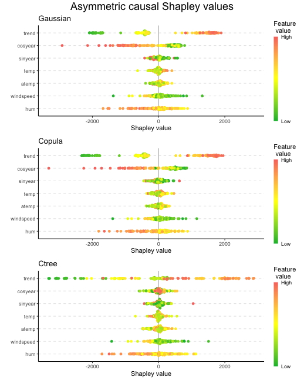


``` r
# Plot the Shapley values
plot_SV_several_approaches(explanation_asym_cau, index_x_explain) +
  theme(legend.position = "bottom")
```

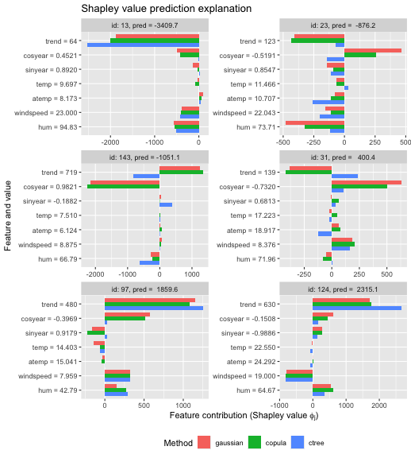

We can also use the other Monte Carlo-based approaches (`independence` and `empirical`), too.


## Comparing the frameworks
Here we plot the obtained Shapley values for the six explicand when using the
`gaussian` approach in the different Shapley value explanation frameworks, and
we see that the different frameworks provide different explanations.
The largest difference are between
whether we use the symmetric or asymmetric version. To summarize, asymmetric
conditional/causal Shapley values focus on the root cause, marginal Shapley
values on the more direct effect, and symmetric conditional/causal Shapley
consider both for a more natural explanation.


``` r
explanation_gaussian <- list(
  symmetric_marginal = explanation_sym_marg$gaussian,
  symmetric_conditional = explanation_sym_con$gaussian,
  symmetric_causal = explanation_sym_cau$gaussian,
  asymmetric_conditional = explanation_asym_con$gaussian,
  asymmetric_causal = explanation_asym_cau$gaussian
)

plot_SV_several_approaches(explanation_gaussian, index_x_explain) +
  theme(legend.position = "bottom") +
  guides(fill = guide_legend(nrow = 2)) +
  ggtitle("Shapley value prediction explanation (approach = 'gaussian')") +
  guides(color = guide_legend(title = "Framework"))
```

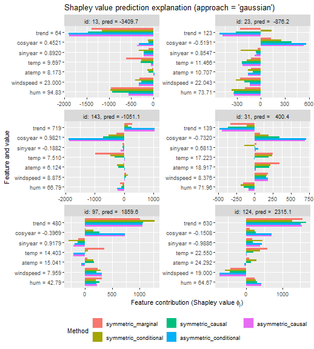

## Scatter plots: marginal vs. causal Shapley values
In this section, we produce scatter plots comparing the symmetric marginal
and symmetric causal Shapley values for the temperature feature `temp` and
the seasonal feature `cosyear` for all explicands. The plots shows that the
marginal Shapley values almost purely explain the predictions based on
temperature, while the causal Shapley values also give credit to season.
We can change the features and frameworks in the code below, but we chose
these values to replicate Figure 3 in @heskes2020causal.


``` r
# The color of the points
color <- "temp"

# The features we want to compare
feature_1 <- "cosyear"
feature_2 <- "temp"

# The Shapley value frameworks we want to compare
sv_framework_1 <- explanation_sym_marg[["gaussian"]]
sv_framework_1_str <- "Marginal SV"
sv_framework_2 <- explanation_sym_cau[["gaussian"]]
sv_framework_2_str <- "Causal SV"

# Set up the data.frame we are going to plot
sv_correlation_df <- data.frame(
  color = x_explain[, color],
  sv_framework_1_feature_1 = sv_framework_1$shapley_values_est[[feature_1]],
  sv_framework_2_feature_1 = sv_framework_2$shapley_values_est[[feature_1]],
  sv_framework_1_feature_2 = sv_framework_1$shapley_values_est[[feature_2]],
  sv_framework_2_feature_2 = sv_framework_2$shapley_values_est[[feature_2]]
)

# Make the plots
scatterplot_topleft <-
  ggplot(
    sv_correlation_df,
    aes(x = sv_framework_1_feature_2, y = sv_framework_1_feature_1, color = color)
  ) +
  geom_point(size = 1) +
  xlab(paste(sv_framework_1_str, feature_2)) +
  ylab(paste(sv_framework_1_str, feature_1)) +
  scale_x_continuous(limits = c(-1500, 1000), breaks = c(-1000, 0, 1000)) +
  scale_y_continuous(limits = c(-500, 500), breaks = c(-500, 0, 500)) +
  scale_color_gradient(low = "blue", high = "red") +
  theme_minimal() +
  theme(
    text = element_text(size = 12),
    axis.text.x = element_blank(),
    axis.text.y = element_text(size = 12),
    axis.ticks.x = element_blank(),
    axis.title.x = element_blank()
  )

scatterplot_topright <-
  ggplot(
    sv_correlation_df,
    aes(x = sv_framework_2_feature_1, y = sv_framework_1_feature_1, color = color)
  ) +
  geom_point(size = 1) +
  scale_color_gradient(low = "blue", high = "red") +
  xlab(paste(sv_framework_2_str, feature_1)) +
  ylab(paste(sv_framework_1_str, feature_1)) +
  scale_x_continuous(limits = c(-1500, 1000), breaks = c(-1000, 0, 1000)) +
  scale_y_continuous(limits = c(-500, 500), breaks = c(-500, 0, 500)) +
  theme_minimal() +
  theme(
    text = element_text(size = 12),
    axis.title.x = element_blank(),
    axis.title.y = element_blank(),
    axis.text.x = element_blank(),
    axis.ticks.x = element_blank(),
    axis.text.y = element_blank(),
    axis.ticks.y = element_blank()
  )

scatterplot_bottomleft <-
  ggplot(
    sv_correlation_df,
    aes(x = sv_framework_1_feature_2, y = sv_framework_2_feature_2, color = color)
  ) +
  geom_point(size = 1) +
  scale_color_gradient(low = "blue", high = "red") +
  xlab(paste(sv_framework_1_str, feature_2)) +
  ylab(paste(sv_framework_2_str, feature_2)) +
  scale_x_continuous(limits = c(-1500, 1000), breaks = c(-1000, 0, 1000)) +
  scale_y_continuous(limits = c(-1000, 1000), breaks = c(-500, 0, 500)) +
  theme_minimal() +
  theme(
    text = element_text(size = 12),
    axis.text.x = element_text(size = 12),
    axis.text.y = element_text(size = 12)
  )

scatterplot_bottomright <-
  ggplot(
    sv_correlation_df,
    aes(x = sv_framework_2_feature_1, y = sv_framework_2_feature_2, color = color)
  ) +
  geom_point(size = 1) +
  xlab(paste(sv_framework_2_str, feature_1)) +
  ylab(paste(sv_framework_2_str, feature_2)) +
  scale_x_continuous(limits = c(-1500, 1000), breaks = c(-1000, 0, 1000)) +
  scale_y_continuous(limits = c(-1000, 1000), breaks = c(-500, 0, 500)) +
  scale_color_gradient(low = "blue", high = "red") +
  theme_minimal() +
  theme(
    text = element_text(size = 12),
    axis.text.x = element_text(size = 12),
    axis.title.y = element_blank(),
    axis.text.y = element_blank(),
    axis.ticks.y = element_blank()
  )

# Plot of the trend of the data
bike_plot_new <- ggplot(bike, aes(x = trend, y = cnt, color = get(color))) +
  geom_point(size = 0.75) +
  scale_color_gradient(low = "blue", high = "red") +
  labs(color = color) +
  xlab("Days since 1 January 2011") +
  ylab("Number of bikes rented") +
  theme_minimal() +
  theme(legend.position = "right", legend.title = element_text(size = 10))

# Combine the plots
ggpubr::ggarrange(
  bike_plot_new,
  ggpubr::ggarrange(
    scatterplot_topleft,
    scatterplot_topright,
    scatterplot_bottomleft,
    scatterplot_bottomright,
    legend = "none"
  ),
  nrow = 2, heights = c(1, 2)
)
```

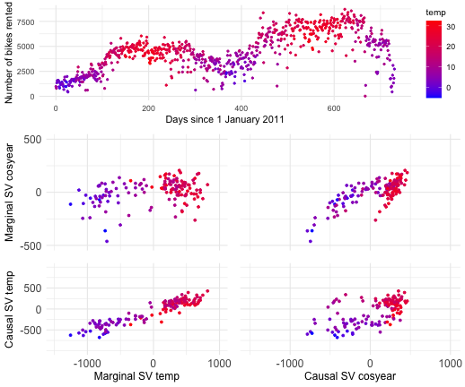

## Investigating two similar days

We investigate the difference between symmetric/asymmetric conditional,
symmetric/asymmetric causal, and marginal Shapley values  for two days:
October 10 and December 3, 2012. They have more or less the same
temperature of 13 and 13.27 degrees Celsius, and predicted bike counts
of 6117 and 6241, respectively. The figure below is an extension of
Figure 4 in @heskes2020causal, as they only included asymmetric
conditional, symmetric causal, and marginal Shapley values.

We plot the various Shapley values for the `cosyear` and `temp` features
below. We obtain the same results as @heskes2020causal obtained, namely,
that the marginal Shapley value explanation framework provides similar
explanation for both days. I.e., it only considers the direct effect of `temp`.
The asymmetric conditional and causal Shapley values are almost
indistinguishable and put the most weight on the ‘root’ cause `cosyear`.
@heskes2020causal states that the symmetric causal Shapley values provides
a sensible balance between the two extremes and gives credit to both season and temperature,
but still different explanation for the two days.

However, as we also include symmetric conditional Shapley values,
we see that they are extremely similar to symmetric causal Shapley values.
I.e., the conditional Shapley value explanation framework also provides
a sensible balance between marginal and asymmetric Shapley values.
To summarize:
as concluded by @heskes2020causal in their Figure 4, the
asymmetric conditional/causal Shapley values focus on the
root cause, marginal Shapley values on the more direct effect, and symmetric
conditional/causal Shapley consider both for a more natural explanation.


``` r
# Features of interest
features <- c("cosyear", "temp")

# Get explicands with similar temperature: 2012-10-09 (October) and 2012-12-03 (December)
dates <- c("2012-10-09", "2012-12-03")
dates_idx <- sapply(dates, function(data) which(as.integer(row.names(x_explain)) == which(bike$dteday == data)))
# predict(model, x_explain)[dates_idx] + mean(y_train_nc) # predicted values for the two points

# List of the Shapley value explanations
explanations <- list(
  "Sym. Mar." = explanation_sym_marg[["gaussian"]],
  "Sym. Con." = explanation_sym_con[["gaussian"]],
  "Sym. Cau." = explanation_sym_cau[["gaussian"]],
  "Asym. Con." = explanation_asym_con[["gaussian"]],
  "Asym. Cau." = explanation_asym_cau[["gaussian"]]
)

# Extract the relevant Shapley values
explanations_extracted <- data.table::rbindlist(lapply(seq_along(explanations), function(idx) {
  explanations[[idx]]$shapley_values_est[
    dates_idx, ..features
  ][, `:=`(Date = dates, type = names(explanations)[idx])]
}))

# Set type to be a ordered factor
explanations_extracted[, type := factor(type, levels = names(explanations), ordered = TRUE)]

# Convert from wide to long data table
dt_all <- data.table::melt(explanations_extracted,
  id.vars = c("Date", "type"),
  variable.name = "feature"
)

# Make the plot
ggplot(dt_all, aes(
  x = feature, y = value, group = interaction(Date, feature),
  fill = Date, label = round(value, 2)
)) +
  geom_col(position = "dodge") +
  theme_classic() +
  ylab("Shapley value") +
  facet_wrap(vars(type)) +
  theme(axis.title.x = element_blank()) +
  scale_fill_manual(values = c("indianred4", "ivory4")) +
  theme(
    legend.position.inside = c(0.75, 0.25), axis.title = element_text(size = 20),
    legend.title = element_text(size = 16), legend.text = element_text(size = 14),
    axis.text.x = element_text(size = 12), axis.text.y = element_text(size = 12),
    strip.text.x = element_text(size = 14)
  )
```

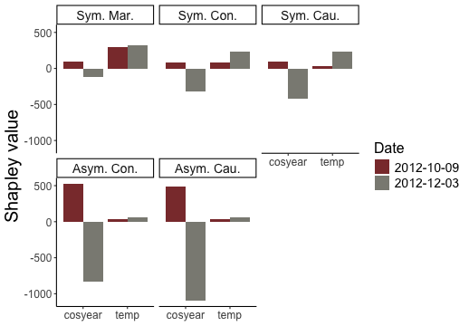

We can also make a similar plot using the `plot_SV_several_approaches` function in `shapr`,
but then we get each explicand in a separate facet instead of a facet for each framework.

``` r
# Here 2012-10-09 is the left facet and 2012-12-03 the right facet
plot_SV_several_approaches(explanations,
  index_explicands = dates_idx,
  only_these_features = features, # Can include more features.
  facet_scales = "free_x",
  horizontal_bars = FALSE,
  axis_labels_n_dodge = 1
) + theme(legend.position = "bottom")
```

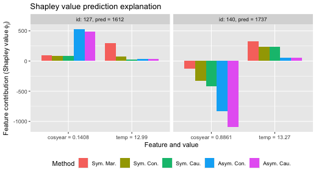

Furthermore, instead of doing as @heskes2020causal and only considering the features
`cosyear` and `temp`, we can plot all features, too, to get a more complete overview.

``` r
# Here 2012-10-09 is the left facet and 2012-12-03 the right facet
plot_SV_several_approaches(explanations,
  index_explicands = dates_idx,
  facet_scales = "free_x",
  horizontal_bars = FALSE,
  axis_labels_rotate_angle = 45,
  digits = 2
) + theme(legend.position = "bottom")
```

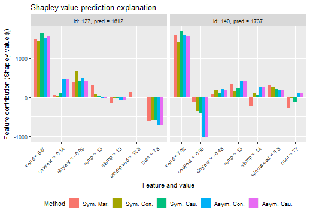


## Sampling of coalitions

We can use `max_n_coalitions` to specify/reduce the number of coalitions
to use when computing the Shapley value explanation framework. This applies
to marginal, conditional, and causal Shapley values, both the symmetric and
asymmetric versions. However, recall that the asymmetric versions already
have fewer valid coalitions due to the causal ordering.

In the example below, we demonstrate the sampling of coalitions for the
asymmetric and symmetric causal Shapley value explanation frameworks.
We half the number of coalitions for both versions
and see that the elapsed times are approximately halved, too.

``` r
explanation_n_coal <- list()

explanation_n_coal[["sym_cau_gaussian_64"]] <- explain(
  model = model,
  x_train = x_train,
  x_explain = x_explain,
  approach = "gaussian",
  phi0 = phi0,
  seed = 1,
  asymmetric = FALSE,
  causal_ordering = list(1, 2:3, 4:7),
  confounding = c(FALSE, TRUE, FALSE),
  max_n_coalitions = 64 # Instead of 128
)
#> 
#> ── Starting `shapr::explain()` at 2025-04-28 11:08:16 ──────────────────────────────────
#> ℹ Feature classes extracted from the model contains `NA`.
#>   Assuming feature classes from the data are correct.
#> 
#> 
#> ── Explanation overview ──
#> 
#> 
#> 
#> • Model class: <xgb.Booster>
#> 
#> • Approach: gaussian
#> 
#> • Iterative estimation: TRUE
#> 
#> • Number of feature-wise Shapley values: 7
#> 
#> • Number of observations to explain: 144
#> 
#> • Causal ordering: {trend}, {cosyear, sinyear}, {temp, atemp, windspeed, hum}
#> 
#> • Components with confounding: {cosyear, sinyear}
#> 
#> • Computations (temporary) saved at: '/tmp/RtmplHDIbs/shapr_obj_3d3af1d9cbe9.rds'
#> 
#> 
#> 
#> ── iterative computation started ──
#> 
#> 
#> 
#> ── Iteration 1 ─────────────────────────────────────────────────────────────────────────
#> 
#> ℹ Using 14 of 128 coalitions, 14 new. 
#> 
#> 
#> 
#> ── Iteration 2 ─────────────────────────────────────────────────────────────────────────
#> 
#> ℹ Using 26 of 128 coalitions, 12 new. 
#> 
#> 
#> 
#> ── Iteration 3 ─────────────────────────────────────────────────────────────────────────
#> 
#> ℹ Using 28 of 128 coalitions, 2 new. 
#> 
#> 
#> 
#> ── Iteration 4 ─────────────────────────────────────────────────────────────────────────
#> 
#> ℹ Using 30 of 128 coalitions, 2 new.

explanation_n_coal[["asym_cau_gaussian_10"]] <- explain(
  model = model,
  x_train = x_train,
  x_explain = x_explain,
  approach = "gaussian",
  phi0 = phi0,
  seed = 1,
  asymmetric = TRUE,
  causal_ordering = list(1, 2:3, 4:7),
  confounding = c(FALSE, TRUE, FALSE),
  verbose = c("basic", "convergence", "shapley"),
  max_n_coalitions = 10, # Instead of 20
  iterative = FALSE # Due to small number of coalitions
)
#> 
#> ── Starting `shapr::explain()` at 2025-04-28 11:08:27 ──────────────────────────────────
#> ℹ Feature classes extracted from the model contains `NA`.
#>   Assuming feature classes from the data are correct.
#> ── Explanation overview ──
#> 
#> • Model class: <xgb.Booster>
#> • Approach: gaussian
#> • Iterative estimation: FALSE
#> • Number of feature-wise Shapley values: 7
#> • Number of observations to explain: 144
#> • Number of asymmetric coalitions: 20
#> • Causal ordering: {trend}, {cosyear, sinyear}, {temp, atemp, windspeed, hum}
#> • Components with confounding: {cosyear, sinyear}
#> • Computations (temporary) saved at: '/tmp/RtmplHDIbs/shapr_obj_3d3af2267eda9.rds'
#> 
#> ── Main computation started ──
#> 
#> ℹ Using 10 of 10 coalitions. 
#> 
#> ── Convergence info 
#> ✔ Converged after 10 coalitions:
#> Maximum number of iterations reached!
#> Maximum number of coalitions reached!
#> 
#> ── Final estimated Shapley values (sd) 
#>             none             trend            cosyear           sinyear
#>           <char>            <char>             <char>            <char>
#>   1: 0.00 (0.00) -2181.91 (389.03)  -825.541 (377.21) -240.377 (257.68)
#>   2: 0.00 (0.00) -2174.36 (384.98)  -846.615 (381.99) -187.047 (273.99)
#>   3: 0.00 (0.00) -2088.96 (373.84)  -793.628 (365.63) -187.854 (248.84)
#>   4: 0.00 (0.00) -2103.36 (379.95)  -798.135 (377.31) -109.116 (270.58)
#>   5: 0.00 (0.00) -2003.88 (362.92)  -723.936 (346.66) -234.815 (228.12)
#>  ---                                                                   
#> 140: 0.00 (0.00)  1575.95 (631.53) -1014.078 (569.93)  248.468 (371.16)
#> 141: 0.00 (0.00)  1588.69 (650.49) -1057.223 (573.59)   33.389 (242.37)
#> 142: 0.00 (0.00)  1466.74 (635.17) -1109.151 (558.07)  -97.322 (243.07)
#> 143: 0.00 (0.00)  1003.94 (665.91) -1780.473 (623.77) -104.818 (347.18)
#> 144: 0.00 (0.00)   711.14 (787.04) -2635.898 (784.97) -184.269 (536.88)
#>                   temp             atemp          windspeed                hum
#>                 <char>            <char>             <char>             <char>
#>   1:  -34.336 ( 63.89)    0.212 ( 55.92)   116.765 ( 70.18)    13.809 ( 88.83)
#>   2:  -41.247 ( 54.60)   34.980 ( 23.07)    13.847 ( 36.81)   181.122 ( 77.88)
#>   3:  -94.019 ( 50.84)  -17.900 ( 43.43)   244.641 ( 61.81)  -132.542 ( 59.19)
#>   4:  191.341 (105.19)   44.353 ( 61.89)  -183.831 ( 66.85)  -228.803 (108.61)
#>   5:   42.276 ( 43.88)    4.164 ( 31.93)   203.339 ( 47.27)   -32.184 ( 55.58)
#>  ---                                                                          
#> 140:  -41.158 (210.29)   16.011 (195.60)   361.816 (171.47)   589.554 (262.98)
#> 141:   11.209 ( 34.71)    6.738 ( 23.45)   216.482 ( 30.02)   -80.279 ( 48.53)
#> 142:  -35.612 ( 69.65)  129.072 ( 27.12)    79.352 ( 39.85)   265.536 ( 93.28)
#> 143:   20.563 ( 64.24)   -4.875 ( 28.60)    47.647 ( 34.25)  -233.045 ( 82.77)
#> 144:   47.650 (137.29)  -66.930 ( 74.15)  -469.796 ( 83.42)   558.271 (204.47)

# Look at the times
explanation_n_coal[["sym_cau_gaussian_all_128"]] <- explanation_sym_cau$gaussian
explanation_n_coal[["asym_cau_gaussian_all_20"]] <- explanation_asym_cau$gaussian
explanation_n_coal <- explanation_n_coal[c(1, 3, 2, 4)]
print_time(explanation_n_coal)
#>      sym_cau_gaussian_64 sym_cau_gaussian_all_128 asym_cau_gaussian_10
#> [1,]              10.984                   32.677               2.0265
#>      asym_cau_gaussian_all_20
#> [1,]                   4.4787
```

We can then plot the beeswarm plots and the Shapley values for the six selected explicands.
We see that there are only minuscule differences between the Shapley values we obtain when we use
all the coalitions and those we obtain when we use half of the valid coalitions.


``` r
plot_beeswarms(explanation_n_coal, title = "Shapley values (gaussian) exact vs. approximation")
```

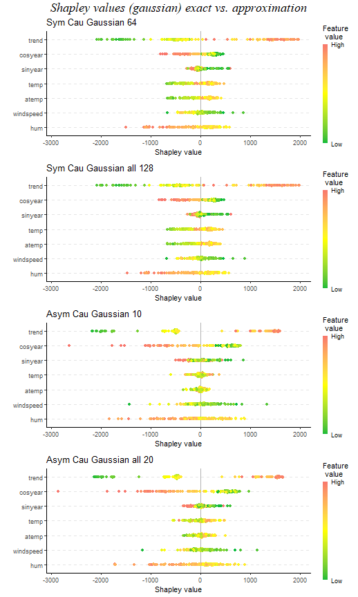


``` r
plot_SV_several_approaches(explanation_n_coal, index_x_explain) +
  theme(legend.position = "bottom") +
  guides(fill = guide_legend(nrow = 2))
```

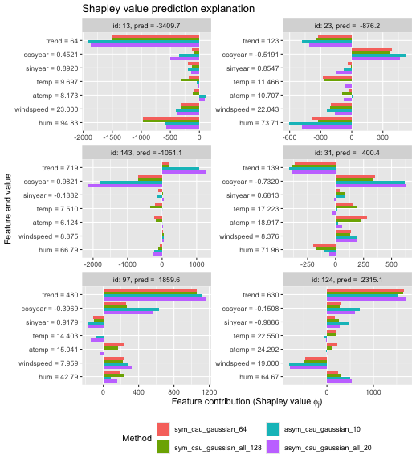


## Groups of features
In this section, we demonstrate that we can compute marginal, asymmetric
conditional, and symmetric/asymmetric Shapley values for groups of features, too.
For group Shapley values, we need to specify the causal ordering on the group level
and feature level. We demonstrate with the `gaussian` approach, but other approaches
are applicable, too.

In the pairs plot above (and below), we see that it can be natural to group the
features `temp` and `atemp` due to their (conceptual) similarity and high correlation.


``` r
GGally::ggpairs(x_train[, 4:5])
```

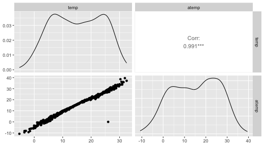

We set up the groups and update the causal ordering to be on the group level.

``` r
group_list <- list(
  trend = "trend",
  cosyear = "cosyear",
  sinyear = "sinyear",
  temp_group = c("temp", "atemp"),
  windspeed = "windspeed",
  hum = "hum"
)

causal_ordering_group <-
  list("trend", c("cosyear", "sinyear"), c("temp_group", "windspeed", "hum"))
confounding <- c(FALSE, TRUE, FALSE)
```


We can then compute the (group) Shapley values using the different Shapley value frameworks.

``` r
explanation_group_gaussian <- list()

explanation_group_gaussian[["symmetric_marginal"]] <-
  explain(
    model = model,
    x_train = x_train,
    x_explain = x_explain,
    approach = "gaussian",
    phi0 = phi0,
    seed = 1,
    asymmetric = FALSE,
    causal_ordering = list(seq(length(group_list))), # or `NULL`
    confounding = TRUE,
    n_MC_samples = 1000,
    group = group_list,
    iterative = FALSE
  )
#> 
#> ── Starting `shapr::explain()` at 2025-04-28 11:08:32 ──────────────────────────────────
#> ℹ Feature classes extracted from the model contains `NA`.
#>   Assuming feature classes from the data are correct.
#> ℹ `max_n_coalitions` is `NULL` or larger than or `2^n_groups = 64`, and is therefore
#>   set to `2^n_groups = 64`.
#> 
#> 
#> ── Explanation overview ──
#> 
#> 
#> 
#> • Model class: <xgb.Booster>
#> 
#> • Approach: gaussian
#> 
#> • Iterative estimation: FALSE
#> 
#> • Number of group-wise Shapley values: 6
#> 
#> • Number of observations to explain: 144
#> 
#> • Causal ordering: {trend, cosyear, sinyear, temp_group, windspeed, hum}
#> 
#> • Components with confounding: {trend, cosyear, sinyear, temp_group, windspeed, hum}
#> 
#> • Computations (temporary) saved at: '/tmp/RtmplHDIbs/shapr_obj_3d3af322cc4e9.rds'
#> 
#> 
#> 
#> ── Main computation started ──
#> 
#> 
#> 
#> ℹ Using 64 of 64 coalitions.

explanation_group_gaussian[["symmetric_conditional"]] <-
  explain(
    model = model,
    x_train = x_train,
    x_explain = x_explain,
    approach = "gaussian",
    phi0 = phi0,
    seed = 1,
    asymmetric = FALSE,
    causal_ordering = list(seq(length(group_list))), # or `NULL`
    confounding = NULL,
    n_MC_samples = 1000,
    group = group_list,
    iterative = FALSE
  )
#> 
#> ── Starting `shapr::explain()` at 2025-04-28 11:08:41 ──────────────────────────────────
#> ℹ Feature classes extracted from the model contains `NA`.
#>   Assuming feature classes from the data are correct.
#> ℹ `max_n_coalitions` is `NULL` or larger than or `2^n_groups = 64`, and is therefore
#>   set to `2^n_groups = 64`.
#> ── Explanation overview ──
#> 
#> • Model class: <xgb.Booster>
#> • Approach: gaussian
#> • Iterative estimation: FALSE
#> • Number of group-wise Shapley values: 6
#> • Number of observations to explain: 144
#> • Computations (temporary) saved at: '/tmp/RtmplHDIbs/shapr_obj_3d3af2aac41e8.rds'
#> 
#> ── Main computation started ──
#> 
#> ℹ Using 64 of 64 coalitions.

explanation_group_gaussian[["asymmetric_conditional"]] <-
  explain(
    model = model,
    x_train = x_train,
    x_explain = x_explain,
    approach = "gaussian",
    phi0 = phi0,
    seed = 1,
    asymmetric = TRUE,
    causal_ordering = causal_ordering_group,
    confounding = NULL,
    n_MC_samples = 1000,
    group = group_list,
    iterative = FALSE
  )
#> 
#> ── Starting `shapr::explain()` at 2025-04-28 11:08:46 ──────────────────────────────────
#> ℹ Feature classes extracted from the model contains `NA`.
#>   Assuming feature classes from the data are correct.
#> ℹ `max_n_coalitions` is `NULL` or larger than or number of coalitions respecting the
#>   causal ordering 12, and is therefore set to 12.
#> ── Explanation overview ──
#> 
#> • Model class: <xgb.Booster>
#> • Approach: gaussian
#> • Iterative estimation: FALSE
#> • Number of group-wise Shapley values: 6
#> • Number of observations to explain: 144
#> • Number of asymmetric coalitions: 12
#> • Causal ordering: {trend}, {cosyear, sinyear}, {temp_group, windspeed, hum}
#> • Computations (temporary) saved at: '/tmp/RtmplHDIbs/shapr_obj_3d3af643773fc.rds'
#> 
#> ── Main computation started ──
#> 
#> ℹ Using 12 of 12 coalitions.

explanation_group_gaussian[["symmetric_causal"]] <-
  explain(
    model = model,
    x_train = x_train,
    x_explain = x_explain,
    approach = "gaussian",
    phi0 = phi0,
    seed = 1,
    asymmetric = FALSE,
    causal_ordering = causal_ordering_group,
    confounding = confounding,
    n_MC_samples = 1000,
    group = group_list,
    iterative = FALSE
  )
#> 
#> ── Starting `shapr::explain()` at 2025-04-28 11:08:47 ──────────────────────────────────
#> ℹ Feature classes extracted from the model contains `NA`.
#>   Assuming feature classes from the data are correct.
#> ℹ `max_n_coalitions` is `NULL` or larger than or `2^n_groups = 64`, and is therefore
#>   set to `2^n_groups = 64`.
#> ── Explanation overview ──
#> 
#> • Model class: <xgb.Booster>
#> • Approach: gaussian
#> • Iterative estimation: FALSE
#> • Number of group-wise Shapley values: 6
#> • Number of observations to explain: 144
#> • Causal ordering: {trend}, {cosyear, sinyear}, {temp_group, windspeed, hum}
#> • Components with confounding: {cosyear, sinyear}
#> • Computations (temporary) saved at: '/tmp/RtmplHDIbs/shapr_obj_3d3af6ea0c15c.rds'
#> 
#> ── Main computation started ──
#> 
#> ℹ Using 64 of 64 coalitions.

explanation_group_gaussian[["asymmetric_causal"]] <-
  explain(
    model = model,
    x_train = x_train,
    x_explain = x_explain,
    approach = "gaussian",
    phi0 = phi0,
    seed = 1,
    asymmetric = TRUE,
    causal_ordering = causal_ordering_group,
    confounding = confounding,
    n_MC_samples = 1000,
    group = group_list,
    iterative = FALSE
  )
#> 
#> ── Starting `shapr::explain()` at 2025-04-28 11:09:03 ──────────────────────────────────
#> ℹ Feature classes extracted from the model contains `NA`.
#>   Assuming feature classes from the data are correct.
#> ℹ `max_n_coalitions` is `NULL` or larger than or number of coalitions respecting the
#>   causal ordering 12, and is therefore set to 12.
#> ── Explanation overview ──
#> 
#> • Model class: <xgb.Booster>
#> • Approach: gaussian
#> • Iterative estimation: FALSE
#> • Number of group-wise Shapley values: 6
#> • Number of observations to explain: 144
#> • Number of asymmetric coalitions: 12
#> • Causal ordering: {trend}, {cosyear, sinyear}, {temp_group, windspeed, hum}
#> • Components with confounding: {cosyear, sinyear}
#> • Computations (temporary) saved at: '/tmp/RtmplHDIbs/shapr_obj_3d3af644e43db.rds'
#> 
#> ── Main computation started ──
#> 
#> ℹ Using 12 of 12 coalitions.

# Look at the elapsed times (symmetric takes the longest time)
print_time(explanation_group_gaussian)
#>      symmetric_marginal symmetric_conditional asymmetric_conditional symmetric_causal
#> [1,]             9.1858                4.7847                0.95243           15.423
#>      asymmetric_causal
#> [1,]            1.5228
```

We can then make the beeswarm plots and Shapley values plots for the six selected explicands.
For the beeswarm plots, we set `include_group_feature_means = TRUE` to make the plots.
This means that the plot function use the mean of the `temp` and `atemp` features as the feature
value. This only makes sense due to the high correlation between the two features.

The main difference between the feature-wise and group-wise Shapley values
is that we now see a much wider spread in the Shapley values for `temp_group`
than we did for `temp` and `atemp`.
For example, for the symmetric causal framework, we saw above that the `temp` and `atemp`
obtained Shapley values between (around) $-500$ to $500$, while the grouped version
`temp_group` obtains Shapley values between $-1000$ to $1000$


``` r
plot_beeswarms(explanation_group_gaussian,
  title = "Group Shapley values (gaussian)",
  include_group_feature_means = TRUE
)
```

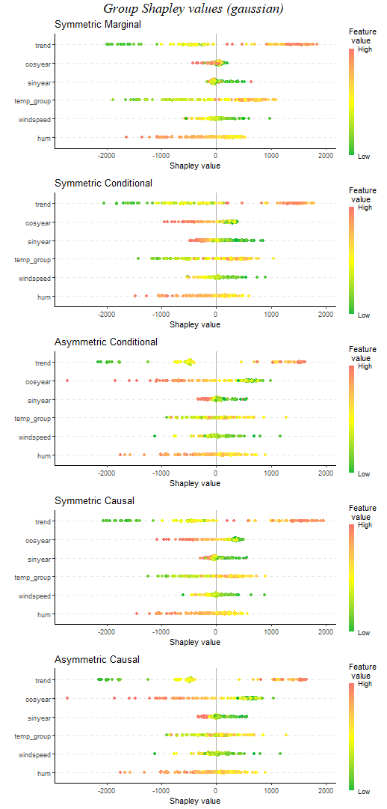


``` r
plot_SV_several_approaches(explanation_group_gaussian, index_x_explain) +
  ggtitle("Shapley value prediction explanation (gaussian)") +
  theme(legend.position = "bottom") + guides(fill = guide_legend(nrow = 2))
```

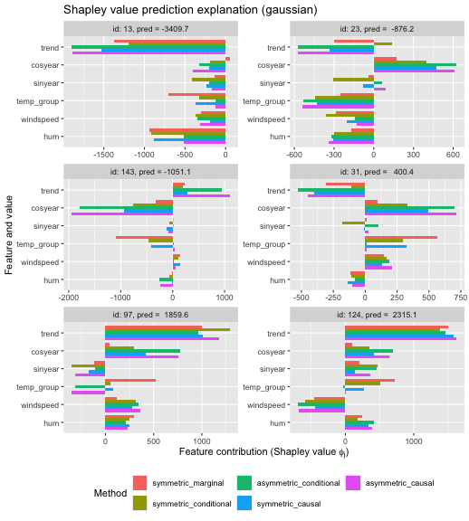


<a id="Implementation_details"></a>

## Implementation details

The `shapr` package is built to estimate conditional Shapley values, thus,
it parallelize over the coalitions. This makes perfect sense for said
framework as each batch of coalitions are independent of other batches,
which means that it is easy to parallelize. Furthermore, by using many
batches we drastically reduce the memory usage as `shapr` does not need
to store the Monte Carlo samples for all coalitions.

This setup is not optimal for the causal Shapley value framework as the
chains of sampling steps for two coalition $\mathcal{S}$ and $\mathcal{S}^*$
can contain many of the same steps. Ideally, each unique sampling step
should only be modeled once to save computation time, but, some of the
sampling steps will occur in many of the chains. Thus, we would then have
to store the Monte Carlo samples for all coalitions where this sampling
step is included, and we can therefor run into memory consumption problems.
Thus, in the current implementation, we treat each coalition $\mathcal{S}$
independent and remodel the needed sampling steps for each coalition.

Furthermore, in the conditional Shapley value framework, we have that
$\bar{\mathcal{S}} = \mathcal{M} \backslash \mathcal{S}$, thus `shapr`
will by default generate Monte Carlo samples for all features not in
$\mathcal{S}$. For the causal Shapley value framework, this is not the
case, i.e., $\bar{\mathcal{S}} \neq \mathcal{M} \backslash \mathcal{S}$
in general. To reuse the code, we generate Monte Carlo samples for all
features not in $\mathcal{S}$, but only keep the samples for the features
in $\bar{\mathcal{S}}$. To speed up `shapr` further, one could rewrite
all the approaches to support that $\bar{\mathcal{S}}$ is not
the complement of $\mathcal{S}$.

In the code below, we see the unique coalitions/set of features to condition
on to generate the Monte Carlo samples for all coalitions and the number of
times that set of conditional features is needed in the symmetric causal Shapley
value framework for the set up above. We see that most of the conditional
distributions will now be remodeled eights times. For the `gaussian` approach,
which is very fast to estimate the conditional distributions, this does not
have a major impact on the time. However, for, e.g., the `ctree` approach which
is much slower, this will take a significant amount of extra time. The `vaeac`
approach trains only on these relevant coalitions.

``` r
S_causal_steps <- explanation_sym_cau$gaussian$internal$iter_list[[1]]$S_causal_steps
S_causal_unlist <- do.call(c, unlist(S_causal_steps, recursive = FALSE))
S_causal_steps_freq <- S_causal_unlist[grepl("\\.S(?!bar)", names(S_causal_unlist), perl = TRUE)]
S_causal_steps_freq <- S_causal_steps_freq[!sapply(S_causal_steps_freq, is.null)] # Remove NULLs
S_causal_steps_freq <- S_causal_steps_freq[sapply(S_causal_steps_freq, length) > 0] # Remove extra integer(0)
table(sapply(S_causal_steps_freq, paste0, collapse = ","))
#> 
#>           1       1,2,3     1,2,3,4   1,2,3,4,5 1,2,3,4,5,6 1,2,3,4,5,7   1,2,3,4,6 
#>          95           7           8           8           8           8           8 
#> 1,2,3,4,6,7   1,2,3,4,7     1,2,3,5   1,2,3,5,6 1,2,3,5,6,7   1,2,3,5,7     1,2,3,6 
#>           8           8           8           8           8           8           8 
#>   1,2,3,6,7     1,2,3,7 
#>           8           8
```

The `independence`, `empirical`, `ctree`, and `categorical` approaches produce
weighted Monte Carlo samples. That means that they do not necessarily generate
`n_MC_samples`. To ensure `n_MC_samples`, we sample `n_MC_samples` samples using weighted
sampling with replacements where the weights are the weights returned by the approaches.

The marginal Shapley value explanation framework can be extended to
support modeling the marginal distributions using the `copula` and
`vaeac` approaches as both of these methods support unconditional sampling.


# References
