# Introduction {#intro}

The `shapr` package implements an extended version of the Kernel SHAP
method for approximating Shapley values (@lundberg2017unified), in which
dependence between the features is taken into account
(@aas2019explaining).

Estimation of Shapley values is of interest when
attempting to explain complex machine learning models. Of existing work
on interpreting individual predictions, Shapley values is regarded to be
the only model-agnostic explanation method with a solid theoretical
foundation (@lundberg2017unified). Kernel SHAP is a computationally
efficient approximation to Shapley values in higher dimensions, but it
assumes independent features. @aas2019explaining extends the Kernel SHAP
method to handle dependent features, resulting in more accurate
approximations to the true Shapley values. See the
[paper](https://martinjullum.com/publication/aas-2021-explaining/aas-2021-explaining.pdf)
(@aas2019explaining) for further details.


# Overview of Package {#overview}

## Functionality

Here is an overview of the main functions. You can read their
documentation and see examples with `?function_name`.

| Function Name      | Description                                                                               |
|:---------------------|:-------------------------------------------------|
| `explain`          | Computes kernel SHAP values for test data.                                                |
| `explain_forecast` | Analogous to `explain`, but for explaining forecasts from time series models.             |
| `plot.shapr`       | Plots the individual prediction explanations. Uses the `ggplot` and `ggbeeswarm` package. |

: Main functions in the `shapr` package.

The `shapr` package implements Kernel SHAP estimation of dependence-aware Shapley values with
eight different Monte Carlo-based approaches for estimating the conditional distributions of the data, namely
`"empirical"`, `"gaussian"`, `"copula"`, `"ctree"`, `"vaeac"`, `"categorical"`, `"timeseries"`, and `"independence"`.
`shapr` has also implemented two regression-based approaches `"regression_separate"` and `"regression_surrogate"`.
See [Estimation approaches and plotting functionality](#ex) below for examples.
It is also possible to combine the different approaches, see the [combined approach](#combined).

The package allows for parallelized computation through the `future`package, see [Parallelization](#para) for details.

The level of detail in the output can be controlled through the `verbose` argument. In addition, progress updates
on the process of estimating the `v(S)`'s (and training the `"vaeac"` model) is available through the
`progressr` package, supporting progress updates also for parallelized computation.
See [Verbosity and progress updates](#verbose) for details.

Moreover, the default behavior is to estimate the Shapley values iteratively, with increasing number of
feature coalitions being added, and to stop estimation as the estimated Shapley values has achieved a certain level of
stability.
More information about this is provided in [Iterative estimation](#iterative)
The above, combined with batch computation of the `v(S)` values, enables fast and accurate estimation of the
Shapley values in a memory friendly manner.

The package also provides functionality for computing Shapley values for groups of features, and custom function explanation, see [Advanced usage](#advanced).
Finally, explanation of multiple output time series forecasting models are discussed in
[Explaining forecasting models](#forecasting).


## Default behavior of `explain`

Below we provide brief descriptions of the most important parts of the default behavior of the `explain` function.

By default `explain` always compute feature-wise Shapley values.
Groups of features can be explained by providing the feature groups through the `group` argument.

When there are five or less features (or feature groups), iterative estimation is by default disabled.
The reason for this is that it is usually faster to estimate the Shapley values for all possible coalitions (`v(S)`),
than to estimate the uncertainty of the Shapley values, and potentially stop estimation earlier.
While iterative estimation is the default starting from six features, it is mainly when there are more than ten features,
that it is most beneficial, and can save a lot of computation time.
The reason for this is that the number of possible coalitions grows exponentially.
These defaults can be overridden by setting the `iterative` argument to `TRUE` or `FALSE`.
When using the `iterative` argument, the estimation for an observation is stopped when all Shapley value
standard deviations are below `t` times the range of the Shapley values.
The `t` value controls the convergence tolerance, defaults to 0.02, and can be set through the `iterative_args$convergence_tol` argument, see [iterative estimation](#iterative) for more details.

Since the iterativeness default changes based on the number of features (or feature groups), the default is also to have
no upper bound on the number of coalitions considered.
This can be controlled through the `max_n_coalitions` argument.


# Kernel SHAP and dependence-aware estimators {#KSHAP}

## The Kernel SHAP Method

Assume a predictive model $f(\boldsymbol{x})$ for a response value $y$
with features $\boldsymbol{x}\in \mathbb{R}^M$, trained on a training
set, and that we want to explain the predictions for new sets of data.
This may be done using ideas from cooperative game theory, letting a
single prediction take the place of the game being played and the
features the place of the players. Letting $N$ denote the set of all $M$
players, and $S \subseteq N$ be a subset of $|S|$ players, the
"contribution" function $v(S)$ describes the total expected sum of
payoffs the members of $S$ can obtain by cooperation. The Shapley value
(@Shapley53) is one way to distribute the total gains to the players,
assuming that they all collaborate. The amount that player $i$ gets is
then

$$\phi_i(v) = \phi_i = \sum_{S \subseteq N \setminus\{i\}} \frac{|S| ! (M-| S| - 1)!}{M!}(v(S\cup \{i\})-v(S)),$$

that is, a weighted mean over all subsets $S$ of players not containing
player $i$. @lundberg2017unified define the contribution function for a
certain subset $S$ of these features $\boldsymbol{x}_S$ as
$v(S) = \mbox{E}[f(\boldsymbol{x})|\boldsymbol{x}_S]$, the expected
output of the predictive model conditional on the feature values of the
subset. @lundberg2017unified names this type of Shapley values SHAP
(SHapley Additive exPlanation) values. Since the conditional
expectations can be written as

```{=tex}
\begin{equation}
\label{eq:CondExp}
E[f(\boldsymbol{x})|\boldsymbol{x}_s=\boldsymbol{x}_S^*] = E[f(\boldsymbol{x}_{\bar{S}},\boldsymbol{x}_S)|\boldsymbol{x}_S=\boldsymbol{x}_S^*] =
\int f(\boldsymbol{x}_{\bar{S}},\boldsymbol{x}_S^*)\,p(\boldsymbol{x}_{\bar{S}}|\boldsymbol{x}_S=\boldsymbol{x}_S^*)d\boldsymbol{x}_{\bar{S}},
\end{equation}
```
the conditional distributions
$p(\boldsymbol{x}_{\bar{S}}|\boldsymbol{x}_S=\boldsymbol{x}_S^*)$ are
needed to compute the contributions. The Kernel SHAP method of
@lundberg2017unified assumes feature independence, so that
$p(\boldsymbol{x}_{\bar{S}}|\boldsymbol{x}_S=\boldsymbol{x}_S^*)=p(\boldsymbol{x}_{\bar{S}})$.
If samples $\boldsymbol{x}_{\bar{S}}^{k}, k=1,\ldots,K$, from
$p(\boldsymbol{x}_{\bar{S}}|\boldsymbol{x}_S=\boldsymbol{x}_S^*)$ are
available, the conditional expectation above can be approximated by

```{=tex}
\begin{equation}
  v_{\text{KerSHAP}}(S) = \frac{1}{K}\sum_{k=1}^K f(\boldsymbol{x}_{\bar{S}}^{k},\boldsymbol{x}_S^*).
\end{equation}
```
In Kernel SHAP, $\boldsymbol{x}_{\bar{S}}^{k}, k=1,\ldots,K$ are sampled
from the $\bar{S}$-part of the training data, *independently* of
$\boldsymbol{x}_{S}$. This is motivated by using the training set as the
empirical distribution of $\boldsymbol{x}_{\bar{S}}$, and assuming that
$\boldsymbol{x}_{\bar{S}}$ is independent of
$\boldsymbol{x}_S=\boldsymbol{x}_S^*$. Due to the independence
assumption, if the features in a given model are highly dependent, the
Kernel SHAP method may give a completely wrong answer. This can be
avoided by estimating the conditional distribution
$p(\boldsymbol{x}_{\bar{S}}|\boldsymbol{x}_S=\boldsymbol{x}_S^*)$
directly and generating samples from this distribution. With this small
change, the contributions and Shapley values may then be approximated as
in the ordinary Kernel SHAP framework. @aas2019explaining propose three
different approaches for estimating the conditional probabilities which
are implemented: `empirical`, `gaussian` and `copula`. The package also
implements the `ctree` method from @redelmeier2020explaining, the
`vaeac` method from @olsen2022using and a `categorical` for categorical data.
The original `independence` approach
of @lundberg2017unified is also available. The methods may also be combined,
such that e.g. one method is used when conditioning on a small number of
features, while another method is used otherwise.
The `shapr` package also supports directly estimating the contribution
function using regression. We briefly introduce the regression-based
methods below, but we refer to the separate regression vignette
(Shapley value explanations using the regression paradigm) and
@olsen2024comparative for an in-depth explanation of the regression paradigm.


## Multivariate Gaussian Distribution Approach {#gaussian}

The first approach arises from the assumption that the feature vector
$\boldsymbol{x}$ stems from a multivariate Gaussian distribution with
some mean vector $\boldsymbol{\mu}$ and covariance matrix
$\boldsymbol{\Sigma}$. Under this assumption, the conditional
distribution
$p(\boldsymbol{x}_{\bar{\mathcal{S}}} |\boldsymbol{x}_{\mathcal{S}}=\boldsymbol{x}_{\mathcal{S}}^*)$
is also multivariate Gaussian\
$\text{N}_{|\bar{\mathcal{S}}|}(\boldsymbol{\mu}_{\bar{\mathcal{S}}|\mathcal{S}},\boldsymbol{\Sigma}_{\bar{\mathcal{S}}|\mathcal{S}})$,
with analytical expressions for the conditional mean vector
$\boldsymbol{\mu}_{\bar{\mathcal{S}}|\mathcal{S}}$ and covariance matrix
$\boldsymbol{\Sigma}_{\bar{\mathcal{S}}|\mathcal{S}}$, see
@aas2019explaining for details. Hence, instead of sampling from the
marginal empirical distribution of $\boldsymbol{x}_{\bar{\mathcal{S}}}$
approximated by the training data, we can sample from the Gaussian
conditional distribution, which is fitted using the training data. Using
the resulting samples
$\boldsymbol{x}_{\bar{\mathcal{S}}}^k, k=1,\ldots,K$, the conditional
expectations be approximated as in the Kernel SHAP.

## Gaussian Copula Approach {#copula}

If the features are far from multivariate Gaussian, an alternative
approach is to instead represent the marginals by their empirical
distributions, and model the dependence structure by a Gaussian copula.
Assuming a Gaussian copula, we may convert the marginals of the training
data to Gaussian features using their empirical distributions, and then
fit a multivariate Gaussian distribution to these.

To produce samples from the conditional distribution
$p(\boldsymbol{x}_{\bar{\mathcal{S}}} |\boldsymbol{x}_{\mathcal{S}}=\boldsymbol{x}_{\mathcal{S}}^*)$,
we convert the marginals of $\boldsymbol{x}_{\mathcal{S}}$ to Gaussians,
sample from the conditional Gaussian distribution as above, and convert
the marginals of the samples back to the original distribution. Those
samples are then used to approximate the sample from the resulting
multivariate Gaussian conditional distribution. While other copulas may
be used, the Gaussian copula has the benefit that we may use the
analytical expressions for the conditionals
$\boldsymbol{\mu}_{\bar{\mathcal{S}}|\mathcal{S}}$ and
$\boldsymbol{\Sigma}_{\bar{\mathcal{S}}|\mathcal{S}}$. Finally, we may
convert the marginals back to their original distribution, and use the
resulting samples to approximate the conditional expectations as in
Kernel SHAP.


## Empirical Conditional Distribution Approach {#empirical}

If both the dependence structure and the marginal distributions of
$\boldsymbol{x}$ are very far from the Gaussian, neither of the two
aforementioned methods will work very well. Few methods exists for the
non-parametric estimation of conditional densities, and the classic
kernel estimator (@rosenblatt1956) for non-parametric density estimation
suffers greatly from the curse of dimensionality and does not provide a
way to generate samples from the estimated distribution. For such
situations, @aas2019explaining propose an empirical conditional approach
to sample approximately from
$p(\boldsymbol{x}_{\bar{\mathcal{S}}}|\boldsymbol{x}_{\mathcal{S}}^*)$.
The idea is to compute weights
$w_{\mathcal{S}}(\boldsymbol{x}^*,\boldsymbol{x}^i),\ i=1,...,n_{\text{train}}$
for all training instances based on their Mahalanobis distances (in the
$S$ subset only) to the instance $\boldsymbol{x}^*$ to be explained.
Instead of sampling from this weighted (conditional) empirical
distribution, @aas2019explaining suggests a more efficient variant,
using only the $K$ instances with the largest weights:

$$v_{\text{condKerSHAP}}(\mathcal{S}) = \frac{\sum_{k=1}^K w_{\mathcal{S}}(\boldsymbol{x}^*,
\boldsymbol{x}^{[k]}) f(\boldsymbol{x}_{\bar{\mathcal{S}}}^{[k]},
\boldsymbol{x}_{\mathcal{S}}^*)}{\sum_{k=1}^K w_{\mathcal{S}}(\boldsymbol{x}^*,\boldsymbol{x}^{[k]})},$$

The number of samples $K$ to be used in the approximate prediction can
for instance be chosen such that the $K$ largest weights accounts for a
fraction $\eta$, for example $0.9$, of the total weight. If $K$ exceeds
a certain limit, for instance $5,000$, it might be set to that limit. A
bandwidth parameter $\sigma$ used to scale the weights, must also be
specified. This choice may be viewed as a bias-variance trade-off. A
small $\sigma$ puts most of the weight to a few of the closest training
observations and thereby gives low bias, but high variance. When
$\sigma \rightarrow \infty$, this method converges to the original
Kernel SHAP assuming feature independence. Typically, when the features
are highly dependent, a small $\sigma$ is typically needed such that the
bias does not dominate. @aas2019explaining show that a proper criterion
for selecting $\sigma$ is a small-sample-size corrected version of the
AIC known as AICc. As calculation of it is computationally intensive, an
approximate version of the selection criterion is also suggested.
Details on this is found in @aas2019explaining.


## Conditional Inference Tree Approach {#ctree}

The previous three methods can only handle numerical data. This means
that if the data contains categorical/discrete/ordinal features, the
features first have to be one-hot encoded. When the number of
levels/features is large, this is not feasible. An approach that handles
mixed (i.e numerical, categorical, discrete, ordinal) features and both
univariate and multivariate responses is conditional inference trees
(@hothorn2006unbiased).

Conditional inference trees is a special tree fitting procedure that
relies on hypothesis tests to choose both the splitting feature and the
splitting point. The tree fitting procedure is sequential: first a
splitting feature is chosen (the feature that is least independent of
the response), and then a splitting point is chosen for this feature.
This decreases the chance of being biased towards features with many
splits (@hothorn2006unbiased).

We use conditional inference trees (*ctree*) to model the conditional
distribution,
$p(\boldsymbol{x}_{\bar{\mathcal{S}}}|\boldsymbol{x}_{\mathcal{S}}^*)$,
found in the Shapley methodology. First, we fit a different conditional
inference tree to each conditional distribution. Once a tree is fit for
given dependent features, the end node of
$\boldsymbol{x}_{\mathcal{S}}^*$ is found. Then, we sample from this end
node and use the resulting samples,
$\boldsymbol{x}_{\bar{\mathcal{S}}}^k, k=1,\ldots,K$, when approximating
the conditional expectations as in Kernel SHAP. See
@redelmeier2020explaining for more details.

The conditional inference trees are fit using the *party* or *partykit*
packages (@partykit_package).


## Variational AutoEncoder with Arbitrary Conditioning (vaeac) Approach {#vaeac}

Another approach that supports mixed features is the Variational AutoEncoder
with Arbitrary Conditioning (@olsen2022using), abbreviated to `vaeac`.
The `vaeac` is an extension of the regular variational autoencoder
(@kingma2014autoencoding), but instead of giving a probabilistic representation
of the distribution $p(\boldsymbol{x})$ it gives a probabilistic representation
of the conditional distribution
$p(\boldsymbol{x}_{\bar{\mathcal{S}}} \mid \boldsymbol{x}_{\mathcal{S}})$,
for all possible feature subsets $\mathcal{S}\subseteq\mathcal{M}$ simultaneously,
where $\mathcal{M}$ is the set of all features. That is, only a single `vaeac`
model is needed to model all conditional distributions.

The `vaeac` consists of three neural networks: a *full encoder*, a *masked encoder*,
and a *decoder*. The encoders map the full and masked/conditional input representations,
i.e., $\boldsymbol{x}$ and $\boldsymbol{x}_{\mathcal{S}}$, respectively,
to latent probabilistic representations. Sampled instances from this latent probabilistic
representations are sent to the decoder, which maps them back to the feature space
and provides a samplable probabilistic representation for the unconditioned features
$\boldsymbol{x}_{\bar{\mathcal{S}}}$. The full encoder is only used during the
training phase of the `vaeac` model to guide the training process of the masked encoder,
as the former relies on the full input sample $\boldsymbol{x}$, which is not accessible
in the deployment phase (when we generate the Monte Carlo samples), as we only have access
to $\boldsymbol{x}_{\mathcal{S}}$. The networks are trained by minimizing a variational
lower bound. See Section 3 in @olsen2022using for an in-depth introduction to the
`vaeac` methodology. We use the `vaeac` model at the epoch which obtains the lowest
validation IWAE score to generate the Monte Carlo samples used in the Shapley value computations.

We fit the `vaeac` model using the R-package *torch*(@torch). The main
parameters are the the number of layers in the networks (`vaeac.depth`), the width of the layers
(`vaeac.width`), the number of dimensions in the latent space (`vaeac.latent_dim`),
the activation function between the layers in the networks (`vaeac.activation_function`),
the learning rate in the ADAM optimizer (`vaeac.lr`), the number of `vaeac` models to initiate
to remedy poorly initiated model parameter values (`vaeac.n_vaeacs_initialize`), and
the number of learning epochs (`vaeac.epochs`). See `?shapr::setup_approach.vaeac` for
a more detailed description of the parameters.

There are additional extra parameters which can be set by including a named list in the call to
the `explain()` function. For example, we can the change the batch size to 32 by including
`vaeac.extra_parameters = list(vaeac.batch_size = 32)` as an argument in the `explain()` function. See `?shapr::vaeac_get_extra_para_default` for a description of the possible
extra parameters to the `vaeac` approach.
Note that the main parameters are entered as arguments directly in `explain()` function, while the extra parameters are specified through a named list called `vaeac.extra_parameters`.

## Categorical Approach

When the features are all categorical, we can estimate the conditional
expectations using basic statistical formulas. For example, if we have
three features, $x_1, x_2, x_3$ with three levels each (indicated as 1,
2, 3), and we are provided with a table of counts indicating how many
times each combination of feature values occurs, we can estimate the
marginal and conditional probabilities as follows. Marginal
probabilities are estimated by dividing the number of times a given
feature (or features) takes on a certain value in the data set with the
total number of observations in the data set. Conditional
probabilities (for example, $P(X_1 = 1 | X_2 = 1)$) are estimated by
first subsetting the data set to reflect the conditioning (i.e.,
extracting all rows where $X_2 = 1$), and then dividing the number of
times the feature on the left hand side of $|$ takes the given value in
this subset by the total number of observations in this subset. Once the
marginal and conditional probabilities are estimated for all
combinations of feature values, each conditional expectation can be
calculated. For example, the expected value of $X_1$ given $X_2 = 1$ and
$X_3 = 2$ is
$$E(X_1|X_2, X_3) = \sum_{x}x P(X_1 = x | X_2=1, X_3=2) = \sum_{x} x \frac{P(X_1 = x, X_2 = 1, X_3 = 2)}{P(X_2=1, X_3=2)}.$$.


## Separate and Surrogate Regression Approaches {#Regression_approaches}

Another paradigm for estimating the contribution function is the regression
paradigm. In contrast to the methods above, which belong to the Monte Carlo
paradigm, the regression based methods use regression models to estimate the
contribution function $v(S) = E[f(\boldsymbol{x})|\boldsymbol{x}_S = \boldsymbol{x}_S^*]$ directly.
The separate regression method class fits a separate regression model for
each coalition $S$, while the surrogate regression method class fits a single
regression model to simultaneously predict the contribution function for all
coalitions. We refer to @olsen2024comparative for when one should use the
different paradigms, method classes, and methods.

In a separate vignette (Shapley value explanations using the regression paradigm),
we elaborate and demonstrate the regression paradigm.
We describe how to specify the regression model, enable automatic cross-validation
of the model's hyperparameters, and apply pre-processing steps to the data before
fitting the regression models. @olsen2024comparative divides the regression
paradigm into the separate and surrogate regression method classes. In the
separate vignette, we briefly introduce the two method classes. For an in-depth
explanation, we refer the reader to Sections 3.5 and 3.6 in @olsen2024comparative.


# Estimation approaches and plotting functionality {#ex}

The following example shows how a simple `xgboost` model is trained
using the `airquality` dataset, and how `shapr` can be used to explain
the individual predictions. Since which approach should be used to estimate the
contribution functions will depend on the type of data one is working with,
the user must specify the approach to be used through the `approach` argument.
Allowed values are `"gaussian"`, `"copula"`, `"empirical"`, `"ctree"`, `"vaeac"`,
`"categorical"`, `"timeseries"`, `"independence"`, `"regression_separate"`, and
`"regression_surrogate"`.

First we load the shapr package

``` r
library(shapr)
```


``` r
library(xgboost)
library(data.table)

data("airquality")
data <- data.table::as.data.table(airquality)
data <- data[complete.cases(data), ]

x_var <- c("Solar.R", "Wind", "Temp", "Month")
y_var <- "Ozone"

ind_x_explain <- 1:6
x_train <- data[-ind_x_explain, ..x_var]
y_train <- data[-ind_x_explain, get(y_var)]
x_explain <- data[ind_x_explain, ..x_var]

# Set seed for reproducibility
set.seed(123)

# Fitting a basic xgboost model to the training data
model <- xgboost::xgboost(
  data = as.matrix(x_train),
  label = y_train,
  nround = 20,
  verbose = FALSE
)

# Specifying the phi_0, i.e. the expected prediction without any features
p0 <- mean(y_train)

# Computing the actual Shapley values with Kernel SHAP accounting for feature dependence using
# the empirical (conditional) distribution approach with bandwidth parameter sigma = 0.1 (default)
explanation <- explain(
  model = model,
  x_explain = x_explain,
  x_train = x_train,
  approach = "empirical",
  phi0 = p0
)
#> Note: Feature classes extracted from the model contains NA.
#> Assuming feature classes from the data are correct.
#> Success with message:
#> max_n_coalitions is NULL or larger than or 2^n_features = 16, 
#> and is therefore set to 2^n_features = 16.
#> 
#> ── Starting `shapr::explain()` at 2024-11-21 20:44:12 ────────────────────────────────────
#> • Model class: <xgb.Booster>
#> • Approach: empirical
#> • Iterative estimation: FALSE
#> • Number of feature-wise Shapley values: 4
#> • Number of observations to explain: 6
#> • Computations (temporary) saved at: '/tmp/RtmpCcS4cy/shapr_obj_1b8c93756774fb.rds'
#> 
#> ── Main computation started ──
#> 
#> ℹ Using 16 of 16 coalitions.

# Printing the Shapley values for the test data.
# For more information about the interpretation of the values in the table, see ?shapr::explain.
print(explanation$shapley_values_est)
#>    explain_id   none  Solar.R    Wind    Temp    Month
#>         <int>  <num>    <num>   <num>   <num>    <num>
#> 1:          1 43.086 13.21173  4.7856 -25.572  -5.5992
#> 2:          2 43.086 -9.97277  5.8307 -11.039  -7.8300
#> 3:          3 43.086 -2.29162 -7.0534 -10.150  -4.4525
#> 4:          4 43.086  3.32546 -3.2409 -10.225  -6.6635
#> 5:          5 43.086  4.30396 -2.6278 -14.152 -12.2669
#> 6:          6 43.086  0.47864 -5.2487 -12.553  -6.6457

# Plot the resulting explanations for observations 1 and 6
plot(explanation, bar_plot_phi0 = FALSE, index_x_explain = c(1, 6))
```

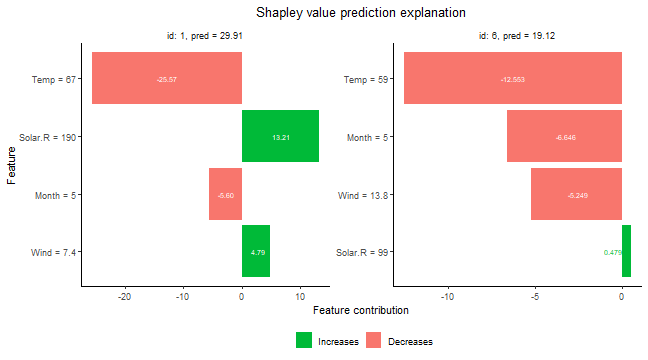

There are multiple plot options specified by the `plot_type` argument in
`plot`. The `waterfall` option shows the changes in the prediction score
due to each features contribution (their Shapley values):

There are multiple plot options specified by the `plot_type` argument in `plot`.
The `waterfall` option shows the changes in the prediction score due to each features contribution (their Shapley values):


``` r
plot(explanation, plot_type = "waterfall", index_x_explain = c(1, 6))
```

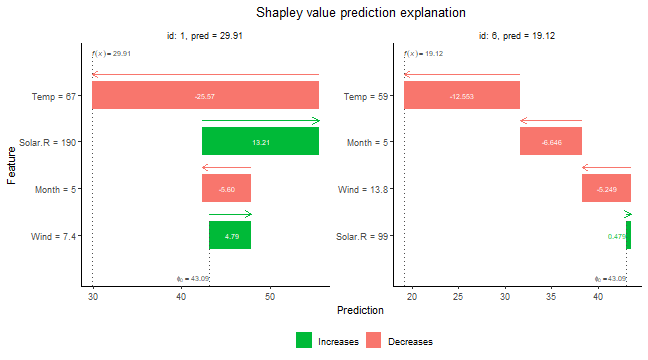

The other two plot options, `"beeswarm"` and `"scatter"`, can be useful
when you have many observations that you want to explain. For the
purpose of illustration, we explain the whole `airquality` dataset
(including the training data) for these plot types. The
`plot_type = "beeswarm"` summarizes the distribution of the Shapley
values along the x-axis across all features. Each point gives the
Shapley value of a given instance, where the points are colored by the
feature value of that instance:


``` r
x_explain_many <- data[, ..x_var]
explanation_plot <- explain(
  model = model,
  x_explain = x_explain_many,
  x_train = x_train,
  approach = "empirical",
  phi0 = p0
)
#> Note: Feature classes extracted from the model contains NA.
#> Assuming feature classes from the data are correct.
#> Success with message:
#> max_n_coalitions is NULL or larger than or 2^n_features = 16, 
#> and is therefore set to 2^n_features = 16.
#> 
#> ── Starting `shapr::explain()` at 2024-11-21 20:44:19 ────────────────────────────────────
#> • Model class: <xgb.Booster>
#> • Approach: empirical
#> • Iterative estimation: FALSE
#> • Number of feature-wise Shapley values: 4
#> • Number of observations to explain: 111
#> • Computations (temporary) saved at: '/tmp/RtmpCcS4cy/shapr_obj_1b8c931d8811ab.rds'
#> 
#> ── Main computation started ──
#> 
#> ℹ Using 16 of 16 coalitions.
plot(explanation_plot, plot_type = "beeswarm")
```

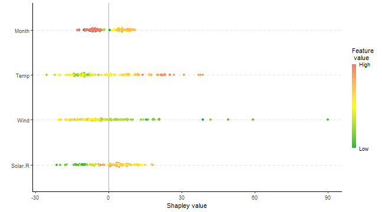

The `plot_type = "scatter"` plots the feature values on the x-axis and
Shapley values on the y-axis, as well as (optionally) a background
scatter_hist showing the distribution of the feature data:


``` r
plot(explanation_plot, plot_type = "scatter", scatter_hist = TRUE)
```

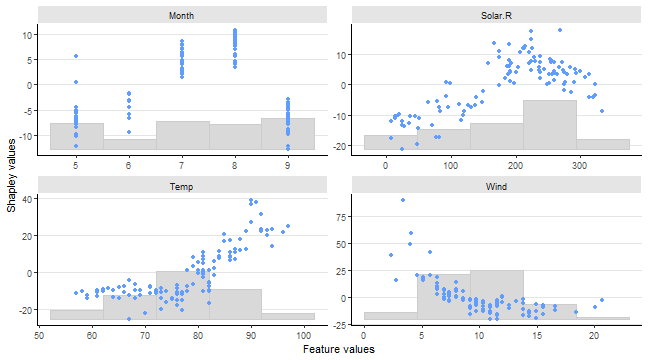

We can use mixed (i.e continuous, categorical, ordinal) data with `ctree` or `vaeac`.
Use `ctree` with mixed data in the following manner:


``` r
# convert the month variable to a factor
data[, Month_factor := as.factor(Month)]

data_train_cat <- data[-ind_x_explain, ]
data_explain_cat <- data[ind_x_explain, ]

x_var_cat <- c("Solar.R", "Wind", "Temp", "Month_factor")

x_train_cat <- data_train_cat[, ..x_var_cat]
x_explain_cat <- data_explain_cat[, ..x_var_cat]

# Fitting an lm model here as xgboost does not handle categorical features directly
# (work around in example below)
lm_formula <- as.formula(paste0(y_var, " ~ ", paste0(x_var_cat, collapse = " + ")))

model_lm_cat <- lm(lm_formula, data_train_cat)

p0 <- mean(y_train)
explanation_lm_cat <- explain(
  model = model_lm_cat,
  x_explain = x_explain_cat,
  x_train = x_train_cat,
  approach = "ctree",
  phi0 = p0
)
#> Success with message:
#> max_n_coalitions is NULL or larger than or 2^n_features = 16, 
#> and is therefore set to 2^n_features = 16.
#> 
#> ── Starting `shapr::explain()` at 2024-11-21 20:44:31 ────────────────────────────────────
#> • Model class: <lm>
#> • Approach: ctree
#> • Iterative estimation: FALSE
#> • Number of feature-wise Shapley values: 4
#> • Number of observations to explain: 6
#> • Computations (temporary) saved at: '/tmp/RtmpCcS4cy/shapr_obj_1b8c934d11d260.rds'
#> 
#> ── Main computation started ──
#> 
#> ℹ Using 16 of 16 coalitions.

# Plot the resulting explanations for observations 1 and 6, excluding
# the no-covariate effect
plot(explanation_lm_cat, bar_plot_phi0 = FALSE, index_x_explain = c(1, 6))
```

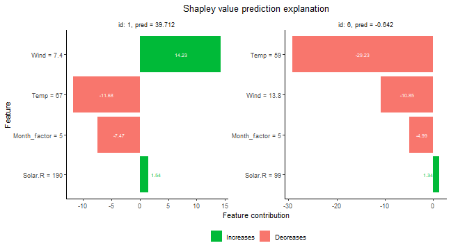

We can specify parameters used to build the conditional inference trees
in the following manner. The default values are based on
@hothorn2006unbiased.


``` r
# Use the conditional inference tree approach
# We can specify parameters used to building trees by specifying mincriterion,
# minsplit, minbucket
explanation_ctree <- explain(
  model = model_lm_cat,
  x_explain = x_explain_cat,
  x_train = x_train_cat,
  approach = "ctree",
  phi0 = p0,
  ctree.mincriterion = 0.80,
  ctree.minsplit = 20,
  ctree.minbucket = 20
)
#> Success with message:
#> max_n_coalitions is NULL or larger than or 2^n_features = 16, 
#> and is therefore set to 2^n_features = 16.
#> 
#> ── Starting `shapr::explain()` at 2024-11-21 20:44:32 ────────────────────────────────────
#> • Model class: <lm>
#> • Approach: ctree
#> • Iterative estimation: FALSE
#> • Number of feature-wise Shapley values: 4
#> • Number of observations to explain: 6
#> • Computations (temporary) saved at: '/tmp/RtmpCcS4cy/shapr_obj_1b8c93a8d4f63.rds'
#> 
#> ── Main computation started ──
#> 
#> ℹ Using 16 of 16 coalitions.
# Default parameters (based on (Hothorn, 2006)) are:
# mincriterion = 0.95
# minsplit = 20
# minbucket = 7
```

If **all** features are categorical, one may use the categorical
approach as follows:


``` r
# For the sake of illustration, convert ALL features to factors
data[, Solar.R_factor := as.factor(cut(Solar.R, 10))]
data[, Wind_factor := as.factor(cut(Wind, 3))]
data[, Temp_factor := as.factor(cut(Temp, 2))]
data[, Month_factor := as.factor(Month)]

data_train_all_cat <- data[-ind_x_explain, ]
data_explain_all_cat <- data[ind_x_explain, ]


x_var_all_cat <- c("Solar.R_factor", "Wind_factor", "Temp_factor", "Month_factor")

x_train_all_cat <- data_train_all_cat[, ..x_var_all_cat]
x_explain_all_cat <- data_explain_all_cat[, ..x_var_all_cat]

# Fit an lm model here
lm_formula_all_cat <- as.formula(paste0(y_var, " ~ ", paste0(x_var_all_cat, collapse = " + ")))

model_lm_all_cat <- lm(lm_formula_all_cat, data_train_all_cat)

explanation_cat_method <- explain(
  model = model_lm_all_cat,
  x_explain = x_explain_all_cat,
  x_train = x_train_all_cat,
  approach = "categorical",
  phi0 = p0
)
#> Success with message:
#> max_n_coalitions is NULL or larger than or 2^n_features = 16, 
#> and is therefore set to 2^n_features = 16.
#> 
#> ── Starting `shapr::explain()` at 2024-11-21 20:44:33 ────────────────────────────────────
#> • Model class: <lm>
#> • Approach: categorical
#> • Iterative estimation: FALSE
#> • Number of feature-wise Shapley values: 4
#> • Number of observations to explain: 6
#> • Computations (temporary) saved at: '/tmp/RtmpCcS4cy/shapr_obj_1b8c9361d2d6a5.rds'
#> 
#> ── Main computation started ──
#> 
#> ℹ Using 16 of 16 coalitions.
```

Shapley values can be used to explain any predictive model. For
predictive models taking time series as input, `approach='timeseries'`
can be used. In such models, joint behavior of consecutive time points
is often more important for the outcome than the single time points.
Therefore, it makes sense to derive Shapley value segments of the time
series instead of for each single time point. In `shapr` this can be
achieved through the `group` attribute. Other optional parameters of
`approach='timeseries'` are `timeseries.fixed_sigma` and
`timeseries.bounds` (a vector indicating upper and lower bounds of the
time series if necessary).


``` r
# Simulate time series data with AR(1)-structure
set.seed(1)
data_ts <- data.frame(matrix(NA, ncol = 41, nrow = 4))
for (n in 1:100) {
  set.seed(n)
  e <- rnorm(42, mean = 0, sd = 1)

  m_1 <- 0
  for (i in 2:length(e)) {
    m_1[i] <- 1 + 0.8 * m_1[i - 1] + e[i]
  }
  data_ts[n, ] <- m_1[-1]
}
data_ts <- data.table::as.data.table(data_ts)

x_var_ts <- paste0("X", 1:40)
y_var_ts <- "X41"

ind_x_explain <- 1:6
data_ts_train <- data_ts[-ind_x_explain]

# Creating a predictive model (for illustration just predicting the next point in the time series with a linear model)
lm_ts_formula <- as.formula(X41 ~ .)
model_lm_ts <- lm(lm_ts_formula, data_ts_train)

x_explain_ts <- data_ts[ind_x_explain, ..x_var_ts]
x_train_ts <- data_ts[-ind_x_explain, ..x_var_ts]

# Spitting the time series into 4 segments
group_ts <- list(
  S1 = paste0("X", 1:10),
  S2 = paste0("X", 11:20),
  S3 = paste0("X", 21:30),
  S4 = paste0("X", 31:40)
)


p0_ts <- mean(unlist(data_ts_train[, ..y_var_ts]))

explanation_timeseries <- explain(
  model = model_lm_ts,
  x_explain = x_explain_ts,
  x_train = x_train_ts,
  approach = "timeseries",
  phi0 = p0_ts,
  group = group_ts
)
#> Success with message:
#> max_n_coalitions is NULL or larger than or 2^n_groups = 16, 
#> and is therefore set to 2^n_groups = 16.
#> 
#> ── Starting `shapr::explain()` at 2024-11-21 20:44:33 ────────────────────────────────────
#> • Model class: <lm>
#> • Approach: timeseries
#> • Iterative estimation: FALSE
#> • Number of group-wise Shapley values: 4
#> • Number of observations to explain: 6
#> • Computations (temporary) saved at: '/tmp/RtmpCcS4cy/shapr_obj_1b8c933989300e.rds'
#> 
#> ── Main computation started ──
#> 
#> ℹ Using 16 of 16 coalitions.
```


## MSEv evaluation criterion
We can use the $\operatorname{MSE}_{v}$ criterion proposed by @frye2020shapley,
and later used by, e.g., @olsen2022using and @olsen2024comparative, to evaluate
and rank the approaches/methods. The $\operatorname{MSE}_{v}$ is given by
```{=tex}
\begin{align}
    \label{eq:MSE_v}
    \operatorname{MSE}_{v} = \operatorname{MSE}_{v}(\text{method } \texttt{q})
    =
     \frac{1}{N_\mathcal{S}} \sum_{\mathcal{S} \in \mathcal{P}^*(\mathcal{M})} \frac{1}{N_\text{explain}}
     \sum_{i=1}^{N_\text{explain}} \left( f(\boldsymbol{x}^{[i]}) - {\hat{v}}_{\texttt{q}}(\mathcal{S}, \boldsymbol{x}^{[i]})\right)^2\!,
\end{align}
```
where ${\hat{v}}_{\texttt{q}}$ is the estimated contribution function using method $\texttt{q}$ and $N_\mathcal{S} = |\mathcal{P}^*(\mathcal{M})| = 2^M-2$, i.e., we have removed the empty ($\mathcal{S} = \emptyset$) and the grand combinations ($\mathcal{S} = \mathcal{M}$) as they are method independent. Meaning that these two combinations do not influence the ranking of the methods as the methods are not used to compute the contribution function for them.

The motivation behind the
$\operatorname{MSE}_{v}$ criterion is that
$\mathbb{E}_\mathcal{S}\mathbb{E}_{\boldsymbol{x}} (v_{\texttt{true}}(\mathcal{S},\boldsymbol{x}) - \hat{v}_{\texttt{q}}(\mathcal{S}, \boldsymbol{x}))^2$
can be decomposed as
```{=tex}
\begin{align}
    \label{eq:expectation_decomposition}
    \begin{split}
    \mathbb{E}_\mathcal{S}\mathbb{E}_{\boldsymbol{x}} (v_{\texttt{true}}(\mathcal{S}, \boldsymbol{x})- \hat{v}_{\texttt{q}}(\mathcal{S}, \boldsymbol{x}))^2
    &=
    \mathbb{E}_\mathcal{S}\mathbb{E}_{\boldsymbol{x}} (f(\boldsymbol{x}) - \hat{v}_{\texttt{q}}(\mathcal{S}, \boldsymbol{x}))^2 \\
    &\phantom{\,\,\,\,\,\,\,}- \mathbb{E}_\mathcal{S}\mathbb{E}_{\boldsymbol{x}} (f(\boldsymbol{x})-v_{\texttt{true}}(\mathcal{S}, \boldsymbol{x}))^2,
    \end{split}
\end{align}
```
see Appendix A in @covert2020understanding. The first term on the right-hand side of
the equation above can be estimated by $\operatorname{MSE}_{v}$, while the second
term is a fixed (unknown) constant not influenced by the approach \texttt{q}. Thus, a low value
of $\operatorname{MSE}_{v}$ indicates that the estimated contribution function $\hat{v}_{\texttt{q}}$
is closer to the true counterpart $v_{\texttt{true}}$ than a high value.

In `shapr`, we allow for weighting the combinations in the $\operatorname{MSE}_{v}$ evaluation criterion either
uniformly or by using the corresponding Shapley kernel weights (or the sampling frequencies when sampling of
combinations is used).
This is determined by the logical parameter `MSEv_uniform_comb_weights` in the `explain()` function, and the
default is to do uniform weighting, that is, `MSEv_uniform_comb_weights = TRUE`.

### Advantage:
An advantage of the $\operatorname{MSE}_{v}$ criterion is that $v_\texttt{true}$ is not involved.
Thus, we can apply it as an evaluation criterion to real-world data sets where the true
Shapley values are unknown.

### Disadvantages:
First, we can only use the $\operatorname{MSE}_{v}$ criterion to rank the methods and not assess
their closeness to the optimum since the minimum value of the $\operatorname{MSE}_{v}$ criterion
is unknown. Second, the criterion evaluates the contribution functions and not the Shapley values.

@olsen2024comparative observed a relatively linear relationship between the
$\operatorname{MSE}_{v}$ criterion and the mean absolute error $(\operatorname{MAE})$ between the
true and estimated Shapley values in extensive simulation studies where the true Shapley values
were known. That is, a method that achieves a low $\operatorname{MSE}_{v}$ score also tends to
obtain a low $\operatorname{MAE}$ score, and vice versa.

### Confidence intervals
The $\operatorname{MSE}_{v}$ criterion can be written as
$\operatorname{MSE}_{v} = \frac{1}{N_\text{explain}}\sum_{i=1}^{N_\text{explain}} \operatorname{MSE}_{v,\text{explain }i}$.
We can therefore use the central limit theorem to compute an approximate
confidence interval for the $\operatorname{MSE}_{v}$ criterion. We have that
$\operatorname{MSE}_{v} \pm t_{\alpha/2}\frac{\operatorname{SD}(\operatorname{MSE}_{v})}{\sqrt{N_\text{explain}}}$
is a $(1-\alpha/2)\%$ approximate confidence interval for the evaluation criterion,
where $t_{\alpha/2}$ is the $\alpha/2$ percentile of the $T_{N_\text{explain}-1}$ distribution.
Note that $N_\text{explain}$ should be large (rule of thumb is at least $30$) for the
central limit theorem to be valid. The quantities $\operatorname{MSE}_{v}$ and
$\frac{\operatorname{SD}(\operatorname{MSE}_{v})}{\sqrt{N_\text{explain}}}$ are returned by
the `explain()` function in the `MSEv` list of data tables. We can also compute similar
approximate confidence interval for $\operatorname{MSE}_{v}$ criterion for each
combination/coalition when only averaging over the observations. However, it does not
make sense in the other direction, i.e., when only averaging over the combinations for
each observation, as each combination is a different prediction tasks.


### MSEv examples

Start by explaining the predictions by using different methods and combining them into lists.

``` r
# We use more explicands here for more stable confidence intervals
ind_x_explain_many <- 1:25
x_train <- data[-ind_x_explain_many, ..x_var]
y_train <- data[-ind_x_explain_many, get(y_var)]
x_explain <- data[ind_x_explain_many, ..x_var]

# Fitting a basic xgboost model to the training data
model <- xgboost::xgboost(
  data = as.matrix(x_train),
  label = y_train,
  nround = 20,
  verbose = FALSE
)

# Specifying the phi_0, i.e. the expected prediction without any features
p0 <- mean(y_train)

# Independence approach
explanation_independence <- explain(
  model = model,
  x_explain = x_explain,
  x_train = x_train,
  approach = "independence",
  phi0 = p0,
  n_MC_samples = 1e2,
  MSEv_uniform_comb_weights = TRUE
)
#> Note: Feature classes extracted from the model contains NA.
#> Assuming feature classes from the data are correct.
#> Success with message:
#> max_n_coalitions is NULL or larger than or 2^n_features = 16, 
#> and is therefore set to 2^n_features = 16.
#> 
#> ── Starting `shapr::explain()` at 2024-11-21 20:44:35 ────────────────────────────────────
#> • Model class: <xgb.Booster>
#> • Approach: independence
#> • Iterative estimation: FALSE
#> • Number of feature-wise Shapley values: 4
#> • Number of observations to explain: 25
#> • Computations (temporary) saved at: '/tmp/RtmpCcS4cy/shapr_obj_1b8c9321f2ff20.rds'
#> 
#> ── Main computation started ──
#> 
#> ℹ Using 16 of 16 coalitions.

# Empirical approach
explanation_empirical <- explain(
  model = model,
  x_explain = x_explain,
  x_train = x_train,
  approach = "empirical",
  phi0 = p0,
  n_MC_samples = 1e2,
  MSEv_uniform_comb_weights = TRUE
)
#> Note: Feature classes extracted from the model contains NA.
#> Assuming feature classes from the data are correct.
#> Success with message:
#> max_n_coalitions is NULL or larger than or 2^n_features = 16, 
#> and is therefore set to 2^n_features = 16.
#> 
#> ── Starting `shapr::explain()` at 2024-11-21 20:44:36 ────────────────────────────────────
#> • Model class: <xgb.Booster>
#> • Approach: empirical
#> • Iterative estimation: FALSE
#> • Number of feature-wise Shapley values: 4
#> • Number of observations to explain: 25
#> • Computations (temporary) saved at: '/tmp/RtmpCcS4cy/shapr_obj_1b8c9372002e18.rds'
#> 
#> ── Main computation started ──
#> 
#> ℹ Using 16 of 16 coalitions.

# Gaussian 1e1 approach
explanation_gaussian_1e1 <- explain(
  model = model,
  x_explain = x_explain,
  x_train = x_train,
  approach = "gaussian",
  phi0 = p0,
  n_MC_samples = 1e1,
  MSEv_uniform_comb_weights = TRUE
)
#> Note: Feature classes extracted from the model contains NA.
#> Assuming feature classes from the data are correct.
#> Success with message:
#> max_n_coalitions is NULL or larger than or 2^n_features = 16, 
#> and is therefore set to 2^n_features = 16.
#> 
#> ── Starting `shapr::explain()` at 2024-11-21 20:44:43 ────────────────────────────────────
#> • Model class: <xgb.Booster>
#> • Approach: gaussian
#> • Iterative estimation: FALSE
#> • Number of feature-wise Shapley values: 4
#> • Number of observations to explain: 25
#> • Computations (temporary) saved at: '/tmp/RtmpCcS4cy/shapr_obj_1b8c9371245336.rds'
#> 
#> ── Main computation started ──
#> 
#> ℹ Using 16 of 16 coalitions.

# Gaussian 1e2 approach
explanation_gaussian_1e2 <- explain(
  model = model,
  x_explain = x_explain,
  x_train = x_train,
  approach = "gaussian",
  phi0 = p0,
  n_MC_samples = 1e2,
  MSEv_uniform_comb_weights = TRUE
)
#> Note: Feature classes extracted from the model contains NA.
#> Assuming feature classes from the data are correct.
#> Success with message:
#> max_n_coalitions is NULL or larger than or 2^n_features = 16, 
#> and is therefore set to 2^n_features = 16.
#> 
#> ── Starting `shapr::explain()` at 2024-11-21 20:44:43 ────────────────────────────────────
#> • Model class: <xgb.Booster>
#> • Approach: gaussian
#> • Iterative estimation: FALSE
#> • Number of feature-wise Shapley values: 4
#> • Number of observations to explain: 25
#> • Computations (temporary) saved at: '/tmp/RtmpCcS4cy/shapr_obj_1b8c93155a4322.rds'
#> 
#> ── Main computation started ──
#> 
#> ℹ Using 16 of 16 coalitions.

# Combined approach
explanation_combined <- explain(
  model = model,
  x_explain = x_explain,
  x_train = x_train,
  approach = c("gaussian", "empirical", "independence"),
  phi0 = p0,
  n_MC_samples = 1e2,
  MSEv_uniform_comb_weights = TRUE
)
#> Note: Feature classes extracted from the model contains NA.
#> Assuming feature classes from the data are correct.
#> Success with message:
#> max_n_coalitions is NULL or larger than or 2^n_features = 16, 
#> and is therefore set to 2^n_features = 16.
#> 
#> ── Starting `shapr::explain()` at 2024-11-21 20:44:43 ────────────────────────────────────
#> • Model class: <xgb.Booster>
#> • Approach: gaussian, empirical, and independence
#> • Iterative estimation: FALSE
#> • Number of feature-wise Shapley values: 4
#> • Number of observations to explain: 25
#> • Computations (temporary) saved at: '/tmp/RtmpCcS4cy/shapr_obj_1b8c937ba6bac.rds'
#> 
#> ── Main computation started ──
#> 
#> ℹ Using 16 of 16 coalitions.

# Create a list of explanations with names
explanation_list_named <- list(
  "Ind." = explanation_independence,
  "Emp." = explanation_empirical,
  "Gaus. 1e1" = explanation_gaussian_1e1,
  "Gaus. 1e2" = explanation_gaussian_1e2,
  "Combined" = explanation_combined
)
```


We can then compare the different approaches by creating plots of the $\operatorname{MSE}_{v}$ evaluation criterion.


``` r
# Create the MSEv plots with approximate 95% confidence intervals
MSEv_plots <- plot_MSEv_eval_crit(explanation_list_named,
  plot_type = c("overall", "comb", "explicand"),
  CI_level = 0.95
)

# 5 plots are made
names(MSEv_plots)
#> [1] "MSEv_explicand_bar"        "MSEv_explicand_line_point" "MSEv_coalition_bar"       
#> [4] "MSEv_coalition_line_point" "MSEv_bar"
```
The main plot if interest is the `MSEv_bar`, which displays the $\operatorname{MSE}_{v}$ evaluation criterion for each method averaged over both the combinations/coalitions and test observations/explicands. However, we can also look at the other plots where
we have only averaged over the observations or the combinations (both as bar and line plots).


``` r
# The main plot of the overall MSEv averaged over both the combinations and observations
MSEv_plots$MSEv_bar
```

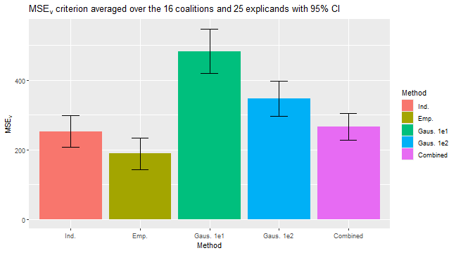

``` r

# The MSEv averaged over only the explicands for each combinations
MSEv_plots$MSEv_combination_bar
#> NULL

# The MSEv averaged over only the combinations for each observation/explicand
MSEv_plots$MSEv_explicand_bar
```

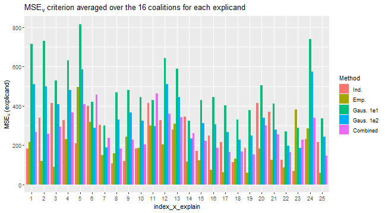

``` r

# To see which coalition S each of the `id_combination` corresponds to,
# i.e., which features that are conditions on.
explanation_list_named[[1]]$MSEv$MSEv_combination[, c("id_combination", "features")]
#> NULL
```

We can specify the `index_x_explain` and `id_combination` parameters in `plot_MSEv_eval_crit()` to only plot
certain test observations and combinations, respectively.


``` r
# We can specify which test observations or combinations to plot
plot_MSEv_eval_crit(explanation_list_named,
  plot_type = "explicand",
  index_x_explain = c(1, 3:4, 6),
  CI_level = 0.95
)$MSEv_explicand_bar
```

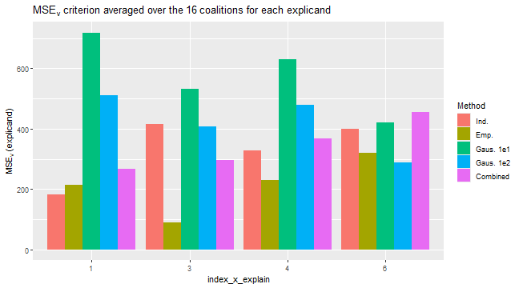

``` r
plot_MSEv_eval_crit(explanation_list_named,
  plot_type = "comb",
  id_coalition = c(3, 4, 9, 13:15),
  CI_level = 0.95
)$MSEv_combination_bar
#> NULL
```


We can also alter the plots design-wise as we do in the code below.


``` r
bar_text_n_decimals <- 1
plot_MSEv_eval_crit(explanation_list_named) +
  ggplot2::scale_x_discrete(limits = rev(levels(MSEv_plots$MSEv_bar$data$Method))) +
  ggplot2::coord_flip() +
  ggplot2::scale_fill_brewer(palette = "Paired") +
  ggplot2::theme_minimal() + # This must be set before other theme calls
  ggplot2::theme(
    plot.title = ggplot2::element_text(size = 10),
    legend.position = "bottom"
  ) +
  ggplot2::geom_text(
    ggplot2::aes(label = sprintf(
      paste("%.", sprintf("%d", bar_text_n_decimals), "f", sep = ""),
      round(MSEv, bar_text_n_decimals)
    )),
    vjust = -0.35, # This number might need altering for different plots sizes
    hjust = 1.1, # This number might need altering for different plots sizes
    color = "black",
    position = ggplot2::position_dodge(0.9),
    size = 4
  )
```

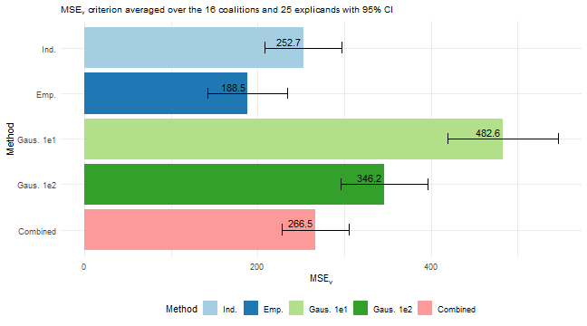

# Iterative estimation {#iterative}

Iterative estimation is the default when computing Shapley values with six or more features (or feature groups), and
can always be manually overridden by setting `iterative = FALSE` in the `explain()` function.
The idea behind iterative estimation is to estimate sufficiently accurate Shapley value estimates faster.
First, an initial number of coalitions is sampled, then, bootsrapping is used to estimate the variance of the Shapley
values.
A convergence criterion is used to determine if the variances of the Shapley values are sufficiently small.
If the variances are too high, we estimate the number of required samples to reach convergence, and thereby add more
coalitions.
The process is repeated until the variances are below the threshold.
Specifics related to the iterative process and convergence criterion are set through `iterative_args` argument.

The convergence criterion we use is adopted from @covert2021improving, and slightly modified to work for multiple
observations

\[ \median_i\left(\frac{max_j \hat{\text{sd}}(\hat{\phi}_{ij}){\max_j \hat{\phi}_{ij} - \min_j \hat{\phi}_{ij}}\right), < t  \]

where $\hat{\phi}_{ij}$ is the Shapley value of feature $j$ for observation $i$, and $\text{sd}(\phi_{ij})$
is the its (bootstrap) estimated standard deviation. The default value of $t$ is 0.02.
Below we provide some examples of how to use the iterative estimation procedure.


``` r
library(xgboost)
library(data.table)

data("airquality")
data <- data.table::as.data.table(airquality)
data <- data[complete.cases(data), ]

x_var <- c("Solar.R", "Wind", "Temp", "Month", "Day")
y_var <- "Ozone"

ind_x_explain <- 1:6
x_train <- data[-ind_x_explain, ..x_var]
y_train <- data[-ind_x_explain, get(y_var)]
x_explain <- data[ind_x_explain, ..x_var]

# Set seed for reproducibility
set.seed(123)

# Fitting a basic xgboost model to the training data
model <- xgboost::xgboost(
  data = as.matrix(x_train),
  label = y_train,
  nround = 20,
  verbose = FALSE
)

# Specifying the phi_0, i.e. the expected prediction without any features
p0 <- mean(y_train)

# Initial explanation computation
ex <- explain(
  model = model,
  x_explain = x_explain,
  x_train = x_train,
  approach = "gaussian",
  phi0 = p0,
  iterative = TRUE,
  iterative_args = list(convergence_tol = 0.1)
)
#> Note: Feature classes extracted from the model contains NA.
#> Assuming feature classes from the data are correct.
#> Success with message:
#> max_n_coalitions is NULL or larger than or 2^n_features = 32, 
#> and is therefore set to 2^n_features = 32.
#> 
#> ── Starting `shapr::explain()` at 2024-11-21 20:44:48 ────────────────────────────────────
#> • Model class: <xgb.Booster>
#> • Approach: gaussian
#> • Iterative estimation: TRUE
#> • Number of feature-wise Shapley values: 5
#> • Number of observations to explain: 6
#> • Computations (temporary) saved at: '/tmp/RtmpCcS4cy/shapr_obj_1b8c933097162d.rds'
#> 
#> ── iterative computation started ──
#> 
#> ── Iteration 1 ───────────────────────────────────────────────────────────────────────────
#> ℹ Using 5 of 32 coalitions, 5 new.
#> 
#> ── Iteration 2 ───────────────────────────────────────────────────────────────────────────
#> ℹ Using 10 of 32 coalitions, 4 new.
#> 
#> ── Iteration 3 ───────────────────────────────────────────────────────────────────────────
#> ℹ Using 12 of 32 coalitions, 2 new.
```

# Parallelization {#para}

The `shapr` package supports parallelization of the Shapley value estimation process through the
`future` package.
The parallelization is conducted over batches of `v(S)`-values.
We therefore start by describing this batch computing.

## Batch computation

The computational complexity of Shapley value based explanations grows
fast in the number of features, as the number of conditional
expectations one needs to estimate in the Shapley formula grows
exponentially. As outlined [above](#KSHAP), the estimating of each of
these conditional expectations is also computationally expensive,
typically requiring estimation of a conditional probability
distribution, followed by Monte Carlo integration. These computations
are not only heavy for the CPU, they also require a lot of memory (RAM),
which typically is a limited resource. By doing the most resource hungry
computations (the computation of v(S)) in sequential batches with
different feature subsets $S$, the memory usage can be significantly
reduces.
The user can control the number of batches by setting the two arguments
`extra_computation_args$max_batch_size` (defaults to 10) and
`extra_computation_args$min_n_batches` (defaults to 10).

## Parallelized computation

In addition to reducing the memory consumption, the batch computing allows the
computations within each batch to be performed in parallel.
The parallelization in `shapr::explain()` is handled by the
`future_apply` package which builds on the `future` environment. These packages
work on all OS, allows the user to decide the parallelization
backend (multiple R processes or forking), works directly with hpc
clusters, and also supports progress updates for the parallelized task
via the associated `progressr` package
(see [Verbosity and progress updates](#verbose)).

Note that, since it takes some time to duplicate data into different
processes/machines when running in parallel, it is not always
preferable to run `shapr::explain()` in parallel, at least not with
many parallel sessions/workers.
Parallelization also increases the memory consumption proportionally, so you may want to limit
the number of workers for that reason too.
Below is a basic example of a parallelization with two workers.


``` r
library(future)
future::plan(multisession, workers = 2)

explanation_par <- explain(
  model = model,
  x_explain = x_explain,
  x_train = x_train,
  approach = "empirical",
  phi0 = p0
)
#> Note: Feature classes extracted from the model contains NA.
#> Assuming feature classes from the data are correct.
#> Success with message:
#> max_n_coalitions is NULL or larger than or 2^n_features = 32, 
#> and is therefore set to 2^n_features = 32.
#> 
#> ── Starting `shapr::explain()` at 2024-11-21 20:44:51 ────────────────────────────────────
#> • Model class: <xgb.Booster>
#> • Approach: empirical
#> • Iterative estimation: FALSE
#> • Number of feature-wise Shapley values: 5
#> • Number of observations to explain: 6
#> • Computations (temporary) saved at: '/tmp/RtmpCcS4cy/shapr_obj_1b8c9348628d8d.rds'
#> 
#> ── Main computation started ──
#> 
#> ℹ Using 32 of 32 coalitions.

future::plan(sequential) # To return to non-parallel computation
```

# Verbosity and progress updates {#verbose}

The `verbose` argument controls the verbosity of the output while running `explain()`,
and allows one or more of the strings `"basic"`, `"progress"`, `"convergence"`, `"shapley"`  and `"vS_details"`.
`"basic"` (default) displays basic information about the computation which is being performed,
`"progress` displays information about where in the calculation process the function currently is,
`"convergence"` displays information on how close to convergence the Shapley value estimates are
(for iterative estimation),
`"shapley"` displays (intermediate) Shapley value estimates and standard deviations + the final estimates,
while `"vS_details"` displays information about the `v(S)` estimates for some of the approaches.
If the user wants no printout, the argument can be set to `NULL`.

In addition, progress updates for the computation of the `v(S)` values are (optionally) provided
through the R-package `progressr`.
This gives the user full control over the visual appearance of these progress updates.
The main reason for providing this separate progress update feature is that it
integrates seamlessly with the parallelization framework `future` used by `shapr` (see [Parallelization](#para)),
and apparently is the only framework allowing progress updates also for parallelized tasks.
These progress updates can be used in combination with, or independently of, the `verbose` argument.

These progress updates via `progressr` can be enabled for the current R-session by running the
command `progressr::handlers(local=TRUE)`, before calling
`explain()`. To use progress updates for only a single call to
`explain()`, one can wrap the call using
`progressr::with_progress` as follows:
`progressr::with_progress({ shapr::explain() })` The default appearance
of the progress updates is a basic ASCII-based horizontal progress bar.
Other variants can be chosen by passing different strings to
`progressr::handlers()`, some of which require additional packages. If
you are using Rstudio, the progress can be displayed directly in the gui
with `progressr::handlers('rstudio')` (requires the `rstudioapi`
package). If you are running Windows, you may use the pop-up gui
progress bar `progressr::handlers('handler_winprogressbar')`.
A wrapper for progressbar of the flexible `cli` package, is also available
`progressr::handlers('cli')`.

For a full list of all progression handlers and the customization
options available with `progressr`, see the `progressr`
[vignette](https://progressr.futureverse.org/articles/progressr-intro.html).
A full code example of using `progressr` with `shapr` is shown below:


``` r
library(progressr)
progressr::handlers(global = TRUE)
handlers("cli")
# If no progression handler is specified, the txtprogressbar is used
# Other progression handlers:
# progressr::handlers('progress') # requires the 'progress' package
# progressr::handlers('rstudio') # requires the 'rstudioapi' package
# progressr::handlers('handler_winprogressbar') # Window only
ex_progress <- explain(
  model = model,
  x_explain = x_explain,
  x_train = x_train,
  approach = "empirical",
  phi0 = p0
)

# ■■■■■■■■■■■                       32% | Estimating v(S) ETA:  2s
```


# Advanced usage {#advanced}


## Combined approach {#combined}

In addition to letting the user select one of the five aforementioned
approaches for estimating the conditional distribution of the data (i.e.
`approach` equals either [`"gaussian"`](#gaussian),
[`"copula"`](#copula), [`"empirical"`](#empirical),
[`"ctree"`](#ctree), [`"vaeac"`](#vaeac), [`"categorical"`](#categorical)) or `"timeseries"`, the package
allows the user to combine the given approaches.
The `'regression_surrogate'` and `'regression_separate` approaches are not supported for the combined approach.
To simplify the usage, the flexibility is restricted such that the same approach is used when
conditioning on the same number of features. This is also in line
@aas2019explaining [, Section 3.4].

This can be done by setting `approach` equal to a character vector,
where the length of the vector is one less than the number of features in the
model. Consider a situation where you have trained a model that consists
of 10 features, and you would like to use the `"empirical"` approach
when you condition on 1-3 features, the `"copula"` approach when you
condition on 4-5 features, and the `"gaussian"` approach when
conditioning on 6 or more features. This can be applied by simply
passing
`approach = c(rep("empirical", 3), rep("copula", 2), rep("gaussian", 4))`,
i.e. `approach[i]` determines which method to use when conditioning on
`i` features. Conditioning on all features needs no approach as that is given
by the complete prediction itself, and should thus not be part of the vector.

The code below exemplifies this approach for a case where there are four
features, using `"empirical", "copula"` and `"gaussian"` when
conditioning on respectively 1, 2 and 3 features.


``` r
library(xgboost)
library(data.table)

data("airquality")
data <- data.table::as.data.table(airquality)
data <- data[complete.cases(data), ]

x_var <- c("Solar.R", "Wind", "Temp", "Month")
y_var <- "Ozone"

ind_x_explain <- 1:6
x_train <- data[-ind_x_explain, ..x_var]
y_train <- data[-ind_x_explain, get(y_var)]
x_explain <- data[ind_x_explain, ..x_var]

# Set seed for reproducibility
set.seed(123)

# Fitting a basic xgboost model to the training data
model <- xgboost::xgboost(
  data = as.matrix(x_train),
  label = y_train,
  nround = 20,
  verbose = FALSE
)

# Specifying the phi_0, i.e. the expected prediction without any features
p0 <- mean(y_train)


# Use the combined approach
explanation_combined <- explain(
  model = model,
  x_explain = x_explain,
  x_train = x_train,
  approach = c("empirical", "copula", "gaussian"),
  phi0 = p0
)
#> Note: Feature classes extracted from the model contains NA.
#> Assuming feature classes from the data are correct.
#> Success with message:
#> max_n_coalitions is NULL or larger than or 2^n_features = 16, 
#> and is therefore set to 2^n_features = 16.
#> 
#> ── Starting `shapr::explain()` at 2024-11-21 20:44:54 ────────────────────────────────────
#> • Model class: <xgb.Booster>
#> • Approach: empirical, copula, and gaussian
#> • Iterative estimation: FALSE
#> • Number of feature-wise Shapley values: 4
#> • Number of observations to explain: 6
#> • Computations (temporary) saved at: '/tmp/RtmpCcS4cy/shapr_obj_1b8c936a965bd5.rds'
#> 
#> ── Main computation started ──
#> 
#> ℹ Using 16 of 16 coalitions.
# Plot the resulting explanations for observations 1 and 6, excluding
# the no-covariate effect
plot(explanation_combined, bar_plot_phi0 = FALSE, index_x_explain = c(1, 6))
```

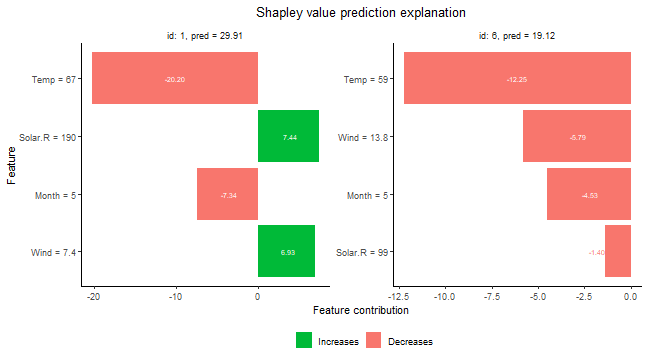

As a second example using `"ctree"` to condition on 1 and 2 features, and
`"empirical"` when conditioning on 3 features:


``` r
# Use the combined approach
explanation_combined <- explain(
  model = model,
  x_explain = x_explain,
  x_train = x_train,
  approach = c("ctree", "ctree", "empirical"),
  phi0 = p0
)
#> Note: Feature classes extracted from the model contains NA.
#> Assuming feature classes from the data are correct.
#> Success with message:
#> max_n_coalitions is NULL or larger than or 2^n_features = 16, 
#> and is therefore set to 2^n_features = 16.
#> 
#> ── Starting `shapr::explain()` at 2024-11-21 20:44:57 ────────────────────────────────────
#> • Model class: <xgb.Booster>
#> • Approach: ctree, ctree, and empirical
#> • Iterative estimation: FALSE
#> • Number of feature-wise Shapley values: 4
#> • Number of observations to explain: 6
#> • Computations (temporary) saved at: '/tmp/RtmpCcS4cy/shapr_obj_1b8c93207aeb18.rds'
#> 
#> ── Main computation started ──
#> 
#> ℹ Using 16 of 16 coalitions.
```

## Explain groups of features

In some cases, especially when the number of features is very large, it
may be more appropriate to explain predictions in terms of groups of
features instead of single features, see (@jullum2021efficient) for
intuition and real world examples. Explaining prediction in terms of
groups of features is very easy using `shapr`:


``` r
# Define the feature groups
group_list <- list(
  A = c("Temp", "Month"),
  B = c("Wind", "Solar.R")
)

# Use the empirical approach
explanation_group <- explain(
  model = model,
  x_explain = x_explain,
  x_train = x_train,
  approach = "empirical",
  phi0 = p0,
  group = group_list
)
#> Note: Feature classes extracted from the model contains NA.
#> Assuming feature classes from the data are correct.
#> Success with message:
#> max_n_coalitions is NULL or larger than or 2^n_groups = 4, 
#> and is therefore set to 2^n_groups = 4.
#> 
#> ── Starting `shapr::explain()` at 2024-11-21 20:44:59 ────────────────────────────────────
#> • Model class: <xgb.Booster>
#> • Approach: empirical
#> • Iterative estimation: FALSE
#> • Number of group-wise Shapley values: 2
#> • Number of observations to explain: 6
#> • Computations (temporary) saved at: '/tmp/RtmpCcS4cy/shapr_obj_1b8c93241851b9.rds'
#> 
#> ── Main computation started ──
#> 
#> ℹ Using 4 of 4 coalitions.
# Prints the group-wise explanations
explanation_group
#>    explain_id  none      A        B
#>         <int> <num>  <num>    <num>
#> 1:          1 43.09 -29.25  16.0731
#> 2:          2 43.09 -15.17  -7.8373
#> 3:          3 43.09 -13.07 -10.8778
#> 4:          4 43.09 -17.47   0.6653
#> 5:          5 43.09 -28.27   3.5289
#> 6:          6 43.09 -20.59  -3.3793
# Plots the group-wise explanations
plot(explanation_group, bar_plot_phi0 = TRUE, index_x_explain = c(1, 6))
```

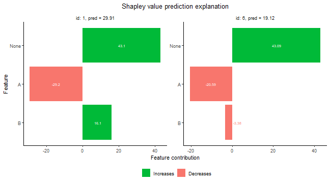

## Explain custom models

`shapr` currently natively supports explanation of predictions from
models fitted with the following functions:

-   `stats::lm`
-   `stats::glm`
-   `ranger::ranger`
-   `mgcv::gam`
-   `xgboost::xgboost`/`xgboost::xgb.train`
-   `workflows::workflow`

Any continuous response regression model or binary classification model
of these model classes, can be explained with the package directly as
exemplified above, while we give an example for the `workflows::workflow`
in the [`tidymodels`/`workflows`](#workflow_example) section.
Moreover, essentially any feature dependent
prediction model can be explained by the package by specifying two (or
one) simple additional functions for your model.

The first function is `predict_model`, taking the model
and data (as a `matrix` or `data.frame/data.table`) as input and
outputting the corresponding prediction as a numeric vector. The second
(optional, but highly recommended) function is `get_model_specs`, taking
the model as input and outputting a list with the following elements:
*labels* (vector with the feature names to compute Shapley values for),
*classes* (a named vector with the labels as names and the class type as
elements), *factor_levels* (a named list with the labels as names and
vectors with the factor levels as elements (NULL if the feature is not a
factor)). The `get_model_specs` function is used to check that the
format of the data passed to `explain` have the correct format in terms
of the necessary feature columns being available and having the correct
class/attributes. It is highly recommended to do such checks in order to
ensure correct usage of `explain`. If, for some reason, such checking is
not desirable, one does not have to provide the `get_model_specs`
function. This will, however, throw a warning that all feature
consistency checking against the model is disabled.

Once the above functions are created, you can explain predictions from
this model as before by passing the functions through the input
arguments `predict_model` and `get_model_specs` of `explain()`.

These functions **can** be made general enough to handle all supported
model types of that class, or they can be made minimal, possibly only
allowing explanation of the specific version of the model class at hand.
Below we give examples of both full support versions of these functions
and a minimal version which skips the `get_model_specs` function. We do
this for the `gbm` model class from the `gbm` package, fitted to the
same airquality data set as used above.


``` r
library(gbm)

formula_gbm <- as.formula(paste0(y_var, "~", paste0(x_var, collapse = "+")))
# Fitting a gbm model
set.seed(825)
model_gbm <- gbm::gbm(
  formula_gbm,
  data = cbind(x_train, Ozone = y_train),
  distribution = "gaussian"
)

#### Full feature versions of the three required model functions ####
MY_predict_model <- function(x, newdata) {
  if (!requireNamespace("gbm", quietly = TRUE)) {
    stop("The gbm package is required for predicting train models")
  }
  model_type <- ifelse(
    x$distribution$name %in% c("bernoulli", "adaboost"),
    "classification",
    "regression"
  )
  if (model_type == "classification") {
    predict(x, as.data.frame(newdata), type = "response", n.trees = x$n.trees)
  } else {
    predict(x, as.data.frame(newdata), n.trees = x$n.trees)
  }
}
MY_get_model_specs <- function(x) {
  feature_specs <- list()
  feature_specs$labels <- labels(x$Terms)
  m <- length(feature_specs$labels)
  feature_specs$classes <- attr(x$Terms, "dataClasses")[-1]
  feature_specs$factor_levels <- setNames(vector("list", m), feature_specs$labels)
  feature_specs$factor_levels[feature_specs$classes == "factor"] <- NA # model object doesn't contain factor levels info
  return(feature_specs)
}

# Compute the Shapley values
set.seed(123)
p0 <- mean(y_train)
explanation_custom <- explain(
  model = model_gbm,
  x_explain = x_explain,
  x_train = x_train,
  approach = "empirical",
  phi0 = p0,
  predict_model = MY_predict_model,
  get_model_specs = MY_get_model_specs
)
#> Success with message:
#> max_n_coalitions is NULL or larger than or 2^n_features = 16, 
#> and is therefore set to 2^n_features = 16.
#> 
#> ── Starting `shapr::explain()` at 2024-11-21 20:45:01 ────────────────────────────────────
#> • Model class: <gbm>
#> • Approach: empirical
#> • Iterative estimation: FALSE
#> • Number of feature-wise Shapley values: 4
#> • Number of observations to explain: 6
#> • Computations (temporary) saved at: '/tmp/RtmpCcS4cy/shapr_obj_1b8c933748f819.rds'
#> 
#> ── Main computation started ──
#> 
#> ℹ Using 16 of 16 coalitions.

# Plot results
plot(explanation_custom, index_x_explain = c(1, 6))
```

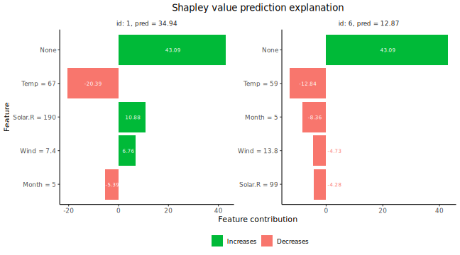

``` r


#### Minimal version of the custom model setup ####
# Note: Working only for this exact version of the model class
# Avoiding to define get_model_specs skips all feature
# consistency checking between your data and model
MY_MINIMAL_predict_model <- function(x, newdata) {
  predict(x, as.data.frame(newdata), n.trees = x$n.trees)
}

# Compute the Shapley values
set.seed(123)
explanation_custom_minimal <- explain(
  model = model_gbm,
  x_explain = x_explain,
  x_train = x_train,
  approach = "empirical",
  phi0 = p0,
  predict_model = MY_MINIMAL_predict_model
)
#> Note: You passed a model to explain() which is not natively supported, and did not supply a 'get_model_specs' function to explain().
#> Consistency checks between model and data is therefore disabled.
#> Success with message:
#> max_n_coalitions is NULL or larger than or 2^n_features = 16, 
#> and is therefore set to 2^n_features = 16.
#> 
#> ── Starting `shapr::explain()` at 2024-11-21 20:45:07 ────────────────────────────────────
#> • Model class: <gbm>
#> • Approach: empirical
#> • Iterative estimation: FALSE
#> • Number of feature-wise Shapley values: 4
#> • Number of observations to explain: 6
#> • Computations (temporary) saved at: '/tmp/RtmpCcS4cy/shapr_obj_1b8c9344b0ff8e.rds'
#> 
#> ── Main computation started ──
#> 
#> ℹ Using 16 of 16 coalitions.

# Plot results
plot(explanation_custom_minimal, index_x_explain = c(1, 6))
```

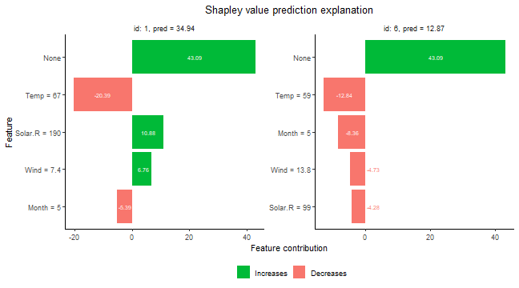

## Tidymodels and workflows {#workflow_example}
In this section, we demonstrate how to use `shapr` to explain `tidymodels` models fitted using `workflows`.
In the example [above](#examples), we directly used the `xgboost` package to fit the `xgboost` model.
However, we can also fit the `xgboost` model using the `tidymodels` package. These fits will be identical
as `tidymodels` calls `xgboost` internally. which we demonstrate in the example below. Note that we can replace
`xgboost` (i.e., `parsnip::boost_tree`) with any other fitted `tidymodels` in the `workflows` procedure outlined below.


``` r
# Fitting a basic xgboost model to the training data using tidymodels
set.seed(123) # Set the same seed as above
all_var <- c(y_var, x_var)
train <- data[-ind_x_explain, ..all_var]

# Fitting the `tidymodels` model using `workflows`
model_tidymodels <- parsnip::fit(
  workflows::add_recipe(
    workflows::add_model(
      workflows::workflow(),
      parsnip::boost_tree(trees = 20, engine = "xgboost", mode = "regression")
    ),
    recipes::recipe(Ozone ~ ., data = train)
  ),
  data = train
)

# # We can also specify the same model using pipes `%>%` by (if pipes are installed/loaded)
# model_tidymodels <-
#   workflows::workflow() %>%
#   workflows::add_model(parsnip::boost_tree(trees = 20, engine = "xgboost", mode = "regression")) %>%
#   workflows::add_recipe(recipes::recipe(Ozone ~ ., data = train)) %>%
#   parsnip::fit(data = train)

# See that the output of the two models are identical
all.equal(predict(model_tidymodels, x_train)$.pred, predict(model, as.matrix(x_train)))
#> [1] TRUE

# Create the Shapley values for the tidymodels version
explanation_tidymodels <- explain(
  model = model_tidymodels,
  x_explain = x_explain,
  x_train = x_train,
  approach = "empirical",
  phi0 = p0
)
#> Success with message:
#> max_n_coalitions is NULL or larger than or 2^n_features = 16, 
#> and is therefore set to 2^n_features = 16.
#> 
#> ── Starting `shapr::explain()` at 2024-11-21 20:45:13 ────────────────────────────────────
#> • Model class: <workflow>
#> • Approach: empirical
#> • Iterative estimation: FALSE
#> • Number of feature-wise Shapley values: 4
#> • Number of observations to explain: 6
#> • Computations (temporary) saved at: '/tmp/RtmpCcS4cy/shapr_obj_1b8c93476395f2.rds'
#> 
#> ── Main computation started ──
#> 
#> ℹ Using 16 of 16 coalitions.

# See that the Shapley value explanations are identical too
all.equal(explanation$shapley_values_est, explanation_tidymodels$shapley_values_est)
#> [1] TRUE
```

## The parameters of the `vaeac` approach

The `vaeac` approach is a very flexible method that supports mixed data. The main
parameters are the the number of layers in the networks (`vaeac.depth`), the width of the layers
(`vaeac.width`), the number of dimensions in the latent space (`vaeac.latent_dim`),
the activation function between the layers in the networks (`vaeac.activation_function`),
the learning rate in the ADAM optimizer (`vaeac.lr`), the number of `vaeac` models to initiate
to remedy poorly initiated model parameter values (`vaeac.n_vaeacs_initialize`), and
the number of learning epochs (`vaeac.epochs`). Call `?shapr::setup_approach.vaeac` for
a more detailed description of the parameters.

There are additional extra parameters which can be set by including a named list in the call to
the `explain()` function. For example, we can the change the batch size to 32 by including
`vaeac.extra_parameters = list(vaeac.batch_size = 32)` as a parameter in the call the `explain()` function. See `?shapr::vaeac_get_extra_para_default` for a description of the possible
extra parameters to the `vaeac` approach.
The main parameters are directly entered to the `explain()` function, while the extra parameters are included in a
named list called `vaeac.extra_parameters`.


``` r
explanation_vaeac <- explain(
  model = model,
  x_explain = x_explain,
  x_train = x_train,
  approach = "vaeac",
  phi0 = p0,
  n_MC_samples = 100,
  vaeac.width = 16,
  vaeac.depth = 2,
  vaeac.epochs = 3,
  vaeac.n_vaeacs_initialize = 2
)
#> Note: Feature classes extracted from the model contains NA.
#> Assuming feature classes from the data are correct.
#> Success with message:
#> max_n_coalitions is NULL or larger than or 2^n_features = 16, 
#> and is therefore set to 2^n_features = 16.
#> 
#> ── Starting `shapr::explain()` at 2024-11-21 20:45:19 ────────────────────────────────────
#> • Model class: <xgb.Booster>
#> • Approach: vaeac
#> • Iterative estimation: FALSE
#> • Number of feature-wise Shapley values: 4
#> • Number of observations to explain: 6
#> • Computations (temporary) saved at: '/tmp/RtmpCcS4cy/shapr_obj_1b8c932349a0b1.rds'
#> 
#> ── Main computation started ──
#> 
#> ℹ Using 16 of 16 coalitions.
```

Can look at the training and validation error for the trained `vaeac` model and see that `vaeac.epochs = 3`
is likely to few epochs as it still seems like the `vaeac` model is learning.

``` r
# Look at the training and validation errors.
plot_vaeac_eval_crit(list("Vaeac 3 epochs" = explanation_vaeac), plot_type = "method")
```


### Early stopping
If we are uncertain about the choice of `vaeac.epochs`, we can rather use `vaeac` with early stopping.
We will then set `vaeac.epochs` to a large number which will act as a maximum number of allowed epochs
and in the `vaeac.extra_parameters` list, we set `vaeac.epochs_early_stopping` the number of epochs we
allow the `vaeac` model to not improve its validation score. That is, if `vaeac.epochs_early_stopping = 2`,
then `vaeac` will stop the training procedure if there has been no improvement in the validation score
for `2` consecutive epochs, of if `vaeac.epochs` is reached. Note that if using early stopping and progress
updates simultaneously, then the estimated timer remaining will obviously be incorrect if early stopping
is applied. Furthermore, a value of `2` is too low for real world applications, but we set it so low here
to make the vignette faster to build.


``` r
explanation_vaeac_early_stop <- explain(
  model = model,
  x_explain = x_explain,
  x_train = x_train,
  approach = "vaeac",
  phi0 = p0,
  n_MC_samples = 100,
  vaeac.width = 16,
  vaeac.depth = 2,
  vaeac.epochs = 1000, # Set it to a large number
  vaeac.n_vaeacs_initialize = 2,
  vaeac.extra_parameters = list(vaeac.epochs_early_stopping = 2)
)
#> Note: Feature classes extracted from the model contains NA.
#> Assuming feature classes from the data are correct.
#> Success with message:
#> max_n_coalitions is NULL or larger than or 2^n_features = 16, 
#> and is therefore set to 2^n_features = 16.
#> 
#> ── Starting `shapr::explain()` at 2024-11-21 20:45:34 ────────────────────────────────────
#> • Model class: <xgb.Booster>
#> • Approach: vaeac
#> • Iterative estimation: FALSE
#> • Number of feature-wise Shapley values: 4
#> • Number of observations to explain: 6
#> • Computations (temporary) saved at: '/tmp/RtmpCcS4cy/shapr_obj_1b8c9361ebec61.rds'
#> 
#> ── Main computation started ──
#> 
#> ℹ Using 16 of 16 coalitions.
```

Can compare with the previous version and see that the results are more stable now.

``` r
# Look at the training and validation errors.
plot_vaeac_eval_crit(
  list("Vaeac 3 epochs" = explanation_vaeac, "Vaeac early stopping" = explanation_vaeac_early_stop),
  plot_type = "method"
)
```

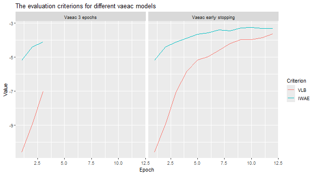

Can also compare the $MSE_{v}$ evaluation scores.


``` r
plot_MSEv_eval_crit(list("Vaeac 3 epochs" = explanation_vaeac, "Vaeac early stopping" = explanation_vaeac_early_stop))
```

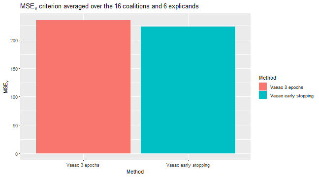

## Continued computation {#cont_computation}
In this section, we demonstrate how to continue to improve estimation accuracy with additional coalition samples,
from a previous Shapley value computation based on `shapr::explain()` with the iterative estimation procedure.
This can be done either by passing an existing object of class `shapr`, or by passing a string with the path to
the intermediately saved results.
The latter is found at `SHAPR_OBJ$saving_path`, defaults to a temporary folder,
and is updated after each iteration.
This can be particularly handy for long-running computations.


``` r
# First we run the computation with the iterative estimation procedure for a limited number of coalition samples
library(xgboost)
library(data.table)

data("airquality")
data <- data.table::as.data.table(airquality)
data <- data[complete.cases(data), ]

x_var <- c("Solar.R", "Wind", "Temp", "Month", "Day")
y_var <- "Ozone"

ind_x_explain <- 1:6
x_train <- data[-ind_x_explain, ..x_var]
y_train <- data[-ind_x_explain, get(y_var)]
x_explain <- data[ind_x_explain, ..x_var]

# Set seed for reproducibility
set.seed(123)

# Fitting a basic xgboost model to the training data
model <- xgboost::xgboost(
  data = as.matrix(x_train),
  label = y_train,
  nround = 20,
  verbose = FALSE
)

# Specifying the phi_0, i.e. the expected prediction without any features
p0 <- mean(y_train)

# Initial explanation computation
ex_init <- explain(
  model = model,
  x_explain = x_explain,
  x_train = x_train,
  approach = "gaussian",
  phi0 = p0,
  max_n_coalitions = 20,
  iterative = TRUE
)
#> Note: Feature classes extracted from the model contains NA.
#> Assuming feature classes from the data are correct.
#> 
#> ── Starting `shapr::explain()` at 2024-11-21 20:45:57 ────────────────────────────────────
#> • Model class: <xgb.Booster>
#> • Approach: gaussian
#> • Iterative estimation: TRUE
#> • Number of feature-wise Shapley values: 5
#> • Number of observations to explain: 6
#> • Computations (temporary) saved at: '/tmp/RtmpCcS4cy/shapr_obj_1b8c93667c79.rds'
#> 
#> ── iterative computation started ──
#> 
#> ── Iteration 1 ───────────────────────────────────────────────────────────────────────────
#> ℹ Using 5 of 32 coalitions, 5 new.
#> 
#> ── Iteration 2 ───────────────────────────────────────────────────────────────────────────
#> ℹ Using 10 of 32 coalitions, 4 new.
#> 
#> ── Iteration 3 ───────────────────────────────────────────────────────────────────────────
#> ℹ Using 12 of 32 coalitions, 2 new.
#> 
#> ── Iteration 4 ───────────────────────────────────────────────────────────────────────────
#> ℹ Using 16 of 32 coalitions, 4 new.
#> 
#> ── Iteration 5 ───────────────────────────────────────────────────────────────────────────
#> ℹ Using 18 of 32 coalitions, 2 new.

# Using the ex_init object to continue the computation with 5 more coalition samples
ex_further <- explain(
  model = model,
  x_explain = x_explain,
  x_train = x_train,
  approach = "gaussian",
  phi0 = p0,
  max_n_coalitions = 25,
  iterative_args = list(convergence_tol = 0.005), # Decrease the convergence threshold
  prev_shapr_object = ex_init
)
#> Note: Feature classes extracted from the model contains NA.
#> Assuming feature classes from the data are correct.
#> 
#> ── Starting `shapr::explain()` at 2024-11-21 20:46:01 ────────────────────────────────────
#> • Model class: <xgb.Booster>
#> • Approach: gaussian
#> • Iterative estimation: FALSE
#> • Number of feature-wise Shapley values: 5
#> • Number of observations to explain: 6
#> • Computations (temporary) saved at: '/tmp/RtmpCcS4cy/shapr_obj_1b8c937cd2ac71.rds'
#> 
#> ── Main computation started ──
#> 
#> ℹ Using 24 of 32 coalitions.

print(ex_further$saving_path)
#> [1] "/tmp/RtmpCcS4cy/shapr_obj_1b8c937cd2ac71.rds"

# Using the ex_init object to continue the computation for the remaining coalition samples
# but this time using the path to the saved intermediate estimation object
ex_even_further <- explain(
  model = model,
  x_explain = x_explain,
  x_train = x_train,
  approach = "gaussian",
  phi0 = p0,
  max_n_coalitions = NULL,
  prev_shapr_object = ex_further$saving_path
)
#> Note: Feature classes extracted from the model contains NA.
#> Assuming feature classes from the data are correct.
#> Success with message:
#> max_n_coalitions is NULL or larger than or 2^n_features = 32, 
#> and is therefore set to 2^n_features = 32.
#> 
#> ── Starting `shapr::explain()` at 2024-11-21 20:46:02 ────────────────────────────────────
#> • Model class: <xgb.Booster>
#> • Approach: gaussian
#> • Iterative estimation: FALSE
#> • Number of feature-wise Shapley values: 5
#> • Number of observations to explain: 6
#> • Computations (temporary) saved at: '/tmp/RtmpCcS4cy/shapr_obj_1b8c936aa37ec8.rds'
#> 
#> ── Main computation started ──
#> 
#> ℹ Using 32 of 32 coalitions.
```


# Explaining a forecasting model using `explain_forecast` {#forecasting}

`shapr` provides a specific function, `explain_forecast`, to explain
forecasts from time series models, at one or more steps into the future.
The main difference compared to `explain` is that the data is supplied
as (set of) time series, in addition to index arguments (`train_idx` and
`explain_idx`) specifying which time points that represents the train
and explain parts of the data. See `?explain_forecast` for more
information.

To demonstrate how to use the function, 500 observations are generated
which follow an AR(1) structure, i.e.
$y_t = 0.5 y_{t-1} + \varepsilon_t$. To this data an arima model of
order (2, 0, 0) is fitted, and we therefore would like to explain the
forecasts in terms of the two previous lags of the time series. This is
is specified through the argument `explain_y_lags = 2`. Note that some
models may also put restrictions on the amount of data required to make
a forecast. The AR(2) model we used there, for instance, requires two
previous time point to make a forecast.

In the example, two separate forecasts, each three steps ahead, are
explained. To set the starting points of the two forecasts,
`explain_idx` is set to `499:500`. This means that one forecast of
$t = (500, 501, 502)$ and another of $t = (501, 502, 503)$, will be
explained. In other words, `explain_idx` tells `shapr` at which points
in time data was available up until, when making the forecast to
explain.

In the same way, `train_idx` denotes the points in time used to estimate
the conditional expectations used to explain the different forecasts.
Note that since we want to explain the forecasts in terms of the two
previous lags (`explain_y_lags = 2`), the smallest value of `train_idx`
must also be 2, because at time $t = 1$ there was only a single
observation available.

Since the data is stationary, the mean of the data is used as value of
`phi0` (i.e. $\phi_0$). This can however be chosen
differently depending on the data and application.

For a multivariate model such as a VAR (Vector AutoRegressive model), it
may be more interesting to explain the impact of each variable,
rather than each lag of each variable. This can be done by setting
`group_lags = TRUE`.


``` r
# Simulate time series data with AR(1)-structure.
set.seed(1)
data_ts <- data.frame(Y = arima.sim(list(order = c(1, 0, 0), ar = .5), n = 500))
data_ts <- data.table::as.data.table(data_ts)

# Fit an ARIMA(2, 0, 0) model.
arima_model <- arima(data_ts, order = c(2, 0, 0))

# Set prediction zero as the mean of the data for each forecast point.
p0_ar <- rep(mean(data_ts$Y), 3)

# Explain forecasts from points t = 499 and t = 500.
explain_idx <- 499:500

explanation_forecast <- explain_forecast(
  model = arima_model,
  y = data_ts,
  train_idx = 2:498,
  explain_idx = 499:500,
  explain_y_lags = 2,
  horizon = 3,
  approach = "empirical",
  phi0 = p0_ar,
  group_lags = FALSE
)
#> Note: Feature names extracted from the model contains NA.
#> Consistency checks between model and data is therefore disabled.
#> Success with message:
#> max_n_coalitions is NULL or larger than or 2^n_features = 4, 
#> and is therefore set to 2^n_features = 4.
#> 
#> ── Starting `shapr::explain()` at 2024-11-21 20:46:03 ────────────────────────────────────
#> • Model class: <Arima>
#> • Approach: empirical
#> • Iterative estimation: FALSE
#> • Number of feature-wise Shapley values: 2
#> • Number of observations to explain: 2
#> • Computations (temporary) saved at: '/tmp/RtmpCcS4cy/shapr_obj_1b8c931eee7980.rds'
#> 
#> ── Main computation started ──
#> 
#> ℹ Using 4 of 4 coalitions.
explanation_forecast
#>    explain_idx horizon    none     Y.1      Y.2
#>          <int>   <int>   <num>   <num>    <num>
#> 1:         499       1 0.04018  0.5053 -0.07659
#> 2:         500       1 0.04018 -0.3622  0.02497
#> 3:         499       2 0.04018  0.5053 -0.07659
#> 4:         500       2 0.04018 -0.3622  0.02497
#> 5:         499       3 0.04018  0.5053 -0.07659
#> 6:         500       3 0.04018 -0.3622  0.02497
```

Note that for a multivariate model such as a VAR (Vector AutoRegressive
model), or for models also including several exogenous variables, it may
be of more informative to explain the impact of each variable, rather
than each lag of each variable. This can be done by setting
`group_lags = TRUE`. This does not make sense for this model, however,
as that would result in decomposing the forecast into a single group.

We now give a more hands on example of how to use the `explain_forecast`
function. Say that we have an AR(2) model which describes the change
over time of the variable `Temp` in the dataset `airquality`. It seems
reasonable to assume that the temperature today should affect the
temperature tomorrow. To a lesser extent, we may also suggest that the
temperature today should also have an impact on that of the day after
tomorrow.

We start by building our AR(2) model, naming it `model_ar_temp`. This
model is then used to make a forecast of the temperature of the day that
comes after the last day in the data, this forecast starts from index
153.


``` r
data_ts2 <- data.table::as.data.table(airquality)

model_ar_temp <- ar(data_ts2$Temp, order = 2)

predict(model_ar_temp, n.ahead = 2)$pred
#> Time Series:
#> Start = 154 
#> End = 155 
#> Frequency = 1 
#> [1] 71.081 71.524
```

First, we pass the model and the data as `model` and `y`. Since we have
an AR(2) model, we want to explain the forecasts in terms of the two
previous lags, which we specify with `explain_y_lags = 2`. Then, we let
`shapr` know which time indices to use as training data through the
argument `train_idx`. We use `2:152`, meaning that we skip the first
index, as we want to explain the two previous lags. Letting the training
indices go up until 152 means that every point in time except the first
and last will be used as training data.

The last index, 153 is passed as the argument `explain_idx`, which means
that we want to explain a forecast made from time point 153 in the data.
The argument `horizon` is set to 2 in order to explain a forecast of
length 2.

The argument `phi0` is set to the mean of the time series,
and is repeated two times. Each value of `phi0` is the
baseline for each forecast horizon. In our example, we assume that given
no effect from the two lags, the temperature would just be the average
during the observed period. Finally, we opt to not group the lags by
setting `group_lags` to `FALSE`. This means that lag 1 and 2 will be
explained separately. Grouping lags may be more interesting to do in a
model with multiple variables, as it is then possible to explain each
variable separately.


``` r
explanation_forecast <- explain_forecast(
  model = model_ar_temp,
  y = data_ts2[, "Temp"],
  train_idx = 2:152,
  explain_idx = 153,
  explain_y_lags = 2,
  horizon = 2,
  approach = "empirical",
  phi0 = rep(mean(data$Temp), 2),
  group_lags = FALSE
)
#> Note: Feature names extracted from the model contains NA.
#> Consistency checks between model and data is therefore disabled.
#> Success with message:
#> max_n_coalitions is NULL or larger than or 2^n_features = 4, 
#> and is therefore set to 2^n_features = 4.
#> 
#> ── Starting `shapr::explain()` at 2024-11-21 20:46:05 ────────────────────────────────────
#> • Model class: <ar>
#> • Approach: empirical
#> • Iterative estimation: FALSE
#> • Number of feature-wise Shapley values: 2
#> • Number of observations to explain: 1
#> • Computations (temporary) saved at: '/tmp/RtmpCcS4cy/shapr_obj_1b8c9360892168.rds'
#> 
#> ── Main computation started ──
#> 
#> ℹ Using 4 of 4 coalitions.

print(explanation_forecast)
#>    explain_idx horizon  none Temp.1 Temp.2
#>          <num>   <num> <num>  <num>  <num>
#> 1:         153       1 77.79 -6.578 -0.134
#> 2:         153       2 77.79 -5.980 -0.288
```

The results are presented per value of `explain_idx` and forecast
horizon. We can see that the mean temperature was around 77.9 degrees.
At horizon 1, the first lag in the model caused it to be 6.6 degrees
lower, and the second lag had just a minor effect. At horizon 2, the
first lag has a slightly smaller negative impact, and the second lag has
a slightly larger impact.

It is also possible to explain a forecasting model which uses exogenous
regressors. The previous example is expanded to use an ARIMA(2,0,0)
model with `Wind` as an exogenous regressor. Since the exogenous
regressor must be available for the predicted time points, the model is
just fit on the 151 first observations, leaving two observations of
`Wind` to be used as exogenous values during the prediction phase.


``` r
data_ts3 <- data.table::as.data.table(airquality)

data_fit <- data_ts3[seq_len(151), ]

model_arimax_temp <- arima(data_fit$Temp, order = c(2, 0, 0), xreg = data_fit$Wind)

newxreg <- data_ts3[-seq_len(151), "Wind", drop = FALSE]

predict(model_arimax_temp, n.ahead = 2, newxreg = newxreg)$pred
#> Time Series:
#> Start = 152 
#> End = 153 
#> Frequency = 1 
#> [1] 77.500 76.381
```

The `shapr` package can then explain not only the two autoregressive
lags, but also the single lag of the exogenous regressor. In order to do
so, the `Wind` variable is passed as the argument `xreg`, and
`explain_xreg_lags` is set to 1. Notice how only the first 151
observations are used for `y` and all 153 are used for `xreg`. This
makes it possible for `shapr` to not only explain the effect of the
first lag of the exogenous variable, but also the contemporary effect
during the forecasting period.


``` r
explanation_forecast <- explain_forecast(
  model = model_ar_temp,
  y = data_fit[, "Temp"],
  xreg = data_ts3[, "Wind"],
  train_idx = 2:150,
  explain_idx = 151,
  explain_y_lags = 2,
  explain_xreg_lags = 1,
  horizon = 2,
  approach = "empirical",
  phi0 = rep(mean(data_fit$Temp), 2),
  group_lags = FALSE
)
#> Note: Feature names extracted from the model contains NA.
#> Consistency checks between model and data is therefore disabled.
#> Success with message:
#> max_n_coalitions is NULL or larger than or 2^n_features = 32, 
#> and is therefore set to 2^n_features = 32.
#> 
#> ── Starting `shapr::explain()` at 2024-11-21 20:46:07 ────────────────────────────────────
#> • Model class: <ar>
#> • Approach: empirical
#> • Iterative estimation: FALSE
#> • Number of feature-wise Shapley values: 5
#> • Number of observations to explain: 1
#> • Computations (temporary) saved at: '/tmp/RtmpCcS4cy/shapr_obj_1b8c93398eb42e.rds'
#> 
#> ── Main computation started ──
#> 
#> ℹ Using 32 of 32 coalitions.

print(explanation_forecast$shapley_values_est)
#>    explain_idx horizon  none   Temp.1   Temp.2  Wind.1  Wind.F1  Wind.F2
#>          <num>   <num> <num>    <num>    <num>   <num>    <num>    <num>
#> 1:         151       1 77.96 -0.67793 -0.67340 -1.2688 0.493408       NA
#> 2:         151       2 77.96  0.39968 -0.50059 -1.4655 0.065913 -0.47422
```


# References
