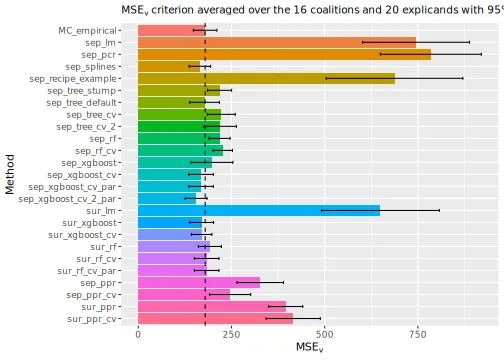
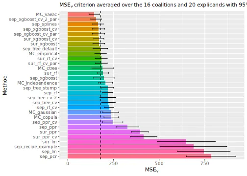
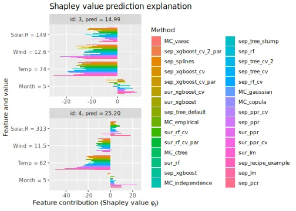
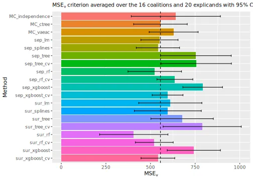
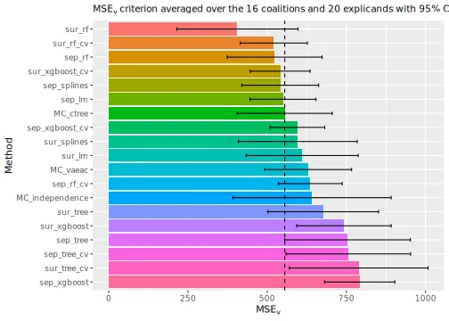
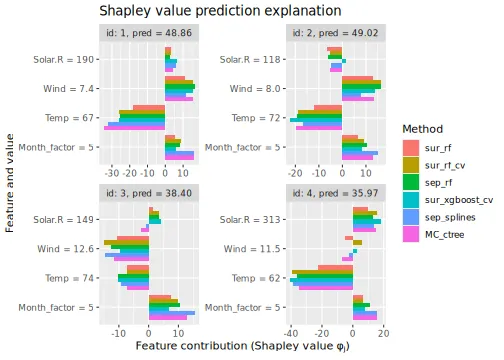

This vignette elaborates and demonstrates the regression
paradigm explained in @olsen2024comparative. We describe
how to specify the regression model, how to enable automatic
cross-validation of the model's hyperparameters, and applying
pre-processing steps to the data before fitting the regression
models. We refer to @olsen2024comparative for when one should
use the different paradigms, method classes, and methods.

@olsen2024comparative divides the regression paradigm into
the separate and surrogate regression method classes. In this
vignette, we briefly introduce the two method classes. For an
in-depth explanation, we refer the reader to Sections 3.5 and
3.6 in @olsen2024comparative.

Briefly stated, the regression paradigm uses regression
models to directly estimate the contribution function
$v(S) = E[f(\boldsymbol{x})|\boldsymbol{x}_S = \boldsymbol{x}_S^*]$.
The separate regression method class fits a separate regression
model for each coalition $S$, while the surrogate regression
method class fits a single regression model to simultaneously
predict the contribution function for all coalitions.

The `shapr` package supports any regression model from the
popular `tidymodels` package developed by @tidymodels. The
[`tidymodels`](https://www.tidymodels.org/) framework is a
collection of packages for modeling and machine learning
using [`tidyverse`](https://tidyverse.org/) principles.
Some packages included in the `tidymodels` framework are
`parsnip`, `recipes`, `workflows`, `tune`, and `rsample`;
see the [setup](#setup) section below for more examples.
Furthermore, click [here](https://www.tidymodels.org/find/parsnip/)
to access the complete list of supported regression models
in the `tidymodels` package. There are currently 80 supported
models, but the framework also allows adding regression models not
already implemented in `tidymodels`.
It is also possible to apply a wide range of pre-processing data
steps. For instance, we can either apply the linear regression model directly to
the data or pre-process the data to compute principal components
(principal component regression) before fitting the linear regression to
the first few eigenvectors (processed features), see the [pre-process](#separate_preproc) section for an example.
In the [add new regression methods](#new) section, we demonstrate how to incorporate the projection pursuit regression model into the `tidymodels` framework.

Note that our framework does not currently support model
formulas with special terms. For example, we do not support
`parsnip::gen_additive_mod` (i.e., `mgcv::gam()`) as it uses
a non-standard notion in its formulas (in this case, the
`s(feature, k = 2)` function). See `?parsnip::model_formula()`
for more information. However, this hurdle is overcome by
pre-processing data steps containing spline functions, which
we showcase in the [pre-process](#separate_preproc) section for the
separate regression method class.

In the [mixed data](#mixed) section, we demonstrate that the
regression-based methods work on mixed data, too. However, we must
add a pre-processing step for the regression models that do not
natively support categorical data to encode the categorical features.

We use the same data and predictive models in this
vignette as in the general usage.

See the end of the [continuous data](#summary_figures) and
[mixed data](#summary_mixed) sections for summary figures of all the
methods used in this vignette to compute the Shapley value explanations.


# The separate regression method class {#separate}

In the `regression_separate` methods, we train a new regression
model $g_S(\boldsymbol{x}_S)$ to estimate the conditional expectation
for each coalition of features.

The idea is to estimate
$v(S) = E[f(\boldsymbol{x})|\boldsymbol{x}_S = \boldsymbol{x}_S^*] = E[f(\boldsymbol{x}_{\bar{S}},\boldsymbol{x}_S)|\boldsymbol{x}_S=\boldsymbol{x}_S^*]$
separately for each coalition $S$ using regression. Let
$\mathcal{D} = \{ \boldsymbol{x}^{[i]}, y^{[i]} \}_{i=1}^{N_{\text{train}}}$
denote the training data, where $\boldsymbol{x}^{[i]}$ is the $i$th
$M$-dimensional input and $y^{[i]}$ is the associated response.
For each coalition $S \subseteq \{1,2,\dots,M\}$, the corresponding
training data set is
\begin{align*}
            \mathcal{D}_S
            =
            \{\boldsymbol{x}_S^{[i]}, f(\underbrace{\boldsymbol{x}_\bar{S}^{[i]}, \boldsymbol{x}_S^{[i]}}_{\boldsymbol{x}^{[i]}})\}_{i=1}^{N_{\text{train}}}
            =
            \{\boldsymbol{x}_S^{[i]}, \underbrace{f(\boldsymbol{x}^{[i]})}_{z^{[i]}}\}_{i=1}^{N_{\text{train}}}
            =
            \{\boldsymbol{x}_S^{[i]}, z^{[i]}\}_{i=1}^{N_{\text{train}}}.
\end{align*}

For each data set $\mathcal{D}_S$, we train a regression model
$g_S(\boldsymbol{x}_S)$ with respect to the mean squared error
loss function. That is, we fit a regression model where the
prediction $f(\boldsymbol{x})$ is acting as the response and
the feature subset of coalition $S$, $\boldsymbol{x}_S$, is
acting as the available features. The optimal model, with
respect to the loss function, is
$g^*_S(\boldsymbol{x}_S) = E[z|\boldsymbol{x}_S] = E[f(\boldsymbol{x}_\bar{S}, \boldsymbol{x}_S)|\boldsymbol{x}_S]$,
which corresponds to the contribution function $v(S)$. The
regression model $g_S$ aims for the optimal, hence, it
resembles/estimates the contribution function, i.e.,
$g_S(\boldsymbol{x}_S) = \hat{v}(S) \approx v(S) = E[f(\boldsymbol{x}_\bar{S}, \boldsymbol{x}_S) | \boldsymbol{x}_S = \boldsymbol{x}_S^*]$.


## Code {#separate_code}

In this supplementary vignette, we use the same data and explain
the same model type as in the general usage. We train a simple
`xgboost` model on the `airquality` dataset and demonstrate how
to use the `shapr` and the separate regression method class to
explain the individual predictions.


### Setup {#setup}

First, we set up the `airquality` dataset and train an `xgboost`
model, whose predictions we want to explain using the Shapley value
explanation framework. We import all packages in the `tidymodels`
framework in the code chunk below, but we could have specified them
directly, too. In this vignette, we use the following packages in
the `tidymodels` framework: `parsnip`, `recipes`, `workflows`,
`dials`, `hardhat`, `tibble`, `rlang`, and `ggplot2`. We include the
`package::function()` notation throughout this vignette to indicate
which package the functions originate from in the `tidymodels` framework.


``` r
# Either use `library(tidymodels)` or separately specify the libraries indicated above
library(tidymodels)
library(shapr)

# Ensure that shapr's functions are prioritized, otherwise we need to use the `shapr::`
# prefix when calling explain(). The `conflicted` package is imported by `tidymodels`.
conflicted::conflicts_prefer(shapr::explain, shapr::prepare_data)
```


``` r
# Other libraries
library(xgboost)
library(data.table)

data("airquality")
data <- data.table::as.data.table(airquality)
data <- data[complete.cases(data), ]

x_var <- c("Solar.R", "Wind", "Temp", "Month")
y_var <- "Ozone"

ind_x_explain <- 1:20
x_train <- data[-ind_x_explain, ..x_var]
y_train <- data[-ind_x_explain, get(y_var)]
x_explain <- data[ind_x_explain, ..x_var]

# Fitting a basic xgboost model to the training data
set.seed(123) # Set seed for reproducibility
model <- xgboost::xgboost(
  x = x_train,
  y = y_train,
  nround = 20,
  verbosity = 0
)

# Specifying the phi_0, i.e. the expected prediction without any features
p0 <- mean(y_train)

# List to store all the explanation objects
explanation_list <- list()
```

To make the rest of the vignette easier to follow, we create some helper
functions that plot and summarize the results of the explanation methods.
This code block is optional to understand and can be skipped.


``` r
# Plot the MSEv criterion scores as horizontal bars and add dashed line of one method's score
plot_MSEv_scores <- function(explanation_list, method_line = NULL) {
  fig <- plot_MSEv_eval_crit(explanation_list) +
    ggplot2::theme(legend.position = "none") +
    ggplot2::coord_flip() +
    ggplot2::theme(plot.title = ggplot2::element_text(size = ggplot2::rel(0.95)))
  fig <- fig + ggplot2::scale_x_discrete(limits = rev(levels(fig$data$Method)))
  if (!is.null(method_line) && method_line %in% fig$data$Method) {
    fig <- fig + ggplot2::geom_hline(
      yintercept = fig$data$MSEv[fig$data$Method == method_line],
      linetype = "dashed",
      color = "black"
    )
  }
  return(fig)
}

# Extract the MSEv criterion scores and elapsed times
print_MSEv_scores_and_time <- function(explanation_list) {
  res <- as.data.frame(t(sapply(
    explanation_list,
    function(explanation) {
      round(c(explanation$MSEv$MSEv$MSEv, explanation$timing$summary$total_time_secs), 2)
    }
  )))
  colnames(res) <- c("MSEv", "Time")
  return(res)
}

# Extract the k best methods in decreasing order
get_k_best_methods <- function(explanation_list, k_best) {
  res <- print_MSEv_scores_and_time(explanation_list)
  return(rownames(res)[order(res$MSEv)[seq(k_best)]])
}
```

To establish a baseline against which to compare the regression methods,
we will compare them with the Monte Carlo-based `empirical` approach
with default hyperparameters. In the last section, we include all Monte
Carlo-based methods implemented in `shapr` to make an extensive comparison.


``` r
# Compute the Shapley value explanations using the empirical method
explanation_list$MC_empirical <- explain(
  model = model,
  x_explain = x_explain,
  x_train = x_train,
  approach = "empirical",
  phi0 = p0,
  seed = 1
)
#>
#> ── Starting `shapr::explain()` at 2025-12-20 11:40:52 ──────────────
#> ℹ `max_n_coalitions` is `NULL` or larger than `2^n_features = 16`,
#>   and is therefore set to `2^n_features = 16`.
#>
#>
#> ── Explanation overview ──
#>
#>
#>
#> • Model class: <xgboost>
#>
#> • v(S) estimation class: Monte Carlo integration
#>
#> • Approach: empirical
#>
#> • Procedure: Non-iterative
#>
#> • Number of Monte Carlo integration samples: 1000
#>
#> • Number of feature-wise Shapley values: 4
#>
#> • Number of observations to explain: 20
#>
#> • Computations (temporary) saved at:
#> '/tmp/RtmpP6cesG/shapr_obj_781db488cb3ff.rds'
#>
#>
#>
#> ── Main computation started ──
#>
#>
#>
#> ℹ Using 16 of 16 coalitions.
```


### Linear regression model
Then we compute the Shapley value explanations using a linear
regression model and the separate regression method class.


``` r
explanation_list$sep_lm <- explain(
  model = model,
  x_explain = x_explain,
  x_train = x_train,
  phi0 = p0,
  approach = "regression_separate",
  regression.model = parsnip::linear_reg()
)
#>
#> ── Starting `shapr::explain()` at 2025-12-20 11:41:01 ──────────────
#> ℹ `max_n_coalitions` is `NULL` or larger than `2^n_features = 16`,
#>   and is therefore set to `2^n_features = 16`.
#>
#>
#> ── Explanation overview ──
#>
#>
#>
#> • Model class: <xgboost>
#>
#> • v(S) estimation class: Regression
#>
#> • Approach: regression_separate
#>
#> • Procedure: Non-iterative
#>
#> • Number of feature-wise Shapley values: 4
#>
#> • Number of observations to explain: 20
#>
#> • Computations (temporary) saved at:
#> '/tmp/RtmpP6cesG/shapr_obj_781db677c0f7f.rds'
#>
#>
#>
#> ── Main computation started ──
#>
#>
#>
#> ℹ Using 16 of 16 coalitions.
```

A linear model is often not flexible enough to properly model the
contribution function. Thus, it can produce inaccurate Shapley value
explanations. The figure below shows that the `empirical` approach
outperforms the linear regression model approach quite significantly
concerning the $\operatorname{MSE}_v$ evaluation criterion.


``` r
plot_MSEv_scores(explanation_list)
#> ℹ Showing 10 of 20 observations.
```


### Pre-processing {#separate_preproc}

This section describes how to pre-process the data before
fitting the separate regression models. We demonstrate this
for the linear regression model, but we can apply this
pre-processing to other regression methods.

The `recipes` package in the `tidymodels` framework contains
many functions to pre-process the data before fitting the model,
for example, normalization, interaction, encodings, and
transformations (e.g., log, splines, pls, pca). Click
[here](https://recipes.tidymodels.org/reference/index.html)
to access a complete list of all available functions. The list
also contains functions for helping us select which features
to apply the functions to, e.g., `recipes::all_predictors()`,
`recipes::all_numeric_predictors()`, and `recipes::all_factor_predictors()`
apply the functions to all features, only the numerical features,
and only the factor features, respectively. We can also specify
the names of the features to which the functions are applied.
However, as the included features change in each coalition,
we need to check that the feature we want to apply the function
to is present in the dataset. We give an example of this below.

First, we demonstrate how to compute the principal components
and use (up to) the first two components for each separate
linear regression model. We write "up to" as we can only compute
a single principal component for the singleton coalitions, i.e.,
the feature itself. This regression model is called principal
component regression.


``` r
explanation_list$sep_pcr <- explain(
  model = model,
  x_explain = x_explain,
  x_train = x_train,
  phi0 = p0,
  seed = 1,
  approach = "regression_separate",
  regression.model = parsnip::linear_reg(),
  regression.recipe_func = function(regression_recipe) {
    return(recipes::step_pca(regression_recipe, recipes::all_numeric_predictors(), num_comp = 2))
  }
)
#>
#> ── Starting `shapr::explain()` at 2025-12-20 11:41:02 ──────────────
#> ℹ `max_n_coalitions` is `NULL` or larger than `2^n_features = 16`,
#>   and is therefore set to `2^n_features = 16`.
#>
#>
#> ── Explanation overview ──
#>
#>
#>
#> • Model class: <xgboost>
#>
#> • v(S) estimation class: Regression
#>
#> • Approach: regression_separate
#>
#> • Procedure: Non-iterative
#>
#> • Number of feature-wise Shapley values: 4
#>
#> • Number of observations to explain: 20
#>
#> • Computations (temporary) saved at:
#> '/tmp/RtmpP6cesG/shapr_obj_781db692d1aa7.rds'
#>
#>
#>
#> ── Main computation started ──
#>
#>
#>
#> ℹ Using 16 of 16 coalitions.
```

Second, we apply a pre-processing step that computes the basis
expansions of the features using natural splines with two degrees
of freedom. This is similar to fitting a generalized additive model.


``` r
explanation_list$sep_splines <- explain(
  model = model,
  x_explain = x_explain,
  x_train = x_train,
  phi0 = p0,
  approach = "regression_separate",
  regression.model = parsnip::linear_reg(),
  regression.recipe_func = function(regression_recipe) {
    return(recipes::step_ns(regression_recipe, recipes::all_numeric_predictors(), deg_free = 2))
  }
)
#>
#> ── Starting `shapr::explain()` at 2025-12-20 11:41:03 ──────────────
#> ℹ `max_n_coalitions` is `NULL` or larger than `2^n_features = 16`,
#>   and is therefore set to `2^n_features = 16`.
#>
#>
#> ── Explanation overview ──
#>
#>
#>
#> • Model class: <xgboost>
#>
#> • v(S) estimation class: Regression
#>
#> • Approach: regression_separate
#>
#> • Procedure: Non-iterative
#>
#> • Number of feature-wise Shapley values: 4
#>
#> • Number of observations to explain: 20
#>
#> • Computations (temporary) saved at:
#> '/tmp/RtmpP6cesG/shapr_obj_781db20d31c42.rds'
#>
#>
#>
#> ── Main computation started ──
#>
#>
#>
#> ℹ Using 16 of 16 coalitions.
```

Finally, we provide an example where we include interactions
between the features `Solar.R` and `Wind`, log-transform `Solar.R`,
convert `Wind` to be between 0 and 1 and then take the square root,
include polynomials of the third degree for `Temp`, and apply the
Box-Cox transformation to `Month`. These transformations are only
applied when the features are present for the different separate models.

Furthermore, we stress that the purpose of this example is to highlight
the framework's flexibility, *not* that the transformations below are reasonable.


``` r
# Example function of how to apply step functions from the recipes package to specific features
regression.recipe_func <- function(recipe) {
  # Get the names of the present features
  feature_names <- recipe$var_info$variable[recipe$var_info$role == "predictor"]

  # If Solar.R and Wind is present, then we add the interaction between them
  if (all(c("Solar.R", "Wind") %in% feature_names)) {
    recipe <- recipes::step_interact(recipe, terms = ~ Solar.R:Wind)
  }

  # If Solar.R is present, then log transform it
  if ("Solar.R" %in% feature_names) recipe <- recipes::step_log(recipe, Solar.R)

  # If Wind is present, then scale it to be between 0 and 1 and then sqrt transform it
  if ("Wind" %in% feature_names) recipe <- recipes::step_sqrt(recipes::step_range(recipe, Wind))

  # If Temp is present, then expand it using orthogonal polynomials of degree 3
  if ("Temp" %in% feature_names) recipe <- recipes::step_poly(recipe, Temp, degree = 3)

  # If Month is present, then Box-Cox transform it
  if ("Month" %in% feature_names) recipe <- recipes::step_BoxCox(recipe, Month)

  # Finally we normalize all features (not needed as LM does this internally)
  recipe <- recipes::step_normalize(recipe, recipes::all_numeric_predictors())

  return(recipe)
}

# Compute the Shapley values using the pre-processing steps defined above
explanation_list$sep_recipe_example <- explain(
  model = model,
  x_explain = x_explain,
  x_train = x_train,
  phi0 = p0,
  seed = 1,
  approach = "regression_separate",
  regression.model = parsnip::linear_reg(),
  regression.recipe_func = regression.recipe_func
)
#>
#> ── Starting `shapr::explain()` at 2025-12-20 11:41:04 ──────────────
#> ℹ `max_n_coalitions` is `NULL` or larger than `2^n_features = 16`,
#>   and is therefore set to `2^n_features = 16`.
#>
#>
#> ── Explanation overview ──
#>
#>
#>
#> • Model class: <xgboost>
#>
#> • v(S) estimation class: Regression
#>
#> • Approach: regression_separate
#>
#> • Procedure: Non-iterative
#>
#> • Number of feature-wise Shapley values: 4
#>
#> • Number of observations to explain: 20
#>
#> • Computations (temporary) saved at:
#> '/tmp/RtmpP6cesG/shapr_obj_781db4ebf3f2c.rds'
#>
#>
#>
#> ── Main computation started ──
#>
#>
#>
#> ℹ Using 16 of 16 coalitions.
```

We can examine the $\operatorname{MSE}_v$ evaluation scores, and we
see that the method using natural splines significantly outperforms
the other methods.


``` r
# Compare the MSEv criterion of the different explanation methods
plot_MSEv_scores(explanation_list, method_line = "MC_empirical")
#> ℹ Showing 10 of 20 observations.
```


``` r

# Print the MSEv scores and the elapsed time (in seconds) for the different methods
print_MSEv_scores_and_time(explanation_list)
#>                      MSEv Time
#> MC_empirical       188.54 8.78
#> sep_lm             715.79 0.74
#> sep_pcr            761.31 0.97
#> sep_splines        179.15 0.90
#> sep_recipe_example 680.72 1.41
```


### Other regression models

In the following example, we use a decision tree
model instead of the simple linear regression model.

The `tidymodels` framework supports several implementations
of the decision tree model. We use `set_engine("rpart")`
to specify that we want to use the implementation in the
`rpart` package, and we use `set_mode("regression")` to
specify that we are doing regression. The `tidymodels`
framework uses the default hyperparameter values set in
`rpart` when we do not specify them. By searching for
"decision tree" in the [list of tidymodels](https://www.tidymodels.org/find/parsnip/),
we see that the default hyperparameter values for the
[`decision_tree_rpart`](https://parsnip.tidymodels.org//reference/details_decision_tree_rpart.html)
model are `tree_depth = 30`, `min_n = 2`, and `cost_complexity = 0.01`.


``` r
# Decision tree with specified parameters (stumps)
explanation_list$sep_tree_stump <- explain(
  model = model,
  x_explain = x_explain,
  x_train = x_train,
  phi0 = p0,
  seed = 1,
  approach = "regression_separate",
  regression.model = parsnip::decision_tree(
    tree_depth = 1,
    min_n = 2,
    cost_complexity = 0.01,
    engine = "rpart",
    mode = "regression"
  )
)
#>
#> ── Starting `shapr::explain()` at 2025-12-20 11:41:06 ──────────────
#> ℹ `max_n_coalitions` is `NULL` or larger than `2^n_features = 16`,
#>   and is therefore set to `2^n_features = 16`.
#>
#>
#> ── Explanation overview ──
#>
#>
#>
#> • Model class: <xgboost>
#>
#> • v(S) estimation class: Regression
#>
#> • Approach: regression_separate
#>
#> • Procedure: Non-iterative
#>
#> • Number of feature-wise Shapley values: 4
#>
#> • Number of observations to explain: 20
#>
#> • Computations (temporary) saved at:
#> '/tmp/RtmpP6cesG/shapr_obj_781db7741619a.rds'
#>
#>
#>
#> ── Main computation started ──
#>
#>
#>
#> ℹ Using 16 of 16 coalitions.

# Decision tree with default parameters
explanation_list$sep_tree_default <- explain(
  model = model,
  x_explain = x_explain,
  x_train = x_train,
  phi0 = p0,
  seed = 1,
  approach = "regression_separate",
  regression.model = parsnip::decision_tree(engine = "rpart", mode = "regression")
)
#>
#> ── Starting `shapr::explain()` at 2025-12-20 11:41:07 ──────────────
#> ℹ `max_n_coalitions` is `NULL` or larger than `2^n_features = 16`,
#>   and is therefore set to `2^n_features = 16`.
#> ── Explanation overview ──
#>
#> • Model class: <xgboost>
#> • v(S) estimation class: Regression
#> • Approach: regression_separate
#> • Procedure: Non-iterative
#> • Number of feature-wise Shapley values: 4
#> • Number of observations to explain: 20
#> • Computations (temporary) saved at:
#> '/tmp/RtmpP6cesG/shapr_obj_781db56ceba9e.rds'
#>
#> ── Main computation started ──
#>
#> ℹ Using 16 of 16 coalitions.
```

We can also set `regression.model = parsnip::decision_tree(tree_depth = 1, min_n = 2, cost_complexity = 0.01) %>% parsnip::set_engine("rpart") %>% parsnip::set_mode("regression")`
if we want to use the pipe function (`%>%`).

We can now compare the two new methods. The decision tree with
default parameters outperforms the linear model approach concerning
the $\operatorname{MSE}_v$ criterion and is on the same level as
the empirical approach. We obtained a worse method by using stumps,
i.e., trees with depth one.


``` r
# Compare the MSEv criterion of the different explanation methods
plot_MSEv_scores(explanation_list, method_line = "MC_empirical")
#> ℹ Showing 10 of 20 observations.
```


``` r
# Print the MSEv scores and the elapsed time (in seconds) for the different methods
print_MSEv_scores_and_time(explanation_list)
#>                      MSEv Time
#> MC_empirical       188.54 8.78
#> sep_lm             715.79 0.74
#> sep_pcr            761.31 0.97
#> sep_splines        179.15 0.90
#> sep_recipe_example 680.72 1.41
#> sep_tree_stump     196.95 0.77
#> sep_tree_default   190.77 0.70
```


### Cross-validation {#separate_cv}

Another option is to use cross-validation to tune the hyperparameters.
To do this, we need to specify three things:

1. In `regression.model`, we need to specify which parameters to tune
in the model. We do this by setting the parameter equal to `hardhat::tune()`.
For example, if we want to tune the `tree_depth` parameter in the
`parsnip::decision_tree` model while using default parameters for the
other parameters, then we set `parsnip::decision_tree(tree_depth = hardhat::tune())`.
2. In `regression.tune_values`, we must provide either a data.frame (can also
be a data.table or tibble) containing the possible hyperparameter values or a
function that takes in the training data for each combination/coalition and
outputs a data.frame containing the possible hyperparameter values. The latter
allows us to use different hyperparameter values for different coalition sizes,
which is essential if a hyperparameter's domain changes with the coalition size.
For example, see the example below where we want to tune the `mtry` parameter in
`ranger` (random forest). The column names of `regression.tune_values` (or the
output if it is a function) must match the tunable hyperparameters specified
in `regression.model`. For the example above, `regression.tune_values` must be
a one-column data.frame with the column name `tree_depth`. We can either
manually specify the hyperparameter values or use the `dials` package, e.g.,
`dials::grid_regular(dials::tree_depth(), levels = 5)`. Or it can be a function
that outputs a data.frame on the same form.
3. Specifying the `regression.vfold_cv_para` parameter is optional. If used,
then `regression.vfold_cv_para` must be a list specifying the parameters to
send to the cross-validation function `rsample::vfold_cv()`. Use `?rsample::vfold_cv`
to see the default parameters. The names of the objects in the `regression.vfold_cv_para`
list must match the parameter names in `rsample::vfold_cv()`. For example, if
we want 5-fold cross-validation, we set `regression.vfold_cv_para = list(v = 5)`.

First, let us look at some ways to specify `regression.tune_values`.
Note that `dials` have several other grid functions, e.g., `dials::grid_random()`
and `dials::grid_latin_hypercube()`.


``` r
# Possible ways to define the `regression.tune_values` object.
# function(x) dials::grid_regular(dials::tree_depth(), levels = 4)
dials::grid_regular(dials::tree_depth(), levels = 4)
data.table(tree_depth = c(1, 5, 10, 15)) # Can also use data.frame or tibble

# For several features
# function(x) dials::grid_regular(dials::tree_depth(), dials::cost_complexity(), levels = 3)
dials::grid_regular(dials::tree_depth(), dials::cost_complexity(), levels = 3)
expand.grid(tree_depth = c(1, 3, 5), cost_complexity = c(0.001, 0.05, 0.01))
```

We will now demonstrate how to use cross-validation to fine-tune
the separate decision tree regression method. In the following
examples, we consider two versions. In the first example, we use
cross-validation to tune the `tree_depth` parameter using the
`dials::grid_regular()` function. In the second example, we tune
both the `tree_depth` and `cost_complexity` parameters, but we
will manually specify the possible hyperparameter values this time.


``` r
# Decision tree with cross-validated depth (default values for other parameters)
explanation_list$sep_tree_cv <- explain(
  model = model,
  x_explain = x_explain,
  x_train = x_train,
  phi0 = p0,
  seed = 1,
  approach = "regression_separate",
  regression.model = parsnip::decision_tree(
    tree_depth = hardhat::tune(), engine = "rpart", mode = "regression"
  ),
  regression.tune_values = dials::grid_regular(dials::tree_depth(), levels = 4),
  regression.vfold_cv_para = list(v = 5)
)
#>
#> ── Starting `shapr::explain()` at 2025-12-20 11:41:08 ──────────────
#> ℹ `max_n_coalitions` is `NULL` or larger than `2^n_features = 16`,
#>   and is therefore set to `2^n_features = 16`.
#>
#>
#> ── Explanation overview ──
#>
#>
#>
#> • Model class: <xgboost>
#>
#> • v(S) estimation class: Regression
#>
#> • Approach: regression_separate
#>
#> • Procedure: Non-iterative
#>
#> • Number of feature-wise Shapley values: 4
#>
#> • Number of observations to explain: 20
#>
#> • Computations (temporary) saved at:
#> '/tmp/RtmpP6cesG/shapr_obj_781db5ea91e8d.rds'
#>
#>
#>
#> ── Main computation started ──
#>
#>
#>
#> ℹ Using 16 of 16 coalitions.

# Use trees with cross-validation on the depth and cost complexity. Manually set the values.
explanation_list$sep_tree_cv_2 <- explain(
  model = model,
  x_explain = x_explain,
  x_train = x_train,
  phi0 = p0,
  seed = 1,
  approach = "regression_separate",
  regression.model = parsnip::decision_tree(
    tree_depth = hardhat::tune(),
    cost_complexity = hardhat::tune(),
    engine = "rpart",
    mode = "regression"
  ),
  regression.tune_values =
    expand.grid(tree_depth = c(1, 3, 5), cost_complexity = c(0.001, 0.01, 0.1)),
  regression.vfold_cv_para = list(v = 5)
)
#>
#> ── Starting `shapr::explain()` at 2025-12-20 11:41:26 ──────────────
#> ℹ `max_n_coalitions` is `NULL` or larger than `2^n_features = 16`,
#>   and is therefore set to `2^n_features = 16`.
#> ── Explanation overview ──
#>
#> • Model class: <xgboost>
#> • v(S) estimation class: Regression
#> • Approach: regression_separate
#> • Procedure: Non-iterative
#> • Number of feature-wise Shapley values: 4
#> • Number of observations to explain: 20
#> • Computations (temporary) saved at:
#> '/tmp/RtmpP6cesG/shapr_obj_781db4147ed30.rds'
#>
#> ── Main computation started ──
#>
#> ℹ Using 16 of 16 coalitions.
```

We also include one example with a random forest model where
the tunable hyperparameter `mtry` depends on the coalition size.
Thus, `regression.tune_values` must be a function that returns
a data.frame where the hyperparameter values for `mtry` will change
based on the coalition size. If we do not let `regression.tune_values`
be a function, then `tidymodels` will crash for any `mtry` higher
than 1. Furthermore, by setting letting `"vS_details" %in% verbose`,
we receive messages with the results of the cross-validation procedure run within `shapr`.
Note that the tested hyperparameter value combinations change based on the coalition size.


``` r
# Using random forest with default parameters
explanation_list$sep_rf <- explain(
  model = model,
  x_explain = x_explain,
  x_train = x_train,
  phi0 = p0,
  seed = 1,
  approach = "regression_separate",
  regression.model = parsnip::rand_forest(engine = "ranger", mode = "regression")
)
#>
#> ── Starting `shapr::explain()` at 2025-12-20 11:41:56 ──────────────
#> ℹ `max_n_coalitions` is `NULL` or larger than `2^n_features = 16`,
#>   and is therefore set to `2^n_features = 16`.
#>
#>
#> ── Explanation overview ──
#>
#>
#>
#> • Model class: <xgboost>
#>
#> • v(S) estimation class: Regression
#>
#> • Approach: regression_separate
#>
#> • Procedure: Non-iterative
#>
#> • Number of feature-wise Shapley values: 4
#>
#> • Number of observations to explain: 20
#>
#> • Computations (temporary) saved at:
#> '/tmp/RtmpP6cesG/shapr_obj_781db9d4a12f.rds'
#>
#>
#>
#> ── Main computation started ──
#>
#>
#>
#> ℹ Using 16 of 16 coalitions.

# Using random forest with parameters tuned by cross-validation
explanation_list$sep_rf_cv <- explain(
  model = model,
  x_explain = x_explain,
  x_train = x_train,
  phi0 = p0,
  seed = 1,
  verbose = c("basic","vS_details"), # To get printouts
  approach = "regression_separate",
  regression.model = parsnip::rand_forest(
    mtry = hardhat::tune(), trees = hardhat::tune(), engine = "ranger", mode = "regression"
  ),
  regression.tune_values =
    function(x) {
      dials::grid_regular(dials::mtry(c(1, ncol(x))), dials::trees(c(50, 750)), levels = 3)
    },
  regression.vfold_cv_para = list(v = 5)
)
#>
#> ── Starting `shapr::explain()` at 2025-12-20 11:41:57 ──────────────
#> ℹ `max_n_coalitions` is `NULL` or larger than `2^n_features = 16`,
#>   and is therefore set to `2^n_features = 16`.
#> ── Explanation overview ──
#>
#> • Model class: <xgboost>
#> • v(S) estimation class: Regression
#> • Approach: regression_separate
#> • Procedure: Non-iterative
#> • Number of feature-wise Shapley values: 4
#> • Number of observations to explain: 20
#> • Computations (temporary) saved at:
#> '/tmp/RtmpP6cesG/shapr_obj_781db568ab929.rds'
#>
#> ── Additional details about the regression model
#> Random Forest Model Specification (regression)
#>
#> Main Arguments: mtry = hardhat::tune() trees = hardhat::tune()
#>
#> Computational engine: ranger
#>
#> ── Main computation started ──
#>
#> ℹ Using 16 of 16 coalitions.
#>
#> ── Extra info about the tuning of the regression model ──
#>
#> ── Top 6 best configs for  v(1 4) (using 5-fold CV)
#> #1: mtry = 1 trees = 750 rmse = 28.79 rmse_std_err = 2.62
#> #2: mtry = 1 trees = 400 rmse = 28.95 rmse_std_err = 2.52
#> #3: mtry = 2 trees = 50 rmse = 29.00 rmse_std_err = 2.20
#> #4: mtry = 1 trees = 50 rmse = 29.07 rmse_std_err = 2.67
#> #5: mtry = 2 trees = 400 rmse = 29.44 rmse_std_err = 2.38
#> #6: mtry = 2 trees = 750 rmse = 29.47 rmse_std_err = 2.37
#>
#> ── Top 6 best configs for  v(2 4) (using 5-fold CV)
#> #1: mtry = 2 trees = 50 rmse = 21.43 rmse_std_err = 0.93
#> #2: mtry = 1 trees = 750 rmse = 21.49 rmse_std_err = 0.54
#> #3: mtry = 2 trees = 400 rmse = 21.55 rmse_std_err = 1.03
#> #4: mtry = 1 trees = 400 rmse = 21.60 rmse_std_err = 0.57
#> #5: mtry = 2 trees = 750 rmse = 21.62 rmse_std_err = 1.05
#> #6: mtry = 1 trees = 50 rmse = 21.70 rmse_std_err = 0.57
#>
#> ── Top 6 best configs for  v(1 3) (using 5-fold CV)
#> #1: mtry = 1 trees = 750 rmse = 22.10 rmse_std_err = 3.09
#> #2: mtry = 1 trees = 400 rmse = 22.12 rmse_std_err = 3.10
#> #3: mtry = 2 trees = 50 rmse = 22.20 rmse_std_err = 2.88
#> #4: mtry = 2 trees = 750 rmse = 22.28 rmse_std_err = 2.86
#> #5: mtry = 2 trees = 400 rmse = 22.36 rmse_std_err = 2.95
#> #6: mtry = 1 trees = 50 rmse = 22.40 rmse_std_err = 3.09
#>
#> ── Top 6 best configs for  v(3 4) (using 5-fold CV)
#> #1: mtry = 1 trees = 50 rmse = 22.54 rmse_std_err = 4.16
#> #2: mtry = 1 trees = 400 rmse = 22.61 rmse_std_err = 4.27
#> #3: mtry = 1 trees = 750 rmse = 22.63 rmse_std_err = 4.28
#> #4: mtry = 2 trees = 400 rmse = 23.90 rmse_std_err = 4.12
#> #5: mtry = 2 trees = 750 rmse = 24.03 rmse_std_err = 4.10
#> #6: mtry = 2 trees = 50 rmse = 24.74 rmse_std_err = 4.04
#>
#> ── Top 6 best configs for  v(2 3) (using 5-fold CV)
#> #1: mtry = 1 trees = 50 rmse = 17.91 rmse_std_err = 2.19
#> #2: mtry = 2 trees = 750 rmse = 17.94 rmse_std_err = 2.37
#> #3: mtry = 1 trees = 400 rmse = 17.98 rmse_std_err = 2.02
#> #4: mtry = 2 trees = 50 rmse = 18.10 rmse_std_err = 2.46
#> #5: mtry = 1 trees = 750 rmse = 18.21 rmse_std_err = 2.07
#> #6: mtry = 2 trees = 400 rmse = 18.25 rmse_std_err = 2.47
#>
#> ── Top 3 best configs for  v(3) (using 5-fold CV)
#> #1: mtry = 1 trees = 50 rmse = 22.88 rmse_std_err = 4.69
#> #2: mtry = 1 trees = 400 rmse = 22.94 rmse_std_err = 4.72
#> #3: mtry = 1 trees = 750 rmse = 23.01 rmse_std_err = 4.70
#>
#> ── Top 6 best configs for  v(1 2) (using 5-fold CV)
#> #1: mtry = 1 trees = 400 rmse = 22.40 rmse_std_err = 2.54
#> #2: mtry = 1 trees = 750 rmse = 22.64 rmse_std_err = 2.65
#> #3: mtry = 1 trees = 50 rmse = 22.95 rmse_std_err = 2.46
#> #4: mtry = 2 trees = 50 rmse = 23.38 rmse_std_err = 2.26
#> #5: mtry = 2 trees = 750 rmse = 23.41 rmse_std_err = 2.53
#> #6: mtry = 2 trees = 400 rmse = 23.41 rmse_std_err = 2.47
#>
#> ── Top 3 best configs for  v(4) (using 5-fold CV)
#> #1: mtry = 1 trees = 400 rmse = 32.32 rmse_std_err = 4.28
#> #2: mtry = 1 trees = 750 rmse = 32.39 rmse_std_err = 4.26
#> #3: mtry = 1 trees = 50 rmse = 32.52 rmse_std_err = 4.35
#>
#> ── Top 3 best configs for  v(1) (using 5-fold CV)
#> #1: mtry = 1 trees = 400 rmse = 30.45 rmse_std_err = 3.36
#> #2: mtry = 1 trees = 50 rmse = 30.62 rmse_std_err = 3.51
#> #3: mtry = 1 trees = 750 rmse = 30.64 rmse_std_err = 3.41
#>
#> ── Top 3 best configs for  v(2) (using 5-fold CV)
#> #1: mtry = 1 trees = 750 rmse = 27.04 rmse_std_err = 2.20
#> #2: mtry = 1 trees = 400 rmse = 27.25 rmse_std_err = 2.17
#> #3: mtry = 1 trees = 50 rmse = 27.35 rmse_std_err = 2.06
#>
#> ── Top 9 best configs for  v(1 2 4) (using 5-fold CV)
#> #1: mtry = 2 trees = 750 rmse = 20.57 rmse_std_err = 2.48
#> #2: mtry = 2 trees = 400 rmse = 20.66 rmse_std_err = 2.52
#> #3: mtry = 1 trees = 750 rmse = 20.68 rmse_std_err = 2.90
#> #4: mtry = 1 trees = 400 rmse = 20.84 rmse_std_err = 2.98
#> #5: mtry = 2 trees = 50 rmse = 21.02 rmse_std_err = 2.41
#> #6: mtry = 1 trees = 50 rmse = 21.09 rmse_std_err = 2.64
#> #7: mtry = 3 trees = 50 rmse = 21.17 rmse_std_err = 2.46
#> #8: mtry = 3 trees = 400 rmse = 21.18 rmse_std_err = 2.41
#> #9: mtry = 3 trees = 750 rmse = 21.37 rmse_std_err = 2.51
#>
#> ── Top 9 best configs for  v(1 2 3) (using 5-fold CV)
#> #1: mtry = 2 trees = 400 rmse = 16.72 rmse_std_err = 2.67
#> #2: mtry = 2 trees = 750 rmse = 16.75 rmse_std_err = 2.64
#> #3: mtry = 3 trees = 750 rmse = 16.78 rmse_std_err = 2.76
#> #4: mtry = 3 trees = 400 rmse = 16.79 rmse_std_err = 2.74
#> #5: mtry = 1 trees = 400 rmse = 17.17 rmse_std_err = 3.03
#> #6: mtry = 1 trees = 750 rmse = 17.29 rmse_std_err = 3.08
#> #7: mtry = 2 trees = 50 rmse = 17.37 rmse_std_err = 2.81
#> #8: mtry = 3 trees = 50 rmse = 17.56 rmse_std_err = 2.73
#> #9: mtry = 1 trees = 50 rmse = 17.65 rmse_std_err = 3.20
#>
#> ── Top 9 best configs for  v(1 3 4) (using 5-fold CV)
#> #1: mtry = 1 trees = 50 rmse = 21.96 rmse_std_err = 4.30
#> #2: mtry = 1 trees = 750 rmse = 22.21 rmse_std_err = 4.43
#> #3: mtry = 1 trees = 400 rmse = 22.32 rmse_std_err = 4.22
#> #4: mtry = 2 trees = 50 rmse = 22.83 rmse_std_err = 4.54
#> #5: mtry = 2 trees = 400 rmse = 22.88 rmse_std_err = 4.20
#> #6: mtry = 2 trees = 750 rmse = 23.23 rmse_std_err = 4.08
#> #7: mtry = 3 trees = 750 rmse = 23.71 rmse_std_err = 3.88
#> #8: mtry = 3 trees = 400 rmse = 23.79 rmse_std_err = 3.87
#> #9: mtry = 3 trees = 50 rmse = 23.90 rmse_std_err = 3.85
#>
#> ── Top 9 best configs for  v(2 3 4) (using 5-fold CV)
#> #1: mtry = 1 trees = 50 rmse = 18.14 rmse_std_err = 3.39
#> #2: mtry = 3 trees = 400 rmse = 18.24 rmse_std_err = 3.47
#> #3: mtry = 3 trees = 750 rmse = 18.28 rmse_std_err = 3.44
#> #4: mtry = 2 trees = 400 rmse = 18.32 rmse_std_err = 3.53
#> #5: mtry = 2 trees = 750 rmse = 18.34 rmse_std_err = 3.55
#> #6: mtry = 2 trees = 50 rmse = 18.36 rmse_std_err = 3.44
#> #7: mtry = 3 trees = 50 rmse = 18.38 rmse_std_err = 3.33
#> #8: mtry = 1 trees = 400 rmse = 18.46 rmse_std_err = 3.61
#> #9: mtry = 1 trees = 750 rmse = 18.47 rmse_std_err = 3.61
```

We can look at the $\operatorname{MSE}_v$ evaluation criterion,
and we see that cross-validation improves both the decision tree
and the random forest methods. The two cross-validated decision
tree methods are comparable, but the second version outperforms
the first version by a small margin. This comparison is somewhat
unfair for the `empirical` approach, which also has hyperparameters
we could potentially tune. However, `shapr` does not currently
provide a function to do this automatically. In the figure below,
we include a vertical line at the $\operatorname{MSE}_v$ score of
the `empirical` method for easier comparison.


``` r
plot_MSEv_scores(explanation_list, method_line = "MC_empirical")
#> ℹ Showing 10 of 20 observations.
```


Furthermore, we must consider that cross-validation drastically
increases the elapsed time (seconds) and determine if the
increased precision is worth the extra computational time.
We also see that the complex random forest method performs
significantly worse than the simple decision tree method.
This result indicates that even though we do hyperparameter
tuning, we still overfit the data.


``` r
# Print the MSEv scores and the elapsed time (in seconds) for the different methods
print_MSEv_scores_and_time(explanation_list)
#>                      MSEv  Time
#> MC_empirical       188.54  8.78
#> sep_lm             715.79  0.74
#> sep_pcr            761.31  0.97
#> sep_splines        179.15  0.90
#> sep_recipe_example 680.72  1.41
#> sep_tree_stump     196.95  0.77
#> sep_tree_default   190.77  0.70
#> sep_tree_cv        232.46 17.89
#> sep_tree_cv_2      241.85 30.12
#> sep_rf             218.68  1.21
#> sep_rf_cv          222.80 32.83
```


### Parallelization {#separate_parallelization}

The `future` package can train the separate regression models
in parallel. More specifically, we parallelize both the
training step (when we fit the models) and the prediction
step (when we compute $v(S)$). In the general usage, we also
explain how to enable progress bars.

In the code chunk below, we consider four regression-based
methods. The first method uses `xgboost` models with default
hyperparameter values, while the remaining three use
cross-validation to tune the number of trees. The second and
third methods specify the same potential hyperparameter values,
but we run the former sequentially while the latter is run in
parallel to speed up the computations. The fourth model is run
in parallel but also tunes the depth of the trees and not only
the number of trees.

A small side note: If we let `"vS_details" %in% verbose`, we can see which
`tree` value `shapr` chooses for each coalition. We would then
see that the values 25, 50, 100, and 500 are never chosen.
Thus, we can remove these values without influencing the result
and instead do a finer grid search among the lower values.
We do this in the fourth method.


``` r
# Regular xgboost with default parameters
explanation_list$sep_xgboost <- explain(
  model = model,
  x_explain = x_explain,
  x_train = x_train,
  phi0 = p0,
  seed = 1,
  approach = "regression_separate",
  regression.model = parsnip::boost_tree(engine = "xgboost", mode = "regression")
)
#>
#> ── Starting `shapr::explain()` at 2025-12-20 11:42:30 ──────────────
#> ℹ `max_n_coalitions` is `NULL` or larger than `2^n_features = 16`,
#>   and is therefore set to `2^n_features = 16`.
#>
#>
#> ── Explanation overview ──
#>
#>
#>
#> • Model class: <xgboost>
#>
#> • v(S) estimation class: Regression
#>
#> • Approach: regression_separate
#>
#> • Procedure: Non-iterative
#>
#> • Number of feature-wise Shapley values: 4
#>
#> • Number of observations to explain: 20
#>
#> • Computations (temporary) saved at:
#> '/tmp/RtmpP6cesG/shapr_obj_781db70c1ad39.rds'
#>
#>
#>
#> ── Main computation started ──
#>
#>
#>
#> ℹ Using 16 of 16 coalitions.

# Cross validate the number of trees
explanation_list$sep_xgboost_cv <- explain(
  model = model,
  x_explain = x_explain,
  x_train = x_train,
  phi0 = p0,
  seed = 1,
  approach = "regression_separate",
  regression.model =
    parsnip::boost_tree(trees = hardhat::tune(), engine = "xgboost", mode = "regression"),
  regression.tune_values = expand.grid(trees = c(10, 15, 25, 50, 100, 500)),
  regression.vfold_cv_para = list(v = 5)
)
#>
#> ── Starting `shapr::explain()` at 2025-12-20 11:42:32 ──────────────
#> ℹ `max_n_coalitions` is `NULL` or larger than `2^n_features = 16`,
#>   and is therefore set to `2^n_features = 16`.
#> ── Explanation overview ──
#>
#> • Model class: <xgboost>
#> • v(S) estimation class: Regression
#> • Approach: regression_separate
#> • Procedure: Non-iterative
#> • Number of feature-wise Shapley values: 4
#> • Number of observations to explain: 20
#> • Computations (temporary) saved at:
#> '/tmp/RtmpP6cesG/shapr_obj_781dbfc0e769.rds'
#>
#> ── Main computation started ──
#>
#> ℹ Using 16 of 16 coalitions.
#> → A | error:   ℹ In index: 1.
#>                Caused by error in `predict.xgb.Booster()`:
#>                ! [11:42:32] src/gbm/gbtree.h:124: Check failed: end <= model.BoostedRounds() (501 vs. 500) : Out of range for tree layers.
#>                Stack trace:
#>                  [bt] (0) /home/jullum/R/x86_64-pc-linux-gnu-library/4.3/xgboost/libs/xgboost.so(+0x7d55f) [0x7f23f313755f]
#>                  [bt] (1) /home/jullum/R/x86_64-pc-linux-gnu-library/4.3/xgboost/libs/xgboost.so(+0x1ed10c) [0x7f23f32a710c]
#>                  [bt] (2) /home/jullum/R/x86_64-pc-linux-gnu-library/4.3/xgboost/libs/xgboost.so(+0x1df2b2) [0x7f23f32992b2]
#>                  [bt] (3) /home/jullum/R/x86_64-pc-linux-gnu-library/4.3/xgboost/libs/xgboost.so(+0x460bec) [0x7f23f351abec]
#>                  [bt] (4) /home/jullum/R/x86_64-pc-linux-gnu-library/4.3/xgboost/libs/xgboost.so(XGBoosterPredictFromDMatrix+0x3bc) [0x7f23f361c50c]
#>                  [bt] (5) /home/jullum/R/x86_64-pc-linux-gnu-library/4.3/xgboost/libs/xgboost.so(+0x7a7d1) [0x7f23f31347d1]
#>                  [bt] (6) /usr/lib/R/lib/libR.so(+0x10269e) [0x7f23fdaa469e]
#>                  [bt] (7) /usr/lib/R/lib/libR.so(+0x14740c) [0x7f23fdae940c]
#>                  [bt] (8) /usr/lib/R/lib/libR.so(Rf_eval+0x180) [0x7f23fd
#>
There were issues with some computations   A: x1

→ B | error:   ℹ In index: 1.
#>                Caused by error in `predict.xgb.Booster()`:
#>                ! [11:42:33] src/gbm/gbtree.h:124: Check failed: end <= model.BoostedRounds() (501 vs. 500) : Out of range for tree layers.
#>                Stack trace:
#>                  [bt] (0) /home/jullum/R/x86_64-pc-linux-gnu-library/4.3/xgboost/libs/xgboost.so(+0x7d55f) [0x7f23f313755f]
#>                  [bt] (1) /home/jullum/R/x86_64-pc-linux-gnu-library/4.3/xgboost/libs/xgboost.so(+0x1ed10c) [0x7f23f32a710c]
#>                  [bt] (2) /home/jullum/R/x86_64-pc-linux-gnu-library/4.3/xgboost/libs/xgboost.so(+0x1df2b2) [0x7f23f32992b2]
#>                  [bt] (3) /home/jullum/R/x86_64-pc-linux-gnu-library/4.3/xgboost/libs/xgboost.so(+0x460bec) [0x7f23f351abec]
#>                  [bt] (4) /home/jullum/R/x86_64-pc-linux-gnu-library/4.3/xgboost/libs/xgboost.so(XGBoosterPredictFromDMatrix+0x3bc) [0x7f23f361c50c]
#>                  [bt] (5) /home/jullum/R/x86_64-pc-linux-gnu-library/4.3/xgboost/libs/xgboost.so(+0x7a7d1) [0x7f23f31347d1]
#>                  [bt] (6) /usr/lib/R/lib/libR.so(+0x10269e) [0x7f23fdaa469e]
#>                  [bt] (7) /usr/lib/R/lib/libR.so(+0x14740c) [0x7f23fdae940c]
#>                  [bt] (8) /usr/lib/R/lib/libR.so(Rf_eval+0x180) [0x7f23fd
#> There were issues with some computations   A: x1

There were issues with some computations   A: x1   B: x1

→ C | error:   ℹ In index: 1.
#>                Caused by error in `predict.xgb.Booster()`:
#>                ! [11:42:34] src/gbm/gbtree.h:124: Check failed: end <= model.BoostedRounds() (501 vs. 500) : Out of range for tree layers.
#>                Stack trace:
#>                  [bt] (0) /home/jullum/R/x86_64-pc-linux-gnu-library/4.3/xgboost/libs/xgboost.so(+0x7d55f) [0x7f23f313755f]
#>                  [bt] (1) /home/jullum/R/x86_64-pc-linux-gnu-library/4.3/xgboost/libs/xgboost.so(+0x1ed10c) [0x7f23f32a710c]
#>                  [bt] (2) /home/jullum/R/x86_64-pc-linux-gnu-library/4.3/xgboost/libs/xgboost.so(+0x1df2b2) [0x7f23f32992b2]
#>                  [bt] (3) /home/jullum/R/x86_64-pc-linux-gnu-library/4.3/xgboost/libs/xgboost.so(+0x460bec) [0x7f23f351abec]
#>                  [bt] (4) /home/jullum/R/x86_64-pc-linux-gnu-library/4.3/xgboost/libs/xgboost.so(XGBoosterPredictFromDMatrix+0x3bc) [0x7f23f361c50c]
#>                  [bt] (5) /home/jullum/R/x86_64-pc-linux-gnu-library/4.3/xgboost/libs/xgboost.so(+0x7a7d1) [0x7f23f31347d1]
#>                  [bt] (6) /usr/lib/R/lib/libR.so(+0x10269e) [0x7f23fdaa469e]
#>                  [bt] (7) /usr/lib/R/lib/libR.so(+0x14740c) [0x7f23fdae940c]
#>                  [bt] (8) /usr/lib/R/lib/libR.so(Rf_eval+0x180) [0x7f23fd
#> There were issues with some computations   A: x1   B: x1

There were issues with some computations   A: x1   B: x1   C: x1

There were issues with some computations   A: x1   B: x1   C: x2

→ D | error:   ℹ In index: 1.
#>                Caused by error in `predict.xgb.Booster()`:
#>                ! [11:42:35] src/gbm/gbtree.h:124: Check failed: end <= model.BoostedRounds() (501 vs. 500) : Out of range for tree layers.
#>                Stack trace:
#>                  [bt] (0) /home/jullum/R/x86_64-pc-linux-gnu-library/4.3/xgboost/libs/xgboost.so(+0x7d55f) [0x7f23f313755f]
#>                  [bt] (1) /home/jullum/R/x86_64-pc-linux-gnu-library/4.3/xgboost/libs/xgboost.so(+0x1ed10c) [0x7f23f32a710c]
#>                  [bt] (2) /home/jullum/R/x86_64-pc-linux-gnu-library/4.3/xgboost/libs/xgboost.so(+0x1df2b2) [0x7f23f32992b2]
#>                  [bt] (3) /home/jullum/R/x86_64-pc-linux-gnu-library/4.3/xgboost/libs/xgboost.so(+0x460bec) [0x7f23f351abec]
#>                  [bt] (4) /home/jullum/R/x86_64-pc-linux-gnu-library/4.3/xgboost/libs/xgboost.so(XGBoosterPredictFromDMatrix+0x3bc) [0x7f23f361c50c]
#>                  [bt] (5) /home/jullum/R/x86_64-pc-linux-gnu-library/4.3/xgboost/libs/xgboost.so(+0x7a7d1) [0x7f23f31347d1]
#>                  [bt] (6) /usr/lib/R/lib/libR.so(+0x10269e) [0x7f23fdaa469e]
#>                  [bt] (7) /usr/lib/R/lib/libR.so(+0x14740c) [0x7f23fdae940c]
#>                  [bt] (8) /usr/lib/R/lib/libR.so(Rf_eval+0x180) [0x7f23fd
#> There were issues with some computations   A: x1   B: x1   C: x2

There were issues with some computations   A: x1   B: x1   C: x2   …

There were issues with some computations   A: x1   B: x1   C: x2   …
#> → A | error:   ℹ In index: 1.
#>                Caused by error in `predict.xgb.Booster()`:
#>                ! [11:42:36] src/gbm/gbtree.h:124: Check failed: end <= model.BoostedRounds() (501 vs. 500) : Out of range for tree layers.
#>                Stack trace:
#>                  [bt] (0) /home/jullum/R/x86_64-pc-linux-gnu-library/4.3/xgboost/libs/xgboost.so(+0x7d55f) [0x7f23f313755f]
#>                  [bt] (1) /home/jullum/R/x86_64-pc-linux-gnu-library/4.3/xgboost/libs/xgboost.so(+0x1ed10c) [0x7f23f32a710c]
#>                  [bt] (2) /home/jullum/R/x86_64-pc-linux-gnu-library/4.3/xgboost/libs/xgboost.so(+0x1df2b2) [0x7f23f32992b2]
#>                  [bt] (3) /home/jullum/R/x86_64-pc-linux-gnu-library/4.3/xgboost/libs/xgboost.so(+0x460bec) [0x7f23f351abec]
#>                  [bt] (4) /home/jullum/R/x86_64-pc-linux-gnu-library/4.3/xgboost/libs/xgboost.so(XGBoosterPredictFromDMatrix+0x3bc) [0x7f23f361c50c]
#>                  [bt] (5) /home/jullum/R/x86_64-pc-linux-gnu-library/4.3/xgboost/libs/xgboost.so(+0x7a7d1) [0x7f23f31347d1]
#>                  [bt] (6) /usr/lib/R/lib/libR.so(+0x10269e) [0x7f23fdaa469e]
#>                  [bt] (7) /usr/lib/R/lib/libR.so(+0x14740c) [0x7f23fdae940c]
#>                  [bt] (8) /usr/lib/R/lib/libR.so(Rf_eval+0x180) [0x7f23fd
#>
There were issues with some computations   A: x1

There were issues with some computations   A: x2

→ B | error:   ℹ In index: 1.
#>                Caused by error in `predict.xgb.Booster()`:
#>                ! [11:42:37] src/gbm/gbtree.h:124: Check failed: end <= model.BoostedRounds() (501 vs. 500) : Out of range for tree layers.
#>                Stack trace:
#>                  [bt] (0) /home/jullum/R/x86_64-pc-linux-gnu-library/4.3/xgboost/libs/xgboost.so(+0x7d55f) [0x7f23f313755f]
#>                  [bt] (1) /home/jullum/R/x86_64-pc-linux-gnu-library/4.3/xgboost/libs/xgboost.so(+0x1ed10c) [0x7f23f32a710c]
#>                  [bt] (2) /home/jullum/R/x86_64-pc-linux-gnu-library/4.3/xgboost/libs/xgboost.so(+0x1df2b2) [0x7f23f32992b2]
#>                  [bt] (3) /home/jullum/R/x86_64-pc-linux-gnu-library/4.3/xgboost/libs/xgboost.so(+0x460bec) [0x7f23f351abec]
#>                  [bt] (4) /home/jullum/R/x86_64-pc-linux-gnu-library/4.3/xgboost/libs/xgboost.so(XGBoosterPredictFromDMatrix+0x3bc) [0x7f23f361c50c]
#>                  [bt] (5) /home/jullum/R/x86_64-pc-linux-gnu-library/4.3/xgboost/libs/xgboost.so(+0x7a7d1) [0x7f23f31347d1]
#>                  [bt] (6) /usr/lib/R/lib/libR.so(+0x10269e) [0x7f23fdaa469e]
#>                  [bt] (7) /usr/lib/R/lib/libR.so(+0x14740c) [0x7f23fdae940c]
#>                  [bt] (8) /usr/lib/R/lib/libR.so(Rf_eval+0x180) [0x7f23fd
#> There were issues with some computations   A: x2

There were issues with some computations   A: x2   B: x1

There were issues with some computations   A: x2   B: x2

→ C | error:   ℹ In index: 1.
#>                Caused by error in `predict.xgb.Booster()`:
#>                ! [11:42:38] src/gbm/gbtree.h:124: Check failed: end <= model.BoostedRounds() (501 vs. 500) : Out of range for tree layers.
#>                Stack trace:
#>                  [bt] (0) /home/jullum/R/x86_64-pc-linux-gnu-library/4.3/xgboost/libs/xgboost.so(+0x7d55f) [0x7f23f313755f]
#>                  [bt] (1) /home/jullum/R/x86_64-pc-linux-gnu-library/4.3/xgboost/libs/xgboost.so(+0x1ed10c) [0x7f23f32a710c]
#>                  [bt] (2) /home/jullum/R/x86_64-pc-linux-gnu-library/4.3/xgboost/libs/xgboost.so(+0x1df2b2) [0x7f23f32992b2]
#>                  [bt] (3) /home/jullum/R/x86_64-pc-linux-gnu-library/4.3/xgboost/libs/xgboost.so(+0x460bec) [0x7f23f351abec]
#>                  [bt] (4) /home/jullum/R/x86_64-pc-linux-gnu-library/4.3/xgboost/libs/xgboost.so(XGBoosterPredictFromDMatrix+0x3bc) [0x7f23f361c50c]
#>                  [bt] (5) /home/jullum/R/x86_64-pc-linux-gnu-library/4.3/xgboost/libs/xgboost.so(+0x7a7d1) [0x7f23f31347d1]
#>                  [bt] (6) /usr/lib/R/lib/libR.so(+0x10269e) [0x7f23fdaa469e]
#>                  [bt] (7) /usr/lib/R/lib/libR.so(+0x14740c) [0x7f23fdae940c]
#>                  [bt] (8) /usr/lib/R/lib/libR.so(Rf_eval+0x180) [0x7f23fd
#> There were issues with some computations   A: x2   B: x2

There were issues with some computations   A: x2   B: x2   C: x1

There were issues with some computations   A: x2   B: x2   C: x1
#> → A | error:   ℹ In index: 1.
#>                Caused by error in `predict.xgb.Booster()`:
#>                ! [11:42:39] src/gbm/gbtree.h:124: Check failed: end <= model.BoostedRounds() (501 vs. 500) : Out of range for tree layers.
#>                Stack trace:
#>                  [bt] (0) /home/jullum/R/x86_64-pc-linux-gnu-library/4.3/xgboost/libs/xgboost.so(+0x7d55f) [0x7f23f313755f]
#>                  [bt] (1) /home/jullum/R/x86_64-pc-linux-gnu-library/4.3/xgboost/libs/xgboost.so(+0x1ed10c) [0x7f23f32a710c]
#>                  [bt] (2) /home/jullum/R/x86_64-pc-linux-gnu-library/4.3/xgboost/libs/xgboost.so(+0x1df2b2) [0x7f23f32992b2]
#>                  [bt] (3) /home/jullum/R/x86_64-pc-linux-gnu-library/4.3/xgboost/libs/xgboost.so(+0x460bec) [0x7f23f351abec]
#>                  [bt] (4) /home/jullum/R/x86_64-pc-linux-gnu-library/4.3/xgboost/libs/xgboost.so(XGBoosterPredictFromDMatrix+0x3bc) [0x7f23f361c50c]
#>                  [bt] (5) /home/jullum/R/x86_64-pc-linux-gnu-library/4.3/xgboost/libs/xgboost.so(+0x7a7d1) [0x7f23f31347d1]
#>                  [bt] (6) /usr/lib/R/lib/libR.so(+0x10269e) [0x7f23fdaa469e]
#>                  [bt] (7) /usr/lib/R/lib/libR.so(+0x14740c) [0x7f23fdae940c]
#>                  [bt] (8) /usr/lib/R/lib/libR.so(Rf_eval+0x180) [0x7f23fd
#>
There were issues with some computations   A: x1

There were issues with some computations   A: x2

→ B | error:   ℹ In index: 1.
#>                Caused by error in `predict.xgb.Booster()`:
#>                ! [11:42:40] src/gbm/gbtree.h:124: Check failed: end <= model.BoostedRounds() (501 vs. 500) : Out of range for tree layers.
#>                Stack trace:
#>                  [bt] (0) /home/jullum/R/x86_64-pc-linux-gnu-library/4.3/xgboost/libs/xgboost.so(+0x7d55f) [0x7f23f313755f]
#>                  [bt] (1) /home/jullum/R/x86_64-pc-linux-gnu-library/4.3/xgboost/libs/xgboost.so(+0x1ed10c) [0x7f23f32a710c]
#>                  [bt] (2) /home/jullum/R/x86_64-pc-linux-gnu-library/4.3/xgboost/libs/xgboost.so(+0x1df2b2) [0x7f23f32992b2]
#>                  [bt] (3) /home/jullum/R/x86_64-pc-linux-gnu-library/4.3/xgboost/libs/xgboost.so(+0x460bec) [0x7f23f351abec]
#>                  [bt] (4) /home/jullum/R/x86_64-pc-linux-gnu-library/4.3/xgboost/libs/xgboost.so(XGBoosterPredictFromDMatrix+0x3bc) [0x7f23f361c50c]
#>                  [bt] (5) /home/jullum/R/x86_64-pc-linux-gnu-library/4.3/xgboost/libs/xgboost.so(+0x7a7d1) [0x7f23f31347d1]
#>                  [bt] (6) /usr/lib/R/lib/libR.so(+0x10269e) [0x7f23fdaa469e]
#>                  [bt] (7) /usr/lib/R/lib/libR.so(+0x14740c) [0x7f23fdae940c]
#>                  [bt] (8) /usr/lib/R/lib/libR.so(Rf_eval+0x180) [0x7f23fd
#> There were issues with some computations   A: x2

There were issues with some computations   A: x2   B: x1

→ C | error:   ℹ In index: 1.
#>                Caused by error in `predict.xgb.Booster()`:
#>                ! [11:42:41] src/gbm/gbtree.h:124: Check failed: end <= model.BoostedRounds() (501 vs. 500) : Out of range for tree layers.
#>                Stack trace:
#>                  [bt] (0) /home/jullum/R/x86_64-pc-linux-gnu-library/4.3/xgboost/libs/xgboost.so(+0x7d55f) [0x7f23f313755f]
#>                  [bt] (1) /home/jullum/R/x86_64-pc-linux-gnu-library/4.3/xgboost/libs/xgboost.so(+0x1ed10c) [0x7f23f32a710c]
#>                  [bt] (2) /home/jullum/R/x86_64-pc-linux-gnu-library/4.3/xgboost/libs/xgboost.so(+0x1df2b2) [0x7f23f32992b2]
#>                  [bt] (3) /home/jullum/R/x86_64-pc-linux-gnu-library/4.3/xgboost/libs/xgboost.so(+0x460bec) [0x7f23f351abec]
#>                  [bt] (4) /home/jullum/R/x86_64-pc-linux-gnu-library/4.3/xgboost/libs/xgboost.so(XGBoosterPredictFromDMatrix+0x3bc) [0x7f23f361c50c]
#>                  [bt] (5) /home/jullum/R/x86_64-pc-linux-gnu-library/4.3/xgboost/libs/xgboost.so(+0x7a7d1) [0x7f23f31347d1]
#>                  [bt] (6) /usr/lib/R/lib/libR.so(+0x10269e) [0x7f23fdaa469e]
#>                  [bt] (7) /usr/lib/R/lib/libR.so(+0x14740c) [0x7f23fdae940c]
#>                  [bt] (8) /usr/lib/R/lib/libR.so(Rf_eval+0x180) [0x7f23fd
#> There were issues with some computations   A: x2   B: x1

There were issues with some computations   A: x2   B: x1   C: x1

There were issues with some computations   A: x2   B: x1   C: x2

There were issues with some computations   A: x2   B: x1   C: x2
#> → A | error:   ℹ In index: 1.
#>                Caused by error in `predict.xgb.Booster()`:
#>                ! [11:42:42] src/gbm/gbtree.h:124: Check failed: end <= model.BoostedRounds() (501 vs. 500) : Out of range for tree layers.
#>                Stack trace:
#>                  [bt] (0) /home/jullum/R/x86_64-pc-linux-gnu-library/4.3/xgboost/libs/xgboost.so(+0x7d55f) [0x7f23f313755f]
#>                  [bt] (1) /home/jullum/R/x86_64-pc-linux-gnu-library/4.3/xgboost/libs/xgboost.so(+0x1ed10c) [0x7f23f32a710c]
#>                  [bt] (2) /home/jullum/R/x86_64-pc-linux-gnu-library/4.3/xgboost/libs/xgboost.so(+0x1df2b2) [0x7f23f32992b2]
#>                  [bt] (3) /home/jullum/R/x86_64-pc-linux-gnu-library/4.3/xgboost/libs/xgboost.so(+0x460bec) [0x7f23f351abec]
#>                  [bt] (4) /home/jullum/R/x86_64-pc-linux-gnu-library/4.3/xgboost/libs/xgboost.so(XGBoosterPredictFromDMatrix+0x3bc) [0x7f23f361c50c]
#>                  [bt] (5) /home/jullum/R/x86_64-pc-linux-gnu-library/4.3/xgboost/libs/xgboost.so(+0x7a7d1) [0x7f23f31347d1]
#>                  [bt] (6) /usr/lib/R/lib/libR.so(+0x10269e) [0x7f23fdaa469e]
#>                  [bt] (7) /usr/lib/R/lib/libR.so(+0x14740c) [0x7f23fdae940c]
#>                  [bt] (8) /usr/lib/R/lib/libR.so(Rf_eval+0x180) [0x7f23fd
#>
There were issues with some computations   A: x1

→ B | error:   ℹ In index: 1.
#>                Caused by error in `predict.xgb.Booster()`:
#>                ! [11:42:43] src/gbm/gbtree.h:124: Check failed: end <= model.BoostedRounds() (501 vs. 500) : Out of range for tree layers.
#>                Stack trace:
#>                  [bt] (0) /home/jullum/R/x86_64-pc-linux-gnu-library/4.3/xgboost/libs/xgboost.so(+0x7d55f) [0x7f23f313755f]
#>                  [bt] (1) /home/jullum/R/x86_64-pc-linux-gnu-library/4.3/xgboost/libs/xgboost.so(+0x1ed10c) [0x7f23f32a710c]
#>                  [bt] (2) /home/jullum/R/x86_64-pc-linux-gnu-library/4.3/xgboost/libs/xgboost.so(+0x1df2b2) [0x7f23f32992b2]
#>                  [bt] (3) /home/jullum/R/x86_64-pc-linux-gnu-library/4.3/xgboost/libs/xgboost.so(+0x460bec) [0x7f23f351abec]
#>                  [bt] (4) /home/jullum/R/x86_64-pc-linux-gnu-library/4.3/xgboost/libs/xgboost.so(XGBoosterPredictFromDMatrix+0x3bc) [0x7f23f361c50c]
#>                  [bt] (5) /home/jullum/R/x86_64-pc-linux-gnu-library/4.3/xgboost/libs/xgboost.so(+0x7a7d1) [0x7f23f31347d1]
#>                  [bt] (6) /usr/lib/R/lib/libR.so(+0x10269e) [0x7f23fdaa469e]
#>                  [bt] (7) /usr/lib/R/lib/libR.so(+0x14740c) [0x7f23fdae940c]
#>                  [bt] (8) /usr/lib/R/lib/libR.so(Rf_eval+0x180) [0x7f23fd
#> There were issues with some computations   A: x1

There were issues with some computations   A: x1   B: x1

There were issues with some computations   A: x1   B: x2

→ C | error:   ℹ In index: 1.
#>                Caused by error in `predict.xgb.Booster()`:
#>                ! [11:42:44] src/gbm/gbtree.h:124: Check failed: end <= model.BoostedRounds() (501 vs. 500) : Out of range for tree layers.
#>                Stack trace:
#>                  [bt] (0) /home/jullum/R/x86_64-pc-linux-gnu-library/4.3/xgboost/libs/xgboost.so(+0x7d55f) [0x7f23f313755f]
#>                  [bt] (1) /home/jullum/R/x86_64-pc-linux-gnu-library/4.3/xgboost/libs/xgboost.so(+0x1ed10c) [0x7f23f32a710c]
#>                  [bt] (2) /home/jullum/R/x86_64-pc-linux-gnu-library/4.3/xgboost/libs/xgboost.so(+0x1df2b2) [0x7f23f32992b2]
#>                  [bt] (3) /home/jullum/R/x86_64-pc-linux-gnu-library/4.3/xgboost/libs/xgboost.so(+0x460bec) [0x7f23f351abec]
#>                  [bt] (4) /home/jullum/R/x86_64-pc-linux-gnu-library/4.3/xgboost/libs/xgboost.so(XGBoosterPredictFromDMatrix+0x3bc) [0x7f23f361c50c]
#>                  [bt] (5) /home/jullum/R/x86_64-pc-linux-gnu-library/4.3/xgboost/libs/xgboost.so(+0x7a7d1) [0x7f23f31347d1]
#>                  [bt] (6) /usr/lib/R/lib/libR.so(+0x10269e) [0x7f23fdaa469e]
#>                  [bt] (7) /usr/lib/R/lib/libR.so(+0x14740c) [0x7f23fdae940c]
#>                  [bt] (8) /usr/lib/R/lib/libR.so(Rf_eval+0x180) [0x7f23fd
#> There were issues with some computations   A: x1   B: x2

There were issues with some computations   A: x1   B: x2   C: x1

There were issues with some computations   A: x1   B: x2   C: x2

There were issues with some computations   A: x1   B: x2   C: x2
#> → A | error:   ℹ In index: 1.
#>                Caused by error in `predict.xgb.Booster()`:
#>                ! [11:42:45] src/gbm/gbtree.h:124: Check failed: end <= model.BoostedRounds() (501 vs. 500) : Out of range for tree layers.
#>                Stack trace:
#>                  [bt] (0) /home/jullum/R/x86_64-pc-linux-gnu-library/4.3/xgboost/libs/xgboost.so(+0x7d55f) [0x7f23f313755f]
#>                  [bt] (1) /home/jullum/R/x86_64-pc-linux-gnu-library/4.3/xgboost/libs/xgboost.so(+0x1ed10c) [0x7f23f32a710c]
#>                  [bt] (2) /home/jullum/R/x86_64-pc-linux-gnu-library/4.3/xgboost/libs/xgboost.so(+0x1df2b2) [0x7f23f32992b2]
#>                  [bt] (3) /home/jullum/R/x86_64-pc-linux-gnu-library/4.3/xgboost/libs/xgboost.so(+0x460bec) [0x7f23f351abec]
#>                  [bt] (4) /home/jullum/R/x86_64-pc-linux-gnu-library/4.3/xgboost/libs/xgboost.so(XGBoosterPredictFromDMatrix+0x3bc) [0x7f23f361c50c]
#>                  [bt] (5) /home/jullum/R/x86_64-pc-linux-gnu-library/4.3/xgboost/libs/xgboost.so(+0x7a7d1) [0x7f23f31347d1]
#>                  [bt] (6) /usr/lib/R/lib/libR.so(+0x10269e) [0x7f23fdaa469e]
#>                  [bt] (7) /usr/lib/R/lib/libR.so(+0x14740c) [0x7f23fdae940c]
#>                  [bt] (8) /usr/lib/R/lib/libR.so(Rf_eval+0x180) [0x7f23fd
#>
There were issues with some computations   A: x1

→ B | error:   ℹ In index: 1.
#>                Caused by error in `predict.xgb.Booster()`:
#>                ! [11:42:46] src/gbm/gbtree.h:124: Check failed: end <= model.BoostedRounds() (501 vs. 500) : Out of range for tree layers.
#>                Stack trace:
#>                  [bt] (0) /home/jullum/R/x86_64-pc-linux-gnu-library/4.3/xgboost/libs/xgboost.so(+0x7d55f) [0x7f23f313755f]
#>                  [bt] (1) /home/jullum/R/x86_64-pc-linux-gnu-library/4.3/xgboost/libs/xgboost.so(+0x1ed10c) [0x7f23f32a710c]
#>                  [bt] (2) /home/jullum/R/x86_64-pc-linux-gnu-library/4.3/xgboost/libs/xgboost.so(+0x1df2b2) [0x7f23f32992b2]
#>                  [bt] (3) /home/jullum/R/x86_64-pc-linux-gnu-library/4.3/xgboost/libs/xgboost.so(+0x460bec) [0x7f23f351abec]
#>                  [bt] (4) /home/jullum/R/x86_64-pc-linux-gnu-library/4.3/xgboost/libs/xgboost.so(XGBoosterPredictFromDMatrix+0x3bc) [0x7f23f361c50c]
#>                  [bt] (5) /home/jullum/R/x86_64-pc-linux-gnu-library/4.3/xgboost/libs/xgboost.so(+0x7a7d1) [0x7f23f31347d1]
#>                  [bt] (6) /usr/lib/R/lib/libR.so(+0x10269e) [0x7f23fdaa469e]
#>                  [bt] (7) /usr/lib/R/lib/libR.so(+0x14740c) [0x7f23fdae940c]
#>                  [bt] (8) /usr/lib/R/lib/libR.so(Rf_eval+0x180) [0x7f23fd
#> There were issues with some computations   A: x1

There were issues with some computations   A: x1   B: x1

There were issues with some computations   A: x1   B: x2

→ C | error:   ℹ In index: 1.
#>                Caused by error in `predict.xgb.Booster()`:
#>                ! [11:42:47] src/gbm/gbtree.h:124: Check failed: end <= model.BoostedRounds() (501 vs. 500) : Out of range for tree layers.
#>                Stack trace:
#>                  [bt] (0) /home/jullum/R/x86_64-pc-linux-gnu-library/4.3/xgboost/libs/xgboost.so(+0x7d55f) [0x7f23f313755f]
#>                  [bt] (1) /home/jullum/R/x86_64-pc-linux-gnu-library/4.3/xgboost/libs/xgboost.so(+0x1ed10c) [0x7f23f32a710c]
#>                  [bt] (2) /home/jullum/R/x86_64-pc-linux-gnu-library/4.3/xgboost/libs/xgboost.so(+0x1df2b2) [0x7f23f32992b2]
#>                  [bt] (3) /home/jullum/R/x86_64-pc-linux-gnu-library/4.3/xgboost/libs/xgboost.so(+0x460bec) [0x7f23f351abec]
#>                  [bt] (4) /home/jullum/R/x86_64-pc-linux-gnu-library/4.3/xgboost/libs/xgboost.so(XGBoosterPredictFromDMatrix+0x3bc) [0x7f23f361c50c]
#>                  [bt] (5) /home/jullum/R/x86_64-pc-linux-gnu-library/4.3/xgboost/libs/xgboost.so(+0x7a7d1) [0x7f23f31347d1]
#>                  [bt] (6) /usr/lib/R/lib/libR.so(+0x10269e) [0x7f23fdaa469e]
#>                  [bt] (7) /usr/lib/R/lib/libR.so(+0x14740c) [0x7f23fdae940c]
#>                  [bt] (8) /usr/lib/R/lib/libR.so(Rf_eval+0x180) [0x7f23fd
#> There were issues with some computations   A: x1   B: x2

There were issues with some computations   A: x1   B: x2   C: x1

→ D | error:   ℹ In index: 1.
#>                Caused by error in `predict.xgb.Booster()`:
#>                ! [11:42:48] src/gbm/gbtree.h:124: Check failed: end <= model.BoostedRounds() (501 vs. 500) : Out of range for tree layers.
#>                Stack trace:
#>                  [bt] (0) /home/jullum/R/x86_64-pc-linux-gnu-library/4.3/xgboost/libs/xgboost.so(+0x7d55f) [0x7f23f313755f]
#>                  [bt] (1) /home/jullum/R/x86_64-pc-linux-gnu-library/4.3/xgboost/libs/xgboost.so(+0x1ed10c) [0x7f23f32a710c]
#>                  [bt] (2) /home/jullum/R/x86_64-pc-linux-gnu-library/4.3/xgboost/libs/xgboost.so(+0x1df2b2) [0x7f23f32992b2]
#>                  [bt] (3) /home/jullum/R/x86_64-pc-linux-gnu-library/4.3/xgboost/libs/xgboost.so(+0x460bec) [0x7f23f351abec]
#>                  [bt] (4) /home/jullum/R/x86_64-pc-linux-gnu-library/4.3/xgboost/libs/xgboost.so(XGBoosterPredictFromDMatrix+0x3bc) [0x7f23f361c50c]
#>                  [bt] (5) /home/jullum/R/x86_64-pc-linux-gnu-library/4.3/xgboost/libs/xgboost.so(+0x7a7d1) [0x7f23f31347d1]
#>                  [bt] (6) /usr/lib/R/lib/libR.so(+0x10269e) [0x7f23fdaa469e]
#>                  [bt] (7) /usr/lib/R/lib/libR.so(+0x14740c) [0x7f23fdae940c]
#>                  [bt] (8) /usr/lib/R/lib/libR.so(Rf_eval+0x180) [0x7f23fd
#> There were issues with some computations   A: x1   B: x2   C: x1

There were issues with some computations   A: x1   B: x2   C: x1   …

There were issues with some computations   A: x1   B: x2   C: x1   …
#> → A | error:   ℹ In index: 1.
#>                Caused by error in `predict.xgb.Booster()`:
#>                ! [11:42:48] src/gbm/gbtree.h:124: Check failed: end <= model.BoostedRounds() (501 vs. 500) : Out of range for tree layers.
#>                Stack trace:
#>                  [bt] (0) /home/jullum/R/x86_64-pc-linux-gnu-library/4.3/xgboost/libs/xgboost.so(+0x7d55f) [0x7f23f313755f]
#>                  [bt] (1) /home/jullum/R/x86_64-pc-linux-gnu-library/4.3/xgboost/libs/xgboost.so(+0x1ed10c) [0x7f23f32a710c]
#>                  [bt] (2) /home/jullum/R/x86_64-pc-linux-gnu-library/4.3/xgboost/libs/xgboost.so(+0x1df2b2) [0x7f23f32992b2]
#>                  [bt] (3) /home/jullum/R/x86_64-pc-linux-gnu-library/4.3/xgboost/libs/xgboost.so(+0x460bec) [0x7f23f351abec]
#>                  [bt] (4) /home/jullum/R/x86_64-pc-linux-gnu-library/4.3/xgboost/libs/xgboost.so(XGBoosterPredictFromDMatrix+0x3bc) [0x7f23f361c50c]
#>                  [bt] (5) /home/jullum/R/x86_64-pc-linux-gnu-library/4.3/xgboost/libs/xgboost.so(+0x7a7d1) [0x7f23f31347d1]
#>                  [bt] (6) /usr/lib/R/lib/libR.so(+0x10269e) [0x7f23fdaa469e]
#>                  [bt] (7) /usr/lib/R/lib/libR.so(+0x14740c) [0x7f23fdae940c]
#>                  [bt] (8) /usr/lib/R/lib/libR.so(Rf_eval+0x180) [0x7f23fd
#>
There were issues with some computations   A: x1

→ B | error:   ℹ In index: 1.
#>                Caused by error in `predict.xgb.Booster()`:
#>                ! [11:42:49] src/gbm/gbtree.h:124: Check failed: end <= model.BoostedRounds() (501 vs. 500) : Out of range for tree layers.
#>                Stack trace:
#>                  [bt] (0) /home/jullum/R/x86_64-pc-linux-gnu-library/4.3/xgboost/libs/xgboost.so(+0x7d55f) [0x7f23f313755f]
#>                  [bt] (1) /home/jullum/R/x86_64-pc-linux-gnu-library/4.3/xgboost/libs/xgboost.so(+0x1ed10c) [0x7f23f32a710c]
#>                  [bt] (2) /home/jullum/R/x86_64-pc-linux-gnu-library/4.3/xgboost/libs/xgboost.so(+0x1df2b2) [0x7f23f32992b2]
#>                  [bt] (3) /home/jullum/R/x86_64-pc-linux-gnu-library/4.3/xgboost/libs/xgboost.so(+0x460bec) [0x7f23f351abec]
#>                  [bt] (4) /home/jullum/R/x86_64-pc-linux-gnu-library/4.3/xgboost/libs/xgboost.so(XGBoosterPredictFromDMatrix+0x3bc) [0x7f23f361c50c]
#>                  [bt] (5) /home/jullum/R/x86_64-pc-linux-gnu-library/4.3/xgboost/libs/xgboost.so(+0x7a7d1) [0x7f23f31347d1]
#>                  [bt] (6) /usr/lib/R/lib/libR.so(+0x10269e) [0x7f23fdaa469e]
#>                  [bt] (7) /usr/lib/R/lib/libR.so(+0x14740c) [0x7f23fdae940c]
#>                  [bt] (8) /usr/lib/R/lib/libR.so(Rf_eval+0x180) [0x7f23fd
#> There were issues with some computations   A: x1

There were issues with some computations   A: x1   B: x1

→ C | error:   ℹ In index: 1.
#>                Caused by error in `predict.xgb.Booster()`:
#>                ! [11:42:50] src/gbm/gbtree.h:124: Check failed: end <= model.BoostedRounds() (501 vs. 500) : Out of range for tree layers.
#>                Stack trace:
#>                  [bt] (0) /home/jullum/R/x86_64-pc-linux-gnu-library/4.3/xgboost/libs/xgboost.so(+0x7d55f) [0x7f23f313755f]
#>                  [bt] (1) /home/jullum/R/x86_64-pc-linux-gnu-library/4.3/xgboost/libs/xgboost.so(+0x1ed10c) [0x7f23f32a710c]
#>                  [bt] (2) /home/jullum/R/x86_64-pc-linux-gnu-library/4.3/xgboost/libs/xgboost.so(+0x1df2b2) [0x7f23f32992b2]
#>                  [bt] (3) /home/jullum/R/x86_64-pc-linux-gnu-library/4.3/xgboost/libs/xgboost.so(+0x460bec) [0x7f23f351abec]
#>                  [bt] (4) /home/jullum/R/x86_64-pc-linux-gnu-library/4.3/xgboost/libs/xgboost.so(XGBoosterPredictFromDMatrix+0x3bc) [0x7f23f361c50c]
#>                  [bt] (5) /home/jullum/R/x86_64-pc-linux-gnu-library/4.3/xgboost/libs/xgboost.so(+0x7a7d1) [0x7f23f31347d1]
#>                  [bt] (6) /usr/lib/R/lib/libR.so(+0x10269e) [0x7f23fdaa469e]
#>                  [bt] (7) /usr/lib/R/lib/libR.so(+0x14740c) [0x7f23fdae940c]
#>                  [bt] (8) /usr/lib/R/lib/libR.so(Rf_eval+0x180) [0x7f23fd
#> There were issues with some computations   A: x1   B: x1

There were issues with some computations   A: x1   B: x1   C: x1

There were issues with some computations   A: x1   B: x1   C: x2

→ D | error:   ℹ In index: 1.
#>                Caused by error in `predict.xgb.Booster()`:
#>                ! [11:42:51] src/gbm/gbtree.h:124: Check failed: end <= model.BoostedRounds() (501 vs. 500) : Out of range for tree layers.
#>                Stack trace:
#>                  [bt] (0) /home/jullum/R/x86_64-pc-linux-gnu-library/4.3/xgboost/libs/xgboost.so(+0x7d55f) [0x7f23f313755f]
#>                  [bt] (1) /home/jullum/R/x86_64-pc-linux-gnu-library/4.3/xgboost/libs/xgboost.so(+0x1ed10c) [0x7f23f32a710c]
#>                  [bt] (2) /home/jullum/R/x86_64-pc-linux-gnu-library/4.3/xgboost/libs/xgboost.so(+0x1df2b2) [0x7f23f32992b2]
#>                  [bt] (3) /home/jullum/R/x86_64-pc-linux-gnu-library/4.3/xgboost/libs/xgboost.so(+0x460bec) [0x7f23f351abec]
#>                  [bt] (4) /home/jullum/R/x86_64-pc-linux-gnu-library/4.3/xgboost/libs/xgboost.so(XGBoosterPredictFromDMatrix+0x3bc) [0x7f23f361c50c]
#>                  [bt] (5) /home/jullum/R/x86_64-pc-linux-gnu-library/4.3/xgboost/libs/xgboost.so(+0x7a7d1) [0x7f23f31347d1]
#>                  [bt] (6) /usr/lib/R/lib/libR.so(+0x10269e) [0x7f23fdaa469e]
#>                  [bt] (7) /usr/lib/R/lib/libR.so(+0x14740c) [0x7f23fdae940c]
#>                  [bt] (8) /usr/lib/R/lib/libR.so(Rf_eval+0x180) [0x7f23fd
#> There were issues with some computations   A: x1   B: x1   C: x2

There were issues with some computations   A: x1   B: x1   C: x2   …

There were issues with some computations   A: x1   B: x1   C: x2   …
#> → A | error:   ℹ In index: 1.
#>                Caused by error in `predict.xgb.Booster()`:
#>                ! [11:42:51] src/gbm/gbtree.h:124: Check failed: end <= model.BoostedRounds() (501 vs. 500) : Out of range for tree layers.
#>                Stack trace:
#>                  [bt] (0) /home/jullum/R/x86_64-pc-linux-gnu-library/4.3/xgboost/libs/xgboost.so(+0x7d55f) [0x7f23f313755f]
#>                  [bt] (1) /home/jullum/R/x86_64-pc-linux-gnu-library/4.3/xgboost/libs/xgboost.so(+0x1ed10c) [0x7f23f32a710c]
#>                  [bt] (2) /home/jullum/R/x86_64-pc-linux-gnu-library/4.3/xgboost/libs/xgboost.so(+0x1df2b2) [0x7f23f32992b2]
#>                  [bt] (3) /home/jullum/R/x86_64-pc-linux-gnu-library/4.3/xgboost/libs/xgboost.so(+0x460bec) [0x7f23f351abec]
#>                  [bt] (4) /home/jullum/R/x86_64-pc-linux-gnu-library/4.3/xgboost/libs/xgboost.so(XGBoosterPredictFromDMatrix+0x3bc) [0x7f23f361c50c]
#>                  [bt] (5) /home/jullum/R/x86_64-pc-linux-gnu-library/4.3/xgboost/libs/xgboost.so(+0x7a7d1) [0x7f23f31347d1]
#>                  [bt] (6) /usr/lib/R/lib/libR.so(+0x10269e) [0x7f23fdaa469e]
#>                  [bt] (7) /usr/lib/R/lib/libR.so(+0x14740c) [0x7f23fdae940c]
#>                  [bt] (8) /usr/lib/R/lib/libR.so(Rf_eval+0x180) [0x7f23fd
#>
There were issues with some computations   A: x1

→ B | error:   ℹ In index: 1.
#>                Caused by error in `predict.xgb.Booster()`:
#>                ! [11:42:52] src/gbm/gbtree.h:124: Check failed: end <= model.BoostedRounds() (501 vs. 500) : Out of range for tree layers.
#>                Stack trace:
#>                  [bt] (0) /home/jullum/R/x86_64-pc-linux-gnu-library/4.3/xgboost/libs/xgboost.so(+0x7d55f) [0x7f23f313755f]
#>                  [bt] (1) /home/jullum/R/x86_64-pc-linux-gnu-library/4.3/xgboost/libs/xgboost.so(+0x1ed10c) [0x7f23f32a710c]
#>                  [bt] (2) /home/jullum/R/x86_64-pc-linux-gnu-library/4.3/xgboost/libs/xgboost.so(+0x1df2b2) [0x7f23f32992b2]
#>                  [bt] (3) /home/jullum/R/x86_64-pc-linux-gnu-library/4.3/xgboost/libs/xgboost.so(+0x460bec) [0x7f23f351abec]
#>                  [bt] (4) /home/jullum/R/x86_64-pc-linux-gnu-library/4.3/xgboost/libs/xgboost.so(XGBoosterPredictFromDMatrix+0x3bc) [0x7f23f361c50c]
#>                  [bt] (5) /home/jullum/R/x86_64-pc-linux-gnu-library/4.3/xgboost/libs/xgboost.so(+0x7a7d1) [0x7f23f31347d1]
#>                  [bt] (6) /usr/lib/R/lib/libR.so(+0x10269e) [0x7f23fdaa469e]
#>                  [bt] (7) /usr/lib/R/lib/libR.so(+0x14740c) [0x7f23fdae940c]
#>                  [bt] (8) /usr/lib/R/lib/libR.so(Rf_eval+0x180) [0x7f23fd
#> There were issues with some computations   A: x1

There were issues with some computations   A: x1   B: x1

→ C | error:   ℹ In index: 1.
#>                Caused by error in `predict.xgb.Booster()`:
#>                ! [11:42:53] src/gbm/gbtree.h:124: Check failed: end <= model.BoostedRounds() (501 vs. 500) : Out of range for tree layers.
#>                Stack trace:
#>                  [bt] (0) /home/jullum/R/x86_64-pc-linux-gnu-library/4.3/xgboost/libs/xgboost.so(+0x7d55f) [0x7f23f313755f]
#>                  [bt] (1) /home/jullum/R/x86_64-pc-linux-gnu-library/4.3/xgboost/libs/xgboost.so(+0x1ed10c) [0x7f23f32a710c]
#>                  [bt] (2) /home/jullum/R/x86_64-pc-linux-gnu-library/4.3/xgboost/libs/xgboost.so(+0x1df2b2) [0x7f23f32992b2]
#>                  [bt] (3) /home/jullum/R/x86_64-pc-linux-gnu-library/4.3/xgboost/libs/xgboost.so(+0x460bec) [0x7f23f351abec]
#>                  [bt] (4) /home/jullum/R/x86_64-pc-linux-gnu-library/4.3/xgboost/libs/xgboost.so(XGBoosterPredictFromDMatrix+0x3bc) [0x7f23f361c50c]
#>                  [bt] (5) /home/jullum/R/x86_64-pc-linux-gnu-library/4.3/xgboost/libs/xgboost.so(+0x7a7d1) [0x7f23f31347d1]
#>                  [bt] (6) /usr/lib/R/lib/libR.so(+0x10269e) [0x7f23fdaa469e]
#>                  [bt] (7) /usr/lib/R/lib/libR.so(+0x14740c) [0x7f23fdae940c]
#>                  [bt] (8) /usr/lib/R/lib/libR.so(Rf_eval+0x180) [0x7f23fd
#> There were issues with some computations   A: x1   B: x1

There were issues with some computations   A: x1   B: x1   C: x1

There were issues with some computations   A: x1   B: x1   C: x2

→ D | error:   ℹ In index: 1.
#>                Caused by error in `predict.xgb.Booster()`:
#>                ! [11:42:54] src/gbm/gbtree.h:124: Check failed: end <= model.BoostedRounds() (501 vs. 500) : Out of range for tree layers.
#>                Stack trace:
#>                  [bt] (0) /home/jullum/R/x86_64-pc-linux-gnu-library/4.3/xgboost/libs/xgboost.so(+0x7d55f) [0x7f23f313755f]
#>                  [bt] (1) /home/jullum/R/x86_64-pc-linux-gnu-library/4.3/xgboost/libs/xgboost.so(+0x1ed10c) [0x7f23f32a710c]
#>                  [bt] (2) /home/jullum/R/x86_64-pc-linux-gnu-library/4.3/xgboost/libs/xgboost.so(+0x1df2b2) [0x7f23f32992b2]
#>                  [bt] (3) /home/jullum/R/x86_64-pc-linux-gnu-library/4.3/xgboost/libs/xgboost.so(+0x460bec) [0x7f23f351abec]
#>                  [bt] (4) /home/jullum/R/x86_64-pc-linux-gnu-library/4.3/xgboost/libs/xgboost.so(XGBoosterPredictFromDMatrix+0x3bc) [0x7f23f361c50c]
#>                  [bt] (5) /home/jullum/R/x86_64-pc-linux-gnu-library/4.3/xgboost/libs/xgboost.so(+0x7a7d1) [0x7f23f31347d1]
#>                  [bt] (6) /usr/lib/R/lib/libR.so(+0x10269e) [0x7f23fdaa469e]
#>                  [bt] (7) /usr/lib/R/lib/libR.so(+0x14740c) [0x7f23fdae940c]
#>                  [bt] (8) /usr/lib/R/lib/libR.so(Rf_eval+0x180) [0x7f23fd
#> There were issues with some computations   A: x1   B: x1   C: x2

There were issues with some computations   A: x1   B: x1   C: x2   …

There were issues with some computations   A: x1   B: x1   C: x2   …
#> → A | error:   ℹ In index: 1.
#>                Caused by error in `predict.xgb.Booster()`:
#>                ! [11:42:54] src/gbm/gbtree.h:124: Check failed: end <= model.BoostedRounds() (501 vs. 500) : Out of range for tree layers.
#>                Stack trace:
#>                  [bt] (0) /home/jullum/R/x86_64-pc-linux-gnu-library/4.3/xgboost/libs/xgboost.so(+0x7d55f) [0x7f23f313755f]
#>                  [bt] (1) /home/jullum/R/x86_64-pc-linux-gnu-library/4.3/xgboost/libs/xgboost.so(+0x1ed10c) [0x7f23f32a710c]
#>                  [bt] (2) /home/jullum/R/x86_64-pc-linux-gnu-library/4.3/xgboost/libs/xgboost.so(+0x1df2b2) [0x7f23f32992b2]
#>                  [bt] (3) /home/jullum/R/x86_64-pc-linux-gnu-library/4.3/xgboost/libs/xgboost.so(+0x460bec) [0x7f23f351abec]
#>                  [bt] (4) /home/jullum/R/x86_64-pc-linux-gnu-library/4.3/xgboost/libs/xgboost.so(XGBoosterPredictFromDMatrix+0x3bc) [0x7f23f361c50c]
#>                  [bt] (5) /home/jullum/R/x86_64-pc-linux-gnu-library/4.3/xgboost/libs/xgboost.so(+0x7a7d1) [0x7f23f31347d1]
#>                  [bt] (6) /usr/lib/R/lib/libR.so(+0x10269e) [0x7f23fdaa469e]
#>                  [bt] (7) /usr/lib/R/lib/libR.so(+0x14740c) [0x7f23fdae940c]
#>                  [bt] (8) /usr/lib/R/lib/libR.so(Rf_eval+0x180) [0x7f23fd
#>
There were issues with some computations   A: x1

→ B | error:   ℹ In index: 1.
#>                Caused by error in `predict.xgb.Booster()`:
#>                ! [11:42:55] src/gbm/gbtree.h:124: Check failed: end <= model.BoostedRounds() (501 vs. 500) : Out of range for tree layers.
#>                Stack trace:
#>                  [bt] (0) /home/jullum/R/x86_64-pc-linux-gnu-library/4.3/xgboost/libs/xgboost.so(+0x7d55f) [0x7f23f313755f]
#>                  [bt] (1) /home/jullum/R/x86_64-pc-linux-gnu-library/4.3/xgboost/libs/xgboost.so(+0x1ed10c) [0x7f23f32a710c]
#>                  [bt] (2) /home/jullum/R/x86_64-pc-linux-gnu-library/4.3/xgboost/libs/xgboost.so(+0x1df2b2) [0x7f23f32992b2]
#>                  [bt] (3) /home/jullum/R/x86_64-pc-linux-gnu-library/4.3/xgboost/libs/xgboost.so(+0x460bec) [0x7f23f351abec]
#>                  [bt] (4) /home/jullum/R/x86_64-pc-linux-gnu-library/4.3/xgboost/libs/xgboost.so(XGBoosterPredictFromDMatrix+0x3bc) [0x7f23f361c50c]
#>                  [bt] (5) /home/jullum/R/x86_64-pc-linux-gnu-library/4.3/xgboost/libs/xgboost.so(+0x7a7d1) [0x7f23f31347d1]
#>                  [bt] (6) /usr/lib/R/lib/libR.so(+0x10269e) [0x7f23fdaa469e]
#>                  [bt] (7) /usr/lib/R/lib/libR.so(+0x14740c) [0x7f23fdae940c]
#>                  [bt] (8) /usr/lib/R/lib/libR.so(Rf_eval+0x180) [0x7f23fd
#> There were issues with some computations   A: x1

There were issues with some computations   A: x1   B: x1

→ C | error:   ℹ In index: 1.
#>                Caused by error in `predict.xgb.Booster()`:
#>                ! [11:42:56] src/gbm/gbtree.h:124: Check failed: end <= model.BoostedRounds() (501 vs. 500) : Out of range for tree layers.
#>                Stack trace:
#>                  [bt] (0) /home/jullum/R/x86_64-pc-linux-gnu-library/4.3/xgboost/libs/xgboost.so(+0x7d55f) [0x7f23f313755f]
#>                  [bt] (1) /home/jullum/R/x86_64-pc-linux-gnu-library/4.3/xgboost/libs/xgboost.so(+0x1ed10c) [0x7f23f32a710c]
#>                  [bt] (2) /home/jullum/R/x86_64-pc-linux-gnu-library/4.3/xgboost/libs/xgboost.so(+0x1df2b2) [0x7f23f32992b2]
#>                  [bt] (3) /home/jullum/R/x86_64-pc-linux-gnu-library/4.3/xgboost/libs/xgboost.so(+0x460bec) [0x7f23f351abec]
#>                  [bt] (4) /home/jullum/R/x86_64-pc-linux-gnu-library/4.3/xgboost/libs/xgboost.so(XGBoosterPredictFromDMatrix+0x3bc) [0x7f23f361c50c]
#>                  [bt] (5) /home/jullum/R/x86_64-pc-linux-gnu-library/4.3/xgboost/libs/xgboost.so(+0x7a7d1) [0x7f23f31347d1]
#>                  [bt] (6) /usr/lib/R/lib/libR.so(+0x10269e) [0x7f23fdaa469e]
#>                  [bt] (7) /usr/lib/R/lib/libR.so(+0x14740c) [0x7f23fdae940c]
#>                  [bt] (8) /usr/lib/R/lib/libR.so(Rf_eval+0x180) [0x7f23fd
#> There were issues with some computations   A: x1   B: x1

There were issues with some computations   A: x1   B: x1   C: x1

There were issues with some computations   A: x1   B: x1   C: x2

→ D | error:   ℹ In index: 1.
#>                Caused by error in `predict.xgb.Booster()`:
#>                ! [11:42:57] src/gbm/gbtree.h:124: Check failed: end <= model.BoostedRounds() (501 vs. 500) : Out of range for tree layers.
#>                Stack trace:
#>                  [bt] (0) /home/jullum/R/x86_64-pc-linux-gnu-library/4.3/xgboost/libs/xgboost.so(+0x7d55f) [0x7f23f313755f]
#>                  [bt] (1) /home/jullum/R/x86_64-pc-linux-gnu-library/4.3/xgboost/libs/xgboost.so(+0x1ed10c) [0x7f23f32a710c]
#>                  [bt] (2) /home/jullum/R/x86_64-pc-linux-gnu-library/4.3/xgboost/libs/xgboost.so(+0x1df2b2) [0x7f23f32992b2]
#>                  [bt] (3) /home/jullum/R/x86_64-pc-linux-gnu-library/4.3/xgboost/libs/xgboost.so(+0x460bec) [0x7f23f351abec]
#>                  [bt] (4) /home/jullum/R/x86_64-pc-linux-gnu-library/4.3/xgboost/libs/xgboost.so(XGBoosterPredictFromDMatrix+0x3bc) [0x7f23f361c50c]
#>                  [bt] (5) /home/jullum/R/x86_64-pc-linux-gnu-library/4.3/xgboost/libs/xgboost.so(+0x7a7d1) [0x7f23f31347d1]
#>                  [bt] (6) /usr/lib/R/lib/libR.so(+0x10269e) [0x7f23fdaa469e]
#>                  [bt] (7) /usr/lib/R/lib/libR.so(+0x14740c) [0x7f23fdae940c]
#>                  [bt] (8) /usr/lib/R/lib/libR.so(Rf_eval+0x180) [0x7f23fd
#> There were issues with some computations   A: x1   B: x1   C: x2

There were issues with some computations   A: x1   B: x1   C: x2   …

There were issues with some computations   A: x1   B: x1   C: x2   …
#> → A | error:   ℹ In index: 1.
#>                Caused by error in `predict.xgb.Booster()`:
#>                ! [11:42:58] src/gbm/gbtree.h:124: Check failed: end <= model.BoostedRounds() (501 vs. 500) : Out of range for tree layers.
#>                Stack trace:
#>                  [bt] (0) /home/jullum/R/x86_64-pc-linux-gnu-library/4.3/xgboost/libs/xgboost.so(+0x7d55f) [0x7f23f313755f]
#>                  [bt] (1) /home/jullum/R/x86_64-pc-linux-gnu-library/4.3/xgboost/libs/xgboost.so(+0x1ed10c) [0x7f23f32a710c]
#>                  [bt] (2) /home/jullum/R/x86_64-pc-linux-gnu-library/4.3/xgboost/libs/xgboost.so(+0x1df2b2) [0x7f23f32992b2]
#>                  [bt] (3) /home/jullum/R/x86_64-pc-linux-gnu-library/4.3/xgboost/libs/xgboost.so(+0x460bec) [0x7f23f351abec]
#>                  [bt] (4) /home/jullum/R/x86_64-pc-linux-gnu-library/4.3/xgboost/libs/xgboost.so(XGBoosterPredictFromDMatrix+0x3bc) [0x7f23f361c50c]
#>                  [bt] (5) /home/jullum/R/x86_64-pc-linux-gnu-library/4.3/xgboost/libs/xgboost.so(+0x7a7d1) [0x7f23f31347d1]
#>                  [bt] (6) /usr/lib/R/lib/libR.so(+0x10269e) [0x7f23fdaa469e]
#>                  [bt] (7) /usr/lib/R/lib/libR.so(+0x14740c) [0x7f23fdae940c]
#>                  [bt] (8) /usr/lib/R/lib/libR.so(Rf_eval+0x180) [0x7f23fd
#>
There were issues with some computations   A: x1

There were issues with some computations   A: x2

→ B | error:   ℹ In index: 1.
#>                Caused by error in `predict.xgb.Booster()`:
#>                ! [11:42:59] src/gbm/gbtree.h:124: Check failed: end <= model.BoostedRounds() (501 vs. 500) : Out of range for tree layers.
#>                Stack trace:
#>                  [bt] (0) /home/jullum/R/x86_64-pc-linux-gnu-library/4.3/xgboost/libs/xgboost.so(+0x7d55f) [0x7f23f313755f]
#>                  [bt] (1) /home/jullum/R/x86_64-pc-linux-gnu-library/4.3/xgboost/libs/xgboost.so(+0x1ed10c) [0x7f23f32a710c]
#>                  [bt] (2) /home/jullum/R/x86_64-pc-linux-gnu-library/4.3/xgboost/libs/xgboost.so(+0x1df2b2) [0x7f23f32992b2]
#>                  [bt] (3) /home/jullum/R/x86_64-pc-linux-gnu-library/4.3/xgboost/libs/xgboost.so(+0x460bec) [0x7f23f351abec]
#>                  [bt] (4) /home/jullum/R/x86_64-pc-linux-gnu-library/4.3/xgboost/libs/xgboost.so(XGBoosterPredictFromDMatrix+0x3bc) [0x7f23f361c50c]
#>                  [bt] (5) /home/jullum/R/x86_64-pc-linux-gnu-library/4.3/xgboost/libs/xgboost.so(+0x7a7d1) [0x7f23f31347d1]
#>                  [bt] (6) /usr/lib/R/lib/libR.so(+0x10269e) [0x7f23fdaa469e]
#>                  [bt] (7) /usr/lib/R/lib/libR.so(+0x14740c) [0x7f23fdae940c]
#>                  [bt] (8) /usr/lib/R/lib/libR.so(Rf_eval+0x180) [0x7f23fd
#> There were issues with some computations   A: x2

There were issues with some computations   A: x2   B: x1

→ C | error:   ℹ In index: 1.
#>                Caused by error in `predict.xgb.Booster()`:
#>                ! [11:43:00] src/gbm/gbtree.h:124: Check failed: end <= model.BoostedRounds() (501 vs. 500) : Out of range for tree layers.
#>                Stack trace:
#>                  [bt] (0) /home/jullum/R/x86_64-pc-linux-gnu-library/4.3/xgboost/libs/xgboost.so(+0x7d55f) [0x7f23f313755f]
#>                  [bt] (1) /home/jullum/R/x86_64-pc-linux-gnu-library/4.3/xgboost/libs/xgboost.so(+0x1ed10c) [0x7f23f32a710c]
#>                  [bt] (2) /home/jullum/R/x86_64-pc-linux-gnu-library/4.3/xgboost/libs/xgboost.so(+0x1df2b2) [0x7f23f32992b2]
#>                  [bt] (3) /home/jullum/R/x86_64-pc-linux-gnu-library/4.3/xgboost/libs/xgboost.so(+0x460bec) [0x7f23f351abec]
#>                  [bt] (4) /home/jullum/R/x86_64-pc-linux-gnu-library/4.3/xgboost/libs/xgboost.so(XGBoosterPredictFromDMatrix+0x3bc) [0x7f23f361c50c]
#>                  [bt] (5) /home/jullum/R/x86_64-pc-linux-gnu-library/4.3/xgboost/libs/xgboost.so(+0x7a7d1) [0x7f23f31347d1]
#>                  [bt] (6) /usr/lib/R/lib/libR.so(+0x10269e) [0x7f23fdaa469e]
#>                  [bt] (7) /usr/lib/R/lib/libR.so(+0x14740c) [0x7f23fdae940c]
#>                  [bt] (8) /usr/lib/R/lib/libR.so(Rf_eval+0x180) [0x7f23fd
#> There were issues with some computations   A: x2   B: x1

There were issues with some computations   A: x2   B: x1   C: x1

There were issues with some computations   A: x2   B: x1   C: x2

There were issues with some computations   A: x2   B: x1   C: x2
#> → A | error:   ℹ In index: 1.
#>                Caused by error in `predict.xgb.Booster()`:
#>                ! [11:43:01] src/gbm/gbtree.h:124: Check failed: end <= model.BoostedRounds() (501 vs. 500) : Out of range for tree layers.
#>                Stack trace:
#>                  [bt] (0) /home/jullum/R/x86_64-pc-linux-gnu-library/4.3/xgboost/libs/xgboost.so(+0x7d55f) [0x7f23f313755f]
#>                  [bt] (1) /home/jullum/R/x86_64-pc-linux-gnu-library/4.3/xgboost/libs/xgboost.so(+0x1ed10c) [0x7f23f32a710c]
#>                  [bt] (2) /home/jullum/R/x86_64-pc-linux-gnu-library/4.3/xgboost/libs/xgboost.so(+0x1df2b2) [0x7f23f32992b2]
#>                  [bt] (3) /home/jullum/R/x86_64-pc-linux-gnu-library/4.3/xgboost/libs/xgboost.so(+0x460bec) [0x7f23f351abec]
#>                  [bt] (4) /home/jullum/R/x86_64-pc-linux-gnu-library/4.3/xgboost/libs/xgboost.so(XGBoosterPredictFromDMatrix+0x3bc) [0x7f23f361c50c]
#>                  [bt] (5) /home/jullum/R/x86_64-pc-linux-gnu-library/4.3/xgboost/libs/xgboost.so(+0x7a7d1) [0x7f23f31347d1]
#>                  [bt] (6) /usr/lib/R/lib/libR.so(+0x10269e) [0x7f23fdaa469e]
#>                  [bt] (7) /usr/lib/R/lib/libR.so(+0x14740c) [0x7f23fdae940c]
#>                  [bt] (8) /usr/lib/R/lib/libR.so(Rf_eval+0x180) [0x7f23fd
#>
There were issues with some computations   A: x1

→ B | error:   ℹ In index: 1.
#>                Caused by error in `predict.xgb.Booster()`:
#>                ! [11:43:02] src/gbm/gbtree.h:124: Check failed: end <= model.BoostedRounds() (501 vs. 500) : Out of range for tree layers.
#>                Stack trace:
#>                  [bt] (0) /home/jullum/R/x86_64-pc-linux-gnu-library/4.3/xgboost/libs/xgboost.so(+0x7d55f) [0x7f23f313755f]
#>                  [bt] (1) /home/jullum/R/x86_64-pc-linux-gnu-library/4.3/xgboost/libs/xgboost.so(+0x1ed10c) [0x7f23f32a710c]
#>                  [bt] (2) /home/jullum/R/x86_64-pc-linux-gnu-library/4.3/xgboost/libs/xgboost.so(+0x1df2b2) [0x7f23f32992b2]
#>                  [bt] (3) /home/jullum/R/x86_64-pc-linux-gnu-library/4.3/xgboost/libs/xgboost.so(+0x460bec) [0x7f23f351abec]
#>                  [bt] (4) /home/jullum/R/x86_64-pc-linux-gnu-library/4.3/xgboost/libs/xgboost.so(XGBoosterPredictFromDMatrix+0x3bc) [0x7f23f361c50c]
#>                  [bt] (5) /home/jullum/R/x86_64-pc-linux-gnu-library/4.3/xgboost/libs/xgboost.so(+0x7a7d1) [0x7f23f31347d1]
#>                  [bt] (6) /usr/lib/R/lib/libR.so(+0x10269e) [0x7f23fdaa469e]
#>                  [bt] (7) /usr/lib/R/lib/libR.so(+0x14740c) [0x7f23fdae940c]
#>                  [bt] (8) /usr/lib/R/lib/libR.so(Rf_eval+0x180) [0x7f23fd
#> There were issues with some computations   A: x1

There were issues with some computations   A: x1   B: x1

There were issues with some computations   A: x1   B: x2

→ C | error:   ℹ In index: 1.
#>                Caused by error in `predict.xgb.Booster()`:
#>                ! [11:43:03] src/gbm/gbtree.h:124: Check failed: end <= model.BoostedRounds() (501 vs. 500) : Out of range for tree layers.
#>                Stack trace:
#>                  [bt] (0) /home/jullum/R/x86_64-pc-linux-gnu-library/4.3/xgboost/libs/xgboost.so(+0x7d55f) [0x7f23f313755f]
#>                  [bt] (1) /home/jullum/R/x86_64-pc-linux-gnu-library/4.3/xgboost/libs/xgboost.so(+0x1ed10c) [0x7f23f32a710c]
#>                  [bt] (2) /home/jullum/R/x86_64-pc-linux-gnu-library/4.3/xgboost/libs/xgboost.so(+0x1df2b2) [0x7f23f32992b2]
#>                  [bt] (3) /home/jullum/R/x86_64-pc-linux-gnu-library/4.3/xgboost/libs/xgboost.so(+0x460bec) [0x7f23f351abec]
#>                  [bt] (4) /home/jullum/R/x86_64-pc-linux-gnu-library/4.3/xgboost/libs/xgboost.so(XGBoosterPredictFromDMatrix+0x3bc) [0x7f23f361c50c]
#>                  [bt] (5) /home/jullum/R/x86_64-pc-linux-gnu-library/4.3/xgboost/libs/xgboost.so(+0x7a7d1) [0x7f23f31347d1]
#>                  [bt] (6) /usr/lib/R/lib/libR.so(+0x10269e) [0x7f23fdaa469e]
#>                  [bt] (7) /usr/lib/R/lib/libR.so(+0x14740c) [0x7f23fdae940c]
#>                  [bt] (8) /usr/lib/R/lib/libR.so(Rf_eval+0x180) [0x7f23fd
#> There were issues with some computations   A: x1   B: x2

There were issues with some computations   A: x1   B: x2   C: x1

→ D | error:   ℹ In index: 1.
#>                Caused by error in `predict.xgb.Booster()`:
#>                ! [11:43:04] src/gbm/gbtree.h:124: Check failed: end <= model.BoostedRounds() (501 vs. 500) : Out of range for tree layers.
#>                Stack trace:
#>                  [bt] (0) /home/jullum/R/x86_64-pc-linux-gnu-library/4.3/xgboost/libs/xgboost.so(+0x7d55f) [0x7f23f313755f]
#>                  [bt] (1) /home/jullum/R/x86_64-pc-linux-gnu-library/4.3/xgboost/libs/xgboost.so(+0x1ed10c) [0x7f23f32a710c]
#>                  [bt] (2) /home/jullum/R/x86_64-pc-linux-gnu-library/4.3/xgboost/libs/xgboost.so(+0x1df2b2) [0x7f23f32992b2]
#>                  [bt] (3) /home/jullum/R/x86_64-pc-linux-gnu-library/4.3/xgboost/libs/xgboost.so(+0x460bec) [0x7f23f351abec]
#>                  [bt] (4) /home/jullum/R/x86_64-pc-linux-gnu-library/4.3/xgboost/libs/xgboost.so(XGBoosterPredictFromDMatrix+0x3bc) [0x7f23f361c50c]
#>                  [bt] (5) /home/jullum/R/x86_64-pc-linux-gnu-library/4.3/xgboost/libs/xgboost.so(+0x7a7d1) [0x7f23f31347d1]
#>                  [bt] (6) /usr/lib/R/lib/libR.so(+0x10269e) [0x7f23fdaa469e]
#>                  [bt] (7) /usr/lib/R/lib/libR.so(+0x14740c) [0x7f23fdae940c]
#>                  [bt] (8) /usr/lib/R/lib/libR.so(Rf_eval+0x180) [0x7f23fd
#> There were issues with some computations   A: x1   B: x2   C: x1

There were issues with some computations   A: x1   B: x2   C: x1   …

There were issues with some computations   A: x1   B: x2   C: x1   …
#> → A | error:   ℹ In index: 1.
#>                Caused by error in `predict.xgb.Booster()`:
#>                ! [11:43:04] src/gbm/gbtree.h:124: Check failed: end <= model.BoostedRounds() (501 vs. 500) : Out of range for tree layers.
#>                Stack trace:
#>                  [bt] (0) /home/jullum/R/x86_64-pc-linux-gnu-library/4.3/xgboost/libs/xgboost.so(+0x7d55f) [0x7f23f313755f]
#>                  [bt] (1) /home/jullum/R/x86_64-pc-linux-gnu-library/4.3/xgboost/libs/xgboost.so(+0x1ed10c) [0x7f23f32a710c]
#>                  [bt] (2) /home/jullum/R/x86_64-pc-linux-gnu-library/4.3/xgboost/libs/xgboost.so(+0x1df2b2) [0x7f23f32992b2]
#>                  [bt] (3) /home/jullum/R/x86_64-pc-linux-gnu-library/4.3/xgboost/libs/xgboost.so(+0x460bec) [0x7f23f351abec]
#>                  [bt] (4) /home/jullum/R/x86_64-pc-linux-gnu-library/4.3/xgboost/libs/xgboost.so(XGBoosterPredictFromDMatrix+0x3bc) [0x7f23f361c50c]
#>                  [bt] (5) /home/jullum/R/x86_64-pc-linux-gnu-library/4.3/xgboost/libs/xgboost.so(+0x7a7d1) [0x7f23f31347d1]
#>                  [bt] (6) /usr/lib/R/lib/libR.so(+0x10269e) [0x7f23fdaa469e]
#>                  [bt] (7) /usr/lib/R/lib/libR.so(+0x14740c) [0x7f23fdae940c]
#>                  [bt] (8) /usr/lib/R/lib/libR.so(Rf_eval+0x180) [0x7f23fd
#>
There were issues with some computations   A: x1

→ B | error:   ℹ In index: 1.
#>                Caused by error in `predict.xgb.Booster()`:
#>                ! [11:43:05] src/gbm/gbtree.h:124: Check failed: end <= model.BoostedRounds() (501 vs. 500) : Out of range for tree layers.
#>                Stack trace:
#>                  [bt] (0) /home/jullum/R/x86_64-pc-linux-gnu-library/4.3/xgboost/libs/xgboost.so(+0x7d55f) [0x7f23f313755f]
#>                  [bt] (1) /home/jullum/R/x86_64-pc-linux-gnu-library/4.3/xgboost/libs/xgboost.so(+0x1ed10c) [0x7f23f32a710c]
#>                  [bt] (2) /home/jullum/R/x86_64-pc-linux-gnu-library/4.3/xgboost/libs/xgboost.so(+0x1df2b2) [0x7f23f32992b2]
#>                  [bt] (3) /home/jullum/R/x86_64-pc-linux-gnu-library/4.3/xgboost/libs/xgboost.so(+0x460bec) [0x7f23f351abec]
#>                  [bt] (4) /home/jullum/R/x86_64-pc-linux-gnu-library/4.3/xgboost/libs/xgboost.so(XGBoosterPredictFromDMatrix+0x3bc) [0x7f23f361c50c]
#>                  [bt] (5) /home/jullum/R/x86_64-pc-linux-gnu-library/4.3/xgboost/libs/xgboost.so(+0x7a7d1) [0x7f23f31347d1]
#>                  [bt] (6) /usr/lib/R/lib/libR.so(+0x10269e) [0x7f23fdaa469e]
#>                  [bt] (7) /usr/lib/R/lib/libR.so(+0x14740c) [0x7f23fdae940c]
#>                  [bt] (8) /usr/lib/R/lib/libR.so(Rf_eval+0x180) [0x7f23fd
#> There were issues with some computations   A: x1

There were issues with some computations   A: x1   B: x1

There were issues with some computations   A: x1   B: x2

→ C | error:   ℹ In index: 1.
#>                Caused by error in `predict.xgb.Booster()`:
#>                ! [11:43:06] src/gbm/gbtree.h:124: Check failed: end <= model.BoostedRounds() (501 vs. 500) : Out of range for tree layers.
#>                Stack trace:
#>                  [bt] (0) /home/jullum/R/x86_64-pc-linux-gnu-library/4.3/xgboost/libs/xgboost.so(+0x7d55f) [0x7f23f313755f]
#>                  [bt] (1) /home/jullum/R/x86_64-pc-linux-gnu-library/4.3/xgboost/libs/xgboost.so(+0x1ed10c) [0x7f23f32a710c]
#>                  [bt] (2) /home/jullum/R/x86_64-pc-linux-gnu-library/4.3/xgboost/libs/xgboost.so(+0x1df2b2) [0x7f23f32992b2]
#>                  [bt] (3) /home/jullum/R/x86_64-pc-linux-gnu-library/4.3/xgboost/libs/xgboost.so(+0x460bec) [0x7f23f351abec]
#>                  [bt] (4) /home/jullum/R/x86_64-pc-linux-gnu-library/4.3/xgboost/libs/xgboost.so(XGBoosterPredictFromDMatrix+0x3bc) [0x7f23f361c50c]
#>                  [bt] (5) /home/jullum/R/x86_64-pc-linux-gnu-library/4.3/xgboost/libs/xgboost.so(+0x7a7d1) [0x7f23f31347d1]
#>                  [bt] (6) /usr/lib/R/lib/libR.so(+0x10269e) [0x7f23fdaa469e]
#>                  [bt] (7) /usr/lib/R/lib/libR.so(+0x14740c) [0x7f23fdae940c]
#>                  [bt] (8) /usr/lib/R/lib/libR.so(Rf_eval+0x180) [0x7f23fd
#> There were issues with some computations   A: x1   B: x2

There were issues with some computations   A: x1   B: x2   C: x1

→ D | error:   ℹ In index: 1.
#>                Caused by error in `predict.xgb.Booster()`:
#>                ! [11:43:07] src/gbm/gbtree.h:124: Check failed: end <= model.BoostedRounds() (501 vs. 500) : Out of range for tree layers.
#>                Stack trace:
#>                  [bt] (0) /home/jullum/R/x86_64-pc-linux-gnu-library/4.3/xgboost/libs/xgboost.so(+0x7d55f) [0x7f23f313755f]
#>                  [bt] (1) /home/jullum/R/x86_64-pc-linux-gnu-library/4.3/xgboost/libs/xgboost.so(+0x1ed10c) [0x7f23f32a710c]
#>                  [bt] (2) /home/jullum/R/x86_64-pc-linux-gnu-library/4.3/xgboost/libs/xgboost.so(+0x1df2b2) [0x7f23f32992b2]
#>                  [bt] (3) /home/jullum/R/x86_64-pc-linux-gnu-library/4.3/xgboost/libs/xgboost.so(+0x460bec) [0x7f23f351abec]
#>                  [bt] (4) /home/jullum/R/x86_64-pc-linux-gnu-library/4.3/xgboost/libs/xgboost.so(XGBoosterPredictFromDMatrix+0x3bc) [0x7f23f361c50c]
#>                  [bt] (5) /home/jullum/R/x86_64-pc-linux-gnu-library/4.3/xgboost/libs/xgboost.so(+0x7a7d1) [0x7f23f31347d1]
#>                  [bt] (6) /usr/lib/R/lib/libR.so(+0x10269e) [0x7f23fdaa469e]
#>                  [bt] (7) /usr/lib/R/lib/libR.so(+0x14740c) [0x7f23fdae940c]
#>                  [bt] (8) /usr/lib/R/lib/libR.so(Rf_eval+0x180) [0x7f23fd
#> There were issues with some computations   A: x1   B: x2   C: x1

There were issues with some computations   A: x1   B: x2   C: x1   …

There were issues with some computations   A: x1   B: x2   C: x1   …
#> → A | error:   ℹ In index: 1.
#>                Caused by error in `predict.xgb.Booster()`:
#>                ! [11:43:08] src/gbm/gbtree.h:124: Check failed: end <= model.BoostedRounds() (501 vs. 500) : Out of range for tree layers.
#>                Stack trace:
#>                  [bt] (0) /home/jullum/R/x86_64-pc-linux-gnu-library/4.3/xgboost/libs/xgboost.so(+0x7d55f) [0x7f23f313755f]
#>                  [bt] (1) /home/jullum/R/x86_64-pc-linux-gnu-library/4.3/xgboost/libs/xgboost.so(+0x1ed10c) [0x7f23f32a710c]
#>                  [bt] (2) /home/jullum/R/x86_64-pc-linux-gnu-library/4.3/xgboost/libs/xgboost.so(+0x1df2b2) [0x7f23f32992b2]
#>                  [bt] (3) /home/jullum/R/x86_64-pc-linux-gnu-library/4.3/xgboost/libs/xgboost.so(+0x460bec) [0x7f23f351abec]
#>                  [bt] (4) /home/jullum/R/x86_64-pc-linux-gnu-library/4.3/xgboost/libs/xgboost.so(XGBoosterPredictFromDMatrix+0x3bc) [0x7f23f361c50c]
#>                  [bt] (5) /home/jullum/R/x86_64-pc-linux-gnu-library/4.3/xgboost/libs/xgboost.so(+0x7a7d1) [0x7f23f31347d1]
#>                  [bt] (6) /usr/lib/R/lib/libR.so(+0x10269e) [0x7f23fdaa469e]
#>                  [bt] (7) /usr/lib/R/lib/libR.so(+0x14740c) [0x7f23fdae940c]
#>                  [bt] (8) /usr/lib/R/lib/libR.so(Rf_eval+0x180) [0x7f23fd
#>
There were issues with some computations   A: x1

There were issues with some computations   A: x2

→ B | error:   ℹ In index: 1.
#>                Caused by error in `predict.xgb.Booster()`:
#>                ! [11:43:09] src/gbm/gbtree.h:124: Check failed: end <= model.BoostedRounds() (501 vs. 500) : Out of range for tree layers.
#>                Stack trace:
#>                  [bt] (0) /home/jullum/R/x86_64-pc-linux-gnu-library/4.3/xgboost/libs/xgboost.so(+0x7d55f) [0x7f23f313755f]
#>                  [bt] (1) /home/jullum/R/x86_64-pc-linux-gnu-library/4.3/xgboost/libs/xgboost.so(+0x1ed10c) [0x7f23f32a710c]
#>                  [bt] (2) /home/jullum/R/x86_64-pc-linux-gnu-library/4.3/xgboost/libs/xgboost.so(+0x1df2b2) [0x7f23f32992b2]
#>                  [bt] (3) /home/jullum/R/x86_64-pc-linux-gnu-library/4.3/xgboost/libs/xgboost.so(+0x460bec) [0x7f23f351abec]
#>                  [bt] (4) /home/jullum/R/x86_64-pc-linux-gnu-library/4.3/xgboost/libs/xgboost.so(XGBoosterPredictFromDMatrix+0x3bc) [0x7f23f361c50c]
#>                  [bt] (5) /home/jullum/R/x86_64-pc-linux-gnu-library/4.3/xgboost/libs/xgboost.so(+0x7a7d1) [0x7f23f31347d1]
#>                  [bt] (6) /usr/lib/R/lib/libR.so(+0x10269e) [0x7f23fdaa469e]
#>                  [bt] (7) /usr/lib/R/lib/libR.so(+0x14740c) [0x7f23fdae940c]
#>                  [bt] (8) /usr/lib/R/lib/libR.so(Rf_eval+0x180) [0x7f23fd
#> There were issues with some computations   A: x2

There were issues with some computations   A: x2   B: x1

There were issues with some computations   A: x2   B: x2

→ C | error:   ℹ In index: 1.
#>                Caused by error in `predict.xgb.Booster()`:
#>                ! [11:43:10] src/gbm/gbtree.h:124: Check failed: end <= model.BoostedRounds() (501 vs. 500) : Out of range for tree layers.
#>                Stack trace:
#>                  [bt] (0) /home/jullum/R/x86_64-pc-linux-gnu-library/4.3/xgboost/libs/xgboost.so(+0x7d55f) [0x7f23f313755f]
#>                  [bt] (1) /home/jullum/R/x86_64-pc-linux-gnu-library/4.3/xgboost/libs/xgboost.so(+0x1ed10c) [0x7f23f32a710c]
#>                  [bt] (2) /home/jullum/R/x86_64-pc-linux-gnu-library/4.3/xgboost/libs/xgboost.so(+0x1df2b2) [0x7f23f32992b2]
#>                  [bt] (3) /home/jullum/R/x86_64-pc-linux-gnu-library/4.3/xgboost/libs/xgboost.so(+0x460bec) [0x7f23f351abec]
#>                  [bt] (4) /home/jullum/R/x86_64-pc-linux-gnu-library/4.3/xgboost/libs/xgboost.so(XGBoosterPredictFromDMatrix+0x3bc) [0x7f23f361c50c]
#>                  [bt] (5) /home/jullum/R/x86_64-pc-linux-gnu-library/4.3/xgboost/libs/xgboost.so(+0x7a7d1) [0x7f23f31347d1]
#>                  [bt] (6) /usr/lib/R/lib/libR.so(+0x10269e) [0x7f23fdaa469e]
#>                  [bt] (7) /usr/lib/R/lib/libR.so(+0x14740c) [0x7f23fdae940c]
#>                  [bt] (8) /usr/lib/R/lib/libR.so(Rf_eval+0x180) [0x7f23fd
#> There were issues with some computations   A: x2   B: x2

There were issues with some computations   A: x2   B: x2   C: x1

There were issues with some computations   A: x2   B: x2   C: x1
#> → A | error:   ℹ In index: 1.
#>                Caused by error in `predict.xgb.Booster()`:
#>                ! [11:43:11] src/gbm/gbtree.h:124: Check failed: end <= model.BoostedRounds() (501 vs. 500) : Out of range for tree layers.
#>                Stack trace:
#>                  [bt] (0) /home/jullum/R/x86_64-pc-linux-gnu-library/4.3/xgboost/libs/xgboost.so(+0x7d55f) [0x7f23f313755f]
#>                  [bt] (1) /home/jullum/R/x86_64-pc-linux-gnu-library/4.3/xgboost/libs/xgboost.so(+0x1ed10c) [0x7f23f32a710c]
#>                  [bt] (2) /home/jullum/R/x86_64-pc-linux-gnu-library/4.3/xgboost/libs/xgboost.so(+0x1df2b2) [0x7f23f32992b2]
#>                  [bt] (3) /home/jullum/R/x86_64-pc-linux-gnu-library/4.3/xgboost/libs/xgboost.so(+0x460bec) [0x7f23f351abec]
#>                  [bt] (4) /home/jullum/R/x86_64-pc-linux-gnu-library/4.3/xgboost/libs/xgboost.so(XGBoosterPredictFromDMatrix+0x3bc) [0x7f23f361c50c]
#>                  [bt] (5) /home/jullum/R/x86_64-pc-linux-gnu-library/4.3/xgboost/libs/xgboost.so(+0x7a7d1) [0x7f23f31347d1]
#>                  [bt] (6) /usr/lib/R/lib/libR.so(+0x10269e) [0x7f23fdaa469e]
#>                  [bt] (7) /usr/lib/R/lib/libR.so(+0x14740c) [0x7f23fdae940c]
#>                  [bt] (8) /usr/lib/R/lib/libR.so(Rf_eval+0x180) [0x7f23fd
#>
There were issues with some computations   A: x1

There were issues with some computations   A: x2

→ B | error:   ℹ In index: 1.
#>                Caused by error in `predict.xgb.Booster()`:
#>                ! [11:43:12] src/gbm/gbtree.h:124: Check failed: end <= model.BoostedRounds() (501 vs. 500) : Out of range for tree layers.
#>                Stack trace:
#>                  [bt] (0) /home/jullum/R/x86_64-pc-linux-gnu-library/4.3/xgboost/libs/xgboost.so(+0x7d55f) [0x7f23f313755f]
#>                  [bt] (1) /home/jullum/R/x86_64-pc-linux-gnu-library/4.3/xgboost/libs/xgboost.so(+0x1ed10c) [0x7f23f32a710c]
#>                  [bt] (2) /home/jullum/R/x86_64-pc-linux-gnu-library/4.3/xgboost/libs/xgboost.so(+0x1df2b2) [0x7f23f32992b2]
#>                  [bt] (3) /home/jullum/R/x86_64-pc-linux-gnu-library/4.3/xgboost/libs/xgboost.so(+0x460bec) [0x7f23f351abec]
#>                  [bt] (4) /home/jullum/R/x86_64-pc-linux-gnu-library/4.3/xgboost/libs/xgboost.so(XGBoosterPredictFromDMatrix+0x3bc) [0x7f23f361c50c]
#>                  [bt] (5) /home/jullum/R/x86_64-pc-linux-gnu-library/4.3/xgboost/libs/xgboost.so(+0x7a7d1) [0x7f23f31347d1]
#>                  [bt] (6) /usr/lib/R/lib/libR.so(+0x10269e) [0x7f23fdaa469e]
#>                  [bt] (7) /usr/lib/R/lib/libR.so(+0x14740c) [0x7f23fdae940c]
#>                  [bt] (8) /usr/lib/R/lib/libR.so(Rf_eval+0x180) [0x7f23fd
#> There were issues with some computations   A: x2

There were issues with some computations   A: x2   B: x1

→ C | error:   ℹ In index: 1.
#>                Caused by error in `predict.xgb.Booster()`:
#>                ! [11:43:13] src/gbm/gbtree.h:124: Check failed: end <= model.BoostedRounds() (501 vs. 500) : Out of range for tree layers.
#>                Stack trace:
#>                  [bt] (0) /home/jullum/R/x86_64-pc-linux-gnu-library/4.3/xgboost/libs/xgboost.so(+0x7d55f) [0x7f23f313755f]
#>                  [bt] (1) /home/jullum/R/x86_64-pc-linux-gnu-library/4.3/xgboost/libs/xgboost.so(+0x1ed10c) [0x7f23f32a710c]
#>                  [bt] (2) /home/jullum/R/x86_64-pc-linux-gnu-library/4.3/xgboost/libs/xgboost.so(+0x1df2b2) [0x7f23f32992b2]
#>                  [bt] (3) /home/jullum/R/x86_64-pc-linux-gnu-library/4.3/xgboost/libs/xgboost.so(+0x460bec) [0x7f23f351abec]
#>                  [bt] (4) /home/jullum/R/x86_64-pc-linux-gnu-library/4.3/xgboost/libs/xgboost.so(XGBoosterPredictFromDMatrix+0x3bc) [0x7f23f361c50c]
#>                  [bt] (5) /home/jullum/R/x86_64-pc-linux-gnu-library/4.3/xgboost/libs/xgboost.so(+0x7a7d1) [0x7f23f31347d1]
#>                  [bt] (6) /usr/lib/R/lib/libR.so(+0x10269e) [0x7f23fdaa469e]
#>                  [bt] (7) /usr/lib/R/lib/libR.so(+0x14740c) [0x7f23fdae940c]
#>                  [bt] (8) /usr/lib/R/lib/libR.so(Rf_eval+0x180) [0x7f23fd
#> There were issues with some computations   A: x2   B: x1

There were issues with some computations   A: x2   B: x1   C: x1

There were issues with some computations   A: x2   B: x1   C: x2

There were issues with some computations   A: x2   B: x1   C: x2
#> → A | error:   ℹ In index: 1.
#>                Caused by error in `predict.xgb.Booster()`:
#>                ! [11:43:14] src/gbm/gbtree.h:124: Check failed: end <= model.BoostedRounds() (501 vs. 500) : Out of range for tree layers.
#>                Stack trace:
#>                  [bt] (0) /home/jullum/R/x86_64-pc-linux-gnu-library/4.3/xgboost/libs/xgboost.so(+0x7d55f) [0x7f23f313755f]
#>                  [bt] (1) /home/jullum/R/x86_64-pc-linux-gnu-library/4.3/xgboost/libs/xgboost.so(+0x1ed10c) [0x7f23f32a710c]
#>                  [bt] (2) /home/jullum/R/x86_64-pc-linux-gnu-library/4.3/xgboost/libs/xgboost.so(+0x1df2b2) [0x7f23f32992b2]
#>                  [bt] (3) /home/jullum/R/x86_64-pc-linux-gnu-library/4.3/xgboost/libs/xgboost.so(+0x460bec) [0x7f23f351abec]
#>                  [bt] (4) /home/jullum/R/x86_64-pc-linux-gnu-library/4.3/xgboost/libs/xgboost.so(XGBoosterPredictFromDMatrix+0x3bc) [0x7f23f361c50c]
#>                  [bt] (5) /home/jullum/R/x86_64-pc-linux-gnu-library/4.3/xgboost/libs/xgboost.so(+0x7a7d1) [0x7f23f31347d1]
#>                  [bt] (6) /usr/lib/R/lib/libR.so(+0x10269e) [0x7f23fdaa469e]
#>                  [bt] (7) /usr/lib/R/lib/libR.so(+0x14740c) [0x7f23fdae940c]
#>                  [bt] (8) /usr/lib/R/lib/libR.so(Rf_eval+0x180) [0x7f23fd
#>
There were issues with some computations   A: x1

→ B | error:   ℹ In index: 1.
#>                Caused by error in `predict.xgb.Booster()`:
#>                ! [11:43:15] src/gbm/gbtree.h:124: Check failed: end <= model.BoostedRounds() (501 vs. 500) : Out of range for tree layers.
#>                Stack trace:
#>                  [bt] (0) /home/jullum/R/x86_64-pc-linux-gnu-library/4.3/xgboost/libs/xgboost.so(+0x7d55f) [0x7f23f313755f]
#>                  [bt] (1) /home/jullum/R/x86_64-pc-linux-gnu-library/4.3/xgboost/libs/xgboost.so(+0x1ed10c) [0x7f23f32a710c]
#>                  [bt] (2) /home/jullum/R/x86_64-pc-linux-gnu-library/4.3/xgboost/libs/xgboost.so(+0x1df2b2) [0x7f23f32992b2]
#>                  [bt] (3) /home/jullum/R/x86_64-pc-linux-gnu-library/4.3/xgboost/libs/xgboost.so(+0x460bec) [0x7f23f351abec]
#>                  [bt] (4) /home/jullum/R/x86_64-pc-linux-gnu-library/4.3/xgboost/libs/xgboost.so(XGBoosterPredictFromDMatrix+0x3bc) [0x7f23f361c50c]
#>                  [bt] (5) /home/jullum/R/x86_64-pc-linux-gnu-library/4.3/xgboost/libs/xgboost.so(+0x7a7d1) [0x7f23f31347d1]
#>                  [bt] (6) /usr/lib/R/lib/libR.so(+0x10269e) [0x7f23fdaa469e]
#>                  [bt] (7) /usr/lib/R/lib/libR.so(+0x14740c) [0x7f23fdae940c]
#>                  [bt] (8) /usr/lib/R/lib/libR.so(Rf_eval+0x180) [0x7f23fd
#> There were issues with some computations   A: x1

There were issues with some computations   A: x1   B: x1

There were issues with some computations   A: x1   B: x2

→ C | error:   ℹ In index: 1.
#>                Caused by error in `predict.xgb.Booster()`:
#>                ! [11:43:16] src/gbm/gbtree.h:124: Check failed: end <= model.BoostedRounds() (501 vs. 500) : Out of range for tree layers.
#>                Stack trace:
#>                  [bt] (0) /home/jullum/R/x86_64-pc-linux-gnu-library/4.3/xgboost/libs/xgboost.so(+0x7d55f) [0x7f23f313755f]
#>                  [bt] (1) /home/jullum/R/x86_64-pc-linux-gnu-library/4.3/xgboost/libs/xgboost.so(+0x1ed10c) [0x7f23f32a710c]
#>                  [bt] (2) /home/jullum/R/x86_64-pc-linux-gnu-library/4.3/xgboost/libs/xgboost.so(+0x1df2b2) [0x7f23f32992b2]
#>                  [bt] (3) /home/jullum/R/x86_64-pc-linux-gnu-library/4.3/xgboost/libs/xgboost.so(+0x460bec) [0x7f23f351abec]
#>                  [bt] (4) /home/jullum/R/x86_64-pc-linux-gnu-library/4.3/xgboost/libs/xgboost.so(XGBoosterPredictFromDMatrix+0x3bc) [0x7f23f361c50c]
#>                  [bt] (5) /home/jullum/R/x86_64-pc-linux-gnu-library/4.3/xgboost/libs/xgboost.so(+0x7a7d1) [0x7f23f31347d1]
#>                  [bt] (6) /usr/lib/R/lib/libR.so(+0x10269e) [0x7f23fdaa469e]
#>                  [bt] (7) /usr/lib/R/lib/libR.so(+0x14740c) [0x7f23fdae940c]
#>                  [bt] (8) /usr/lib/R/lib/libR.so(Rf_eval+0x180) [0x7f23fd
#> There were issues with some computations   A: x1   B: x2

There were issues with some computations   A: x1   B: x2   C: x1

There were issues with some computations   A: x1   B: x2   C: x2

There were issues with some computations   A: x1   B: x2   C: x2

# Cross validate the number of trees in parallel on two threads
future::plan(future::multisession, workers = 2)
explanation_list$sep_xgboost_cv_par <- explain(
  model = model,
  x_explain = x_explain,
  x_train = x_train,
  phi0 = p0,
  seed = 1,
  approach = "regression_separate",
  regression.model =
    parsnip::boost_tree(trees = hardhat::tune(), engine = "xgboost", mode = "regression"),
  regression.tune_values = expand.grid(trees = c(10, 15, 25, 50, 100, 500)),
  regression.vfold_cv_para = list(v = 5)
)
#>
#> ── Starting `shapr::explain()` at 2025-12-20 11:43:17 ──────────────
#> ℹ `max_n_coalitions` is `NULL` or larger than `2^n_features = 16`,
#>   and is therefore set to `2^n_features = 16`.
#> ── Explanation overview ──
#>
#> • Model class: <xgboost>
#> • v(S) estimation class: Regression
#> • Approach: regression_separate
#> • Procedure: Non-iterative
#> • Number of feature-wise Shapley values: 4
#> • Number of observations to explain: 20
#> • Computations (temporary) saved at:
#> '/tmp/RtmpP6cesG/shapr_obj_781db269c3c8a.rds'
#>
#> ── Main computation started ──
#>
#> ℹ Using 16 of 16 coalitions.
#> → A | error:   ℹ In index: 1.
#>                Caused by error in `predict.xgb.Booster()`:
#>                ! [11:43:20] src/gbm/gbtree.h:124: Check failed: end <= model.BoostedRounds() (501 vs. 500) : Out of range for tree layers.
#>                Stack trace:
#>                  [bt] (0) /home/jullum/R/x86_64-pc-linux-gnu-library/4.3/xgboost/libs/xgboost.so(+0x7d55f) [0x7fcce19b155f]
#>                  [bt] (1) /home/jullum/R/x86_64-pc-linux-gnu-library/4.3/xgboost/libs/xgboost.so(+0x1ed10c) [0x7fcce1b2110c]
#>                  [bt] (2) /home/jullum/R/x86_64-pc-linux-gnu-library/4.3/xgboost/libs/xgboost.so(+0x1df2b2) [0x7fcce1b132b2]
#>                  [bt] (3) /home/jullum/R/x86_64-pc-linux-gnu-library/4.3/xgboost/libs/xgboost.so(+0x460bec) [0x7fcce1d94bec]
#>                  [bt] (4) /home/jullum/R/x86_64-pc-linux-gnu-library/4.3/xgboost/libs/xgboost.so(XGBoosterPredictFromDMatrix+0x3bc) [0x7fcce1e9650c]
#>                  [bt] (5) /home/jullum/R/x86_64-pc-linux-gnu-library/4.3/xgboost/libs/xgboost.so(+0x7a7d1) [0x7fcce19ae7d1]
#>                  [bt] (6) /usr/lib/R/lib/libR.so(+0x10269e) [0x7fcce7a2469e]
#>                  [bt] (7) /usr/lib/R/lib/libR.so(+0x14740c) [0x7fcce7a6940c]
#>                  [bt] (8) /usr/lib/R/lib/libR.so(Rf_eval+0x180) [0x7fcce7
#>
There were issues with some computations   A: x1

There were issues with some computations   A: x2


→ B | error:   ℹ In index: 1.
#>                Caused by error in `predict.xgb.Booster()`:
#>                ! [11:43:21] src/gbm/gbtree.h:124: Check failed: end <= model.BoostedRounds() (501 vs. 500) : Out of range for tree layers.
#>                Stack trace:
#>                  [bt] (0) /home/jullum/R/x86_64-pc-linux-gnu-library/4.3/xgboost/libs/xgboost.so(+0x7d55f) [0x7fcce19b155f]
#>                  [bt] (1) /home/jullum/R/x86_64-pc-linux-gnu-library/4.3/xgboost/libs/xgboost.so(+0x1ed10c) [0x7fcce1b2110c]
#>                  [bt] (2) /home/jullum/R/x86_64-pc-linux-gnu-library/4.3/xgboost/libs/xgboost.so(+0x1df2b2) [0x7fcce1b132b2]
#>                  [bt] (3) /home/jullum/R/x86_64-pc-linux-gnu-library/4.3/xgboost/libs/xgboost.so(+0x460bec) [0x7fcce1d94bec]
#>                  [bt] (4) /home/jullum/R/x86_64-pc-linux-gnu-library/4.3/xgboost/libs/xgboost.so(XGBoosterPredictFromDMatrix+0x3bc) [0x7fcce1e9650c]
#>                  [bt] (5) /home/jullum/R/x86_64-pc-linux-gnu-library/4.3/xgboost/libs/xgboost.so(+0x7a7d1) [0x7fcce19ae7d1]
#>                  [bt] (6) /usr/lib/R/lib/libR.so(+0x10269e) [0x7fcce7a2469e]
#>                  [bt] (7) /usr/lib/R/lib/libR.so(+0x14740c) [0x7fcce7a6940c]
#>                  [bt] (8) /usr/lib/R/lib/libR.so(Rf_eval+0x180) [0x7fcce7
#> There were issues with some computations   A: x2

There were issues with some computations   A: x2   B: x1

There were issues with some computations   A: x2   B: x2

There were issues with some computations   A: x2   B: x3

There were issues with some computations   A: x2   B: x3
#> → A | error:   ℹ In index: 1.
#>                Caused by error in `predict.xgb.Booster()`:
#>                ! [11:43:22] src/gbm/gbtree.h:124: Check failed: end <= model.BoostedRounds() (501 vs. 500) : Out of range for tree layers.
#>                Stack trace:
#>                  [bt] (0) /home/jullum/R/x86_64-pc-linux-gnu-library/4.3/xgboost/libs/xgboost.so(+0x7d55f) [0x7fcce19b155f]
#>                  [bt] (1) /home/jullum/R/x86_64-pc-linux-gnu-library/4.3/xgboost/libs/xgboost.so(+0x1ed10c) [0x7fcce1b2110c]
#>                  [bt] (2) /home/jullum/R/x86_64-pc-linux-gnu-library/4.3/xgboost/libs/xgboost.so(+0x1df2b2) [0x7fcce1b132b2]
#>                  [bt] (3) /home/jullum/R/x86_64-pc-linux-gnu-library/4.3/xgboost/libs/xgboost.so(+0x460bec) [0x7fcce1d94bec]
#>                  [bt] (4) /home/jullum/R/x86_64-pc-linux-gnu-library/4.3/xgboost/libs/xgboost.so(XGBoosterPredictFromDMatrix+0x3bc) [0x7fcce1e9650c]
#>                  [bt] (5) /home/jullum/R/x86_64-pc-linux-gnu-library/4.3/xgboost/libs/xgboost.so(+0x7a7d1) [0x7fcce19ae7d1]
#>                  [bt] (6) /usr/lib/R/lib/libR.so(+0x10269e) [0x7fcce7a2469e]
#>                  [bt] (7) /usr/lib/R/lib/libR.so(+0x14740c) [0x7fcce7a6940c]
#>                  [bt] (8) /usr/lib/R/lib/libR.so(Rf_eval+0x180) [0x7fcce7
#>
There were issues with some computations   A: x1

There were issues with some computations   A: x2

There were issues with some computations   A: x3


→ B | error:   ℹ In index: 1.
#>                Caused by error in `predict.xgb.Booster()`:
#>                ! [11:43:23] src/gbm/gbtree.h:124: Check failed: end <= model.BoostedRounds() (501 vs. 500) : Out of range for tree layers.
#>                Stack trace:
#>                  [bt] (0) /home/jullum/R/x86_64-pc-linux-gnu-library/4.3/xgboost/libs/xgboost.so(+0x7d55f) [0x7fcce19b155f]
#>                  [bt] (1) /home/jullum/R/x86_64-pc-linux-gnu-library/4.3/xgboost/libs/xgboost.so(+0x1ed10c) [0x7fcce1b2110c]
#>                  [bt] (2) /home/jullum/R/x86_64-pc-linux-gnu-library/4.3/xgboost/libs/xgboost.so(+0x1df2b2) [0x7fcce1b132b2]
#>                  [bt] (3) /home/jullum/R/x86_64-pc-linux-gnu-library/4.3/xgboost/libs/xgboost.so(+0x460bec) [0x7fcce1d94bec]
#>                  [bt] (4) /home/jullum/R/x86_64-pc-linux-gnu-library/4.3/xgboost/libs/xgboost.so(XGBoosterPredictFromDMatrix+0x3bc) [0x7fcce1e9650c]
#>                  [bt] (5) /home/jullum/R/x86_64-pc-linux-gnu-library/4.3/xgboost/libs/xgboost.so(+0x7a7d1) [0x7fcce19ae7d1]
#>                  [bt] (6) /usr/lib/R/lib/libR.so(+0x10269e) [0x7fcce7a2469e]
#>                  [bt] (7) /usr/lib/R/lib/libR.so(+0x14740c) [0x7fcce7a6940c]
#>                  [bt] (8) /usr/lib/R/lib/libR.so(Rf_eval+0x180) [0x7fcce7
#> There were issues with some computations   A: x3

There were issues with some computations   A: x3   B: x1

There were issues with some computations   A: x3   B: x2

There were issues with some computations   A: x3   B: x2
#> → A | error:   ℹ In index: 1.
#>                Caused by error in `predict.xgb.Booster()`:
#>                ! [11:43:23] src/gbm/gbtree.h:124: Check failed: end <= model.BoostedRounds() (501 vs. 500) : Out of range for tree layers.
#>                Stack trace:
#>                  [bt] (0) /home/jullum/R/x86_64-pc-linux-gnu-library/4.3/xgboost/libs/xgboost.so(+0x7d55f) [0x7fcce19b155f]
#>                  [bt] (1) /home/jullum/R/x86_64-pc-linux-gnu-library/4.3/xgboost/libs/xgboost.so(+0x1ed10c) [0x7fcce1b2110c]
#>                  [bt] (2) /home/jullum/R/x86_64-pc-linux-gnu-library/4.3/xgboost/libs/xgboost.so(+0x1df2b2) [0x7fcce1b132b2]
#>                  [bt] (3) /home/jullum/R/x86_64-pc-linux-gnu-library/4.3/xgboost/libs/xgboost.so(+0x460bec) [0x7fcce1d94bec]
#>                  [bt] (4) /home/jullum/R/x86_64-pc-linux-gnu-library/4.3/xgboost/libs/xgboost.so(XGBoosterPredictFromDMatrix+0x3bc) [0x7fcce1e9650c]
#>                  [bt] (5) /home/jullum/R/x86_64-pc-linux-gnu-library/4.3/xgboost/libs/xgboost.so(+0x7a7d1) [0x7fcce19ae7d1]
#>                  [bt] (6) /usr/lib/R/lib/libR.so(+0x10269e) [0x7fcce7a2469e]
#>                  [bt] (7) /usr/lib/R/lib/libR.so(+0x14740c) [0x7fcce7a6940c]
#>                  [bt] (8) /usr/lib/R/lib/libR.so(Rf_eval+0x180) [0x7fcce7
#>
There were issues with some computations   A: x1


→ B | error:   ℹ In index: 1.
#>                Caused by error in `predict.xgb.Booster()`:
#>                ! [11:43:24] src/gbm/gbtree.h:124: Check failed: end <= model.BoostedRounds() (501 vs. 500) : Out of range for tree layers.
#>                Stack trace:
#>                  [bt] (0) /home/jullum/R/x86_64-pc-linux-gnu-library/4.3/xgboost/libs/xgboost.so(+0x7d55f) [0x7fcce19b155f]
#>                  [bt] (1) /home/jullum/R/x86_64-pc-linux-gnu-library/4.3/xgboost/libs/xgboost.so(+0x1ed10c) [0x7fcce1b2110c]
#>                  [bt] (2) /home/jullum/R/x86_64-pc-linux-gnu-library/4.3/xgboost/libs/xgboost.so(+0x1df2b2) [0x7fcce1b132b2]
#>                  [bt] (3) /home/jullum/R/x86_64-pc-linux-gnu-library/4.3/xgboost/libs/xgboost.so(+0x460bec) [0x7fcce1d94bec]
#>                  [bt] (4) /home/jullum/R/x86_64-pc-linux-gnu-library/4.3/xgboost/libs/xgboost.so(XGBoosterPredictFromDMatrix+0x3bc) [0x7fcce1e9650c]
#>                  [bt] (5) /home/jullum/R/x86_64-pc-linux-gnu-library/4.3/xgboost/libs/xgboost.so(+0x7a7d1) [0x7fcce19ae7d1]
#>                  [bt] (6) /usr/lib/R/lib/libR.so(+0x10269e) [0x7fcce7a2469e]
#>                  [bt] (7) /usr/lib/R/lib/libR.so(+0x14740c) [0x7fcce7a6940c]
#>                  [bt] (8) /usr/lib/R/lib/libR.so(Rf_eval+0x180) [0x7fcce7
#> There were issues with some computations   A: x1

There were issues with some computations   A: x1   B: x1

There were issues with some computations   A: x1   B: x2

There were issues with some computations   A: x1   B: x3


→ C | error:   ℹ In index: 1.
#>                Caused by error in `predict.xgb.Booster()`:
#>                ! [11:43:25] src/gbm/gbtree.h:124: Check failed: end <= model.BoostedRounds() (501 vs. 500) : Out of range for tree layers.
#>                Stack trace:
#>                  [bt] (0) /home/jullum/R/x86_64-pc-linux-gnu-library/4.3/xgboost/libs/xgboost.so(+0x7d55f) [0x7fcce19b155f]
#>                  [bt] (1) /home/jullum/R/x86_64-pc-linux-gnu-library/4.3/xgboost/libs/xgboost.so(+0x1ed10c) [0x7fcce1b2110c]
#>                  [bt] (2) /home/jullum/R/x86_64-pc-linux-gnu-library/4.3/xgboost/libs/xgboost.so(+0x1df2b2) [0x7fcce1b132b2]
#>                  [bt] (3) /home/jullum/R/x86_64-pc-linux-gnu-library/4.3/xgboost/libs/xgboost.so(+0x460bec) [0x7fcce1d94bec]
#>                  [bt] (4) /home/jullum/R/x86_64-pc-linux-gnu-library/4.3/xgboost/libs/xgboost.so(XGBoosterPredictFromDMatrix+0x3bc) [0x7fcce1e9650c]
#>                  [bt] (5) /home/jullum/R/x86_64-pc-linux-gnu-library/4.3/xgboost/libs/xgboost.so(+0x7a7d1) [0x7fcce19ae7d1]
#>                  [bt] (6) /usr/lib/R/lib/libR.so(+0x10269e) [0x7fcce7a2469e]
#>                  [bt] (7) /usr/lib/R/lib/libR.so(+0x14740c) [0x7fcce7a6940c]
#>                  [bt] (8) /usr/lib/R/lib/libR.so(Rf_eval+0x180) [0x7fcce7
#> There were issues with some computations   A: x1   B: x3

There were issues with some computations   A: x1   B: x3   C: x1

There were issues with some computations   A: x1   B: x3   C: x1
#> → A | error:   ℹ In index: 1.
#>                Caused by error in `predict.xgb.Booster()`:
#>                ! [11:43:25] src/gbm/gbtree.h:124: Check failed: end <= model.BoostedRounds() (501 vs. 500) : Out of range for tree layers.
#>                Stack trace:
#>                  [bt] (0) /home/jullum/R/x86_64-pc-linux-gnu-library/4.3/xgboost/libs/xgboost.so(+0x7d55f) [0x7fcce19b155f]
#>                  [bt] (1) /home/jullum/R/x86_64-pc-linux-gnu-library/4.3/xgboost/libs/xgboost.so(+0x1ed10c) [0x7fcce1b2110c]
#>                  [bt] (2) /home/jullum/R/x86_64-pc-linux-gnu-library/4.3/xgboost/libs/xgboost.so(+0x1df2b2) [0x7fcce1b132b2]
#>                  [bt] (3) /home/jullum/R/x86_64-pc-linux-gnu-library/4.3/xgboost/libs/xgboost.so(+0x460bec) [0x7fcce1d94bec]
#>                  [bt] (4) /home/jullum/R/x86_64-pc-linux-gnu-library/4.3/xgboost/libs/xgboost.so(XGBoosterPredictFromDMatrix+0x3bc) [0x7fcce1e9650c]
#>                  [bt] (5) /home/jullum/R/x86_64-pc-linux-gnu-library/4.3/xgboost/libs/xgboost.so(+0x7a7d1) [0x7fcce19ae7d1]
#>                  [bt] (6) /usr/lib/R/lib/libR.so(+0x10269e) [0x7fcce7a2469e]
#>                  [bt] (7) /usr/lib/R/lib/libR.so(+0x14740c) [0x7fcce7a6940c]
#>                  [bt] (8) /usr/lib/R/lib/libR.so(Rf_eval+0x180) [0x7fcce7
#>
There were issues with some computations   A: x1

There were issues with some computations   A: x2


→ B | error:   ℹ In index: 1.
#>                Caused by error in `predict.xgb.Booster()`:
#>                ! [11:43:26] src/gbm/gbtree.h:124: Check failed: end <= model.BoostedRounds() (501 vs. 500) : Out of range for tree layers.
#>                Stack trace:
#>                  [bt] (0) /home/jullum/R/x86_64-pc-linux-gnu-library/4.3/xgboost/libs/xgboost.so(+0x7d55f) [0x7fcce19b155f]
#>                  [bt] (1) /home/jullum/R/x86_64-pc-linux-gnu-library/4.3/xgboost/libs/xgboost.so(+0x1ed10c) [0x7fcce1b2110c]
#>                  [bt] (2) /home/jullum/R/x86_64-pc-linux-gnu-library/4.3/xgboost/libs/xgboost.so(+0x1df2b2) [0x7fcce1b132b2]
#>                  [bt] (3) /home/jullum/R/x86_64-pc-linux-gnu-library/4.3/xgboost/libs/xgboost.so(+0x460bec) [0x7fcce1d94bec]
#>                  [bt] (4) /home/jullum/R/x86_64-pc-linux-gnu-library/4.3/xgboost/libs/xgboost.so(XGBoosterPredictFromDMatrix+0x3bc) [0x7fcce1e9650c]
#>                  [bt] (5) /home/jullum/R/x86_64-pc-linux-gnu-library/4.3/xgboost/libs/xgboost.so(+0x7a7d1) [0x7fcce19ae7d1]
#>                  [bt] (6) /usr/lib/R/lib/libR.so(+0x10269e) [0x7fcce7a2469e]
#>                  [bt] (7) /usr/lib/R/lib/libR.so(+0x14740c) [0x7fcce7a6940c]
#>                  [bt] (8) /usr/lib/R/lib/libR.so(Rf_eval+0x180) [0x7fcce7
#> There were issues with some computations   A: x2

There were issues with some computations   A: x2   B: x1

There were issues with some computations   A: x2   B: x2

There were issues with some computations   A: x2   B: x3

There were issues with some computations   A: x2   B: x3
#> → A | error:   ℹ In index: 1.
#>                Caused by error in `predict.xgb.Booster()`:
#>                ! [11:43:27] src/gbm/gbtree.h:124: Check failed: end <= model.BoostedRounds() (501 vs. 500) : Out of range for tree layers.
#>                Stack trace:
#>                  [bt] (0) /home/jullum/R/x86_64-pc-linux-gnu-library/4.3/xgboost/libs/xgboost.so(+0x7d55f) [0x7fcce19b155f]
#>                  [bt] (1) /home/jullum/R/x86_64-pc-linux-gnu-library/4.3/xgboost/libs/xgboost.so(+0x1ed10c) [0x7fcce1b2110c]
#>                  [bt] (2) /home/jullum/R/x86_64-pc-linux-gnu-library/4.3/xgboost/libs/xgboost.so(+0x1df2b2) [0x7fcce1b132b2]
#>                  [bt] (3) /home/jullum/R/x86_64-pc-linux-gnu-library/4.3/xgboost/libs/xgboost.so(+0x460bec) [0x7fcce1d94bec]
#>                  [bt] (4) /home/jullum/R/x86_64-pc-linux-gnu-library/4.3/xgboost/libs/xgboost.so(XGBoosterPredictFromDMatrix+0x3bc) [0x7fcce1e9650c]
#>                  [bt] (5) /home/jullum/R/x86_64-pc-linux-gnu-library/4.3/xgboost/libs/xgboost.so(+0x7a7d1) [0x7fcce19ae7d1]
#>                  [bt] (6) /usr/lib/R/lib/libR.so(+0x10269e) [0x7fcce7a2469e]
#>                  [bt] (7) /usr/lib/R/lib/libR.so(+0x14740c) [0x7fcce7a6940c]
#>                  [bt] (8) /usr/lib/R/lib/libR.so(Rf_eval+0x180) [0x7fcce7
#>
There were issues with some computations   A: x1

There were issues with some computations   A: x2

There were issues with some computations   A: x3


→ B | error:   ℹ In index: 1.
#>                Caused by error in `predict.xgb.Booster()`:
#>                ! [11:43:28] src/gbm/gbtree.h:124: Check failed: end <= model.BoostedRounds() (501 vs. 500) : Out of range for tree layers.
#>                Stack trace:
#>                  [bt] (0) /home/jullum/R/x86_64-pc-linux-gnu-library/4.3/xgboost/libs/xgboost.so(+0x7d55f) [0x7fcce19b155f]
#>                  [bt] (1) /home/jullum/R/x86_64-pc-linux-gnu-library/4.3/xgboost/libs/xgboost.so(+0x1ed10c) [0x7fcce1b2110c]
#>                  [bt] (2) /home/jullum/R/x86_64-pc-linux-gnu-library/4.3/xgboost/libs/xgboost.so(+0x1df2b2) [0x7fcce1b132b2]
#>                  [bt] (3) /home/jullum/R/x86_64-pc-linux-gnu-library/4.3/xgboost/libs/xgboost.so(+0x460bec) [0x7fcce1d94bec]
#>                  [bt] (4) /home/jullum/R/x86_64-pc-linux-gnu-library/4.3/xgboost/libs/xgboost.so(XGBoosterPredictFromDMatrix+0x3bc) [0x7fcce1e9650c]
#>                  [bt] (5) /home/jullum/R/x86_64-pc-linux-gnu-library/4.3/xgboost/libs/xgboost.so(+0x7a7d1) [0x7fcce19ae7d1]
#>                  [bt] (6) /usr/lib/R/lib/libR.so(+0x10269e) [0x7fcce7a2469e]
#>                  [bt] (7) /usr/lib/R/lib/libR.so(+0x14740c) [0x7fcce7a6940c]
#>                  [bt] (8) /usr/lib/R/lib/libR.so(Rf_eval+0x180) [0x7fcce7
#> There were issues with some computations   A: x3

There were issues with some computations   A: x3   B: x1

There were issues with some computations   A: x3   B: x2

There were issues with some computations   A: x3   B: x2
#> → A | error:   ℹ In index: 1.
#>                Caused by error in `predict.xgb.Booster()`:
#>                ! [11:43:29] src/gbm/gbtree.h:124: Check failed: end <= model.BoostedRounds() (501 vs. 500) : Out of range for tree layers.
#>                Stack trace:
#>                  [bt] (0) /home/jullum/R/x86_64-pc-linux-gnu-library/4.3/xgboost/libs/xgboost.so(+0x7d55f) [0x7fcce19b155f]
#>                  [bt] (1) /home/jullum/R/x86_64-pc-linux-gnu-library/4.3/xgboost/libs/xgboost.so(+0x1ed10c) [0x7fcce1b2110c]
#>                  [bt] (2) /home/jullum/R/x86_64-pc-linux-gnu-library/4.3/xgboost/libs/xgboost.so(+0x1df2b2) [0x7fcce1b132b2]
#>                  [bt] (3) /home/jullum/R/x86_64-pc-linux-gnu-library/4.3/xgboost/libs/xgboost.so(+0x460bec) [0x7fcce1d94bec]
#>                  [bt] (4) /home/jullum/R/x86_64-pc-linux-gnu-library/4.3/xgboost/libs/xgboost.so(XGBoosterPredictFromDMatrix+0x3bc) [0x7fcce1e9650c]
#>                  [bt] (5) /home/jullum/R/x86_64-pc-linux-gnu-library/4.3/xgboost/libs/xgboost.so(+0x7a7d1) [0x7fcce19ae7d1]
#>                  [bt] (6) /usr/lib/R/lib/libR.so(+0x10269e) [0x7fcce7a2469e]
#>                  [bt] (7) /usr/lib/R/lib/libR.so(+0x14740c) [0x7fcce7a6940c]
#>                  [bt] (8) /usr/lib/R/lib/libR.so(Rf_eval+0x180) [0x7fcce7
#>
There were issues with some computations   A: x1

There were issues with some computations   A: x2

There were issues with some computations   A: x3

There were issues with some computations   A: x4


→ B | error:   ℹ In index: 1.
#>                Caused by error in `predict.xgb.Booster()`:
#>                ! [11:43:30] src/gbm/gbtree.h:124: Check failed: end <= model.BoostedRounds() (501 vs. 500) : Out of range for tree layers.
#>                Stack trace:
#>                  [bt] (0) /home/jullum/R/x86_64-pc-linux-gnu-library/4.3/xgboost/libs/xgboost.so(+0x7d55f) [0x7fcce19b155f]
#>                  [bt] (1) /home/jullum/R/x86_64-pc-linux-gnu-library/4.3/xgboost/libs/xgboost.so(+0x1ed10c) [0x7fcce1b2110c]
#>                  [bt] (2) /home/jullum/R/x86_64-pc-linux-gnu-library/4.3/xgboost/libs/xgboost.so(+0x1df2b2) [0x7fcce1b132b2]
#>                  [bt] (3) /home/jullum/R/x86_64-pc-linux-gnu-library/4.3/xgboost/libs/xgboost.so(+0x460bec) [0x7fcce1d94bec]
#>                  [bt] (4) /home/jullum/R/x86_64-pc-linux-gnu-library/4.3/xgboost/libs/xgboost.so(XGBoosterPredictFromDMatrix+0x3bc) [0x7fcce1e9650c]
#>                  [bt] (5) /home/jullum/R/x86_64-pc-linux-gnu-library/4.3/xgboost/libs/xgboost.so(+0x7a7d1) [0x7fcce19ae7d1]
#>                  [bt] (6) /usr/lib/R/lib/libR.so(+0x10269e) [0x7fcce7a2469e]
#>                  [bt] (7) /usr/lib/R/lib/libR.so(+0x14740c) [0x7fcce7a6940c]
#>                  [bt] (8) /usr/lib/R/lib/libR.so(Rf_eval+0x180) [0x7fcce7
#> There were issues with some computations   A: x4

There were issues with some computations   A: x4   B: x1

There were issues with some computations   A: x4   B: x1
#> → A | error:   ℹ In index: 1.
#>                Caused by error in `predict.xgb.Booster()`:
#>                ! [11:43:30] src/gbm/gbtree.h:124: Check failed: end <= model.BoostedRounds() (501 vs. 500) : Out of range for tree layers.
#>                Stack trace:
#>                  [bt] (0) /home/jullum/R/x86_64-pc-linux-gnu-library/4.3/xgboost/libs/xgboost.so(+0x7d55f) [0x7fcce19b155f]
#>                  [bt] (1) /home/jullum/R/x86_64-pc-linux-gnu-library/4.3/xgboost/libs/xgboost.so(+0x1ed10c) [0x7fcce1b2110c]
#>                  [bt] (2) /home/jullum/R/x86_64-pc-linux-gnu-library/4.3/xgboost/libs/xgboost.so(+0x1df2b2) [0x7fcce1b132b2]
#>                  [bt] (3) /home/jullum/R/x86_64-pc-linux-gnu-library/4.3/xgboost/libs/xgboost.so(+0x460bec) [0x7fcce1d94bec]
#>                  [bt] (4) /home/jullum/R/x86_64-pc-linux-gnu-library/4.3/xgboost/libs/xgboost.so(XGBoosterPredictFromDMatrix+0x3bc) [0x7fcce1e9650c]
#>                  [bt] (5) /home/jullum/R/x86_64-pc-linux-gnu-library/4.3/xgboost/libs/xgboost.so(+0x7a7d1) [0x7fcce19ae7d1]
#>                  [bt] (6) /usr/lib/R/lib/libR.so(+0x10269e) [0x7fcce7a2469e]
#>                  [bt] (7) /usr/lib/R/lib/libR.so(+0x14740c) [0x7fcce7a6940c]
#>                  [bt] (8) /usr/lib/R/lib/libR.so(Rf_eval+0x180) [0x7fcce7
#>
There were issues with some computations   A: x1


→ B | error:   ℹ In index: 1.
#>                Caused by error in `predict.xgb.Booster()`:
#>                ! [11:43:31] src/gbm/gbtree.h:124: Check failed: end <= model.BoostedRounds() (501 vs. 500) : Out of range for tree layers.
#>                Stack trace:
#>                  [bt] (0) /home/jullum/R/x86_64-pc-linux-gnu-library/4.3/xgboost/libs/xgboost.so(+0x7d55f) [0x7fcce19b155f]
#>                  [bt] (1) /home/jullum/R/x86_64-pc-linux-gnu-library/4.3/xgboost/libs/xgboost.so(+0x1ed10c) [0x7fcce1b2110c]
#>                  [bt] (2) /home/jullum/R/x86_64-pc-linux-gnu-library/4.3/xgboost/libs/xgboost.so(+0x1df2b2) [0x7fcce1b132b2]
#>                  [bt] (3) /home/jullum/R/x86_64-pc-linux-gnu-library/4.3/xgboost/libs/xgboost.so(+0x460bec) [0x7fcce1d94bec]
#>                  [bt] (4) /home/jullum/R/x86_64-pc-linux-gnu-library/4.3/xgboost/libs/xgboost.so(XGBoosterPredictFromDMatrix+0x3bc) [0x7fcce1e9650c]
#>                  [bt] (5) /home/jullum/R/x86_64-pc-linux-gnu-library/4.3/xgboost/libs/xgboost.so(+0x7a7d1) [0x7fcce19ae7d1]
#>                  [bt] (6) /usr/lib/R/lib/libR.so(+0x10269e) [0x7fcce7a2469e]
#>                  [bt] (7) /usr/lib/R/lib/libR.so(+0x14740c) [0x7fcce7a6940c]
#>                  [bt] (8) /usr/lib/R/lib/libR.so(Rf_eval+0x180) [0x7fcce7
#> There were issues with some computations   A: x1

There were issues with some computations   A: x1   B: x1

There were issues with some computations   A: x1   B: x2

There were issues with some computations   A: x1   B: x3


→ C | error:   ℹ In index: 1.
#>                Caused by error in `predict.xgb.Booster()`:
#>                ! [11:43:32] src/gbm/gbtree.h:124: Check failed: end <= model.BoostedRounds() (501 vs. 500) : Out of range for tree layers.
#>                Stack trace:
#>                  [bt] (0) /home/jullum/R/x86_64-pc-linux-gnu-library/4.3/xgboost/libs/xgboost.so(+0x7d55f) [0x7fcce19b155f]
#>                  [bt] (1) /home/jullum/R/x86_64-pc-linux-gnu-library/4.3/xgboost/libs/xgboost.so(+0x1ed10c) [0x7fcce1b2110c]
#>                  [bt] (2) /home/jullum/R/x86_64-pc-linux-gnu-library/4.3/xgboost/libs/xgboost.so(+0x1df2b2) [0x7fcce1b132b2]
#>                  [bt] (3) /home/jullum/R/x86_64-pc-linux-gnu-library/4.3/xgboost/libs/xgboost.so(+0x460bec) [0x7fcce1d94bec]
#>                  [bt] (4) /home/jullum/R/x86_64-pc-linux-gnu-library/4.3/xgboost/libs/xgboost.so(XGBoosterPredictFromDMatrix+0x3bc) [0x7fcce1e9650c]
#>                  [bt] (5) /home/jullum/R/x86_64-pc-linux-gnu-library/4.3/xgboost/libs/xgboost.so(+0x7a7d1) [0x7fcce19ae7d1]
#>                  [bt] (6) /usr/lib/R/lib/libR.so(+0x10269e) [0x7fcce7a2469e]
#>                  [bt] (7) /usr/lib/R/lib/libR.so(+0x14740c) [0x7fcce7a6940c]
#>                  [bt] (8) /usr/lib/R/lib/libR.so(Rf_eval+0x180) [0x7fcce7
#> There were issues with some computations   A: x1   B: x3

There were issues with some computations   A: x1   B: x3   C: x1

There were issues with some computations   A: x1   B: x3   C: x1
#> → A | error:   ℹ In index: 1.
#>                Caused by error in `predict.xgb.Booster()`:
#>                ! [11:43:20] src/gbm/gbtree.h:124: Check failed: end <= model.BoostedRounds() (501 vs. 500) : Out of range for tree layers.
#>                Stack trace:
#>                  [bt] (0) /home/jullum/R/x86_64-pc-linux-gnu-library/4.3/xgboost/libs/xgboost.so(+0x7d55f) [0x7f2fbc05c55f]
#>                  [bt] (1) /home/jullum/R/x86_64-pc-linux-gnu-library/4.3/xgboost/libs/xgboost.so(+0x1ed10c) [0x7f2fbc1cc10c]
#>                  [bt] (2) /home/jullum/R/x86_64-pc-linux-gnu-library/4.3/xgboost/libs/xgboost.so(+0x1df2b2) [0x7f2fbc1be2b2]
#>                  [bt] (3) /home/jullum/R/x86_64-pc-linux-gnu-library/4.3/xgboost/libs/xgboost.so(+0x460bec) [0x7f2fbc43fbec]
#>                  [bt] (4) /home/jullum/R/x86_64-pc-linux-gnu-library/4.3/xgboost/libs/xgboost.so(XGBoosterPredictFromDMatrix+0x3bc) [0x7f2fbc54150c]
#>                  [bt] (5) /home/jullum/R/x86_64-pc-linux-gnu-library/4.3/xgboost/libs/xgboost.so(+0x7a7d1) [0x7f2fbc0597d1]
#>                  [bt] (6) /usr/lib/R/lib/libR.so(+0x10269e) [0x7f2fc20cf69e]
#>                  [bt] (7) /usr/lib/R/lib/libR.so(+0x14740c) [0x7f2fc211440c]
#>                  [bt] (8) /usr/lib/R/lib/libR.so(Rf_eval+0x180) [0x7f2fc2
#>
There were issues with some computations   A: x1

There were issues with some computations   A: x2

There were issues with some computations   A: x3


→ B | error:   ℹ In index: 1.
#>                Caused by error in `predict.xgb.Booster()`:
#>                ! [11:43:21] src/gbm/gbtree.h:124: Check failed: end <= model.BoostedRounds() (501 vs. 500) : Out of range for tree layers.
#>                Stack trace:
#>                  [bt] (0) /home/jullum/R/x86_64-pc-linux-gnu-library/4.3/xgboost/libs/xgboost.so(+0x7d55f) [0x7f2fbc05c55f]
#>                  [bt] (1) /home/jullum/R/x86_64-pc-linux-gnu-library/4.3/xgboost/libs/xgboost.so(+0x1ed10c) [0x7f2fbc1cc10c]
#>                  [bt] (2) /home/jullum/R/x86_64-pc-linux-gnu-library/4.3/xgboost/libs/xgboost.so(+0x1df2b2) [0x7f2fbc1be2b2]
#>                  [bt] (3) /home/jullum/R/x86_64-pc-linux-gnu-library/4.3/xgboost/libs/xgboost.so(+0x460bec) [0x7f2fbc43fbec]
#>                  [bt] (4) /home/jullum/R/x86_64-pc-linux-gnu-library/4.3/xgboost/libs/xgboost.so(XGBoosterPredictFromDMatrix+0x3bc) [0x7f2fbc54150c]
#>                  [bt] (5) /home/jullum/R/x86_64-pc-linux-gnu-library/4.3/xgboost/libs/xgboost.so(+0x7a7d1) [0x7f2fbc0597d1]
#>                  [bt] (6) /usr/lib/R/lib/libR.so(+0x10269e) [0x7f2fc20cf69e]
#>                  [bt] (7) /usr/lib/R/lib/libR.so(+0x14740c) [0x7f2fc211440c]
#>                  [bt] (8) /usr/lib/R/lib/libR.so(Rf_eval+0x180) [0x7f2fc2
#> There were issues with some computations   A: x3

There were issues with some computations   A: x3   B: x1

There were issues with some computations   A: x3   B: x2

There were issues with some computations   A: x3   B: x2
#> → A | error:   ℹ In index: 1.
#>                Caused by error in `predict.xgb.Booster()`:
#>                ! [11:43:21] src/gbm/gbtree.h:124: Check failed: end <= model.BoostedRounds() (501 vs. 500) : Out of range for tree layers.
#>                Stack trace:
#>                  [bt] (0) /home/jullum/R/x86_64-pc-linux-gnu-library/4.3/xgboost/libs/xgboost.so(+0x7d55f) [0x7f2fbc05c55f]
#>                  [bt] (1) /home/jullum/R/x86_64-pc-linux-gnu-library/4.3/xgboost/libs/xgboost.so(+0x1ed10c) [0x7f2fbc1cc10c]
#>                  [bt] (2) /home/jullum/R/x86_64-pc-linux-gnu-library/4.3/xgboost/libs/xgboost.so(+0x1df2b2) [0x7f2fbc1be2b2]
#>                  [bt] (3) /home/jullum/R/x86_64-pc-linux-gnu-library/4.3/xgboost/libs/xgboost.so(+0x460bec) [0x7f2fbc43fbec]
#>                  [bt] (4) /home/jullum/R/x86_64-pc-linux-gnu-library/4.3/xgboost/libs/xgboost.so(XGBoosterPredictFromDMatrix+0x3bc) [0x7f2fbc54150c]
#>                  [bt] (5) /home/jullum/R/x86_64-pc-linux-gnu-library/4.3/xgboost/libs/xgboost.so(+0x7a7d1) [0x7f2fbc0597d1]
#>                  [bt] (6) /usr/lib/R/lib/libR.so(+0x10269e) [0x7f2fc20cf69e]
#>                  [bt] (7) /usr/lib/R/lib/libR.so(+0x14740c) [0x7f2fc211440c]
#>                  [bt] (8) /usr/lib/R/lib/libR.so(Rf_eval+0x180) [0x7f2fc2
#>
There were issues with some computations   A: x1


→ B | error:   ℹ In index: 1.
#>                Caused by error in `predict.xgb.Booster()`:
#>                ! [11:43:22] src/gbm/gbtree.h:124: Check failed: end <= model.BoostedRounds() (501 vs. 500) : Out of range for tree layers.
#>                Stack trace:
#>                  [bt] (0) /home/jullum/R/x86_64-pc-linux-gnu-library/4.3/xgboost/libs/xgboost.so(+0x7d55f) [0x7f2fbc05c55f]
#>                  [bt] (1) /home/jullum/R/x86_64-pc-linux-gnu-library/4.3/xgboost/libs/xgboost.so(+0x1ed10c) [0x7f2fbc1cc10c]
#>                  [bt] (2) /home/jullum/R/x86_64-pc-linux-gnu-library/4.3/xgboost/libs/xgboost.so(+0x1df2b2) [0x7f2fbc1be2b2]
#>                  [bt] (3) /home/jullum/R/x86_64-pc-linux-gnu-library/4.3/xgboost/libs/xgboost.so(+0x460bec) [0x7f2fbc43fbec]
#>                  [bt] (4) /home/jullum/R/x86_64-pc-linux-gnu-library/4.3/xgboost/libs/xgboost.so(XGBoosterPredictFromDMatrix+0x3bc) [0x7f2fbc54150c]
#>                  [bt] (5) /home/jullum/R/x86_64-pc-linux-gnu-library/4.3/xgboost/libs/xgboost.so(+0x7a7d1) [0x7f2fbc0597d1]
#>                  [bt] (6) /usr/lib/R/lib/libR.so(+0x10269e) [0x7f2fc20cf69e]
#>                  [bt] (7) /usr/lib/R/lib/libR.so(+0x14740c) [0x7f2fc211440c]
#>                  [bt] (8) /usr/lib/R/lib/libR.so(Rf_eval+0x180) [0x7f2fc2
#> There were issues with some computations   A: x1

There were issues with some computations   A: x1   B: x1

There were issues with some computations   A: x1   B: x2

There were issues with some computations   A: x1   B: x3


→ C | error:   ℹ In index: 1.
#>                Caused by error in `predict.xgb.Booster()`:
#>                ! [11:43:23] src/gbm/gbtree.h:124: Check failed: end <= model.BoostedRounds() (501 vs. 500) : Out of range for tree layers.
#>                Stack trace:
#>                  [bt] (0) /home/jullum/R/x86_64-pc-linux-gnu-library/4.3/xgboost/libs/xgboost.so(+0x7d55f) [0x7f2fbc05c55f]
#>                  [bt] (1) /home/jullum/R/x86_64-pc-linux-gnu-library/4.3/xgboost/libs/xgboost.so(+0x1ed10c) [0x7f2fbc1cc10c]
#>                  [bt] (2) /home/jullum/R/x86_64-pc-linux-gnu-library/4.3/xgboost/libs/xgboost.so(+0x1df2b2) [0x7f2fbc1be2b2]
#>                  [bt] (3) /home/jullum/R/x86_64-pc-linux-gnu-library/4.3/xgboost/libs/xgboost.so(+0x460bec) [0x7f2fbc43fbec]
#>                  [bt] (4) /home/jullum/R/x86_64-pc-linux-gnu-library/4.3/xgboost/libs/xgboost.so(XGBoosterPredictFromDMatrix+0x3bc) [0x7f2fbc54150c]
#>                  [bt] (5) /home/jullum/R/x86_64-pc-linux-gnu-library/4.3/xgboost/libs/xgboost.so(+0x7a7d1) [0x7f2fbc0597d1]
#>                  [bt] (6) /usr/lib/R/lib/libR.so(+0x10269e) [0x7f2fc20cf69e]
#>                  [bt] (7) /usr/lib/R/lib/libR.so(+0x14740c) [0x7f2fc211440c]
#>                  [bt] (8) /usr/lib/R/lib/libR.so(Rf_eval+0x180) [0x7f2fc2
#> There were issues with some computations   A: x1   B: x3

There were issues with some computations   A: x1   B: x3   C: x1

There were issues with some computations   A: x1   B: x3   C: x1
#> → A | error:   ℹ In index: 1.
#>                Caused by error in `predict.xgb.Booster()`:
#>                ! [11:43:23] src/gbm/gbtree.h:124: Check failed: end <= model.BoostedRounds() (501 vs. 500) : Out of range for tree layers.
#>                Stack trace:
#>                  [bt] (0) /home/jullum/R/x86_64-pc-linux-gnu-library/4.3/xgboost/libs/xgboost.so(+0x7d55f) [0x7f2fbc05c55f]
#>                  [bt] (1) /home/jullum/R/x86_64-pc-linux-gnu-library/4.3/xgboost/libs/xgboost.so(+0x1ed10c) [0x7f2fbc1cc10c]
#>                  [bt] (2) /home/jullum/R/x86_64-pc-linux-gnu-library/4.3/xgboost/libs/xgboost.so(+0x1df2b2) [0x7f2fbc1be2b2]
#>                  [bt] (3) /home/jullum/R/x86_64-pc-linux-gnu-library/4.3/xgboost/libs/xgboost.so(+0x460bec) [0x7f2fbc43fbec]
#>                  [bt] (4) /home/jullum/R/x86_64-pc-linux-gnu-library/4.3/xgboost/libs/xgboost.so(XGBoosterPredictFromDMatrix+0x3bc) [0x7f2fbc54150c]
#>                  [bt] (5) /home/jullum/R/x86_64-pc-linux-gnu-library/4.3/xgboost/libs/xgboost.so(+0x7a7d1) [0x7f2fbc0597d1]
#>                  [bt] (6) /usr/lib/R/lib/libR.so(+0x10269e) [0x7f2fc20cf69e]
#>                  [bt] (7) /usr/lib/R/lib/libR.so(+0x14740c) [0x7f2fc211440c]
#>                  [bt] (8) /usr/lib/R/lib/libR.so(Rf_eval+0x180) [0x7f2fc2
#>
There were issues with some computations   A: x1


→ B | error:   ℹ In index: 1.
#>                Caused by error in `predict.xgb.Booster()`:
#>                ! [11:43:24] src/gbm/gbtree.h:124: Check failed: end <= model.BoostedRounds() (501 vs. 500) : Out of range for tree layers.
#>                Stack trace:
#>                  [bt] (0) /home/jullum/R/x86_64-pc-linux-gnu-library/4.3/xgboost/libs/xgboost.so(+0x7d55f) [0x7f2fbc05c55f]
#>                  [bt] (1) /home/jullum/R/x86_64-pc-linux-gnu-library/4.3/xgboost/libs/xgboost.so(+0x1ed10c) [0x7f2fbc1cc10c]
#>                  [bt] (2) /home/jullum/R/x86_64-pc-linux-gnu-library/4.3/xgboost/libs/xgboost.so(+0x1df2b2) [0x7f2fbc1be2b2]
#>                  [bt] (3) /home/jullum/R/x86_64-pc-linux-gnu-library/4.3/xgboost/libs/xgboost.so(+0x460bec) [0x7f2fbc43fbec]
#>                  [bt] (4) /home/jullum/R/x86_64-pc-linux-gnu-library/4.3/xgboost/libs/xgboost.so(XGBoosterPredictFromDMatrix+0x3bc) [0x7f2fbc54150c]
#>                  [bt] (5) /home/jullum/R/x86_64-pc-linux-gnu-library/4.3/xgboost/libs/xgboost.so(+0x7a7d1) [0x7f2fbc0597d1]
#>                  [bt] (6) /usr/lib/R/lib/libR.so(+0x10269e) [0x7f2fc20cf69e]
#>                  [bt] (7) /usr/lib/R/lib/libR.so(+0x14740c) [0x7f2fc211440c]
#>                  [bt] (8) /usr/lib/R/lib/libR.so(Rf_eval+0x180) [0x7f2fc2
#> There were issues with some computations   A: x1

There were issues with some computations   A: x1   B: x1

There were issues with some computations   A: x1   B: x2

There were issues with some computations   A: x1   B: x3

There were issues with some computations   A: x1   B: x4

There were issues with some computations   A: x1   B: x4
#> → A | error:   ℹ In index: 1.
#>                Caused by error in `predict.xgb.Booster()`:
#>                ! [11:43:25] src/gbm/gbtree.h:124: Check failed: end <= model.BoostedRounds() (501 vs. 500) : Out of range for tree layers.
#>                Stack trace:
#>                  [bt] (0) /home/jullum/R/x86_64-pc-linux-gnu-library/4.3/xgboost/libs/xgboost.so(+0x7d55f) [0x7f2fbc05c55f]
#>                  [bt] (1) /home/jullum/R/x86_64-pc-linux-gnu-library/4.3/xgboost/libs/xgboost.so(+0x1ed10c) [0x7f2fbc1cc10c]
#>                  [bt] (2) /home/jullum/R/x86_64-pc-linux-gnu-library/4.3/xgboost/libs/xgboost.so(+0x1df2b2) [0x7f2fbc1be2b2]
#>                  [bt] (3) /home/jullum/R/x86_64-pc-linux-gnu-library/4.3/xgboost/libs/xgboost.so(+0x460bec) [0x7f2fbc43fbec]
#>                  [bt] (4) /home/jullum/R/x86_64-pc-linux-gnu-library/4.3/xgboost/libs/xgboost.so(XGBoosterPredictFromDMatrix+0x3bc) [0x7f2fbc54150c]
#>                  [bt] (5) /home/jullum/R/x86_64-pc-linux-gnu-library/4.3/xgboost/libs/xgboost.so(+0x7a7d1) [0x7f2fbc0597d1]
#>                  [bt] (6) /usr/lib/R/lib/libR.so(+0x10269e) [0x7f2fc20cf69e]
#>                  [bt] (7) /usr/lib/R/lib/libR.so(+0x14740c) [0x7f2fc211440c]
#>                  [bt] (8) /usr/lib/R/lib/libR.so(Rf_eval+0x180) [0x7f2fc2
#>
There were issues with some computations   A: x1

There were issues with some computations   A: x2


→ B | error:   ℹ In index: 1.
#>                Caused by error in `predict.xgb.Booster()`:
#>                ! [11:43:26] src/gbm/gbtree.h:124: Check failed: end <= model.BoostedRounds() (501 vs. 500) : Out of range for tree layers.
#>                Stack trace:
#>                  [bt] (0) /home/jullum/R/x86_64-pc-linux-gnu-library/4.3/xgboost/libs/xgboost.so(+0x7d55f) [0x7f2fbc05c55f]
#>                  [bt] (1) /home/jullum/R/x86_64-pc-linux-gnu-library/4.3/xgboost/libs/xgboost.so(+0x1ed10c) [0x7f2fbc1cc10c]
#>                  [bt] (2) /home/jullum/R/x86_64-pc-linux-gnu-library/4.3/xgboost/libs/xgboost.so(+0x1df2b2) [0x7f2fbc1be2b2]
#>                  [bt] (3) /home/jullum/R/x86_64-pc-linux-gnu-library/4.3/xgboost/libs/xgboost.so(+0x460bec) [0x7f2fbc43fbec]
#>                  [bt] (4) /home/jullum/R/x86_64-pc-linux-gnu-library/4.3/xgboost/libs/xgboost.so(XGBoosterPredictFromDMatrix+0x3bc) [0x7f2fbc54150c]
#>                  [bt] (5) /home/jullum/R/x86_64-pc-linux-gnu-library/4.3/xgboost/libs/xgboost.so(+0x7a7d1) [0x7f2fbc0597d1]
#>                  [bt] (6) /usr/lib/R/lib/libR.so(+0x10269e) [0x7f2fc20cf69e]
#>                  [bt] (7) /usr/lib/R/lib/libR.so(+0x14740c) [0x7f2fc211440c]
#>                  [bt] (8) /usr/lib/R/lib/libR.so(Rf_eval+0x180) [0x7f2fc2
#> There were issues with some computations   A: x2

There were issues with some computations   A: x2   B: x1

There were issues with some computations   A: x2   B: x2

There were issues with some computations   A: x2   B: x3

There were issues with some computations   A: x2   B: x3
#> → A | error:   ℹ In index: 1.
#>                Caused by error in `predict.xgb.Booster()`:
#>                ! [11:43:27] src/gbm/gbtree.h:124: Check failed: end <= model.BoostedRounds() (501 vs. 500) : Out of range for tree layers.
#>                Stack trace:
#>                  [bt] (0) /home/jullum/R/x86_64-pc-linux-gnu-library/4.3/xgboost/libs/xgboost.so(+0x7d55f) [0x7f2fbc05c55f]
#>                  [bt] (1) /home/jullum/R/x86_64-pc-linux-gnu-library/4.3/xgboost/libs/xgboost.so(+0x1ed10c) [0x7f2fbc1cc10c]
#>                  [bt] (2) /home/jullum/R/x86_64-pc-linux-gnu-library/4.3/xgboost/libs/xgboost.so(+0x1df2b2) [0x7f2fbc1be2b2]
#>                  [bt] (3) /home/jullum/R/x86_64-pc-linux-gnu-library/4.3/xgboost/libs/xgboost.so(+0x460bec) [0x7f2fbc43fbec]
#>                  [bt] (4) /home/jullum/R/x86_64-pc-linux-gnu-library/4.3/xgboost/libs/xgboost.so(XGBoosterPredictFromDMatrix+0x3bc) [0x7f2fbc54150c]
#>                  [bt] (5) /home/jullum/R/x86_64-pc-linux-gnu-library/4.3/xgboost/libs/xgboost.so(+0x7a7d1) [0x7f2fbc0597d1]
#>                  [bt] (6) /usr/lib/R/lib/libR.so(+0x10269e) [0x7f2fc20cf69e]
#>                  [bt] (7) /usr/lib/R/lib/libR.so(+0x14740c) [0x7f2fc211440c]
#>                  [bt] (8) /usr/lib/R/lib/libR.so(Rf_eval+0x180) [0x7f2fc2
#>
There were issues with some computations   A: x1

There were issues with some computations   A: x2

There were issues with some computations   A: x3


→ B | error:   ℹ In index: 1.
#>                Caused by error in `predict.xgb.Booster()`:
#>                ! [11:43:28] src/gbm/gbtree.h:124: Check failed: end <= model.BoostedRounds() (501 vs. 500) : Out of range for tree layers.
#>                Stack trace:
#>                  [bt] (0) /home/jullum/R/x86_64-pc-linux-gnu-library/4.3/xgboost/libs/xgboost.so(+0x7d55f) [0x7f2fbc05c55f]
#>                  [bt] (1) /home/jullum/R/x86_64-pc-linux-gnu-library/4.3/xgboost/libs/xgboost.so(+0x1ed10c) [0x7f2fbc1cc10c]
#>                  [bt] (2) /home/jullum/R/x86_64-pc-linux-gnu-library/4.3/xgboost/libs/xgboost.so(+0x1df2b2) [0x7f2fbc1be2b2]
#>                  [bt] (3) /home/jullum/R/x86_64-pc-linux-gnu-library/4.3/xgboost/libs/xgboost.so(+0x460bec) [0x7f2fbc43fbec]
#>                  [bt] (4) /home/jullum/R/x86_64-pc-linux-gnu-library/4.3/xgboost/libs/xgboost.so(XGBoosterPredictFromDMatrix+0x3bc) [0x7f2fbc54150c]
#>                  [bt] (5) /home/jullum/R/x86_64-pc-linux-gnu-library/4.3/xgboost/libs/xgboost.so(+0x7a7d1) [0x7f2fbc0597d1]
#>                  [bt] (6) /usr/lib/R/lib/libR.so(+0x10269e) [0x7f2fc20cf69e]
#>                  [bt] (7) /usr/lib/R/lib/libR.so(+0x14740c) [0x7f2fc211440c]
#>                  [bt] (8) /usr/lib/R/lib/libR.so(Rf_eval+0x180) [0x7f2fc2
#> There were issues with some computations   A: x3

There were issues with some computations   A: x3   B: x1

There were issues with some computations   A: x3   B: x2

There were issues with some computations   A: x3   B: x2
#> → A | error:   ℹ In index: 1.
#>                Caused by error in `predict.xgb.Booster()`:
#>                ! [11:43:28] src/gbm/gbtree.h:124: Check failed: end <= model.BoostedRounds() (501 vs. 500) : Out of range for tree layers.
#>                Stack trace:
#>                  [bt] (0) /home/jullum/R/x86_64-pc-linux-gnu-library/4.3/xgboost/libs/xgboost.so(+0x7d55f) [0x7f2fbc05c55f]
#>                  [bt] (1) /home/jullum/R/x86_64-pc-linux-gnu-library/4.3/xgboost/libs/xgboost.so(+0x1ed10c) [0x7f2fbc1cc10c]
#>                  [bt] (2) /home/jullum/R/x86_64-pc-linux-gnu-library/4.3/xgboost/libs/xgboost.so(+0x1df2b2) [0x7f2fbc1be2b2]
#>                  [bt] (3) /home/jullum/R/x86_64-pc-linux-gnu-library/4.3/xgboost/libs/xgboost.so(+0x460bec) [0x7f2fbc43fbec]
#>                  [bt] (4) /home/jullum/R/x86_64-pc-linux-gnu-library/4.3/xgboost/libs/xgboost.so(XGBoosterPredictFromDMatrix+0x3bc) [0x7f2fbc54150c]
#>                  [bt] (5) /home/jullum/R/x86_64-pc-linux-gnu-library/4.3/xgboost/libs/xgboost.so(+0x7a7d1) [0x7f2fbc0597d1]
#>                  [bt] (6) /usr/lib/R/lib/libR.so(+0x10269e) [0x7f2fc20cf69e]
#>                  [bt] (7) /usr/lib/R/lib/libR.so(+0x14740c) [0x7f2fc211440c]
#>                  [bt] (8) /usr/lib/R/lib/libR.so(Rf_eval+0x180) [0x7f2fc2
#>
There were issues with some computations   A: x1


→ B | error:   ℹ In index: 1.
#>                Caused by error in `predict.xgb.Booster()`:
#>                ! [11:43:29] src/gbm/gbtree.h:124: Check failed: end <= model.BoostedRounds() (501 vs. 500) : Out of range for tree layers.
#>                Stack trace:
#>                  [bt] (0) /home/jullum/R/x86_64-pc-linux-gnu-library/4.3/xgboost/libs/xgboost.so(+0x7d55f) [0x7f2fbc05c55f]
#>                  [bt] (1) /home/jullum/R/x86_64-pc-linux-gnu-library/4.3/xgboost/libs/xgboost.so(+0x1ed10c) [0x7f2fbc1cc10c]
#>                  [bt] (2) /home/jullum/R/x86_64-pc-linux-gnu-library/4.3/xgboost/libs/xgboost.so(+0x1df2b2) [0x7f2fbc1be2b2]
#>                  [bt] (3) /home/jullum/R/x86_64-pc-linux-gnu-library/4.3/xgboost/libs/xgboost.so(+0x460bec) [0x7f2fbc43fbec]
#>                  [bt] (4) /home/jullum/R/x86_64-pc-linux-gnu-library/4.3/xgboost/libs/xgboost.so(XGBoosterPredictFromDMatrix+0x3bc) [0x7f2fbc54150c]
#>                  [bt] (5) /home/jullum/R/x86_64-pc-linux-gnu-library/4.3/xgboost/libs/xgboost.so(+0x7a7d1) [0x7f2fbc0597d1]
#>                  [bt] (6) /usr/lib/R/lib/libR.so(+0x10269e) [0x7f2fc20cf69e]
#>                  [bt] (7) /usr/lib/R/lib/libR.so(+0x14740c) [0x7f2fc211440c]
#>                  [bt] (8) /usr/lib/R/lib/libR.so(Rf_eval+0x180) [0x7f2fc2
#> There were issues with some computations   A: x1

There were issues with some computations   A: x1   B: x1

There were issues with some computations   A: x1   B: x2

There were issues with some computations   A: x1   B: x3


→ C | error:   ℹ In index: 1.
#>                Caused by error in `predict.xgb.Booster()`:
#>                ! [11:43:30] src/gbm/gbtree.h:124: Check failed: end <= model.BoostedRounds() (501 vs. 500) : Out of range for tree layers.
#>                Stack trace:
#>                  [bt] (0) /home/jullum/R/x86_64-pc-linux-gnu-library/4.3/xgboost/libs/xgboost.so(+0x7d55f) [0x7f2fbc05c55f]
#>                  [bt] (1) /home/jullum/R/x86_64-pc-linux-gnu-library/4.3/xgboost/libs/xgboost.so(+0x1ed10c) [0x7f2fbc1cc10c]
#>                  [bt] (2) /home/jullum/R/x86_64-pc-linux-gnu-library/4.3/xgboost/libs/xgboost.so(+0x1df2b2) [0x7f2fbc1be2b2]
#>                  [bt] (3) /home/jullum/R/x86_64-pc-linux-gnu-library/4.3/xgboost/libs/xgboost.so(+0x460bec) [0x7f2fbc43fbec]
#>                  [bt] (4) /home/jullum/R/x86_64-pc-linux-gnu-library/4.3/xgboost/libs/xgboost.so(XGBoosterPredictFromDMatrix+0x3bc) [0x7f2fbc54150c]
#>                  [bt] (5) /home/jullum/R/x86_64-pc-linux-gnu-library/4.3/xgboost/libs/xgboost.so(+0x7a7d1) [0x7f2fbc0597d1]
#>                  [bt] (6) /usr/lib/R/lib/libR.so(+0x10269e) [0x7f2fc20cf69e]
#>                  [bt] (7) /usr/lib/R/lib/libR.so(+0x14740c) [0x7f2fc211440c]
#>                  [bt] (8) /usr/lib/R/lib/libR.so(Rf_eval+0x180) [0x7f2fc2
#> There were issues with some computations   A: x1   B: x3

There were issues with some computations   A: x1   B: x3   C: x1

There were issues with some computations   A: x1   B: x3   C: x1
#> → A | error:   ℹ In index: 1.
#>                Caused by error in `predict.xgb.Booster()`:
#>                ! [11:43:30] src/gbm/gbtree.h:124: Check failed: end <= model.BoostedRounds() (501 vs. 500) : Out of range for tree layers.
#>                Stack trace:
#>                  [bt] (0) /home/jullum/R/x86_64-pc-linux-gnu-library/4.3/xgboost/libs/xgboost.so(+0x7d55f) [0x7f2fbc05c55f]
#>                  [bt] (1) /home/jullum/R/x86_64-pc-linux-gnu-library/4.3/xgboost/libs/xgboost.so(+0x1ed10c) [0x7f2fbc1cc10c]
#>                  [bt] (2) /home/jullum/R/x86_64-pc-linux-gnu-library/4.3/xgboost/libs/xgboost.so(+0x1df2b2) [0x7f2fbc1be2b2]
#>                  [bt] (3) /home/jullum/R/x86_64-pc-linux-gnu-library/4.3/xgboost/libs/xgboost.so(+0x460bec) [0x7f2fbc43fbec]
#>                  [bt] (4) /home/jullum/R/x86_64-pc-linux-gnu-library/4.3/xgboost/libs/xgboost.so(XGBoosterPredictFromDMatrix+0x3bc) [0x7f2fbc54150c]
#>                  [bt] (5) /home/jullum/R/x86_64-pc-linux-gnu-library/4.3/xgboost/libs/xgboost.so(+0x7a7d1) [0x7f2fbc0597d1]
#>                  [bt] (6) /usr/lib/R/lib/libR.so(+0x10269e) [0x7f2fc20cf69e]
#>                  [bt] (7) /usr/lib/R/lib/libR.so(+0x14740c) [0x7f2fc211440c]
#>                  [bt] (8) /usr/lib/R/lib/libR.so(Rf_eval+0x180) [0x7f2fc2
#>
There were issues with some computations   A: x1


→ B | error:   ℹ In index: 1.
#>                Caused by error in `predict.xgb.Booster()`:
#>                ! [11:43:31] src/gbm/gbtree.h:124: Check failed: end <= model.BoostedRounds() (501 vs. 500) : Out of range for tree layers.
#>                Stack trace:
#>                  [bt] (0) /home/jullum/R/x86_64-pc-linux-gnu-library/4.3/xgboost/libs/xgboost.so(+0x7d55f) [0x7f2fbc05c55f]
#>                  [bt] (1) /home/jullum/R/x86_64-pc-linux-gnu-library/4.3/xgboost/libs/xgboost.so(+0x1ed10c) [0x7f2fbc1cc10c]
#>                  [bt] (2) /home/jullum/R/x86_64-pc-linux-gnu-library/4.3/xgboost/libs/xgboost.so(+0x1df2b2) [0x7f2fbc1be2b2]
#>                  [bt] (3) /home/jullum/R/x86_64-pc-linux-gnu-library/4.3/xgboost/libs/xgboost.so(+0x460bec) [0x7f2fbc43fbec]
#>                  [bt] (4) /home/jullum/R/x86_64-pc-linux-gnu-library/4.3/xgboost/libs/xgboost.so(XGBoosterPredictFromDMatrix+0x3bc) [0x7f2fbc54150c]
#>                  [bt] (5) /home/jullum/R/x86_64-pc-linux-gnu-library/4.3/xgboost/libs/xgboost.so(+0x7a7d1) [0x7f2fbc0597d1]
#>                  [bt] (6) /usr/lib/R/lib/libR.so(+0x10269e) [0x7f2fc20cf69e]
#>                  [bt] (7) /usr/lib/R/lib/libR.so(+0x14740c) [0x7f2fc211440c]
#>                  [bt] (8) /usr/lib/R/lib/libR.so(Rf_eval+0x180) [0x7f2fc2
#> There were issues with some computations   A: x1

There were issues with some computations   A: x1   B: x1

There were issues with some computations   A: x1   B: x2

There were issues with some computations   A: x1   B: x3


→ C | error:   ℹ In index: 1.
#>                Caused by error in `predict.xgb.Booster()`:
#>                ! [11:43:32] src/gbm/gbtree.h:124: Check failed: end <= model.BoostedRounds() (501 vs. 500) : Out of range for tree layers.
#>                Stack trace:
#>                  [bt] (0) /home/jullum/R/x86_64-pc-linux-gnu-library/4.3/xgboost/libs/xgboost.so(+0x7d55f) [0x7f2fbc05c55f]
#>                  [bt] (1) /home/jullum/R/x86_64-pc-linux-gnu-library/4.3/xgboost/libs/xgboost.so(+0x1ed10c) [0x7f2fbc1cc10c]
#>                  [bt] (2) /home/jullum/R/x86_64-pc-linux-gnu-library/4.3/xgboost/libs/xgboost.so(+0x1df2b2) [0x7f2fbc1be2b2]
#>                  [bt] (3) /home/jullum/R/x86_64-pc-linux-gnu-library/4.3/xgboost/libs/xgboost.so(+0x460bec) [0x7f2fbc43fbec]
#>                  [bt] (4) /home/jullum/R/x86_64-pc-linux-gnu-library/4.3/xgboost/libs/xgboost.so(XGBoosterPredictFromDMatrix+0x3bc) [0x7f2fbc54150c]
#>                  [bt] (5) /home/jullum/R/x86_64-pc-linux-gnu-library/4.3/xgboost/libs/xgboost.so(+0x7a7d1) [0x7f2fbc0597d1]
#>                  [bt] (6) /usr/lib/R/lib/libR.so(+0x10269e) [0x7f2fc20cf69e]
#>                  [bt] (7) /usr/lib/R/lib/libR.so(+0x14740c) [0x7f2fc211440c]
#>                  [bt] (8) /usr/lib/R/lib/libR.so(Rf_eval+0x180) [0x7f2fc2
#> There were issues with some computations   A: x1   B: x3

There were issues with some computations   A: x1   B: x3   C: x1

There were issues with some computations   A: x1   B: x3   C: x1

# Use a finer grid of low values for `trees` and also tune `tree_depth`
future::plan(future::multisession, workers = 4) # Change to 4 threads due to more complex CV
explanation_list$sep_xgboost_cv_2_par <- explain(
  model = model,
  x_explain = x_explain,
  x_train = x_train,
  phi0 = p0,
  seed = 1,
  approach = "regression_separate",
  regression.model = parsnip::boost_tree(
    trees = hardhat::tune(),
    tree_depth = hardhat::tune(),
    engine = "xgboost",
    mode = "regression"
  ),
  regression.tune_values = expand.grid(trees = c(8, 10, 12, 15), tree_depth = c(4, 6, 8)),
  regression.vfold_cv_para = list(v = 5)
)
#>
#> ── Starting `shapr::explain()` at 2025-12-20 11:43:33 ──────────────
#> ℹ `max_n_coalitions` is `NULL` or larger than `2^n_features = 16`,
#>   and is therefore set to `2^n_features = 16`.
#> ── Explanation overview ──
#>
#> • Model class: <xgboost>
#> • v(S) estimation class: Regression
#> • Approach: regression_separate
#> • Procedure: Non-iterative
#> • Number of feature-wise Shapley values: 4
#> • Number of observations to explain: 20
#> • Computations (temporary) saved at:
#> '/tmp/RtmpP6cesG/shapr_obj_781db7b5c972a.rds'
#>
#> ── Main computation started ──
#>
#> ℹ Using 16 of 16 coalitions.
#> → A | error:   ℹ In index: 1.
#>                Caused by error in `predict.xgb.Booster()`:
#>                ! [11:43:36] src/gbm/gbtree.h:124: Check failed: end <= model.BoostedRounds() (16 vs. 15) : Out of range for tree layers.
#>                Stack trace:
#>                  [bt] (0) /home/jullum/R/x86_64-pc-linux-gnu-library/4.3/xgboost/libs/xgboost.so(+0x7d55f) [0x7fbccb2d355f]
#>                  [bt] (1) /home/jullum/R/x86_64-pc-linux-gnu-library/4.3/xgboost/libs/xgboost.so(+0x1ed10c) [0x7fbccb44310c]
#>                  [bt] (2) /home/jullum/R/x86_64-pc-linux-gnu-library/4.3/xgboost/libs/xgboost.so(+0x1df2b2) [0x7fbccb4352b2]
#>                  [bt] (3) /home/jullum/R/x86_64-pc-linux-gnu-library/4.3/xgboost/libs/xgboost.so(+0x460bec) [0x7fbccb6b6bec]
#>                  [bt] (4) /home/jullum/R/x86_64-pc-linux-gnu-library/4.3/xgboost/libs/xgboost.so(XGBoosterPredictFromDMatrix+0x3bc) [0x7fbccb7b850c]
#>                  [bt] (5) /home/jullum/R/x86_64-pc-linux-gnu-library/4.3/xgboost/libs/xgboost.so(+0x7a7d1) [0x7fbccb2d07d1]
#>                  [bt] (6) /usr/lib/R/lib/libR.so(+0x10269e) [0x7fbcd134669e]
#>                  [bt] (7) /usr/lib/R/lib/libR.so(+0x14740c) [0x7fbcd138b40c]
#>                  [bt] (8) /usr/lib/R/lib/libR.so(Rf_eval+0x180) [0x7fbcd139
#>
There were issues with some computations   A: x1

There were issues with some computations   A: x3

There were issues with some computations   A: x6

There were issues with some computations   A: x7


→ B | error:   ℹ In index: 1.
#>                Caused by error in `predict.xgb.Booster()`:
#>                ! [11:43:37] src/gbm/gbtree.h:124: Check failed: end <= model.BoostedRounds() (16 vs. 15) : Out of range for tree layers.
#>                Stack trace:
#>                  [bt] (0) /home/jullum/R/x86_64-pc-linux-gnu-library/4.3/xgboost/libs/xgboost.so(+0x7d55f) [0x7fbccb2d355f]
#>                  [bt] (1) /home/jullum/R/x86_64-pc-linux-gnu-library/4.3/xgboost/libs/xgboost.so(+0x1ed10c) [0x7fbccb44310c]
#>                  [bt] (2) /home/jullum/R/x86_64-pc-linux-gnu-library/4.3/xgboost/libs/xgboost.so(+0x1df2b2) [0x7fbccb4352b2]
#>                  [bt] (3) /home/jullum/R/x86_64-pc-linux-gnu-library/4.3/xgboost/libs/xgboost.so(+0x460bec) [0x7fbccb6b6bec]
#>                  [bt] (4) /home/jullum/R/x86_64-pc-linux-gnu-library/4.3/xgboost/libs/xgboost.so(XGBoosterPredictFromDMatrix+0x3bc) [0x7fbccb7b850c]
#>                  [bt] (5) /home/jullum/R/x86_64-pc-linux-gnu-library/4.3/xgboost/libs/xgboost.so(+0x7a7d1) [0x7fbccb2d07d1]
#>                  [bt] (6) /usr/lib/R/lib/libR.so(+0x10269e) [0x7fbcd134669e]
#>                  [bt] (7) /usr/lib/R/lib/libR.so(+0x14740c) [0x7fbcd138b40c]
#>                  [bt] (8) /usr/lib/R/lib/libR.so(Rf_eval+0x180) [0x7fbcd139
#> There were issues with some computations   A: x7

There were issues with some computations   A: x8   B: x1

There were issues with some computations   A: x9   B: x3

There were issues with some computations   A: x9   B: x4

There were issues with some computations   A: x9   B: x6

There were issues with some computations   A: x9   B: x9


→ C | error:   ℹ In index: 1.
#>                Caused by error in `predict.xgb.Booster()`:
#>                ! [11:43:38] src/gbm/gbtree.h:124: Check failed: end <= model.BoostedRounds() (16 vs. 15) : Out of range for tree layers.
#>                Stack trace:
#>                  [bt] (0) /home/jullum/R/x86_64-pc-linux-gnu-library/4.3/xgboost/libs/xgboost.so(+0x7d55f) [0x7fbccb2d355f]
#>                  [bt] (1) /home/jullum/R/x86_64-pc-linux-gnu-library/4.3/xgboost/libs/xgboost.so(+0x1ed10c) [0x7fbccb44310c]
#>                  [bt] (2) /home/jullum/R/x86_64-pc-linux-gnu-library/4.3/xgboost/libs/xgboost.so(+0x1df2b2) [0x7fbccb4352b2]
#>                  [bt] (3) /home/jullum/R/x86_64-pc-linux-gnu-library/4.3/xgboost/libs/xgboost.so(+0x460bec) [0x7fbccb6b6bec]
#>                  [bt] (4) /home/jullum/R/x86_64-pc-linux-gnu-library/4.3/xgboost/libs/xgboost.so(XGBoosterPredictFromDMatrix+0x3bc) [0x7fbccb7b850c]
#>                  [bt] (5) /home/jullum/R/x86_64-pc-linux-gnu-library/4.3/xgboost/libs/xgboost.so(+0x7a7d1) [0x7fbccb2d07d1]
#>                  [bt] (6) /usr/lib/R/lib/libR.so(+0x10269e) [0x7fbcd134669e]
#>                  [bt] (7) /usr/lib/R/lib/libR.so(+0x14740c) [0x7fbcd138b40c]
#>                  [bt] (8) /usr/lib/R/lib/libR.so(Rf_eval+0x180) [0x7fbcd139
#> There were issues with some computations   A: x9   B: x9

There were issues with some computations   A: x9   B: x9   C: x1

There were issues with some computations   A: x9   B: x9   C: x3

There were issues with some computations   A: x9   B: x9   C: x6

There were issues with some computations   A: x9   B: x9   C: x7


→ D | error:   ℹ In index: 1.
#>                Caused by error in `predict.xgb.Booster()`:
#>                ! [11:43:39] src/gbm/gbtree.h:124: Check failed: end <= model.BoostedRounds() (16 vs. 15) : Out of range for tree layers.
#>                Stack trace:
#>                  [bt] (0) /home/jullum/R/x86_64-pc-linux-gnu-library/4.3/xgboost/libs/xgboost.so(+0x7d55f) [0x7fbccb2d355f]
#>                  [bt] (1) /home/jullum/R/x86_64-pc-linux-gnu-library/4.3/xgboost/libs/xgboost.so(+0x1ed10c) [0x7fbccb44310c]
#>                  [bt] (2) /home/jullum/R/x86_64-pc-linux-gnu-library/4.3/xgboost/libs/xgboost.so(+0x1df2b2) [0x7fbccb4352b2]
#>                  [bt] (3) /home/jullum/R/x86_64-pc-linux-gnu-library/4.3/xgboost/libs/xgboost.so(+0x460bec) [0x7fbccb6b6bec]
#>                  [bt] (4) /home/jullum/R/x86_64-pc-linux-gnu-library/4.3/xgboost/libs/xgboost.so(XGBoosterPredictFromDMatrix+0x3bc) [0x7fbccb7b850c]
#>                  [bt] (5) /home/jullum/R/x86_64-pc-linux-gnu-library/4.3/xgboost/libs/xgboost.so(+0x7a7d1) [0x7fbccb2d07d1]
#>                  [bt] (6) /usr/lib/R/lib/libR.so(+0x10269e) [0x7fbcd134669e]
#>                  [bt] (7) /usr/lib/R/lib/libR.so(+0x14740c) [0x7fbcd138b40c]
#>                  [bt] (8) /usr/lib/R/lib/libR.so(Rf_eval+0x180) [0x7fbcd139
#> There were issues with some computations   A: x9   B: x9   C: x7

There were issues with some computations   A: x9   B: x9   C: x8   …

There were issues with some computations   A: x9   B: x9   C: x9   …

There were issues with some computations   A: x9   B: x9   C: x9   …
#> → A | error:   ℹ In index: 1.
#>                Caused by error in `predict.xgb.Booster()`:
#>                ! [11:43:39] src/gbm/gbtree.h:124: Check failed: end <= model.BoostedRounds() (16 vs. 15) : Out of range for tree layers.
#>                Stack trace:
#>                  [bt] (0) /home/jullum/R/x86_64-pc-linux-gnu-library/4.3/xgboost/libs/xgboost.so(+0x7d55f) [0x7fbccb2d355f]
#>                  [bt] (1) /home/jullum/R/x86_64-pc-linux-gnu-library/4.3/xgboost/libs/xgboost.so(+0x1ed10c) [0x7fbccb44310c]
#>                  [bt] (2) /home/jullum/R/x86_64-pc-linux-gnu-library/4.3/xgboost/libs/xgboost.so(+0x1df2b2) [0x7fbccb4352b2]
#>                  [bt] (3) /home/jullum/R/x86_64-pc-linux-gnu-library/4.3/xgboost/libs/xgboost.so(+0x460bec) [0x7fbccb6b6bec]
#>                  [bt] (4) /home/jullum/R/x86_64-pc-linux-gnu-library/4.3/xgboost/libs/xgboost.so(XGBoosterPredictFromDMatrix+0x3bc) [0x7fbccb7b850c]
#>                  [bt] (5) /home/jullum/R/x86_64-pc-linux-gnu-library/4.3/xgboost/libs/xgboost.so(+0x7a7d1) [0x7fbccb2d07d1]
#>                  [bt] (6) /usr/lib/R/lib/libR.so(+0x10269e) [0x7fbcd134669e]
#>                  [bt] (7) /usr/lib/R/lib/libR.so(+0x14740c) [0x7fbcd138b40c]
#>                  [bt] (8) /usr/lib/R/lib/libR.so(Rf_eval+0x180) [0x7fbcd139
#>
There were issues with some computations   A: x1

There were issues with some computations   A: x3


→ B | error:   ℹ In index: 1.
#>                Caused by error in `predict.xgb.Booster()`:
#>                ! [11:43:40] src/gbm/gbtree.h:124: Check failed: end <= model.BoostedRounds() (16 vs. 15) : Out of range for tree layers.
#>                Stack trace:
#>                  [bt] (0) /home/jullum/R/x86_64-pc-linux-gnu-library/4.3/xgboost/libs/xgboost.so(+0x7d55f) [0x7fbccb2d355f]
#>                  [bt] (1) /home/jullum/R/x86_64-pc-linux-gnu-library/4.3/xgboost/libs/xgboost.so(+0x1ed10c) [0x7fbccb44310c]
#>                  [bt] (2) /home/jullum/R/x86_64-pc-linux-gnu-library/4.3/xgboost/libs/xgboost.so(+0x1df2b2) [0x7fbccb4352b2]
#>                  [bt] (3) /home/jullum/R/x86_64-pc-linux-gnu-library/4.3/xgboost/libs/xgboost.so(+0x460bec) [0x7fbccb6b6bec]
#>                  [bt] (4) /home/jullum/R/x86_64-pc-linux-gnu-library/4.3/xgboost/libs/xgboost.so(XGBoosterPredictFromDMatrix+0x3bc) [0x7fbccb7b850c]
#>                  [bt] (5) /home/jullum/R/x86_64-pc-linux-gnu-library/4.3/xgboost/libs/xgboost.so(+0x7a7d1) [0x7fbccb2d07d1]
#>                  [bt] (6) /usr/lib/R/lib/libR.so(+0x10269e) [0x7fbcd134669e]
#>                  [bt] (7) /usr/lib/R/lib/libR.so(+0x14740c) [0x7fbcd138b40c]
#>                  [bt] (8) /usr/lib/R/lib/libR.so(Rf_eval+0x180) [0x7fbcd139
#> There were issues with some computations   A: x3

There were issues with some computations   A: x5   B: x1

There were issues with some computations   A: x5   B: x2

There were issues with some computations   A: x5   B: x4

There were issues with some computations   A: x5   B: x7

There were issues with some computations   A: x5   B: x8


→ C | error:   ℹ In index: 1.
#>                Caused by error in `predict.xgb.Booster()`:
#>                ! [11:43:41] src/gbm/gbtree.h:124: Check failed: end <= model.BoostedRounds() (16 vs. 15) : Out of range for tree layers.
#>                Stack trace:
#>                  [bt] (0) /home/jullum/R/x86_64-pc-linux-gnu-library/4.3/xgboost/libs/xgboost.so(+0x7d55f) [0x7fbccb2d355f]
#>                  [bt] (1) /home/jullum/R/x86_64-pc-linux-gnu-library/4.3/xgboost/libs/xgboost.so(+0x1ed10c) [0x7fbccb44310c]
#>                  [bt] (2) /home/jullum/R/x86_64-pc-linux-gnu-library/4.3/xgboost/libs/xgboost.so(+0x1df2b2) [0x7fbccb4352b2]
#>                  [bt] (3) /home/jullum/R/x86_64-pc-linux-gnu-library/4.3/xgboost/libs/xgboost.so(+0x460bec) [0x7fbccb6b6bec]
#>                  [bt] (4) /home/jullum/R/x86_64-pc-linux-gnu-library/4.3/xgboost/libs/xgboost.so(XGBoosterPredictFromDMatrix+0x3bc) [0x7fbccb7b850c]
#>                  [bt] (5) /home/jullum/R/x86_64-pc-linux-gnu-library/4.3/xgboost/libs/xgboost.so(+0x7a7d1) [0x7fbccb2d07d1]
#>                  [bt] (6) /usr/lib/R/lib/libR.so(+0x10269e) [0x7fbcd134669e]
#>                  [bt] (7) /usr/lib/R/lib/libR.so(+0x14740c) [0x7fbcd138b40c]
#>                  [bt] (8) /usr/lib/R/lib/libR.so(Rf_eval+0x180) [0x7fbcd139
#> There were issues with some computations   A: x5   B: x8

There were issues with some computations   A: x5   B: x10   C: x3

There were issues with some computations   A: x5   B: x10   C: x4

There were issues with some computations   A: x5   B: x10   C: x6

There were issues with some computations   A: x5   B: x10   C: x9


→ D | error:   ℹ In index: 1.
#>                Caused by error in `predict.xgb.Booster()`:
#>                ! [11:43:42] src/gbm/gbtree.h:124: Check failed: end <= model.BoostedRounds() (16 vs. 15) : Out of range for tree layers.
#>                Stack trace:
#>                  [bt] (0) /home/jullum/R/x86_64-pc-linux-gnu-library/4.3/xgboost/libs/xgboost.so(+0x7d55f) [0x7fbccb2d355f]
#>                  [bt] (1) /home/jullum/R/x86_64-pc-linux-gnu-library/4.3/xgboost/libs/xgboost.so(+0x1ed10c) [0x7fbccb44310c]
#>                  [bt] (2) /home/jullum/R/x86_64-pc-linux-gnu-library/4.3/xgboost/libs/xgboost.so(+0x1df2b2) [0x7fbccb4352b2]
#>                  [bt] (3) /home/jullum/R/x86_64-pc-linux-gnu-library/4.3/xgboost/libs/xgboost.so(+0x460bec) [0x7fbccb6b6bec]
#>                  [bt] (4) /home/jullum/R/x86_64-pc-linux-gnu-library/4.3/xgboost/libs/xgboost.so(XGBoosterPredictFromDMatrix+0x3bc) [0x7fbccb7b850c]
#>                  [bt] (5) /home/jullum/R/x86_64-pc-linux-gnu-library/4.3/xgboost/libs/xgboost.so(+0x7a7d1) [0x7fbccb2d07d1]
#>                  [bt] (6) /usr/lib/R/lib/libR.so(+0x10269e) [0x7fbcd134669e]
#>                  [bt] (7) /usr/lib/R/lib/libR.so(+0x14740c) [0x7fbcd138b40c]
#>                  [bt] (8) /usr/lib/R/lib/libR.so(Rf_eval+0x180) [0x7fbcd139
#> There were issues with some computations   A: x5   B: x10   C: x9

There were issues with some computations   A: x5   B: x10   C: x9  …

There were issues with some computations   A: x5   B: x10   C: x9  …

There were issues with some computations   A: x5   B: x10   C: x9  …

There were issues with some computations   A: x5   B: x10   C: x9  …
#> → A | error:   ℹ In index: 1.
#>                Caused by error in `predict.xgb.Booster()`:
#>                ! [11:43:42] src/gbm/gbtree.h:124: Check failed: end <= model.BoostedRounds() (16 vs. 15) : Out of range for tree layers.
#>                Stack trace:
#>                  [bt] (0) /home/jullum/R/x86_64-pc-linux-gnu-library/4.3/xgboost/libs/xgboost.so(+0x7d55f) [0x7fbccb2d355f]
#>                  [bt] (1) /home/jullum/R/x86_64-pc-linux-gnu-library/4.3/xgboost/libs/xgboost.so(+0x1ed10c) [0x7fbccb44310c]
#>                  [bt] (2) /home/jullum/R/x86_64-pc-linux-gnu-library/4.3/xgboost/libs/xgboost.so(+0x1df2b2) [0x7fbccb4352b2]
#>                  [bt] (3) /home/jullum/R/x86_64-pc-linux-gnu-library/4.3/xgboost/libs/xgboost.so(+0x460bec) [0x7fbccb6b6bec]
#>                  [bt] (4) /home/jullum/R/x86_64-pc-linux-gnu-library/4.3/xgboost/libs/xgboost.so(XGBoosterPredictFromDMatrix+0x3bc) [0x7fbccb7b850c]
#>                  [bt] (5) /home/jullum/R/x86_64-pc-linux-gnu-library/4.3/xgboost/libs/xgboost.so(+0x7a7d1) [0x7fbccb2d07d1]
#>                  [bt] (6) /usr/lib/R/lib/libR.so(+0x10269e) [0x7fbcd134669e]
#>                  [bt] (7) /usr/lib/R/lib/libR.so(+0x14740c) [0x7fbcd138b40c]
#>                  [bt] (8) /usr/lib/R/lib/libR.so(Rf_eval+0x180) [0x7fbcd139
#>
There were issues with some computations   A: x1


→ B | error:   ℹ In index: 1.
#>                Caused by error in `predict.xgb.Booster()`:
#>                ! [11:43:43] src/gbm/gbtree.h:124: Check failed: end <= model.BoostedRounds() (16 vs. 15) : Out of range for tree layers.
#>                Stack trace:
#>                  [bt] (0) /home/jullum/R/x86_64-pc-linux-gnu-library/4.3/xgboost/libs/xgboost.so(+0x7d55f) [0x7fbccb2d355f]
#>                  [bt] (1) /home/jullum/R/x86_64-pc-linux-gnu-library/4.3/xgboost/libs/xgboost.so(+0x1ed10c) [0x7fbccb44310c]
#>                  [bt] (2) /home/jullum/R/x86_64-pc-linux-gnu-library/4.3/xgboost/libs/xgboost.so(+0x1df2b2) [0x7fbccb4352b2]
#>                  [bt] (3) /home/jullum/R/x86_64-pc-linux-gnu-library/4.3/xgboost/libs/xgboost.so(+0x460bec) [0x7fbccb6b6bec]
#>                  [bt] (4) /home/jullum/R/x86_64-pc-linux-gnu-library/4.3/xgboost/libs/xgboost.so(XGBoosterPredictFromDMatrix+0x3bc) [0x7fbccb7b850c]
#>                  [bt] (5) /home/jullum/R/x86_64-pc-linux-gnu-library/4.3/xgboost/libs/xgboost.so(+0x7a7d1) [0x7fbccb2d07d1]
#>                  [bt] (6) /usr/lib/R/lib/libR.so(+0x10269e) [0x7fbcd134669e]
#>                  [bt] (7) /usr/lib/R/lib/libR.so(+0x14740c) [0x7fbcd138b40c]
#>                  [bt] (8) /usr/lib/R/lib/libR.so(Rf_eval+0x180) [0x7fbcd139
#> There were issues with some computations   A: x1

There were issues with some computations   A: x2   B: x1

There were issues with some computations   A: x3   B: x3

There were issues with some computations   A: x3   B: x4

There were issues with some computations   A: x3   B: x6


→ C | error:   ℹ In index: 1.
#>                Caused by error in `predict.xgb.Booster()`:
#>                ! [11:43:44] src/gbm/gbtree.h:124: Check failed: end <= model.BoostedRounds() (16 vs. 15) : Out of range for tree layers.
#>                Stack trace:
#>                  [bt] (0) /home/jullum/R/x86_64-pc-linux-gnu-library/4.3/xgboost/libs/xgboost.so(+0x7d55f) [0x7fbccb2d355f]
#>                  [bt] (1) /home/jullum/R/x86_64-pc-linux-gnu-library/4.3/xgboost/libs/xgboost.so(+0x1ed10c) [0x7fbccb44310c]
#>                  [bt] (2) /home/jullum/R/x86_64-pc-linux-gnu-library/4.3/xgboost/libs/xgboost.so(+0x1df2b2) [0x7fbccb4352b2]
#>                  [bt] (3) /home/jullum/R/x86_64-pc-linux-gnu-library/4.3/xgboost/libs/xgboost.so(+0x460bec) [0x7fbccb6b6bec]
#>                  [bt] (4) /home/jullum/R/x86_64-pc-linux-gnu-library/4.3/xgboost/libs/xgboost.so(XGBoosterPredictFromDMatrix+0x3bc) [0x7fbccb7b850c]
#>                  [bt] (5) /home/jullum/R/x86_64-pc-linux-gnu-library/4.3/xgboost/libs/xgboost.so(+0x7a7d1) [0x7fbccb2d07d1]
#>                  [bt] (6) /usr/lib/R/lib/libR.so(+0x10269e) [0x7fbcd134669e]
#>                  [bt] (7) /usr/lib/R/lib/libR.so(+0x14740c) [0x7fbcd138b40c]
#>                  [bt] (8) /usr/lib/R/lib/libR.so(Rf_eval+0x180) [0x7fbcd139
#> There were issues with some computations   A: x3   B: x6

There were issues with some computations   A: x3   B: x8   C: x1

There were issues with some computations   A: x3   B: x8   C: x2

There were issues with some computations   A: x3   B: x8   C: x4

There were issues with some computations   A: x3   B: x8   C: x7

There were issues with some computations   A: x3   B: x8   C: x8


→ D | error:   ℹ In index: 1.
#>                Caused by error in `predict.xgb.Booster()`:
#>                ! [11:43:45] src/gbm/gbtree.h:124: Check failed: end <= model.BoostedRounds() (16 vs. 15) : Out of range for tree layers.
#>                Stack trace:
#>                  [bt] (0) /home/jullum/R/x86_64-pc-linux-gnu-library/4.3/xgboost/libs/xgboost.so(+0x7d55f) [0x7fbccb2d355f]
#>                  [bt] (1) /home/jullum/R/x86_64-pc-linux-gnu-library/4.3/xgboost/libs/xgboost.so(+0x1ed10c) [0x7fbccb44310c]
#>                  [bt] (2) /home/jullum/R/x86_64-pc-linux-gnu-library/4.3/xgboost/libs/xgboost.so(+0x1df2b2) [0x7fbccb4352b2]
#>                  [bt] (3) /home/jullum/R/x86_64-pc-linux-gnu-library/4.3/xgboost/libs/xgboost.so(+0x460bec) [0x7fbccb6b6bec]
#>                  [bt] (4) /home/jullum/R/x86_64-pc-linux-gnu-library/4.3/xgboost/libs/xgboost.so(XGBoosterPredictFromDMatrix+0x3bc) [0x7fbccb7b850c]
#>                  [bt] (5) /home/jullum/R/x86_64-pc-linux-gnu-library/4.3/xgboost/libs/xgboost.so(+0x7a7d1) [0x7fbccb2d07d1]
#>                  [bt] (6) /usr/lib/R/lib/libR.so(+0x10269e) [0x7fbcd134669e]
#>                  [bt] (7) /usr/lib/R/lib/libR.so(+0x14740c) [0x7fbcd138b40c]
#>                  [bt] (8) /usr/lib/R/lib/libR.so(Rf_eval+0x180) [0x7fbcd139
#> There were issues with some computations   A: x3   B: x8   C: x8

There were issues with some computations   A: x3   B: x8   C: x10  …

There were issues with some computations   A: x3   B: x8   C: x10  …

There were issues with some computations   A: x3   B: x8   C: x10  …

There were issues with some computations   A: x3   B: x8   C: x10  …
#> → A | error:   ℹ In index: 1.
#>                Caused by error in `predict.xgb.Booster()`:
#>                ! [11:43:46] src/gbm/gbtree.h:124: Check failed: end <= model.BoostedRounds() (16 vs. 15) : Out of range for tree layers.
#>                Stack trace:
#>                  [bt] (0) /home/jullum/R/x86_64-pc-linux-gnu-library/4.3/xgboost/libs/xgboost.so(+0x7d55f) [0x7fbccb2d355f]
#>                  [bt] (1) /home/jullum/R/x86_64-pc-linux-gnu-library/4.3/xgboost/libs/xgboost.so(+0x1ed10c) [0x7fbccb44310c]
#>                  [bt] (2) /home/jullum/R/x86_64-pc-linux-gnu-library/4.3/xgboost/libs/xgboost.so(+0x1df2b2) [0x7fbccb4352b2]
#>                  [bt] (3) /home/jullum/R/x86_64-pc-linux-gnu-library/4.3/xgboost/libs/xgboost.so(+0x460bec) [0x7fbccb6b6bec]
#>                  [bt] (4) /home/jullum/R/x86_64-pc-linux-gnu-library/4.3/xgboost/libs/xgboost.so(XGBoosterPredictFromDMatrix+0x3bc) [0x7fbccb7b850c]
#>                  [bt] (5) /home/jullum/R/x86_64-pc-linux-gnu-library/4.3/xgboost/libs/xgboost.so(+0x7a7d1) [0x7fbccb2d07d1]
#>                  [bt] (6) /usr/lib/R/lib/libR.so(+0x10269e) [0x7fbcd134669e]
#>                  [bt] (7) /usr/lib/R/lib/libR.so(+0x14740c) [0x7fbcd138b40c]
#>                  [bt] (8) /usr/lib/R/lib/libR.so(Rf_eval+0x180) [0x7fbcd139
#>
There were issues with some computations   A: x1

There were issues with some computations   A: x3

There were issues with some computations   A: x6

There were issues with some computations   A: x7


→ B | error:   ℹ In index: 1.
#>                Caused by error in `predict.xgb.Booster()`:
#>                ! [11:43:47] src/gbm/gbtree.h:124: Check failed: end <= model.BoostedRounds() (16 vs. 15) : Out of range for tree layers.
#>                Stack trace:
#>                  [bt] (0) /home/jullum/R/x86_64-pc-linux-gnu-library/4.3/xgboost/libs/xgboost.so(+0x7d55f) [0x7fbccb2d355f]
#>                  [bt] (1) /home/jullum/R/x86_64-pc-linux-gnu-library/4.3/xgboost/libs/xgboost.so(+0x1ed10c) [0x7fbccb44310c]
#>                  [bt] (2) /home/jullum/R/x86_64-pc-linux-gnu-library/4.3/xgboost/libs/xgboost.so(+0x1df2b2) [0x7fbccb4352b2]
#>                  [bt] (3) /home/jullum/R/x86_64-pc-linux-gnu-library/4.3/xgboost/libs/xgboost.so(+0x460bec) [0x7fbccb6b6bec]
#>                  [bt] (4) /home/jullum/R/x86_64-pc-linux-gnu-library/4.3/xgboost/libs/xgboost.so(XGBoosterPredictFromDMatrix+0x3bc) [0x7fbccb7b850c]
#>                  [bt] (5) /home/jullum/R/x86_64-pc-linux-gnu-library/4.3/xgboost/libs/xgboost.so(+0x7a7d1) [0x7fbccb2d07d1]
#>                  [bt] (6) /usr/lib/R/lib/libR.so(+0x10269e) [0x7fbcd134669e]
#>                  [bt] (7) /usr/lib/R/lib/libR.so(+0x14740c) [0x7fbcd138b40c]
#>                  [bt] (8) /usr/lib/R/lib/libR.so(Rf_eval+0x180) [0x7fbcd139
#> There were issues with some computations   A: x7

There were issues with some computations   A: x8   B: x1

There were issues with some computations   A: x9   B: x3

There were issues with some computations   A: x9   B: x4

There were issues with some computations   A: x9   B: x6


→ C | error:   ℹ In index: 1.
#>                Caused by error in `predict.xgb.Booster()`:
#>                ! [11:43:48] src/gbm/gbtree.h:124: Check failed: end <= model.BoostedRounds() (16 vs. 15) : Out of range for tree layers.
#>                Stack trace:
#>                  [bt] (0) /home/jullum/R/x86_64-pc-linux-gnu-library/4.3/xgboost/libs/xgboost.so(+0x7d55f) [0x7fbccb2d355f]
#>                  [bt] (1) /home/jullum/R/x86_64-pc-linux-gnu-library/4.3/xgboost/libs/xgboost.so(+0x1ed10c) [0x7fbccb44310c]
#>                  [bt] (2) /home/jullum/R/x86_64-pc-linux-gnu-library/4.3/xgboost/libs/xgboost.so(+0x1df2b2) [0x7fbccb4352b2]
#>                  [bt] (3) /home/jullum/R/x86_64-pc-linux-gnu-library/4.3/xgboost/libs/xgboost.so(+0x460bec) [0x7fbccb6b6bec]
#>                  [bt] (4) /home/jullum/R/x86_64-pc-linux-gnu-library/4.3/xgboost/libs/xgboost.so(XGBoosterPredictFromDMatrix+0x3bc) [0x7fbccb7b850c]
#>                  [bt] (5) /home/jullum/R/x86_64-pc-linux-gnu-library/4.3/xgboost/libs/xgboost.so(+0x7a7d1) [0x7fbccb2d07d1]
#>                  [bt] (6) /usr/lib/R/lib/libR.so(+0x10269e) [0x7fbcd134669e]
#>                  [bt] (7) /usr/lib/R/lib/libR.so(+0x14740c) [0x7fbcd138b40c]
#>                  [bt] (8) /usr/lib/R/lib/libR.so(Rf_eval+0x180) [0x7fbcd139
#> There were issues with some computations   A: x9   B: x6

There were issues with some computations   A: x9   B: x8   C: x1

There were issues with some computations   A: x9   B: x8   C: x2

There were issues with some computations   A: x9   B: x8   C: x4

There were issues with some computations   A: x9   B: x8   C: x7

There were issues with some computations   A: x9   B: x8   C: x8


→ D | error:   ℹ In index: 1.
#>                Caused by error in `predict.xgb.Booster()`:
#>                ! [11:43:49] src/gbm/gbtree.h:124: Check failed: end <= model.BoostedRounds() (16 vs. 15) : Out of range for tree layers.
#>                Stack trace:
#>                  [bt] (0) /home/jullum/R/x86_64-pc-linux-gnu-library/4.3/xgboost/libs/xgboost.so(+0x7d55f) [0x7fbccb2d355f]
#>                  [bt] (1) /home/jullum/R/x86_64-pc-linux-gnu-library/4.3/xgboost/libs/xgboost.so(+0x1ed10c) [0x7fbccb44310c]
#>                  [bt] (2) /home/jullum/R/x86_64-pc-linux-gnu-library/4.3/xgboost/libs/xgboost.so(+0x1df2b2) [0x7fbccb4352b2]
#>                  [bt] (3) /home/jullum/R/x86_64-pc-linux-gnu-library/4.3/xgboost/libs/xgboost.so(+0x460bec) [0x7fbccb6b6bec]
#>                  [bt] (4) /home/jullum/R/x86_64-pc-linux-gnu-library/4.3/xgboost/libs/xgboost.so(XGBoosterPredictFromDMatrix+0x3bc) [0x7fbccb7b850c]
#>                  [bt] (5) /home/jullum/R/x86_64-pc-linux-gnu-library/4.3/xgboost/libs/xgboost.so(+0x7a7d1) [0x7fbccb2d07d1]
#>                  [bt] (6) /usr/lib/R/lib/libR.so(+0x10269e) [0x7fbcd134669e]
#>                  [bt] (7) /usr/lib/R/lib/libR.so(+0x14740c) [0x7fbcd138b40c]
#>                  [bt] (8) /usr/lib/R/lib/libR.so(Rf_eval+0x180) [0x7fbcd139
#> There were issues with some computations   A: x9   B: x8   C: x8

There were issues with some computations   A: x9   B: x8   C: x9   …

There were issues with some computations   A: x9   B: x8   C: x10  …

There were issues with some computations   A: x9   B: x8   C: x10  …
#> → A | error:   ℹ In index: 1.
#>                Caused by error in `predict.xgb.Booster()`:
#>                ! [11:43:36] src/gbm/gbtree.h:124: Check failed: end <= model.BoostedRounds() (16 vs. 15) : Out of range for tree layers.
#>                Stack trace:
#>                  [bt] (0) /home/jullum/R/x86_64-pc-linux-gnu-library/4.3/xgboost/libs/xgboost.so(+0x7d55f) [0x7f524595655f]
#>                  [bt] (1) /home/jullum/R/x86_64-pc-linux-gnu-library/4.3/xgboost/libs/xgboost.so(+0x1ed10c) [0x7f5245ac610c]
#>                  [bt] (2) /home/jullum/R/x86_64-pc-linux-gnu-library/4.3/xgboost/libs/xgboost.so(+0x1df2b2) [0x7f5245ab82b2]
#>                  [bt] (3) /home/jullum/R/x86_64-pc-linux-gnu-library/4.3/xgboost/libs/xgboost.so(+0x460bec) [0x7f5245d39bec]
#>                  [bt] (4) /home/jullum/R/x86_64-pc-linux-gnu-library/4.3/xgboost/libs/xgboost.so(XGBoosterPredictFromDMatrix+0x3bc) [0x7f5245e3b50c]
#>                  [bt] (5) /home/jullum/R/x86_64-pc-linux-gnu-library/4.3/xgboost/libs/xgboost.so(+0x7a7d1) [0x7f52459537d1]
#>                  [bt] (6) /usr/lib/R/lib/libR.so(+0x10269e) [0x7f524b9c969e]
#>                  [bt] (7) /usr/lib/R/lib/libR.so(+0x14740c) [0x7f524ba0e40c]
#>                  [bt] (8) /usr/lib/R/lib/libR.so(Rf_eval+0x180) [0x7f524ba2
#>
There were issues with some computations   A: x1

There were issues with some computations   A: x3

There were issues with some computations   A: x6


→ B | error:   ℹ In index: 1.
#>                Caused by error in `predict.xgb.Booster()`:
#>                ! [11:43:37] src/gbm/gbtree.h:124: Check failed: end <= model.BoostedRounds() (16 vs. 15) : Out of range for tree layers.
#>                Stack trace:
#>                  [bt] (0) /home/jullum/R/x86_64-pc-linux-gnu-library/4.3/xgboost/libs/xgboost.so(+0x7d55f) [0x7f524595655f]
#>                  [bt] (1) /home/jullum/R/x86_64-pc-linux-gnu-library/4.3/xgboost/libs/xgboost.so(+0x1ed10c) [0x7f5245ac610c]
#>                  [bt] (2) /home/jullum/R/x86_64-pc-linux-gnu-library/4.3/xgboost/libs/xgboost.so(+0x1df2b2) [0x7f5245ab82b2]
#>                  [bt] (3) /home/jullum/R/x86_64-pc-linux-gnu-library/4.3/xgboost/libs/xgboost.so(+0x460bec) [0x7f5245d39bec]
#>                  [bt] (4) /home/jullum/R/x86_64-pc-linux-gnu-library/4.3/xgboost/libs/xgboost.so(XGBoosterPredictFromDMatrix+0x3bc) [0x7f5245e3b50c]
#>                  [bt] (5) /home/jullum/R/x86_64-pc-linux-gnu-library/4.3/xgboost/libs/xgboost.so(+0x7a7d1) [0x7f52459537d1]
#>                  [bt] (6) /usr/lib/R/lib/libR.so(+0x10269e) [0x7f524b9c969e]
#>                  [bt] (7) /usr/lib/R/lib/libR.so(+0x14740c) [0x7f524ba0e40c]
#>                  [bt] (8) /usr/lib/R/lib/libR.so(Rf_eval+0x180) [0x7f524ba2
#> There were issues with some computations   A: x6

There were issues with some computations   A: x6   B: x1

There were issues with some computations   A: x6   B: x3

There were issues with some computations   A: x6   B: x6

There were issues with some computations   A: x6   B: x7

There were issues with some computations   A: x6   B: x9


→ C | error:   ℹ In index: 1.
#>                Caused by error in `predict.xgb.Booster()`:
#>                ! [11:43:38] src/gbm/gbtree.h:124: Check failed: end <= model.BoostedRounds() (16 vs. 15) : Out of range for tree layers.
#>                Stack trace:
#>                  [bt] (0) /home/jullum/R/x86_64-pc-linux-gnu-library/4.3/xgboost/libs/xgboost.so(+0x7d55f) [0x7f524595655f]
#>                  [bt] (1) /home/jullum/R/x86_64-pc-linux-gnu-library/4.3/xgboost/libs/xgboost.so(+0x1ed10c) [0x7f5245ac610c]
#>                  [bt] (2) /home/jullum/R/x86_64-pc-linux-gnu-library/4.3/xgboost/libs/xgboost.so(+0x1df2b2) [0x7f5245ab82b2]
#>                  [bt] (3) /home/jullum/R/x86_64-pc-linux-gnu-library/4.3/xgboost/libs/xgboost.so(+0x460bec) [0x7f5245d39bec]
#>                  [bt] (4) /home/jullum/R/x86_64-pc-linux-gnu-library/4.3/xgboost/libs/xgboost.so(XGBoosterPredictFromDMatrix+0x3bc) [0x7f5245e3b50c]
#>                  [bt] (5) /home/jullum/R/x86_64-pc-linux-gnu-library/4.3/xgboost/libs/xgboost.so(+0x7a7d1) [0x7f52459537d1]
#>                  [bt] (6) /usr/lib/R/lib/libR.so(+0x10269e) [0x7f524b9c969e]
#>                  [bt] (7) /usr/lib/R/lib/libR.so(+0x14740c) [0x7f524ba0e40c]
#>                  [bt] (8) /usr/lib/R/lib/libR.so(Rf_eval+0x180) [0x7f524ba2
#> There were issues with some computations   A: x6   B: x9

There were issues with some computations   A: x6   B: x11   C: x1

There were issues with some computations   A: x6   B: x11   C: x2

There were issues with some computations   A: x6   B: x11   C: x4

There were issues with some computations   A: x6   B: x11   C: x7


→ D | error:   ℹ In index: 1.
#>                Caused by error in `predict.xgb.Booster()`:
#>                ! [11:43:39] src/gbm/gbtree.h:124: Check failed: end <= model.BoostedRounds() (16 vs. 15) : Out of range for tree layers.
#>                Stack trace:
#>                  [bt] (0) /home/jullum/R/x86_64-pc-linux-gnu-library/4.3/xgboost/libs/xgboost.so(+0x7d55f) [0x7f524595655f]
#>                  [bt] (1) /home/jullum/R/x86_64-pc-linux-gnu-library/4.3/xgboost/libs/xgboost.so(+0x1ed10c) [0x7f5245ac610c]
#>                  [bt] (2) /home/jullum/R/x86_64-pc-linux-gnu-library/4.3/xgboost/libs/xgboost.so(+0x1df2b2) [0x7f5245ab82b2]
#>                  [bt] (3) /home/jullum/R/x86_64-pc-linux-gnu-library/4.3/xgboost/libs/xgboost.so(+0x460bec) [0x7f5245d39bec]
#>                  [bt] (4) /home/jullum/R/x86_64-pc-linux-gnu-library/4.3/xgboost/libs/xgboost.so(XGBoosterPredictFromDMatrix+0x3bc) [0x7f5245e3b50c]
#>                  [bt] (5) /home/jullum/R/x86_64-pc-linux-gnu-library/4.3/xgboost/libs/xgboost.so(+0x7a7d1) [0x7f52459537d1]
#>                  [bt] (6) /usr/lib/R/lib/libR.so(+0x10269e) [0x7f524b9c969e]
#>                  [bt] (7) /usr/lib/R/lib/libR.so(+0x14740c) [0x7f524ba0e40c]
#>                  [bt] (8) /usr/lib/R/lib/libR.so(Rf_eval+0x180) [0x7f524ba2
#> There were issues with some computations   A: x6   B: x11   C: x7

There were issues with some computations   A: x6   B: x11   C: x7  …

There were issues with some computations   A: x6   B: x11   C: x7  …

There were issues with some computations   A: x6   B: x11   C: x7  …

There were issues with some computations   A: x6   B: x11   C: x7  …
#> → A | error:   ℹ In index: 1.
#>                Caused by error in `predict.xgb.Booster()`:
#>                ! [11:43:39] src/gbm/gbtree.h:124: Check failed: end <= model.BoostedRounds() (16 vs. 15) : Out of range for tree layers.
#>                Stack trace:
#>                  [bt] (0) /home/jullum/R/x86_64-pc-linux-gnu-library/4.3/xgboost/libs/xgboost.so(+0x7d55f) [0x7f524595655f]
#>                  [bt] (1) /home/jullum/R/x86_64-pc-linux-gnu-library/4.3/xgboost/libs/xgboost.so(+0x1ed10c) [0x7f5245ac610c]
#>                  [bt] (2) /home/jullum/R/x86_64-pc-linux-gnu-library/4.3/xgboost/libs/xgboost.so(+0x1df2b2) [0x7f5245ab82b2]
#>                  [bt] (3) /home/jullum/R/x86_64-pc-linux-gnu-library/4.3/xgboost/libs/xgboost.so(+0x460bec) [0x7f5245d39bec]
#>                  [bt] (4) /home/jullum/R/x86_64-pc-linux-gnu-library/4.3/xgboost/libs/xgboost.so(XGBoosterPredictFromDMatrix+0x3bc) [0x7f5245e3b50c]
#>                  [bt] (5) /home/jullum/R/x86_64-pc-linux-gnu-library/4.3/xgboost/libs/xgboost.so(+0x7a7d1) [0x7f52459537d1]
#>                  [bt] (6) /usr/lib/R/lib/libR.so(+0x10269e) [0x7f524b9c969e]
#>                  [bt] (7) /usr/lib/R/lib/libR.so(+0x14740c) [0x7f524ba0e40c]
#>                  [bt] (8) /usr/lib/R/lib/libR.so(Rf_eval+0x180) [0x7f524ba2
#>
There were issues with some computations   A: x1


→ B | error:   ℹ In index: 1.
#>                Caused by error in `predict.xgb.Booster()`:
#>                ! [11:43:40] src/gbm/gbtree.h:124: Check failed: end <= model.BoostedRounds() (16 vs. 15) : Out of range for tree layers.
#>                Stack trace:
#>                  [bt] (0) /home/jullum/R/x86_64-pc-linux-gnu-library/4.3/xgboost/libs/xgboost.so(+0x7d55f) [0x7f524595655f]
#>                  [bt] (1) /home/jullum/R/x86_64-pc-linux-gnu-library/4.3/xgboost/libs/xgboost.so(+0x1ed10c) [0x7f5245ac610c]
#>                  [bt] (2) /home/jullum/R/x86_64-pc-linux-gnu-library/4.3/xgboost/libs/xgboost.so(+0x1df2b2) [0x7f5245ab82b2]
#>                  [bt] (3) /home/jullum/R/x86_64-pc-linux-gnu-library/4.3/xgboost/libs/xgboost.so(+0x460bec) [0x7f5245d39bec]
#>                  [bt] (4) /home/jullum/R/x86_64-pc-linux-gnu-library/4.3/xgboost/libs/xgboost.so(XGBoosterPredictFromDMatrix+0x3bc) [0x7f5245e3b50c]
#>                  [bt] (5) /home/jullum/R/x86_64-pc-linux-gnu-library/4.3/xgboost/libs/xgboost.so(+0x7a7d1) [0x7f52459537d1]
#>                  [bt] (6) /usr/lib/R/lib/libR.so(+0x10269e) [0x7f524b9c969e]
#>                  [bt] (7) /usr/lib/R/lib/libR.so(+0x14740c) [0x7f524ba0e40c]
#>                  [bt] (8) /usr/lib/R/lib/libR.so(Rf_eval+0x180) [0x7f524ba2
#> There were issues with some computations   A: x1

There were issues with some computations   A: x5   B: x1

There were issues with some computations   A: x5   B: x2

There were issues with some computations   A: x5   B: x7

There were issues with some computations   A: x5   B: x8


→ C | error:   ℹ In index: 1.
#>                Caused by error in `predict.xgb.Booster()`:
#>                ! [11:43:41] src/gbm/gbtree.h:124: Check failed: end <= model.BoostedRounds() (16 vs. 15) : Out of range for tree layers.
#>                Stack trace:
#>                  [bt] (0) /home/jullum/R/x86_64-pc-linux-gnu-library/4.3/xgboost/libs/xgboost.so(+0x7d55f) [0x7f524595655f]
#>                  [bt] (1) /home/jullum/R/x86_64-pc-linux-gnu-library/4.3/xgboost/libs/xgboost.so(+0x1ed10c) [0x7f5245ac610c]
#>                  [bt] (2) /home/jullum/R/x86_64-pc-linux-gnu-library/4.3/xgboost/libs/xgboost.so(+0x1df2b2) [0x7f5245ab82b2]
#>                  [bt] (3) /home/jullum/R/x86_64-pc-linux-gnu-library/4.3/xgboost/libs/xgboost.so(+0x460bec) [0x7f5245d39bec]
#>                  [bt] (4) /home/jullum/R/x86_64-pc-linux-gnu-library/4.3/xgboost/libs/xgboost.so(XGBoosterPredictFromDMatrix+0x3bc) [0x7f5245e3b50c]
#>                  [bt] (5) /home/jullum/R/x86_64-pc-linux-gnu-library/4.3/xgboost/libs/xgboost.so(+0x7a7d1) [0x7f52459537d1]
#>                  [bt] (6) /usr/lib/R/lib/libR.so(+0x10269e) [0x7f524b9c969e]
#>                  [bt] (7) /usr/lib/R/lib/libR.so(+0x14740c) [0x7f524ba0e40c]
#>                  [bt] (8) /usr/lib/R/lib/libR.so(Rf_eval+0x180) [0x7f524ba2
#> There were issues with some computations   A: x5   B: x8

There were issues with some computations   A: x5   B: x9   C: x1

There were issues with some computations   A: x5   B: x10   C: x4

There were issues with some computations   A: x5   B: x10   C: x6

There were issues with some computations   A: x5   B: x10   C: x9


→ D | error:   ℹ In index: 1.
#>                Caused by error in `predict.xgb.Booster()`:
#>                ! [11:43:42] src/gbm/gbtree.h:124: Check failed: end <= model.BoostedRounds() (16 vs. 15) : Out of range for tree layers.
#>                Stack trace:
#>                  [bt] (0) /home/jullum/R/x86_64-pc-linux-gnu-library/4.3/xgboost/libs/xgboost.so(+0x7d55f) [0x7f524595655f]
#>                  [bt] (1) /home/jullum/R/x86_64-pc-linux-gnu-library/4.3/xgboost/libs/xgboost.so(+0x1ed10c) [0x7f5245ac610c]
#>                  [bt] (2) /home/jullum/R/x86_64-pc-linux-gnu-library/4.3/xgboost/libs/xgboost.so(+0x1df2b2) [0x7f5245ab82b2]
#>                  [bt] (3) /home/jullum/R/x86_64-pc-linux-gnu-library/4.3/xgboost/libs/xgboost.so(+0x460bec) [0x7f5245d39bec]
#>                  [bt] (4) /home/jullum/R/x86_64-pc-linux-gnu-library/4.3/xgboost/libs/xgboost.so(XGBoosterPredictFromDMatrix+0x3bc) [0x7f5245e3b50c]
#>                  [bt] (5) /home/jullum/R/x86_64-pc-linux-gnu-library/4.3/xgboost/libs/xgboost.so(+0x7a7d1) [0x7f52459537d1]
#>                  [bt] (6) /usr/lib/R/lib/libR.so(+0x10269e) [0x7f524b9c969e]
#>                  [bt] (7) /usr/lib/R/lib/libR.so(+0x14740c) [0x7f524ba0e40c]
#>                  [bt] (8) /usr/lib/R/lib/libR.so(Rf_eval+0x180) [0x7f524ba2
#> There were issues with some computations   A: x5   B: x10   C: x9

There were issues with some computations   A: x5   B: x10   C: x9  …

There were issues with some computations   A: x5   B: x10   C: x9  …

There were issues with some computations   A: x5   B: x10   C: x9  …

There were issues with some computations   A: x5   B: x10   C: x9  …
#> → A | error:   ℹ In index: 1.
#>                Caused by error in `predict.xgb.Booster()`:
#>                ! [11:43:42] src/gbm/gbtree.h:124: Check failed: end <= model.BoostedRounds() (16 vs. 15) : Out of range for tree layers.
#>                Stack trace:
#>                  [bt] (0) /home/jullum/R/x86_64-pc-linux-gnu-library/4.3/xgboost/libs/xgboost.so(+0x7d55f) [0x7f524595655f]
#>                  [bt] (1) /home/jullum/R/x86_64-pc-linux-gnu-library/4.3/xgboost/libs/xgboost.so(+0x1ed10c) [0x7f5245ac610c]
#>                  [bt] (2) /home/jullum/R/x86_64-pc-linux-gnu-library/4.3/xgboost/libs/xgboost.so(+0x1df2b2) [0x7f5245ab82b2]
#>                  [bt] (3) /home/jullum/R/x86_64-pc-linux-gnu-library/4.3/xgboost/libs/xgboost.so(+0x460bec) [0x7f5245d39bec]
#>                  [bt] (4) /home/jullum/R/x86_64-pc-linux-gnu-library/4.3/xgboost/libs/xgboost.so(XGBoosterPredictFromDMatrix+0x3bc) [0x7f5245e3b50c]
#>                  [bt] (5) /home/jullum/R/x86_64-pc-linux-gnu-library/4.3/xgboost/libs/xgboost.so(+0x7a7d1) [0x7f52459537d1]
#>                  [bt] (6) /usr/lib/R/lib/libR.so(+0x10269e) [0x7f524b9c969e]
#>                  [bt] (7) /usr/lib/R/lib/libR.so(+0x14740c) [0x7f524ba0e40c]
#>                  [bt] (8) /usr/lib/R/lib/libR.so(Rf_eval+0x180) [0x7f524ba2
#>
There were issues with some computations   A: x1


→ B | error:   ℹ In index: 1.
#>                Caused by error in `predict.xgb.Booster()`:
#>                ! [11:43:43] src/gbm/gbtree.h:124: Check failed: end <= model.BoostedRounds() (16 vs. 15) : Out of range for tree layers.
#>                Stack trace:
#>                  [bt] (0) /home/jullum/R/x86_64-pc-linux-gnu-library/4.3/xgboost/libs/xgboost.so(+0x7d55f) [0x7f524595655f]
#>                  [bt] (1) /home/jullum/R/x86_64-pc-linux-gnu-library/4.3/xgboost/libs/xgboost.so(+0x1ed10c) [0x7f5245ac610c]
#>                  [bt] (2) /home/jullum/R/x86_64-pc-linux-gnu-library/4.3/xgboost/libs/xgboost.so(+0x1df2b2) [0x7f5245ab82b2]
#>                  [bt] (3) /home/jullum/R/x86_64-pc-linux-gnu-library/4.3/xgboost/libs/xgboost.so(+0x460bec) [0x7f5245d39bec]
#>                  [bt] (4) /home/jullum/R/x86_64-pc-linux-gnu-library/4.3/xgboost/libs/xgboost.so(XGBoosterPredictFromDMatrix+0x3bc) [0x7f5245e3b50c]
#>                  [bt] (5) /home/jullum/R/x86_64-pc-linux-gnu-library/4.3/xgboost/libs/xgboost.so(+0x7a7d1) [0x7f52459537d1]
#>                  [bt] (6) /usr/lib/R/lib/libR.so(+0x10269e) [0x7f524b9c969e]
#>                  [bt] (7) /usr/lib/R/lib/libR.so(+0x14740c) [0x7f524ba0e40c]
#>                  [bt] (8) /usr/lib/R/lib/libR.so(Rf_eval+0x180) [0x7f524ba2
#> There were issues with some computations   A: x1

There were issues with some computations   A: x2   B: x1

There were issues with some computations   A: x3   B: x4

There were issues with some computations   A: x3   B: x6


→ C | error:   ℹ In index: 1.
#>                Caused by error in `predict.xgb.Booster()`:
#>                ! [11:43:44] src/gbm/gbtree.h:124: Check failed: end <= model.BoostedRounds() (16 vs. 15) : Out of range for tree layers.
#>                Stack trace:
#>                  [bt] (0) /home/jullum/R/x86_64-pc-linux-gnu-library/4.3/xgboost/libs/xgboost.so(+0x7d55f) [0x7f524595655f]
#>                  [bt] (1) /home/jullum/R/x86_64-pc-linux-gnu-library/4.3/xgboost/libs/xgboost.so(+0x1ed10c) [0x7f5245ac610c]
#>                  [bt] (2) /home/jullum/R/x86_64-pc-linux-gnu-library/4.3/xgboost/libs/xgboost.so(+0x1df2b2) [0x7f5245ab82b2]
#>                  [bt] (3) /home/jullum/R/x86_64-pc-linux-gnu-library/4.3/xgboost/libs/xgboost.so(+0x460bec) [0x7f5245d39bec]
#>                  [bt] (4) /home/jullum/R/x86_64-pc-linux-gnu-library/4.3/xgboost/libs/xgboost.so(XGBoosterPredictFromDMatrix+0x3bc) [0x7f5245e3b50c]
#>                  [bt] (5) /home/jullum/R/x86_64-pc-linux-gnu-library/4.3/xgboost/libs/xgboost.so(+0x7a7d1) [0x7f52459537d1]
#>                  [bt] (6) /usr/lib/R/lib/libR.so(+0x10269e) [0x7f524b9c969e]
#>                  [bt] (7) /usr/lib/R/lib/libR.so(+0x14740c) [0x7f524ba0e40c]
#>                  [bt] (8) /usr/lib/R/lib/libR.so(Rf_eval+0x180) [0x7f524ba2
#> There were issues with some computations   A: x3   B: x6

There were issues with some computations   A: x3   B: x8   C: x1

There were issues with some computations   A: x3   B: x8   C: x2

There were issues with some computations   A: x3   B: x8   C: x4

There were issues with some computations   A: x3   B: x8   C: x7

There were issues with some computations   A: x3   B: x8   C: x8


→ D | error:   ℹ In index: 1.
#>                Caused by error in `predict.xgb.Booster()`:
#>                ! [11:43:45] src/gbm/gbtree.h:124: Check failed: end <= model.BoostedRounds() (16 vs. 15) : Out of range for tree layers.
#>                Stack trace:
#>                  [bt] (0) /home/jullum/R/x86_64-pc-linux-gnu-library/4.3/xgboost/libs/xgboost.so(+0x7d55f) [0x7f524595655f]
#>                  [bt] (1) /home/jullum/R/x86_64-pc-linux-gnu-library/4.3/xgboost/libs/xgboost.so(+0x1ed10c) [0x7f5245ac610c]
#>                  [bt] (2) /home/jullum/R/x86_64-pc-linux-gnu-library/4.3/xgboost/libs/xgboost.so(+0x1df2b2) [0x7f5245ab82b2]
#>                  [bt] (3) /home/jullum/R/x86_64-pc-linux-gnu-library/4.3/xgboost/libs/xgboost.so(+0x460bec) [0x7f5245d39bec]
#>                  [bt] (4) /home/jullum/R/x86_64-pc-linux-gnu-library/4.3/xgboost/libs/xgboost.so(XGBoosterPredictFromDMatrix+0x3bc) [0x7f5245e3b50c]
#>                  [bt] (5) /home/jullum/R/x86_64-pc-linux-gnu-library/4.3/xgboost/libs/xgboost.so(+0x7a7d1) [0x7f52459537d1]
#>                  [bt] (6) /usr/lib/R/lib/libR.so(+0x10269e) [0x7f524b9c969e]
#>                  [bt] (7) /usr/lib/R/lib/libR.so(+0x14740c) [0x7f524ba0e40c]
#>                  [bt] (8) /usr/lib/R/lib/libR.so(Rf_eval+0x180) [0x7f524ba2
#> There were issues with some computations   A: x3   B: x8   C: x8

There were issues with some computations   A: x3   B: x8   C: x9   …

There were issues with some computations   A: x3   B: x8   C: x10  …

There were issues with some computations   A: x3   B: x8   C: x10  …

There were issues with some computations   A: x3   B: x8   C: x10  …

There were issues with some computations   A: x3   B: x8   C: x10  …

There were issues with some computations   A: x3   B: x8   C: x10  …
#> → A | error:   ℹ In index: 1.
#>                Caused by error in `predict.xgb.Booster()`:
#>                ! [11:43:36] src/gbm/gbtree.h:124: Check failed: end <= model.BoostedRounds() (16 vs. 15) : Out of range for tree layers.
#>                Stack trace:
#>                  [bt] (0) /home/jullum/R/x86_64-pc-linux-gnu-library/4.3/xgboost/libs/xgboost.so(+0x7d55f) [0x7f689a79255f]
#>                  [bt] (1) /home/jullum/R/x86_64-pc-linux-gnu-library/4.3/xgboost/libs/xgboost.so(+0x1ed10c) [0x7f689a90210c]
#>                  [bt] (2) /home/jullum/R/x86_64-pc-linux-gnu-library/4.3/xgboost/libs/xgboost.so(+0x1df2b2) [0x7f689a8f42b2]
#>                  [bt] (3) /home/jullum/R/x86_64-pc-linux-gnu-library/4.3/xgboost/libs/xgboost.so(+0x460bec) [0x7f689ab75bec]
#>                  [bt] (4) /home/jullum/R/x86_64-pc-linux-gnu-library/4.3/xgboost/libs/xgboost.so(XGBoosterPredictFromDMatrix+0x3bc) [0x7f689ac7750c]
#>                  [bt] (5) /home/jullum/R/x86_64-pc-linux-gnu-library/4.3/xgboost/libs/xgboost.so(+0x7a7d1) [0x7f689a78f7d1]
#>                  [bt] (6) /usr/lib/R/lib/libR.so(+0x10269e) [0x7f68a080569e]
#>                  [bt] (7) /usr/lib/R/lib/libR.so(+0x14740c) [0x7f68a084a40c]
#>                  [bt] (8) /usr/lib/R/lib/libR.so(Rf_eval+0x180) [0x7f68a085
#>
There were issues with some computations   A: x1

There were issues with some computations   A: x3

There were issues with some computations   A: x6

There were issues with some computations   A: x7


→ B | error:   ℹ In index: 1.
#>                Caused by error in `predict.xgb.Booster()`:
#>                ! [11:43:37] src/gbm/gbtree.h:124: Check failed: end <= model.BoostedRounds() (16 vs. 15) : Out of range for tree layers.
#>                Stack trace:
#>                  [bt] (0) /home/jullum/R/x86_64-pc-linux-gnu-library/4.3/xgboost/libs/xgboost.so(+0x7d55f) [0x7f689a79255f]
#>                  [bt] (1) /home/jullum/R/x86_64-pc-linux-gnu-library/4.3/xgboost/libs/xgboost.so(+0x1ed10c) [0x7f689a90210c]
#>                  [bt] (2) /home/jullum/R/x86_64-pc-linux-gnu-library/4.3/xgboost/libs/xgboost.so(+0x1df2b2) [0x7f689a8f42b2]
#>                  [bt] (3) /home/jullum/R/x86_64-pc-linux-gnu-library/4.3/xgboost/libs/xgboost.so(+0x460bec) [0x7f689ab75bec]
#>                  [bt] (4) /home/jullum/R/x86_64-pc-linux-gnu-library/4.3/xgboost/libs/xgboost.so(XGBoosterPredictFromDMatrix+0x3bc) [0x7f689ac7750c]
#>                  [bt] (5) /home/jullum/R/x86_64-pc-linux-gnu-library/4.3/xgboost/libs/xgboost.so(+0x7a7d1) [0x7f689a78f7d1]
#>                  [bt] (6) /usr/lib/R/lib/libR.so(+0x10269e) [0x7f68a080569e]
#>                  [bt] (7) /usr/lib/R/lib/libR.so(+0x14740c) [0x7f68a084a40c]
#>                  [bt] (8) /usr/lib/R/lib/libR.so(Rf_eval+0x180) [0x7f68a085
#> There were issues with some computations   A: x7

There were issues with some computations   A: x8   B: x1

There were issues with some computations   A: x9   B: x3

There were issues with some computations   A: x9   B: x4

There were issues with some computations   A: x9   B: x6


→ C | error:   ℹ In index: 1.
#>                Caused by error in `predict.xgb.Booster()`:
#>                ! [11:43:38] src/gbm/gbtree.h:124: Check failed: end <= model.BoostedRounds() (16 vs. 15) : Out of range for tree layers.
#>                Stack trace:
#>                  [bt] (0) /home/jullum/R/x86_64-pc-linux-gnu-library/4.3/xgboost/libs/xgboost.so(+0x7d55f) [0x7f689a79255f]
#>                  [bt] (1) /home/jullum/R/x86_64-pc-linux-gnu-library/4.3/xgboost/libs/xgboost.so(+0x1ed10c) [0x7f689a90210c]
#>                  [bt] (2) /home/jullum/R/x86_64-pc-linux-gnu-library/4.3/xgboost/libs/xgboost.so(+0x1df2b2) [0x7f689a8f42b2]
#>                  [bt] (3) /home/jullum/R/x86_64-pc-linux-gnu-library/4.3/xgboost/libs/xgboost.so(+0x460bec) [0x7f689ab75bec]
#>                  [bt] (4) /home/jullum/R/x86_64-pc-linux-gnu-library/4.3/xgboost/libs/xgboost.so(XGBoosterPredictFromDMatrix+0x3bc) [0x7f689ac7750c]
#>                  [bt] (5) /home/jullum/R/x86_64-pc-linux-gnu-library/4.3/xgboost/libs/xgboost.so(+0x7a7d1) [0x7f689a78f7d1]
#>                  [bt] (6) /usr/lib/R/lib/libR.so(+0x10269e) [0x7f68a080569e]
#>                  [bt] (7) /usr/lib/R/lib/libR.so(+0x14740c) [0x7f68a084a40c]
#>                  [bt] (8) /usr/lib/R/lib/libR.so(Rf_eval+0x180) [0x7f68a085
#> There were issues with some computations   A: x9   B: x6

There were issues with some computations   A: x9   B: x8   C: x1

There were issues with some computations   A: x9   B: x8   C: x2

There were issues with some computations   A: x9   B: x8   C: x4

There were issues with some computations   A: x9   B: x8   C: x7

There were issues with some computations   A: x9   B: x8   C: x8


→ D | error:   ℹ In index: 1.
#>                Caused by error in `predict.xgb.Booster()`:
#>                ! [11:43:39] src/gbm/gbtree.h:124: Check failed: end <= model.BoostedRounds() (16 vs. 15) : Out of range for tree layers.
#>                Stack trace:
#>                  [bt] (0) /home/jullum/R/x86_64-pc-linux-gnu-library/4.3/xgboost/libs/xgboost.so(+0x7d55f) [0x7f689a79255f]
#>                  [bt] (1) /home/jullum/R/x86_64-pc-linux-gnu-library/4.3/xgboost/libs/xgboost.so(+0x1ed10c) [0x7f689a90210c]
#>                  [bt] (2) /home/jullum/R/x86_64-pc-linux-gnu-library/4.3/xgboost/libs/xgboost.so(+0x1df2b2) [0x7f689a8f42b2]
#>                  [bt] (3) /home/jullum/R/x86_64-pc-linux-gnu-library/4.3/xgboost/libs/xgboost.so(+0x460bec) [0x7f689ab75bec]
#>                  [bt] (4) /home/jullum/R/x86_64-pc-linux-gnu-library/4.3/xgboost/libs/xgboost.so(XGBoosterPredictFromDMatrix+0x3bc) [0x7f689ac7750c]
#>                  [bt] (5) /home/jullum/R/x86_64-pc-linux-gnu-library/4.3/xgboost/libs/xgboost.so(+0x7a7d1) [0x7f689a78f7d1]
#>                  [bt] (6) /usr/lib/R/lib/libR.so(+0x10269e) [0x7f68a080569e]
#>                  [bt] (7) /usr/lib/R/lib/libR.so(+0x14740c) [0x7f68a084a40c]
#>                  [bt] (8) /usr/lib/R/lib/libR.so(Rf_eval+0x180) [0x7f68a085
#> There were issues with some computations   A: x9   B: x8   C: x8

There were issues with some computations   A: x9   B: x8   C: x9   …

There were issues with some computations   A: x9   B: x8   C: x10  …
#> → A | error:   ℹ In index: 1.
#>                Caused by error in `predict.xgb.Booster()`:
#>                ! [11:43:39] src/gbm/gbtree.h:124: Check failed: end <= model.BoostedRounds() (16 vs. 15) : Out of range for tree layers.
#>                Stack trace:
#>                  [bt] (0) /home/jullum/R/x86_64-pc-linux-gnu-library/4.3/xgboost/libs/xgboost.so(+0x7d55f) [0x7f689a79255f]
#>                  [bt] (1) /home/jullum/R/x86_64-pc-linux-gnu-library/4.3/xgboost/libs/xgboost.so(+0x1ed10c) [0x7f689a90210c]
#>                  [bt] (2) /home/jullum/R/x86_64-pc-linux-gnu-library/4.3/xgboost/libs/xgboost.so(+0x1df2b2) [0x7f689a8f42b2]
#>                  [bt] (3) /home/jullum/R/x86_64-pc-linux-gnu-library/4.3/xgboost/libs/xgboost.so(+0x460bec) [0x7f689ab75bec]
#>                  [bt] (4) /home/jullum/R/x86_64-pc-linux-gnu-library/4.3/xgboost/libs/xgboost.so(XGBoosterPredictFromDMatrix+0x3bc) [0x7f689ac7750c]
#>                  [bt] (5) /home/jullum/R/x86_64-pc-linux-gnu-library/4.3/xgboost/libs/xgboost.so(+0x7a7d1) [0x7f689a78f7d1]
#>                  [bt] (6) /usr/lib/R/lib/libR.so(+0x10269e) [0x7f68a080569e]
#>                  [bt] (7) /usr/lib/R/lib/libR.so(+0x14740c) [0x7f68a084a40c]
#>                  [bt] (8) /usr/lib/R/lib/libR.so(Rf_eval+0x180) [0x7f68a085
#>
There were issues with some computations   A: x1

There were issues with some computations   A: x3


→ B | error:   ℹ In index: 1.
#>                Caused by error in `predict.xgb.Booster()`:
#>                ! [11:43:40] src/gbm/gbtree.h:124: Check failed: end <= model.BoostedRounds() (16 vs. 15) : Out of range for tree layers.
#>                Stack trace:
#>                  [bt] (0) /home/jullum/R/x86_64-pc-linux-gnu-library/4.3/xgboost/libs/xgboost.so(+0x7d55f) [0x7f689a79255f]
#>                  [bt] (1) /home/jullum/R/x86_64-pc-linux-gnu-library/4.3/xgboost/libs/xgboost.so(+0x1ed10c) [0x7f689a90210c]
#>                  [bt] (2) /home/jullum/R/x86_64-pc-linux-gnu-library/4.3/xgboost/libs/xgboost.so(+0x1df2b2) [0x7f689a8f42b2]
#>                  [bt] (3) /home/jullum/R/x86_64-pc-linux-gnu-library/4.3/xgboost/libs/xgboost.so(+0x460bec) [0x7f689ab75bec]
#>                  [bt] (4) /home/jullum/R/x86_64-pc-linux-gnu-library/4.3/xgboost/libs/xgboost.so(XGBoosterPredictFromDMatrix+0x3bc) [0x7f689ac7750c]
#>                  [bt] (5) /home/jullum/R/x86_64-pc-linux-gnu-library/4.3/xgboost/libs/xgboost.so(+0x7a7d1) [0x7f689a78f7d1]
#>                  [bt] (6) /usr/lib/R/lib/libR.so(+0x10269e) [0x7f68a080569e]
#>                  [bt] (7) /usr/lib/R/lib/libR.so(+0x14740c) [0x7f68a084a40c]
#>                  [bt] (8) /usr/lib/R/lib/libR.so(Rf_eval+0x180) [0x7f68a085
#> There were issues with some computations   A: x3

There were issues with some computations   A: x5   B: x1

There were issues with some computations   A: x5   B: x2

There were issues with some computations   A: x5   B: x7


→ C | error:   ℹ In index: 1.
#>                Caused by error in `predict.xgb.Booster()`:
#>                ! [11:43:41] src/gbm/gbtree.h:124: Check failed: end <= model.BoostedRounds() (16 vs. 15) : Out of range for tree layers.
#>                Stack trace:
#>                  [bt] (0) /home/jullum/R/x86_64-pc-linux-gnu-library/4.3/xgboost/libs/xgboost.so(+0x7d55f) [0x7f689a79255f]
#>                  [bt] (1) /home/jullum/R/x86_64-pc-linux-gnu-library/4.3/xgboost/libs/xgboost.so(+0x1ed10c) [0x7f689a90210c]
#>                  [bt] (2) /home/jullum/R/x86_64-pc-linux-gnu-library/4.3/xgboost/libs/xgboost.so(+0x1df2b2) [0x7f689a8f42b2]
#>                  [bt] (3) /home/jullum/R/x86_64-pc-linux-gnu-library/4.3/xgboost/libs/xgboost.so(+0x460bec) [0x7f689ab75bec]
#>                  [bt] (4) /home/jullum/R/x86_64-pc-linux-gnu-library/4.3/xgboost/libs/xgboost.so(XGBoosterPredictFromDMatrix+0x3bc) [0x7f689ac7750c]
#>                  [bt] (5) /home/jullum/R/x86_64-pc-linux-gnu-library/4.3/xgboost/libs/xgboost.so(+0x7a7d1) [0x7f689a78f7d1]
#>                  [bt] (6) /usr/lib/R/lib/libR.so(+0x10269e) [0x7f68a080569e]
#>                  [bt] (7) /usr/lib/R/lib/libR.so(+0x14740c) [0x7f68a084a40c]
#>                  [bt] (8) /usr/lib/R/lib/libR.so(Rf_eval+0x180) [0x7f68a085
#> There were issues with some computations   A: x5   B: x7

There were issues with some computations   A: x5   B: x7   C: x1

There were issues with some computations   A: x5   B: x7   C: x3

There were issues with some computations   A: x5   B: x7   C: x7

There were issues with some computations   A: x5   B: x7   C: x9


→ D | error:   ℹ In index: 1.
#>                Caused by error in `predict.xgb.Booster()`:
#>                ! [11:43:42] src/gbm/gbtree.h:124: Check failed: end <= model.BoostedRounds() (16 vs. 15) : Out of range for tree layers.
#>                Stack trace:
#>                  [bt] (0) /home/jullum/R/x86_64-pc-linux-gnu-library/4.3/xgboost/libs/xgboost.so(+0x7d55f) [0x7f689a79255f]
#>                  [bt] (1) /home/jullum/R/x86_64-pc-linux-gnu-library/4.3/xgboost/libs/xgboost.so(+0x1ed10c) [0x7f689a90210c]
#>                  [bt] (2) /home/jullum/R/x86_64-pc-linux-gnu-library/4.3/xgboost/libs/xgboost.so(+0x1df2b2) [0x7f689a8f42b2]
#>                  [bt] (3) /home/jullum/R/x86_64-pc-linux-gnu-library/4.3/xgboost/libs/xgboost.so(+0x460bec) [0x7f689ab75bec]
#>                  [bt] (4) /home/jullum/R/x86_64-pc-linux-gnu-library/4.3/xgboost/libs/xgboost.so(XGBoosterPredictFromDMatrix+0x3bc) [0x7f689ac7750c]
#>                  [bt] (5) /home/jullum/R/x86_64-pc-linux-gnu-library/4.3/xgboost/libs/xgboost.so(+0x7a7d1) [0x7f689a78f7d1]
#>                  [bt] (6) /usr/lib/R/lib/libR.so(+0x10269e) [0x7f68a080569e]
#>                  [bt] (7) /usr/lib/R/lib/libR.so(+0x14740c) [0x7f68a084a40c]
#>                  [bt] (8) /usr/lib/R/lib/libR.so(Rf_eval+0x180) [0x7f68a085
#> There were issues with some computations   A: x5   B: x7   C: x9

There were issues with some computations   A: x5   B: x7   C: x12  …

There were issues with some computations   A: x5   B: x7   C: x12  …

There were issues with some computations   A: x5   B: x7   C: x12  …

There were issues with some computations   A: x5   B: x7   C: x12  …
#> → A | error:   ℹ In index: 1.
#>                Caused by error in `predict.xgb.Booster()`:
#>                ! [11:43:36] src/gbm/gbtree.h:124: Check failed: end <= model.BoostedRounds() (16 vs. 15) : Out of range for tree layers.
#>                Stack trace:
#>                  [bt] (0) /home/jullum/R/x86_64-pc-linux-gnu-library/4.3/xgboost/libs/xgboost.so(+0x7d55f) [0x7f6b6fa7a55f]
#>                  [bt] (1) /home/jullum/R/x86_64-pc-linux-gnu-library/4.3/xgboost/libs/xgboost.so(+0x1ed10c) [0x7f6b6fbea10c]
#>                  [bt] (2) /home/jullum/R/x86_64-pc-linux-gnu-library/4.3/xgboost/libs/xgboost.so(+0x1df2b2) [0x7f6b6fbdc2b2]
#>                  [bt] (3) /home/jullum/R/x86_64-pc-linux-gnu-library/4.3/xgboost/libs/xgboost.so(+0x460bec) [0x7f6b6fe5dbec]
#>                  [bt] (4) /home/jullum/R/x86_64-pc-linux-gnu-library/4.3/xgboost/libs/xgboost.so(XGBoosterPredictFromDMatrix+0x3bc) [0x7f6b6ff5f50c]
#>                  [bt] (5) /home/jullum/R/x86_64-pc-linux-gnu-library/4.3/xgboost/libs/xgboost.so(+0x7a7d1) [0x7f6b6fa777d1]
#>                  [bt] (6) /usr/lib/R/lib/libR.so(+0x10269e) [0x7f6b75aed69e]
#>                  [bt] (7) /usr/lib/R/lib/libR.so(+0x14740c) [0x7f6b75b3240c]
#>                  [bt] (8) /usr/lib/R/lib/libR.so(Rf_eval+0x180) [0x7f6b75b4
#>
There were issues with some computations   A: x1

There were issues with some computations   A: x3

There were issues with some computations   A: x6


→ B | error:   ℹ In index: 1.
#>                Caused by error in `predict.xgb.Booster()`:
#>                ! [11:43:37] src/gbm/gbtree.h:124: Check failed: end <= model.BoostedRounds() (16 vs. 15) : Out of range for tree layers.
#>                Stack trace:
#>                  [bt] (0) /home/jullum/R/x86_64-pc-linux-gnu-library/4.3/xgboost/libs/xgboost.so(+0x7d55f) [0x7f6b6fa7a55f]
#>                  [bt] (1) /home/jullum/R/x86_64-pc-linux-gnu-library/4.3/xgboost/libs/xgboost.so(+0x1ed10c) [0x7f6b6fbea10c]
#>                  [bt] (2) /home/jullum/R/x86_64-pc-linux-gnu-library/4.3/xgboost/libs/xgboost.so(+0x1df2b2) [0x7f6b6fbdc2b2]
#>                  [bt] (3) /home/jullum/R/x86_64-pc-linux-gnu-library/4.3/xgboost/libs/xgboost.so(+0x460bec) [0x7f6b6fe5dbec]
#>                  [bt] (4) /home/jullum/R/x86_64-pc-linux-gnu-library/4.3/xgboost/libs/xgboost.so(XGBoosterPredictFromDMatrix+0x3bc) [0x7f6b6ff5f50c]
#>                  [bt] (5) /home/jullum/R/x86_64-pc-linux-gnu-library/4.3/xgboost/libs/xgboost.so(+0x7a7d1) [0x7f6b6fa777d1]
#>                  [bt] (6) /usr/lib/R/lib/libR.so(+0x10269e) [0x7f6b75aed69e]
#>                  [bt] (7) /usr/lib/R/lib/libR.so(+0x14740c) [0x7f6b75b3240c]
#>                  [bt] (8) /usr/lib/R/lib/libR.so(Rf_eval+0x180) [0x7f6b75b4
#> There were issues with some computations   A: x6

There were issues with some computations   A: x6   B: x1

There were issues with some computations   A: x6   B: x3

There were issues with some computations   A: x6   B: x6

There were issues with some computations   A: x6   B: x7


→ C | error:   ℹ In index: 1.
#>                Caused by error in `predict.xgb.Booster()`:
#>                ! [11:43:38] src/gbm/gbtree.h:124: Check failed: end <= model.BoostedRounds() (16 vs. 15) : Out of range for tree layers.
#>                Stack trace:
#>                  [bt] (0) /home/jullum/R/x86_64-pc-linux-gnu-library/4.3/xgboost/libs/xgboost.so(+0x7d55f) [0x7f6b6fa7a55f]
#>                  [bt] (1) /home/jullum/R/x86_64-pc-linux-gnu-library/4.3/xgboost/libs/xgboost.so(+0x1ed10c) [0x7f6b6fbea10c]
#>                  [bt] (2) /home/jullum/R/x86_64-pc-linux-gnu-library/4.3/xgboost/libs/xgboost.so(+0x1df2b2) [0x7f6b6fbdc2b2]
#>                  [bt] (3) /home/jullum/R/x86_64-pc-linux-gnu-library/4.3/xgboost/libs/xgboost.so(+0x460bec) [0x7f6b6fe5dbec]
#>                  [bt] (4) /home/jullum/R/x86_64-pc-linux-gnu-library/4.3/xgboost/libs/xgboost.so(XGBoosterPredictFromDMatrix+0x3bc) [0x7f6b6ff5f50c]
#>                  [bt] (5) /home/jullum/R/x86_64-pc-linux-gnu-library/4.3/xgboost/libs/xgboost.so(+0x7a7d1) [0x7f6b6fa777d1]
#>                  [bt] (6) /usr/lib/R/lib/libR.so(+0x10269e) [0x7f6b75aed69e]
#>                  [bt] (7) /usr/lib/R/lib/libR.so(+0x14740c) [0x7f6b75b3240c]
#>                  [bt] (8) /usr/lib/R/lib/libR.so(Rf_eval+0x180) [0x7f6b75b4
#> There were issues with some computations   A: x6   B: x7

There were issues with some computations   A: x6   B: x8   C: x1

There were issues with some computations   A: x6   B: x9   C: x3

There were issues with some computations   A: x6   B: x9   C: x4

There were issues with some computations   A: x6   B: x9   C: x6

There were issues with some computations   A: x6   B: x9   C: x9


→ D | error:   ℹ In index: 1.
#>                Caused by error in `predict.xgb.Booster()`:
#>                ! [11:43:39] src/gbm/gbtree.h:124: Check failed: end <= model.BoostedRounds() (16 vs. 15) : Out of range for tree layers.
#>                Stack trace:
#>                  [bt] (0) /home/jullum/R/x86_64-pc-linux-gnu-library/4.3/xgboost/libs/xgboost.so(+0x7d55f) [0x7f6b6fa7a55f]
#>                  [bt] (1) /home/jullum/R/x86_64-pc-linux-gnu-library/4.3/xgboost/libs/xgboost.so(+0x1ed10c) [0x7f6b6fbea10c]
#>                  [bt] (2) /home/jullum/R/x86_64-pc-linux-gnu-library/4.3/xgboost/libs/xgboost.so(+0x1df2b2) [0x7f6b6fbdc2b2]
#>                  [bt] (3) /home/jullum/R/x86_64-pc-linux-gnu-library/4.3/xgboost/libs/xgboost.so(+0x460bec) [0x7f6b6fe5dbec]
#>                  [bt] (4) /home/jullum/R/x86_64-pc-linux-gnu-library/4.3/xgboost/libs/xgboost.so(XGBoosterPredictFromDMatrix+0x3bc) [0x7f6b6ff5f50c]
#>                  [bt] (5) /home/jullum/R/x86_64-pc-linux-gnu-library/4.3/xgboost/libs/xgboost.so(+0x7a7d1) [0x7f6b6fa777d1]
#>                  [bt] (6) /usr/lib/R/lib/libR.so(+0x10269e) [0x7f6b75aed69e]
#>                  [bt] (7) /usr/lib/R/lib/libR.so(+0x14740c) [0x7f6b75b3240c]
#>                  [bt] (8) /usr/lib/R/lib/libR.so(Rf_eval+0x180) [0x7f6b75b4
#> There were issues with some computations   A: x6   B: x9   C: x9

There were issues with some computations   A: x6   B: x9   C: x9   …

There were issues with some computations   A: x6   B: x9   C: x9   …

There were issues with some computations   A: x6   B: x9   C: x9   …

There were issues with some computations   A: x6   B: x9   C: x9   …
#> → A | error:   ℹ In index: 1.
#>                Caused by error in `predict.xgb.Booster()`:
#>                ! [11:43:39] src/gbm/gbtree.h:124: Check failed: end <= model.BoostedRounds() (16 vs. 15) : Out of range for tree layers.
#>                Stack trace:
#>                  [bt] (0) /home/jullum/R/x86_64-pc-linux-gnu-library/4.3/xgboost/libs/xgboost.so(+0x7d55f) [0x7f6b6fa7a55f]
#>                  [bt] (1) /home/jullum/R/x86_64-pc-linux-gnu-library/4.3/xgboost/libs/xgboost.so(+0x1ed10c) [0x7f6b6fbea10c]
#>                  [bt] (2) /home/jullum/R/x86_64-pc-linux-gnu-library/4.3/xgboost/libs/xgboost.so(+0x1df2b2) [0x7f6b6fbdc2b2]
#>                  [bt] (3) /home/jullum/R/x86_64-pc-linux-gnu-library/4.3/xgboost/libs/xgboost.so(+0x460bec) [0x7f6b6fe5dbec]
#>                  [bt] (4) /home/jullum/R/x86_64-pc-linux-gnu-library/4.3/xgboost/libs/xgboost.so(XGBoosterPredictFromDMatrix+0x3bc) [0x7f6b6ff5f50c]
#>                  [bt] (5) /home/jullum/R/x86_64-pc-linux-gnu-library/4.3/xgboost/libs/xgboost.so(+0x7a7d1) [0x7f6b6fa777d1]
#>                  [bt] (6) /usr/lib/R/lib/libR.so(+0x10269e) [0x7f6b75aed69e]
#>                  [bt] (7) /usr/lib/R/lib/libR.so(+0x14740c) [0x7f6b75b3240c]
#>                  [bt] (8) /usr/lib/R/lib/libR.so(Rf_eval+0x180) [0x7f6b75b4
#>
There were issues with some computations   A: x1


→ B | error:   ℹ In index: 1.
#>                Caused by error in `predict.xgb.Booster()`:
#>                ! [11:43:40] src/gbm/gbtree.h:124: Check failed: end <= model.BoostedRounds() (16 vs. 15) : Out of range for tree layers.
#>                Stack trace:
#>                  [bt] (0) /home/jullum/R/x86_64-pc-linux-gnu-library/4.3/xgboost/libs/xgboost.so(+0x7d55f) [0x7f6b6fa7a55f]
#>                  [bt] (1) /home/jullum/R/x86_64-pc-linux-gnu-library/4.3/xgboost/libs/xgboost.so(+0x1ed10c) [0x7f6b6fbea10c]
#>                  [bt] (2) /home/jullum/R/x86_64-pc-linux-gnu-library/4.3/xgboost/libs/xgboost.so(+0x1df2b2) [0x7f6b6fbdc2b2]
#>                  [bt] (3) /home/jullum/R/x86_64-pc-linux-gnu-library/4.3/xgboost/libs/xgboost.so(+0x460bec) [0x7f6b6fe5dbec]
#>                  [bt] (4) /home/jullum/R/x86_64-pc-linux-gnu-library/4.3/xgboost/libs/xgboost.so(XGBoosterPredictFromDMatrix+0x3bc) [0x7f6b6ff5f50c]
#>                  [bt] (5) /home/jullum/R/x86_64-pc-linux-gnu-library/4.3/xgboost/libs/xgboost.so(+0x7a7d1) [0x7f6b6fa777d1]
#>                  [bt] (6) /usr/lib/R/lib/libR.so(+0x10269e) [0x7f6b75aed69e]
#>                  [bt] (7) /usr/lib/R/lib/libR.so(+0x14740c) [0x7f6b75b3240c]
#>                  [bt] (8) /usr/lib/R/lib/libR.so(Rf_eval+0x180) [0x7f6b75b4
#> There were issues with some computations   A: x1

There were issues with some computations   A: x2   B: x1

There were issues with some computations   A: x3   B: x3

There were issues with some computations   A: x3   B: x4

There were issues with some computations   A: x3   B: x6

There were issues with some computations   A: x3   B: x9


→ C | error:   ℹ In index: 1.
#>                Caused by error in `predict.xgb.Booster()`:
#>                ! [11:43:41] src/gbm/gbtree.h:124: Check failed: end <= model.BoostedRounds() (16 vs. 15) : Out of range for tree layers.
#>                Stack trace:
#>                  [bt] (0) /home/jullum/R/x86_64-pc-linux-gnu-library/4.3/xgboost/libs/xgboost.so(+0x7d55f) [0x7f6b6fa7a55f]
#>                  [bt] (1) /home/jullum/R/x86_64-pc-linux-gnu-library/4.3/xgboost/libs/xgboost.so(+0x1ed10c) [0x7f6b6fbea10c]
#>                  [bt] (2) /home/jullum/R/x86_64-pc-linux-gnu-library/4.3/xgboost/libs/xgboost.so(+0x1df2b2) [0x7f6b6fbdc2b2]
#>                  [bt] (3) /home/jullum/R/x86_64-pc-linux-gnu-library/4.3/xgboost/libs/xgboost.so(+0x460bec) [0x7f6b6fe5dbec]
#>                  [bt] (4) /home/jullum/R/x86_64-pc-linux-gnu-library/4.3/xgboost/libs/xgboost.so(XGBoosterPredictFromDMatrix+0x3bc) [0x7f6b6ff5f50c]
#>                  [bt] (5) /home/jullum/R/x86_64-pc-linux-gnu-library/4.3/xgboost/libs/xgboost.so(+0x7a7d1) [0x7f6b6fa777d1]
#>                  [bt] (6) /usr/lib/R/lib/libR.so(+0x10269e) [0x7f6b75aed69e]
#>                  [bt] (7) /usr/lib/R/lib/libR.so(+0x14740c) [0x7f6b75b3240c]
#>                  [bt] (8) /usr/lib/R/lib/libR.so(Rf_eval+0x180) [0x7f6b75b4
#> There were issues with some computations   A: x3   B: x9

There were issues with some computations   A: x3   B: x9   C: x1

There were issues with some computations   A: x3   B: x9   C: x3

There were issues with some computations   A: x3   B: x9   C: x6

There were issues with some computations   A: x3   B: x9   C: x7

There were issues with some computations   A: x3   B: x9   C: x9


→ D | error:   ℹ In index: 1.
#>                Caused by error in `predict.xgb.Booster()`:
#>                ! [11:43:42] src/gbm/gbtree.h:124: Check failed: end <= model.BoostedRounds() (16 vs. 15) : Out of range for tree layers.
#>                Stack trace:
#>                  [bt] (0) /home/jullum/R/x86_64-pc-linux-gnu-library/4.3/xgboost/libs/xgboost.so(+0x7d55f) [0x7f6b6fa7a55f]
#>                  [bt] (1) /home/jullum/R/x86_64-pc-linux-gnu-library/4.3/xgboost/libs/xgboost.so(+0x1ed10c) [0x7f6b6fbea10c]
#>                  [bt] (2) /home/jullum/R/x86_64-pc-linux-gnu-library/4.3/xgboost/libs/xgboost.so(+0x1df2b2) [0x7f6b6fbdc2b2]
#>                  [bt] (3) /home/jullum/R/x86_64-pc-linux-gnu-library/4.3/xgboost/libs/xgboost.so(+0x460bec) [0x7f6b6fe5dbec]
#>                  [bt] (4) /home/jullum/R/x86_64-pc-linux-gnu-library/4.3/xgboost/libs/xgboost.so(XGBoosterPredictFromDMatrix+0x3bc) [0x7f6b6ff5f50c]
#>                  [bt] (5) /home/jullum/R/x86_64-pc-linux-gnu-library/4.3/xgboost/libs/xgboost.so(+0x7a7d1) [0x7f6b6fa777d1]
#>                  [bt] (6) /usr/lib/R/lib/libR.so(+0x10269e) [0x7f6b75aed69e]
#>                  [bt] (7) /usr/lib/R/lib/libR.so(+0x14740c) [0x7f6b75b3240c]
#>                  [bt] (8) /usr/lib/R/lib/libR.so(Rf_eval+0x180) [0x7f6b75b4
#> There were issues with some computations   A: x3   B: x9   C: x9

There were issues with some computations   A: x3   B: x9   C: x11  …

There were issues with some computations   A: x3   B: x9   C: x11  …

There were issues with some computations   A: x3   B: x9   C: x11  …

There were issues with some computations   A: x3   B: x9   C: x11  …

There were issues with some computations   A: x3   B: x9   C: x11  …
#> → A | error:   ℹ In index: 1.
#>                Caused by error in `predict.xgb.Booster()`:
#>                ! [11:43:43] src/gbm/gbtree.h:124: Check failed: end <= model.BoostedRounds() (16 vs. 15) : Out of range for tree layers.
#>                Stack trace:
#>                  [bt] (0) /home/jullum/R/x86_64-pc-linux-gnu-library/4.3/xgboost/libs/xgboost.so(+0x7d55f) [0x7f6b6fa7a55f]
#>                  [bt] (1) /home/jullum/R/x86_64-pc-linux-gnu-library/4.3/xgboost/libs/xgboost.so(+0x1ed10c) [0x7f6b6fbea10c]
#>                  [bt] (2) /home/jullum/R/x86_64-pc-linux-gnu-library/4.3/xgboost/libs/xgboost.so(+0x1df2b2) [0x7f6b6fbdc2b2]
#>                  [bt] (3) /home/jullum/R/x86_64-pc-linux-gnu-library/4.3/xgboost/libs/xgboost.so(+0x460bec) [0x7f6b6fe5dbec]
#>                  [bt] (4) /home/jullum/R/x86_64-pc-linux-gnu-library/4.3/xgboost/libs/xgboost.so(XGBoosterPredictFromDMatrix+0x3bc) [0x7f6b6ff5f50c]
#>                  [bt] (5) /home/jullum/R/x86_64-pc-linux-gnu-library/4.3/xgboost/libs/xgboost.so(+0x7a7d1) [0x7f6b6fa777d1]
#>                  [bt] (6) /usr/lib/R/lib/libR.so(+0x10269e) [0x7f6b75aed69e]
#>                  [bt] (7) /usr/lib/R/lib/libR.so(+0x14740c) [0x7f6b75b3240c]
#>                  [bt] (8) /usr/lib/R/lib/libR.so(Rf_eval+0x180) [0x7f6b75b4
#>
There were issues with some computations   A: x1

There were issues with some computations   A: x3

There were issues with some computations   A: x6

There were issues with some computations   A: x7


→ B | error:   ℹ In index: 1.
#>                Caused by error in `predict.xgb.Booster()`:
#>                ! [11:43:44] src/gbm/gbtree.h:124: Check failed: end <= model.BoostedRounds() (16 vs. 15) : Out of range for tree layers.
#>                Stack trace:
#>                  [bt] (0) /home/jullum/R/x86_64-pc-linux-gnu-library/4.3/xgboost/libs/xgboost.so(+0x7d55f) [0x7f6b6fa7a55f]
#>                  [bt] (1) /home/jullum/R/x86_64-pc-linux-gnu-library/4.3/xgboost/libs/xgboost.so(+0x1ed10c) [0x7f6b6fbea10c]
#>                  [bt] (2) /home/jullum/R/x86_64-pc-linux-gnu-library/4.3/xgboost/libs/xgboost.so(+0x1df2b2) [0x7f6b6fbdc2b2]
#>                  [bt] (3) /home/jullum/R/x86_64-pc-linux-gnu-library/4.3/xgboost/libs/xgboost.so(+0x460bec) [0x7f6b6fe5dbec]
#>                  [bt] (4) /home/jullum/R/x86_64-pc-linux-gnu-library/4.3/xgboost/libs/xgboost.so(XGBoosterPredictFromDMatrix+0x3bc) [0x7f6b6ff5f50c]
#>                  [bt] (5) /home/jullum/R/x86_64-pc-linux-gnu-library/4.3/xgboost/libs/xgboost.so(+0x7a7d1) [0x7f6b6fa777d1]
#>                  [bt] (6) /usr/lib/R/lib/libR.so(+0x10269e) [0x7f6b75aed69e]
#>                  [bt] (7) /usr/lib/R/lib/libR.so(+0x14740c) [0x7f6b75b3240c]
#>                  [bt] (8) /usr/lib/R/lib/libR.so(Rf_eval+0x180) [0x7f6b75b4
#> There were issues with some computations   A: x7

There were issues with some computations   A: x8   B: x1

There were issues with some computations   A: x9   B: x3

There were issues with some computations   A: x9   B: x4

There were issues with some computations   A: x9   B: x6

There were issues with some computations   A: x9   B: x9


→ C | error:   ℹ In index: 1.
#>                Caused by error in `predict.xgb.Booster()`:
#>                ! [11:43:45] src/gbm/gbtree.h:124: Check failed: end <= model.BoostedRounds() (16 vs. 15) : Out of range for tree layers.
#>                Stack trace:
#>                  [bt] (0) /home/jullum/R/x86_64-pc-linux-gnu-library/4.3/xgboost/libs/xgboost.so(+0x7d55f) [0x7f6b6fa7a55f]
#>                  [bt] (1) /home/jullum/R/x86_64-pc-linux-gnu-library/4.3/xgboost/libs/xgboost.so(+0x1ed10c) [0x7f6b6fbea10c]
#>                  [bt] (2) /home/jullum/R/x86_64-pc-linux-gnu-library/4.3/xgboost/libs/xgboost.so(+0x1df2b2) [0x7f6b6fbdc2b2]
#>                  [bt] (3) /home/jullum/R/x86_64-pc-linux-gnu-library/4.3/xgboost/libs/xgboost.so(+0x460bec) [0x7f6b6fe5dbec]
#>                  [bt] (4) /home/jullum/R/x86_64-pc-linux-gnu-library/4.3/xgboost/libs/xgboost.so(XGBoosterPredictFromDMatrix+0x3bc) [0x7f6b6ff5f50c]
#>                  [bt] (5) /home/jullum/R/x86_64-pc-linux-gnu-library/4.3/xgboost/libs/xgboost.so(+0x7a7d1) [0x7f6b6fa777d1]
#>                  [bt] (6) /usr/lib/R/lib/libR.so(+0x10269e) [0x7f6b75aed69e]
#>                  [bt] (7) /usr/lib/R/lib/libR.so(+0x14740c) [0x7f6b75b3240c]
#>                  [bt] (8) /usr/lib/R/lib/libR.so(Rf_eval+0x180) [0x7f6b75b4
#> There were issues with some computations   A: x9   B: x9

There were issues with some computations   A: x9   B: x9   C: x1

There were issues with some computations   A: x9   B: x9   C: x3

There were issues with some computations   A: x9   B: x9   C: x6

There were issues with some computations   A: x9   B: x9   C: x7


→ D | error:   ℹ In index: 1.
#>                Caused by error in `predict.xgb.Booster()`:
#>                ! [11:43:46] src/gbm/gbtree.h:124: Check failed: end <= model.BoostedRounds() (16 vs. 15) : Out of range for tree layers.
#>                Stack trace:
#>                  [bt] (0) /home/jullum/R/x86_64-pc-linux-gnu-library/4.3/xgboost/libs/xgboost.so(+0x7d55f) [0x7f6b6fa7a55f]
#>                  [bt] (1) /home/jullum/R/x86_64-pc-linux-gnu-library/4.3/xgboost/libs/xgboost.so(+0x1ed10c) [0x7f6b6fbea10c]
#>                  [bt] (2) /home/jullum/R/x86_64-pc-linux-gnu-library/4.3/xgboost/libs/xgboost.so(+0x1df2b2) [0x7f6b6fbdc2b2]
#>                  [bt] (3) /home/jullum/R/x86_64-pc-linux-gnu-library/4.3/xgboost/libs/xgboost.so(+0x460bec) [0x7f6b6fe5dbec]
#>                  [bt] (4) /home/jullum/R/x86_64-pc-linux-gnu-library/4.3/xgboost/libs/xgboost.so(XGBoosterPredictFromDMatrix+0x3bc) [0x7f6b6ff5f50c]
#>                  [bt] (5) /home/jullum/R/x86_64-pc-linux-gnu-library/4.3/xgboost/libs/xgboost.so(+0x7a7d1) [0x7f6b6fa777d1]
#>                  [bt] (6) /usr/lib/R/lib/libR.so(+0x10269e) [0x7f6b75aed69e]
#>                  [bt] (7) /usr/lib/R/lib/libR.so(+0x14740c) [0x7f6b75b3240c]
#>                  [bt] (8) /usr/lib/R/lib/libR.so(Rf_eval+0x180) [0x7f6b75b4
#> There were issues with some computations   A: x9   B: x9   C: x7

There were issues with some computations   A: x9   B: x9   C: x9   …

There were issues with some computations   A: x9   B: x9   C: x9   …
#> → A | error:   ℹ In index: 1.
#>                Caused by error in `predict.xgb.Booster()`:
#>                ! [11:43:46] src/gbm/gbtree.h:124: Check failed: end <= model.BoostedRounds() (16 vs. 15) : Out of range for tree layers.
#>                Stack trace:
#>                  [bt] (0) /home/jullum/R/x86_64-pc-linux-gnu-library/4.3/xgboost/libs/xgboost.so(+0x7d55f) [0x7f6b6fa7a55f]
#>                  [bt] (1) /home/jullum/R/x86_64-pc-linux-gnu-library/4.3/xgboost/libs/xgboost.so(+0x1ed10c) [0x7f6b6fbea10c]
#>                  [bt] (2) /home/jullum/R/x86_64-pc-linux-gnu-library/4.3/xgboost/libs/xgboost.so(+0x1df2b2) [0x7f6b6fbdc2b2]
#>                  [bt] (3) /home/jullum/R/x86_64-pc-linux-gnu-library/4.3/xgboost/libs/xgboost.so(+0x460bec) [0x7f6b6fe5dbec]
#>                  [bt] (4) /home/jullum/R/x86_64-pc-linux-gnu-library/4.3/xgboost/libs/xgboost.so(XGBoosterPredictFromDMatrix+0x3bc) [0x7f6b6ff5f50c]
#>                  [bt] (5) /home/jullum/R/x86_64-pc-linux-gnu-library/4.3/xgboost/libs/xgboost.so(+0x7a7d1) [0x7f6b6fa777d1]
#>                  [bt] (6) /usr/lib/R/lib/libR.so(+0x10269e) [0x7f6b75aed69e]
#>                  [bt] (7) /usr/lib/R/lib/libR.so(+0x14740c) [0x7f6b75b3240c]
#>                  [bt] (8) /usr/lib/R/lib/libR.so(Rf_eval+0x180) [0x7f6b75b4
#>
There were issues with some computations   A: x1

There were issues with some computations   A: x3

There were issues with some computations   A: x6


→ B | error:   ℹ In index: 1.
#>                Caused by error in `predict.xgb.Booster()`:
#>                ! [11:43:47] src/gbm/gbtree.h:124: Check failed: end <= model.BoostedRounds() (16 vs. 15) : Out of range for tree layers.
#>                Stack trace:
#>                  [bt] (0) /home/jullum/R/x86_64-pc-linux-gnu-library/4.3/xgboost/libs/xgboost.so(+0x7d55f) [0x7f6b6fa7a55f]
#>                  [bt] (1) /home/jullum/R/x86_64-pc-linux-gnu-library/4.3/xgboost/libs/xgboost.so(+0x1ed10c) [0x7f6b6fbea10c]
#>                  [bt] (2) /home/jullum/R/x86_64-pc-linux-gnu-library/4.3/xgboost/libs/xgboost.so(+0x1df2b2) [0x7f6b6fbdc2b2]
#>                  [bt] (3) /home/jullum/R/x86_64-pc-linux-gnu-library/4.3/xgboost/libs/xgboost.so(+0x460bec) [0x7f6b6fe5dbec]
#>                  [bt] (4) /home/jullum/R/x86_64-pc-linux-gnu-library/4.3/xgboost/libs/xgboost.so(XGBoosterPredictFromDMatrix+0x3bc) [0x7f6b6ff5f50c]
#>                  [bt] (5) /home/jullum/R/x86_64-pc-linux-gnu-library/4.3/xgboost/libs/xgboost.so(+0x7a7d1) [0x7f6b6fa777d1]
#>                  [bt] (6) /usr/lib/R/lib/libR.so(+0x10269e) [0x7f6b75aed69e]
#>                  [bt] (7) /usr/lib/R/lib/libR.so(+0x14740c) [0x7f6b75b3240c]
#>                  [bt] (8) /usr/lib/R/lib/libR.so(Rf_eval+0x180) [0x7f6b75b4
#> There were issues with some computations   A: x6

There were issues with some computations   A: x6   B: x1

There were issues with some computations   A: x6   B: x3

There were issues with some computations   A: x6   B: x6

There were issues with some computations   A: x6   B: x7


→ C | error:   ℹ In index: 1.
#>                Caused by error in `predict.xgb.Booster()`:
#>                ! [11:43:48] src/gbm/gbtree.h:124: Check failed: end <= model.BoostedRounds() (16 vs. 15) : Out of range for tree layers.
#>                Stack trace:
#>                  [bt] (0) /home/jullum/R/x86_64-pc-linux-gnu-library/4.3/xgboost/libs/xgboost.so(+0x7d55f) [0x7f6b6fa7a55f]
#>                  [bt] (1) /home/jullum/R/x86_64-pc-linux-gnu-library/4.3/xgboost/libs/xgboost.so(+0x1ed10c) [0x7f6b6fbea10c]
#>                  [bt] (2) /home/jullum/R/x86_64-pc-linux-gnu-library/4.3/xgboost/libs/xgboost.so(+0x1df2b2) [0x7f6b6fbdc2b2]
#>                  [bt] (3) /home/jullum/R/x86_64-pc-linux-gnu-library/4.3/xgboost/libs/xgboost.so(+0x460bec) [0x7f6b6fe5dbec]
#>                  [bt] (4) /home/jullum/R/x86_64-pc-linux-gnu-library/4.3/xgboost/libs/xgboost.so(XGBoosterPredictFromDMatrix+0x3bc) [0x7f6b6ff5f50c]
#>                  [bt] (5) /home/jullum/R/x86_64-pc-linux-gnu-library/4.3/xgboost/libs/xgboost.so(+0x7a7d1) [0x7f6b6fa777d1]
#>                  [bt] (6) /usr/lib/R/lib/libR.so(+0x10269e) [0x7f6b75aed69e]
#>                  [bt] (7) /usr/lib/R/lib/libR.so(+0x14740c) [0x7f6b75b3240c]
#>                  [bt] (8) /usr/lib/R/lib/libR.so(Rf_eval+0x180) [0x7f6b75b4
#> There were issues with some computations   A: x6   B: x7

There were issues with some computations   A: x6   B: x8   C: x1

There were issues with some computations   A: x6   B: x9   C: x3

There were issues with some computations   A: x6   B: x9   C: x4

There were issues with some computations   A: x6   B: x9   C: x6

There were issues with some computations   A: x6   B: x9   C: x9


→ D | error:   ℹ In index: 1.
#>                Caused by error in `predict.xgb.Booster()`:
#>                ! [11:43:49] src/gbm/gbtree.h:124: Check failed: end <= model.BoostedRounds() (16 vs. 15) : Out of range for tree layers.
#>                Stack trace:
#>                  [bt] (0) /home/jullum/R/x86_64-pc-linux-gnu-library/4.3/xgboost/libs/xgboost.so(+0x7d55f) [0x7f6b6fa7a55f]
#>                  [bt] (1) /home/jullum/R/x86_64-pc-linux-gnu-library/4.3/xgboost/libs/xgboost.so(+0x1ed10c) [0x7f6b6fbea10c]
#>                  [bt] (2) /home/jullum/R/x86_64-pc-linux-gnu-library/4.3/xgboost/libs/xgboost.so(+0x1df2b2) [0x7f6b6fbdc2b2]
#>                  [bt] (3) /home/jullum/R/x86_64-pc-linux-gnu-library/4.3/xgboost/libs/xgboost.so(+0x460bec) [0x7f6b6fe5dbec]
#>                  [bt] (4) /home/jullum/R/x86_64-pc-linux-gnu-library/4.3/xgboost/libs/xgboost.so(XGBoosterPredictFromDMatrix+0x3bc) [0x7f6b6ff5f50c]
#>                  [bt] (5) /home/jullum/R/x86_64-pc-linux-gnu-library/4.3/xgboost/libs/xgboost.so(+0x7a7d1) [0x7f6b6fa777d1]
#>                  [bt] (6) /usr/lib/R/lib/libR.so(+0x10269e) [0x7f6b75aed69e]
#>                  [bt] (7) /usr/lib/R/lib/libR.so(+0x14740c) [0x7f6b75b3240c]
#>                  [bt] (8) /usr/lib/R/lib/libR.so(Rf_eval+0x180) [0x7f6b75b4
#> There were issues with some computations   A: x6   B: x9   C: x9

There were issues with some computations   A: x6   B: x9   C: x9   …

There were issues with some computations   A: x6   B: x9   C: x9   …

There were issues with some computations   A: x6   B: x9   C: x9   …
#> → A | error:   ℹ In index: 1.
#>                Caused by error in `predict.xgb.Booster()`:
#>                ! [11:43:49] src/gbm/gbtree.h:124: Check failed: end <= model.BoostedRounds() (16 vs. 15) : Out of range for tree layers.
#>                Stack trace:
#>                  [bt] (0) /home/jullum/R/x86_64-pc-linux-gnu-library/4.3/xgboost/libs/xgboost.so(+0x7d55f) [0x7f6b6fa7a55f]
#>                  [bt] (1) /home/jullum/R/x86_64-pc-linux-gnu-library/4.3/xgboost/libs/xgboost.so(+0x1ed10c) [0x7f6b6fbea10c]
#>                  [bt] (2) /home/jullum/R/x86_64-pc-linux-gnu-library/4.3/xgboost/libs/xgboost.so(+0x1df2b2) [0x7f6b6fbdc2b2]
#>                  [bt] (3) /home/jullum/R/x86_64-pc-linux-gnu-library/4.3/xgboost/libs/xgboost.so(+0x460bec) [0x7f6b6fe5dbec]
#>                  [bt] (4) /home/jullum/R/x86_64-pc-linux-gnu-library/4.3/xgboost/libs/xgboost.so(XGBoosterPredictFromDMatrix+0x3bc) [0x7f6b6ff5f50c]
#>                  [bt] (5) /home/jullum/R/x86_64-pc-linux-gnu-library/4.3/xgboost/libs/xgboost.so(+0x7a7d1) [0x7f6b6fa777d1]
#>                  [bt] (6) /usr/lib/R/lib/libR.so(+0x10269e) [0x7f6b75aed69e]
#>                  [bt] (7) /usr/lib/R/lib/libR.so(+0x14740c) [0x7f6b75b3240c]
#>                  [bt] (8) /usr/lib/R/lib/libR.so(Rf_eval+0x180) [0x7f6b75b4
#>
There were issues with some computations   A: x1

There were issues with some computations   A: x3


→ B | error:   ℹ In index: 1.
#>                Caused by error in `predict.xgb.Booster()`:
#>                ! [11:43:50] src/gbm/gbtree.h:124: Check failed: end <= model.BoostedRounds() (16 vs. 15) : Out of range for tree layers.
#>                Stack trace:
#>                  [bt] (0) /home/jullum/R/x86_64-pc-linux-gnu-library/4.3/xgboost/libs/xgboost.so(+0x7d55f) [0x7f6b6fa7a55f]
#>                  [bt] (1) /home/jullum/R/x86_64-pc-linux-gnu-library/4.3/xgboost/libs/xgboost.so(+0x1ed10c) [0x7f6b6fbea10c]
#>                  [bt] (2) /home/jullum/R/x86_64-pc-linux-gnu-library/4.3/xgboost/libs/xgboost.so(+0x1df2b2) [0x7f6b6fbdc2b2]
#>                  [bt] (3) /home/jullum/R/x86_64-pc-linux-gnu-library/4.3/xgboost/libs/xgboost.so(+0x460bec) [0x7f6b6fe5dbec]
#>                  [bt] (4) /home/jullum/R/x86_64-pc-linux-gnu-library/4.3/xgboost/libs/xgboost.so(XGBoosterPredictFromDMatrix+0x3bc) [0x7f6b6ff5f50c]
#>                  [bt] (5) /home/jullum/R/x86_64-pc-linux-gnu-library/4.3/xgboost/libs/xgboost.so(+0x7a7d1) [0x7f6b6fa777d1]
#>                  [bt] (6) /usr/lib/R/lib/libR.so(+0x10269e) [0x7f6b75aed69e]
#>                  [bt] (7) /usr/lib/R/lib/libR.so(+0x14740c) [0x7f6b75b3240c]
#>                  [bt] (8) /usr/lib/R/lib/libR.so(Rf_eval+0x180) [0x7f6b75b4
#> There were issues with some computations   A: x3

There were issues with some computations   A: x5   B: x1

There were issues with some computations   A: x5   B: x2

There were issues with some computations   A: x5   B: x4

There were issues with some computations   A: x5   B: x7

There were issues with some computations   A: x5   B: x8


→ C | error:   ℹ In index: 1.
#>                Caused by error in `predict.xgb.Booster()`:
#>                ! [11:43:51] src/gbm/gbtree.h:124: Check failed: end <= model.BoostedRounds() (16 vs. 15) : Out of range for tree layers.
#>                Stack trace:
#>                  [bt] (0) /home/jullum/R/x86_64-pc-linux-gnu-library/4.3/xgboost/libs/xgboost.so(+0x7d55f) [0x7f6b6fa7a55f]
#>                  [bt] (1) /home/jullum/R/x86_64-pc-linux-gnu-library/4.3/xgboost/libs/xgboost.so(+0x1ed10c) [0x7f6b6fbea10c]
#>                  [bt] (2) /home/jullum/R/x86_64-pc-linux-gnu-library/4.3/xgboost/libs/xgboost.so(+0x1df2b2) [0x7f6b6fbdc2b2]
#>                  [bt] (3) /home/jullum/R/x86_64-pc-linux-gnu-library/4.3/xgboost/libs/xgboost.so(+0x460bec) [0x7f6b6fe5dbec]
#>                  [bt] (4) /home/jullum/R/x86_64-pc-linux-gnu-library/4.3/xgboost/libs/xgboost.so(XGBoosterPredictFromDMatrix+0x3bc) [0x7f6b6ff5f50c]
#>                  [bt] (5) /home/jullum/R/x86_64-pc-linux-gnu-library/4.3/xgboost/libs/xgboost.so(+0x7a7d1) [0x7f6b6fa777d1]
#>                  [bt] (6) /usr/lib/R/lib/libR.so(+0x10269e) [0x7f6b75aed69e]
#>                  [bt] (7) /usr/lib/R/lib/libR.so(+0x14740c) [0x7f6b75b3240c]
#>                  [bt] (8) /usr/lib/R/lib/libR.so(Rf_eval+0x180) [0x7f6b75b4
#> There were issues with some computations   A: x5   B: x8

There were issues with some computations   A: x5   B: x9   C: x1

There were issues with some computations   A: x5   B: x10   C: x4

There were issues with some computations   A: x5   B: x10   C: x9


→ D | error:   ℹ In index: 1.
#>                Caused by error in `predict.xgb.Booster()`:
#>                ! [11:43:52] src/gbm/gbtree.h:124: Check failed: end <= model.BoostedRounds() (16 vs. 15) : Out of range for tree layers.
#>                Stack trace:
#>                  [bt] (0) /home/jullum/R/x86_64-pc-linux-gnu-library/4.3/xgboost/libs/xgboost.so(+0x7d55f) [0x7f6b6fa7a55f]
#>                  [bt] (1) /home/jullum/R/x86_64-pc-linux-gnu-library/4.3/xgboost/libs/xgboost.so(+0x1ed10c) [0x7f6b6fbea10c]
#>                  [bt] (2) /home/jullum/R/x86_64-pc-linux-gnu-library/4.3/xgboost/libs/xgboost.so(+0x1df2b2) [0x7f6b6fbdc2b2]
#>                  [bt] (3) /home/jullum/R/x86_64-pc-linux-gnu-library/4.3/xgboost/libs/xgboost.so(+0x460bec) [0x7f6b6fe5dbec]
#>                  [bt] (4) /home/jullum/R/x86_64-pc-linux-gnu-library/4.3/xgboost/libs/xgboost.so(XGBoosterPredictFromDMatrix+0x3bc) [0x7f6b6ff5f50c]
#>                  [bt] (5) /home/jullum/R/x86_64-pc-linux-gnu-library/4.3/xgboost/libs/xgboost.so(+0x7a7d1) [0x7f6b6fa777d1]
#>                  [bt] (6) /usr/lib/R/lib/libR.so(+0x10269e) [0x7f6b75aed69e]
#>                  [bt] (7) /usr/lib/R/lib/libR.so(+0x14740c) [0x7f6b75b3240c]
#>                  [bt] (8) /usr/lib/R/lib/libR.so(Rf_eval+0x180) [0x7f6b75b4
#> There were issues with some computations   A: x5   B: x10   C: x9

There were issues with some computations   A: x5   B: x10   C: x9  …

There were issues with some computations   A: x5   B: x10   C: x9  …

There were issues with some computations   A: x5   B: x10   C: x9  …
future::plan(future::sequential) # To return to non-parallel computation
```

Looking at the elapsed time, we see that the parallel version
with two workers is faster than the sequential version. Note
that the elapsed time of the parallel version is not reduced
by a factor of two as the creation of the parallel processes
creates some additional overhead, which is significant in
this small example. However, parallelization will yield considerable
relative time improvements in more complex situations. E.g.,
in settings with (more) training observations with more features
(i.e., more coalitions to compute) and situations with more
time-consuming cross-validation (i.e., more folds,
hyperparameters to tune, or hyperparameter values to consider).
Furthermore, we see that conducting the cross-validation has
lowered the $\operatorname{MSE}_v$ criterion drastically. Finally,
note that we obtain the same value whether we run the
cross-validation in parallel or sequentially.


``` r
# Print the MSEv scores and the elapsed time (in seconds) for the different methods
print_MSEv_scores_and_time(explanation_list)
#>                        MSEv  Time
#> MC_empirical         188.54  8.78
#> sep_lm               715.79  0.74
#> sep_pcr              761.31  0.97
#> sep_splines          179.15  0.90
#> sep_recipe_example   680.72  1.41
#> sep_tree_stump       196.95  0.77
#> sep_tree_default     190.77  0.70
#> sep_tree_cv          232.46 17.89
#> sep_tree_cv_2        241.85 30.12
#> sep_rf               218.68  1.21
#> sep_rf_cv            222.80 32.83
#> sep_xgboost          256.64  1.86
#> sep_xgboost_cv       228.70 45.12
#> sep_xgboost_cv_par   228.70 14.93
#> sep_xgboost_cv_2_par 222.04 19.26
```


# The surrogate regression method class {#surrogate}

Since the `regression_separate` methods train a new
regression model $g_S(\boldsymbol{x}_S)$ for each coalition
$S \subseteq \{1,2,\dots,M\}$, a total of $2^M-2$
models have to be trained, which can be time-consuming
for slowly fitted models. The minus two corresponds to
the empty and grand coalitions.

The `regression_surrogate` method class builds on the
ideas from the `regression_separate` class, but instead of
fitting a new regression model for each coalition, we
train a single regression model $g(\tilde{\boldsymbol{x}}_S)$
for all coalitions $S \subseteq \{1,2,\dots,M\}$ (except the
empty and grand coalitions), where $\tilde{\boldsymbol{x}}_S$
is an augmented version of $\boldsymbol{x}_S$. See Section 3.6.1
in @olsen2024comparative for more details and examples.

We can also apply all the examples above for the separate
regression method class to the surrogate regression method class.


## Code {#surrogate_code}

We demonstrate the surrogate method class using several
regression models below. More specifically, we use linear
regression, random forest (with and without (some)
cross-validation), and `xgboost` (with and without (some)
cross-validation).


``` r
# Compute the Shapley value explanations using a surrogate linear regression model
explanation_list$sur_lm <- explain(
  model = model,
  x_explain = x_explain,
  x_train = x_train,
  phi0 = p0,
  seed = 1,
  approach = "regression_surrogate",
  regression.model = parsnip::linear_reg()
)
#>
#> ── Starting `shapr::explain()` at 2025-12-20 11:43:53 ──────────────
#> ℹ `max_n_coalitions` is `NULL` or larger than `2^n_features = 16`,
#>   and is therefore set to `2^n_features = 16`.
#>
#>
#> ── Explanation overview ──
#>
#>
#>
#> • Model class: <xgboost>
#>
#> • v(S) estimation class: Regression
#>
#> • Approach: regression_surrogate
#>
#> • Procedure: Non-iterative
#>
#> • Number of feature-wise Shapley values: 4
#>
#> • Number of observations to explain: 20
#>
#> • Computations (temporary) saved at:
#> '/tmp/RtmpP6cesG/shapr_obj_781db5cc41cea.rds'
#>
#>
#>
#> ── Main computation started ──
#>
#>
#>
#> ℹ Using 16 of 16 coalitions.

# Using xgboost with default parameters as the surrogate model
explanation_list$sur_xgboost <- explain(
  model = model,
  x_explain = x_explain,
  x_train = x_train,
  phi0 = p0,
  seed = 1,
  approach = "regression_surrogate",
  regression.model = parsnip::boost_tree(engine = "xgboost", mode = "regression")
)
#>
#> ── Starting `shapr::explain()` at 2025-12-20 11:43:54 ──────────────
#> ℹ `max_n_coalitions` is `NULL` or larger than `2^n_features = 16`,
#>   and is therefore set to `2^n_features = 16`.
#> ── Explanation overview ──
#>
#> • Model class: <xgboost>
#> • v(S) estimation class: Regression
#> • Approach: regression_surrogate
#> • Procedure: Non-iterative
#> • Number of feature-wise Shapley values: 4
#> • Number of observations to explain: 20
#> • Computations (temporary) saved at:
#> '/tmp/RtmpP6cesG/shapr_obj_781db30a0036c.rds'
#>
#> ── Main computation started ──
#>
#> ℹ Using 16 of 16 coalitions.

# Using xgboost with parameters tuned by cross-validation as the surrogate model
explanation_list$sur_xgboost_cv <- explain(
  model = model,
  x_explain = x_explain,
  x_train = x_train,
  phi0 = p0,
  seed = 1,
  approach = "regression_surrogate",
  regression.model = parsnip::boost_tree(
    trees = hardhat::tune(),
    tree_depth = hardhat::tune(),
    engine = "xgboost",
    mode = "regression"
  ),
  regression.tune_values = expand.grid(trees = c(5, 15, 25), tree_depth = c(2, 6, 10)),
  regression.vfold_cv_para = list(v = 5)
)
#>
#> ── Starting `shapr::explain()` at 2025-12-20 11:43:55 ──────────────
#> ℹ `max_n_coalitions` is `NULL` or larger than `2^n_features = 16`,
#>   and is therefore set to `2^n_features = 16`.
#> ── Explanation overview ──
#>
#> • Model class: <xgboost>
#> • v(S) estimation class: Regression
#> • Approach: regression_surrogate
#> • Procedure: Non-iterative
#> • Number of feature-wise Shapley values: 4
#> • Number of observations to explain: 20
#> • Computations (temporary) saved at:
#> '/tmp/RtmpP6cesG/shapr_obj_781db7acdce77.rds'
#>
#> ── Main computation started ──
#>
#> ℹ Using 16 of 16 coalitions.
#> → A | error:   ℹ In index: 1.
#>                Caused by error in `predict.xgb.Booster()`:
#>                ! [11:43:55] src/gbm/gbtree.h:124: Check failed: end <= model.BoostedRounds() (26 vs. 25) : Out of range for tree layers.
#>                Stack trace:
#>                  [bt] (0) /home/jullum/R/x86_64-pc-linux-gnu-library/4.3/xgboost/libs/xgboost.so(+0x7d55f) [0x7f23f313755f]
#>                  [bt] (1) /home/jullum/R/x86_64-pc-linux-gnu-library/4.3/xgboost/libs/xgboost.so(+0x1ed10c) [0x7f23f32a710c]
#>                  [bt] (2) /home/jullum/R/x86_64-pc-linux-gnu-library/4.3/xgboost/libs/xgboost.so(+0x1df2b2) [0x7f23f32992b2]
#>                  [bt] (3) /home/jullum/R/x86_64-pc-linux-gnu-library/4.3/xgboost/libs/xgboost.so(+0x460bec) [0x7f23f351abec]
#>                  [bt] (4) /home/jullum/R/x86_64-pc-linux-gnu-library/4.3/xgboost/libs/xgboost.so(XGBoosterPredictFromDMatrix+0x3bc) [0x7f23f361c50c]
#>                  [bt] (5) /home/jullum/R/x86_64-pc-linux-gnu-library/4.3/xgboost/libs/xgboost.so(+0x7a7d1) [0x7f23f31347d1]
#>                  [bt] (6) /usr/lib/R/lib/libR.so(+0x10269e) [0x7f23fdaa469e]
#>                  [bt] (7) /usr/lib/R/lib/libR.so(+0x14740c) [0x7f23fdae940c]
#>                  [bt] (8) /usr/lib/R/lib/libR.so(Rf_eval+0x180) [0x7f23fdaf
#>
There were issues with some computations   A: x1

There were issues with some computations   A: x3

→ B | error:   ℹ In index: 1.
#>                Caused by error in `predict.xgb.Booster()`:
#>                ! [11:43:56] src/gbm/gbtree.h:124: Check failed: end <= model.BoostedRounds() (26 vs. 25) : Out of range for tree layers.
#>                Stack trace:
#>                  [bt] (0) /home/jullum/R/x86_64-pc-linux-gnu-library/4.3/xgboost/libs/xgboost.so(+0x7d55f) [0x7f23f313755f]
#>                  [bt] (1) /home/jullum/R/x86_64-pc-linux-gnu-library/4.3/xgboost/libs/xgboost.so(+0x1ed10c) [0x7f23f32a710c]
#>                  [bt] (2) /home/jullum/R/x86_64-pc-linux-gnu-library/4.3/xgboost/libs/xgboost.so(+0x1df2b2) [0x7f23f32992b2]
#>                  [bt] (3) /home/jullum/R/x86_64-pc-linux-gnu-library/4.3/xgboost/libs/xgboost.so(+0x460bec) [0x7f23f351abec]
#>                  [bt] (4) /home/jullum/R/x86_64-pc-linux-gnu-library/4.3/xgboost/libs/xgboost.so(XGBoosterPredictFromDMatrix+0x3bc) [0x7f23f361c50c]
#>                  [bt] (5) /home/jullum/R/x86_64-pc-linux-gnu-library/4.3/xgboost/libs/xgboost.so(+0x7a7d1) [0x7f23f31347d1]
#>                  [bt] (6) /usr/lib/R/lib/libR.so(+0x10269e) [0x7f23fdaa469e]
#>                  [bt] (7) /usr/lib/R/lib/libR.so(+0x14740c) [0x7f23fdae940c]
#>                  [bt] (8) /usr/lib/R/lib/libR.so(Rf_eval+0x180) [0x7f23fdaf
#> There were issues with some computations   A: x3

There were issues with some computations   A: x5   B: x1

There were issues with some computations   A: x5   B: x2

→ C | error:   ℹ In index: 1.
#>                Caused by error in `predict.xgb.Booster()`:
#>                ! [11:43:57] src/gbm/gbtree.h:124: Check failed: end <= model.BoostedRounds() (26 vs. 25) : Out of range for tree layers.
#>                Stack trace:
#>                  [bt] (0) /home/jullum/R/x86_64-pc-linux-gnu-library/4.3/xgboost/libs/xgboost.so(+0x7d55f) [0x7f23f313755f]
#>                  [bt] (1) /home/jullum/R/x86_64-pc-linux-gnu-library/4.3/xgboost/libs/xgboost.so(+0x1ed10c) [0x7f23f32a710c]
#>                  [bt] (2) /home/jullum/R/x86_64-pc-linux-gnu-library/4.3/xgboost/libs/xgboost.so(+0x1df2b2) [0x7f23f32992b2]
#>                  [bt] (3) /home/jullum/R/x86_64-pc-linux-gnu-library/4.3/xgboost/libs/xgboost.so(+0x460bec) [0x7f23f351abec]
#>                  [bt] (4) /home/jullum/R/x86_64-pc-linux-gnu-library/4.3/xgboost/libs/xgboost.so(XGBoosterPredictFromDMatrix+0x3bc) [0x7f23f361c50c]
#>                  [bt] (5) /home/jullum/R/x86_64-pc-linux-gnu-library/4.3/xgboost/libs/xgboost.so(+0x7a7d1) [0x7f23f31347d1]
#>                  [bt] (6) /usr/lib/R/lib/libR.so(+0x10269e) [0x7f23fdaa469e]
#>                  [bt] (7) /usr/lib/R/lib/libR.so(+0x14740c) [0x7f23fdae940c]
#>                  [bt] (8) /usr/lib/R/lib/libR.so(Rf_eval+0x180) [0x7f23fdaf
#> There were issues with some computations   A: x5   B: x2

There were issues with some computations   A: x5   B: x3   C: x1

There were issues with some computations   A: x5   B: x4   C: x3

There were issues with some computations   A: x5   B: x4   C: x4

→ D | error:   ℹ In index: 1.
#>                Caused by error in `predict.xgb.Booster()`:
#>                ! [11:43:58] src/gbm/gbtree.h:124: Check failed: end <= model.BoostedRounds() (26 vs. 25) : Out of range for tree layers.
#>                Stack trace:
#>                  [bt] (0) /home/jullum/R/x86_64-pc-linux-gnu-library/4.3/xgboost/libs/xgboost.so(+0x7d55f) [0x7f23f313755f]
#>                  [bt] (1) /home/jullum/R/x86_64-pc-linux-gnu-library/4.3/xgboost/libs/xgboost.so(+0x1ed10c) [0x7f23f32a710c]
#>                  [bt] (2) /home/jullum/R/x86_64-pc-linux-gnu-library/4.3/xgboost/libs/xgboost.so(+0x1df2b2) [0x7f23f32992b2]
#>                  [bt] (3) /home/jullum/R/x86_64-pc-linux-gnu-library/4.3/xgboost/libs/xgboost.so(+0x460bec) [0x7f23f351abec]
#>                  [bt] (4) /home/jullum/R/x86_64-pc-linux-gnu-library/4.3/xgboost/libs/xgboost.so(XGBoosterPredictFromDMatrix+0x3bc) [0x7f23f361c50c]
#>                  [bt] (5) /home/jullum/R/x86_64-pc-linux-gnu-library/4.3/xgboost/libs/xgboost.so(+0x7a7d1) [0x7f23f31347d1]
#>                  [bt] (6) /usr/lib/R/lib/libR.so(+0x10269e) [0x7f23fdaa469e]
#>                  [bt] (7) /usr/lib/R/lib/libR.so(+0x14740c) [0x7f23fdae940c]
#>                  [bt] (8) /usr/lib/R/lib/libR.so(Rf_eval+0x180) [0x7f23fdaf
#> There were issues with some computations   A: x5   B: x4   C: x4

There were issues with some computations   A: x5   B: x4   C: x5   …

There were issues with some computations   A: x5   B: x4   C: x6   …

There were issues with some computations   A: x5   B: x4   C: x6   …

→ E | error:   ℹ In index: 1.
#>                Caused by error in `predict.xgb.Booster()`:
#>                ! [11:43:59] src/gbm/gbtree.h:124: Check failed: end <= model.BoostedRounds() (26 vs. 25) : Out of range for tree layers.
#>                Stack trace:
#>                  [bt] (0) /home/jullum/R/x86_64-pc-linux-gnu-library/4.3/xgboost/libs/xgboost.so(+0x7d55f) [0x7f23f313755f]
#>                  [bt] (1) /home/jullum/R/x86_64-pc-linux-gnu-library/4.3/xgboost/libs/xgboost.so(+0x1ed10c) [0x7f23f32a710c]
#>                  [bt] (2) /home/jullum/R/x86_64-pc-linux-gnu-library/4.3/xgboost/libs/xgboost.so(+0x1df2b2) [0x7f23f32992b2]
#>                  [bt] (3) /home/jullum/R/x86_64-pc-linux-gnu-library/4.3/xgboost/libs/xgboost.so(+0x460bec) [0x7f23f351abec]
#>                  [bt] (4) /home/jullum/R/x86_64-pc-linux-gnu-library/4.3/xgboost/libs/xgboost.so(XGBoosterPredictFromDMatrix+0x3bc) [0x7f23f361c50c]
#>                  [bt] (5) /home/jullum/R/x86_64-pc-linux-gnu-library/4.3/xgboost/libs/xgboost.so(+0x7a7d1) [0x7f23f31347d1]
#>                  [bt] (6) /usr/lib/R/lib/libR.so(+0x10269e) [0x7f23fdaa469e]
#>                  [bt] (7) /usr/lib/R/lib/libR.so(+0x14740c) [0x7f23fdae940c]
#>                  [bt] (8) /usr/lib/R/lib/libR.so(Rf_eval+0x180) [0x7f23fdaf
#> There were issues with some computations   A: x5   B: x4   C: x6   …

There were issues with some computations   A: x5   B: x4   C: x6   …

There were issues with some computations   A: x5   B: x4   C: x6   …

→ F | error:   ℹ In index: 1.
#>                Caused by error in `predict.xgb.Booster()`:
#>                ! [11:44:00] src/gbm/gbtree.h:124: Check failed: end <= model.BoostedRounds() (26 vs. 25) : Out of range for tree layers.
#>                Stack trace:
#>                  [bt] (0) /home/jullum/R/x86_64-pc-linux-gnu-library/4.3/xgboost/libs/xgboost.so(+0x7d55f) [0x7f23f313755f]
#>                  [bt] (1) /home/jullum/R/x86_64-pc-linux-gnu-library/4.3/xgboost/libs/xgboost.so(+0x1ed10c) [0x7f23f32a710c]
#>                  [bt] (2) /home/jullum/R/x86_64-pc-linux-gnu-library/4.3/xgboost/libs/xgboost.so(+0x1df2b2) [0x7f23f32992b2]
#>                  [bt] (3) /home/jullum/R/x86_64-pc-linux-gnu-library/4.3/xgboost/libs/xgboost.so(+0x460bec) [0x7f23f351abec]
#>                  [bt] (4) /home/jullum/R/x86_64-pc-linux-gnu-library/4.3/xgboost/libs/xgboost.so(XGBoosterPredictFromDMatrix+0x3bc) [0x7f23f361c50c]
#>                  [bt] (5) /home/jullum/R/x86_64-pc-linux-gnu-library/4.3/xgboost/libs/xgboost.so(+0x7a7d1) [0x7f23f31347d1]
#>                  [bt] (6) /usr/lib/R/lib/libR.so(+0x10269e) [0x7f23fdaa469e]
#>                  [bt] (7) /usr/lib/R/lib/libR.so(+0x14740c) [0x7f23fdae940c]
#>                  [bt] (8) /usr/lib/R/lib/libR.so(Rf_eval+0x180) [0x7f23fdaf
#> There were issues with some computations   A: x5   B: x4   C: x6   …

There were issues with some computations   A: x5   B: x4   C: x6   …

There were issues with some computations   A: x5   B: x4   C: x6   …

There were issues with some computations   A: x5   B: x4   C: x6   …

There were issues with some computations   A: x5   B: x4   C: x6   …

# Using random forest with default parameters as the surrogate model
explanation_list$sur_rf <- explain(
  model = model,
  x_explain = x_explain,
  x_train = x_train,
  phi0 = p0,
  seed = 1,
  approach = "regression_surrogate",
  regression.model = parsnip::rand_forest(engine = "ranger", mode = "regression")
)
#>
#> ── Starting `shapr::explain()` at 2025-12-20 11:44:01 ──────────────
#> ℹ `max_n_coalitions` is `NULL` or larger than `2^n_features = 16`,
#>   and is therefore set to `2^n_features = 16`.
#> ── Explanation overview ──
#>
#> • Model class: <xgboost>
#> • v(S) estimation class: Regression
#> • Approach: regression_surrogate
#> • Procedure: Non-iterative
#> • Number of feature-wise Shapley values: 4
#> • Number of observations to explain: 20
#> • Computations (temporary) saved at:
#> '/tmp/RtmpP6cesG/shapr_obj_781db5f91fdba.rds'
#>
#> ── Main computation started ──
#>
#> ℹ Using 16 of 16 coalitions.

# Using random forest with parameters tuned by cross-validation as the surrogate model
explanation_list$sur_rf_cv <- explain(
  model = model,
  x_explain = x_explain,
  x_train = x_train,
  phi0 = p0,
  seed = 1,
  approach = "regression_surrogate",
  regression.model = parsnip::rand_forest(
    mtry = hardhat::tune(), trees = hardhat::tune(), engine = "ranger", mode = "regression"
  ),
  regression.tune_values = dials::grid_regular(
    dials::mtry(c(1, ncol(x_explain))),
    dials::trees(c(50, 750)),
    levels = 6
  ),
  regression.vfold_cv_para = list(v = 5)
)
#>
#> ── Starting `shapr::explain()` at 2025-12-20 11:44:02 ──────────────
#> ℹ `max_n_coalitions` is `NULL` or larger than `2^n_features = 16`,
#>   and is therefore set to `2^n_features = 16`.
#> ── Explanation overview ──
#>
#> • Model class: <xgboost>
#> • v(S) estimation class: Regression
#> • Approach: regression_surrogate
#> • Procedure: Non-iterative
#> • Number of feature-wise Shapley values: 4
#> • Number of observations to explain: 20
#> • Computations (temporary) saved at:
#> '/tmp/RtmpP6cesG/shapr_obj_781db1c4f0b47.rds'
#>
#> ── Main computation started ──
#>
#> ℹ Using 16 of 16 coalitions.
```


### Parallelization {#surrogate_parallelization}

The code chunk below demonstrates how to run the surrogate
regression method class in parallel using the `future` package.
The setup procedure is identical to the one we specified for
[separate regression method class](#separate_parallelization).
The training step of the surrogate regression model can be run
in parallel if we tune some of its hyperparameters. We
parallelize the cross-validation procedure in the training step;
hence, we apply no parallelization in the training step of a
surrogate model with specified hyperparameters. Furthermore,
we parallelize the prediction step (when we compute $v(S)$)
in the same way as for the separate regression method class.
Note that parallelization will introduce some overhead, which
can cause it to be slower than running the code sequentially
for smaller problems.


``` r
# Cross validate the number of trees in parallel on four threads
future::plan(future::multisession, workers = 4)
explanation_list$sur_rf_cv_par <- explain(
  model = model,
  x_explain = x_explain,
  x_train = x_train,
  phi0 = p0,
  seed = 1,
  approach = "regression_surrogate",
  regression.model = parsnip::rand_forest(
    mtry = hardhat::tune(), trees = hardhat::tune(), engine = "ranger", mode = "regression"
  ),
  regression.tune_values = dials::grid_regular(
    dials::mtry(c(1, ncol(x_explain))),
    dials::trees(c(50, 750)),
    levels = 6
  ),
  regression.vfold_cv_para = list(v = 5)
)
#>
#> ── Starting `shapr::explain()` at 2025-12-20 11:44:26 ──────────────
#> ℹ `max_n_coalitions` is `NULL` or larger than `2^n_features = 16`,
#>   and is therefore set to `2^n_features = 16`.
#>
#>
#> ── Explanation overview ──
#>
#>
#>
#> • Model class: <xgboost>
#>
#> • v(S) estimation class: Regression
#>
#> • Approach: regression_surrogate
#>
#> • Procedure: Non-iterative
#>
#> • Number of feature-wise Shapley values: 4
#>
#> • Number of observations to explain: 20
#>
#> • Computations (temporary) saved at:
#> '/tmp/RtmpP6cesG/shapr_obj_781db56c85521.rds'
#>
#>
#>
#> ── Main computation started ──
#>
#>
#>
#> ℹ Using 16 of 16 coalitions.
future::plan(future::sequential) # To return to non-parallel computation

# Check that we get identical Shapley value explanations
all.equal(
  explanation_list$sur_rf_cv$shapley_values_est,
  explanation_list$sur_rf_cv_par$shapley_values_est
)
#> [1] TRUE
```

By looking at the $\operatorname{MSE}_v$ evaluation criterion
and the elapsed time, we see that the surrogate methods
(except the linear regression model) outperform `empirical`
but are not on the same level as the best separate regression
methods. Furthermore, parallelization (4 cores) decreased the
elapsed time while obtaining the same $\operatorname{MSE}_v$
score. The identical scores mean that the separate models are
identical and independent of whether they were run sequentially
or in parallel.


``` r
# Print the MSEv scores and the elapsed time (in seconds) for the different methods
print_MSEv_scores_and_time(explanation_list)
#>                        MSEv  Time
#> MC_empirical         188.54  8.78
#> sep_lm               715.79  0.74
#> sep_pcr              761.31  0.97
#> sep_splines          179.15  0.90
#> sep_recipe_example   680.72  1.41
#> sep_tree_stump       196.95  0.77
#> sep_tree_default     190.77  0.70
#> sep_tree_cv          232.46 17.89
#> sep_tree_cv_2        241.85 30.12
#> sep_rf               218.68  1.21
#> sep_rf_cv            222.80 32.83
#> sep_xgboost          256.64  1.86
#> sep_xgboost_cv       228.70 45.12
#> sep_xgboost_cv_par   228.70 14.93
#> sep_xgboost_cv_2_par 222.04 19.26
#> sur_lm               615.22  0.66
#> sur_xgboost          282.86  0.76
#> sur_xgboost_cv       237.30  6.22
#> sur_rf               176.26  0.81
#> sur_rf_cv            177.16 23.44
#> sur_rf_cv_par        177.16 11.96

# Compare the MSEv criterion of the different explanation methods.
# Include vertical line corresponding to the MSEv of the empirical method.
plot_MSEv_scores(explanation_list, method_line = "MC_empirical")
#> ℹ Showing 10 of 20 observations.
```


# Add new regression methods {#new}

Even though the `tidymodels` framework contains many
[models](https://www.tidymodels.org/find/parsnip/), we might
want to add additional methods. In the following section, we
demonstrate how to add the projection pursuit regression (PPR)
model as a new method that can be used by `shapr` to compute the
Shapley value explanations, both as a separate and surrogate method.

We use the `ppr()` implementation in the `stats` package to fit
the PPR model. The model has several hyperparameters that can be
tuned, but the main hyperparameter is the number of terms `nterms`.
The following is based on the [`tidymodels` guide](https://www.tidymodels.org/learn/develop/models/)
on adding new regression models. We refer to that guide for more
details and explanations of the code below.


``` r
# Step 1: register the model, modes, and arguments
parsnip::set_new_model(model = "ppr_reg")
parsnip::set_model_mode(model = "ppr_reg", mode = "regression")
parsnip::set_model_engine(model = "ppr_reg", mode = "regression", eng = "ppr")
parsnip::set_dependency("ppr_reg", eng = "ppr", pkg = "stats")

# If your function has several parameters, then we add one of these functions for each parameter
parsnip::set_model_arg(
  model = "ppr_reg",
  eng = "ppr",
  original = "nterms", # The original parameter name used in stats::ppr
  parsnip = "num_terms", # Change parameter name to match tidymodels' name convention
  func = list(pkg = "dials", fun = "num_terms"), # list(pkg = "stats", fun = "ppr"),
  has_submodel = FALSE
)

# Step 2: create the model function
ppr_reg <- function(mode = "regression", engine = "ppr", num_terms = NULL) {
  # Check for correct mode
  if (mode != "regression") rlang::abort("`mode` should be 'regression'")

  # Check for correct engine
  if (engine != "ppr") rlang::abort("`engine` should be 'ppr'")

  # Capture the arguments in quosures
  args <- list(num_terms = rlang::enquo(num_terms))

  # Save some empty slots for future parts of the specification
  parsnip::new_model_spec(
    "ppr_reg",
    args = args,
    eng_args = NULL,
    mode = mode,
    method = NULL,
    engine = engine
  )
}

# Step 3: add a fit module
parsnip::set_fit(
  model = "ppr_reg",
  eng = "ppr",
  mode = "regression",
  value = list(
    interface = "formula",
    protect = c("formula", "data", "weights"),
    func = c(pkg = "stats", fun = "ppr"),
    defaults = list()
  )
)

parsnip::set_encoding(
  model = "ppr_reg",
  eng = "ppr",
  mode = "regression",
  options = list(
    predictor_indicators = "traditional",
    compute_intercept = TRUE,
    remove_intercept = TRUE,
    allow_sparse_x = FALSE
  )
)

# Step 4: add modules for prediction
parsnip::set_pred(
  model = "ppr_reg",
  eng = "ppr",
  mode = "regression",
  type = "numeric",
  value = list(
    pre = NULL,
    post = NULL,
    func = c(fun = "predict"),
    args = list(
      object = quote(object$fit),
      newdata = quote(new_data),
      type = "numeric"
    )
  )
)

# Step 5: add tuning function (used by tune::tune_grid())
tunable.ppr_reg <- function(x, ...) {
  tibble::tibble(
    name = c("num_terms"),
    call_info = list(list(pkg = NULL, fun = "num_terms")),
    source = "model_spec",
    component = "ppr_reg",
    component_id = "main"
  )
}

# Step 6: add updating function (used by tune::finalize_workflow())
update.ppr_reg <- function(object, parameters = NULL, num_terms = NULL, ...) {
  rlang::check_installed("parsnip")
  eng_args <- parsnip::update_engine_parameters(object$eng_args, fresh = TRUE, ...)
  args <- list(num_terms = rlang::enquo(num_terms))
  args <- parsnip::update_main_parameters(args, parameters)
  parsnip::new_model_spec(
    "ppr_reg",
    args = args,
    eng_args = eng_args,
    mode = object$mode,
    method = NULL,
    engine = object$engine
  )
}
```

We can now use the PPR model to compute the Shapley value
explanations. We can use it as a separate and surrogate
regression method, and we can either set the number of
terms `num_terms` to a specific value or use cross-validation
to tune the hyperparameter. We do all four combinations below.


``` r
# PPR separate with specified number of terms
explanation_list$sep_ppr <- explain(
  model = model,
  x_explain = x_explain,
  x_train = x_train,
  phi0 = p0,
  seed = 1,
  approach = "regression_separate",
  regression.model = ppr_reg(num_terms = 2)
)
#>
#> ── Starting `shapr::explain()` at 2025-12-20 11:44:40 ──────────────
#> ℹ `max_n_coalitions` is `NULL` or larger than `2^n_features = 16`,
#>   and is therefore set to `2^n_features = 16`.
#>
#>
#> ── Explanation overview ──
#>
#>
#>
#> • Model class: <xgboost>
#>
#> • v(S) estimation class: Regression
#>
#> • Approach: regression_separate
#>
#> • Procedure: Non-iterative
#>
#> • Number of feature-wise Shapley values: 4
#>
#> • Number of observations to explain: 20
#>
#> • Computations (temporary) saved at:
#> '/tmp/RtmpP6cesG/shapr_obj_781db71a648f6.rds'
#>
#>
#>
#> ── Main computation started ──
#>
#>
#>
#> ℹ Using 16 of 16 coalitions.

# PPR separate with cross-validated number of terms
explanation_list$sep_ppr_cv <- explain(
  model = model,
  x_explain = x_explain,
  x_train = x_train,
  phi0 = p0,
  seed = 1,
  approach = "regression_separate",
  regression.model = ppr_reg(num_terms = hardhat::tune()),
  regression.tune_values = dials::grid_regular(dials::num_terms(c(1, 4)), levels = 3),
  regression.vfold_cv_para = list(v = 5)
)
#>
#> ── Starting `shapr::explain()` at 2025-12-20 11:44:40 ──────────────
#> ℹ `max_n_coalitions` is `NULL` or larger than `2^n_features = 16`,
#>   and is therefore set to `2^n_features = 16`.
#> ── Explanation overview ──
#>
#> • Model class: <xgboost>
#> • v(S) estimation class: Regression
#> • Approach: regression_separate
#> • Procedure: Non-iterative
#> • Number of feature-wise Shapley values: 4
#> • Number of observations to explain: 20
#> • Computations (temporary) saved at:
#> '/tmp/RtmpP6cesG/shapr_obj_781db6b5b96aa.rds'
#>
#> ── Main computation started ──
#>
#> ℹ Using 16 of 16 coalitions.

# PPR surrogate with specified number of terms
explanation_list$sur_ppr <- explain(
  model = model,
  x_explain = x_explain,
  x_train = x_train,
  phi0 = p0,
  seed = 1,
  approach = "regression_surrogate",
  regression.model = ppr_reg(num_terms = 3)
)
#>
#> ── Starting `shapr::explain()` at 2025-12-20 11:44:53 ──────────────
#> ℹ `max_n_coalitions` is `NULL` or larger than `2^n_features = 16`,
#>   and is therefore set to `2^n_features = 16`.
#> ── Explanation overview ──
#>
#> • Model class: <xgboost>
#> • v(S) estimation class: Regression
#> • Approach: regression_surrogate
#> • Procedure: Non-iterative
#> • Number of feature-wise Shapley values: 4
#> • Number of observations to explain: 20
#> • Computations (temporary) saved at:
#> '/tmp/RtmpP6cesG/shapr_obj_781db60b35e67.rds'
#>
#> ── Main computation started ──
#>
#> ℹ Using 16 of 16 coalitions.

# PPR surrogate with cross-validated number of terms
explanation_list$sur_ppr_cv <- explain(
  model = model,
  x_explain = x_explain,
  x_train = x_train,
  phi0 = p0,
  seed = 1,
  approach = "regression_surrogate",
  regression.model = ppr_reg(num_terms = hardhat::tune()),
  regression.tune_values = dials::grid_regular(dials::num_terms(c(1, 8)), levels = 4),
  regression.vfold_cv_para = list(v = 5)
)
#>
#> ── Starting `shapr::explain()` at 2025-12-20 11:44:53 ──────────────
#> ℹ `max_n_coalitions` is `NULL` or larger than `2^n_features = 16`,
#>   and is therefore set to `2^n_features = 16`.
#> ── Explanation overview ──
#>
#> • Model class: <xgboost>
#> • v(S) estimation class: Regression
#> • Approach: regression_surrogate
#> • Procedure: Non-iterative
#> • Number of feature-wise Shapley values: 4
#> • Number of observations to explain: 20
#> • Computations (temporary) saved at:
#> '/tmp/RtmpP6cesG/shapr_obj_781db18428580.rds'
#>
#> ── Main computation started ──
#>
#> ℹ Using 16 of 16 coalitions.
```

We can then compare the $\operatorname{MSE}_v$ and some of the Shapley value explanations.
We see that conducting cross-validation improves the evaluation criterion,
but also increase the running time.


``` r
# Print the MSEv scores and the elapsed time (in seconds) for the different methods
print_MSEv_scores_and_time(explanation_list)
#>                        MSEv  Time
#> MC_empirical         188.54  8.78
#> sep_lm               715.79  0.74
#> sep_pcr              761.31  0.97
#> sep_splines          179.15  0.90
#> sep_recipe_example   680.72  1.41
#> sep_tree_stump       196.95  0.77
#> sep_tree_default     190.77  0.70
#> sep_tree_cv          232.46 17.89
#> sep_tree_cv_2        241.85 30.12
#> sep_rf               218.68  1.21
#> sep_rf_cv            222.80 32.83
#> sep_xgboost          256.64  1.86
#> sep_xgboost_cv       228.70 45.12
#> sep_xgboost_cv_par   228.70 14.93
#> sep_xgboost_cv_2_par 222.04 19.26
#> sur_lm               615.22  0.66
#> sur_xgboost          282.86  0.76
#> sur_xgboost_cv       237.30  6.22
#> sur_rf               176.26  0.81
#> sur_rf_cv            177.16 23.44
#> sur_rf_cv_par        177.16 11.96
#> sep_ppr              316.08  0.82
#> sep_ppr_cv           274.26 12.47
#> sur_ppr              307.53  0.60
#> sur_ppr_cv           329.20  1.77

# Compare the MSEv criterion of the different explanation methods
plot_MSEv_scores(explanation_list, method_line = "MC_empirical")
#> ℹ Showing 10 of 20 observations.
```




# Summary figures {#summary_figures}

In this section, we compute the Shapley value explanations for the
Monte Carlo-based methods in the `shapr` package and compare the results
with all the regression-based methods above. The purpose of this vignette
is to demonstrate the rich possibilities that the regression paradigm and
the `tidymodels` framework adds to the `shapr` package.

In the code chunk below, we compute the Shapley value explanations using
the different Monte Carlo-based methods.


``` r
explanation_list_MC <- list()

# Compute the Shapley value explanations using the independence method
explanation_list_MC$MC_independence <- explain(
  model = model,
  x_explain = x_explain,
  x_train = x_train,
  approach = "independence",
  phi0 = p0,
  seed = 1
)
#>
#> ── Starting `shapr::explain()` at 2025-12-20 11:44:56 ──────────────
#> ℹ `max_n_coalitions` is `NULL` or larger than `2^n_features = 16`,
#>   and is therefore set to `2^n_features = 16`.
#>
#>
#> ── Explanation overview ──
#>
#>
#>
#> • Model class: <xgboost>
#>
#> • v(S) estimation class: Monte Carlo integration
#>
#> • Approach: independence
#>
#> • Procedure: Non-iterative
#>
#> • Number of Monte Carlo integration samples: 1000
#>
#> • Number of feature-wise Shapley values: 4
#>
#> • Number of observations to explain: 20
#>
#> • Computations (temporary) saved at:
#> '/tmp/RtmpP6cesG/shapr_obj_781db3c63fe38.rds'
#>
#>
#>
#> ── Main computation started ──
#>
#>
#>
#> ℹ Using 16 of 16 coalitions.

# Copy the Shapley value explanations for the empirical method
explanation_list_MC$MC_empirical <- explanation_list$MC_empirical

# Compute the Shapley value explanations using the gaussian method
explanation_list_MC$MC_gaussian <- explain(
  model = model,
  x_explain = x_explain,
  x_train = x_train,
  approach = "gaussian",
  phi0 = p0,
  seed = 1
)
#>
#> ── Starting `shapr::explain()` at 2025-12-20 11:44:57 ──────────────
#> ℹ `max_n_coalitions` is `NULL` or larger than `2^n_features = 16`,
#>   and is therefore set to `2^n_features = 16`.
#> ── Explanation overview ──
#>
#> • Model class: <xgboost>
#> • v(S) estimation class: Monte Carlo integration
#> • Approach: gaussian
#> • Procedure: Non-iterative
#> • Number of Monte Carlo integration samples: 1000
#> • Number of feature-wise Shapley values: 4
#> • Number of observations to explain: 20
#> • Computations (temporary) saved at:
#> '/tmp/RtmpP6cesG/shapr_obj_781db3289b8a0.rds'
#>
#> ── Main computation started ──
#>
#> ℹ Using 16 of 16 coalitions.

# Compute the Shapley value explanations using the copula method
explanation_list_MC$MC_copula <- explain(
  model = model,
  x_explain = x_explain,
  x_train = x_train,
  approach = "copula",
  phi0 = p0,
  seed = 1
)
#>
#> ── Starting `shapr::explain()` at 2025-12-20 11:44:58 ──────────────
#> ℹ `max_n_coalitions` is `NULL` or larger than `2^n_features = 16`,
#>   and is therefore set to `2^n_features = 16`.
#> ── Explanation overview ──
#>
#> • Model class: <xgboost>
#> • v(S) estimation class: Monte Carlo integration
#> • Approach: copula
#> • Procedure: Non-iterative
#> • Number of Monte Carlo integration samples: 1000
#> • Number of feature-wise Shapley values: 4
#> • Number of observations to explain: 20
#> • Computations (temporary) saved at:
#> '/tmp/RtmpP6cesG/shapr_obj_781db9d18596.rds'
#>
#> ── Main computation started ──
#>
#> ℹ Using 16 of 16 coalitions.

# Compute the Shapley value explanations using the ctree method
explanation_list_MC$MC_ctree <- explain(
  model = model,
  x_explain = x_explain,
  x_train = x_train,
  approach = "ctree",
  phi0 = p0,
  seed = 1
)
#>
#> ── Starting `shapr::explain()` at 2025-12-20 11:44:58 ──────────────
#> ℹ `max_n_coalitions` is `NULL` or larger than `2^n_features = 16`,
#>   and is therefore set to `2^n_features = 16`.
#> ── Explanation overview ──
#>
#> • Model class: <xgboost>
#> • v(S) estimation class: Monte Carlo integration
#> • Approach: ctree
#> • Procedure: Non-iterative
#> • Number of Monte Carlo integration samples: 1000
#> • Number of feature-wise Shapley values: 4
#> • Number of observations to explain: 20
#> • Computations (temporary) saved at:
#> '/tmp/RtmpP6cesG/shapr_obj_781dbe8f5000.rds'
#>
#> ── Main computation started ──
#>
#> ℹ Using 16 of 16 coalitions.

# Compute the Shapley value explanations using the vaeac method
explanation_list_MC$MC_vaeac <- explain(
  model = model,
  x_explain = x_explain,
  x_train = x_train,
  approach = "vaeac",
  phi0 = p0,
  seed = 1,
  vaeac.epochs = 10
)
#>
#> ── Starting `shapr::explain()` at 2025-12-20 11:45:00 ──────────────
#> ℹ `max_n_coalitions` is `NULL` or larger than `2^n_features = 16`,
#>   and is therefore set to `2^n_features = 16`.
#> ── Explanation overview ──
#>
#> • Model class: <xgboost>
#> • v(S) estimation class: Monte Carlo integration
#> • Approach: vaeac
#> • Procedure: Non-iterative
#> • Number of Monte Carlo integration samples: 1000
#> • Number of feature-wise Shapley values: 4
#> • Number of observations to explain: 20
#> • Computations (temporary) saved at:
#> '/tmp/RtmpP6cesG/shapr_obj_781db13011f85.rds'
#>
#> ── Main computation started ──
#>
#> ℹ Using 16 of 16 coalitions.

# Combine the two explanations lists
explanation_list$MC_empirical <- NULL
explanation_list <- c(explanation_list_MC, explanation_list)
```

We then compare the regression and Monte Carlo-based methods by
plotting the $\operatorname{MSE}_v$ evaluation criterion. We continue with
include a vertical line corresponding to the $\operatorname{MSE}_v$ of
the `MC_empirical` method to make the comparison easier.


``` r
# Print the MSEv scores and the elapsed time (in seconds) for the different methods
print_MSEv_scores_and_time(explanation_list)
#>                        MSEv   Time
#> MC_independence      233.48   0.96
#> MC_empirical         188.54   8.78
#> MC_gaussian          214.11   0.63
#> MC_copula            214.78   0.68
#> MC_ctree             200.08   1.70
#> MC_vaeac             192.98 106.50
#> sep_lm               715.79   0.74
#> sep_pcr              761.31   0.97
#> sep_splines          179.15   0.90
#> sep_recipe_example   680.72   1.41
#> sep_tree_stump       196.95   0.77
#> sep_tree_default     190.77   0.70
#> sep_tree_cv          232.46  17.89
#> sep_tree_cv_2        241.85  30.12
#> sep_rf               218.68   1.21
#> sep_rf_cv            222.80  32.83
#> sep_xgboost          256.64   1.86
#> sep_xgboost_cv       228.70  45.12
#> sep_xgboost_cv_par   228.70  14.93
#> sep_xgboost_cv_2_par 222.04  19.26
#> sur_lm               615.22   0.66
#> sur_xgboost          282.86   0.76
#> sur_xgboost_cv       237.30   6.22
#> sur_rf               176.26   0.81
#> sur_rf_cv            177.16  23.44
#> sur_rf_cv_par        177.16  11.96
#> sep_ppr              316.08   0.82
#> sep_ppr_cv           274.26  12.47
#> sur_ppr              307.53   0.60
#> sur_ppr_cv           329.20   1.77

# Compare the MSEv criterion of the different explanation methods
# Include vertical line corresponding to the MSEv of the MC_empirical method
plot_MSEv_scores(explanation_list, method_line = "MC_empirical")
#> ℹ Showing 10 of 20 observations.
```


The `vaeac` approach is the best-performing method according to the
$\operatorname{MSE}_v$ evaluation criterion, while the `sep_xgboost_cv_2_par`
is the best-performing regression-based method. However, we should note that
the `vaeac` method is much slower and that the difference between the
$\operatorname{MSE}_v$ values is minuscule and inside the confidence intervals.

We can also order the methods to more easily look at the order of the methods
according to the $\operatorname{MSE}_v$ criterion.


``` r
order <- get_k_best_methods(explanation_list, k = length(explanation_list))
plot_MSEv_scores(explanation_list[order], method_line = "MC_empirical")
#> ℹ Showing 10 of 20 observations.
```



We can also examine the different Shapley value explanations for the first six
explicands (two at a time), and we still sort the methods from best to worst.
Most methods agree in the general directions, especially for the most important
features (the features with the largest absolute Shapley values), but there are
some differences for the less important features. These tendencies/discrepancies
are often more visible for the methods with poor/larger $\operatorname{MSE}_v$ values.


``` r
plot_SV_several_approaches(explanation_list[order], index_explicands = c(1, 2), facet_ncol = 1)
```


``` r
plot_SV_several_approaches(explanation_list[order], index_explicands = c(3, 4), facet_ncol = 1)
```



``` r
plot_SV_several_approaches(explanation_list[order], index_explicands = c(5, 6), facet_ncol = 1)
```


Here, we focus on the five best methods (and `MC_empirical`) to make it
easier to analyze the individual Shapley value explanations, and we see
a quite strong agreement between the different methods.


``` r
# Extract the 5 best methods (and empirical)
best_methods <- get_k_best_methods(explanation_list, k = 5)
if (!"MC_empirical" %in% best_methods) best_methods <- c(best_methods, "MC_empirical")
plot_SV_several_approaches(explanation_list[best_methods], index_explicands = 1:4)
```


# Mixed data {#mixed}

In this section, we replicate and extend the mixed data example
from the general usage by demonstrating the separate and surrogate
regression methods. Of the Monte Carlo-based methods, only the
`independence` (not recommended), `ctree`, and `vaeac` methods support
mixed data. We can divide the regression models into two groups based
on whether the model can handle categorical features by default or if
we need to apply pre-processing of the categorical features. By
pre-processing, we mean that we need to convert the categorical features
into numerical values using, for example, dummy features. We demonstrate
this below using the `regression.recipe_func` function.

## Mixed data: setup

First, we copy the setup from the general usage.


``` r
# Convert the month variable to a factor
data_cat <- copy(data)[, Month_factor := as.factor(Month)]

data_train_cat <- data_cat[-ind_x_explain, ]
data_explain_cat <- data_cat[ind_x_explain, ]

x_var_cat <- c("Solar.R", "Wind", "Temp", "Month_factor")

x_train_cat <- data_train_cat[, ..x_var_cat]
x_explain_cat <- data_explain_cat[, ..x_var_cat]

p0_cat <- mean(y_train)

# Fitting an lm model here as xgboost does not handle categorical features directly
formula <- as.formula(paste0(y_var, " ~ ", paste0(x_var_cat, collapse = " + ")))
model_cat <- lm(formula, data_train_cat)

# We could also consider other models such as random forest which supports mixed data
# model_cat <- ranger(formula, data_train_cat)

# List to store the explanations for this mixed data setup
explanation_list_mixed <- list()
```


## Mixed data: Monte Carlo-based methods

Second, we compute the explanations using the Monte Carlo-based methods.


``` r
explanation_list_mixed$MC_independence <- explain(
  model = model_cat,
  x_explain = x_explain_cat,
  x_train = x_train_cat,
  phi0 = p0_cat,
  seed = 1,
  approach = "independence"
)
#>
#> ── Starting `shapr::explain()` at 2025-12-20 11:46:50 ──────────────
#> ℹ `max_n_coalitions` is `NULL` or larger than `2^n_features = 16`,
#>   and is therefore set to `2^n_features = 16`.
#>
#>
#> ── Explanation overview ──
#>
#>
#>
#> • Model class: <lm>
#>
#> • v(S) estimation class: Monte Carlo integration
#>
#> • Approach: independence
#>
#> • Procedure: Non-iterative
#>
#> • Number of Monte Carlo integration samples: 1000
#>
#> • Number of feature-wise Shapley values: 4
#>
#> • Number of observations to explain: 20
#>
#> • Computations (temporary) saved at:
#> '/tmp/RtmpP6cesG/shapr_obj_781db2daf5408.rds'
#>
#>
#>
#> ── Main computation started ──
#>
#>
#>
#> ℹ Using 16 of 16 coalitions.

explanation_list_mixed$MC_ctree <- explain(
  model = model_cat,
  x_explain = x_explain_cat,
  x_train = x_train_cat,
  phi0 = p0_cat,
  seed = 1,
  approach = "ctree"
)
#>
#> ── Starting `shapr::explain()` at 2025-12-20 11:46:51 ──────────────
#> ℹ `max_n_coalitions` is `NULL` or larger than `2^n_features = 16`,
#>   and is therefore set to `2^n_features = 16`.
#> ── Explanation overview ──
#>
#> • Model class: <lm>
#> • v(S) estimation class: Monte Carlo integration
#> • Approach: ctree
#> • Procedure: Non-iterative
#> • Number of Monte Carlo integration samples: 1000
#> • Number of feature-wise Shapley values: 4
#> • Number of observations to explain: 20
#> • Computations (temporary) saved at:
#> '/tmp/RtmpP6cesG/shapr_obj_781db7364a33f.rds'
#>
#> ── Main computation started ──
#>
#> ℹ Using 16 of 16 coalitions.

explanation_list_mixed$MC_vaeac <- explain(
  model = model_cat,
  x_explain = x_explain_cat,
  x_train = x_train_cat,
  phi0 = p0_cat,
  seed = 1,
  approach = "vaeac"
)
#>
#> ── Starting `shapr::explain()` at 2025-12-20 11:46:52 ──────────────
#> ℹ `max_n_coalitions` is `NULL` or larger than `2^n_features = 16`,
#>   and is therefore set to `2^n_features = 16`.
#> ── Explanation overview ──
#>
#> • Model class: <lm>
#> • v(S) estimation class: Monte Carlo integration
#> • Approach: vaeac
#> • Procedure: Non-iterative
#> • Number of Monte Carlo integration samples: 1000
#> • Number of feature-wise Shapley values: 4
#> • Number of observations to explain: 20
#> • Computations (temporary) saved at:
#> '/tmp/RtmpP6cesG/shapr_obj_781db60af4fce.rds'
#>
#> ── Main computation started ──
#>
#> ℹ Using 16 of 16 coalitions.
```


## Mixed data: separate regression methods

Third, we compute the Shapley value explanations using separate
regression methods. We use many of the same regression models
as we did above for the continuous data examples.


``` r
# Standard linear regression
explanation_list_mixed$sep_lm <- explain(
  model = model_cat,
  x_explain = x_explain_cat,
  x_train = x_train_cat,
  phi0 = p0_cat,
  seed = 1,
  approach = "regression_separate",
  regression.model = parsnip::linear_reg()
)
#>
#> ── Starting `shapr::explain()` at 2025-12-20 11:49:53 ──────────────
#> ℹ `max_n_coalitions` is `NULL` or larger than `2^n_features = 16`,
#>   and is therefore set to `2^n_features = 16`.
#>
#>
#> ── Explanation overview ──
#>
#>
#>
#> • Model class: <lm>
#>
#> • v(S) estimation class: Regression
#>
#> • Approach: regression_separate
#>
#> • Procedure: Non-iterative
#>
#> • Number of feature-wise Shapley values: 4
#>
#> • Number of observations to explain: 20
#>
#> • Computations (temporary) saved at:
#> '/tmp/RtmpP6cesG/shapr_obj_781db2fcde4ba.rds'
#>
#>
#>
#> ── Main computation started ──
#>
#>
#>
#> ℹ Using 16 of 16 coalitions.

# Linear regression where we have added splines to the numerical features
explanation_list_mixed$sep_splines <- explain(
  model = model_cat,
  x_explain = x_explain_cat,
  x_train = x_train_cat,
  phi0 = p0_cat,
  seed = 1,
  approach = "regression_separate",
  regression.model = parsnip::linear_reg(),
  regression.recipe_func = function(regression_recipe) {
    return(step_ns(regression_recipe, all_numeric_predictors(), deg_free = 2))
  }
)
#>
#> ── Starting `shapr::explain()` at 2025-12-20 11:49:54 ──────────────
#> ℹ `max_n_coalitions` is `NULL` or larger than `2^n_features = 16`,
#>   and is therefore set to `2^n_features = 16`.
#> ── Explanation overview ──
#>
#> • Model class: <lm>
#> • v(S) estimation class: Regression
#> • Approach: regression_separate
#> • Procedure: Non-iterative
#> • Number of feature-wise Shapley values: 4
#> • Number of observations to explain: 20
#> • Computations (temporary) saved at:
#> '/tmp/RtmpP6cesG/shapr_obj_781db13afe8b.rds'
#>
#> ── Main computation started ──
#>
#> ℹ Using 16 of 16 coalitions.

# Decision tree with default parameters
explanation_list_mixed$sep_tree <- explain(
  model = model_cat,
  x_explain = x_explain_cat,
  x_train = x_train_cat,
  phi0 = p0_cat,
  seed = 1,
  approach = "regression_separate",
  regression.model = parsnip::decision_tree(engine = "rpart", mode = "regression")
)
#>
#> ── Starting `shapr::explain()` at 2025-12-20 11:49:55 ──────────────
#> ℹ `max_n_coalitions` is `NULL` or larger than `2^n_features = 16`,
#>   and is therefore set to `2^n_features = 16`.
#> ── Explanation overview ──
#>
#> • Model class: <lm>
#> • v(S) estimation class: Regression
#> • Approach: regression_separate
#> • Procedure: Non-iterative
#> • Number of feature-wise Shapley values: 4
#> • Number of observations to explain: 20
#> • Computations (temporary) saved at:
#> '/tmp/RtmpP6cesG/shapr_obj_781db7ad1fffd.rds'
#>
#> ── Main computation started ──
#>
#> ℹ Using 16 of 16 coalitions.

# Use trees with cross-validation on the depth and cost complexity. Manually set the values.
explanation_list_mixed$sep_tree_cv <- explain(
  model = model_cat,
  x_explain = x_explain_cat,
  x_train = x_train_cat,
  phi0 = p0_cat,
  seed = 1,
  approach = "regression_separate",
  regression.model = parsnip::decision_tree(
    tree_depth = hardhat::tune(),
    cost_complexity = hardhat::tune(),
    engine = "rpart",
    mode = "regression"
  ),
  regression.tune_values =
    expand.grid(tree_depth = c(1, 3, 5), cost_complexity = c(0.001, 0.01, 0.1)),
  regression.vfold_cv_para = list(v = 5)
)
#>
#> ── Starting `shapr::explain()` at 2025-12-20 11:49:57 ──────────────
#> ℹ `max_n_coalitions` is `NULL` or larger than `2^n_features = 16`,
#>   and is therefore set to `2^n_features = 16`.
#> ── Explanation overview ──
#>
#> • Model class: <lm>
#> • v(S) estimation class: Regression
#> • Approach: regression_separate
#> • Procedure: Non-iterative
#> • Number of feature-wise Shapley values: 4
#> • Number of observations to explain: 20
#> • Computations (temporary) saved at:
#> '/tmp/RtmpP6cesG/shapr_obj_781db10814321.rds'
#>
#> ── Main computation started ──
#>
#> ℹ Using 16 of 16 coalitions.

# Random forest with default hyperparameters. Do NOT need to use dummy features.
explanation_list_mixed$sep_rf <- explain(
  model = model_cat,
  x_explain = x_explain_cat,
  x_train = x_train_cat,
  phi0 = p0_cat,
  seed = 1,
  approach = "regression_separate",
  regression.model = parsnip::rand_forest(engine = "ranger", mode = "regression")
)
#>
#> ── Starting `shapr::explain()` at 2025-12-20 11:50:28 ──────────────
#> ℹ `max_n_coalitions` is `NULL` or larger than `2^n_features = 16`,
#>   and is therefore set to `2^n_features = 16`.
#> ── Explanation overview ──
#>
#> • Model class: <lm>
#> • v(S) estimation class: Regression
#> • Approach: regression_separate
#> • Procedure: Non-iterative
#> • Number of feature-wise Shapley values: 4
#> • Number of observations to explain: 20
#> • Computations (temporary) saved at:
#> '/tmp/RtmpP6cesG/shapr_obj_781db197d840b.rds'
#>
#> ── Main computation started ──
#>
#> ℹ Using 16 of 16 coalitions.

# Random forest with cross-validated hyperparameters.
explanation_list_mixed$sep_rf_cv <- explain(
  model = model_cat,
  x_explain = x_explain_cat,
  x_train = x_train_cat,
  phi0 = p0_cat,
  seed = 1,
  approach = "regression_separate",
  regression.model = parsnip::rand_forest(
    mtry = hardhat::tune(), trees = hardhat::tune(), engine = "ranger", mode = "regression"
  ),
  regression.tune_values =
    function(x) {
      dials::grid_regular(dials::mtry(c(1, ncol(x))), dials::trees(c(50, 750)), levels = 4)
    },
  regression.vfold_cv_para = list(v = 5)
)
#>
#> ── Starting `shapr::explain()` at 2025-12-20 11:50:29 ──────────────
#> ℹ `max_n_coalitions` is `NULL` or larger than `2^n_features = 16`,
#>   and is therefore set to `2^n_features = 16`.
#> ── Explanation overview ──
#>
#> • Model class: <lm>
#> • v(S) estimation class: Regression
#> • Approach: regression_separate
#> • Procedure: Non-iterative
#> • Number of feature-wise Shapley values: 4
#> • Number of observations to explain: 20
#> • Computations (temporary) saved at:
#> '/tmp/RtmpP6cesG/shapr_obj_781db4b88257c.rds'
#>
#> ── Main computation started ──
#>
#> ℹ Using 16 of 16 coalitions.

# XGBoost with default hyperparameters, but we have to dummy encode the factors
explanation_list_mixed$sep_xgboost <- explain(
  model = model_cat,
  x_explain = x_explain_cat,
  x_train = x_train_cat,
  phi0 = p0_cat,
  seed = 1,
  approach = "regression_separate",
  regression.model = parsnip::boost_tree(engine = "xgboost", mode = "regression"),
  regression.recipe_func = function(regression_recipe) {
    return(step_dummy(regression_recipe, all_factor_predictors()))
  }
)
#>
#> ── Starting `shapr::explain()` at 2025-12-20 11:51:13 ──────────────
#> ℹ `max_n_coalitions` is `NULL` or larger than `2^n_features = 16`,
#>   and is therefore set to `2^n_features = 16`.
#> ── Explanation overview ──
#>
#> • Model class: <lm>
#> • v(S) estimation class: Regression
#> • Approach: regression_separate
#> • Procedure: Non-iterative
#> • Number of feature-wise Shapley values: 4
#> • Number of observations to explain: 20
#> • Computations (temporary) saved at:
#> '/tmp/RtmpP6cesG/shapr_obj_781db5188aa30.rds'
#>
#> ── Main computation started ──
#>
#> ℹ Using 16 of 16 coalitions.

# XGBoost with cross-validated hyperparameters and we dummy encode the factors
explanation_list_mixed$sep_xgboost_cv <- explain(
  model = model_cat,
  x_explain = x_explain_cat,
  x_train = x_train_cat,
  phi0 = p0_cat,
  seed = 1,
  approach = "regression_separate",
  regression.model = parsnip::boost_tree(
    trees = hardhat::tune(),
    tree_depth = hardhat::tune(),
    engine = "xgboost",
    mode = "regression"
  ),
  regression.recipe_func = function(regression_recipe) {
    return(step_dummy(regression_recipe, all_factor_predictors()))
  },
  regression.tune_values = expand.grid(trees = c(5, 15, 25), tree_depth = c(2, 6, 10)),
  regression.vfold_cv_para = list(v = 5)
)
#>
#> ── Starting `shapr::explain()` at 2025-12-20 11:51:14 ──────────────
#> ℹ `max_n_coalitions` is `NULL` or larger than `2^n_features = 16`,
#>   and is therefore set to `2^n_features = 16`.
#> ── Explanation overview ──
#>
#> • Model class: <lm>
#> • v(S) estimation class: Regression
#> • Approach: regression_separate
#> • Procedure: Non-iterative
#> • Number of feature-wise Shapley values: 4
#> • Number of observations to explain: 20
#> • Computations (temporary) saved at:
#> '/tmp/RtmpP6cesG/shapr_obj_781db5c147b18.rds'
#>
#> ── Main computation started ──
#>
#> ℹ Using 16 of 16 coalitions.
#> → A | error:   ℹ In index: 1.
#>                Caused by error in `predict.xgb.Booster()`:
#>                ! [11:51:14] src/gbm/gbtree.h:124: Check failed: end <= model.BoostedRounds() (26 vs. 25) : Out of range for tree layers.
#>                Stack trace:
#>                  [bt] (0) /home/jullum/R/x86_64-pc-linux-gnu-library/4.3/xgboost/libs/xgboost.so(+0x7d55f) [0x7f23f313755f]
#>                  [bt] (1) /home/jullum/R/x86_64-pc-linux-gnu-library/4.3/xgboost/libs/xgboost.so(+0x1ed10c) [0x7f23f32a710c]
#>                  [bt] (2) /home/jullum/R/x86_64-pc-linux-gnu-library/4.3/xgboost/libs/xgboost.so(+0x1df2b2) [0x7f23f32992b2]
#>                  [bt] (3) /home/jullum/R/x86_64-pc-linux-gnu-library/4.3/xgboost/libs/xgboost.so(+0x460bec) [0x7f23f351abec]
#>                  [bt] (4) /home/jullum/R/x86_64-pc-linux-gnu-library/4.3/xgboost/libs/xgboost.so(XGBoosterPredictFromDMatrix+0x3bc) [0x7f23f361c50c]
#>                  [bt] (5) /home/jullum/R/x86_64-pc-linux-gnu-library/4.3/xgboost/libs/xgboost.so(+0x7a7d1) [0x7f23f31347d1]
#>                  [bt] (6) /usr/lib/R/lib/libR.so(+0x10269e) [0x7f23fdaa469e]
#>                  [bt] (7) /usr/lib/R/lib/libR.so(+0x14740c) [0x7f23fdae940c]
#>                  [bt] (8) /usr/lib/R/lib/libR.so(Rf_eval+0x180) [0x7f23fdaf
#>
There were issues with some computations   A: x1

→ B | error:   ℹ In index: 1.
#>                Caused by error in `predict.xgb.Booster()`:
#>                ! [11:51:15] src/gbm/gbtree.h:124: Check failed: end <= model.BoostedRounds() (26 vs. 25) : Out of range for tree layers.
#>                Stack trace:
#>                  [bt] (0) /home/jullum/R/x86_64-pc-linux-gnu-library/4.3/xgboost/libs/xgboost.so(+0x7d55f) [0x7f23f313755f]
#>                  [bt] (1) /home/jullum/R/x86_64-pc-linux-gnu-library/4.3/xgboost/libs/xgboost.so(+0x1ed10c) [0x7f23f32a710c]
#>                  [bt] (2) /home/jullum/R/x86_64-pc-linux-gnu-library/4.3/xgboost/libs/xgboost.so(+0x1df2b2) [0x7f23f32992b2]
#>                  [bt] (3) /home/jullum/R/x86_64-pc-linux-gnu-library/4.3/xgboost/libs/xgboost.so(+0x460bec) [0x7f23f351abec]
#>                  [bt] (4) /home/jullum/R/x86_64-pc-linux-gnu-library/4.3/xgboost/libs/xgboost.so(XGBoosterPredictFromDMatrix+0x3bc) [0x7f23f361c50c]
#>                  [bt] (5) /home/jullum/R/x86_64-pc-linux-gnu-library/4.3/xgboost/libs/xgboost.so(+0x7a7d1) [0x7f23f31347d1]
#>                  [bt] (6) /usr/lib/R/lib/libR.so(+0x10269e) [0x7f23fdaa469e]
#>                  [bt] (7) /usr/lib/R/lib/libR.so(+0x14740c) [0x7f23fdae940c]
#>                  [bt] (8) /usr/lib/R/lib/libR.so(Rf_eval+0x180) [0x7f23fdaf
#> There were issues with some computations   A: x1

There were issues with some computations   A: x2   B: x1

There were issues with some computations   A: x3   B: x3

There were issues with some computations   A: x3   B: x4

→ C | error:   ℹ In index: 1.
#>                Caused by error in `predict.xgb.Booster()`:
#>                ! [11:51:16] src/gbm/gbtree.h:124: Check failed: end <= model.BoostedRounds() (26 vs. 25) : Out of range for tree layers.
#>                Stack trace:
#>                  [bt] (0) /home/jullum/R/x86_64-pc-linux-gnu-library/4.3/xgboost/libs/xgboost.so(+0x7d55f) [0x7f23f313755f]
#>                  [bt] (1) /home/jullum/R/x86_64-pc-linux-gnu-library/4.3/xgboost/libs/xgboost.so(+0x1ed10c) [0x7f23f32a710c]
#>                  [bt] (2) /home/jullum/R/x86_64-pc-linux-gnu-library/4.3/xgboost/libs/xgboost.so(+0x1df2b2) [0x7f23f32992b2]
#>                  [bt] (3) /home/jullum/R/x86_64-pc-linux-gnu-library/4.3/xgboost/libs/xgboost.so(+0x460bec) [0x7f23f351abec]
#>                  [bt] (4) /home/jullum/R/x86_64-pc-linux-gnu-library/4.3/xgboost/libs/xgboost.so(XGBoosterPredictFromDMatrix+0x3bc) [0x7f23f361c50c]
#>                  [bt] (5) /home/jullum/R/x86_64-pc-linux-gnu-library/4.3/xgboost/libs/xgboost.so(+0x7a7d1) [0x7f23f31347d1]
#>                  [bt] (6) /usr/lib/R/lib/libR.so(+0x10269e) [0x7f23fdaa469e]
#>                  [bt] (7) /usr/lib/R/lib/libR.so(+0x14740c) [0x7f23fdae940c]
#>                  [bt] (8) /usr/lib/R/lib/libR.so(Rf_eval+0x180) [0x7f23fdaf
#> There were issues with some computations   A: x3   B: x4

There were issues with some computations   A: x3   B: x5   C: x1

There were issues with some computations   A: x3   B: x6   C: x3

There were issues with some computations   A: x3   B: x6   C: x4

There were issues with some computations   A: x3   B: x6   C: x6

→ D | error:   ℹ In index: 1.
#>                Caused by error in `predict.xgb.Booster()`:
#>                ! [11:51:17] src/gbm/gbtree.h:124: Check failed: end <= model.BoostedRounds() (26 vs. 25) : Out of range for tree layers.
#>                Stack trace:
#>                  [bt] (0) /home/jullum/R/x86_64-pc-linux-gnu-library/4.3/xgboost/libs/xgboost.so(+0x7d55f) [0x7f23f313755f]
#>                  [bt] (1) /home/jullum/R/x86_64-pc-linux-gnu-library/4.3/xgboost/libs/xgboost.so(+0x1ed10c) [0x7f23f32a710c]
#>                  [bt] (2) /home/jullum/R/x86_64-pc-linux-gnu-library/4.3/xgboost/libs/xgboost.so(+0x1df2b2) [0x7f23f32992b2]
#>                  [bt] (3) /home/jullum/R/x86_64-pc-linux-gnu-library/4.3/xgboost/libs/xgboost.so(+0x460bec) [0x7f23f351abec]
#>                  [bt] (4) /home/jullum/R/x86_64-pc-linux-gnu-library/4.3/xgboost/libs/xgboost.so(XGBoosterPredictFromDMatrix+0x3bc) [0x7f23f361c50c]
#>                  [bt] (5) /home/jullum/R/x86_64-pc-linux-gnu-library/4.3/xgboost/libs/xgboost.so(+0x7a7d1) [0x7f23f31347d1]
#>                  [bt] (6) /usr/lib/R/lib/libR.so(+0x10269e) [0x7f23fdaa469e]
#>                  [bt] (7) /usr/lib/R/lib/libR.so(+0x14740c) [0x7f23fdae940c]
#>                  [bt] (8) /usr/lib/R/lib/libR.so(Rf_eval+0x180) [0x7f23fdaf
#> There were issues with some computations   A: x3   B: x6   C: x6

There were issues with some computations   A: x3   B: x6   C: x8   …

There were issues with some computations   A: x3   B: x6   C: x8   …

→ E | error:   ℹ In index: 1.
#>                Caused by error in `predict.xgb.Booster()`:
#>                ! [11:51:18] src/gbm/gbtree.h:124: Check failed: end <= model.BoostedRounds() (26 vs. 25) : Out of range for tree layers.
#>                Stack trace:
#>                  [bt] (0) /home/jullum/R/x86_64-pc-linux-gnu-library/4.3/xgboost/libs/xgboost.so(+0x7d55f) [0x7f23f313755f]
#>                  [bt] (1) /home/jullum/R/x86_64-pc-linux-gnu-library/4.3/xgboost/libs/xgboost.so(+0x1ed10c) [0x7f23f32a710c]
#>                  [bt] (2) /home/jullum/R/x86_64-pc-linux-gnu-library/4.3/xgboost/libs/xgboost.so(+0x1df2b2) [0x7f23f32992b2]
#>                  [bt] (3) /home/jullum/R/x86_64-pc-linux-gnu-library/4.3/xgboost/libs/xgboost.so(+0x460bec) [0x7f23f351abec]
#>                  [bt] (4) /home/jullum/R/x86_64-pc-linux-gnu-library/4.3/xgboost/libs/xgboost.so(XGBoosterPredictFromDMatrix+0x3bc) [0x7f23f361c50c]
#>                  [bt] (5) /home/jullum/R/x86_64-pc-linux-gnu-library/4.3/xgboost/libs/xgboost.so(+0x7a7d1) [0x7f23f31347d1]
#>                  [bt] (6) /usr/lib/R/lib/libR.so(+0x10269e) [0x7f23fdaa469e]
#>                  [bt] (7) /usr/lib/R/lib/libR.so(+0x14740c) [0x7f23fdae940c]
#>                  [bt] (8) /usr/lib/R/lib/libR.so(Rf_eval+0x180) [0x7f23fdaf
#> There were issues with some computations   A: x3   B: x6   C: x8   …

There were issues with some computations   A: x3   B: x6   C: x8   …

There were issues with some computations   A: x3   B: x6   C: x8   …

There were issues with some computations   A: x3   B: x6   C: x8   …

There were issues with some computations   A: x3   B: x6   C: x8   …

→ F | error:   ℹ In index: 1.
#>                Caused by error in `predict.xgb.Booster()`:
#>                ! [11:51:19] src/gbm/gbtree.h:124: Check failed: end <= model.BoostedRounds() (26 vs. 25) : Out of range for tree layers.
#>                Stack trace:
#>                  [bt] (0) /home/jullum/R/x86_64-pc-linux-gnu-library/4.3/xgboost/libs/xgboost.so(+0x7d55f) [0x7f23f313755f]
#>                  [bt] (1) /home/jullum/R/x86_64-pc-linux-gnu-library/4.3/xgboost/libs/xgboost.so(+0x1ed10c) [0x7f23f32a710c]
#>                  [bt] (2) /home/jullum/R/x86_64-pc-linux-gnu-library/4.3/xgboost/libs/xgboost.so(+0x1df2b2) [0x7f23f32992b2]
#>                  [bt] (3) /home/jullum/R/x86_64-pc-linux-gnu-library/4.3/xgboost/libs/xgboost.so(+0x460bec) [0x7f23f351abec]
#>                  [bt] (4) /home/jullum/R/x86_64-pc-linux-gnu-library/4.3/xgboost/libs/xgboost.so(XGBoosterPredictFromDMatrix+0x3bc) [0x7f23f361c50c]
#>                  [bt] (5) /home/jullum/R/x86_64-pc-linux-gnu-library/4.3/xgboost/libs/xgboost.so(+0x7a7d1) [0x7f23f31347d1]
#>                  [bt] (6) /usr/lib/R/lib/libR.so(+0x10269e) [0x7f23fdaa469e]
#>                  [bt] (7) /usr/lib/R/lib/libR.so(+0x14740c) [0x7f23fdae940c]
#>                  [bt] (8) /usr/lib/R/lib/libR.so(Rf_eval+0x180) [0x7f23fdaf
#> There were issues with some computations   A: x3   B: x6   C: x8   …

There were issues with some computations   A: x3   B: x6   C: x8   …

There were issues with some computations   A: x3   B: x6   C: x8   …
#> → A | error:   ℹ In index: 1.
#>                Caused by error in `predict.xgb.Booster()`:
#>                ! [11:51:19] src/gbm/gbtree.h:124: Check failed: end <= model.BoostedRounds() (26 vs. 25) : Out of range for tree layers.
#>                Stack trace:
#>                  [bt] (0) /home/jullum/R/x86_64-pc-linux-gnu-library/4.3/xgboost/libs/xgboost.so(+0x7d55f) [0x7f23f313755f]
#>                  [bt] (1) /home/jullum/R/x86_64-pc-linux-gnu-library/4.3/xgboost/libs/xgboost.so(+0x1ed10c) [0x7f23f32a710c]
#>                  [bt] (2) /home/jullum/R/x86_64-pc-linux-gnu-library/4.3/xgboost/libs/xgboost.so(+0x1df2b2) [0x7f23f32992b2]
#>                  [bt] (3) /home/jullum/R/x86_64-pc-linux-gnu-library/4.3/xgboost/libs/xgboost.so(+0x460bec) [0x7f23f351abec]
#>                  [bt] (4) /home/jullum/R/x86_64-pc-linux-gnu-library/4.3/xgboost/libs/xgboost.so(XGBoosterPredictFromDMatrix+0x3bc) [0x7f23f361c50c]
#>                  [bt] (5) /home/jullum/R/x86_64-pc-linux-gnu-library/4.3/xgboost/libs/xgboost.so(+0x7a7d1) [0x7f23f31347d1]
#>                  [bt] (6) /usr/lib/R/lib/libR.so(+0x10269e) [0x7f23fdaa469e]
#>                  [bt] (7) /usr/lib/R/lib/libR.so(+0x14740c) [0x7f23fdae940c]
#>                  [bt] (8) /usr/lib/R/lib/libR.so(Rf_eval+0x180) [0x7f23fdaf
#>
There were issues with some computations   A: x1

→ B | error:   ℹ In index: 1.
#>                Caused by error in `predict.xgb.Booster()`:
#>                ! [11:51:20] src/gbm/gbtree.h:124: Check failed: end <= model.BoostedRounds() (26 vs. 25) : Out of range for tree layers.
#>                Stack trace:
#>                  [bt] (0) /home/jullum/R/x86_64-pc-linux-gnu-library/4.3/xgboost/libs/xgboost.so(+0x7d55f) [0x7f23f313755f]
#>                  [bt] (1) /home/jullum/R/x86_64-pc-linux-gnu-library/4.3/xgboost/libs/xgboost.so(+0x1ed10c) [0x7f23f32a710c]
#>                  [bt] (2) /home/jullum/R/x86_64-pc-linux-gnu-library/4.3/xgboost/libs/xgboost.so(+0x1df2b2) [0x7f23f32992b2]
#>                  [bt] (3) /home/jullum/R/x86_64-pc-linux-gnu-library/4.3/xgboost/libs/xgboost.so(+0x460bec) [0x7f23f351abec]
#>                  [bt] (4) /home/jullum/R/x86_64-pc-linux-gnu-library/4.3/xgboost/libs/xgboost.so(XGBoosterPredictFromDMatrix+0x3bc) [0x7f23f361c50c]
#>                  [bt] (5) /home/jullum/R/x86_64-pc-linux-gnu-library/4.3/xgboost/libs/xgboost.so(+0x7a7d1) [0x7f23f31347d1]
#>                  [bt] (6) /usr/lib/R/lib/libR.so(+0x10269e) [0x7f23fdaa469e]
#>                  [bt] (7) /usr/lib/R/lib/libR.so(+0x14740c) [0x7f23fdae940c]
#>                  [bt] (8) /usr/lib/R/lib/libR.so(Rf_eval+0x180) [0x7f23fdaf
#> There were issues with some computations   A: x1

There were issues with some computations   A: x2   B: x1

There were issues with some computations   A: x3   B: x3

There were issues with some computations   A: x3   B: x4

→ C | error:   ℹ In index: 1.
#>                Caused by error in `predict.xgb.Booster()`:
#>                ! [11:51:21] src/gbm/gbtree.h:124: Check failed: end <= model.BoostedRounds() (26 vs. 25) : Out of range for tree layers.
#>                Stack trace:
#>                  [bt] (0) /home/jullum/R/x86_64-pc-linux-gnu-library/4.3/xgboost/libs/xgboost.so(+0x7d55f) [0x7f23f313755f]
#>                  [bt] (1) /home/jullum/R/x86_64-pc-linux-gnu-library/4.3/xgboost/libs/xgboost.so(+0x1ed10c) [0x7f23f32a710c]
#>                  [bt] (2) /home/jullum/R/x86_64-pc-linux-gnu-library/4.3/xgboost/libs/xgboost.so(+0x1df2b2) [0x7f23f32992b2]
#>                  [bt] (3) /home/jullum/R/x86_64-pc-linux-gnu-library/4.3/xgboost/libs/xgboost.so(+0x460bec) [0x7f23f351abec]
#>                  [bt] (4) /home/jullum/R/x86_64-pc-linux-gnu-library/4.3/xgboost/libs/xgboost.so(XGBoosterPredictFromDMatrix+0x3bc) [0x7f23f361c50c]
#>                  [bt] (5) /home/jullum/R/x86_64-pc-linux-gnu-library/4.3/xgboost/libs/xgboost.so(+0x7a7d1) [0x7f23f31347d1]
#>                  [bt] (6) /usr/lib/R/lib/libR.so(+0x10269e) [0x7f23fdaa469e]
#>                  [bt] (7) /usr/lib/R/lib/libR.so(+0x14740c) [0x7f23fdae940c]
#>                  [bt] (8) /usr/lib/R/lib/libR.so(Rf_eval+0x180) [0x7f23fdaf
#> There were issues with some computations   A: x3   B: x4

There were issues with some computations   A: x3   B: x5   C: x1

There were issues with some computations   A: x3   B: x6   C: x3

There were issues with some computations   A: x3   B: x6   C: x4

→ D | error:   ℹ In index: 1.
#>                Caused by error in `predict.xgb.Booster()`:
#>                ! [11:51:22] src/gbm/gbtree.h:124: Check failed: end <= model.BoostedRounds() (26 vs. 25) : Out of range for tree layers.
#>                Stack trace:
#>                  [bt] (0) /home/jullum/R/x86_64-pc-linux-gnu-library/4.3/xgboost/libs/xgboost.so(+0x7d55f) [0x7f23f313755f]
#>                  [bt] (1) /home/jullum/R/x86_64-pc-linux-gnu-library/4.3/xgboost/libs/xgboost.so(+0x1ed10c) [0x7f23f32a710c]
#>                  [bt] (2) /home/jullum/R/x86_64-pc-linux-gnu-library/4.3/xgboost/libs/xgboost.so(+0x1df2b2) [0x7f23f32992b2]
#>                  [bt] (3) /home/jullum/R/x86_64-pc-linux-gnu-library/4.3/xgboost/libs/xgboost.so(+0x460bec) [0x7f23f351abec]
#>                  [bt] (4) /home/jullum/R/x86_64-pc-linux-gnu-library/4.3/xgboost/libs/xgboost.so(XGBoosterPredictFromDMatrix+0x3bc) [0x7f23f361c50c]
#>                  [bt] (5) /home/jullum/R/x86_64-pc-linux-gnu-library/4.3/xgboost/libs/xgboost.so(+0x7a7d1) [0x7f23f31347d1]
#>                  [bt] (6) /usr/lib/R/lib/libR.so(+0x10269e) [0x7f23fdaa469e]
#>                  [bt] (7) /usr/lib/R/lib/libR.so(+0x14740c) [0x7f23fdae940c]
#>                  [bt] (8) /usr/lib/R/lib/libR.so(Rf_eval+0x180) [0x7f23fdaf
#> There were issues with some computations   A: x3   B: x6   C: x4

There were issues with some computations   A: x3   B: x6   C: x5   …

There were issues with some computations   A: x3   B: x6   C: x6   …

There were issues with some computations   A: x3   B: x6   C: x6   …

→ E | error:   ℹ In index: 1.
#>                Caused by error in `predict.xgb.Booster()`:
#>                ! [11:51:23] src/gbm/gbtree.h:124: Check failed: end <= model.BoostedRounds() (26 vs. 25) : Out of range for tree layers.
#>                Stack trace:
#>                  [bt] (0) /home/jullum/R/x86_64-pc-linux-gnu-library/4.3/xgboost/libs/xgboost.so(+0x7d55f) [0x7f23f313755f]
#>                  [bt] (1) /home/jullum/R/x86_64-pc-linux-gnu-library/4.3/xgboost/libs/xgboost.so(+0x1ed10c) [0x7f23f32a710c]
#>                  [bt] (2) /home/jullum/R/x86_64-pc-linux-gnu-library/4.3/xgboost/libs/xgboost.so(+0x1df2b2) [0x7f23f32992b2]
#>                  [bt] (3) /home/jullum/R/x86_64-pc-linux-gnu-library/4.3/xgboost/libs/xgboost.so(+0x460bec) [0x7f23f351abec]
#>                  [bt] (4) /home/jullum/R/x86_64-pc-linux-gnu-library/4.3/xgboost/libs/xgboost.so(XGBoosterPredictFromDMatrix+0x3bc) [0x7f23f361c50c]
#>                  [bt] (5) /home/jullum/R/x86_64-pc-linux-gnu-library/4.3/xgboost/libs/xgboost.so(+0x7a7d1) [0x7f23f31347d1]
#>                  [bt] (6) /usr/lib/R/lib/libR.so(+0x10269e) [0x7f23fdaa469e]
#>                  [bt] (7) /usr/lib/R/lib/libR.so(+0x14740c) [0x7f23fdae940c]
#>                  [bt] (8) /usr/lib/R/lib/libR.so(Rf_eval+0x180) [0x7f23fdaf
#> There were issues with some computations   A: x3   B: x6   C: x6   …

There were issues with some computations   A: x3   B: x6   C: x6   …

There were issues with some computations   A: x3   B: x6   C: x6   …

There were issues with some computations   A: x3   B: x6   C: x6   …

→ F | error:   ℹ In index: 1.
#>                Caused by error in `predict.xgb.Booster()`:
#>                ! [11:51:24] src/gbm/gbtree.h:124: Check failed: end <= model.BoostedRounds() (26 vs. 25) : Out of range for tree layers.
#>                Stack trace:
#>                  [bt] (0) /home/jullum/R/x86_64-pc-linux-gnu-library/4.3/xgboost/libs/xgboost.so(+0x7d55f) [0x7f23f313755f]
#>                  [bt] (1) /home/jullum/R/x86_64-pc-linux-gnu-library/4.3/xgboost/libs/xgboost.so(+0x1ed10c) [0x7f23f32a710c]
#>                  [bt] (2) /home/jullum/R/x86_64-pc-linux-gnu-library/4.3/xgboost/libs/xgboost.so(+0x1df2b2) [0x7f23f32992b2]
#>                  [bt] (3) /home/jullum/R/x86_64-pc-linux-gnu-library/4.3/xgboost/libs/xgboost.so(+0x460bec) [0x7f23f351abec]
#>                  [bt] (4) /home/jullum/R/x86_64-pc-linux-gnu-library/4.3/xgboost/libs/xgboost.so(XGBoosterPredictFromDMatrix+0x3bc) [0x7f23f361c50c]
#>                  [bt] (5) /home/jullum/R/x86_64-pc-linux-gnu-library/4.3/xgboost/libs/xgboost.so(+0x7a7d1) [0x7f23f31347d1]
#>                  [bt] (6) /usr/lib/R/lib/libR.so(+0x10269e) [0x7f23fdaa469e]
#>                  [bt] (7) /usr/lib/R/lib/libR.so(+0x14740c) [0x7f23fdae940c]
#>                  [bt] (8) /usr/lib/R/lib/libR.so(Rf_eval+0x180) [0x7f23fdaf
#> There were issues with some computations   A: x3   B: x6   C: x6   …

There were issues with some computations   A: x3   B: x6   C: x6   …

There were issues with some computations   A: x3   B: x6   C: x6   …

There were issues with some computations   A: x3   B: x6   C: x6   …
#> → A | error:   ℹ In index: 1.
#>                Caused by error in `predict.xgb.Booster()`:
#>                ! [11:51:24] src/gbm/gbtree.h:124: Check failed: end <= model.BoostedRounds() (26 vs. 25) : Out of range for tree layers.
#>                Stack trace:
#>                  [bt] (0) /home/jullum/R/x86_64-pc-linux-gnu-library/4.3/xgboost/libs/xgboost.so(+0x7d55f) [0x7f23f313755f]
#>                  [bt] (1) /home/jullum/R/x86_64-pc-linux-gnu-library/4.3/xgboost/libs/xgboost.so(+0x1ed10c) [0x7f23f32a710c]
#>                  [bt] (2) /home/jullum/R/x86_64-pc-linux-gnu-library/4.3/xgboost/libs/xgboost.so(+0x1df2b2) [0x7f23f32992b2]
#>                  [bt] (3) /home/jullum/R/x86_64-pc-linux-gnu-library/4.3/xgboost/libs/xgboost.so(+0x460bec) [0x7f23f351abec]
#>                  [bt] (4) /home/jullum/R/x86_64-pc-linux-gnu-library/4.3/xgboost/libs/xgboost.so(XGBoosterPredictFromDMatrix+0x3bc) [0x7f23f361c50c]
#>                  [bt] (5) /home/jullum/R/x86_64-pc-linux-gnu-library/4.3/xgboost/libs/xgboost.so(+0x7a7d1) [0x7f23f31347d1]
#>                  [bt] (6) /usr/lib/R/lib/libR.so(+0x10269e) [0x7f23fdaa469e]
#>                  [bt] (7) /usr/lib/R/lib/libR.so(+0x14740c) [0x7f23fdae940c]
#>                  [bt] (8) /usr/lib/R/lib/libR.so(Rf_eval+0x180) [0x7f23fdaf
#>
There were issues with some computations   A: x1

→ B | error:   ℹ In index: 1.
#>                Caused by error in `predict.xgb.Booster()`:
#>                ! [11:51:25] src/gbm/gbtree.h:124: Check failed: end <= model.BoostedRounds() (26 vs. 25) : Out of range for tree layers.
#>                Stack trace:
#>                  [bt] (0) /home/jullum/R/x86_64-pc-linux-gnu-library/4.3/xgboost/libs/xgboost.so(+0x7d55f) [0x7f23f313755f]
#>                  [bt] (1) /home/jullum/R/x86_64-pc-linux-gnu-library/4.3/xgboost/libs/xgboost.so(+0x1ed10c) [0x7f23f32a710c]
#>                  [bt] (2) /home/jullum/R/x86_64-pc-linux-gnu-library/4.3/xgboost/libs/xgboost.so(+0x1df2b2) [0x7f23f32992b2]
#>                  [bt] (3) /home/jullum/R/x86_64-pc-linux-gnu-library/4.3/xgboost/libs/xgboost.so(+0x460bec) [0x7f23f351abec]
#>                  [bt] (4) /home/jullum/R/x86_64-pc-linux-gnu-library/4.3/xgboost/libs/xgboost.so(XGBoosterPredictFromDMatrix+0x3bc) [0x7f23f361c50c]
#>                  [bt] (5) /home/jullum/R/x86_64-pc-linux-gnu-library/4.3/xgboost/libs/xgboost.so(+0x7a7d1) [0x7f23f31347d1]
#>                  [bt] (6) /usr/lib/R/lib/libR.so(+0x10269e) [0x7f23fdaa469e]
#>                  [bt] (7) /usr/lib/R/lib/libR.so(+0x14740c) [0x7f23fdae940c]
#>                  [bt] (8) /usr/lib/R/lib/libR.so(Rf_eval+0x180) [0x7f23fdaf
#> There were issues with some computations   A: x1

There were issues with some computations   A: x2   B: x1

There were issues with some computations   A: x3   B: x3

There were issues with some computations   A: x3   B: x4

→ C | error:   ℹ In index: 1.
#>                Caused by error in `predict.xgb.Booster()`:
#>                ! [11:51:26] src/gbm/gbtree.h:124: Check failed: end <= model.BoostedRounds() (26 vs. 25) : Out of range for tree layers.
#>                Stack trace:
#>                  [bt] (0) /home/jullum/R/x86_64-pc-linux-gnu-library/4.3/xgboost/libs/xgboost.so(+0x7d55f) [0x7f23f313755f]
#>                  [bt] (1) /home/jullum/R/x86_64-pc-linux-gnu-library/4.3/xgboost/libs/xgboost.so(+0x1ed10c) [0x7f23f32a710c]
#>                  [bt] (2) /home/jullum/R/x86_64-pc-linux-gnu-library/4.3/xgboost/libs/xgboost.so(+0x1df2b2) [0x7f23f32992b2]
#>                  [bt] (3) /home/jullum/R/x86_64-pc-linux-gnu-library/4.3/xgboost/libs/xgboost.so(+0x460bec) [0x7f23f351abec]
#>                  [bt] (4) /home/jullum/R/x86_64-pc-linux-gnu-library/4.3/xgboost/libs/xgboost.so(XGBoosterPredictFromDMatrix+0x3bc) [0x7f23f361c50c]
#>                  [bt] (5) /home/jullum/R/x86_64-pc-linux-gnu-library/4.3/xgboost/libs/xgboost.so(+0x7a7d1) [0x7f23f31347d1]
#>                  [bt] (6) /usr/lib/R/lib/libR.so(+0x10269e) [0x7f23fdaa469e]
#>                  [bt] (7) /usr/lib/R/lib/libR.so(+0x14740c) [0x7f23fdae940c]
#>                  [bt] (8) /usr/lib/R/lib/libR.so(Rf_eval+0x180) [0x7f23fdaf
#> There were issues with some computations   A: x3   B: x4

There were issues with some computations   A: x3   B: x5   C: x1

There were issues with some computations   A: x3   B: x6   C: x3

There were issues with some computations   A: x3   B: x6   C: x4

→ D | error:   ℹ In index: 1.
#>                Caused by error in `predict.xgb.Booster()`:
#>                ! [11:51:27] src/gbm/gbtree.h:124: Check failed: end <= model.BoostedRounds() (26 vs. 25) : Out of range for tree layers.
#>                Stack trace:
#>                  [bt] (0) /home/jullum/R/x86_64-pc-linux-gnu-library/4.3/xgboost/libs/xgboost.so(+0x7d55f) [0x7f23f313755f]
#>                  [bt] (1) /home/jullum/R/x86_64-pc-linux-gnu-library/4.3/xgboost/libs/xgboost.so(+0x1ed10c) [0x7f23f32a710c]
#>                  [bt] (2) /home/jullum/R/x86_64-pc-linux-gnu-library/4.3/xgboost/libs/xgboost.so(+0x1df2b2) [0x7f23f32992b2]
#>                  [bt] (3) /home/jullum/R/x86_64-pc-linux-gnu-library/4.3/xgboost/libs/xgboost.so(+0x460bec) [0x7f23f351abec]
#>                  [bt] (4) /home/jullum/R/x86_64-pc-linux-gnu-library/4.3/xgboost/libs/xgboost.so(XGBoosterPredictFromDMatrix+0x3bc) [0x7f23f361c50c]
#>                  [bt] (5) /home/jullum/R/x86_64-pc-linux-gnu-library/4.3/xgboost/libs/xgboost.so(+0x7a7d1) [0x7f23f31347d1]
#>                  [bt] (6) /usr/lib/R/lib/libR.so(+0x10269e) [0x7f23fdaa469e]
#>                  [bt] (7) /usr/lib/R/lib/libR.so(+0x14740c) [0x7f23fdae940c]
#>                  [bt] (8) /usr/lib/R/lib/libR.so(Rf_eval+0x180) [0x7f23fdaf
#> There were issues with some computations   A: x3   B: x6   C: x4

There were issues with some computations   A: x3   B: x6   C: x5   …

There were issues with some computations   A: x3   B: x6   C: x6   …

There were issues with some computations   A: x3   B: x6   C: x6   …

There were issues with some computations   A: x3   B: x6   C: x6   …

→ E | error:   ℹ In index: 1.
#>                Caused by error in `predict.xgb.Booster()`:
#>                ! [11:51:28] src/gbm/gbtree.h:124: Check failed: end <= model.BoostedRounds() (26 vs. 25) : Out of range for tree layers.
#>                Stack trace:
#>                  [bt] (0) /home/jullum/R/x86_64-pc-linux-gnu-library/4.3/xgboost/libs/xgboost.so(+0x7d55f) [0x7f23f313755f]
#>                  [bt] (1) /home/jullum/R/x86_64-pc-linux-gnu-library/4.3/xgboost/libs/xgboost.so(+0x1ed10c) [0x7f23f32a710c]
#>                  [bt] (2) /home/jullum/R/x86_64-pc-linux-gnu-library/4.3/xgboost/libs/xgboost.so(+0x1df2b2) [0x7f23f32992b2]
#>                  [bt] (3) /home/jullum/R/x86_64-pc-linux-gnu-library/4.3/xgboost/libs/xgboost.so(+0x460bec) [0x7f23f351abec]
#>                  [bt] (4) /home/jullum/R/x86_64-pc-linux-gnu-library/4.3/xgboost/libs/xgboost.so(XGBoosterPredictFromDMatrix+0x3bc) [0x7f23f361c50c]
#>                  [bt] (5) /home/jullum/R/x86_64-pc-linux-gnu-library/4.3/xgboost/libs/xgboost.so(+0x7a7d1) [0x7f23f31347d1]
#>                  [bt] (6) /usr/lib/R/lib/libR.so(+0x10269e) [0x7f23fdaa469e]
#>                  [bt] (7) /usr/lib/R/lib/libR.so(+0x14740c) [0x7f23fdae940c]
#>                  [bt] (8) /usr/lib/R/lib/libR.so(Rf_eval+0x180) [0x7f23fdaf
#> There were issues with some computations   A: x3   B: x6   C: x6   …

There were issues with some computations   A: x3   B: x6   C: x6   …

There were issues with some computations   A: x3   B: x6   C: x6   …

There were issues with some computations   A: x3   B: x6   C: x6   …

→ F | error:   ℹ In index: 1.
#>                Caused by error in `predict.xgb.Booster()`:
#>                ! [11:51:29] src/gbm/gbtree.h:124: Check failed: end <= model.BoostedRounds() (26 vs. 25) : Out of range for tree layers.
#>                Stack trace:
#>                  [bt] (0) /home/jullum/R/x86_64-pc-linux-gnu-library/4.3/xgboost/libs/xgboost.so(+0x7d55f) [0x7f23f313755f]
#>                  [bt] (1) /home/jullum/R/x86_64-pc-linux-gnu-library/4.3/xgboost/libs/xgboost.so(+0x1ed10c) [0x7f23f32a710c]
#>                  [bt] (2) /home/jullum/R/x86_64-pc-linux-gnu-library/4.3/xgboost/libs/xgboost.so(+0x1df2b2) [0x7f23f32992b2]
#>                  [bt] (3) /home/jullum/R/x86_64-pc-linux-gnu-library/4.3/xgboost/libs/xgboost.so(+0x460bec) [0x7f23f351abec]
#>                  [bt] (4) /home/jullum/R/x86_64-pc-linux-gnu-library/4.3/xgboost/libs/xgboost.so(XGBoosterPredictFromDMatrix+0x3bc) [0x7f23f361c50c]
#>                  [bt] (5) /home/jullum/R/x86_64-pc-linux-gnu-library/4.3/xgboost/libs/xgboost.so(+0x7a7d1) [0x7f23f31347d1]
#>                  [bt] (6) /usr/lib/R/lib/libR.so(+0x10269e) [0x7f23fdaa469e]
#>                  [bt] (7) /usr/lib/R/lib/libR.so(+0x14740c) [0x7f23fdae940c]
#>                  [bt] (8) /usr/lib/R/lib/libR.so(Rf_eval+0x180) [0x7f23fdaf
#> There were issues with some computations   A: x3   B: x6   C: x6   …

There were issues with some computations   A: x3   B: x6   C: x6   …

There were issues with some computations   A: x3   B: x6   C: x6   …
#> → A | error:   ℹ In index: 1.
#>                Caused by error in `predict.xgb.Booster()`:
#>                ! [11:51:29] src/gbm/gbtree.h:124: Check failed: end <= model.BoostedRounds() (26 vs. 25) : Out of range for tree layers.
#>                Stack trace:
#>                  [bt] (0) /home/jullum/R/x86_64-pc-linux-gnu-library/4.3/xgboost/libs/xgboost.so(+0x7d55f) [0x7f23f313755f]
#>                  [bt] (1) /home/jullum/R/x86_64-pc-linux-gnu-library/4.3/xgboost/libs/xgboost.so(+0x1ed10c) [0x7f23f32a710c]
#>                  [bt] (2) /home/jullum/R/x86_64-pc-linux-gnu-library/4.3/xgboost/libs/xgboost.so(+0x1df2b2) [0x7f23f32992b2]
#>                  [bt] (3) /home/jullum/R/x86_64-pc-linux-gnu-library/4.3/xgboost/libs/xgboost.so(+0x460bec) [0x7f23f351abec]
#>                  [bt] (4) /home/jullum/R/x86_64-pc-linux-gnu-library/4.3/xgboost/libs/xgboost.so(XGBoosterPredictFromDMatrix+0x3bc) [0x7f23f361c50c]
#>                  [bt] (5) /home/jullum/R/x86_64-pc-linux-gnu-library/4.3/xgboost/libs/xgboost.so(+0x7a7d1) [0x7f23f31347d1]
#>                  [bt] (6) /usr/lib/R/lib/libR.so(+0x10269e) [0x7f23fdaa469e]
#>                  [bt] (7) /usr/lib/R/lib/libR.so(+0x14740c) [0x7f23fdae940c]
#>                  [bt] (8) /usr/lib/R/lib/libR.so(Rf_eval+0x180) [0x7f23fdaf
#>
There were issues with some computations   A: x1

→ B | error:   ℹ In index: 1.
#>                Caused by error in `predict.xgb.Booster()`:
#>                ! [11:51:30] src/gbm/gbtree.h:124: Check failed: end <= model.BoostedRounds() (26 vs. 25) : Out of range for tree layers.
#>                Stack trace:
#>                  [bt] (0) /home/jullum/R/x86_64-pc-linux-gnu-library/4.3/xgboost/libs/xgboost.so(+0x7d55f) [0x7f23f313755f]
#>                  [bt] (1) /home/jullum/R/x86_64-pc-linux-gnu-library/4.3/xgboost/libs/xgboost.so(+0x1ed10c) [0x7f23f32a710c]
#>                  [bt] (2) /home/jullum/R/x86_64-pc-linux-gnu-library/4.3/xgboost/libs/xgboost.so(+0x1df2b2) [0x7f23f32992b2]
#>                  [bt] (3) /home/jullum/R/x86_64-pc-linux-gnu-library/4.3/xgboost/libs/xgboost.so(+0x460bec) [0x7f23f351abec]
#>                  [bt] (4) /home/jullum/R/x86_64-pc-linux-gnu-library/4.3/xgboost/libs/xgboost.so(XGBoosterPredictFromDMatrix+0x3bc) [0x7f23f361c50c]
#>                  [bt] (5) /home/jullum/R/x86_64-pc-linux-gnu-library/4.3/xgboost/libs/xgboost.so(+0x7a7d1) [0x7f23f31347d1]
#>                  [bt] (6) /usr/lib/R/lib/libR.so(+0x10269e) [0x7f23fdaa469e]
#>                  [bt] (7) /usr/lib/R/lib/libR.so(+0x14740c) [0x7f23fdae940c]
#>                  [bt] (8) /usr/lib/R/lib/libR.so(Rf_eval+0x180) [0x7f23fdaf
#> There were issues with some computations   A: x1

There were issues with some computations   A: x2   B: x1

There were issues with some computations   A: x3   B: x3

There were issues with some computations   A: x3   B: x4

→ C | error:   ℹ In index: 1.
#>                Caused by error in `predict.xgb.Booster()`:
#>                ! [11:51:31] src/gbm/gbtree.h:124: Check failed: end <= model.BoostedRounds() (26 vs. 25) : Out of range for tree layers.
#>                Stack trace:
#>                  [bt] (0) /home/jullum/R/x86_64-pc-linux-gnu-library/4.3/xgboost/libs/xgboost.so(+0x7d55f) [0x7f23f313755f]
#>                  [bt] (1) /home/jullum/R/x86_64-pc-linux-gnu-library/4.3/xgboost/libs/xgboost.so(+0x1ed10c) [0x7f23f32a710c]
#>                  [bt] (2) /home/jullum/R/x86_64-pc-linux-gnu-library/4.3/xgboost/libs/xgboost.so(+0x1df2b2) [0x7f23f32992b2]
#>                  [bt] (3) /home/jullum/R/x86_64-pc-linux-gnu-library/4.3/xgboost/libs/xgboost.so(+0x460bec) [0x7f23f351abec]
#>                  [bt] (4) /home/jullum/R/x86_64-pc-linux-gnu-library/4.3/xgboost/libs/xgboost.so(XGBoosterPredictFromDMatrix+0x3bc) [0x7f23f361c50c]
#>                  [bt] (5) /home/jullum/R/x86_64-pc-linux-gnu-library/4.3/xgboost/libs/xgboost.so(+0x7a7d1) [0x7f23f31347d1]
#>                  [bt] (6) /usr/lib/R/lib/libR.so(+0x10269e) [0x7f23fdaa469e]
#>                  [bt] (7) /usr/lib/R/lib/libR.so(+0x14740c) [0x7f23fdae940c]
#>                  [bt] (8) /usr/lib/R/lib/libR.so(Rf_eval+0x180) [0x7f23fdaf
#> There were issues with some computations   A: x3   B: x4

There were issues with some computations   A: x3   B: x5   C: x1

There were issues with some computations   A: x3   B: x6   C: x3

There were issues with some computations   A: x3   B: x6   C: x4

→ D | error:   ℹ In index: 1.
#>                Caused by error in `predict.xgb.Booster()`:
#>                ! [11:51:32] src/gbm/gbtree.h:124: Check failed: end <= model.BoostedRounds() (26 vs. 25) : Out of range for tree layers.
#>                Stack trace:
#>                  [bt] (0) /home/jullum/R/x86_64-pc-linux-gnu-library/4.3/xgboost/libs/xgboost.so(+0x7d55f) [0x7f23f313755f]
#>                  [bt] (1) /home/jullum/R/x86_64-pc-linux-gnu-library/4.3/xgboost/libs/xgboost.so(+0x1ed10c) [0x7f23f32a710c]
#>                  [bt] (2) /home/jullum/R/x86_64-pc-linux-gnu-library/4.3/xgboost/libs/xgboost.so(+0x1df2b2) [0x7f23f32992b2]
#>                  [bt] (3) /home/jullum/R/x86_64-pc-linux-gnu-library/4.3/xgboost/libs/xgboost.so(+0x460bec) [0x7f23f351abec]
#>                  [bt] (4) /home/jullum/R/x86_64-pc-linux-gnu-library/4.3/xgboost/libs/xgboost.so(XGBoosterPredictFromDMatrix+0x3bc) [0x7f23f361c50c]
#>                  [bt] (5) /home/jullum/R/x86_64-pc-linux-gnu-library/4.3/xgboost/libs/xgboost.so(+0x7a7d1) [0x7f23f31347d1]
#>                  [bt] (6) /usr/lib/R/lib/libR.so(+0x10269e) [0x7f23fdaa469e]
#>                  [bt] (7) /usr/lib/R/lib/libR.so(+0x14740c) [0x7f23fdae940c]
#>                  [bt] (8) /usr/lib/R/lib/libR.so(Rf_eval+0x180) [0x7f23fdaf
#> There were issues with some computations   A: x3   B: x6   C: x4

There were issues with some computations   A: x3   B: x6   C: x5   …

There were issues with some computations   A: x3   B: x6   C: x6   …

There were issues with some computations   A: x3   B: x6   C: x6   …

→ E | error:   ℹ In index: 1.
#>                Caused by error in `predict.xgb.Booster()`:
#>                ! [11:51:33] src/gbm/gbtree.h:124: Check failed: end <= model.BoostedRounds() (26 vs. 25) : Out of range for tree layers.
#>                Stack trace:
#>                  [bt] (0) /home/jullum/R/x86_64-pc-linux-gnu-library/4.3/xgboost/libs/xgboost.so(+0x7d55f) [0x7f23f313755f]
#>                  [bt] (1) /home/jullum/R/x86_64-pc-linux-gnu-library/4.3/xgboost/libs/xgboost.so(+0x1ed10c) [0x7f23f32a710c]
#>                  [bt] (2) /home/jullum/R/x86_64-pc-linux-gnu-library/4.3/xgboost/libs/xgboost.so(+0x1df2b2) [0x7f23f32992b2]
#>                  [bt] (3) /home/jullum/R/x86_64-pc-linux-gnu-library/4.3/xgboost/libs/xgboost.so(+0x460bec) [0x7f23f351abec]
#>                  [bt] (4) /home/jullum/R/x86_64-pc-linux-gnu-library/4.3/xgboost/libs/xgboost.so(XGBoosterPredictFromDMatrix+0x3bc) [0x7f23f361c50c]
#>                  [bt] (5) /home/jullum/R/x86_64-pc-linux-gnu-library/4.3/xgboost/libs/xgboost.so(+0x7a7d1) [0x7f23f31347d1]
#>                  [bt] (6) /usr/lib/R/lib/libR.so(+0x10269e) [0x7f23fdaa469e]
#>                  [bt] (7) /usr/lib/R/lib/libR.so(+0x14740c) [0x7f23fdae940c]
#>                  [bt] (8) /usr/lib/R/lib/libR.so(Rf_eval+0x180) [0x7f23fdaf
#> There were issues with some computations   A: x3   B: x6   C: x6   …

There were issues with some computations   A: x3   B: x6   C: x6   …

There were issues with some computations   A: x3   B: x6   C: x6   …

There were issues with some computations   A: x3   B: x6   C: x6   …

→ F | error:   ℹ In index: 1.
#>                Caused by error in `predict.xgb.Booster()`:
#>                ! [11:51:34] src/gbm/gbtree.h:124: Check failed: end <= model.BoostedRounds() (26 vs. 25) : Out of range for tree layers.
#>                Stack trace:
#>                  [bt] (0) /home/jullum/R/x86_64-pc-linux-gnu-library/4.3/xgboost/libs/xgboost.so(+0x7d55f) [0x7f23f313755f]
#>                  [bt] (1) /home/jullum/R/x86_64-pc-linux-gnu-library/4.3/xgboost/libs/xgboost.so(+0x1ed10c) [0x7f23f32a710c]
#>                  [bt] (2) /home/jullum/R/x86_64-pc-linux-gnu-library/4.3/xgboost/libs/xgboost.so(+0x1df2b2) [0x7f23f32992b2]
#>                  [bt] (3) /home/jullum/R/x86_64-pc-linux-gnu-library/4.3/xgboost/libs/xgboost.so(+0x460bec) [0x7f23f351abec]
#>                  [bt] (4) /home/jullum/R/x86_64-pc-linux-gnu-library/4.3/xgboost/libs/xgboost.so(XGBoosterPredictFromDMatrix+0x3bc) [0x7f23f361c50c]
#>                  [bt] (5) /home/jullum/R/x86_64-pc-linux-gnu-library/4.3/xgboost/libs/xgboost.so(+0x7a7d1) [0x7f23f31347d1]
#>                  [bt] (6) /usr/lib/R/lib/libR.so(+0x10269e) [0x7f23fdaa469e]
#>                  [bt] (7) /usr/lib/R/lib/libR.so(+0x14740c) [0x7f23fdae940c]
#>                  [bt] (8) /usr/lib/R/lib/libR.so(Rf_eval+0x180) [0x7f23fdaf
#> There were issues with some computations   A: x3   B: x6   C: x6   …

There were issues with some computations   A: x3   B: x6   C: x6   …

There were issues with some computations   A: x3   B: x6   C: x6   …

There were issues with some computations   A: x3   B: x6   C: x6   …
#> → A | error:   ℹ In index: 1.
#>                Caused by error in `predict.xgb.Booster()`:
#>                ! [11:51:34] src/gbm/gbtree.h:124: Check failed: end <= model.BoostedRounds() (26 vs. 25) : Out of range for tree layers.
#>                Stack trace:
#>                  [bt] (0) /home/jullum/R/x86_64-pc-linux-gnu-library/4.3/xgboost/libs/xgboost.so(+0x7d55f) [0x7f23f313755f]
#>                  [bt] (1) /home/jullum/R/x86_64-pc-linux-gnu-library/4.3/xgboost/libs/xgboost.so(+0x1ed10c) [0x7f23f32a710c]
#>                  [bt] (2) /home/jullum/R/x86_64-pc-linux-gnu-library/4.3/xgboost/libs/xgboost.so(+0x1df2b2) [0x7f23f32992b2]
#>                  [bt] (3) /home/jullum/R/x86_64-pc-linux-gnu-library/4.3/xgboost/libs/xgboost.so(+0x460bec) [0x7f23f351abec]
#>                  [bt] (4) /home/jullum/R/x86_64-pc-linux-gnu-library/4.3/xgboost/libs/xgboost.so(XGBoosterPredictFromDMatrix+0x3bc) [0x7f23f361c50c]
#>                  [bt] (5) /home/jullum/R/x86_64-pc-linux-gnu-library/4.3/xgboost/libs/xgboost.so(+0x7a7d1) [0x7f23f31347d1]
#>                  [bt] (6) /usr/lib/R/lib/libR.so(+0x10269e) [0x7f23fdaa469e]
#>                  [bt] (7) /usr/lib/R/lib/libR.so(+0x14740c) [0x7f23fdae940c]
#>                  [bt] (8) /usr/lib/R/lib/libR.so(Rf_eval+0x180) [0x7f23fdaf
#>
There were issues with some computations   A: x1

→ B | error:   ℹ In index: 1.
#>                Caused by error in `predict.xgb.Booster()`:
#>                ! [11:51:35] src/gbm/gbtree.h:124: Check failed: end <= model.BoostedRounds() (26 vs. 25) : Out of range for tree layers.
#>                Stack trace:
#>                  [bt] (0) /home/jullum/R/x86_64-pc-linux-gnu-library/4.3/xgboost/libs/xgboost.so(+0x7d55f) [0x7f23f313755f]
#>                  [bt] (1) /home/jullum/R/x86_64-pc-linux-gnu-library/4.3/xgboost/libs/xgboost.so(+0x1ed10c) [0x7f23f32a710c]
#>                  [bt] (2) /home/jullum/R/x86_64-pc-linux-gnu-library/4.3/xgboost/libs/xgboost.so(+0x1df2b2) [0x7f23f32992b2]
#>                  [bt] (3) /home/jullum/R/x86_64-pc-linux-gnu-library/4.3/xgboost/libs/xgboost.so(+0x460bec) [0x7f23f351abec]
#>                  [bt] (4) /home/jullum/R/x86_64-pc-linux-gnu-library/4.3/xgboost/libs/xgboost.so(XGBoosterPredictFromDMatrix+0x3bc) [0x7f23f361c50c]
#>                  [bt] (5) /home/jullum/R/x86_64-pc-linux-gnu-library/4.3/xgboost/libs/xgboost.so(+0x7a7d1) [0x7f23f31347d1]
#>                  [bt] (6) /usr/lib/R/lib/libR.so(+0x10269e) [0x7f23fdaa469e]
#>                  [bt] (7) /usr/lib/R/lib/libR.so(+0x14740c) [0x7f23fdae940c]
#>                  [bt] (8) /usr/lib/R/lib/libR.so(Rf_eval+0x180) [0x7f23fdaf
#> There were issues with some computations   A: x1

There were issues with some computations   A: x2   B: x1

There were issues with some computations   A: x3   B: x3

There were issues with some computations   A: x3   B: x4

→ C | error:   ℹ In index: 1.
#>                Caused by error in `predict.xgb.Booster()`:
#>                ! [11:51:36] src/gbm/gbtree.h:124: Check failed: end <= model.BoostedRounds() (26 vs. 25) : Out of range for tree layers.
#>                Stack trace:
#>                  [bt] (0) /home/jullum/R/x86_64-pc-linux-gnu-library/4.3/xgboost/libs/xgboost.so(+0x7d55f) [0x7f23f313755f]
#>                  [bt] (1) /home/jullum/R/x86_64-pc-linux-gnu-library/4.3/xgboost/libs/xgboost.so(+0x1ed10c) [0x7f23f32a710c]
#>                  [bt] (2) /home/jullum/R/x86_64-pc-linux-gnu-library/4.3/xgboost/libs/xgboost.so(+0x1df2b2) [0x7f23f32992b2]
#>                  [bt] (3) /home/jullum/R/x86_64-pc-linux-gnu-library/4.3/xgboost/libs/xgboost.so(+0x460bec) [0x7f23f351abec]
#>                  [bt] (4) /home/jullum/R/x86_64-pc-linux-gnu-library/4.3/xgboost/libs/xgboost.so(XGBoosterPredictFromDMatrix+0x3bc) [0x7f23f361c50c]
#>                  [bt] (5) /home/jullum/R/x86_64-pc-linux-gnu-library/4.3/xgboost/libs/xgboost.so(+0x7a7d1) [0x7f23f31347d1]
#>                  [bt] (6) /usr/lib/R/lib/libR.so(+0x10269e) [0x7f23fdaa469e]
#>                  [bt] (7) /usr/lib/R/lib/libR.so(+0x14740c) [0x7f23fdae940c]
#>                  [bt] (8) /usr/lib/R/lib/libR.so(Rf_eval+0x180) [0x7f23fdaf
#> There were issues with some computations   A: x3   B: x4

There were issues with some computations   A: x3   B: x5   C: x1

There were issues with some computations   A: x3   B: x6   C: x3

There were issues with some computations   A: x3   B: x6   C: x4

→ D | error:   ℹ In index: 1.
#>                Caused by error in `predict.xgb.Booster()`:
#>                ! [11:51:37] src/gbm/gbtree.h:124: Check failed: end <= model.BoostedRounds() (26 vs. 25) : Out of range for tree layers.
#>                Stack trace:
#>                  [bt] (0) /home/jullum/R/x86_64-pc-linux-gnu-library/4.3/xgboost/libs/xgboost.so(+0x7d55f) [0x7f23f313755f]
#>                  [bt] (1) /home/jullum/R/x86_64-pc-linux-gnu-library/4.3/xgboost/libs/xgboost.so(+0x1ed10c) [0x7f23f32a710c]
#>                  [bt] (2) /home/jullum/R/x86_64-pc-linux-gnu-library/4.3/xgboost/libs/xgboost.so(+0x1df2b2) [0x7f23f32992b2]
#>                  [bt] (3) /home/jullum/R/x86_64-pc-linux-gnu-library/4.3/xgboost/libs/xgboost.so(+0x460bec) [0x7f23f351abec]
#>                  [bt] (4) /home/jullum/R/x86_64-pc-linux-gnu-library/4.3/xgboost/libs/xgboost.so(XGBoosterPredictFromDMatrix+0x3bc) [0x7f23f361c50c]
#>                  [bt] (5) /home/jullum/R/x86_64-pc-linux-gnu-library/4.3/xgboost/libs/xgboost.so(+0x7a7d1) [0x7f23f31347d1]
#>                  [bt] (6) /usr/lib/R/lib/libR.so(+0x10269e) [0x7f23fdaa469e]
#>                  [bt] (7) /usr/lib/R/lib/libR.so(+0x14740c) [0x7f23fdae940c]
#>                  [bt] (8) /usr/lib/R/lib/libR.so(Rf_eval+0x180) [0x7f23fdaf
#> There were issues with some computations   A: x3   B: x6   C: x4

There were issues with some computations   A: x3   B: x6   C: x5   …

There were issues with some computations   A: x3   B: x6   C: x6   …

There were issues with some computations   A: x3   B: x6   C: x6   …

→ E | error:   ℹ In index: 1.
#>                Caused by error in `predict.xgb.Booster()`:
#>                ! [11:51:38] src/gbm/gbtree.h:124: Check failed: end <= model.BoostedRounds() (26 vs. 25) : Out of range for tree layers.
#>                Stack trace:
#>                  [bt] (0) /home/jullum/R/x86_64-pc-linux-gnu-library/4.3/xgboost/libs/xgboost.so(+0x7d55f) [0x7f23f313755f]
#>                  [bt] (1) /home/jullum/R/x86_64-pc-linux-gnu-library/4.3/xgboost/libs/xgboost.so(+0x1ed10c) [0x7f23f32a710c]
#>                  [bt] (2) /home/jullum/R/x86_64-pc-linux-gnu-library/4.3/xgboost/libs/xgboost.so(+0x1df2b2) [0x7f23f32992b2]
#>                  [bt] (3) /home/jullum/R/x86_64-pc-linux-gnu-library/4.3/xgboost/libs/xgboost.so(+0x460bec) [0x7f23f351abec]
#>                  [bt] (4) /home/jullum/R/x86_64-pc-linux-gnu-library/4.3/xgboost/libs/xgboost.so(XGBoosterPredictFromDMatrix+0x3bc) [0x7f23f361c50c]
#>                  [bt] (5) /home/jullum/R/x86_64-pc-linux-gnu-library/4.3/xgboost/libs/xgboost.so(+0x7a7d1) [0x7f23f31347d1]
#>                  [bt] (6) /usr/lib/R/lib/libR.so(+0x10269e) [0x7f23fdaa469e]
#>                  [bt] (7) /usr/lib/R/lib/libR.so(+0x14740c) [0x7f23fdae940c]
#>                  [bt] (8) /usr/lib/R/lib/libR.so(Rf_eval+0x180) [0x7f23fdaf
#> There were issues with some computations   A: x3   B: x6   C: x6   …

There were issues with some computations   A: x3   B: x6   C: x6   …

There were issues with some computations   A: x3   B: x6   C: x6   …

There were issues with some computations   A: x3   B: x6   C: x6   …

There were issues with some computations   A: x3   B: x6   C: x6   …

→ F | error:   ℹ In index: 1.
#>                Caused by error in `predict.xgb.Booster()`:
#>                ! [11:51:39] src/gbm/gbtree.h:124: Check failed: end <= model.BoostedRounds() (26 vs. 25) : Out of range for tree layers.
#>                Stack trace:
#>                  [bt] (0) /home/jullum/R/x86_64-pc-linux-gnu-library/4.3/xgboost/libs/xgboost.so(+0x7d55f) [0x7f23f313755f]
#>                  [bt] (1) /home/jullum/R/x86_64-pc-linux-gnu-library/4.3/xgboost/libs/xgboost.so(+0x1ed10c) [0x7f23f32a710c]
#>                  [bt] (2) /home/jullum/R/x86_64-pc-linux-gnu-library/4.3/xgboost/libs/xgboost.so(+0x1df2b2) [0x7f23f32992b2]
#>                  [bt] (3) /home/jullum/R/x86_64-pc-linux-gnu-library/4.3/xgboost/libs/xgboost.so(+0x460bec) [0x7f23f351abec]
#>                  [bt] (4) /home/jullum/R/x86_64-pc-linux-gnu-library/4.3/xgboost/libs/xgboost.so(XGBoosterPredictFromDMatrix+0x3bc) [0x7f23f361c50c]
#>                  [bt] (5) /home/jullum/R/x86_64-pc-linux-gnu-library/4.3/xgboost/libs/xgboost.so(+0x7a7d1) [0x7f23f31347d1]
#>                  [bt] (6) /usr/lib/R/lib/libR.so(+0x10269e) [0x7f23fdaa469e]
#>                  [bt] (7) /usr/lib/R/lib/libR.so(+0x14740c) [0x7f23fdae940c]
#>                  [bt] (8) /usr/lib/R/lib/libR.so(Rf_eval+0x180) [0x7f23fdaf
#> There were issues with some computations   A: x3   B: x6   C: x6   …

There were issues with some computations   A: x3   B: x6   C: x6   …

There were issues with some computations   A: x3   B: x6   C: x6   …
#> → A | error:   ℹ In index: 1.
#>                Caused by error in `predict.xgb.Booster()`:
#>                ! [11:51:39] src/gbm/gbtree.h:124: Check failed: end <= model.BoostedRounds() (26 vs. 25) : Out of range for tree layers.
#>                Stack trace:
#>                  [bt] (0) /home/jullum/R/x86_64-pc-linux-gnu-library/4.3/xgboost/libs/xgboost.so(+0x7d55f) [0x7f23f313755f]
#>                  [bt] (1) /home/jullum/R/x86_64-pc-linux-gnu-library/4.3/xgboost/libs/xgboost.so(+0x1ed10c) [0x7f23f32a710c]
#>                  [bt] (2) /home/jullum/R/x86_64-pc-linux-gnu-library/4.3/xgboost/libs/xgboost.so(+0x1df2b2) [0x7f23f32992b2]
#>                  [bt] (3) /home/jullum/R/x86_64-pc-linux-gnu-library/4.3/xgboost/libs/xgboost.so(+0x460bec) [0x7f23f351abec]
#>                  [bt] (4) /home/jullum/R/x86_64-pc-linux-gnu-library/4.3/xgboost/libs/xgboost.so(XGBoosterPredictFromDMatrix+0x3bc) [0x7f23f361c50c]
#>                  [bt] (5) /home/jullum/R/x86_64-pc-linux-gnu-library/4.3/xgboost/libs/xgboost.so(+0x7a7d1) [0x7f23f31347d1]
#>                  [bt] (6) /usr/lib/R/lib/libR.so(+0x10269e) [0x7f23fdaa469e]
#>                  [bt] (7) /usr/lib/R/lib/libR.so(+0x14740c) [0x7f23fdae940c]
#>                  [bt] (8) /usr/lib/R/lib/libR.so(Rf_eval+0x180) [0x7f23fdaf
#>
There were issues with some computations   A: x1

→ B | error:   ℹ In index: 1.
#>                Caused by error in `predict.xgb.Booster()`:
#>                ! [11:51:40] src/gbm/gbtree.h:124: Check failed: end <= model.BoostedRounds() (26 vs. 25) : Out of range for tree layers.
#>                Stack trace:
#>                  [bt] (0) /home/jullum/R/x86_64-pc-linux-gnu-library/4.3/xgboost/libs/xgboost.so(+0x7d55f) [0x7f23f313755f]
#>                  [bt] (1) /home/jullum/R/x86_64-pc-linux-gnu-library/4.3/xgboost/libs/xgboost.so(+0x1ed10c) [0x7f23f32a710c]
#>                  [bt] (2) /home/jullum/R/x86_64-pc-linux-gnu-library/4.3/xgboost/libs/xgboost.so(+0x1df2b2) [0x7f23f32992b2]
#>                  [bt] (3) /home/jullum/R/x86_64-pc-linux-gnu-library/4.3/xgboost/libs/xgboost.so(+0x460bec) [0x7f23f351abec]
#>                  [bt] (4) /home/jullum/R/x86_64-pc-linux-gnu-library/4.3/xgboost/libs/xgboost.so(XGBoosterPredictFromDMatrix+0x3bc) [0x7f23f361c50c]
#>                  [bt] (5) /home/jullum/R/x86_64-pc-linux-gnu-library/4.3/xgboost/libs/xgboost.so(+0x7a7d1) [0x7f23f31347d1]
#>                  [bt] (6) /usr/lib/R/lib/libR.so(+0x10269e) [0x7f23fdaa469e]
#>                  [bt] (7) /usr/lib/R/lib/libR.so(+0x14740c) [0x7f23fdae940c]
#>                  [bt] (8) /usr/lib/R/lib/libR.so(Rf_eval+0x180) [0x7f23fdaf
#> There were issues with some computations   A: x1

There were issues with some computations   A: x2   B: x1

There were issues with some computations   A: x3   B: x3

There were issues with some computations   A: x3   B: x4

→ C | error:   ℹ In index: 1.
#>                Caused by error in `predict.xgb.Booster()`:
#>                ! [11:51:41] src/gbm/gbtree.h:124: Check failed: end <= model.BoostedRounds() (26 vs. 25) : Out of range for tree layers.
#>                Stack trace:
#>                  [bt] (0) /home/jullum/R/x86_64-pc-linux-gnu-library/4.3/xgboost/libs/xgboost.so(+0x7d55f) [0x7f23f313755f]
#>                  [bt] (1) /home/jullum/R/x86_64-pc-linux-gnu-library/4.3/xgboost/libs/xgboost.so(+0x1ed10c) [0x7f23f32a710c]
#>                  [bt] (2) /home/jullum/R/x86_64-pc-linux-gnu-library/4.3/xgboost/libs/xgboost.so(+0x1df2b2) [0x7f23f32992b2]
#>                  [bt] (3) /home/jullum/R/x86_64-pc-linux-gnu-library/4.3/xgboost/libs/xgboost.so(+0x460bec) [0x7f23f351abec]
#>                  [bt] (4) /home/jullum/R/x86_64-pc-linux-gnu-library/4.3/xgboost/libs/xgboost.so(XGBoosterPredictFromDMatrix+0x3bc) [0x7f23f361c50c]
#>                  [bt] (5) /home/jullum/R/x86_64-pc-linux-gnu-library/4.3/xgboost/libs/xgboost.so(+0x7a7d1) [0x7f23f31347d1]
#>                  [bt] (6) /usr/lib/R/lib/libR.so(+0x10269e) [0x7f23fdaa469e]
#>                  [bt] (7) /usr/lib/R/lib/libR.so(+0x14740c) [0x7f23fdae940c]
#>                  [bt] (8) /usr/lib/R/lib/libR.so(Rf_eval+0x180) [0x7f23fdaf
#> There were issues with some computations   A: x3   B: x4

There were issues with some computations   A: x3   B: x5   C: x1

There were issues with some computations   A: x3   B: x6   C: x3

There were issues with some computations   A: x3   B: x6   C: x4

→ D | error:   ℹ In index: 1.
#>                Caused by error in `predict.xgb.Booster()`:
#>                ! [11:51:42] src/gbm/gbtree.h:124: Check failed: end <= model.BoostedRounds() (26 vs. 25) : Out of range for tree layers.
#>                Stack trace:
#>                  [bt] (0) /home/jullum/R/x86_64-pc-linux-gnu-library/4.3/xgboost/libs/xgboost.so(+0x7d55f) [0x7f23f313755f]
#>                  [bt] (1) /home/jullum/R/x86_64-pc-linux-gnu-library/4.3/xgboost/libs/xgboost.so(+0x1ed10c) [0x7f23f32a710c]
#>                  [bt] (2) /home/jullum/R/x86_64-pc-linux-gnu-library/4.3/xgboost/libs/xgboost.so(+0x1df2b2) [0x7f23f32992b2]
#>                  [bt] (3) /home/jullum/R/x86_64-pc-linux-gnu-library/4.3/xgboost/libs/xgboost.so(+0x460bec) [0x7f23f351abec]
#>                  [bt] (4) /home/jullum/R/x86_64-pc-linux-gnu-library/4.3/xgboost/libs/xgboost.so(XGBoosterPredictFromDMatrix+0x3bc) [0x7f23f361c50c]
#>                  [bt] (5) /home/jullum/R/x86_64-pc-linux-gnu-library/4.3/xgboost/libs/xgboost.so(+0x7a7d1) [0x7f23f31347d1]
#>                  [bt] (6) /usr/lib/R/lib/libR.so(+0x10269e) [0x7f23fdaa469e]
#>                  [bt] (7) /usr/lib/R/lib/libR.so(+0x14740c) [0x7f23fdae940c]
#>                  [bt] (8) /usr/lib/R/lib/libR.so(Rf_eval+0x180) [0x7f23fdaf
#> There were issues with some computations   A: x3   B: x6   C: x4

There were issues with some computations   A: x3   B: x6   C: x5   …

There were issues with some computations   A: x3   B: x6   C: x6   …

There were issues with some computations   A: x3   B: x6   C: x6   …

There were issues with some computations   A: x3   B: x6   C: x6   …

→ E | error:   ℹ In index: 1.
#>                Caused by error in `predict.xgb.Booster()`:
#>                ! [11:51:43] src/gbm/gbtree.h:124: Check failed: end <= model.BoostedRounds() (26 vs. 25) : Out of range for tree layers.
#>                Stack trace:
#>                  [bt] (0) /home/jullum/R/x86_64-pc-linux-gnu-library/4.3/xgboost/libs/xgboost.so(+0x7d55f) [0x7f23f313755f]
#>                  [bt] (1) /home/jullum/R/x86_64-pc-linux-gnu-library/4.3/xgboost/libs/xgboost.so(+0x1ed10c) [0x7f23f32a710c]
#>                  [bt] (2) /home/jullum/R/x86_64-pc-linux-gnu-library/4.3/xgboost/libs/xgboost.so(+0x1df2b2) [0x7f23f32992b2]
#>                  [bt] (3) /home/jullum/R/x86_64-pc-linux-gnu-library/4.3/xgboost/libs/xgboost.so(+0x460bec) [0x7f23f351abec]
#>                  [bt] (4) /home/jullum/R/x86_64-pc-linux-gnu-library/4.3/xgboost/libs/xgboost.so(XGBoosterPredictFromDMatrix+0x3bc) [0x7f23f361c50c]
#>                  [bt] (5) /home/jullum/R/x86_64-pc-linux-gnu-library/4.3/xgboost/libs/xgboost.so(+0x7a7d1) [0x7f23f31347d1]
#>                  [bt] (6) /usr/lib/R/lib/libR.so(+0x10269e) [0x7f23fdaa469e]
#>                  [bt] (7) /usr/lib/R/lib/libR.so(+0x14740c) [0x7f23fdae940c]
#>                  [bt] (8) /usr/lib/R/lib/libR.so(Rf_eval+0x180) [0x7f23fdaf
#> There were issues with some computations   A: x3   B: x6   C: x6   …

There were issues with some computations   A: x3   B: x6   C: x6   …

There were issues with some computations   A: x3   B: x6   C: x6   …

There were issues with some computations   A: x3   B: x6   C: x6   …

→ F | error:   ℹ In index: 1.
#>                Caused by error in `predict.xgb.Booster()`:
#>                ! [11:51:44] src/gbm/gbtree.h:124: Check failed: end <= model.BoostedRounds() (26 vs. 25) : Out of range for tree layers.
#>                Stack trace:
#>                  [bt] (0) /home/jullum/R/x86_64-pc-linux-gnu-library/4.3/xgboost/libs/xgboost.so(+0x7d55f) [0x7f23f313755f]
#>                  [bt] (1) /home/jullum/R/x86_64-pc-linux-gnu-library/4.3/xgboost/libs/xgboost.so(+0x1ed10c) [0x7f23f32a710c]
#>                  [bt] (2) /home/jullum/R/x86_64-pc-linux-gnu-library/4.3/xgboost/libs/xgboost.so(+0x1df2b2) [0x7f23f32992b2]
#>                  [bt] (3) /home/jullum/R/x86_64-pc-linux-gnu-library/4.3/xgboost/libs/xgboost.so(+0x460bec) [0x7f23f351abec]
#>                  [bt] (4) /home/jullum/R/x86_64-pc-linux-gnu-library/4.3/xgboost/libs/xgboost.so(XGBoosterPredictFromDMatrix+0x3bc) [0x7f23f361c50c]
#>                  [bt] (5) /home/jullum/R/x86_64-pc-linux-gnu-library/4.3/xgboost/libs/xgboost.so(+0x7a7d1) [0x7f23f31347d1]
#>                  [bt] (6) /usr/lib/R/lib/libR.so(+0x10269e) [0x7f23fdaa469e]
#>                  [bt] (7) /usr/lib/R/lib/libR.so(+0x14740c) [0x7f23fdae940c]
#>                  [bt] (8) /usr/lib/R/lib/libR.so(Rf_eval+0x180) [0x7f23fdaf
#> There were issues with some computations   A: x3   B: x6   C: x6   …

There were issues with some computations   A: x3   B: x6   C: x6   …

There were issues with some computations   A: x3   B: x6   C: x6   …
#> → A | error:   ℹ In index: 1.
#>                Caused by error in `predict.xgb.Booster()`:
#>                ! [11:51:44] src/gbm/gbtree.h:124: Check failed: end <= model.BoostedRounds() (26 vs. 25) : Out of range for tree layers.
#>                Stack trace:
#>                  [bt] (0) /home/jullum/R/x86_64-pc-linux-gnu-library/4.3/xgboost/libs/xgboost.so(+0x7d55f) [0x7f23f313755f]
#>                  [bt] (1) /home/jullum/R/x86_64-pc-linux-gnu-library/4.3/xgboost/libs/xgboost.so(+0x1ed10c) [0x7f23f32a710c]
#>                  [bt] (2) /home/jullum/R/x86_64-pc-linux-gnu-library/4.3/xgboost/libs/xgboost.so(+0x1df2b2) [0x7f23f32992b2]
#>                  [bt] (3) /home/jullum/R/x86_64-pc-linux-gnu-library/4.3/xgboost/libs/xgboost.so(+0x460bec) [0x7f23f351abec]
#>                  [bt] (4) /home/jullum/R/x86_64-pc-linux-gnu-library/4.3/xgboost/libs/xgboost.so(XGBoosterPredictFromDMatrix+0x3bc) [0x7f23f361c50c]
#>                  [bt] (5) /home/jullum/R/x86_64-pc-linux-gnu-library/4.3/xgboost/libs/xgboost.so(+0x7a7d1) [0x7f23f31347d1]
#>                  [bt] (6) /usr/lib/R/lib/libR.so(+0x10269e) [0x7f23fdaa469e]
#>                  [bt] (7) /usr/lib/R/lib/libR.so(+0x14740c) [0x7f23fdae940c]
#>                  [bt] (8) /usr/lib/R/lib/libR.so(Rf_eval+0x180) [0x7f23fdaf
#>
There were issues with some computations   A: x1

→ B | error:   ℹ In index: 1.
#>                Caused by error in `predict.xgb.Booster()`:
#>                ! [11:51:45] src/gbm/gbtree.h:124: Check failed: end <= model.BoostedRounds() (26 vs. 25) : Out of range for tree layers.
#>                Stack trace:
#>                  [bt] (0) /home/jullum/R/x86_64-pc-linux-gnu-library/4.3/xgboost/libs/xgboost.so(+0x7d55f) [0x7f23f313755f]
#>                  [bt] (1) /home/jullum/R/x86_64-pc-linux-gnu-library/4.3/xgboost/libs/xgboost.so(+0x1ed10c) [0x7f23f32a710c]
#>                  [bt] (2) /home/jullum/R/x86_64-pc-linux-gnu-library/4.3/xgboost/libs/xgboost.so(+0x1df2b2) [0x7f23f32992b2]
#>                  [bt] (3) /home/jullum/R/x86_64-pc-linux-gnu-library/4.3/xgboost/libs/xgboost.so(+0x460bec) [0x7f23f351abec]
#>                  [bt] (4) /home/jullum/R/x86_64-pc-linux-gnu-library/4.3/xgboost/libs/xgboost.so(XGBoosterPredictFromDMatrix+0x3bc) [0x7f23f361c50c]
#>                  [bt] (5) /home/jullum/R/x86_64-pc-linux-gnu-library/4.3/xgboost/libs/xgboost.so(+0x7a7d1) [0x7f23f31347d1]
#>                  [bt] (6) /usr/lib/R/lib/libR.so(+0x10269e) [0x7f23fdaa469e]
#>                  [bt] (7) /usr/lib/R/lib/libR.so(+0x14740c) [0x7f23fdae940c]
#>                  [bt] (8) /usr/lib/R/lib/libR.so(Rf_eval+0x180) [0x7f23fdaf
#> There were issues with some computations   A: x1

There were issues with some computations   A: x2   B: x1

There were issues with some computations   A: x3   B: x3

There were issues with some computations   A: x3   B: x4

→ C | error:   ℹ In index: 1.
#>                Caused by error in `predict.xgb.Booster()`:
#>                ! [11:51:46] src/gbm/gbtree.h:124: Check failed: end <= model.BoostedRounds() (26 vs. 25) : Out of range for tree layers.
#>                Stack trace:
#>                  [bt] (0) /home/jullum/R/x86_64-pc-linux-gnu-library/4.3/xgboost/libs/xgboost.so(+0x7d55f) [0x7f23f313755f]
#>                  [bt] (1) /home/jullum/R/x86_64-pc-linux-gnu-library/4.3/xgboost/libs/xgboost.so(+0x1ed10c) [0x7f23f32a710c]
#>                  [bt] (2) /home/jullum/R/x86_64-pc-linux-gnu-library/4.3/xgboost/libs/xgboost.so(+0x1df2b2) [0x7f23f32992b2]
#>                  [bt] (3) /home/jullum/R/x86_64-pc-linux-gnu-library/4.3/xgboost/libs/xgboost.so(+0x460bec) [0x7f23f351abec]
#>                  [bt] (4) /home/jullum/R/x86_64-pc-linux-gnu-library/4.3/xgboost/libs/xgboost.so(XGBoosterPredictFromDMatrix+0x3bc) [0x7f23f361c50c]
#>                  [bt] (5) /home/jullum/R/x86_64-pc-linux-gnu-library/4.3/xgboost/libs/xgboost.so(+0x7a7d1) [0x7f23f31347d1]
#>                  [bt] (6) /usr/lib/R/lib/libR.so(+0x10269e) [0x7f23fdaa469e]
#>                  [bt] (7) /usr/lib/R/lib/libR.so(+0x14740c) [0x7f23fdae940c]
#>                  [bt] (8) /usr/lib/R/lib/libR.so(Rf_eval+0x180) [0x7f23fdaf
#> There were issues with some computations   A: x3   B: x4

There were issues with some computations   A: x3   B: x5   C: x1

There were issues with some computations   A: x3   B: x6   C: x3

There were issues with some computations   A: x3   B: x6   C: x4

→ D | error:   ℹ In index: 1.
#>                Caused by error in `predict.xgb.Booster()`:
#>                ! [11:51:47] src/gbm/gbtree.h:124: Check failed: end <= model.BoostedRounds() (26 vs. 25) : Out of range for tree layers.
#>                Stack trace:
#>                  [bt] (0) /home/jullum/R/x86_64-pc-linux-gnu-library/4.3/xgboost/libs/xgboost.so(+0x7d55f) [0x7f23f313755f]
#>                  [bt] (1) /home/jullum/R/x86_64-pc-linux-gnu-library/4.3/xgboost/libs/xgboost.so(+0x1ed10c) [0x7f23f32a710c]
#>                  [bt] (2) /home/jullum/R/x86_64-pc-linux-gnu-library/4.3/xgboost/libs/xgboost.so(+0x1df2b2) [0x7f23f32992b2]
#>                  [bt] (3) /home/jullum/R/x86_64-pc-linux-gnu-library/4.3/xgboost/libs/xgboost.so(+0x460bec) [0x7f23f351abec]
#>                  [bt] (4) /home/jullum/R/x86_64-pc-linux-gnu-library/4.3/xgboost/libs/xgboost.so(XGBoosterPredictFromDMatrix+0x3bc) [0x7f23f361c50c]
#>                  [bt] (5) /home/jullum/R/x86_64-pc-linux-gnu-library/4.3/xgboost/libs/xgboost.so(+0x7a7d1) [0x7f23f31347d1]
#>                  [bt] (6) /usr/lib/R/lib/libR.so(+0x10269e) [0x7f23fdaa469e]
#>                  [bt] (7) /usr/lib/R/lib/libR.so(+0x14740c) [0x7f23fdae940c]
#>                  [bt] (8) /usr/lib/R/lib/libR.so(Rf_eval+0x180) [0x7f23fdaf
#> There were issues with some computations   A: x3   B: x6   C: x4

There were issues with some computations   A: x3   B: x6   C: x5   …

There were issues with some computations   A: x3   B: x6   C: x6   …

There were issues with some computations   A: x3   B: x6   C: x6   …

→ E | error:   ℹ In index: 1.
#>                Caused by error in `predict.xgb.Booster()`:
#>                ! [11:51:48] src/gbm/gbtree.h:124: Check failed: end <= model.BoostedRounds() (26 vs. 25) : Out of range for tree layers.
#>                Stack trace:
#>                  [bt] (0) /home/jullum/R/x86_64-pc-linux-gnu-library/4.3/xgboost/libs/xgboost.so(+0x7d55f) [0x7f23f313755f]
#>                  [bt] (1) /home/jullum/R/x86_64-pc-linux-gnu-library/4.3/xgboost/libs/xgboost.so(+0x1ed10c) [0x7f23f32a710c]
#>                  [bt] (2) /home/jullum/R/x86_64-pc-linux-gnu-library/4.3/xgboost/libs/xgboost.so(+0x1df2b2) [0x7f23f32992b2]
#>                  [bt] (3) /home/jullum/R/x86_64-pc-linux-gnu-library/4.3/xgboost/libs/xgboost.so(+0x460bec) [0x7f23f351abec]
#>                  [bt] (4) /home/jullum/R/x86_64-pc-linux-gnu-library/4.3/xgboost/libs/xgboost.so(XGBoosterPredictFromDMatrix+0x3bc) [0x7f23f361c50c]
#>                  [bt] (5) /home/jullum/R/x86_64-pc-linux-gnu-library/4.3/xgboost/libs/xgboost.so(+0x7a7d1) [0x7f23f31347d1]
#>                  [bt] (6) /usr/lib/R/lib/libR.so(+0x10269e) [0x7f23fdaa469e]
#>                  [bt] (7) /usr/lib/R/lib/libR.so(+0x14740c) [0x7f23fdae940c]
#>                  [bt] (8) /usr/lib/R/lib/libR.so(Rf_eval+0x180) [0x7f23fdaf
#> There were issues with some computations   A: x3   B: x6   C: x6   …

There were issues with some computations   A: x3   B: x6   C: x6   …

There were issues with some computations   A: x3   B: x6   C: x6   …

There were issues with some computations   A: x3   B: x6   C: x6   …

→ F | error:   ℹ In index: 1.
#>                Caused by error in `predict.xgb.Booster()`:
#>                ! [11:51:49] src/gbm/gbtree.h:124: Check failed: end <= model.BoostedRounds() (26 vs. 25) : Out of range for tree layers.
#>                Stack trace:
#>                  [bt] (0) /home/jullum/R/x86_64-pc-linux-gnu-library/4.3/xgboost/libs/xgboost.so(+0x7d55f) [0x7f23f313755f]
#>                  [bt] (1) /home/jullum/R/x86_64-pc-linux-gnu-library/4.3/xgboost/libs/xgboost.so(+0x1ed10c) [0x7f23f32a710c]
#>                  [bt] (2) /home/jullum/R/x86_64-pc-linux-gnu-library/4.3/xgboost/libs/xgboost.so(+0x1df2b2) [0x7f23f32992b2]
#>                  [bt] (3) /home/jullum/R/x86_64-pc-linux-gnu-library/4.3/xgboost/libs/xgboost.so(+0x460bec) [0x7f23f351abec]
#>                  [bt] (4) /home/jullum/R/x86_64-pc-linux-gnu-library/4.3/xgboost/libs/xgboost.so(XGBoosterPredictFromDMatrix+0x3bc) [0x7f23f361c50c]
#>                  [bt] (5) /home/jullum/R/x86_64-pc-linux-gnu-library/4.3/xgboost/libs/xgboost.so(+0x7a7d1) [0x7f23f31347d1]
#>                  [bt] (6) /usr/lib/R/lib/libR.so(+0x10269e) [0x7f23fdaa469e]
#>                  [bt] (7) /usr/lib/R/lib/libR.so(+0x14740c) [0x7f23fdae940c]
#>                  [bt] (8) /usr/lib/R/lib/libR.so(Rf_eval+0x180) [0x7f23fdaf
#> There were issues with some computations   A: x3   B: x6   C: x6   …

There were issues with some computations   A: x3   B: x6   C: x6   …

There were issues with some computations   A: x3   B: x6   C: x6   …

There were issues with some computations   A: x3   B: x6   C: x6   …
#> → A | error:   ℹ In index: 1.
#>                Caused by error in `predict.xgb.Booster()`:
#>                ! [11:51:49] src/gbm/gbtree.h:124: Check failed: end <= model.BoostedRounds() (26 vs. 25) : Out of range for tree layers.
#>                Stack trace:
#>                  [bt] (0) /home/jullum/R/x86_64-pc-linux-gnu-library/4.3/xgboost/libs/xgboost.so(+0x7d55f) [0x7f23f313755f]
#>                  [bt] (1) /home/jullum/R/x86_64-pc-linux-gnu-library/4.3/xgboost/libs/xgboost.so(+0x1ed10c) [0x7f23f32a710c]
#>                  [bt] (2) /home/jullum/R/x86_64-pc-linux-gnu-library/4.3/xgboost/libs/xgboost.so(+0x1df2b2) [0x7f23f32992b2]
#>                  [bt] (3) /home/jullum/R/x86_64-pc-linux-gnu-library/4.3/xgboost/libs/xgboost.so(+0x460bec) [0x7f23f351abec]
#>                  [bt] (4) /home/jullum/R/x86_64-pc-linux-gnu-library/4.3/xgboost/libs/xgboost.so(XGBoosterPredictFromDMatrix+0x3bc) [0x7f23f361c50c]
#>                  [bt] (5) /home/jullum/R/x86_64-pc-linux-gnu-library/4.3/xgboost/libs/xgboost.so(+0x7a7d1) [0x7f23f31347d1]
#>                  [bt] (6) /usr/lib/R/lib/libR.so(+0x10269e) [0x7f23fdaa469e]
#>                  [bt] (7) /usr/lib/R/lib/libR.so(+0x14740c) [0x7f23fdae940c]
#>                  [bt] (8) /usr/lib/R/lib/libR.so(Rf_eval+0x180) [0x7f23fdaf
#>
There were issues with some computations   A: x1

→ B | error:   ℹ In index: 1.
#>                Caused by error in `predict.xgb.Booster()`:
#>                ! [11:51:50] src/gbm/gbtree.h:124: Check failed: end <= model.BoostedRounds() (26 vs. 25) : Out of range for tree layers.
#>                Stack trace:
#>                  [bt] (0) /home/jullum/R/x86_64-pc-linux-gnu-library/4.3/xgboost/libs/xgboost.so(+0x7d55f) [0x7f23f313755f]
#>                  [bt] (1) /home/jullum/R/x86_64-pc-linux-gnu-library/4.3/xgboost/libs/xgboost.so(+0x1ed10c) [0x7f23f32a710c]
#>                  [bt] (2) /home/jullum/R/x86_64-pc-linux-gnu-library/4.3/xgboost/libs/xgboost.so(+0x1df2b2) [0x7f23f32992b2]
#>                  [bt] (3) /home/jullum/R/x86_64-pc-linux-gnu-library/4.3/xgboost/libs/xgboost.so(+0x460bec) [0x7f23f351abec]
#>                  [bt] (4) /home/jullum/R/x86_64-pc-linux-gnu-library/4.3/xgboost/libs/xgboost.so(XGBoosterPredictFromDMatrix+0x3bc) [0x7f23f361c50c]
#>                  [bt] (5) /home/jullum/R/x86_64-pc-linux-gnu-library/4.3/xgboost/libs/xgboost.so(+0x7a7d1) [0x7f23f31347d1]
#>                  [bt] (6) /usr/lib/R/lib/libR.so(+0x10269e) [0x7f23fdaa469e]
#>                  [bt] (7) /usr/lib/R/lib/libR.so(+0x14740c) [0x7f23fdae940c]
#>                  [bt] (8) /usr/lib/R/lib/libR.so(Rf_eval+0x180) [0x7f23fdaf
#> There were issues with some computations   A: x1

There were issues with some computations   A: x2   B: x1

There were issues with some computations   A: x3   B: x3

There were issues with some computations   A: x3   B: x4

→ C | error:   ℹ In index: 1.
#>                Caused by error in `predict.xgb.Booster()`:
#>                ! [11:51:51] src/gbm/gbtree.h:124: Check failed: end <= model.BoostedRounds() (26 vs. 25) : Out of range for tree layers.
#>                Stack trace:
#>                  [bt] (0) /home/jullum/R/x86_64-pc-linux-gnu-library/4.3/xgboost/libs/xgboost.so(+0x7d55f) [0x7f23f313755f]
#>                  [bt] (1) /home/jullum/R/x86_64-pc-linux-gnu-library/4.3/xgboost/libs/xgboost.so(+0x1ed10c) [0x7f23f32a710c]
#>                  [bt] (2) /home/jullum/R/x86_64-pc-linux-gnu-library/4.3/xgboost/libs/xgboost.so(+0x1df2b2) [0x7f23f32992b2]
#>                  [bt] (3) /home/jullum/R/x86_64-pc-linux-gnu-library/4.3/xgboost/libs/xgboost.so(+0x460bec) [0x7f23f351abec]
#>                  [bt] (4) /home/jullum/R/x86_64-pc-linux-gnu-library/4.3/xgboost/libs/xgboost.so(XGBoosterPredictFromDMatrix+0x3bc) [0x7f23f361c50c]
#>                  [bt] (5) /home/jullum/R/x86_64-pc-linux-gnu-library/4.3/xgboost/libs/xgboost.so(+0x7a7d1) [0x7f23f31347d1]
#>                  [bt] (6) /usr/lib/R/lib/libR.so(+0x10269e) [0x7f23fdaa469e]
#>                  [bt] (7) /usr/lib/R/lib/libR.so(+0x14740c) [0x7f23fdae940c]
#>                  [bt] (8) /usr/lib/R/lib/libR.so(Rf_eval+0x180) [0x7f23fdaf
#> There were issues with some computations   A: x3   B: x4

There were issues with some computations   A: x3   B: x5   C: x1

There were issues with some computations   A: x3   B: x6   C: x3

There were issues with some computations   A: x3   B: x6   C: x4

→ D | error:   ℹ In index: 1.
#>                Caused by error in `predict.xgb.Booster()`:
#>                ! [11:51:52] src/gbm/gbtree.h:124: Check failed: end <= model.BoostedRounds() (26 vs. 25) : Out of range for tree layers.
#>                Stack trace:
#>                  [bt] (0) /home/jullum/R/x86_64-pc-linux-gnu-library/4.3/xgboost/libs/xgboost.so(+0x7d55f) [0x7f23f313755f]
#>                  [bt] (1) /home/jullum/R/x86_64-pc-linux-gnu-library/4.3/xgboost/libs/xgboost.so(+0x1ed10c) [0x7f23f32a710c]
#>                  [bt] (2) /home/jullum/R/x86_64-pc-linux-gnu-library/4.3/xgboost/libs/xgboost.so(+0x1df2b2) [0x7f23f32992b2]
#>                  [bt] (3) /home/jullum/R/x86_64-pc-linux-gnu-library/4.3/xgboost/libs/xgboost.so(+0x460bec) [0x7f23f351abec]
#>                  [bt] (4) /home/jullum/R/x86_64-pc-linux-gnu-library/4.3/xgboost/libs/xgboost.so(XGBoosterPredictFromDMatrix+0x3bc) [0x7f23f361c50c]
#>                  [bt] (5) /home/jullum/R/x86_64-pc-linux-gnu-library/4.3/xgboost/libs/xgboost.so(+0x7a7d1) [0x7f23f31347d1]
#>                  [bt] (6) /usr/lib/R/lib/libR.so(+0x10269e) [0x7f23fdaa469e]
#>                  [bt] (7) /usr/lib/R/lib/libR.so(+0x14740c) [0x7f23fdae940c]
#>                  [bt] (8) /usr/lib/R/lib/libR.so(Rf_eval+0x180) [0x7f23fdaf
#> There were issues with some computations   A: x3   B: x6   C: x4

There were issues with some computations   A: x3   B: x6   C: x5   …

There were issues with some computations   A: x3   B: x6   C: x6   …

There were issues with some computations   A: x3   B: x6   C: x6   …

→ E | error:   ℹ In index: 1.
#>                Caused by error in `predict.xgb.Booster()`:
#>                ! [11:51:53] src/gbm/gbtree.h:124: Check failed: end <= model.BoostedRounds() (26 vs. 25) : Out of range for tree layers.
#>                Stack trace:
#>                  [bt] (0) /home/jullum/R/x86_64-pc-linux-gnu-library/4.3/xgboost/libs/xgboost.so(+0x7d55f) [0x7f23f313755f]
#>                  [bt] (1) /home/jullum/R/x86_64-pc-linux-gnu-library/4.3/xgboost/libs/xgboost.so(+0x1ed10c) [0x7f23f32a710c]
#>                  [bt] (2) /home/jullum/R/x86_64-pc-linux-gnu-library/4.3/xgboost/libs/xgboost.so(+0x1df2b2) [0x7f23f32992b2]
#>                  [bt] (3) /home/jullum/R/x86_64-pc-linux-gnu-library/4.3/xgboost/libs/xgboost.so(+0x460bec) [0x7f23f351abec]
#>                  [bt] (4) /home/jullum/R/x86_64-pc-linux-gnu-library/4.3/xgboost/libs/xgboost.so(XGBoosterPredictFromDMatrix+0x3bc) [0x7f23f361c50c]
#>                  [bt] (5) /home/jullum/R/x86_64-pc-linux-gnu-library/4.3/xgboost/libs/xgboost.so(+0x7a7d1) [0x7f23f31347d1]
#>                  [bt] (6) /usr/lib/R/lib/libR.so(+0x10269e) [0x7f23fdaa469e]
#>                  [bt] (7) /usr/lib/R/lib/libR.so(+0x14740c) [0x7f23fdae940c]
#>                  [bt] (8) /usr/lib/R/lib/libR.so(Rf_eval+0x180) [0x7f23fdaf
#> There were issues with some computations   A: x3   B: x6   C: x6   …

There were issues with some computations   A: x3   B: x6   C: x6   …

There were issues with some computations   A: x3   B: x6   C: x6   …

There were issues with some computations   A: x3   B: x6   C: x6   …

→ F | error:   ℹ In index: 1.
#>                Caused by error in `predict.xgb.Booster()`:
#>                ! [11:51:54] src/gbm/gbtree.h:124: Check failed: end <= model.BoostedRounds() (26 vs. 25) : Out of range for tree layers.
#>                Stack trace:
#>                  [bt] (0) /home/jullum/R/x86_64-pc-linux-gnu-library/4.3/xgboost/libs/xgboost.so(+0x7d55f) [0x7f23f313755f]
#>                  [bt] (1) /home/jullum/R/x86_64-pc-linux-gnu-library/4.3/xgboost/libs/xgboost.so(+0x1ed10c) [0x7f23f32a710c]
#>                  [bt] (2) /home/jullum/R/x86_64-pc-linux-gnu-library/4.3/xgboost/libs/xgboost.so(+0x1df2b2) [0x7f23f32992b2]
#>                  [bt] (3) /home/jullum/R/x86_64-pc-linux-gnu-library/4.3/xgboost/libs/xgboost.so(+0x460bec) [0x7f23f351abec]
#>                  [bt] (4) /home/jullum/R/x86_64-pc-linux-gnu-library/4.3/xgboost/libs/xgboost.so(XGBoosterPredictFromDMatrix+0x3bc) [0x7f23f361c50c]
#>                  [bt] (5) /home/jullum/R/x86_64-pc-linux-gnu-library/4.3/xgboost/libs/xgboost.so(+0x7a7d1) [0x7f23f31347d1]
#>                  [bt] (6) /usr/lib/R/lib/libR.so(+0x10269e) [0x7f23fdaa469e]
#>                  [bt] (7) /usr/lib/R/lib/libR.so(+0x14740c) [0x7f23fdae940c]
#>                  [bt] (8) /usr/lib/R/lib/libR.so(Rf_eval+0x180) [0x7f23fdaf
#> There were issues with some computations   A: x3   B: x6   C: x6   …

There were issues with some computations   A: x3   B: x6   C: x6   …

There were issues with some computations   A: x3   B: x6   C: x6   …

There were issues with some computations   A: x3   B: x6   C: x6   …
#> → A | error:   ℹ In index: 1.
#>                Caused by error in `predict.xgb.Booster()`:
#>                ! [11:51:54] src/gbm/gbtree.h:124: Check failed: end <= model.BoostedRounds() (26 vs. 25) : Out of range for tree layers.
#>                Stack trace:
#>                  [bt] (0) /home/jullum/R/x86_64-pc-linux-gnu-library/4.3/xgboost/libs/xgboost.so(+0x7d55f) [0x7f23f313755f]
#>                  [bt] (1) /home/jullum/R/x86_64-pc-linux-gnu-library/4.3/xgboost/libs/xgboost.so(+0x1ed10c) [0x7f23f32a710c]
#>                  [bt] (2) /home/jullum/R/x86_64-pc-linux-gnu-library/4.3/xgboost/libs/xgboost.so(+0x1df2b2) [0x7f23f32992b2]
#>                  [bt] (3) /home/jullum/R/x86_64-pc-linux-gnu-library/4.3/xgboost/libs/xgboost.so(+0x460bec) [0x7f23f351abec]
#>                  [bt] (4) /home/jullum/R/x86_64-pc-linux-gnu-library/4.3/xgboost/libs/xgboost.so(XGBoosterPredictFromDMatrix+0x3bc) [0x7f23f361c50c]
#>                  [bt] (5) /home/jullum/R/x86_64-pc-linux-gnu-library/4.3/xgboost/libs/xgboost.so(+0x7a7d1) [0x7f23f31347d1]
#>                  [bt] (6) /usr/lib/R/lib/libR.so(+0x10269e) [0x7f23fdaa469e]
#>                  [bt] (7) /usr/lib/R/lib/libR.so(+0x14740c) [0x7f23fdae940c]
#>                  [bt] (8) /usr/lib/R/lib/libR.so(Rf_eval+0x180) [0x7f23fdaf
#>
There were issues with some computations   A: x1

→ B | error:   ℹ In index: 1.
#>                Caused by error in `predict.xgb.Booster()`:
#>                ! [11:51:55] src/gbm/gbtree.h:124: Check failed: end <= model.BoostedRounds() (26 vs. 25) : Out of range for tree layers.
#>                Stack trace:
#>                  [bt] (0) /home/jullum/R/x86_64-pc-linux-gnu-library/4.3/xgboost/libs/xgboost.so(+0x7d55f) [0x7f23f313755f]
#>                  [bt] (1) /home/jullum/R/x86_64-pc-linux-gnu-library/4.3/xgboost/libs/xgboost.so(+0x1ed10c) [0x7f23f32a710c]
#>                  [bt] (2) /home/jullum/R/x86_64-pc-linux-gnu-library/4.3/xgboost/libs/xgboost.so(+0x1df2b2) [0x7f23f32992b2]
#>                  [bt] (3) /home/jullum/R/x86_64-pc-linux-gnu-library/4.3/xgboost/libs/xgboost.so(+0x460bec) [0x7f23f351abec]
#>                  [bt] (4) /home/jullum/R/x86_64-pc-linux-gnu-library/4.3/xgboost/libs/xgboost.so(XGBoosterPredictFromDMatrix+0x3bc) [0x7f23f361c50c]
#>                  [bt] (5) /home/jullum/R/x86_64-pc-linux-gnu-library/4.3/xgboost/libs/xgboost.so(+0x7a7d1) [0x7f23f31347d1]
#>                  [bt] (6) /usr/lib/R/lib/libR.so(+0x10269e) [0x7f23fdaa469e]
#>                  [bt] (7) /usr/lib/R/lib/libR.so(+0x14740c) [0x7f23fdae940c]
#>                  [bt] (8) /usr/lib/R/lib/libR.so(Rf_eval+0x180) [0x7f23fdaf
#> There were issues with some computations   A: x1

There were issues with some computations   A: x2   B: x1

There were issues with some computations   A: x3   B: x3

There were issues with some computations   A: x3   B: x4

→ C | error:   ℹ In index: 1.
#>                Caused by error in `predict.xgb.Booster()`:
#>                ! [11:51:56] src/gbm/gbtree.h:124: Check failed: end <= model.BoostedRounds() (26 vs. 25) : Out of range for tree layers.
#>                Stack trace:
#>                  [bt] (0) /home/jullum/R/x86_64-pc-linux-gnu-library/4.3/xgboost/libs/xgboost.so(+0x7d55f) [0x7f23f313755f]
#>                  [bt] (1) /home/jullum/R/x86_64-pc-linux-gnu-library/4.3/xgboost/libs/xgboost.so(+0x1ed10c) [0x7f23f32a710c]
#>                  [bt] (2) /home/jullum/R/x86_64-pc-linux-gnu-library/4.3/xgboost/libs/xgboost.so(+0x1df2b2) [0x7f23f32992b2]
#>                  [bt] (3) /home/jullum/R/x86_64-pc-linux-gnu-library/4.3/xgboost/libs/xgboost.so(+0x460bec) [0x7f23f351abec]
#>                  [bt] (4) /home/jullum/R/x86_64-pc-linux-gnu-library/4.3/xgboost/libs/xgboost.so(XGBoosterPredictFromDMatrix+0x3bc) [0x7f23f361c50c]
#>                  [bt] (5) /home/jullum/R/x86_64-pc-linux-gnu-library/4.3/xgboost/libs/xgboost.so(+0x7a7d1) [0x7f23f31347d1]
#>                  [bt] (6) /usr/lib/R/lib/libR.so(+0x10269e) [0x7f23fdaa469e]
#>                  [bt] (7) /usr/lib/R/lib/libR.so(+0x14740c) [0x7f23fdae940c]
#>                  [bt] (8) /usr/lib/R/lib/libR.so(Rf_eval+0x180) [0x7f23fdaf
#> There were issues with some computations   A: x3   B: x4

There were issues with some computations   A: x3   B: x5   C: x1

There were issues with some computations   A: x3   B: x6   C: x3

There were issues with some computations   A: x3   B: x6   C: x4

→ D | error:   ℹ In index: 1.
#>                Caused by error in `predict.xgb.Booster()`:
#>                ! [11:51:57] src/gbm/gbtree.h:124: Check failed: end <= model.BoostedRounds() (26 vs. 25) : Out of range for tree layers.
#>                Stack trace:
#>                  [bt] (0) /home/jullum/R/x86_64-pc-linux-gnu-library/4.3/xgboost/libs/xgboost.so(+0x7d55f) [0x7f23f313755f]
#>                  [bt] (1) /home/jullum/R/x86_64-pc-linux-gnu-library/4.3/xgboost/libs/xgboost.so(+0x1ed10c) [0x7f23f32a710c]
#>                  [bt] (2) /home/jullum/R/x86_64-pc-linux-gnu-library/4.3/xgboost/libs/xgboost.so(+0x1df2b2) [0x7f23f32992b2]
#>                  [bt] (3) /home/jullum/R/x86_64-pc-linux-gnu-library/4.3/xgboost/libs/xgboost.so(+0x460bec) [0x7f23f351abec]
#>                  [bt] (4) /home/jullum/R/x86_64-pc-linux-gnu-library/4.3/xgboost/libs/xgboost.so(XGBoosterPredictFromDMatrix+0x3bc) [0x7f23f361c50c]
#>                  [bt] (5) /home/jullum/R/x86_64-pc-linux-gnu-library/4.3/xgboost/libs/xgboost.so(+0x7a7d1) [0x7f23f31347d1]
#>                  [bt] (6) /usr/lib/R/lib/libR.so(+0x10269e) [0x7f23fdaa469e]
#>                  [bt] (7) /usr/lib/R/lib/libR.so(+0x14740c) [0x7f23fdae940c]
#>                  [bt] (8) /usr/lib/R/lib/libR.so(Rf_eval+0x180) [0x7f23fdaf
#> There were issues with some computations   A: x3   B: x6   C: x4

There were issues with some computations   A: x3   B: x6   C: x5   …

There were issues with some computations   A: x3   B: x6   C: x6   …

There were issues with some computations   A: x3   B: x6   C: x6   …

→ E | error:   ℹ In index: 1.
#>                Caused by error in `predict.xgb.Booster()`:
#>                ! [11:51:58] src/gbm/gbtree.h:124: Check failed: end <= model.BoostedRounds() (26 vs. 25) : Out of range for tree layers.
#>                Stack trace:
#>                  [bt] (0) /home/jullum/R/x86_64-pc-linux-gnu-library/4.3/xgboost/libs/xgboost.so(+0x7d55f) [0x7f23f313755f]
#>                  [bt] (1) /home/jullum/R/x86_64-pc-linux-gnu-library/4.3/xgboost/libs/xgboost.so(+0x1ed10c) [0x7f23f32a710c]
#>                  [bt] (2) /home/jullum/R/x86_64-pc-linux-gnu-library/4.3/xgboost/libs/xgboost.so(+0x1df2b2) [0x7f23f32992b2]
#>                  [bt] (3) /home/jullum/R/x86_64-pc-linux-gnu-library/4.3/xgboost/libs/xgboost.so(+0x460bec) [0x7f23f351abec]
#>                  [bt] (4) /home/jullum/R/x86_64-pc-linux-gnu-library/4.3/xgboost/libs/xgboost.so(XGBoosterPredictFromDMatrix+0x3bc) [0x7f23f361c50c]
#>                  [bt] (5) /home/jullum/R/x86_64-pc-linux-gnu-library/4.3/xgboost/libs/xgboost.so(+0x7a7d1) [0x7f23f31347d1]
#>                  [bt] (6) /usr/lib/R/lib/libR.so(+0x10269e) [0x7f23fdaa469e]
#>                  [bt] (7) /usr/lib/R/lib/libR.so(+0x14740c) [0x7f23fdae940c]
#>                  [bt] (8) /usr/lib/R/lib/libR.so(Rf_eval+0x180) [0x7f23fdaf
#> There were issues with some computations   A: x3   B: x6   C: x6   …

There were issues with some computations   A: x3   B: x6   C: x6   …

There were issues with some computations   A: x3   B: x6   C: x6   …

There were issues with some computations   A: x3   B: x6   C: x6   …

→ F | error:   ℹ In index: 1.
#>                Caused by error in `predict.xgb.Booster()`:
#>                ! [11:51:59] src/gbm/gbtree.h:124: Check failed: end <= model.BoostedRounds() (26 vs. 25) : Out of range for tree layers.
#>                Stack trace:
#>                  [bt] (0) /home/jullum/R/x86_64-pc-linux-gnu-library/4.3/xgboost/libs/xgboost.so(+0x7d55f) [0x7f23f313755f]
#>                  [bt] (1) /home/jullum/R/x86_64-pc-linux-gnu-library/4.3/xgboost/libs/xgboost.so(+0x1ed10c) [0x7f23f32a710c]
#>                  [bt] (2) /home/jullum/R/x86_64-pc-linux-gnu-library/4.3/xgboost/libs/xgboost.so(+0x1df2b2) [0x7f23f32992b2]
#>                  [bt] (3) /home/jullum/R/x86_64-pc-linux-gnu-library/4.3/xgboost/libs/xgboost.so(+0x460bec) [0x7f23f351abec]
#>                  [bt] (4) /home/jullum/R/x86_64-pc-linux-gnu-library/4.3/xgboost/libs/xgboost.so(XGBoosterPredictFromDMatrix+0x3bc) [0x7f23f361c50c]
#>                  [bt] (5) /home/jullum/R/x86_64-pc-linux-gnu-library/4.3/xgboost/libs/xgboost.so(+0x7a7d1) [0x7f23f31347d1]
#>                  [bt] (6) /usr/lib/R/lib/libR.so(+0x10269e) [0x7f23fdaa469e]
#>                  [bt] (7) /usr/lib/R/lib/libR.so(+0x14740c) [0x7f23fdae940c]
#>                  [bt] (8) /usr/lib/R/lib/libR.so(Rf_eval+0x180) [0x7f23fdaf
#> There were issues with some computations   A: x3   B: x6   C: x6   …

There were issues with some computations   A: x3   B: x6   C: x6   …

There were issues with some computations   A: x3   B: x6   C: x6   …

There were issues with some computations   A: x3   B: x6   C: x6   …
#> → A | error:   ℹ In index: 1.
#>                Caused by error in `predict.xgb.Booster()`:
#>                ! [11:51:59] src/gbm/gbtree.h:124: Check failed: end <= model.BoostedRounds() (26 vs. 25) : Out of range for tree layers.
#>                Stack trace:
#>                  [bt] (0) /home/jullum/R/x86_64-pc-linux-gnu-library/4.3/xgboost/libs/xgboost.so(+0x7d55f) [0x7f23f313755f]
#>                  [bt] (1) /home/jullum/R/x86_64-pc-linux-gnu-library/4.3/xgboost/libs/xgboost.so(+0x1ed10c) [0x7f23f32a710c]
#>                  [bt] (2) /home/jullum/R/x86_64-pc-linux-gnu-library/4.3/xgboost/libs/xgboost.so(+0x1df2b2) [0x7f23f32992b2]
#>                  [bt] (3) /home/jullum/R/x86_64-pc-linux-gnu-library/4.3/xgboost/libs/xgboost.so(+0x460bec) [0x7f23f351abec]
#>                  [bt] (4) /home/jullum/R/x86_64-pc-linux-gnu-library/4.3/xgboost/libs/xgboost.so(XGBoosterPredictFromDMatrix+0x3bc) [0x7f23f361c50c]
#>                  [bt] (5) /home/jullum/R/x86_64-pc-linux-gnu-library/4.3/xgboost/libs/xgboost.so(+0x7a7d1) [0x7f23f31347d1]
#>                  [bt] (6) /usr/lib/R/lib/libR.so(+0x10269e) [0x7f23fdaa469e]
#>                  [bt] (7) /usr/lib/R/lib/libR.so(+0x14740c) [0x7f23fdae940c]
#>                  [bt] (8) /usr/lib/R/lib/libR.so(Rf_eval+0x180) [0x7f23fdaf
#>
There were issues with some computations   A: x1

→ B | error:   ℹ In index: 1.
#>                Caused by error in `predict.xgb.Booster()`:
#>                ! [11:52:00] src/gbm/gbtree.h:124: Check failed: end <= model.BoostedRounds() (26 vs. 25) : Out of range for tree layers.
#>                Stack trace:
#>                  [bt] (0) /home/jullum/R/x86_64-pc-linux-gnu-library/4.3/xgboost/libs/xgboost.so(+0x7d55f) [0x7f23f313755f]
#>                  [bt] (1) /home/jullum/R/x86_64-pc-linux-gnu-library/4.3/xgboost/libs/xgboost.so(+0x1ed10c) [0x7f23f32a710c]
#>                  [bt] (2) /home/jullum/R/x86_64-pc-linux-gnu-library/4.3/xgboost/libs/xgboost.so(+0x1df2b2) [0x7f23f32992b2]
#>                  [bt] (3) /home/jullum/R/x86_64-pc-linux-gnu-library/4.3/xgboost/libs/xgboost.so(+0x460bec) [0x7f23f351abec]
#>                  [bt] (4) /home/jullum/R/x86_64-pc-linux-gnu-library/4.3/xgboost/libs/xgboost.so(XGBoosterPredictFromDMatrix+0x3bc) [0x7f23f361c50c]
#>                  [bt] (5) /home/jullum/R/x86_64-pc-linux-gnu-library/4.3/xgboost/libs/xgboost.so(+0x7a7d1) [0x7f23f31347d1]
#>                  [bt] (6) /usr/lib/R/lib/libR.so(+0x10269e) [0x7f23fdaa469e]
#>                  [bt] (7) /usr/lib/R/lib/libR.so(+0x14740c) [0x7f23fdae940c]
#>                  [bt] (8) /usr/lib/R/lib/libR.so(Rf_eval+0x180) [0x7f23fdaf
#> There were issues with some computations   A: x1

There were issues with some computations   A: x2   B: x1

There were issues with some computations   A: x3   B: x3

There were issues with some computations   A: x3   B: x4

→ C | error:   ℹ In index: 1.
#>                Caused by error in `predict.xgb.Booster()`:
#>                ! [11:52:01] src/gbm/gbtree.h:124: Check failed: end <= model.BoostedRounds() (26 vs. 25) : Out of range for tree layers.
#>                Stack trace:
#>                  [bt] (0) /home/jullum/R/x86_64-pc-linux-gnu-library/4.3/xgboost/libs/xgboost.so(+0x7d55f) [0x7f23f313755f]
#>                  [bt] (1) /home/jullum/R/x86_64-pc-linux-gnu-library/4.3/xgboost/libs/xgboost.so(+0x1ed10c) [0x7f23f32a710c]
#>                  [bt] (2) /home/jullum/R/x86_64-pc-linux-gnu-library/4.3/xgboost/libs/xgboost.so(+0x1df2b2) [0x7f23f32992b2]
#>                  [bt] (3) /home/jullum/R/x86_64-pc-linux-gnu-library/4.3/xgboost/libs/xgboost.so(+0x460bec) [0x7f23f351abec]
#>                  [bt] (4) /home/jullum/R/x86_64-pc-linux-gnu-library/4.3/xgboost/libs/xgboost.so(XGBoosterPredictFromDMatrix+0x3bc) [0x7f23f361c50c]
#>                  [bt] (5) /home/jullum/R/x86_64-pc-linux-gnu-library/4.3/xgboost/libs/xgboost.so(+0x7a7d1) [0x7f23f31347d1]
#>                  [bt] (6) /usr/lib/R/lib/libR.so(+0x10269e) [0x7f23fdaa469e]
#>                  [bt] (7) /usr/lib/R/lib/libR.so(+0x14740c) [0x7f23fdae940c]
#>                  [bt] (8) /usr/lib/R/lib/libR.so(Rf_eval+0x180) [0x7f23fdaf
#> There were issues with some computations   A: x3   B: x4

There were issues with some computations   A: x3   B: x5   C: x1

There were issues with some computations   A: x3   B: x6   C: x3

There were issues with some computations   A: x3   B: x6   C: x4

→ D | error:   ℹ In index: 1.
#>                Caused by error in `predict.xgb.Booster()`:
#>                ! [11:52:02] src/gbm/gbtree.h:124: Check failed: end <= model.BoostedRounds() (26 vs. 25) : Out of range for tree layers.
#>                Stack trace:
#>                  [bt] (0) /home/jullum/R/x86_64-pc-linux-gnu-library/4.3/xgboost/libs/xgboost.so(+0x7d55f) [0x7f23f313755f]
#>                  [bt] (1) /home/jullum/R/x86_64-pc-linux-gnu-library/4.3/xgboost/libs/xgboost.so(+0x1ed10c) [0x7f23f32a710c]
#>                  [bt] (2) /home/jullum/R/x86_64-pc-linux-gnu-library/4.3/xgboost/libs/xgboost.so(+0x1df2b2) [0x7f23f32992b2]
#>                  [bt] (3) /home/jullum/R/x86_64-pc-linux-gnu-library/4.3/xgboost/libs/xgboost.so(+0x460bec) [0x7f23f351abec]
#>                  [bt] (4) /home/jullum/R/x86_64-pc-linux-gnu-library/4.3/xgboost/libs/xgboost.so(XGBoosterPredictFromDMatrix+0x3bc) [0x7f23f361c50c]
#>                  [bt] (5) /home/jullum/R/x86_64-pc-linux-gnu-library/4.3/xgboost/libs/xgboost.so(+0x7a7d1) [0x7f23f31347d1]
#>                  [bt] (6) /usr/lib/R/lib/libR.so(+0x10269e) [0x7f23fdaa469e]
#>                  [bt] (7) /usr/lib/R/lib/libR.so(+0x14740c) [0x7f23fdae940c]
#>                  [bt] (8) /usr/lib/R/lib/libR.so(Rf_eval+0x180) [0x7f23fdaf
#> There were issues with some computations   A: x3   B: x6   C: x4

There were issues with some computations   A: x3   B: x6   C: x5   …

There were issues with some computations   A: x3   B: x6   C: x6   …

→ E | error:   ℹ In index: 1.
#>                Caused by error in `predict.xgb.Booster()`:
#>                ! [11:52:03] src/gbm/gbtree.h:124: Check failed: end <= model.BoostedRounds() (26 vs. 25) : Out of range for tree layers.
#>                Stack trace:
#>                  [bt] (0) /home/jullum/R/x86_64-pc-linux-gnu-library/4.3/xgboost/libs/xgboost.so(+0x7d55f) [0x7f23f313755f]
#>                  [bt] (1) /home/jullum/R/x86_64-pc-linux-gnu-library/4.3/xgboost/libs/xgboost.so(+0x1ed10c) [0x7f23f32a710c]
#>                  [bt] (2) /home/jullum/R/x86_64-pc-linux-gnu-library/4.3/xgboost/libs/xgboost.so(+0x1df2b2) [0x7f23f32992b2]
#>                  [bt] (3) /home/jullum/R/x86_64-pc-linux-gnu-library/4.3/xgboost/libs/xgboost.so(+0x460bec) [0x7f23f351abec]
#>                  [bt] (4) /home/jullum/R/x86_64-pc-linux-gnu-library/4.3/xgboost/libs/xgboost.so(XGBoosterPredictFromDMatrix+0x3bc) [0x7f23f361c50c]
#>                  [bt] (5) /home/jullum/R/x86_64-pc-linux-gnu-library/4.3/xgboost/libs/xgboost.so(+0x7a7d1) [0x7f23f31347d1]
#>                  [bt] (6) /usr/lib/R/lib/libR.so(+0x10269e) [0x7f23fdaa469e]
#>                  [bt] (7) /usr/lib/R/lib/libR.so(+0x14740c) [0x7f23fdae940c]
#>                  [bt] (8) /usr/lib/R/lib/libR.so(Rf_eval+0x180) [0x7f23fdaf
#> There were issues with some computations   A: x3   B: x6   C: x6   …

There were issues with some computations   A: x3   B: x6   C: x6   …

There were issues with some computations   A: x3   B: x6   C: x6   …

There were issues with some computations   A: x3   B: x6   C: x6   …

There were issues with some computations   A: x3   B: x6   C: x6   …

→ F | error:   ℹ In index: 1.
#>                Caused by error in `predict.xgb.Booster()`:
#>                ! [11:52:04] src/gbm/gbtree.h:124: Check failed: end <= model.BoostedRounds() (26 vs. 25) : Out of range for tree layers.
#>                Stack trace:
#>                  [bt] (0) /home/jullum/R/x86_64-pc-linux-gnu-library/4.3/xgboost/libs/xgboost.so(+0x7d55f) [0x7f23f313755f]
#>                  [bt] (1) /home/jullum/R/x86_64-pc-linux-gnu-library/4.3/xgboost/libs/xgboost.so(+0x1ed10c) [0x7f23f32a710c]
#>                  [bt] (2) /home/jullum/R/x86_64-pc-linux-gnu-library/4.3/xgboost/libs/xgboost.so(+0x1df2b2) [0x7f23f32992b2]
#>                  [bt] (3) /home/jullum/R/x86_64-pc-linux-gnu-library/4.3/xgboost/libs/xgboost.so(+0x460bec) [0x7f23f351abec]
#>                  [bt] (4) /home/jullum/R/x86_64-pc-linux-gnu-library/4.3/xgboost/libs/xgboost.so(XGBoosterPredictFromDMatrix+0x3bc) [0x7f23f361c50c]
#>                  [bt] (5) /home/jullum/R/x86_64-pc-linux-gnu-library/4.3/xgboost/libs/xgboost.so(+0x7a7d1) [0x7f23f31347d1]
#>                  [bt] (6) /usr/lib/R/lib/libR.so(+0x10269e) [0x7f23fdaa469e]
#>                  [bt] (7) /usr/lib/R/lib/libR.so(+0x14740c) [0x7f23fdae940c]
#>                  [bt] (8) /usr/lib/R/lib/libR.so(Rf_eval+0x180) [0x7f23fdaf
#> There were issues with some computations   A: x3   B: x6   C: x6   …

There were issues with some computations   A: x3   B: x6   C: x6   …

There were issues with some computations   A: x3   B: x6   C: x6   …

There were issues with some computations   A: x3   B: x6   C: x6   …
#> → A | error:   ℹ In index: 1.
#>                Caused by error in `predict.xgb.Booster()`:
#>                ! [11:52:05] src/gbm/gbtree.h:124: Check failed: end <= model.BoostedRounds() (26 vs. 25) : Out of range for tree layers.
#>                Stack trace:
#>                  [bt] (0) /home/jullum/R/x86_64-pc-linux-gnu-library/4.3/xgboost/libs/xgboost.so(+0x7d55f) [0x7f23f313755f]
#>                  [bt] (1) /home/jullum/R/x86_64-pc-linux-gnu-library/4.3/xgboost/libs/xgboost.so(+0x1ed10c) [0x7f23f32a710c]
#>                  [bt] (2) /home/jullum/R/x86_64-pc-linux-gnu-library/4.3/xgboost/libs/xgboost.so(+0x1df2b2) [0x7f23f32992b2]
#>                  [bt] (3) /home/jullum/R/x86_64-pc-linux-gnu-library/4.3/xgboost/libs/xgboost.so(+0x460bec) [0x7f23f351abec]
#>                  [bt] (4) /home/jullum/R/x86_64-pc-linux-gnu-library/4.3/xgboost/libs/xgboost.so(XGBoosterPredictFromDMatrix+0x3bc) [0x7f23f361c50c]
#>                  [bt] (5) /home/jullum/R/x86_64-pc-linux-gnu-library/4.3/xgboost/libs/xgboost.so(+0x7a7d1) [0x7f23f31347d1]
#>                  [bt] (6) /usr/lib/R/lib/libR.so(+0x10269e) [0x7f23fdaa469e]
#>                  [bt] (7) /usr/lib/R/lib/libR.so(+0x14740c) [0x7f23fdae940c]
#>                  [bt] (8) /usr/lib/R/lib/libR.so(Rf_eval+0x180) [0x7f23fdaf
#>
There were issues with some computations   A: x1

There were issues with some computations   A: x3

There were issues with some computations   A: x6

→ B | error:   ℹ In index: 1.
#>                Caused by error in `predict.xgb.Booster()`:
#>                ! [11:52:06] src/gbm/gbtree.h:124: Check failed: end <= model.BoostedRounds() (26 vs. 25) : Out of range for tree layers.
#>                Stack trace:
#>                  [bt] (0) /home/jullum/R/x86_64-pc-linux-gnu-library/4.3/xgboost/libs/xgboost.so(+0x7d55f) [0x7f23f313755f]
#>                  [bt] (1) /home/jullum/R/x86_64-pc-linux-gnu-library/4.3/xgboost/libs/xgboost.so(+0x1ed10c) [0x7f23f32a710c]
#>                  [bt] (2) /home/jullum/R/x86_64-pc-linux-gnu-library/4.3/xgboost/libs/xgboost.so(+0x1df2b2) [0x7f23f32992b2]
#>                  [bt] (3) /home/jullum/R/x86_64-pc-linux-gnu-library/4.3/xgboost/libs/xgboost.so(+0x460bec) [0x7f23f351abec]
#>                  [bt] (4) /home/jullum/R/x86_64-pc-linux-gnu-library/4.3/xgboost/libs/xgboost.so(XGBoosterPredictFromDMatrix+0x3bc) [0x7f23f361c50c]
#>                  [bt] (5) /home/jullum/R/x86_64-pc-linux-gnu-library/4.3/xgboost/libs/xgboost.so(+0x7a7d1) [0x7f23f31347d1]
#>                  [bt] (6) /usr/lib/R/lib/libR.so(+0x10269e) [0x7f23fdaa469e]
#>                  [bt] (7) /usr/lib/R/lib/libR.so(+0x14740c) [0x7f23fdae940c]
#>                  [bt] (8) /usr/lib/R/lib/libR.so(Rf_eval+0x180) [0x7f23fdaf
#> There were issues with some computations   A: x6

There were issues with some computations   A: x6   B: x1

There were issues with some computations   A: x6   B: x3

There were issues with some computations   A: x6   B: x6

→ C | error:   ℹ In index: 1.
#>                Caused by error in `predict.xgb.Booster()`:
#>                ! [11:52:07] src/gbm/gbtree.h:124: Check failed: end <= model.BoostedRounds() (26 vs. 25) : Out of range for tree layers.
#>                Stack trace:
#>                  [bt] (0) /home/jullum/R/x86_64-pc-linux-gnu-library/4.3/xgboost/libs/xgboost.so(+0x7d55f) [0x7f23f313755f]
#>                  [bt] (1) /home/jullum/R/x86_64-pc-linux-gnu-library/4.3/xgboost/libs/xgboost.so(+0x1ed10c) [0x7f23f32a710c]
#>                  [bt] (2) /home/jullum/R/x86_64-pc-linux-gnu-library/4.3/xgboost/libs/xgboost.so(+0x1df2b2) [0x7f23f32992b2]
#>                  [bt] (3) /home/jullum/R/x86_64-pc-linux-gnu-library/4.3/xgboost/libs/xgboost.so(+0x460bec) [0x7f23f351abec]
#>                  [bt] (4) /home/jullum/R/x86_64-pc-linux-gnu-library/4.3/xgboost/libs/xgboost.so(XGBoosterPredictFromDMatrix+0x3bc) [0x7f23f361c50c]
#>                  [bt] (5) /home/jullum/R/x86_64-pc-linux-gnu-library/4.3/xgboost/libs/xgboost.so(+0x7a7d1) [0x7f23f31347d1]
#>                  [bt] (6) /usr/lib/R/lib/libR.so(+0x10269e) [0x7f23fdaa469e]
#>                  [bt] (7) /usr/lib/R/lib/libR.so(+0x14740c) [0x7f23fdae940c]
#>                  [bt] (8) /usr/lib/R/lib/libR.so(Rf_eval+0x180) [0x7f23fdaf
#> There were issues with some computations   A: x6   B: x6

There were issues with some computations   A: x6   B: x6   C: x1

There were issues with some computations   A: x6   B: x6   C: x3

There were issues with some computations   A: x6   B: x6   C: x6

→ D | error:   ℹ In index: 1.
#>                Caused by error in `predict.xgb.Booster()`:
#>                ! [11:52:08] src/gbm/gbtree.h:124: Check failed: end <= model.BoostedRounds() (26 vs. 25) : Out of range for tree layers.
#>                Stack trace:
#>                  [bt] (0) /home/jullum/R/x86_64-pc-linux-gnu-library/4.3/xgboost/libs/xgboost.so(+0x7d55f) [0x7f23f313755f]
#>                  [bt] (1) /home/jullum/R/x86_64-pc-linux-gnu-library/4.3/xgboost/libs/xgboost.so(+0x1ed10c) [0x7f23f32a710c]
#>                  [bt] (2) /home/jullum/R/x86_64-pc-linux-gnu-library/4.3/xgboost/libs/xgboost.so(+0x1df2b2) [0x7f23f32992b2]
#>                  [bt] (3) /home/jullum/R/x86_64-pc-linux-gnu-library/4.3/xgboost/libs/xgboost.so(+0x460bec) [0x7f23f351abec]
#>                  [bt] (4) /home/jullum/R/x86_64-pc-linux-gnu-library/4.3/xgboost/libs/xgboost.so(XGBoosterPredictFromDMatrix+0x3bc) [0x7f23f361c50c]
#>                  [bt] (5) /home/jullum/R/x86_64-pc-linux-gnu-library/4.3/xgboost/libs/xgboost.so(+0x7a7d1) [0x7f23f31347d1]
#>                  [bt] (6) /usr/lib/R/lib/libR.so(+0x10269e) [0x7f23fdaa469e]
#>                  [bt] (7) /usr/lib/R/lib/libR.so(+0x14740c) [0x7f23fdae940c]
#>                  [bt] (8) /usr/lib/R/lib/libR.so(Rf_eval+0x180) [0x7f23fdaf
#> There were issues with some computations   A: x6   B: x6   C: x6

There were issues with some computations   A: x6   B: x6   C: x6   …

There were issues with some computations   A: x6   B: x6   C: x6   …

There were issues with some computations   A: x6   B: x6   C: x6   …

→ E | error:   ℹ In index: 1.
#>                Caused by error in `predict.xgb.Booster()`:
#>                ! [11:52:09] src/gbm/gbtree.h:124: Check failed: end <= model.BoostedRounds() (26 vs. 25) : Out of range for tree layers.
#>                Stack trace:
#>                  [bt] (0) /home/jullum/R/x86_64-pc-linux-gnu-library/4.3/xgboost/libs/xgboost.so(+0x7d55f) [0x7f23f313755f]
#>                  [bt] (1) /home/jullum/R/x86_64-pc-linux-gnu-library/4.3/xgboost/libs/xgboost.so(+0x1ed10c) [0x7f23f32a710c]
#>                  [bt] (2) /home/jullum/R/x86_64-pc-linux-gnu-library/4.3/xgboost/libs/xgboost.so(+0x1df2b2) [0x7f23f32992b2]
#>                  [bt] (3) /home/jullum/R/x86_64-pc-linux-gnu-library/4.3/xgboost/libs/xgboost.so(+0x460bec) [0x7f23f351abec]
#>                  [bt] (4) /home/jullum/R/x86_64-pc-linux-gnu-library/4.3/xgboost/libs/xgboost.so(XGBoosterPredictFromDMatrix+0x3bc) [0x7f23f361c50c]
#>                  [bt] (5) /home/jullum/R/x86_64-pc-linux-gnu-library/4.3/xgboost/libs/xgboost.so(+0x7a7d1) [0x7f23f31347d1]
#>                  [bt] (6) /usr/lib/R/lib/libR.so(+0x10269e) [0x7f23fdaa469e]
#>                  [bt] (7) /usr/lib/R/lib/libR.so(+0x14740c) [0x7f23fdae940c]
#>                  [bt] (8) /usr/lib/R/lib/libR.so(Rf_eval+0x180) [0x7f23fdaf
#> There were issues with some computations   A: x6   B: x6   C: x6   …

There were issues with some computations   A: x6   B: x6   C: x6   …

There were issues with some computations   A: x6   B: x6   C: x6   …

There were issues with some computations   A: x6   B: x6   C: x6   …

There were issues with some computations   A: x6   B: x6   C: x6   …
#> → A | error:   ℹ In index: 1.
#>                Caused by error in `predict.xgb.Booster()`:
#>                ! [11:52:10] src/gbm/gbtree.h:124: Check failed: end <= model.BoostedRounds() (26 vs. 25) : Out of range for tree layers.
#>                Stack trace:
#>                  [bt] (0) /home/jullum/R/x86_64-pc-linux-gnu-library/4.3/xgboost/libs/xgboost.so(+0x7d55f) [0x7f23f313755f]
#>                  [bt] (1) /home/jullum/R/x86_64-pc-linux-gnu-library/4.3/xgboost/libs/xgboost.so(+0x1ed10c) [0x7f23f32a710c]
#>                  [bt] (2) /home/jullum/R/x86_64-pc-linux-gnu-library/4.3/xgboost/libs/xgboost.so(+0x1df2b2) [0x7f23f32992b2]
#>                  [bt] (3) /home/jullum/R/x86_64-pc-linux-gnu-library/4.3/xgboost/libs/xgboost.so(+0x460bec) [0x7f23f351abec]
#>                  [bt] (4) /home/jullum/R/x86_64-pc-linux-gnu-library/4.3/xgboost/libs/xgboost.so(XGBoosterPredictFromDMatrix+0x3bc) [0x7f23f361c50c]
#>                  [bt] (5) /home/jullum/R/x86_64-pc-linux-gnu-library/4.3/xgboost/libs/xgboost.so(+0x7a7d1) [0x7f23f31347d1]
#>                  [bt] (6) /usr/lib/R/lib/libR.so(+0x10269e) [0x7f23fdaa469e]
#>                  [bt] (7) /usr/lib/R/lib/libR.so(+0x14740c) [0x7f23fdae940c]
#>                  [bt] (8) /usr/lib/R/lib/libR.so(Rf_eval+0x180) [0x7f23fdaf
#>
There were issues with some computations   A: x1

There were issues with some computations   A: x3

→ B | error:   ℹ In index: 1.
#>                Caused by error in `predict.xgb.Booster()`:
#>                ! [11:52:11] src/gbm/gbtree.h:124: Check failed: end <= model.BoostedRounds() (26 vs. 25) : Out of range for tree layers.
#>                Stack trace:
#>                  [bt] (0) /home/jullum/R/x86_64-pc-linux-gnu-library/4.3/xgboost/libs/xgboost.so(+0x7d55f) [0x7f23f313755f]
#>                  [bt] (1) /home/jullum/R/x86_64-pc-linux-gnu-library/4.3/xgboost/libs/xgboost.so(+0x1ed10c) [0x7f23f32a710c]
#>                  [bt] (2) /home/jullum/R/x86_64-pc-linux-gnu-library/4.3/xgboost/libs/xgboost.so(+0x1df2b2) [0x7f23f32992b2]
#>                  [bt] (3) /home/jullum/R/x86_64-pc-linux-gnu-library/4.3/xgboost/libs/xgboost.so(+0x460bec) [0x7f23f351abec]
#>                  [bt] (4) /home/jullum/R/x86_64-pc-linux-gnu-library/4.3/xgboost/libs/xgboost.so(XGBoosterPredictFromDMatrix+0x3bc) [0x7f23f361c50c]
#>                  [bt] (5) /home/jullum/R/x86_64-pc-linux-gnu-library/4.3/xgboost/libs/xgboost.so(+0x7a7d1) [0x7f23f31347d1]
#>                  [bt] (6) /usr/lib/R/lib/libR.so(+0x10269e) [0x7f23fdaa469e]
#>                  [bt] (7) /usr/lib/R/lib/libR.so(+0x14740c) [0x7f23fdae940c]
#>                  [bt] (8) /usr/lib/R/lib/libR.so(Rf_eval+0x180) [0x7f23fdaf
#> There were issues with some computations   A: x3

There were issues with some computations   A: x5   B: x1

There were issues with some computations   A: x5   B: x2

There were issues with some computations   A: x5   B: x4

→ C | error:   ℹ In index: 1.
#>                Caused by error in `predict.xgb.Booster()`:
#>                ! [11:52:12] src/gbm/gbtree.h:124: Check failed: end <= model.BoostedRounds() (26 vs. 25) : Out of range for tree layers.
#>                Stack trace:
#>                  [bt] (0) /home/jullum/R/x86_64-pc-linux-gnu-library/4.3/xgboost/libs/xgboost.so(+0x7d55f) [0x7f23f313755f]
#>                  [bt] (1) /home/jullum/R/x86_64-pc-linux-gnu-library/4.3/xgboost/libs/xgboost.so(+0x1ed10c) [0x7f23f32a710c]
#>                  [bt] (2) /home/jullum/R/x86_64-pc-linux-gnu-library/4.3/xgboost/libs/xgboost.so(+0x1df2b2) [0x7f23f32992b2]
#>                  [bt] (3) /home/jullum/R/x86_64-pc-linux-gnu-library/4.3/xgboost/libs/xgboost.so(+0x460bec) [0x7f23f351abec]
#>                  [bt] (4) /home/jullum/R/x86_64-pc-linux-gnu-library/4.3/xgboost/libs/xgboost.so(XGBoosterPredictFromDMatrix+0x3bc) [0x7f23f361c50c]
#>                  [bt] (5) /home/jullum/R/x86_64-pc-linux-gnu-library/4.3/xgboost/libs/xgboost.so(+0x7a7d1) [0x7f23f31347d1]
#>                  [bt] (6) /usr/lib/R/lib/libR.so(+0x10269e) [0x7f23fdaa469e]
#>                  [bt] (7) /usr/lib/R/lib/libR.so(+0x14740c) [0x7f23fdae940c]
#>                  [bt] (8) /usr/lib/R/lib/libR.so(Rf_eval+0x180) [0x7f23fdaf
#> There were issues with some computations   A: x5   B: x4

There were issues with some computations   A: x5   B: x6   C: x1

There were issues with some computations   A: x5   B: x6   C: x2

There were issues with some computations   A: x5   B: x6   C: x4

→ D | error:   ℹ In index: 1.
#>                Caused by error in `predict.xgb.Booster()`:
#>                ! [11:52:13] src/gbm/gbtree.h:124: Check failed: end <= model.BoostedRounds() (26 vs. 25) : Out of range for tree layers.
#>                Stack trace:
#>                  [bt] (0) /home/jullum/R/x86_64-pc-linux-gnu-library/4.3/xgboost/libs/xgboost.so(+0x7d55f) [0x7f23f313755f]
#>                  [bt] (1) /home/jullum/R/x86_64-pc-linux-gnu-library/4.3/xgboost/libs/xgboost.so(+0x1ed10c) [0x7f23f32a710c]
#>                  [bt] (2) /home/jullum/R/x86_64-pc-linux-gnu-library/4.3/xgboost/libs/xgboost.so(+0x1df2b2) [0x7f23f32992b2]
#>                  [bt] (3) /home/jullum/R/x86_64-pc-linux-gnu-library/4.3/xgboost/libs/xgboost.so(+0x460bec) [0x7f23f351abec]
#>                  [bt] (4) /home/jullum/R/x86_64-pc-linux-gnu-library/4.3/xgboost/libs/xgboost.so(XGBoosterPredictFromDMatrix+0x3bc) [0x7f23f361c50c]
#>                  [bt] (5) /home/jullum/R/x86_64-pc-linux-gnu-library/4.3/xgboost/libs/xgboost.so(+0x7a7d1) [0x7f23f31347d1]
#>                  [bt] (6) /usr/lib/R/lib/libR.so(+0x10269e) [0x7f23fdaa469e]
#>                  [bt] (7) /usr/lib/R/lib/libR.so(+0x14740c) [0x7f23fdae940c]
#>                  [bt] (8) /usr/lib/R/lib/libR.so(Rf_eval+0x180) [0x7f23fdaf
#> There were issues with some computations   A: x5   B: x6   C: x4

There were issues with some computations   A: x5   B: x6   C: x6   …

There were issues with some computations   A: x5   B: x6   C: x6   …

There were issues with some computations   A: x5   B: x6   C: x6   …

→ E | error:   ℹ In index: 1.
#>                Caused by error in `predict.xgb.Booster()`:
#>                ! [11:52:14] src/gbm/gbtree.h:124: Check failed: end <= model.BoostedRounds() (26 vs. 25) : Out of range for tree layers.
#>                Stack trace:
#>                  [bt] (0) /home/jullum/R/x86_64-pc-linux-gnu-library/4.3/xgboost/libs/xgboost.so(+0x7d55f) [0x7f23f313755f]
#>                  [bt] (1) /home/jullum/R/x86_64-pc-linux-gnu-library/4.3/xgboost/libs/xgboost.so(+0x1ed10c) [0x7f23f32a710c]
#>                  [bt] (2) /home/jullum/R/x86_64-pc-linux-gnu-library/4.3/xgboost/libs/xgboost.so(+0x1df2b2) [0x7f23f32992b2]
#>                  [bt] (3) /home/jullum/R/x86_64-pc-linux-gnu-library/4.3/xgboost/libs/xgboost.so(+0x460bec) [0x7f23f351abec]
#>                  [bt] (4) /home/jullum/R/x86_64-pc-linux-gnu-library/4.3/xgboost/libs/xgboost.so(XGBoosterPredictFromDMatrix+0x3bc) [0x7f23f361c50c]
#>                  [bt] (5) /home/jullum/R/x86_64-pc-linux-gnu-library/4.3/xgboost/libs/xgboost.so(+0x7a7d1) [0x7f23f31347d1]
#>                  [bt] (6) /usr/lib/R/lib/libR.so(+0x10269e) [0x7f23fdaa469e]
#>                  [bt] (7) /usr/lib/R/lib/libR.so(+0x14740c) [0x7f23fdae940c]
#>                  [bt] (8) /usr/lib/R/lib/libR.so(Rf_eval+0x180) [0x7f23fdaf
#> There were issues with some computations   A: x5   B: x6   C: x6   …

There were issues with some computations   A: x5   B: x6   C: x6   …

There were issues with some computations   A: x5   B: x6   C: x6   …

There were issues with some computations   A: x5   B: x6   C: x6   …

→ F | error:   ℹ In index: 1.
#>                Caused by error in `predict.xgb.Booster()`:
#>                ! [11:52:15] src/gbm/gbtree.h:124: Check failed: end <= model.BoostedRounds() (26 vs. 25) : Out of range for tree layers.
#>                Stack trace:
#>                  [bt] (0) /home/jullum/R/x86_64-pc-linux-gnu-library/4.3/xgboost/libs/xgboost.so(+0x7d55f) [0x7f23f313755f]
#>                  [bt] (1) /home/jullum/R/x86_64-pc-linux-gnu-library/4.3/xgboost/libs/xgboost.so(+0x1ed10c) [0x7f23f32a710c]
#>                  [bt] (2) /home/jullum/R/x86_64-pc-linux-gnu-library/4.3/xgboost/libs/xgboost.so(+0x1df2b2) [0x7f23f32992b2]
#>                  [bt] (3) /home/jullum/R/x86_64-pc-linux-gnu-library/4.3/xgboost/libs/xgboost.so(+0x460bec) [0x7f23f351abec]
#>                  [bt] (4) /home/jullum/R/x86_64-pc-linux-gnu-library/4.3/xgboost/libs/xgboost.so(XGBoosterPredictFromDMatrix+0x3bc) [0x7f23f361c50c]
#>                  [bt] (5) /home/jullum/R/x86_64-pc-linux-gnu-library/4.3/xgboost/libs/xgboost.so(+0x7a7d1) [0x7f23f31347d1]
#>                  [bt] (6) /usr/lib/R/lib/libR.so(+0x10269e) [0x7f23fdaa469e]
#>                  [bt] (7) /usr/lib/R/lib/libR.so(+0x14740c) [0x7f23fdae940c]
#>                  [bt] (8) /usr/lib/R/lib/libR.so(Rf_eval+0x180) [0x7f23fdaf
#> There were issues with some computations   A: x5   B: x6   C: x6   …

There were issues with some computations   A: x5   B: x6   C: x6   …

There were issues with some computations   A: x5   B: x6   C: x6   …
#> → A | error:   ℹ In index: 1.
#>                Caused by error in `predict.xgb.Booster()`:
#>                ! [11:52:15] src/gbm/gbtree.h:124: Check failed: end <= model.BoostedRounds() (26 vs. 25) : Out of range for tree layers.
#>                Stack trace:
#>                  [bt] (0) /home/jullum/R/x86_64-pc-linux-gnu-library/4.3/xgboost/libs/xgboost.so(+0x7d55f) [0x7f23f313755f]
#>                  [bt] (1) /home/jullum/R/x86_64-pc-linux-gnu-library/4.3/xgboost/libs/xgboost.so(+0x1ed10c) [0x7f23f32a710c]
#>                  [bt] (2) /home/jullum/R/x86_64-pc-linux-gnu-library/4.3/xgboost/libs/xgboost.so(+0x1df2b2) [0x7f23f32992b2]
#>                  [bt] (3) /home/jullum/R/x86_64-pc-linux-gnu-library/4.3/xgboost/libs/xgboost.so(+0x460bec) [0x7f23f351abec]
#>                  [bt] (4) /home/jullum/R/x86_64-pc-linux-gnu-library/4.3/xgboost/libs/xgboost.so(XGBoosterPredictFromDMatrix+0x3bc) [0x7f23f361c50c]
#>                  [bt] (5) /home/jullum/R/x86_64-pc-linux-gnu-library/4.3/xgboost/libs/xgboost.so(+0x7a7d1) [0x7f23f31347d1]
#>                  [bt] (6) /usr/lib/R/lib/libR.so(+0x10269e) [0x7f23fdaa469e]
#>                  [bt] (7) /usr/lib/R/lib/libR.so(+0x14740c) [0x7f23fdae940c]
#>                  [bt] (8) /usr/lib/R/lib/libR.so(Rf_eval+0x180) [0x7f23fdaf
#>
There were issues with some computations   A: x1

→ B | error:   ℹ In index: 1.
#>                Caused by error in `predict.xgb.Booster()`:
#>                ! [11:52:16] src/gbm/gbtree.h:124: Check failed: end <= model.BoostedRounds() (26 vs. 25) : Out of range for tree layers.
#>                Stack trace:
#>                  [bt] (0) /home/jullum/R/x86_64-pc-linux-gnu-library/4.3/xgboost/libs/xgboost.so(+0x7d55f) [0x7f23f313755f]
#>                  [bt] (1) /home/jullum/R/x86_64-pc-linux-gnu-library/4.3/xgboost/libs/xgboost.so(+0x1ed10c) [0x7f23f32a710c]
#>                  [bt] (2) /home/jullum/R/x86_64-pc-linux-gnu-library/4.3/xgboost/libs/xgboost.so(+0x1df2b2) [0x7f23f32992b2]
#>                  [bt] (3) /home/jullum/R/x86_64-pc-linux-gnu-library/4.3/xgboost/libs/xgboost.so(+0x460bec) [0x7f23f351abec]
#>                  [bt] (4) /home/jullum/R/x86_64-pc-linux-gnu-library/4.3/xgboost/libs/xgboost.so(XGBoosterPredictFromDMatrix+0x3bc) [0x7f23f361c50c]
#>                  [bt] (5) /home/jullum/R/x86_64-pc-linux-gnu-library/4.3/xgboost/libs/xgboost.so(+0x7a7d1) [0x7f23f31347d1]
#>                  [bt] (6) /usr/lib/R/lib/libR.so(+0x10269e) [0x7f23fdaa469e]
#>                  [bt] (7) /usr/lib/R/lib/libR.so(+0x14740c) [0x7f23fdae940c]
#>                  [bt] (8) /usr/lib/R/lib/libR.so(Rf_eval+0x180) [0x7f23fdaf
#> There were issues with some computations   A: x1

There were issues with some computations   A: x2   B: x1

There were issues with some computations   A: x3   B: x3

There were issues with some computations   A: x3   B: x4

→ C | error:   ℹ In index: 1.
#>                Caused by error in `predict.xgb.Booster()`:
#>                ! [11:52:17] src/gbm/gbtree.h:124: Check failed: end <= model.BoostedRounds() (26 vs. 25) : Out of range for tree layers.
#>                Stack trace:
#>                  [bt] (0) /home/jullum/R/x86_64-pc-linux-gnu-library/4.3/xgboost/libs/xgboost.so(+0x7d55f) [0x7f23f313755f]
#>                  [bt] (1) /home/jullum/R/x86_64-pc-linux-gnu-library/4.3/xgboost/libs/xgboost.so(+0x1ed10c) [0x7f23f32a710c]
#>                  [bt] (2) /home/jullum/R/x86_64-pc-linux-gnu-library/4.3/xgboost/libs/xgboost.so(+0x1df2b2) [0x7f23f32992b2]
#>                  [bt] (3) /home/jullum/R/x86_64-pc-linux-gnu-library/4.3/xgboost/libs/xgboost.so(+0x460bec) [0x7f23f351abec]
#>                  [bt] (4) /home/jullum/R/x86_64-pc-linux-gnu-library/4.3/xgboost/libs/xgboost.so(XGBoosterPredictFromDMatrix+0x3bc) [0x7f23f361c50c]
#>                  [bt] (5) /home/jullum/R/x86_64-pc-linux-gnu-library/4.3/xgboost/libs/xgboost.so(+0x7a7d1) [0x7f23f31347d1]
#>                  [bt] (6) /usr/lib/R/lib/libR.so(+0x10269e) [0x7f23fdaa469e]
#>                  [bt] (7) /usr/lib/R/lib/libR.so(+0x14740c) [0x7f23fdae940c]
#>                  [bt] (8) /usr/lib/R/lib/libR.so(Rf_eval+0x180) [0x7f23fdaf
#> There were issues with some computations   A: x3   B: x4

There were issues with some computations   A: x3   B: x5   C: x1

There were issues with some computations   A: x3   B: x6   C: x3

There were issues with some computations   A: x3   B: x6   C: x4

→ D | error:   ℹ In index: 1.
#>                Caused by error in `predict.xgb.Booster()`:
#>                ! [11:52:18] src/gbm/gbtree.h:124: Check failed: end <= model.BoostedRounds() (26 vs. 25) : Out of range for tree layers.
#>                Stack trace:
#>                  [bt] (0) /home/jullum/R/x86_64-pc-linux-gnu-library/4.3/xgboost/libs/xgboost.so(+0x7d55f) [0x7f23f313755f]
#>                  [bt] (1) /home/jullum/R/x86_64-pc-linux-gnu-library/4.3/xgboost/libs/xgboost.so(+0x1ed10c) [0x7f23f32a710c]
#>                  [bt] (2) /home/jullum/R/x86_64-pc-linux-gnu-library/4.3/xgboost/libs/xgboost.so(+0x1df2b2) [0x7f23f32992b2]
#>                  [bt] (3) /home/jullum/R/x86_64-pc-linux-gnu-library/4.3/xgboost/libs/xgboost.so(+0x460bec) [0x7f23f351abec]
#>                  [bt] (4) /home/jullum/R/x86_64-pc-linux-gnu-library/4.3/xgboost/libs/xgboost.so(XGBoosterPredictFromDMatrix+0x3bc) [0x7f23f361c50c]
#>                  [bt] (5) /home/jullum/R/x86_64-pc-linux-gnu-library/4.3/xgboost/libs/xgboost.so(+0x7a7d1) [0x7f23f31347d1]
#>                  [bt] (6) /usr/lib/R/lib/libR.so(+0x10269e) [0x7f23fdaa469e]
#>                  [bt] (7) /usr/lib/R/lib/libR.so(+0x14740c) [0x7f23fdae940c]
#>                  [bt] (8) /usr/lib/R/lib/libR.so(Rf_eval+0x180) [0x7f23fdaf
#> There were issues with some computations   A: x3   B: x6   C: x4

There were issues with some computations   A: x3   B: x6   C: x5   …

There were issues with some computations   A: x3   B: x6   C: x6   …

There were issues with some computations   A: x3   B: x6   C: x6   …

→ E | error:   ℹ In index: 1.
#>                Caused by error in `predict.xgb.Booster()`:
#>                ! [11:52:19] src/gbm/gbtree.h:124: Check failed: end <= model.BoostedRounds() (26 vs. 25) : Out of range for tree layers.
#>                Stack trace:
#>                  [bt] (0) /home/jullum/R/x86_64-pc-linux-gnu-library/4.3/xgboost/libs/xgboost.so(+0x7d55f) [0x7f23f313755f]
#>                  [bt] (1) /home/jullum/R/x86_64-pc-linux-gnu-library/4.3/xgboost/libs/xgboost.so(+0x1ed10c) [0x7f23f32a710c]
#>                  [bt] (2) /home/jullum/R/x86_64-pc-linux-gnu-library/4.3/xgboost/libs/xgboost.so(+0x1df2b2) [0x7f23f32992b2]
#>                  [bt] (3) /home/jullum/R/x86_64-pc-linux-gnu-library/4.3/xgboost/libs/xgboost.so(+0x460bec) [0x7f23f351abec]
#>                  [bt] (4) /home/jullum/R/x86_64-pc-linux-gnu-library/4.3/xgboost/libs/xgboost.so(XGBoosterPredictFromDMatrix+0x3bc) [0x7f23f361c50c]
#>                  [bt] (5) /home/jullum/R/x86_64-pc-linux-gnu-library/4.3/xgboost/libs/xgboost.so(+0x7a7d1) [0x7f23f31347d1]
#>                  [bt] (6) /usr/lib/R/lib/libR.so(+0x10269e) [0x7f23fdaa469e]
#>                  [bt] (7) /usr/lib/R/lib/libR.so(+0x14740c) [0x7f23fdae940c]
#>                  [bt] (8) /usr/lib/R/lib/libR.so(Rf_eval+0x180) [0x7f23fdaf
#> There were issues with some computations   A: x3   B: x6   C: x6   …

There were issues with some computations   A: x3   B: x6   C: x6   …

There were issues with some computations   A: x3   B: x6   C: x6   …

There were issues with some computations   A: x3   B: x6   C: x6   …

→ F | error:   ℹ In index: 1.
#>                Caused by error in `predict.xgb.Booster()`:
#>                ! [11:52:20] src/gbm/gbtree.h:124: Check failed: end <= model.BoostedRounds() (26 vs. 25) : Out of range for tree layers.
#>                Stack trace:
#>                  [bt] (0) /home/jullum/R/x86_64-pc-linux-gnu-library/4.3/xgboost/libs/xgboost.so(+0x7d55f) [0x7f23f313755f]
#>                  [bt] (1) /home/jullum/R/x86_64-pc-linux-gnu-library/4.3/xgboost/libs/xgboost.so(+0x1ed10c) [0x7f23f32a710c]
#>                  [bt] (2) /home/jullum/R/x86_64-pc-linux-gnu-library/4.3/xgboost/libs/xgboost.so(+0x1df2b2) [0x7f23f32992b2]
#>                  [bt] (3) /home/jullum/R/x86_64-pc-linux-gnu-library/4.3/xgboost/libs/xgboost.so(+0x460bec) [0x7f23f351abec]
#>                  [bt] (4) /home/jullum/R/x86_64-pc-linux-gnu-library/4.3/xgboost/libs/xgboost.so(XGBoosterPredictFromDMatrix+0x3bc) [0x7f23f361c50c]
#>                  [bt] (5) /home/jullum/R/x86_64-pc-linux-gnu-library/4.3/xgboost/libs/xgboost.so(+0x7a7d1) [0x7f23f31347d1]
#>                  [bt] (6) /usr/lib/R/lib/libR.so(+0x10269e) [0x7f23fdaa469e]
#>                  [bt] (7) /usr/lib/R/lib/libR.so(+0x14740c) [0x7f23fdae940c]
#>                  [bt] (8) /usr/lib/R/lib/libR.so(Rf_eval+0x180) [0x7f23fdaf
#> There were issues with some computations   A: x3   B: x6   C: x6   …

There were issues with some computations   A: x3   B: x6   C: x6   …

There were issues with some computations   A: x3   B: x6   C: x6   …

There were issues with some computations   A: x3   B: x6   C: x6   …
#> → A | error:   ℹ In index: 1.
#>                Caused by error in `predict.xgb.Booster()`:
#>                ! [11:52:21] src/gbm/gbtree.h:124: Check failed: end <= model.BoostedRounds() (26 vs. 25) : Out of range for tree layers.
#>                Stack trace:
#>                  [bt] (0) /home/jullum/R/x86_64-pc-linux-gnu-library/4.3/xgboost/libs/xgboost.so(+0x7d55f) [0x7f23f313755f]
#>                  [bt] (1) /home/jullum/R/x86_64-pc-linux-gnu-library/4.3/xgboost/libs/xgboost.so(+0x1ed10c) [0x7f23f32a710c]
#>                  [bt] (2) /home/jullum/R/x86_64-pc-linux-gnu-library/4.3/xgboost/libs/xgboost.so(+0x1df2b2) [0x7f23f32992b2]
#>                  [bt] (3) /home/jullum/R/x86_64-pc-linux-gnu-library/4.3/xgboost/libs/xgboost.so(+0x460bec) [0x7f23f351abec]
#>                  [bt] (4) /home/jullum/R/x86_64-pc-linux-gnu-library/4.3/xgboost/libs/xgboost.so(XGBoosterPredictFromDMatrix+0x3bc) [0x7f23f361c50c]
#>                  [bt] (5) /home/jullum/R/x86_64-pc-linux-gnu-library/4.3/xgboost/libs/xgboost.so(+0x7a7d1) [0x7f23f31347d1]
#>                  [bt] (6) /usr/lib/R/lib/libR.so(+0x10269e) [0x7f23fdaa469e]
#>                  [bt] (7) /usr/lib/R/lib/libR.so(+0x14740c) [0x7f23fdae940c]
#>                  [bt] (8) /usr/lib/R/lib/libR.so(Rf_eval+0x180) [0x7f23fdaf
#>
There were issues with some computations   A: x1

There were issues with some computations   A: x3

There were issues with some computations   A: x6

→ B | error:   ℹ In index: 1.
#>                Caused by error in `predict.xgb.Booster()`:
#>                ! [11:52:22] src/gbm/gbtree.h:124: Check failed: end <= model.BoostedRounds() (26 vs. 25) : Out of range for tree layers.
#>                Stack trace:
#>                  [bt] (0) /home/jullum/R/x86_64-pc-linux-gnu-library/4.3/xgboost/libs/xgboost.so(+0x7d55f) [0x7f23f313755f]
#>                  [bt] (1) /home/jullum/R/x86_64-pc-linux-gnu-library/4.3/xgboost/libs/xgboost.so(+0x1ed10c) [0x7f23f32a710c]
#>                  [bt] (2) /home/jullum/R/x86_64-pc-linux-gnu-library/4.3/xgboost/libs/xgboost.so(+0x1df2b2) [0x7f23f32992b2]
#>                  [bt] (3) /home/jullum/R/x86_64-pc-linux-gnu-library/4.3/xgboost/libs/xgboost.so(+0x460bec) [0x7f23f351abec]
#>                  [bt] (4) /home/jullum/R/x86_64-pc-linux-gnu-library/4.3/xgboost/libs/xgboost.so(XGBoosterPredictFromDMatrix+0x3bc) [0x7f23f361c50c]
#>                  [bt] (5) /home/jullum/R/x86_64-pc-linux-gnu-library/4.3/xgboost/libs/xgboost.so(+0x7a7d1) [0x7f23f31347d1]
#>                  [bt] (6) /usr/lib/R/lib/libR.so(+0x10269e) [0x7f23fdaa469e]
#>                  [bt] (7) /usr/lib/R/lib/libR.so(+0x14740c) [0x7f23fdae940c]
#>                  [bt] (8) /usr/lib/R/lib/libR.so(Rf_eval+0x180) [0x7f23fdaf
#> There were issues with some computations   A: x6

There were issues with some computations   A: x6   B: x1

There were issues with some computations   A: x6   B: x3

There were issues with some computations   A: x6   B: x6

→ C | error:   ℹ In index: 1.
#>                Caused by error in `predict.xgb.Booster()`:
#>                ! [11:52:23] src/gbm/gbtree.h:124: Check failed: end <= model.BoostedRounds() (26 vs. 25) : Out of range for tree layers.
#>                Stack trace:
#>                  [bt] (0) /home/jullum/R/x86_64-pc-linux-gnu-library/4.3/xgboost/libs/xgboost.so(+0x7d55f) [0x7f23f313755f]
#>                  [bt] (1) /home/jullum/R/x86_64-pc-linux-gnu-library/4.3/xgboost/libs/xgboost.so(+0x1ed10c) [0x7f23f32a710c]
#>                  [bt] (2) /home/jullum/R/x86_64-pc-linux-gnu-library/4.3/xgboost/libs/xgboost.so(+0x1df2b2) [0x7f23f32992b2]
#>                  [bt] (3) /home/jullum/R/x86_64-pc-linux-gnu-library/4.3/xgboost/libs/xgboost.so(+0x460bec) [0x7f23f351abec]
#>                  [bt] (4) /home/jullum/R/x86_64-pc-linux-gnu-library/4.3/xgboost/libs/xgboost.so(XGBoosterPredictFromDMatrix+0x3bc) [0x7f23f361c50c]
#>                  [bt] (5) /home/jullum/R/x86_64-pc-linux-gnu-library/4.3/xgboost/libs/xgboost.so(+0x7a7d1) [0x7f23f31347d1]
#>                  [bt] (6) /usr/lib/R/lib/libR.so(+0x10269e) [0x7f23fdaa469e]
#>                  [bt] (7) /usr/lib/R/lib/libR.so(+0x14740c) [0x7f23fdae940c]
#>                  [bt] (8) /usr/lib/R/lib/libR.so(Rf_eval+0x180) [0x7f23fdaf
#> There were issues with some computations   A: x6   B: x6

There were issues with some computations   A: x6   B: x6   C: x1

There were issues with some computations   A: x6   B: x6   C: x3

There were issues with some computations   A: x6   B: x6   C: x6

→ D | error:   ℹ In index: 1.
#>                Caused by error in `predict.xgb.Booster()`:
#>                ! [11:52:24] src/gbm/gbtree.h:124: Check failed: end <= model.BoostedRounds() (26 vs. 25) : Out of range for tree layers.
#>                Stack trace:
#>                  [bt] (0) /home/jullum/R/x86_64-pc-linux-gnu-library/4.3/xgboost/libs/xgboost.so(+0x7d55f) [0x7f23f313755f]
#>                  [bt] (1) /home/jullum/R/x86_64-pc-linux-gnu-library/4.3/xgboost/libs/xgboost.so(+0x1ed10c) [0x7f23f32a710c]
#>                  [bt] (2) /home/jullum/R/x86_64-pc-linux-gnu-library/4.3/xgboost/libs/xgboost.so(+0x1df2b2) [0x7f23f32992b2]
#>                  [bt] (3) /home/jullum/R/x86_64-pc-linux-gnu-library/4.3/xgboost/libs/xgboost.so(+0x460bec) [0x7f23f351abec]
#>                  [bt] (4) /home/jullum/R/x86_64-pc-linux-gnu-library/4.3/xgboost/libs/xgboost.so(XGBoosterPredictFromDMatrix+0x3bc) [0x7f23f361c50c]
#>                  [bt] (5) /home/jullum/R/x86_64-pc-linux-gnu-library/4.3/xgboost/libs/xgboost.so(+0x7a7d1) [0x7f23f31347d1]
#>                  [bt] (6) /usr/lib/R/lib/libR.so(+0x10269e) [0x7f23fdaa469e]
#>                  [bt] (7) /usr/lib/R/lib/libR.so(+0x14740c) [0x7f23fdae940c]
#>                  [bt] (8) /usr/lib/R/lib/libR.so(Rf_eval+0x180) [0x7f23fdaf
#> There were issues with some computations   A: x6   B: x6   C: x6

There were issues with some computations   A: x6   B: x6   C: x6   …

There were issues with some computations   A: x6   B: x6   C: x6   …

There were issues with some computations   A: x6   B: x6   C: x6   …

→ E | error:   ℹ In index: 1.
#>                Caused by error in `predict.xgb.Booster()`:
#>                ! [11:52:25] src/gbm/gbtree.h:124: Check failed: end <= model.BoostedRounds() (26 vs. 25) : Out of range for tree layers.
#>                Stack trace:
#>                  [bt] (0) /home/jullum/R/x86_64-pc-linux-gnu-library/4.3/xgboost/libs/xgboost.so(+0x7d55f) [0x7f23f313755f]
#>                  [bt] (1) /home/jullum/R/x86_64-pc-linux-gnu-library/4.3/xgboost/libs/xgboost.so(+0x1ed10c) [0x7f23f32a710c]
#>                  [bt] (2) /home/jullum/R/x86_64-pc-linux-gnu-library/4.3/xgboost/libs/xgboost.so(+0x1df2b2) [0x7f23f32992b2]
#>                  [bt] (3) /home/jullum/R/x86_64-pc-linux-gnu-library/4.3/xgboost/libs/xgboost.so(+0x460bec) [0x7f23f351abec]
#>                  [bt] (4) /home/jullum/R/x86_64-pc-linux-gnu-library/4.3/xgboost/libs/xgboost.so(XGBoosterPredictFromDMatrix+0x3bc) [0x7f23f361c50c]
#>                  [bt] (5) /home/jullum/R/x86_64-pc-linux-gnu-library/4.3/xgboost/libs/xgboost.so(+0x7a7d1) [0x7f23f31347d1]
#>                  [bt] (6) /usr/lib/R/lib/libR.so(+0x10269e) [0x7f23fdaa469e]
#>                  [bt] (7) /usr/lib/R/lib/libR.so(+0x14740c) [0x7f23fdae940c]
#>                  [bt] (8) /usr/lib/R/lib/libR.so(Rf_eval+0x180) [0x7f23fdaf
#> There were issues with some computations   A: x6   B: x6   C: x6   …

There were issues with some computations   A: x6   B: x6   C: x6   …

There were issues with some computations   A: x6   B: x6   C: x6   …

There were issues with some computations   A: x6   B: x6   C: x6   …

There were issues with some computations   A: x6   B: x6   C: x6   …
```


## Mixed data: surrogate regression methods

Fourth, we compute the Shapley value explanations using surrogate
regression methods. We use the same regression models as we did
above for separate regression method class.


``` r
# Standard linear regression
explanation_list_mixed$sur_lm <- explain(
  model = model_cat,
  x_explain = x_explain_cat,
  x_train = x_train_cat,
  phi0 = p0_cat,
  seed = 1,
  approach = "regression_surrogate",
  regression.model = parsnip::linear_reg()
)
#>
#> ── Starting `shapr::explain()` at 2025-12-20 11:52:27 ──────────────
#> ℹ `max_n_coalitions` is `NULL` or larger than `2^n_features = 16`,
#>   and is therefore set to `2^n_features = 16`.
#>
#>
#> ── Explanation overview ──
#>
#>
#>
#> • Model class: <lm>
#>
#> • v(S) estimation class: Regression
#>
#> • Approach: regression_surrogate
#>
#> • Procedure: Non-iterative
#>
#> • Number of feature-wise Shapley values: 4
#>
#> • Number of observations to explain: 20
#>
#> • Computations (temporary) saved at:
#> '/tmp/RtmpP6cesG/shapr_obj_781dbe9e33b8.rds'
#>
#>
#>
#> ── Main computation started ──
#>
#>
#>
#> ℹ Using 16 of 16 coalitions.

# Linear regression where we have added splines to the numerical features
# NOTE that we remove the augmented mask variables to avoid a rank-deficient fit
explanation_list_mixed$sur_splines <- explain(
  model = model_cat,
  x_explain = x_explain_cat,
  x_train = x_train_cat,
  phi0 = p0_cat,
  seed = 1,
  approach = "regression_surrogate",
  regression.model = parsnip::linear_reg(),
  regression.recipe_func = function(recipe) {
    return(step_ns(recipe, all_numeric_predictors(), -starts_with("mask_"), deg_free = 2))
  }
)
#>
#> ── Starting `shapr::explain()` at 2025-12-20 11:52:27 ──────────────
#> ℹ `max_n_coalitions` is `NULL` or larger than `2^n_features = 16`,
#>   and is therefore set to `2^n_features = 16`.
#> ── Explanation overview ──
#>
#> • Model class: <lm>
#> • v(S) estimation class: Regression
#> • Approach: regression_surrogate
#> • Procedure: Non-iterative
#> • Number of feature-wise Shapley values: 4
#> • Number of observations to explain: 20
#> • Computations (temporary) saved at:
#> '/tmp/RtmpP6cesG/shapr_obj_781db46fccfd1.rds'
#>
#> ── Main computation started ──
#>
#> ℹ Using 16 of 16 coalitions.

# Decision tree with default parameters
explanation_list_mixed$sur_tree <- explain(
  model = model_cat,
  x_explain = x_explain_cat,
  x_train = x_train_cat,
  phi0 = p0_cat,
  seed = 1,
  approach = "regression_surrogate",
  regression.model = parsnip::decision_tree(engine = "rpart", mode = "regression")
)
#>
#> ── Starting `shapr::explain()` at 2025-12-20 11:52:28 ──────────────
#> ℹ `max_n_coalitions` is `NULL` or larger than `2^n_features = 16`,
#>   and is therefore set to `2^n_features = 16`.
#> ── Explanation overview ──
#>
#> • Model class: <lm>
#> • v(S) estimation class: Regression
#> • Approach: regression_surrogate
#> • Procedure: Non-iterative
#> • Number of feature-wise Shapley values: 4
#> • Number of observations to explain: 20
#> • Computations (temporary) saved at:
#> '/tmp/RtmpP6cesG/shapr_obj_781db1c7bf869.rds'
#>
#> ── Main computation started ──
#>
#> ℹ Using 16 of 16 coalitions.

# Use trees with cross-validation on the depth and cost complexity. Manually set the values.
explanation_list_mixed$sur_tree_cv <- explain(
  model = model_cat,
  x_explain = x_explain_cat,
  x_train = x_train_cat,
  phi0 = p0_cat,
  seed = 1,
  approach = "regression_surrogate",
  regression.model = parsnip::decision_tree(
    tree_depth = hardhat::tune(),
    cost_complexity = hardhat::tune(),
    engine = "rpart",
    mode = "regression"
  ),
  regression.tune_values =
    expand.grid(tree_depth = c(1, 3, 5), cost_complexity = c(0.001, 0.01, 0.1)),
  regression.vfold_cv_para = list(v = 5)
)
#>
#> ── Starting `shapr::explain()` at 2025-12-20 11:52:29 ──────────────
#> ℹ `max_n_coalitions` is `NULL` or larger than `2^n_features = 16`,
#>   and is therefore set to `2^n_features = 16`.
#> ── Explanation overview ──
#>
#> • Model class: <lm>
#> • v(S) estimation class: Regression
#> • Approach: regression_surrogate
#> • Procedure: Non-iterative
#> • Number of feature-wise Shapley values: 4
#> • Number of observations to explain: 20
#> • Computations (temporary) saved at:
#> '/tmp/RtmpP6cesG/shapr_obj_781db219f533d.rds'
#>
#> ── Main computation started ──
#>
#> ℹ Using 16 of 16 coalitions.

# Random forest with default hyperparameters. Do NOT need to use dummy features.
explanation_list_mixed$sur_rf <- explain(
  model = model_cat,
  x_explain = x_explain_cat,
  x_train = x_train_cat,
  phi0 = p0_cat,
  seed = 1,
  approach = "regression_surrogate",
  regression.model = parsnip::rand_forest(engine = "ranger", mode = "regression")
)
#>
#> ── Starting `shapr::explain()` at 2025-12-20 11:52:32 ──────────────
#> ℹ `max_n_coalitions` is `NULL` or larger than `2^n_features = 16`,
#>   and is therefore set to `2^n_features = 16`.
#> ── Explanation overview ──
#>
#> • Model class: <lm>
#> • v(S) estimation class: Regression
#> • Approach: regression_surrogate
#> • Procedure: Non-iterative
#> • Number of feature-wise Shapley values: 4
#> • Number of observations to explain: 20
#> • Computations (temporary) saved at:
#> '/tmp/RtmpP6cesG/shapr_obj_781db2d927251.rds'
#>
#> ── Main computation started ──
#>
#> ℹ Using 16 of 16 coalitions.

# Random forest with cross-validated hyperparameters.
explanation_list_mixed$sur_rf_cv <- explain(
  model = model_cat,
  x_explain = x_explain_cat,
  x_train = x_train_cat,
  phi0 = p0_cat,
  seed = 1,
  approach = "regression_surrogate",
  regression.model = parsnip::rand_forest(
    mtry = hardhat::tune(), trees = hardhat::tune(), engine = "ranger", mode = "regression"
  ),
  regression.tune_values = expand.grid(mtry = c(1, 2, 4), trees = c(50, 250, 500, 750)),
  regression.vfold_cv_para = list(v = 5)
)
#>
#> ── Starting `shapr::explain()` at 2025-12-20 11:52:32 ──────────────
#> ℹ `max_n_coalitions` is `NULL` or larger than `2^n_features = 16`,
#>   and is therefore set to `2^n_features = 16`.
#> ── Explanation overview ──
#>
#> • Model class: <lm>
#> • v(S) estimation class: Regression
#> • Approach: regression_surrogate
#> • Procedure: Non-iterative
#> • Number of feature-wise Shapley values: 4
#> • Number of observations to explain: 20
#> • Computations (temporary) saved at:
#> '/tmp/RtmpP6cesG/shapr_obj_781db5bab4bd6.rds'
#>
#> ── Main computation started ──
#>
#> ℹ Using 16 of 16 coalitions.

# XGBoost with default hyperparameters, but we have to dummy encode the factors
explanation_list_mixed$sur_xgboost <- explain(
  model = model_cat,
  x_explain = x_explain_cat,
  x_train = x_train_cat,
  phi0 = p0_cat,
  seed = 1,
  approach = "regression_surrogate",
  regression.model = parsnip::boost_tree(engine = "xgboost", mode = "regression"),
  regression.recipe_func = function(regression_recipe) {
    return(step_dummy(regression_recipe, all_factor_predictors()))
  }
)
#>
#> ── Starting `shapr::explain()` at 2025-12-20 11:52:43 ──────────────
#> ℹ `max_n_coalitions` is `NULL` or larger than `2^n_features = 16`,
#>   and is therefore set to `2^n_features = 16`.
#> ── Explanation overview ──
#>
#> • Model class: <lm>
#> • v(S) estimation class: Regression
#> • Approach: regression_surrogate
#> • Procedure: Non-iterative
#> • Number of feature-wise Shapley values: 4
#> • Number of observations to explain: 20
#> • Computations (temporary) saved at:
#> '/tmp/RtmpP6cesG/shapr_obj_781db2f6e413a.rds'
#>
#> ── Main computation started ──
#>
#> ℹ Using 16 of 16 coalitions.

# XGBoost with cross-validated hyperparameters and we dummy encode the factors
explanation_list_mixed$sur_xgboost_cv <- explain(
  model = model_cat,
  x_explain = x_explain_cat,
  x_train = x_train_cat,
  phi0 = p0_cat,
  seed = 1,
  approach = "regression_surrogate",
  regression.model = parsnip::boost_tree(
    trees = hardhat::tune(),
    tree_depth = hardhat::tune(),
    engine = "xgboost",
    mode = "regression"
  ),
  regression.recipe_func = function(regression_recipe) {
    return(step_dummy(regression_recipe, all_factor_predictors()))
  },
  regression.tune_values = expand.grid(trees = c(5, 15, 25), tree_depth = c(2, 6, 10)),
  regression.vfold_cv_para = list(v = 5)
)
#>
#> ── Starting `shapr::explain()` at 2025-12-20 11:52:44 ──────────────
#> ℹ `max_n_coalitions` is `NULL` or larger than `2^n_features = 16`,
#>   and is therefore set to `2^n_features = 16`.
#> ── Explanation overview ──
#>
#> • Model class: <lm>
#> • v(S) estimation class: Regression
#> • Approach: regression_surrogate
#> • Procedure: Non-iterative
#> • Number of feature-wise Shapley values: 4
#> • Number of observations to explain: 20
#> • Computations (temporary) saved at:
#> '/tmp/RtmpP6cesG/shapr_obj_781db73ba128c.rds'
#>
#> ── Main computation started ──
#>
#> ℹ Using 16 of 16 coalitions.
#> → A | error:   ℹ In index: 1.
#>                Caused by error in `predict.xgb.Booster()`:
#>                ! [11:52:44] src/gbm/gbtree.h:124: Check failed: end <= model.BoostedRounds() (26 vs. 25) : Out of range for tree layers.
#>                Stack trace:
#>                  [bt] (0) /home/jullum/R/x86_64-pc-linux-gnu-library/4.3/xgboost/libs/xgboost.so(+0x7d55f) [0x7f23f313755f]
#>                  [bt] (1) /home/jullum/R/x86_64-pc-linux-gnu-library/4.3/xgboost/libs/xgboost.so(+0x1ed10c) [0x7f23f32a710c]
#>                  [bt] (2) /home/jullum/R/x86_64-pc-linux-gnu-library/4.3/xgboost/libs/xgboost.so(+0x1df2b2) [0x7f23f32992b2]
#>                  [bt] (3) /home/jullum/R/x86_64-pc-linux-gnu-library/4.3/xgboost/libs/xgboost.so(+0x460bec) [0x7f23f351abec]
#>                  [bt] (4) /home/jullum/R/x86_64-pc-linux-gnu-library/4.3/xgboost/libs/xgboost.so(XGBoosterPredictFromDMatrix+0x3bc) [0x7f23f361c50c]
#>                  [bt] (5) /home/jullum/R/x86_64-pc-linux-gnu-library/4.3/xgboost/libs/xgboost.so(+0x7a7d1) [0x7f23f31347d1]
#>                  [bt] (6) /usr/lib/R/lib/libR.so(+0x10269e) [0x7f23fdaa469e]
#>                  [bt] (7) /usr/lib/R/lib/libR.so(+0x14740c) [0x7f23fdae940c]
#>                  [bt] (8) /usr/lib/R/lib/libR.so(Rf_eval+0x180) [0x7f23fdaf
#>
There were issues with some computations   A: x1

→ B | error:   ℹ In index: 1.
#>                Caused by error in `predict.xgb.Booster()`:
#>                ! [11:52:45] src/gbm/gbtree.h:124: Check failed: end <= model.BoostedRounds() (26 vs. 25) : Out of range for tree layers.
#>                Stack trace:
#>                  [bt] (0) /home/jullum/R/x86_64-pc-linux-gnu-library/4.3/xgboost/libs/xgboost.so(+0x7d55f) [0x7f23f313755f]
#>                  [bt] (1) /home/jullum/R/x86_64-pc-linux-gnu-library/4.3/xgboost/libs/xgboost.so(+0x1ed10c) [0x7f23f32a710c]
#>                  [bt] (2) /home/jullum/R/x86_64-pc-linux-gnu-library/4.3/xgboost/libs/xgboost.so(+0x1df2b2) [0x7f23f32992b2]
#>                  [bt] (3) /home/jullum/R/x86_64-pc-linux-gnu-library/4.3/xgboost/libs/xgboost.so(+0x460bec) [0x7f23f351abec]
#>                  [bt] (4) /home/jullum/R/x86_64-pc-linux-gnu-library/4.3/xgboost/libs/xgboost.so(XGBoosterPredictFromDMatrix+0x3bc) [0x7f23f361c50c]
#>                  [bt] (5) /home/jullum/R/x86_64-pc-linux-gnu-library/4.3/xgboost/libs/xgboost.so(+0x7a7d1) [0x7f23f31347d1]
#>                  [bt] (6) /usr/lib/R/lib/libR.so(+0x10269e) [0x7f23fdaa469e]
#>                  [bt] (7) /usr/lib/R/lib/libR.so(+0x14740c) [0x7f23fdae940c]
#>                  [bt] (8) /usr/lib/R/lib/libR.so(Rf_eval+0x180) [0x7f23fdaf
#> There were issues with some computations   A: x1

There were issues with some computations   A: x2   B: x1

There were issues with some computations   A: x3   B: x3

There were issues with some computations   A: x3   B: x4

→ C | error:   ℹ In index: 1.
#>                Caused by error in `predict.xgb.Booster()`:
#>                ! [11:52:46] src/gbm/gbtree.h:124: Check failed: end <= model.BoostedRounds() (26 vs. 25) : Out of range for tree layers.
#>                Stack trace:
#>                  [bt] (0) /home/jullum/R/x86_64-pc-linux-gnu-library/4.3/xgboost/libs/xgboost.so(+0x7d55f) [0x7f23f313755f]
#>                  [bt] (1) /home/jullum/R/x86_64-pc-linux-gnu-library/4.3/xgboost/libs/xgboost.so(+0x1ed10c) [0x7f23f32a710c]
#>                  [bt] (2) /home/jullum/R/x86_64-pc-linux-gnu-library/4.3/xgboost/libs/xgboost.so(+0x1df2b2) [0x7f23f32992b2]
#>                  [bt] (3) /home/jullum/R/x86_64-pc-linux-gnu-library/4.3/xgboost/libs/xgboost.so(+0x460bec) [0x7f23f351abec]
#>                  [bt] (4) /home/jullum/R/x86_64-pc-linux-gnu-library/4.3/xgboost/libs/xgboost.so(XGBoosterPredictFromDMatrix+0x3bc) [0x7f23f361c50c]
#>                  [bt] (5) /home/jullum/R/x86_64-pc-linux-gnu-library/4.3/xgboost/libs/xgboost.so(+0x7a7d1) [0x7f23f31347d1]
#>                  [bt] (6) /usr/lib/R/lib/libR.so(+0x10269e) [0x7f23fdaa469e]
#>                  [bt] (7) /usr/lib/R/lib/libR.so(+0x14740c) [0x7f23fdae940c]
#>                  [bt] (8) /usr/lib/R/lib/libR.so(Rf_eval+0x180) [0x7f23fdaf
#> There were issues with some computations   A: x3   B: x4

There were issues with some computations   A: x3   B: x5   C: x1

There were issues with some computations   A: x3   B: x6   C: x3

There were issues with some computations   A: x3   B: x6   C: x4

→ D | error:   ℹ In index: 1.
#>                Caused by error in `predict.xgb.Booster()`:
#>                ! [11:52:47] src/gbm/gbtree.h:124: Check failed: end <= model.BoostedRounds() (26 vs. 25) : Out of range for tree layers.
#>                Stack trace:
#>                  [bt] (0) /home/jullum/R/x86_64-pc-linux-gnu-library/4.3/xgboost/libs/xgboost.so(+0x7d55f) [0x7f23f313755f]
#>                  [bt] (1) /home/jullum/R/x86_64-pc-linux-gnu-library/4.3/xgboost/libs/xgboost.so(+0x1ed10c) [0x7f23f32a710c]
#>                  [bt] (2) /home/jullum/R/x86_64-pc-linux-gnu-library/4.3/xgboost/libs/xgboost.so(+0x1df2b2) [0x7f23f32992b2]
#>                  [bt] (3) /home/jullum/R/x86_64-pc-linux-gnu-library/4.3/xgboost/libs/xgboost.so(+0x460bec) [0x7f23f351abec]
#>                  [bt] (4) /home/jullum/R/x86_64-pc-linux-gnu-library/4.3/xgboost/libs/xgboost.so(XGBoosterPredictFromDMatrix+0x3bc) [0x7f23f361c50c]
#>                  [bt] (5) /home/jullum/R/x86_64-pc-linux-gnu-library/4.3/xgboost/libs/xgboost.so(+0x7a7d1) [0x7f23f31347d1]
#>                  [bt] (6) /usr/lib/R/lib/libR.so(+0x10269e) [0x7f23fdaa469e]
#>                  [bt] (7) /usr/lib/R/lib/libR.so(+0x14740c) [0x7f23fdae940c]
#>                  [bt] (8) /usr/lib/R/lib/libR.so(Rf_eval+0x180) [0x7f23fdaf
#> There were issues with some computations   A: x3   B: x6   C: x4

There were issues with some computations   A: x3   B: x6   C: x5   …

There were issues with some computations   A: x3   B: x6   C: x6   …

There were issues with some computations   A: x3   B: x6   C: x6   …

→ E | error:   ℹ In index: 1.
#>                Caused by error in `predict.xgb.Booster()`:
#>                ! [11:52:48] src/gbm/gbtree.h:124: Check failed: end <= model.BoostedRounds() (26 vs. 25) : Out of range for tree layers.
#>                Stack trace:
#>                  [bt] (0) /home/jullum/R/x86_64-pc-linux-gnu-library/4.3/xgboost/libs/xgboost.so(+0x7d55f) [0x7f23f313755f]
#>                  [bt] (1) /home/jullum/R/x86_64-pc-linux-gnu-library/4.3/xgboost/libs/xgboost.so(+0x1ed10c) [0x7f23f32a710c]
#>                  [bt] (2) /home/jullum/R/x86_64-pc-linux-gnu-library/4.3/xgboost/libs/xgboost.so(+0x1df2b2) [0x7f23f32992b2]
#>                  [bt] (3) /home/jullum/R/x86_64-pc-linux-gnu-library/4.3/xgboost/libs/xgboost.so(+0x460bec) [0x7f23f351abec]
#>                  [bt] (4) /home/jullum/R/x86_64-pc-linux-gnu-library/4.3/xgboost/libs/xgboost.so(XGBoosterPredictFromDMatrix+0x3bc) [0x7f23f361c50c]
#>                  [bt] (5) /home/jullum/R/x86_64-pc-linux-gnu-library/4.3/xgboost/libs/xgboost.so(+0x7a7d1) [0x7f23f31347d1]
#>                  [bt] (6) /usr/lib/R/lib/libR.so(+0x10269e) [0x7f23fdaa469e]
#>                  [bt] (7) /usr/lib/R/lib/libR.so(+0x14740c) [0x7f23fdae940c]
#>                  [bt] (8) /usr/lib/R/lib/libR.so(Rf_eval+0x180) [0x7f23fdaf
#> There were issues with some computations   A: x3   B: x6   C: x6   …

There were issues with some computations   A: x3   B: x6   C: x6   …

There were issues with some computations   A: x3   B: x6   C: x6   …

→ F | error:   ℹ In index: 1.
#>                Caused by error in `predict.xgb.Booster()`:
#>                ! [11:52:49] src/gbm/gbtree.h:124: Check failed: end <= model.BoostedRounds() (26 vs. 25) : Out of range for tree layers.
#>                Stack trace:
#>                  [bt] (0) /home/jullum/R/x86_64-pc-linux-gnu-library/4.3/xgboost/libs/xgboost.so(+0x7d55f) [0x7f23f313755f]
#>                  [bt] (1) /home/jullum/R/x86_64-pc-linux-gnu-library/4.3/xgboost/libs/xgboost.so(+0x1ed10c) [0x7f23f32a710c]
#>                  [bt] (2) /home/jullum/R/x86_64-pc-linux-gnu-library/4.3/xgboost/libs/xgboost.so(+0x1df2b2) [0x7f23f32992b2]
#>                  [bt] (3) /home/jullum/R/x86_64-pc-linux-gnu-library/4.3/xgboost/libs/xgboost.so(+0x460bec) [0x7f23f351abec]
#>                  [bt] (4) /home/jullum/R/x86_64-pc-linux-gnu-library/4.3/xgboost/libs/xgboost.so(XGBoosterPredictFromDMatrix+0x3bc) [0x7f23f361c50c]
#>                  [bt] (5) /home/jullum/R/x86_64-pc-linux-gnu-library/4.3/xgboost/libs/xgboost.so(+0x7a7d1) [0x7f23f31347d1]
#>                  [bt] (6) /usr/lib/R/lib/libR.so(+0x10269e) [0x7f23fdaa469e]
#>                  [bt] (7) /usr/lib/R/lib/libR.so(+0x14740c) [0x7f23fdae940c]
#>                  [bt] (8) /usr/lib/R/lib/libR.so(Rf_eval+0x180) [0x7f23fdaf
#> There were issues with some computations   A: x3   B: x6   C: x6   …

There were issues with some computations   A: x3   B: x6   C: x6   …

There were issues with some computations   A: x3   B: x6   C: x6   …

There were issues with some computations   A: x3   B: x6   C: x6   …

There were issues with some computations   A: x3   B: x6   C: x6   …
```


## Mixed data: summary {#summary_mixed}

Fifth, and finally, we compare the results. The surrogate random
forest model performs well and outperforms the cross-validated
version, but note the wide confidence interval. We see that several
of the regression-based methods outperform the Monte Carlo-based
methods. More specifically, three separate regression methods and
three surrogate regression methods.


``` r
# Print the MSEv scores and the elapsed time (in seconds) for the different methods
print_MSEv_scores_and_time(explanation_list_mixed)
#>                   MSEv   Time
#> MC_independence 641.82   0.61
#> MC_ctree        555.58   1.76
#> MC_vaeac        623.53 180.06
#> sep_lm          550.06   0.93
#> sep_splines     541.36   1.10
#> sep_tree        753.84   1.64
#> sep_tree_cv     756.27  31.45
#> sep_rf          523.61   1.04
#> sep_rf_cv       597.56  43.28
#> sep_xgboost     760.08   1.71
#> sep_xgboost_cv  606.45  72.12
#> sur_lm          610.61   0.48
#> sur_splines     596.86   1.08
#> sur_tree        677.04   0.45
#> sur_tree_cv     789.37   2.89
#> sur_rf          406.17   0.71
#> sur_rf_cv       528.15  10.90
#> sur_xgboost     809.53   0.88
#> sur_xgboost_cv  607.06   6.03

# Compare the MSEv criterion of the different explanation methods
# Include vertical line corresponding to the MSEv of the empirical method.
plot_MSEv_scores(explanation_list_mixed, method_line = "MC_ctree")
#> ℹ Showing 10 of 20 observations.
```



The best-performing methods are the surrogate random forest
and XGBoost with cross-validation methods. The Monte Carlo-based
methods perform worse, with `ctree` being the best, with a
seventh-place overall ranking.

We can also order the methods to more easily look at the order
of the methods according to the $\operatorname{MSE}_v$ criterion.


``` r
order <- get_k_best_methods(explanation_list_mixed, k = length(explanation_list_mixed))
plot_MSEv_scores(explanation_list_mixed[order], method_line = "MC_ctree")
#> ℹ Showing 10 of 20 observations.
```



We also look at some of the Shapley value explanations and
see that many methods produce similar explanations.


``` r
plot_SV_several_approaches(explanation_list_mixed[order], index_explicands = c(1, 2), facet_ncol = 1)
```


We can also focus on the Shapley value explanations for the best five
methods according to the $\operatorname{MSE}_v$ criterion. We also
include the `ctree` method, the best-performing Monte Carlo-based method.


``` r
best_methods <- get_k_best_methods(explanation_list_mixed, k = 5)
if (!"MC_ctree" %in% best_methods) best_methods <- c(best_methods, "MC_ctree")
plot_SV_several_approaches(explanation_list_mixed[best_methods], index_explicands = 1:4)
```




# Regression arguments as strings

In this section, we demonstrate that the `regression.model`,
`regression.tune_values`, and `regression.recipe_func`
parameters can be provided as strings. This is a property
which is convenient when the `explain()` function is called
from Python through the associated `shaprpy` Python library.
That is, the user only has to specify strings
containing R code instead of having to deal with creating
the R objects in Python. In the code chunk below, we see
that we obtain identical $\operatorname{MSE}_v$ scores for
the string and non-string versions.


``` r
explanation_list_str <- list()
explanation_list_str$sep_lm <- explain(
  model = model,
  x_explain = x_explain,
  x_train = x_train,
  phi0 = p0,
  seed = 1,
  approach = "regression_separate",
  regression.model = "parsnip::linear_reg()"
)
#>
#> ── Starting `shapr::explain()` at 2025-12-20 11:52:52 ──────────────
#> ℹ `max_n_coalitions` is `NULL` or larger than `2^n_features = 16`,
#>   and is therefore set to `2^n_features = 16`.
#>
#>
#> ── Explanation overview ──
#>
#>
#>
#> • Model class: <xgboost>
#>
#> • v(S) estimation class: Regression
#>
#> • Approach: regression_separate
#>
#> • Procedure: Non-iterative
#>
#> • Number of feature-wise Shapley values: 4
#>
#> • Number of observations to explain: 20
#>
#> • Computations (temporary) saved at:
#> '/tmp/RtmpP6cesG/shapr_obj_781db253fe71f.rds'
#>
#>
#>
#> ── Main computation started ──
#>
#>
#>
#> ℹ Using 16 of 16 coalitions.

explanation_list_str$sep_pcr <- explain(
  model = model,
  x_explain = x_explain,
  x_train = x_train,
  phi0 = p0,
  seed = 1,
  approach = "regression_separate",
  regression.model = "parsnip::linear_reg()",
  regression.recipe_func = "function(regression_recipe) {
    return(recipes::step_pca(regression_recipe, recipes::all_numeric_predictors(), num_comp = 2))
  }"
)
#>
#> ── Starting `shapr::explain()` at 2025-12-20 11:52:53 ──────────────
#> ℹ `max_n_coalitions` is `NULL` or larger than `2^n_features = 16`,
#>   and is therefore set to `2^n_features = 16`.
#> ── Explanation overview ──
#>
#> • Model class: <xgboost>
#> • v(S) estimation class: Regression
#> • Approach: regression_separate
#> • Procedure: Non-iterative
#> • Number of feature-wise Shapley values: 4
#> • Number of observations to explain: 20
#> • Computations (temporary) saved at:
#> '/tmp/RtmpP6cesG/shapr_obj_781db29afbe8f.rds'
#>
#> ── Main computation started ──
#>
#> ℹ Using 16 of 16 coalitions.

explanation_list_str$sep_splines <- explain(
  model = model,
  x_explain = x_explain,
  x_train = x_train,
  phi0 = p0,
  seed = 1,
  approach = "regression_separate",
  regression.model = parsnip::linear_reg(),
  regression.recipe_func = "function(regression_recipe) {
    return(recipes::step_ns(regression_recipe, recipes::all_numeric_predictors(), deg_free = 2))
  }"
)
#>
#> ── Starting `shapr::explain()` at 2025-12-20 11:52:54 ──────────────
#> ℹ `max_n_coalitions` is `NULL` or larger than `2^n_features = 16`,
#>   and is therefore set to `2^n_features = 16`.
#> ── Explanation overview ──
#>
#> • Model class: <xgboost>
#> • v(S) estimation class: Regression
#> • Approach: regression_separate
#> • Procedure: Non-iterative
#> • Number of feature-wise Shapley values: 4
#> • Number of observations to explain: 20
#> • Computations (temporary) saved at:
#> '/tmp/RtmpP6cesG/shapr_obj_781db7c10c9d4.rds'
#>
#> ── Main computation started ──
#>
#> ℹ Using 16 of 16 coalitions.

explanation_list_str$sep_tree_cv <- explain(
  model = model,
  x_explain = x_explain,
  x_train = x_train,
  phi0 = p0,
  seed = 1,
  approach = "regression_separate",
  regression.model = "parsnip::decision_tree(
    tree_depth = hardhat::tune(), engine = 'rpart', mode = 'regression'
  )",
  regression.tune_values = "dials::grid_regular(dials::tree_depth(), levels = 4)",
  regression.vfold_cv_para = list(v = 5)
)
#>
#> ── Starting `shapr::explain()` at 2025-12-20 11:52:55 ──────────────
#> ℹ `max_n_coalitions` is `NULL` or larger than `2^n_features = 16`,
#>   and is therefore set to `2^n_features = 16`.
#> ── Explanation overview ──
#>
#> • Model class: <xgboost>
#> • v(S) estimation class: Regression
#> • Approach: regression_separate
#> • Procedure: Non-iterative
#> • Number of feature-wise Shapley values: 4
#> • Number of observations to explain: 20
#> • Computations (temporary) saved at:
#> '/tmp/RtmpP6cesG/shapr_obj_781db550dcbd9.rds'
#>
#> ── Main computation started ──
#>
#> ℹ Using 16 of 16 coalitions.

# Using random forest with parameters tuned by cross-validation
explanation_list_str$sep_rf_cv <- explain(
  model = model,
  x_explain = x_explain,
  x_train = x_train,
  phi0 = p0,
  seed = 1,
  approach = "regression_separate",
  regression.model = "parsnip::rand_forest(
    mtry = hardhat::tune(), trees = hardhat::tune(), engine = 'ranger', mode = 'regression'
  )",
  regression.tune_values =
    "function(x) {
      dials::grid_regular(dials::mtry(c(1, ncol(x))), dials::trees(c(50, 750)), levels = 3)
    }",
  regression.vfold_cv_para = list(v = 5)
)
#>
#> ── Starting `shapr::explain()` at 2025-12-20 11:53:11 ──────────────
#> ℹ `max_n_coalitions` is `NULL` or larger than `2^n_features = 16`,
#>   and is therefore set to `2^n_features = 16`.
#> ── Explanation overview ──
#>
#> • Model class: <xgboost>
#> • v(S) estimation class: Regression
#> • Approach: regression_separate
#> • Procedure: Non-iterative
#> • Number of feature-wise Shapley values: 4
#> • Number of observations to explain: 20
#> • Computations (temporary) saved at:
#> '/tmp/RtmpP6cesG/shapr_obj_781db2aeabd1a.rds'
#>
#> ── Main computation started ──
#>
#> ℹ Using 16 of 16 coalitions.

# Using random forest with parameters tuned by cross-validation as the surrogate model
explanation_list_str$sur_rf_cv <- explain(
  model = model,
  x_explain = x_explain,
  x_train = x_train,
  phi0 = p0,
  seed = 1,
  approach = "regression_surrogate",
  regression.model = "parsnip::rand_forest(
    mtry = hardhat::tune(), trees = hardhat::tune(), engine = 'ranger', mode = 'regression'
  )",
  regression.tune_values = "dials::grid_regular(
    dials::mtry(c(1, ncol(x_explain))),
    dials::trees(c(50, 750)),
    levels = 6
  )",
  regression.vfold_cv_para = list(v = 5)
)
#>
#> ── Starting `shapr::explain()` at 2025-12-20 11:53:44 ──────────────
#> ℹ `max_n_coalitions` is `NULL` or larger than `2^n_features = 16`,
#>   and is therefore set to `2^n_features = 16`.
#> ── Explanation overview ──
#>
#> • Model class: <xgboost>
#> • v(S) estimation class: Regression
#> • Approach: regression_surrogate
#> • Procedure: Non-iterative
#> • Number of feature-wise Shapley values: 4
#> • Number of observations to explain: 20
#> • Computations (temporary) saved at:
#> '/tmp/RtmpP6cesG/shapr_obj_781db76e2c9d1.rds'
#>
#> ── Main computation started ──
#>
#> ℹ Using 16 of 16 coalitions.

# See that the evaluation scores match the non-string versions.
print_MSEv_scores_and_time(explanation_list_str)
#>               MSEv  Time
#> sep_lm      715.79  0.72
#> sep_pcr     761.31  0.88
#> sep_splines 179.15  0.90
#> sep_tree_cv 232.46 16.42
#> sep_rf_cv   222.80 33.25
#> sur_rf_cv   177.16 22.53
print_MSEv_scores_and_time(explanation_list[names(explanation_list_str)])
#>               MSEv  Time
#> sep_lm      715.79  0.74
#> sep_pcr     761.31  0.97
#> sep_splines 179.15  0.90
#> sep_tree_cv 232.46 17.89
#> sep_rf_cv   222.80 32.83
#> sur_rf_cv   177.16 23.44
```


# Summary {#summary}

This vignette demonstrates the rich possibilities that the regression
paradigm and the `tidymodels` framework add to the `shapr` package.
We have seen that regression-based methods are on par with or outperform
the Monte Carlo-based methods regarding the $\operatorname{MSE}_v$
evaluation criterion. Furthermore, we have seen that the regression-based
methods are relatively computationally fast and that parallelization can
be used to speed up the computations.

# References
