<a id="intro"></a>

In this vignette, we elaborate and illustrate the `vaeac` approach in more depth than in the general usage.
In the general usage, only a few basic examples of using `vaeac` is included, while we here showcase more
advanced usage. See the overview above for what topics that are covered in this vignette.


# vaeac {#vaeac}

An approach that supports mixed features is the Variational AutoEncoder
with Arbitrary Conditioning (@olsen2022using), abbreviated to `vaeac`.
The `vaeac` is an extension of the regular variational autoencoder
(@kingma2014autoencoding), but instead of giving a probabilistic representation
of the distribution $p(\boldsymbol{x})$ it gives a probabilistic representation
of the conditional distribution
$p(\boldsymbol{x}_{\bar{\mathcal{S}}} \mid \boldsymbol{x}_{\mathcal{S}})$,
for all possible feature subsets $\mathcal{S}\subseteq\mathcal{M}$ simultaneously,
where $\mathcal{M}$ is the set of all features. That is, only a single `vaeac`
model is needed to model all conditional distributions.

The `vaeac` consists of three neural networks: a *full encoder*, a *masked encoder*,
and a *decoder*. The encoders map the full and masked/conditional input representations,
i.e., $\boldsymbol{x}$ and $\boldsymbol{x}_{\mathcal{S}}$, respectively,
to latent probabilistic representations. Sampled instances from this latent probabilistic
representations are sent to the decoder, which maps them back to the feature space
and provides a samplable probabilistic representation for the unconditioned features
$\boldsymbol{x}_{\bar{\mathcal{S}}}$. The full encoder is only used during the
training phase of the `vaeac` model to guide the training process of the masked encoder,
as the former relies on the full input sample $\boldsymbol{x}$, which is not accessible
in the deployment phase (when we generate the Monte Carlo samples), as we only have access
to $\boldsymbol{x}_{\mathcal{S}}$. The networks are trained by minimizing a variational
lower bound, and see Section 3 in @olsen2022using for an in-depth introduction to the
`vaeac` methodology. We use the `vaeac` model at the epoch which obtains the lowest
validation IWAE score to generate the Monte Carlo samples used in the Shapley value computations.

We fit the `vaeac` model using the *torch* package in $\textsf{R}$ (@torch). The main
parameters are the the number of layers in the networks (`vaeac.depth`), the width of the layers
(`vaeac.width`), the number of dimensions in the latent space (`vaeac.latent_dim`),
the activation function between the layers in the networks (`vaeac.activation_function`),
the learning rate in the ADAM optimizer (`vaeac.lr`), the number of `vaeac` models to initiate
to remedy poorly initiated model parameter values (`vaeac.n_vaeacs_initialize`), and
the number of learning epochs (`vaeac.epochs`). Call `?shapr::setup_approach.vaeac` for
a more detailed description of the parameters.

There are additional extra parameters which can be set by including a named list in the call to
the `explain()` function. For example, we can the change the batch size to 32 by including
`vaeac.extra_parameters = list(vaeac.batch_size = 32)` as a parameter in the call the `explain()` function.
See `?shapr::vaeac_get_extra_para_default` for a description of the possible extra parameters to the `vaeac` approach.
The main parameters are directly entered to the `explain()` function,
while the extra parameters are included in a named list called `vaeac.extra_parameters`.

# Code Examples {#code}
We now demonstrate the `vaeac` approach on several different use cases.
Note that this vignette runs on CPU, but all code sections below can be run on GPU too.
To enable GPU, we have to include `vaeac.extra_parameters = list(vaeac.cuda = TRUE)`
in the calls to the `explain()` function.


## Basic Example {#basicexample}
Here we go through how to use the `vaeac` approach on the same data as in the general usage

First we load the shapr package

``` r
library(shapr)
```

First we set up the model we want to explain.


``` r
library(xgboost)
library(data.table)

data("airquality")
data <- data.table::as.data.table(airquality)
data <- data[complete.cases(data), ]

x_var <- c("Solar.R", "Wind", "Temp", "Month")
y_var <- "Ozone"

ind_x_explain <- 1:6
x_train <- data[-ind_x_explain, ..x_var]
y_train <- data[-ind_x_explain, get(y_var)]
x_explain <- data[ind_x_explain, ..x_var]

# Fitting a basic xgboost model to the training data
model <- xgboost(
  data = as.matrix(x_train),
  label = y_train,
  nround = 100,
  verbose = FALSE
)

# Specifying the phi_0, i.e. the expected prediction without any features
phi0 <- mean(y_train)
```


## First vaeac example


We are now going to explain predictions made by the model using the `vaeac` approach.


``` r
n_MC_samples <- 25 # Low number of MC samples to make the vignette build faster
vaeac.n_vaeacs_initialize <- 2 # Initialize several vaeacs to counteract bad initialization values
vaeac.epochs <- 4 # The number of training epochs

explanation <- explain(
  model = model,
  x_explain = x_explain,
  x_train = x_train,
  approach = "vaeac",
  phi0 = phi0,
  seed = 1,
  n_MC_samples = n_MC_samples,
  vaeac.epochs = vaeac.epochs,
  vaeac.n_vaeacs_initialize = vaeac.n_vaeacs_initialize
)
#> 
#> ── Starting `shapr::explain()` at 2025-04-28 10:37:39 ──────────────────────────────────
#> ℹ Feature classes extracted from the model contains `NA`.
#>   Assuming feature classes from the data are correct.
#> ℹ `max_n_coalitions` is `NULL` or larger than or `2^n_features = 16`, and is therefore
#>   set to `2^n_features = 16`.
#> 
#> 
#> ── Explanation overview ──
#> 
#> 
#> 
#> • Model class: <xgb.Booster>
#> 
#> • Approach: vaeac
#> 
#> • Iterative estimation: FALSE
#> 
#> • Number of feature-wise Shapley values: 4
#> 
#> • Number of observations to explain: 6
#> 
#> • Computations (temporary) saved at: '/tmp/RtmplHDIbs/shapr_obj_3d3af10db38d8.rds'
#> 
#> 
#> 
#> ── Main computation started ──
#> 
#> 
#> 
#> ℹ Using 16 of 16 coalitions.
```
We can look at the Shapley values.


``` r
# Printing and ploting the Shapley values.
# See ?shapr::explain for interpretation of the values.
print(explanation$shapley_values_est)
#>    explain_id   none  Solar.R      Wind     Temp    Month
#>         <int>  <num>    <num>     <num>    <num>    <num>
#> 1:          1 43.086  4.35827  -0.49487 -16.7173  0.55352
#> 2:          2 43.086 -2.06968  -2.76668 -17.3760 -1.84287
#> 3:          3 43.086  1.24259  -5.05865 -18.7919 -0.68187
#> 4:          4 43.086  5.20834 -10.03741  -8.4807 -1.28136
#> 5:          5 43.086  0.22127  -3.05847 -17.9177 -3.62080
#> 6:          6 43.086  4.25576  -9.58514 -18.7123  2.62017
plot(explanation)
```

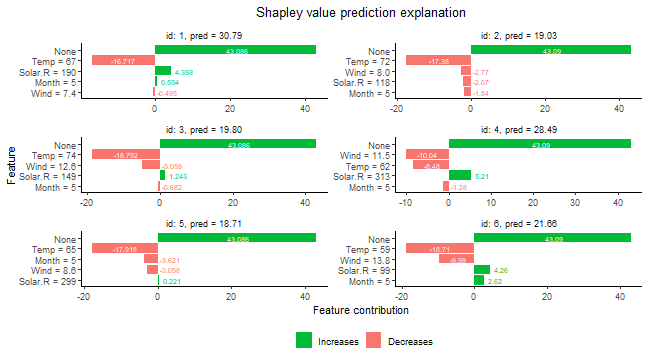

## Pre-trained vaeac {#pretrained_vaeac}
If the user has a pre-trained `vaeac` model (from a previous run), the user can send that to the `explain()` function
and `shapr` will skip the training of a new `vaeac` model and rather use the provided `vaeac` model. This is useful
if we want to explain new predictions using the same combinations/coalitions as previously, i.e., we have a new
`x_explain`. Note that the new `x_explain` must have the same features as before.

The `vaeac` model is accessible via `explanation$internal$parameters$vaeac`.
Note that if we let `'vS_detail' %in% verbose` in `explain()`, then `shapr` will give a message
that it loads a pretrained `vaeac` model instead of training it from scratch.

In this example, we extract the trained `vaeac` model from the previous example and send it to `explain()`.


``` r
# Send the pre-trained vaeac model
expl_pretrained_vaeac <- explain(
  model = model,
  x_explain = x_explain,
  x_train = x_train,
  approach = "vaeac",
  phi0 = phi0,
  seed = 1,
  n_MC_samples = n_MC_samples,
  vaeac.extra_parameters = list(
    vaeac.pretrained_vaeac_model = explanation$internal$parameters$vaeac
  )
)
#> 
#> ── Starting `shapr::explain()` at 2025-04-28 10:37:48 ──────────────────────────────────
#> ℹ Feature classes extracted from the model contains `NA`.
#>   Assuming feature classes from the data are correct.
#> ℹ `max_n_coalitions` is `NULL` or larger than or `2^n_features = 16`, and is therefore
#>   set to `2^n_features = 16`.
#> 
#> 
#> ── Explanation overview ──
#> 
#> 
#> 
#> • Model class: <xgb.Booster>
#> 
#> • Approach: vaeac
#> 
#> • Iterative estimation: FALSE
#> 
#> • Number of feature-wise Shapley values: 4
#> 
#> • Number of observations to explain: 6
#> 
#> • Computations (temporary) saved at: '/tmp/RtmplHDIbs/shapr_obj_3d3af181fb689.rds'
#> 
#> 
#> 
#> ── Main computation started ──
#> 
#> 
#> 
#> ℹ Using 16 of 16 coalitions.

# Check that this version provides the same Shapley values
all.equal(explanation$shapley_values_est, expl_pretrained_vaeac$shapley_values_est)
#> [1] TRUE
```

## Pre-trained vaeac (path) {#pretrained_vaeac_path}
We can also just provide a path to the stored `vaeac` model. This is beneficial if we have only stored the `vaeac`
model on the computer but not the whole `explanation` object. The possible save paths are stored in
`explanation$internal$parameters$vaeac$model`. Note that if we let `'vS_detail' %in% verbose` in `explain()`, then `shapr` will give
a message that it loads a pretrained `vaeac` model instead of training it from scratch.


``` r
# Call `explanation$internal$parameters$vaeac$model` to see possible vaeac models. We use `best` below.
# send the pre-trained vaeac path
expl_pretrained_vaeac_path <- explain(
  model = model,
  x_explain = x_explain,
  x_train = x_train,
  approach = "vaeac",
  phi0 = phi0,
  seed = 1,
  n_MC_samples = n_MC_samples,
  vaeac.extra_parameters = list(
    vaeac.pretrained_vaeac_model = explanation$internal$parameters$vaeac$models$best
  )
)
#> 
#> ── Starting `shapr::explain()` at 2025-04-28 10:37:52 ──────────────────────────────────
#> ℹ Feature classes extracted from the model contains `NA`.
#>   Assuming feature classes from the data are correct.
#> ℹ `max_n_coalitions` is `NULL` or larger than or `2^n_features = 16`, and is therefore
#>   set to `2^n_features = 16`.
#> 
#> 
#> ── Explanation overview ──
#> 
#> 
#> 
#> • Model class: <xgb.Booster>
#> 
#> • Approach: vaeac
#> 
#> • Iterative estimation: FALSE
#> 
#> • Number of feature-wise Shapley values: 4
#> 
#> • Number of observations to explain: 6
#> 
#> • Computations (temporary) saved at: '/tmp/RtmplHDIbs/shapr_obj_3d3af15887245.rds'
#> 
#> 
#> 
#> ── Main computation started ──
#> 
#> 
#> 
#> ℹ Using 16 of 16 coalitions.

# Check that this version provides the same Shapley values
all.equal(explanation$shapley_values_est, expl_pretrained_vaeac_path$shapley_values_est)
#> [1] TRUE
```


## Specified max_n_coalitions {#n_coalitions}

In this section, we discuss a general `shapr` parameter in the `explain()` function
that is method independent, namely, `max_n_coalitions`.
The user can limit the Shapley value computations to only a subset of coalitions by setting the
`max_n_coalitions` parameter to a value lower than $2^{n_\text{features}}$.

Note that we do not need to train a new `vaeac` model as we can use the one above trained on
all `16` coalitions as we are now only using a subset of them. This is not applicable the other
way around.


``` r
# send the pre-trained vaeac path
expl_batches_combinations <- explain(
  model = model,
  x_explain = x_explain,
  x_train = x_train,
  approach = "vaeac",
  phi0 = phi0,
  seed = 1,
  max_n_coalitions = 10,
  n_MC_samples = n_MC_samples,
  vaeac.extra_parameters = list(
    vaeac.pretrained_vaeac_model = explanation$internal$parameters$vaeac
  )
)
#> 
#> ── Starting `shapr::explain()` at 2025-04-28 10:37:57 ──────────────────────────────────
#> ℹ Feature classes extracted from the model contains `NA`.
#>   Assuming feature classes from the data are correct.
#> 
#> 
#> ── Explanation overview ──
#> 
#> 
#> 
#> • Model class: <xgb.Booster>
#> 
#> • Approach: vaeac
#> 
#> • Iterative estimation: FALSE
#> 
#> • Number of feature-wise Shapley values: 4
#> 
#> • Number of observations to explain: 6
#> 
#> • Computations (temporary) saved at: '/tmp/RtmplHDIbs/shapr_obj_3d3af6a8870aa.rds'
#> 
#> 
#> 
#> ── Main computation started ──
#> 
#> 
#> 
#> ℹ Using 10 of 16 coalitions.

# Gives different Shapley values as the latter one are only based on a subset of coalitions
plot_SV_several_approaches(list("Original" = explanation, "Other combi." = expl_batches_combinations))
```

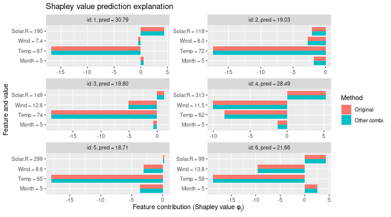

``` r

# Can compare that to the situation where we have exact computations (i.e., include all coalitions)
explanation$internal$objects$X
#> Index: <coalition_size>
#>     id_coalition coalitions coalitions_str coalition_size     N shapley_weight
#>            <int>     <list>         <char>          <int> <int>          <num>
#>  1:            1                                        0     1       1.00e+06
#>  2:            2          1              1              1     4       2.50e-01
#>  3:            3          2              2              1     4       2.50e-01
#>  4:            4          3              3              1     4       2.50e-01
#>  5:            5          4              4              1     4       2.50e-01
#>  6:            6        1,2            1 2              2     6       1.25e-01
#>  7:            7        1,3            1 3              2     6       1.25e-01
#>  8:            8        1,4            1 4              2     6       1.25e-01
#>  9:            9        2,3            2 3              2     6       1.25e-01
#> 10:           10        2,4            2 4              2     6       1.25e-01
#> 11:           11        3,4            3 4              2     6       1.25e-01
#> 12:           12      1,2,3          1 2 3              3     4       2.50e-01
#> 13:           13      1,2,4          1 2 4              3     4       2.50e-01
#> 14:           14      1,3,4          1 3 4              3     4       2.50e-01
#> 15:           15      2,3,4          2 3 4              3     4       2.50e-01
#> 16:           16    1,2,3,4        1 2 3 4              4     1       1.00e+06
#>     sample_freq features approach
#>          <lgcl>   <list>   <char>
#>  1:          NA              <NA>
#>  2:          NA        1    vaeac
#>  3:          NA        2    vaeac
#>  4:          NA        3    vaeac
#>  5:          NA        4    vaeac
#>  6:          NA      1,2    vaeac
#>  7:          NA      1,3    vaeac
#>  8:          NA      1,4    vaeac
#>  9:          NA      2,3    vaeac
#> 10:          NA      2,4    vaeac
#> 11:          NA      3,4    vaeac
#> 12:          NA    1,2,3    vaeac
#> 13:          NA    1,2,4    vaeac
#> 14:          NA    1,3,4    vaeac
#> 15:          NA    2,3,4    vaeac
#> 16:          NA  1,2,3,4     <NA>
```

Note that if we train a `vaeac` model from scratch with the setup above, then the `vaeac` model will not use
a missing completely as random (MCAR) mask generator, but rather a mask generator that ensures that the `vaeac`
model is only trained on the specified set of coalitions. In this case, it will be the set of the sampled coalitions.


``` r
expl_batches_combinations_2 <- explain(
  model = model,
  x_explain = x_explain,
  x_train = x_train,
  approach = "vaeac",
  phi0 = phi0,
  seed = 1,
  max_n_coalitions = 10,
  n_MC_samples = n_MC_samples,
  vaeac.n_vaeacs_initialize = 1,
  vaeac.epochs = 3,
  verbose = "vS_details"
)
#> 
#> ── Starting `shapr::explain()` at 2025-04-28 10:38:02 ──────────────────────────────────
#> 
#> ── Extra info about the pretrained vaeac model ──
#> 
#> Training the `vaeac` model with the provided parameters from scratch on CPU.
#> Using 'specified_masks_mask_generator' with '8' coalitions.
#> The vaeac model contains 17032 trainable parameters.
#> Initializing vaeac model number 1 of 1.
#> Best vaeac inititalization was number 1 (of 1) with a training VLB = -6.49 after 2
#> epochs. Continue to train this inititalization.
#> 
#> Results of the `vaeac` training process:
#> Best epoch:             3. 	VLB = -4.812 	IWAE = -3.235 	IWAE_running = -3.542
#> Best running avg epoch: 3. 	VLB = -4.812 	IWAE = -3.235 	IWAE_running = -3.542
#> Last epoch:             3. 	VLB = -4.812 	IWAE = -3.235 	IWAE_running = -3.542
#> ℹ The trained `vaeac` models are saved to folder '/tmp/RtmplHDIbs' at
#> '/tmp/RtmplHDIbs/X2025.04.28.10.38.02.066532_n_features_4_n_train_105_depth_3_width_32_latent_8_lr_0.001_epoch_best.pt'
#> '/tmp/RtmplHDIbs/X2025.04.28.10.38.02.066532_n_features_4_n_train_105_depth_3_width_32_latent_8_lr_0.001_epoch_best_running.pt'
#> '/tmp/RtmplHDIbs/X2025.04.28.10.38.02.066532_n_features_4_n_train_105_depth_3_width_32_latent_8_lr_0.001_epoch_last.pt'
```


## Paired sampling {#paired_sampling}

The `vaeac` approach can use paired sampling to improve the stability of the vaeac training procedure.
When using paired sampling, each observation in the training batches will be duplicated, but the first version will
be masked by $S$ and the second version will be masked by the complement $\bar{S}$. The mask are taken from the
`explanation$internal$objects$S` matrix. Note that `vaeac` does not check if the complement is also in said matrix.
This means that if the Shapley value explanations are computed based on a subset of coalitions, then the `vaeac` model might be trained on coalitions which are not used when
computing the Shapley values. This should not be considered as redundant training as it increases the stability and
performance of the `vaeac` model as a whole, hence, we recommend to use paired sampling (default). Furthermore, the masks
are randomly selected for each observation in the batch. The training time when using paired sampling is higher in
comparison to random sampling due to more complex implementation.


``` r
expl_paired_sampling_TRUE <- explain(
  model = model,
  x_explain = x_explain,
  x_train = x_train,
  approach = "vaeac",
  phi0 = phi0,
  seed = 1,
  n_MC_samples = n_MC_samples,
  vaeac.epochs = 10,
  vaeac.n_vaeacs_initialize = 1,
  vaeac.extra_parameters = list(vaeac.paired_sampling = TRUE)
)
#> 
#> ── Starting `shapr::explain()` at 2025-04-28 10:38:09 ──────────────────────────────────
#> ℹ Feature classes extracted from the model contains `NA`.
#>   Assuming feature classes from the data are correct.
#> ℹ `max_n_coalitions` is `NULL` or larger than or `2^n_features = 16`, and is therefore
#>   set to `2^n_features = 16`.
#> 
#> 
#> ── Explanation overview ──
#> 
#> 
#> 
#> • Model class: <xgb.Booster>
#> 
#> • Approach: vaeac
#> 
#> • Iterative estimation: FALSE
#> 
#> • Number of feature-wise Shapley values: 4
#> 
#> • Number of observations to explain: 6
#> 
#> • Computations (temporary) saved at: '/tmp/RtmplHDIbs/shapr_obj_3d3af4435fdf1.rds'
#> 
#> 
#> 
#> ── Main computation started ──
#> 
#> 
#> 
#> ℹ Using 16 of 16 coalitions.

expl_paired_sampling_FALSE <- explain(
  model = model,
  x_explain = x_explain,
  x_train = x_train,
  approach = "vaeac",
  phi0 = phi0,
  seed = 1,
  n_MC_samples = n_MC_samples,
  vaeac.epochs = 10,
  vaeac.n_vaeacs_initialize = 1,
  vaeac.extra_parameters = list(vaeac.paired_sampling = FALSE)
)
#> 
#> ── Starting `shapr::explain()` at 2025-04-28 10:38:22 ──────────────────────────────────
#> ℹ Feature classes extracted from the model contains `NA`.
#>   Assuming feature classes from the data are correct.
#> ℹ `max_n_coalitions` is `NULL` or larger than or `2^n_features = 16`, and is therefore
#>   set to `2^n_features = 16`.
#> ── Explanation overview ──
#> 
#> • Model class: <xgb.Booster>
#> • Approach: vaeac
#> • Iterative estimation: FALSE
#> • Number of feature-wise Shapley values: 4
#> • Number of observations to explain: 6
#> • Computations (temporary) saved at: '/tmp/RtmplHDIbs/shapr_obj_3d3af1578bc22.rds'
#> 
#> ── Main computation started ──
#> 
#> ℹ Using 16 of 16 coalitions.
```

We can compare the results by looking at the training and validation errors and by the $MSE_v$ evaluation criterion.
We do this by using the `plot_vaeac_eval_crit()` and `plot_MSEv_eval_crit()` functions in the `shapr` package,
respectively.

``` r
explanation_list <- list("Regular samp." = expl_paired_sampling_FALSE,
                         "Paired samp." = expl_paired_sampling_TRUE)
plot_vaeac_eval_crit(explanation_list, plot_type = "criterion")
```

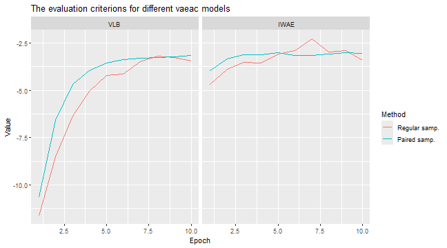

``` r
plot_MSEv_eval_crit(explanation_list)
```

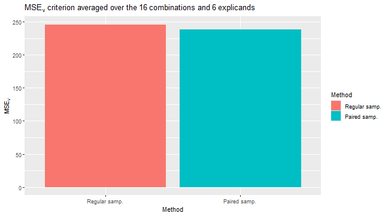

By looking at the time, we see that the paired version takes (a bit) longer time in the `setup_computation`
phase, that is, in the training phase.

``` r
rbind(
  "Paired" = expl_paired_sampling_TRUE$timing$overall_timing_secs,
  "Regular" = expl_paired_sampling_FALSE$timing$overall_timing_secs
)
#>            setup test_prediction main_computation finalize_explanation
#> Paired  0.102428        0.051176           12.255            0.0045943
#> Regular 0.086425        0.040192           10.653            0.0057290
```


## Progressr {#progress_bar}
As discussed in the general usage, the `shapr` package provides two ways for receiving information about the progress
of the approach. First, the `shapr` package provides progress updates of the computation of the Shapley values through
the `progressr` package. Second, the user can also get various form of information through `verbose` in `explain()`.
By letting `'vS_detail' %in% verbose`, we get extra information related to the `vaeac` approach.
The `verbose` parameter works independently of the `progressr` package.
Meaning that the user can chose to use none, either, or both options simultaneously.
We give two examples here, and refer the reader to the general usage for more detailed information.

By setting `c("basic", vS_details")`, we get both basic messages about the explanation case, and
messages about the estimation of the `vaeac` approach.

``` r
expl_with_messages <- explain(
  model = model,
  x_explain = x_explain,
  x_train = x_train,
  approach = "vaeac",
  phi0 = phi0,
  seed = 1,
  n_MC_samples = n_MC_samples,
  verbose = c("basic","vS_details"),
  vaeac.epochs = 5,
  vaeac.n_vaeacs_initialize = 2
)
#> 
#> ── Starting `shapr::explain()` at 2025-04-28 10:38:35 ──────────────────────────────────
#> ℹ Feature classes extracted from the model contains `NA`.
#>   Assuming feature classes from the data are correct.
#> ℹ `max_n_coalitions` is `NULL` or larger than or `2^n_features = 16`, and is therefore
#>   set to `2^n_features = 16`.
#> 
#> 
#> ── Explanation overview ──
#> 
#> 
#> 
#> • Model class: <xgb.Booster>
#> 
#> • Approach: vaeac
#> 
#> • Iterative estimation: FALSE
#> 
#> • Number of feature-wise Shapley values: 4
#> 
#> • Number of observations to explain: 6
#> 
#> • Computations (temporary) saved at: '/tmp/RtmplHDIbs/shapr_obj_3d3af2848a6b3.rds'
#> 
#> 
#> 
#> ── Main computation started ──
#> 
#> 
#> 
#> ℹ Using 16 of 16 coalitions. 
#> 
#> 
#> 
#> ── Extra info about the pretrained vaeac model ──
#> 
#> 
#> 
#> Training the `vaeac` model with the provided parameters from scratch on CPU.
#> 
#> Using 'mcar_mask_generator' with 'masking_ratio = 0.5'.
#> 
#> The vaeac model contains 17032 trainable parameters.
#> 
#> Initializing vaeac model number 1 of 2.
#> 
#> Initializing vaeac model number 2 of 2.
#> 
#> Best vaeac inititalization was number 2 (of 2) with a training VLB = -4.566 after 2
#> epochs. Continue to train this inititalization.
#> 
#> 
#> Results of the `vaeac` training process:
#> Best epoch:             5. 	VLB = -3.318 	IWAE = -3.049 	IWAE_running = -3.149
#> Best running avg epoch: 5. 	VLB = -3.318 	IWAE = -3.049 	IWAE_running = -3.149
#> Last epoch:             5. 	VLB = -3.318 	IWAE = -3.049 	IWAE_running = -3.149
#> 
#> ℹ The trained `vaeac` models are saved to folder '/tmp/RtmplHDIbs' at
#> '/tmp/RtmplHDIbs/X2025.04.28.10.38.35.704662_n_features_4_n_train_105_depth_3_width_32_latent_8_lr_0.001_epoch_best.pt'
#> '/tmp/RtmplHDIbs/X2025.04.28.10.38.35.704662_n_features_4_n_train_105_depth_3_width_32_latent_8_lr_0.001_epoch_best_running.pt'
#> '/tmp/RtmplHDIbs/X2025.04.28.10.38.35.704662_n_features_4_n_train_105_depth_3_width_32_latent_8_lr_0.001_epoch_last.pt'
```
For more visual information we can use the `progressr` package.
This can help us see detailed progress of the training step for the final `vaeac` model.
Note that by default `vS_details` is not part of `verbose`, meaning that we do not get any messages from the `vaeac`,
approach and only get the progress bars. See the general usage for examples for how to change the progress bar.


``` r
library(progressr)
progressr::handlers("cli") # Use `progressr::handlers("void")` to silence all `progressr` updates
progressr::with_progress({
  expl_with_progressr <- explain(
    model = model,
    x_explain = x_explain,
    x_train = x_train,
    approach = "vaeac",
    phi0 = phi0,
    seed = 1,
    n_MC_samples = n_MC_samples,
    verbose = "vS_details",
    vaeac.epochs = 5,
    vaeac.n_vaeacs_initialize = 2
  )
})
#> 
#> ── Starting `shapr::explain()` at 2025-04-28 10:38:46 ──────────────────────────────────
#> 
#> ── Extra info about the pretrained vaeac model ──
#> 
#> Training the `vaeac` model with the provided parameters from scratch on CPU.
#> Using 'mcar_mask_generator' with 'masking_ratio = 0.5'.
#> The vaeac model contains 17032 trainable parameters.
#> Initializing vaeac model number 1 of 2.
#> 
                                                                                         
Initializing vaeac model number 2 of 2.
#> ■■■■■■■■■■                        29% | Training vaeac (init. 1 of 2): Epoch: 2 | VLB: …

                                                                                         
Best vaeac inititalization was number 2 (of 2) with a training VLB = -4.566 after 2
#> epochs. Continue to train this inititalization.
#> ■■■■■■■■■■■■■■■■■■                57% | Training vaeac (init. 2 of 2): Epoch: 2 | VLB: …
#> Results of the `vaeac` training process:
#> Best epoch:             5. 	VLB = -3.318 	IWAE = -3.049 	IWAE_running = -3.149
#> Best running avg epoch: 5. 	VLB = -3.318 	IWAE = -3.049 	IWAE_running = -3.149
#> Last epoch:             5. 	VLB = -3.318 	IWAE = -3.049 	IWAE_running = -3.149
#> ℹ The trained `vaeac` models are saved to folder '/tmp/RtmplHDIbs' at
#> '/tmp/RtmplHDIbs/X2025.04.28.10.38.45.850289_n_features_4_n_train_105_depth_3_width_32_latent_8_lr_0.001_epoch_best.pt'
#> '/tmp/RtmplHDIbs/X2025.04.28.10.38.45.850289_n_features_4_n_train_105_depth_3_width_32_latent_8_lr_0.001_epoch_best_running.pt'
#> '/tmp/RtmplHDIbs/X2025.04.28.10.38.45.850289_n_features_4_n_train_105_depth_3_width_32_latent_8_lr_0.001_epoch_last.pt'
all.equal(expl_with_messages$shapley_values_est, expl_with_progressr$shapley_values_est)
#> [1] TRUE
```

## Continue the training of the vaeac approach {#continue_training}

In the case the user has set a too low number of training epochs and sees that the network is still learning,
then the user can continue to train the network from where it stopped. Thus, a good workflow can therefore
be to call the `explain()` function with a `n_MC_samples = 1` (to not waste to much time to generate MC samples),
then look at the training and evaluation plots of the `vaeac`. If not satisfied, then train more. If satisfied,
then call the `explain()` function again but this time by using the extra parameter `vaeac.pretrained_vaeac_model`,
as illustrated above. Note that we have set the number of `vaeac.epochs` to be very low in this example and we
recommend to use many more epochs.

We can compare the results by looking at the training and validation errors and by the $MSE_v$ evaluation criterion.
We do this by using the `plot_vaeac_eval_crit()` and `plot_MSEv_eval_crit()` functions in the `shapr` package,
respectively. We also use the `plot_vaeac_imputed_ggpairs()` function which generates samples from $p(x)$, this
is meant as a sanity check to see that the `vaeac` model is able to follow the general structure/distribution of the
data. However, recall that the `vaeac` model is never trained on the empty coalition, so the produced samples should be taken with a grain of salt.


``` r
expl_little_training <- explain(
  model = model,
  x_explain = x_explain,
  x_train = x_train,
  approach = "vaeac",
  phi0 = phi0,
  seed = 1,
  n_MC_samples = 250,
  vaeac.epochs = 3,
  vaeac.n_vaeacs_initialize = 2
)

# Look at the training and validation errors. Not happy and want to train more.
plot_vaeac_eval_crit(list("Original" = expl_little_training), plot_type = "method")
```

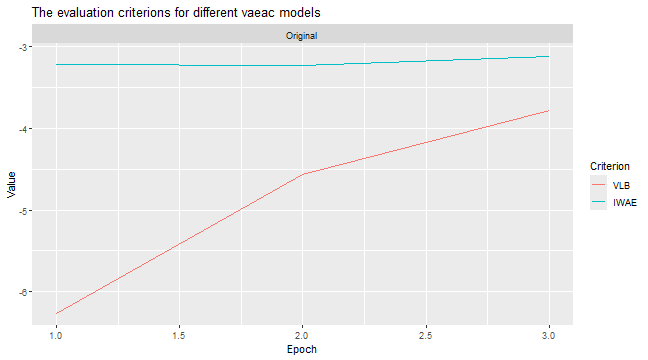

``` r
# Can also see how well vaeac generates data from the full joint distribution. Quite good.
plot_vaeac_imputed_ggpairs(
  explanation = expl_little_training,
  which_vaeac_model = "best",
  x_true = x_train
) + ggplot2::labs(title = NULL)
```

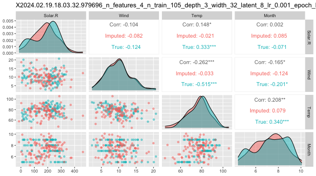

``` r
# Make a copy of the explanation object and continue to train the vaeac model some more epochs
expl_train_more <- expl_little_training
expl_train_more$internal$parameters$vaeac <-
  vaeac_train_model_continue(
    explanation = expl_train_more,
    epochs_new = 5,
    x_train = x_train
  )

# Compute the Shapley values again but this time using the extra trained vaeac model
expl_train_more_vaeac <- explain(
  model = model,
  x_explain = x_explain,
  x_train = x_train,
  approach = "vaeac",
  phi0 = phi0,
  seed = 1,
  n_MC_samples = 250,
  vaeac.extra_parameters = list(
    vaeac.pretrained_vaeac_model = expl_train_more$internal$parameters$vaeac
  )
)

# Look at the training and validation errors and conclude that we want to train some more
plot_vaeac_eval_crit(
  list("Original" = expl_little_training, "More epochs" = expl_train_more),
  plot_type = "method"
)
```

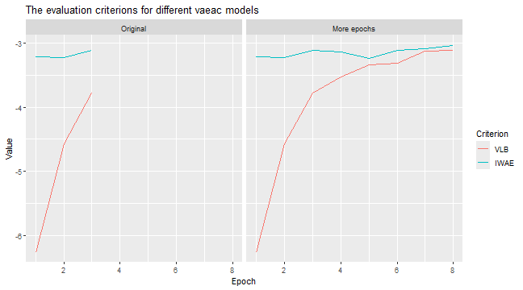

``` r
# Continue to train the vaeac model some more epochs
expl_train_even_more <- expl_train_more
expl_train_even_more$internal$parameters$vaeac <-
  vaeac_train_model_continue(
    explanation = expl_train_even_more,
    epochs_new = 10,
    x_train = x_train
  )

# Compute the Shapley values again but this time using the even more trained vaeac model
expl_train_even_more_vaeac <- explain(
  model = model,
  x_explain = x_explain,
  x_train = x_train,
  approach = "vaeac",
  phi0 = phi0,
  seed = 1,
  n_MC_samples = 250,
  vaeac.extra_parameters = list(
    vaeac.pretrained_vaeac_model = expl_train_even_more$internal$parameters$vaeac
  )
)

# Look at the training and validation errors.
plot_vaeac_eval_crit(
  list(
    "Original" = expl_little_training,
    "More epochs" = expl_train_more,
    "Even more epochs" = expl_train_even_more
  ),
  plot_type = "method"
)
```

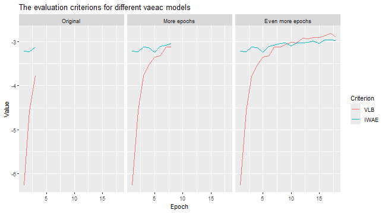

``` r
# Can also see how well vaeac generates data from the full joint distribution
plot_vaeac_imputed_ggpairs(
  explanation = expl_train_even_more,
  which_vaeac_model = "best",
  x_true = x_train
) + ggplot2::labs(title = NULL)
```


We can see that the extra training has decreased the MSEv score. The Shapley value explanations have also
changed, but they are often comparable.

``` r
plot_MSEv_eval_crit(list(
  "Few epochs" = expl_little_training,
  "More epochs" = expl_train_more_vaeac,
  "Even more epochs" = expl_train_even_more_vaeac
))
```

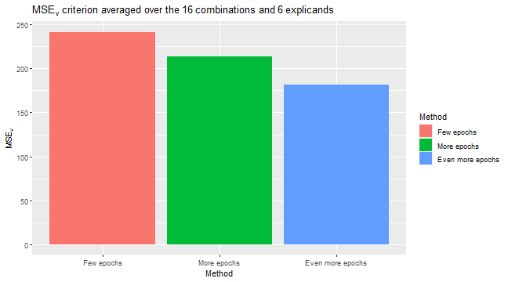

``` r
# We see that the Shapley values have changed, but they are often comparable
plot_SV_several_approaches(list(
  "Few epochs" = expl_little_training,
  "More epochs" = expl_train_more_vaeac,
  "Even more epochs" = expl_train_even_more_vaeac
))
```

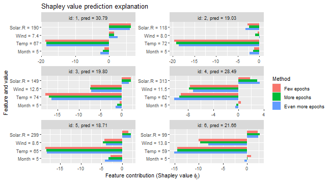


## Vaeac with early stopping {#early_stopping}
If we do not want to specify the number of `epochs`, as we are uncertain how many `epochs` it will take before the
`vaeac` model is properly trained, a good choice is to rather use early stopping. This means that we can set
`vaeac.epochs` to a large number and let `vaeac.epochs_early_stopping` be for example `5`. This means that the `vaeac`
model will stop the training procedure if there has been no improvement in the validation score for `5` epochs.


``` r
# Low value for `vaeac.epochs_early_stopping` here to build the vignette faster
expl_early_stopping <- explain(
  model = model,
  x_explain = x_explain,
  x_train = x_train,
  approach = "vaeac",
  phi0 = phi0,
  seed = 1,
  n_MC_samples = 250,
  verbose = c("basic","vS_details"),
  vaeac.epochs = 1000, # Set it to a big number
  vaeac.n_vaeacs_initialize = 2,
  vaeac.extra_parameters = list(vaeac.epochs_early_stopping = 2)
)
#> 
#> ── Starting `shapr::explain()` at 2025-04-28 10:40:51 ──────────────────────────────────
#> ℹ Feature classes extracted from the model contains `NA`.
#>   Assuming feature classes from the data are correct.
#> ℹ `max_n_coalitions` is `NULL` or larger than or `2^n_features = 16`, and is therefore
#>   set to `2^n_features = 16`.
#> 
#> 
#> ── Explanation overview ──
#> 
#> 
#> 
#> • Model class: <xgb.Booster>
#> 
#> • Approach: vaeac
#> 
#> • Iterative estimation: FALSE
#> 
#> • Number of feature-wise Shapley values: 4
#> 
#> • Number of observations to explain: 6
#> 
#> • Computations (temporary) saved at: '/tmp/RtmplHDIbs/shapr_obj_3d3af5a9f8eb7.rds'
#> 
#> 
#> 
#> ── Main computation started ──
#> 
#> 
#> 
#> ℹ Using 16 of 16 coalitions. 
#> 
#> 
#> 
#> ── Extra info about the pretrained vaeac model ──
#> 
#> 
#> 
#> Training the `vaeac` model with the provided parameters from scratch on CPU.
#> 
#> Using 'mcar_mask_generator' with 'masking_ratio = 0.5'.
#> 
#> The vaeac model contains 17032 trainable parameters.
#> 
#> Initializing vaeac model number 1 of 2.
#> 
#> Initializing vaeac model number 2 of 2.
#> 
#> Best vaeac inititalization was number 2 (of 2) with a training VLB = -4.566 after 2
#> epochs. Continue to train this inititalization.
#> 
#> No IWAE improvment in 2 epochs. Apply early stopping at epoch 14.
#> 
#> 
#> Results of the `vaeac` training process:
#> Best epoch:             12. 	VLB = -2.958 	IWAE = -2.930 	IWAE_running = -2.991
#> Best running avg epoch: 12. 	VLB = -2.958 	IWAE = -2.930 	IWAE_running = -2.991
#> Last epoch:             14. 	VLB = -2.971 	IWAE = -2.955 	IWAE_running = -2.996
#> 
#> ℹ The trained `vaeac` models are saved to folder '/tmp/RtmplHDIbs' at
#> '/tmp/RtmplHDIbs/X2025.04.28.10.40.51.046656_n_features_4_n_train_105_depth_3_width_32_latent_8_lr_0.001_epoch_best.pt'
#> '/tmp/RtmplHDIbs/X2025.04.28.10.40.51.046656_n_features_4_n_train_105_depth_3_width_32_latent_8_lr_0.001_epoch_best_running.pt'
#> '/tmp/RtmplHDIbs/X2025.04.28.10.40.51.046656_n_features_4_n_train_105_depth_3_width_32_latent_8_lr_0.001_epoch_last.pt'

# Look at the training and validation errors. We are quite happy with it.
plot_vaeac_eval_crit(
  list("Vaeac early stopping" = expl_early_stopping),
  plot_type = "method"
)
```

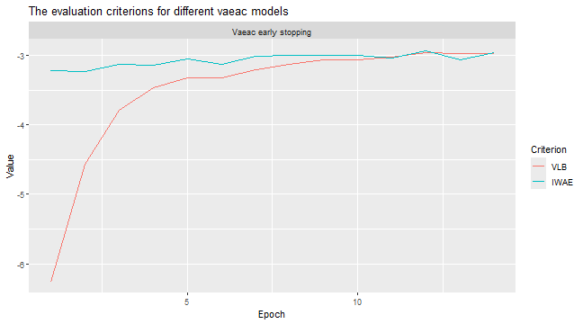

However, we can train it further for a fixed amount of epochs if desired. This can be in a setting where we are not
happy with the IWAE curve or we feel that we set `vaeac.epochs_early_stopping` to a too low value or if the max
number of epochs (`vaeac.epochs`) were reached.

``` r
# Make a copy of the explanation object which we are to train further.
expl_early_stopping_train_more <- expl_early_stopping

# Continue to train the vaeac model some more epochs
expl_early_stopping_train_more$internal$parameters$vaeac <-
  vaeac_train_model_continue(
    explanation = expl_early_stopping_train_more,
    epochs_new = 15,
    x_train = x_train,
    verbose = NULL
  )

# Can even do it twice if desired
expl_early_stopping_train_more$internal$parameters$vaeac <-
  vaeac_train_model_continue(
    explanation = expl_early_stopping_train_more,
    epochs_new = 10,
    x_train = x_train,
    verbose = NULL
  )

# Look at the training and validation errors. We see some improvement
plot_vaeac_eval_crit(
  list(
    "Vaeac early stopping" = expl_early_stopping,
    "Vaeac early stopping more epochs" = expl_early_stopping_train_more
  ),
  plot_type = "method"
)
```

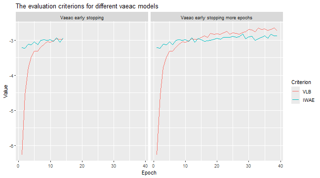

We can then use the extra trained version to compute the Shapley value explanations and compare it with the previous
version that used early stopping. We see a non-significant difference.

``` r
# Use extra trained vaeac model to compute Shapley values again.
expl_early_stopping_train_more <- explain(
  model = model,
  x_explain = x_explain,
  x_train = x_train,
  approach = "vaeac",
  phi0 = phi0,
  seed = 1,
  n_MC_samples = 250,
  vaeac.extra_parameters = list(
    vaeac.pretrained_vaeac_model = expl_early_stopping_train_more$internal$parameters$vaeac
  )
)
#> 
#> ── Starting `shapr::explain()` at 2025-04-28 10:41:58 ──────────────────────────────────
#> ℹ Feature classes extracted from the model contains `NA`.
#>   Assuming feature classes from the data are correct.
#> ℹ `max_n_coalitions` is `NULL` or larger than or `2^n_features = 16`, and is therefore
#>   set to `2^n_features = 16`.
#> 
#> 
#> ── Explanation overview ──
#> 
#> 
#> 
#> • Model class: <xgb.Booster>
#> 
#> • Approach: vaeac
#> 
#> • Iterative estimation: FALSE
#> 
#> • Number of feature-wise Shapley values: 4
#> 
#> • Number of observations to explain: 6
#> 
#> • Computations (temporary) saved at: '/tmp/RtmplHDIbs/shapr_obj_3d3af3d83d124.rds'
#> 
#> 
#> 
#> ── Main computation started ──
#> 
#> 
#> 
#> ℹ Using 16 of 16 coalitions.

# We can compare their MSEv scores
plot_MSEv_eval_crit(list(
  "Vaeac early stopping" = expl_early_stopping,
  "Vaeac early stopping more epochs" = expl_early_stopping_train_more
))
```

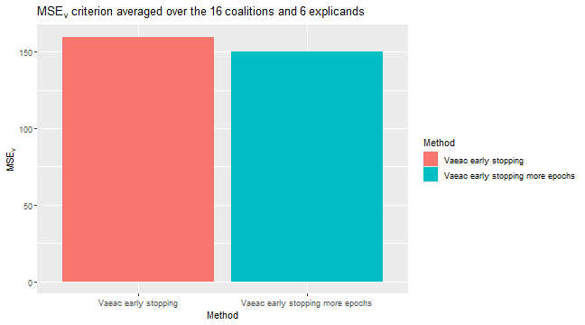

``` r
# We see that the Shapley values have changed, but only slightly
plot_SV_several_approaches(list(
  "Vaeac early stopping" = expl_early_stopping,
  "Vaeac early stopping more epochs" = expl_early_stopping_train_more
))
```

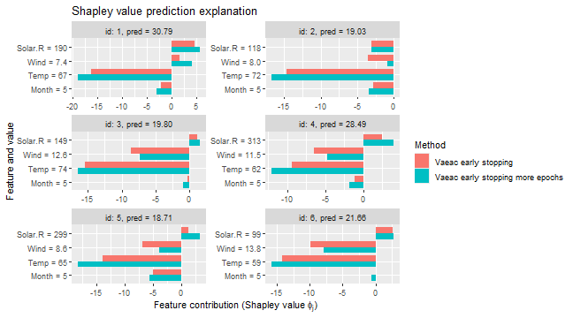


## Grouping of features {#grouping_of_features}
When we train a `vaeac` model to explain groups of features, then the `vaeac` model will use
the "Specified_masks_mask_generator" which ensures that the `vaeac` model only train on a specified set of coalitions.
In this case, it will ensure that all features in group A will always either be conditioned on or be unconditioned.
The same goes for group B. Note that in this setup, there are only `4` possible coalitions, but `vaeac` only train on
`2` coalitions as the empty and grand coalitions as they are not needed in the Shapley value computations.


``` r
expl_group <- explain(
  model = model,
  x_explain = x_explain,
  x_train = x_train,
  approach = "vaeac",
  phi0 = phi0,
  seed = 1,
  group = list(A = c("Temp", "Month"), B = c("Wind", "Solar.R")),
  n_MC_samples = n_MC_samples,
  verbose = "vS_details",
  vaeac.epochs = 4,
  vaeac.n_vaeacs_initialize = 2
)
#> 
#> ── Starting `shapr::explain()` at 2025-04-28 10:42:31 ──────────────────────────────────
#> 
#> ── Extra info about the pretrained vaeac model ──
#> 
#> Training the `vaeac` model with the provided parameters from scratch on CPU.
#> Using 'specified_masks_mask_generator' with '2' coalitions.
#> The vaeac model contains 17032 trainable parameters.
#> Initializing vaeac model number 1 of 2.
#> Initializing vaeac model number 2 of 2.
#> Best vaeac inititalization was number 2 (of 2) with a training VLB = -4.814 after 2
#> epochs. Continue to train this inititalization.
#> 
#> Results of the `vaeac` training process:
#> Best epoch:             3. 	VLB = -3.935 	IWAE = -3.124 	IWAE_running = -3.267
#> Best running avg epoch: 4. 	VLB = -3.619 	IWAE = -3.138 	IWAE_running = -3.235
#> Last epoch:             4. 	VLB = -3.619 	IWAE = -3.138 	IWAE_running = -3.235
#> ℹ The trained `vaeac` models are saved to folder '/tmp/RtmplHDIbs' at
#> '/tmp/RtmplHDIbs/X2025.04.28.10.42.30.699512_n_features_4_n_train_105_depth_3_width_32_latent_8_lr_0.001_epoch_best.pt'
#> '/tmp/RtmplHDIbs/X2025.04.28.10.42.30.699512_n_features_4_n_train_105_depth_3_width_32_latent_8_lr_0.001_epoch_best_running.pt'
#> '/tmp/RtmplHDIbs/X2025.04.28.10.42.30.699512_n_features_4_n_train_105_depth_3_width_32_latent_8_lr_0.001_epoch_last.pt'

# Plot the resulting explanations
plot(expl_group)
```

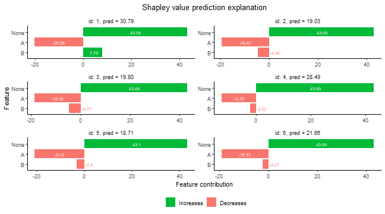


## Mixed Data {#mixed_data}
Here we look at a setup with mixed data, i.e., the data contains both categorical and continuous features.
First we set up the data and the model.

``` r
library(ranger)
#> ranger 0.17.0 using 2 threads (default). Change with num.threads in ranger() and predict(), options(Ncpus = N), options(ranger.num.threads = N) or environment variable R_RANGER_NUM_THREADS.
data <- data.table::as.data.table(airquality)
data <- data[complete.cases(data), ]

# convert the month variable to a factor
data[, Month_factor := as.factor(Month)]

x_var_cat <- c("Solar.R", "Wind", "Temp", "Month_factor")
y_var <- "Ozone"

ind_x_explain <- 1:6

data_train_cat <- data[-ind_x_explain, ]
x_train_cat <- data_train_cat[, ..x_var_cat]
x_explain_cat <- data[ind_x_explain, ][, ..x_var_cat]

# Fit a random forest model to the training data
model <- ranger(as.formula(paste0(y_var, " ~ ", paste0(x_var_cat, collapse = " + "))),
  data = data_train_cat
)

# Specifying the phi_0, i.e. the expected prediction without any features
phi0 <- mean(data_train_cat[, get(y_var)])
```
Then we compute explanations using the `ctree` and `vaeac` approaches. For the `vaeac` approach, we
consider two setups: the default architecture, and a simpler one without skip connections. We do this
to illustrate that the skip connections improve the `vaeac` method. We use `ctree` with default parameters.


``` r
# Here we use the ctree approach
expl_ctree <- explain(
  model = model,
  x_explain = x_explain_cat,
  x_train = x_train_cat,
  approach = "ctree",
  phi0 = phi0,
  seed = 1,
  n_MC_samples = 250
)
#> 
#> ── Starting `shapr::explain()` at 2025-04-28 10:42:39 ──────────────────────────────────
#> ℹ Feature classes extracted from the model contains `NA`.
#>   Assuming feature classes from the data are correct.
#> ℹ `max_n_coalitions` is `NULL` or larger than or `2^n_features = 16`, and is therefore
#>   set to `2^n_features = 16`.
#> 
#> 
#> ── Explanation overview ──
#> 
#> 
#> 
#> • Model class: <ranger>
#> 
#> • Approach: ctree
#> 
#> • Iterative estimation: FALSE
#> 
#> • Number of feature-wise Shapley values: 4
#> 
#> • Number of observations to explain: 6
#> 
#> • Computations (temporary) saved at: '/tmp/RtmplHDIbs/shapr_obj_3d3af53945745.rds'
#> 
#> 
#> 
#> ── Main computation started ──
#> 
#> 
#> 
#> ℹ Using 16 of 16 coalitions.

# Then we use the vaeac approach
expl_vaeac_with <- explain(
  model = model,
  x_explain = x_explain_cat,
  x_train = x_train_cat,
  approach = "vaeac",
  phi0 = phi0,
  seed = 1,
  n_MC_samples = 250,
  vaeac.epochs = 50,
  vaeac.n_vaeacs_initialize = 4
)
#> 
#> ── Starting `shapr::explain()` at 2025-04-28 10:42:40 ──────────────────────────────────
#> ℹ Feature classes extracted from the model contains `NA`.
#>   Assuming feature classes from the data are correct.
#> ℹ `max_n_coalitions` is `NULL` or larger than or `2^n_features = 16`, and is therefore
#>   set to `2^n_features = 16`.
#> ── Explanation overview ──
#> 
#> • Model class: <ranger>
#> • Approach: vaeac
#> • Iterative estimation: FALSE
#> • Number of feature-wise Shapley values: 4
#> • Number of observations to explain: 6
#> • Computations (temporary) saved at: '/tmp/RtmplHDIbs/shapr_obj_3d3af5463b7ec.rds'
#> 
#> ── Main computation started ──
#> 
#> ℹ Using 16 of 16 coalitions.

# Then we use the vaeac approach
expl_vaeac_without <- explain(
  model = model,
  x_explain = x_explain_cat,
  x_train = x_train_cat,
  approach = "vaeac",
  phi0 = phi0,
  seed = 1,
  n_MC_samples = 250,
  vaeac.epochs = 50,
  vaeac.n_vaeacs_initialize = 4,
  vaeac.extra_parameters = list(
    vaeac.skip_conn_layer = FALSE,
    vaeac.skip_conn_masked_enc_dec = FALSE
  )
)
#> 
#> ── Starting `shapr::explain()` at 2025-04-28 10:43:58 ──────────────────────────────────
#> ℹ Feature classes extracted from the model contains `NA`.
#>   Assuming feature classes from the data are correct.
#> ℹ `max_n_coalitions` is `NULL` or larger than or `2^n_features = 16`, and is therefore
#>   set to `2^n_features = 16`.
#> ── Explanation overview ──
#> 
#> • Model class: <ranger>
#> • Approach: vaeac
#> • Iterative estimation: FALSE
#> • Number of feature-wise Shapley values: 4
#> • Number of observations to explain: 6
#> • Computations (temporary) saved at: '/tmp/RtmplHDIbs/shapr_obj_3d3af42f9d274.rds'
#> 
#> ── Main computation started ──
#> 
#> ℹ Using 16 of 16 coalitions.

# We see that the `vaeac` model without the skip connections perform worse
plot_vaeac_eval_crit(
  list(
    "Vaeac w.o. skip-con." = expl_vaeac_without,
    "Vaeac w. skip-con." = expl_vaeac_with
  ),
  plot_type = "criterion"
)
```

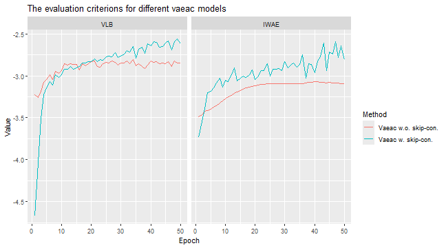

``` r
# The vaeac model with skip connections have the lowest/best MSE_Frye evaluation criterion score
plot_MSEv_eval_crit(list(
  "Vaeac w.o. skip-con." = expl_vaeac_without,
  "Vaeac w. skip-con." = expl_vaeac_with,
  "Ctree" = expl_ctree
))
```

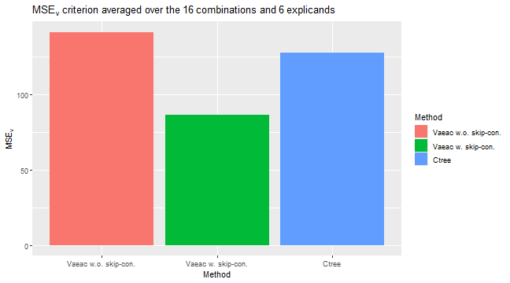

``` r
# Can compare the Shapley values. Ctree and vaeac with skip connections produce similar explanations.
plot_SV_several_approaches(
  list(
    "Vaeac w.o. skip-con." = expl_vaeac_without,
    "Vaeac w. skip-con." = expl_vaeac_with,
    "Ctree" = expl_ctree
  ),
  index_explicands = 1:6
)
```

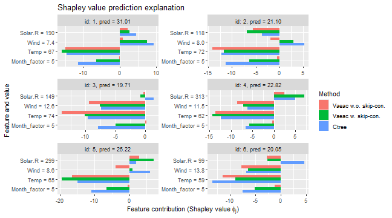
